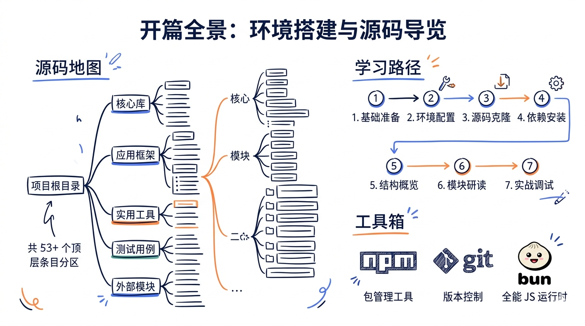
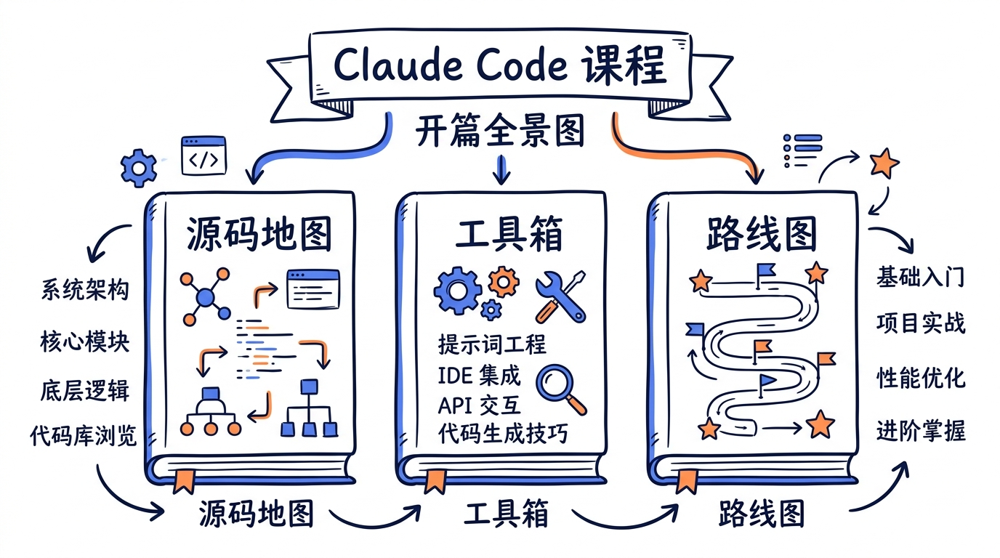
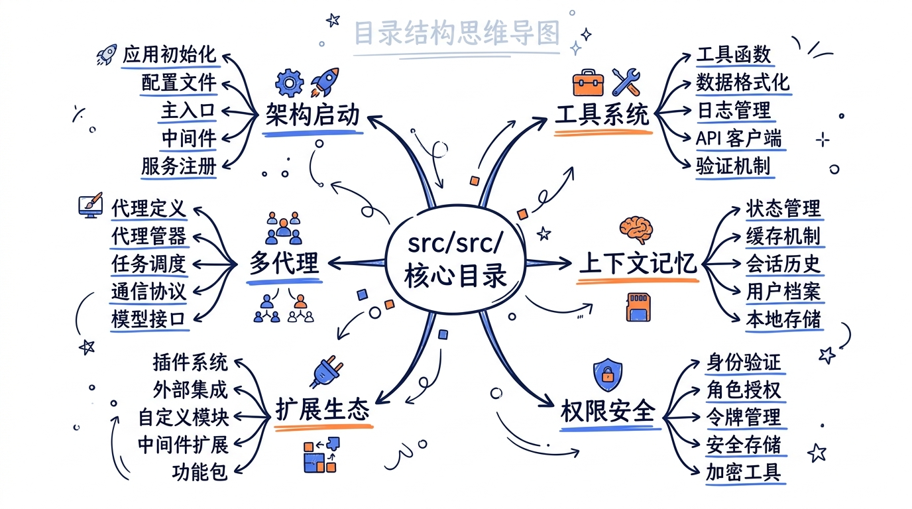
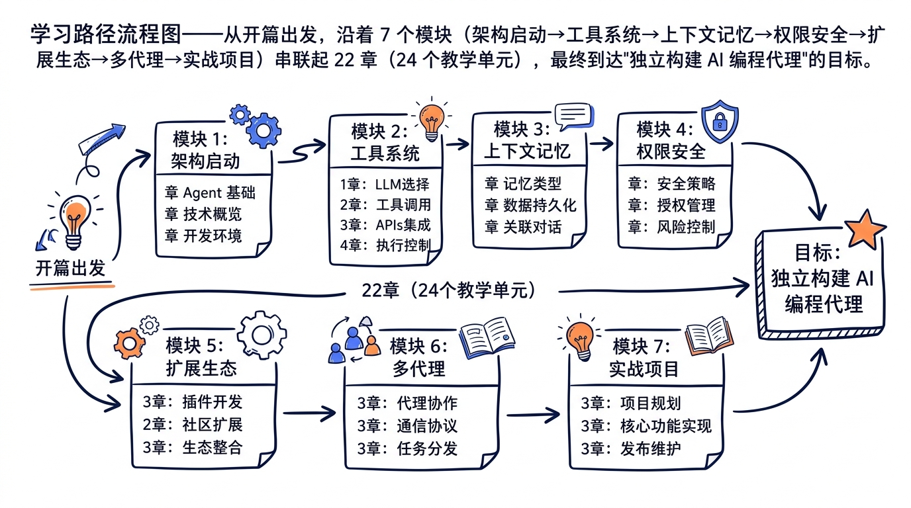

---
layout: default
title: "课前准备——环境搭建与源码导览"
nav_order: 2
---


# 开篇：课前准备——环境搭建与源码导览



> 工欲善其事，必先利其器。在正式进入 Claude Code 源码的世界之前，我们先把工作台打理好，建立一份属于自己的"地图"。

## 学习目标

- 把 Claude Code v2.1.88 源码拉到本地，能编译、能运行、能打断点
- 建立对全部 53 个顶层条目（35 目录 + 18 文件）的全景认知，知道每个条目"是干什么的"
- 掌握三种适配 AI 编程代理这种大型 TypeScript 工程的源码阅读方法
- 看懂本课程的学习路径，明白每个模块的目标与时间投入



---

## 0.1 本课程基于的源码版本

| 项目 | 信息 |
|------|------|
| Claude Code 版本 | **v2.1.88** |
| 包名 | `@anthropic-ai/claude-code` |
| 本地源码路径 | `/Users/johndoe/codes/claude-code-sourcecodes/src/` |
| 入口文件 | `src/entrypoints/cli.tsx`、`src/main.tsx`、`src/query.ts` |
| 主要语言 | TypeScript（含 .tsx 用于 React/Ink UI） |

> **为什么选 v2.1.88？** 这是 2.x 大版本中相对稳定、特性集成度最高的发布版。Agent Teams、Coordinator Mode、Routines、Remote Control 都已经合入，但还没有受到 3.x 大重构的影响。后续即便 Anthropic 发布新版本，本课程讲解的核心架构和设计思想都不会过时——Tool 接口、AsyncGenerator 流式架构、MCP 协议、上下文压缩策略，这些是会延续的"沉淀层"。

---

## 0.2 获取源码的两种方式

### 方式一：直接从已安装的 npm 包提取（推荐）

如果你已经在本地安装了 Claude Code（无论全局还是项目内），它的源码就藏在 npm 包里。

```bash
# 全局安装（如果还没装）
npm install -g @anthropic-ai/claude-code

# 找到 npm 全局路径
npm root -g
# 输出类似：/usr/local/lib/node_modules

# 进入 Claude Code 包
cd $(npm root -g)/@anthropic-ai/claude-code
ls -la
```

发布到 npm 的代码经过了 bundling 和轻度混淆，但**类型定义、文件结构、关键函数命名**都保留了。本课程随附的源码就是从这里提取并整理的。

### 方式二：使用本课程提供的整理过的源码

为了方便学习，我们已经把源码整理到：

```
/Users/johndoe/codes/claude-code-sourcecodes/src/src/
```

整理工作包括：
- 重新组织目录结构使其更清晰
- 拆分被 bundling 合并到一起的多个模块
- 保留所有重要类型定义与 JSDoc 注释

> **学习建议**：本课程所有源码引用都基于"整理过的源码"路径。你可以直接用这份代码跟随每章对照阅读，不必担心 bundling 造成的可读性问题。

---

## 0.3 项目目录结构全景

`src/src/` 目录下有 53 个顶层条目（35 目录 + 18 文件）。下面按"职责分区"分类，每一类都对应课程的某一个或几个模块。



### 分区 1：入口与核心引擎（→ 模块一）

| 路径 | 用途 | 主要章节 |
|------|------|---------|
| `cli.tsx` | CLI 命令注册（Commander.js） | Ch02 |
| `main.tsx` | 主流程入口、四阶段初始化 | Ch02 |
| `setup.ts` | 项目上下文加载、安全策略、MCP 连接 | Ch02 |
| `query.ts` | Agent 主循环 `while(true)` | Ch03 |
| `QueryEngine.ts` | Query 引擎类（`query()` 的封装） | Ch03 |
| `Tool.ts` | Tool 接口定义（约 13 个核心字段） | Ch04 |
| `Task.ts` | Task 类型定义 | Ch16 |
| `commands.ts`、`tools.ts`、`tasks.ts` | 顶层注册器 | Ch04、Ch16 |

### 分区 2：工具实现（→ 模块二）

| 路径 | 用途 | 主要章节 |
|------|------|---------|
| `tools/` | **40 个工具目录**（外加 `shared/`、`testing/`、`utils.ts` 等支持目录） | Ch04–Ch05 |
| `tools/BashTool/` | Shell 沙箱执行 | Ch05 |
| `tools/FileEditTool/` | 精准文件编辑 | Ch05 |
| `tools/FileReadTool/` | 多格式文件读取 | Ch05 |
| `tools/AgentTool/` | 子代理启动器（含 `built-in/` 子目录，共 15+ 个文件） | Ch05、Ch16 |
| `tools/GrepTool/`、`tools/GlobTool/` | 代码搜索 | Ch05 |
| `tools/WebFetchTool/`、`tools/WebSearchTool/` | 网络能力 | Ch05 |
| `tools/MCPTool/`、`tools/ListMcpResourcesTool/` 等 | MCP 集成 | Ch12 |
| `tools/SkillTool/`、`tools/ToolSearchTool/` | Skill 与延迟加载 | Ch13 |
| `tools/SendMessageTool/`、`tools/TaskCreateTool/` 等 | 多代理协作 | Ch16 |
| `services/tools/` | 工具编排：StreamingToolExecutor、toolOrchestration | Ch06 |

### 分区 3：上下文与记忆（→ 模块三）

| 路径 | 用途 | 主要章节 |
|------|------|---------|
| `context/`、`context.ts` | 上下文组装核心 | Ch07 |
| `services/compact/` | **11 个文件**：四种压缩策略 | Ch08 |
| `services/SessionMemory/` | 会话记忆 | Ch09 |
| `services/extractMemories/` | 记忆提取 | Ch09 |
| `services/MagicDocs/` | 智能文档发现 | Ch09 |
| `services/AgentSummary/` | 子代理摘要 | Ch09 |
| `services/PromptSuggestion/` | Prompt 建议 | Ch09 |
| `services/autoDream/` | DreamTask（后台记忆整理） | Ch09、Ch16 |
| `memdir/` | 记忆目录管理 | Ch09 |

### 分区 4：权限与安全（→ 模块四）

| 路径 | 用途 | 主要章节 |
|------|------|---------|
| `hooks/` | Hook 系统主目录 | Ch11 |
| `hooks/toolPermission/handlers/` | 三种权限处理器 | Ch10 |
| `utils/hooks/` | Hook 基础设施（hookHelpers、sessionHooks、AsyncHookRegistry 等 17 个文件） | Ch11 |
| `services/mcp/channelPermissions.ts` | 通道权限（远程批准） | Ch10 |

### 分区 5：扩展与生态（→ 模块五）

| 路径 | 用途 | 主要章节 |
|------|------|---------|
| `services/mcp/` | **25+ 个文件**：MCP 客户端核心 | Ch12 |
| `services/mcp/client.ts` | MCP 客户端主体（~3300 行） | Ch12 |
| `services/mcp/auth.ts` | OAuth 认证 | Ch12 |
| `services/mcp/InProcessTransport.ts` | 进程内传输 | Ch12 |
| `skills/` | Skill 系统 | Ch13 |
| `plugins/`、`services/plugins/` | Plugin 系统 | Ch14 |
| `commands/` | **86 个 Slash Commands** | Ch14 |
| `ink/`、`ink.ts` | React/Ink 终端 UI | Ch15 |
| `state/` | AppState 全局状态 | Ch15 |
| `screens/` | 屏幕级 UI 组件 | Ch15 |
| `components/` | 通用 UI 组件 | Ch15 |
| `vim/`、`keybindings/` | Vim 模拟器 + Keybindings（4,672 行） | Ch15 |
| `buddy/` | Companion Sprite 伴侣模式（1,298 行） | Ch15 |
| `voice/`、`services/voice*` | 语音输入（1,229 行） | Ch15 |

### 分区 6：多代理与高级主题（→ 模块六）

| 路径 | 用途 | 主要章节 |
|------|------|---------|
| `tasks/` | **7 种 Task 类型** | Ch16 |
| `utils/swarm/` | **14 个文件**：Swarm 系统 | Ch16 |
| `coordinator/coordinatorMode.ts` | Coordinator 模式 | Ch16 |
| `services/analytics/` | 匿名遥测 | Ch17 |
| `cost-tracker.ts`、`costHook.ts` | 成本追踪（345 行） | Ch08、Ch17 |
| `services/lsp/` | LSP 集成 | Ch17 |
| `entrypoints/sdk/` | SDK 入口（`controlSchemas.ts` 等） | Ch18 |
| `bridge/` | 桥接子系统（12,613 行） | Ch19 |
| `remote/` | 远程控制（1,127 行） | Ch19 |

### 分区 7：辅助基础设施（贯穿全课程）

| 路径 | 用途 |
|------|------|
| `utils/` | 通用工具函数（auth、permissions、messages 等） |
| `schemas/`、`types/` | 全局类型定义 |
| `assistant/` | 助手相关辅助逻辑 |
| `bootstrap/` | 启动相关辅助 |
| `bridge/`、`buddy/` | 跨进程桥接、伴侣模式 |
| `cli/`、`commands/` | CLI 命令实现 |
| `migrations/` | 配置迁移 |
| `outputStyles/` | 输出风格 |
| `services/` | 各类后台服务（API、analytics、tools、hooks 等） |
| `vim/`、`keybindings/` | 键位绑定 |
| `native-ts/`、`upstreamproxy/`、`server/` | 平台/网络辅助 |

---

## 0.4 关键依赖梳理

打开 `package.json`，能看到几十个依赖。我们只关注最重要的几个：

| 依赖 | 用途 | 在课程中的位置 |
|------|------|---------------|
| `@anthropic-ai/sdk` | Anthropic Claude API 调用 | Ch03（Agent 循环）、Ch20（项目一） |
| `@modelcontextprotocol/sdk` | MCP 协议官方 SDK | Ch12（MCP 协议）、Ch21（项目二） |
| `@anthropic-ai/claude-agent-sdk` | Claude Agent SDK | Ch18（SDK 入口）、Ch22（项目三） |
| `ink` | 终端 UI 框架（React for CLI） | Ch15 |
| `react` | Ink 的底层 | Ch15 |
| `commander` | CLI 命令解析 | Ch02 |
| `zod` | 运行时 Schema 验证 | 全课程（输入校验、SDK 类型） |
| `chalk` | 终端颜色输出 | Ch15 |

> **设计哲学暗示**：选 React/Ink 而不是 blessed，选 zod 而不是 io-ts，选 commander 而不是 yargs——每一个选择背后都有"开发体验优先 + 类型友好 + 生态成熟度"的权衡。本课程会在用到具体库时讲解这些选型考量。

---

## 0.5 构建与运行

> 注意：本课程的核心学习内容是**阅读源码**，不要求你修改并发布 Claude Code。但能跑起来、能打断点，对理解动态行为非常关键。

### 步骤 1：安装依赖

```bash
cd /Users/johndoe/codes/claude-code-sourcecodes/src
npm install
```

如果遇到 native 依赖编译问题（Apple Silicon 用户常见），加一句：

```bash
npm install --build-from-source
```

### 步骤 2：构建

```bash
npm run build
# 或（如果存在 tsx 脚本）：
npx tsx src/entrypoints/cli.tsx --version
```

### 步骤 3：运行（指向你的 API Key）

```bash
export ANTHROPIC_API_KEY=sk-ant-...
npx tsx src/entrypoints/cli.tsx
```

### 步骤 4：在 VS Code / Cursor 中打断点调试

`.vscode/launch.json` 配置示例：

```json
{
  "version": "0.2.0",
  "configurations": [
    {
      "name": "Debug Claude Code",
      "type": "node",
      "request": "launch",
      "runtimeExecutable": "npx",
      "runtimeArgs": ["tsx", "${workspaceFolder}/src/entrypoints/cli.tsx"],
      "cwd": "${workspaceFolder}",
      "env": {
        "ANTHROPIC_API_KEY": "sk-ant-..."
      },
      "console": "integratedTerminal",
      "internalConsoleOptions": "neverOpen"
    }
  ]
}
```

> **常见问题**：如果断点不生效，确认 `tsconfig.json` 里 `"sourceMap": true`，并且没有打开 esbuild 等会丢 sourceMap 的快速构建模式。

---

## 0.6 源码阅读方法论

53 个顶层条目（35 目录 + 18 文件）、上千个文件、几十万行代码。直接 `find . -name "*.ts" | xargs wc -l` 看完然后忘光是不行的。本课程一直在用三种方法。

### 方法一：入口追踪法（自顶向下）

**核心思想**：从 `cli.tsx` 出发，沿着用户输入的执行路径，一层层往下追，直到看见"实际干活"的代码。

举例：

```
用户输入 "claude help"
  ↓
cli.tsx 注册了 program.command('help')
  ↓
main.tsx 调用 setup.ts 完成初始化
  ↓
query.ts 启动 Agent 主循环
  ↓
循环里调用 callAPI() → 解析 tool_use → 找到对应 Tool 的 call() 方法
  ↓
某个具体工具（比如 BashTool/index.ts）的 call() 被执行
```

适合场景：第一次接触一个大项目、需要理解"一次完整请求"的全貌。

### 方法二：类型定义先行法（自底向上）

**核心思想**：找到核心数据结构的类型定义（接口、type、Zod Schema），先把"骨架"看明白，再回头看实现。

Claude Code 中最值得先看的类型：

```typescript
// src/Tool.ts - Tool 接口（约 13 个核心字段，243 行）
export interface Tool { ... }

// src/Task.ts - Task 联合类型（7 种 Task 类型）
export type Task = LocalShellTask | LocalAgentTask | ...

// src/types/ - 全局类型
// src/schemas/ - Zod Schema（运行时验证）
// src/entrypoints/sdk/coreTypes.ts - SDK 对外类型
```

适合场景：理解抽象设计、整理脑海中的概念地图、识别关键扩展点。

### 方法三：断点调试法（动态实证）

**核心思想**：让代码自己告诉你"它走了哪里"。

最有价值的几个断点位置：

| 位置 | 学到什么 |
|------|---------|
| `query.ts` 主循环顶部 | 一次 user turn 内会循环几次？哪个迭代触发了工具调用？ |
| `Tool.call()` 入口 | 工具被调用时，`ToolUseContext` 实际包含了哪些字段？ |
| `useCanUseTool` 权限检查 | 五种权限模式实际走的是哪条分支？ |
| `services/mcp/client.ts` 的 `connectToServer()` | MCP 连接握手实际收到了什么？ |
| `services/compact/autoCompact.ts` | 在多少 token 时触发？压缩前后消息数变化？ |

适合场景：搞清楚"我以为是这样、但好像不太对"的细节。

---

## 0.7 课程学习路径



| 模块 | 章节范围 | 主题 | 学完能做什么 |
|------|---------|------|-------------|
| 一：架构与启动 | Ch01–Ch03 | 全景图 + CLI + Agent 循环 | 看懂主流程，知道每个组件的位置 |
| 二：工具系统 | Ch04–Ch06 | Tool 抽象 + 40 工具 + 流式执行 | 能为自己的代理设计/实现新工具 |
| 三：上下文与记忆 | Ch07–Ch09 | 三层上下文 + 压缩 + 成本 + 记忆 | 处理长会话不再"失忆"，控制 token 成本 |
| 四：权限与安全 | Ch10–Ch11 | 5+2 权限模式 + 27 Hook 事件 | 给 AI 代理装上"安全护栏" |
| 五：扩展与生态 | Ch12–Ch15 | MCP + Skills + Plugins/Commands + UI/Vim/Buddy | 接入外部能力、构建生态、定制 UI |
| 六：多代理与高级主题 | Ch16–Ch19 | Tasks + Swarm + Feature Flags + SDK + Bridge/Remote | 设计多代理协作、跨设备协作 |
| 七：实战项目 | Ch20–Ch22 | MiniAgent + MCP Server + 多代理 | 三个完整项目，可直接落地 |
| 结尾：总结展望 | Ch23 | 知识图谱 + 8 条原则 + 演进趋势 | 建立长期跟进 AI 代理领域的视角 |

> **v2.0 重构提示**：本课程在 v2.0 版本（2026-04-30）从 19 章扩展为 **22 章（24 个教学单元）**，新增 Ch14（Plugins+Commands）、Ch18（Claude Agent SDK）、Ch19（Bridge & Remote）三章，并把 Ch08 扩充了 Cost Tracking & Token Budget 大节。所有数字与 v2.1.88 源码 1:1 校对，详见 `docs/canonical-numbers.md`。

### 三个实战项目预览

#### 项目一：MiniAgent（Ch20）

从零构建一个功能完备的单代理 CLI 工具，约 800 行 TypeScript：
- 完整的 Agent 循环（while true + tool_use 检测 + 终止条件）
- 4 个工具：ReadFile、WriteFile、RunCommand、Search
- 基础权限控制
- 上下文管理与会话持久化

**对应源码**：`Tool.ts`、`query.ts`、`getAllBaseTools()`、`useCanUseTool`

#### 项目二：自定义 MCP Server（Ch21）

开发一个"项目分析器"MCP Server，约 600 行 TypeScript：
- 实现 MCP 规范 2025-03-26
- 3 个 Tools + 2 个 Resources + 1 个 Prompt
- 同时支持 stdio 和 Streamable HTTP 传输
- 在 Claude Code 中注册并使用

**对应源码**：`services/mcp/client.ts`（客户端对照）

#### 项目三：多代理协作系统（Ch22）

构建 Coordinator + 3 Worker 的代码审查系统，约 1000 行 TypeScript：
- 基于 Claude Agent SDK
- Coordinator 调度 + Security/Performance/Style 三个 Worker
- Task 系统、SendMessage 通信、结果汇总

**对应源码**：`coordinator/coordinatorMode.ts`、`utils/swarm/`、`tasks/`

### 学习节奏建议

- **快速入门**（约 1 周）：开篇 + 模块一 + Ch04 + Ch20（实现 MiniAgent）
- **系统学习**（约 1 个月）：完整学完模块一到模块四，做项目一和二
- **深度精通**（约 2-3 个月）：完整学完所有模块，做完三个项目，并尝试为开源 MCP 生态贡献代码

> **关键学习方法**：每章学完后，回到本课程提供的源码 `/Users/johndoe/codes/claude-code-sourcecodes/src/src/` 找到对应文件**自己读一遍**。光看课程讲解不够——只有自己读过源码、踩过坑，才算真的掌握。

---

## 0.8 学习前的心理建设

阅读 Claude Code 这种规模的工程级 TypeScript 代码，会遇到几个让人不适的地方。提前打个预防针：

1. **抽象层很多**。一个简单的"调用 BashTool"，会经过 `query()` → `executeToolCall()` → `Tool.call()` → 内部沙箱逻辑，至少 5 层。**抽象不是为难你，是为了让每一层都可以独立替换**。
2. **类型嵌套深**。`ToolUseContext` 有 50+ 字段。看到大型 type 别慌——先看用到的几个就好。
3. **Feature Flag 很多**。源码里到处是 `if (isEnabled('xxx'))`。这是 Anthropic 渐进式发布的工程实践，不是 dead code。
4. **AsyncGenerator 满天飞**。`function*` 和 `yield` 在主循环里大量使用——这是流式架构的核心，Ch03 会把它讲透。
5. **React in Terminal 反直觉**。`useState` 出现在 CLI 工具里很奇怪。Ch15 解释为什么 Ink 是终端 UI 的最佳选择。

每当你被某段代码卡住时，记住：**Anthropic 的工程师也是普通人，他们写出来的代码一定能被普通人读懂。卡住是因为缺少上下文，不是因为代码有多神秘。**

---

## 0.9 本章动手实践

完成下面三个小任务，确认环境就绪：

### 任务一：跑起来

```bash
cd /Users/johndoe/codes/claude-code-sourcecodes/src
npm install
export ANTHROPIC_API_KEY=sk-ant-...
npx tsx src/entrypoints/cli.tsx --version
# 期待输出：2.1.88 或类似版本号
```

### 任务二：找到入口

打开 VS Code，依次打开：
- `src/entrypoints/cli.tsx`（入口）
- `src/main.tsx`（主流程）
- `src/query.ts`（Agent 循环）
- `src/Tool.ts`（Tool 接口）

每个文件**只看顶部 50 行**——不需要深入，只是熟悉文件结构。

### 任务三：建立目录心智模型

创建一个 `notes.md`，按本章 0.3 节的 7 个分区，把目录结构按你自己的话总结一遍。这一步看似多余，但**主动复述是建立长期记忆最有效的方法**。

---

## 0.10 本章小结

- Claude Code v2.1.88 是一个 53 个顶层条目（35 目录 + 18 文件）、几十万行的大型 TypeScript 工程，学习它需要"地图 + 工具 + 路线图"三件套
- 7 个职责分区分别对应课程的 7 个模块，相互之间松耦合：可以按顺序学，也可以按需查
- 三种源码阅读方法各有适用场景：自顶向下追主流程、自底向上读类型、断点调试验证猜想
- 三个实战项目按难度递进：单代理 → MCP Server → 多代理协作
- 心态比技巧重要：抽象 ≠ 神秘，慢就是快

下一章 Ch01，我们正式进入 Claude Code 的世界——从 AI 编程代理范式的"全景图"开始，看 Claude Code 在这个赛道里的独特位置。

## 思考题

你打算先用哪个章节作为切入点？为什么？

欢迎在评论区聊聊你的想法。

下一讲，我们换个角度看《AI 编程代理全景图》。

