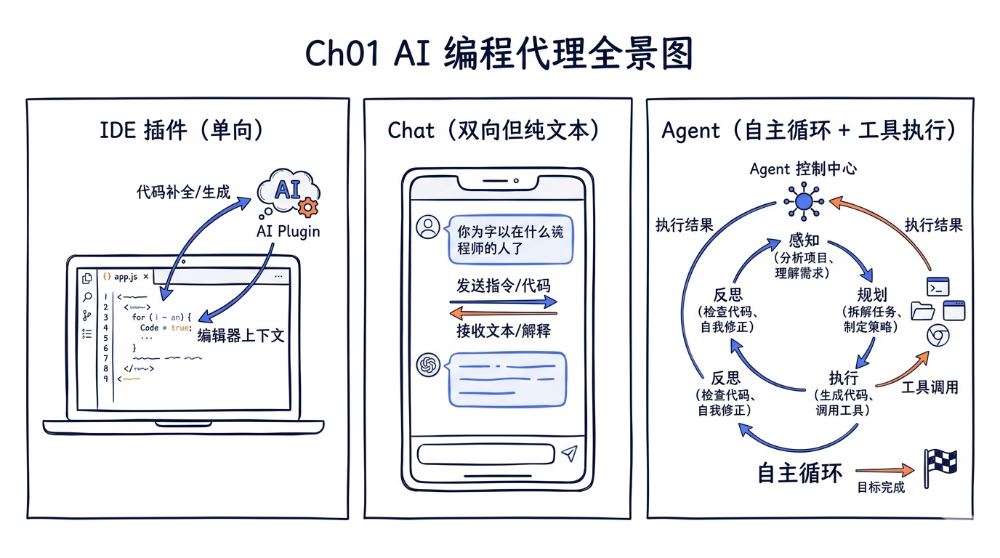
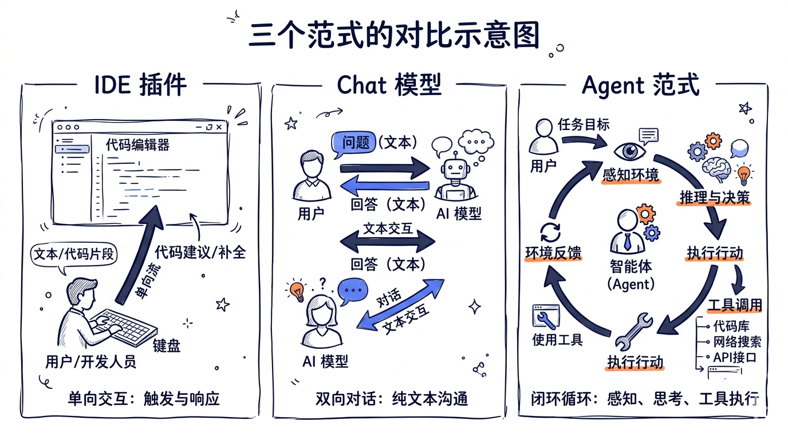
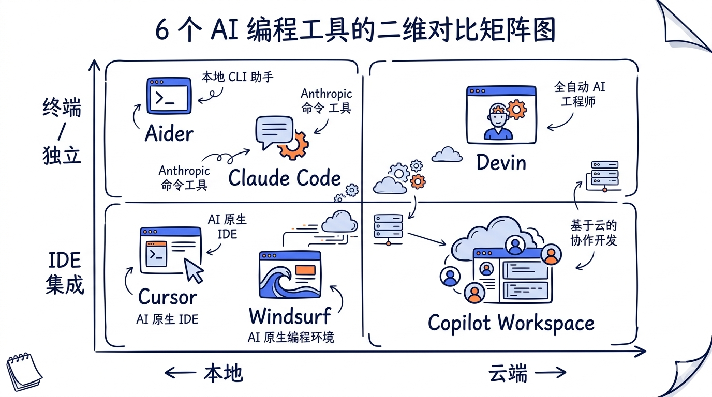
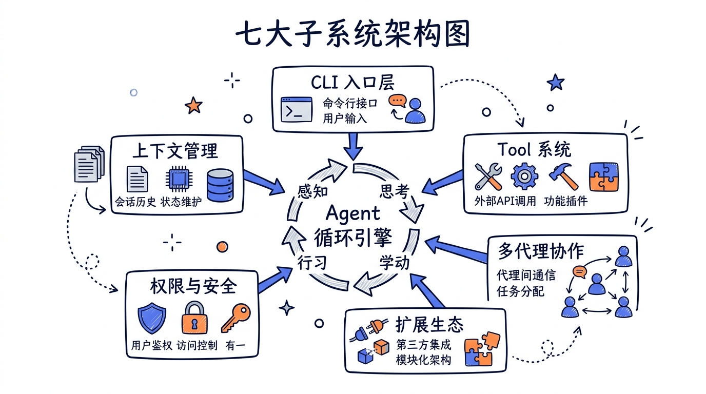

---
layout: default
title: "Ch01 AI 编程代理全景图"
nav_order: 10
parent: "模块一：架构与启动"
---


# 第一章：AI 编程代理全景图



> **本系列基于 Claude Code v2.1.88 源码进行分析，所有代码示例均来自真实源文件。**

---

当你在终端里对 Claude Code 说"帮我把这个 REST API 重构成 GraphQL，顺便把测试也补上"，然后去倒了杯咖啡——回来后发现它已经读了整个代码库、修改了十几个文件、跑了测试、自己修复了两个失败用例——你就会意识到，这不再是一个"聊天工具"或者"自动补全插件"。这是一个**代理**（Agent），一个能自主决策、自主行动、自主纠错的软件实体。本章将带你走进 Claude Code 的全景架构，理解它为什么这样设计，以及它是如何做到这一切的。

## 学习目标

完成本章后，你将能够：

- **理解** AI 编程代理与传统 IDE 插件、纯 Chat 工具的本质区别
- **掌握** Claude Code 七大子系统的职责划分和协作方式
- **描述** 从用户输入到最终结果的完整数据流
- **识别** Claude Code 采用的关键设计模式及其工程考量
- **对比** 当前主流 AI 编程工具的架构差异

---

## 1.1 三个范式：从自动补全到自主代理

在深入源码之前，我们先厘清三个截然不同的范式。这不仅仅是功能的进化，而是**交互模型的根本变迁**。

### 1.1.1 范式一：IDE 插件（Copilot 式）

传统的 AI 编程插件运行在一个简单的 **请求-响应** 模型中：

```
光标位置 + 上下文 → 模型 → 补全建议
```

它的特点是：
- **被动触发**：等待你打字，然后提供建议
- **单次交互**：一个请求返回一个结果
- **受限上下文**：通常只看当前文件和少量相邻文件
- **无副作用**：不修改文件、不执行命令、不与外部系统交互

这是一个优秀的"写作助手"，但它不是一个"开发者"。

### 1.1.2 范式二：对话式 Chat（ChatGPT 式）

Chat 模型引入了**多轮对话**的能力：

```
用户消息 → 模型 → 回复文本
用户追问 → 模型（带上下文） → 回复文本
```

进步在于：
- **多轮上下文**：能维持对话历史，理解追问
- **通用知识**：不局限于代码，能讨论架构、设计、调试思路
- **灵活交互**：用自然语言描述意图

但它的局限同样明显：
- **无法执行**：只能生成文本，不能直接修改代码
- **上下文靠手动**：需要你复制粘贴代码片段
- **无法验证**：生成的代码对不对，需要你自己跑

### 1.1.3 范式三：Agent（Claude Code 式）

Agent 范式引入了一个关键概念——**自主行动循环**（Agentic Loop）：

```
用户意图 → [模型思考 → 选择工具 → 执行工具 → 观察结果 → 继续思考 → ...] → 完成
```

这不是一次性的请求-响应，而是一个**循环**。模型在每个循环迭代中：

1. **观察**当前状态（文件内容、命令输出、错误信息）
2. **思考**下一步应该做什么
3. **行动**（读文件、写文件、执行命令、搜索代码）
4. **评估**行动结果
5. 如果任务未完成，**回到步骤 1**



下表总结了三个范式的核心差异：

| 维度 | IDE 插件 | 对话 Chat | Agent |
|------|---------|----------|-------|
| **交互模型** | 请求-响应 | 多轮对话 | 自主循环 |
| **执行能力** | 无 | 无 | 有（工具调用） |
| **上下文来源** | 自动提取（受限） | 手动粘贴 | 自主探索（读文件、搜索） |
| **决策权** | 无（仅建议） | 无（仅建议） | 有（自主选择下一步） |
| **错误处理** | 不涉及 | 口头建议 | 自动重试/修复 |
| **典型轮次** | 1 | 5-20 | 10-200+ |

理解这三个范式的区别至关重要，因为 Claude Code 的**每一个架构决策**都围绕着第三个范式展开。

---

## 1.2 Claude Code 的设计哲学

在分析源码之前，我们需要理解驱动 Claude Code 架构设计的三个核心哲学。这些哲学不是事后总结，而是贯穿在每一行代码中的决策原则。

### 1.2.1 终端原生（Terminal-Native）

Claude Code 做了一个在 2024 年看起来非常反直觉的决定：**不做 IDE 插件，做终端应用**。

看看入口文件 `cli.tsx` 的结构就能理解这个选择：

```typescript
// 源码: src/entrypoints/cli.tsx (第 33-42 行)
async function main(): Promise<void> {
  const args = process.argv.slice(2);

  // Fast-path for --version/-v: zero module loading needed
  if (args.length === 1 && (args[0] === '--version' || args[0] === '-v' || args[0] === '-V')) {
    console.log(`${MACRO.VERSION} (Claude Code)`);
    return;
  }

  // For all other paths, load the startup profiler
  const { profileCheckpoint } = await import('../utils/startupProfiler.js');
  profileCheckpoint('cli_entry');
  // ...
}
```

这不是一个 VS Code extension 的 `activate()` 函数，也不是一个浏览器应用的 `React.render()`。这是一个**命令行程序的入口**，用 `process.argv` 解析参数，用 `process.exit()` 退出。

为什么选择终端？

1. **通用性**：终端是所有开发者都有的环境，不绑定任何 IDE
2. **零配置**：`npm install -g @anthropic-ai/claude-code && claude` 即可使用
3. **可组合性**：终端工具天然支持管道、脚本化、自动化
4. **信任边界清晰**：用户在终端里能直接看到 Claude Code 执行的每一个命令

但终端应用面临一个巨大的 UI 挑战——如何在纯文本环境中提供丰富的交互体验？Claude Code 的解决方案是 **React/Ink**，一个在终端中运行 React 的框架。我们会在后面详细讨论这一点。

### 1.2.2 代理循环（Agentic Loop）

Claude Code 的核心是一个 `while (true)` 循环。这不是修辞手法——打开 `query.ts`，你会看到这个循环的真实面貌：

```typescript
// 源码: src/query.ts (第 241-307 行，简化展示)
async function* queryLoop(
  params: QueryParams,
  consumedCommandUuids: string[],
): AsyncGenerator<
  | StreamEvent
  | RequestStartEvent
  | Message
  | TombstoneMessage
  | ToolUseSummaryMessage,
  Terminal
> {
  let state: State = {
    messages: params.messages,
    toolUseContext: params.toolUseContext,
    // ...
    turnCount: 1,
    transition: undefined,
  }

  // eslint-disable-next-line no-constant-condition
  while (true) {
    let { toolUseContext } = state
    const { messages, turnCount } = state

    yield { type: 'stream_request_start' }

    // 1. 准备消息（压缩、裁剪、附加上下文）
    let messagesForQuery = [...getMessagesAfterCompactBoundary(messages)]

    // 2. 组装 System Prompt
    const fullSystemPrompt = asSystemPrompt(
      appendSystemContext(systemPrompt, systemContext),
    )

    // 3. 调用 API（流式）
    for await (const message of deps.callModel({
      messages: prependUserContext(messagesForQuery, userContext),
      systemPrompt: fullSystemPrompt,
      // ...
    })) {
      // 处理流式响应...
    }

    // 4. 如果没有 tool_use，循环结束
    if (!needsFollowUp) {
      return { reason: 'completed' }
    }

    // 5. 执行工具调用
    for await (const update of toolUpdates) {
      // 处理工具结果...
    }

    // 6. 将工具结果加入消息列表，继续循环
    state = {
      messages: [...messagesForQuery, ...assistantMessages, ...toolResults],
      turnCount: nextTurnCount,
      transition: { reason: 'next_turn' },
      // ...
    }
  } // while (true)
}
```

注意两个关键设计：

- **`AsyncGenerator`**：整个循环是一个异步生成器函数，用 `yield` 逐步推送事件。这让调用方可以流式消费结果，而不是等整个循环结束。
- **不可变状态转移**：每次循环迭代结束时，通过 `state = { ... }` 创建全新的状态对象。状态转移的原因（`transition.reason`）被显式记录，这让调试和测试变得简单。

### 1.2.3 工具优先（Tool-First）

Claude Code 的所有能力都通过**工具**（Tool）暴露给模型。不是通过 prompt engineering 告诉模型"请生成 shell 命令"，而是直接给模型一组类型化的工具定义，让模型通过结构化的 `tool_use` 块来调用。

打开 `tools.ts`，你会看到完整的工具清单：

```typescript
// 源码: src/tools.ts (第 193-251 行，简化展示)
export function getAllBaseTools(): Tools {
  return [
    AgentTool,         // 子代理
    TaskOutputTool,    // 任务输出
    BashTool,          // Shell 命令
    GlobTool,          // 文件搜索
    GrepTool,          // 内容搜索
    FileReadTool,      // 读文件
    FileEditTool,      // 编辑文件
    FileWriteTool,     // 写文件
    NotebookEditTool,  // Jupyter 编辑
    WebFetchTool,      // HTTP 请求
    TodoWriteTool,     // TODO 管理
    WebSearchTool,     // 网页搜索
    TaskStopTool,      // 停止任务
    AskUserQuestionTool, // 向用户提问
    SkillTool,         // 技能调用
    EnterPlanModeTool, // 进入计划模式
    // ... MCP 工具、Worktree 工具等
  ]
}
```

每个工具都是一个实现了 `Tool` 接口的对象。这个接口定义在 `Tool.ts` 中，是整个工具系统的类型基石：

```typescript
// 源码: src/Tool.ts (第 362-403 行，关键字段)
export type Tool<
  Input extends AnyObject = AnyObject,
  Output = unknown,
  P extends ToolProgressData = ToolProgressData,
> = {
  readonly name: string
  call(args, context, canUseTool, parentMessage, onProgress?): Promise<ToolResult<Output>>
  description(input, options): Promise<string>
  readonly inputSchema: Input
  isConcurrencySafe(input): boolean
  isEnabled(): boolean
  isReadOnly(input): boolean
  checkPermissions(input, context): Promise<PermissionResult>
  prompt(options): Promise<string>
  maxResultSizeChars: number
  // ...
}
```

这个接口值得仔细看，因为它编码了工具系统的核心约束：

- **`inputSchema`**：用 Zod 定义的类型安全输入模式，API 层会据此校验模型的调用参数
- **`isConcurrencySafe`**：标记工具是否可以并发执行（只读工具通常可以）
- **`isReadOnly`**：区分读操作和写操作，影响权限决策
- **`checkPermissions`**：工具自带权限检查逻辑
- **`maxResultSizeChars`**：结果大小上限，超过时存储到磁盘并返回摘要

工具优先的设计带来的好处是**能力的可组合性**——新增一个能力就是新增一个 Tool 实现，不需要修改核心循环。

---

## 1.3 行业横向对比

Claude Code 不是唯一的 AI 编程工具。理解它在行业格局中的位置，有助于我们理解它的设计取舍。

### 1.3.1 Claude Code

**定位**：终端原生的通用编程代理。

- **运行环境**：终端（Bun/Node.js），通过 React/Ink 渲染 TUI
- **代理循环**：显式的 `while(true)` + `AsyncGenerator`，完全自主
- **工具系统**：内置 40 个工具 + MCP 协议扩展 + 自定义 Skill
- **模型**：Claude 系列（Opus/Sonnet/Haiku），支持 Bedrock/Vertex
- **特色**：权限安全体系、多代理协作（Agent Swarm）、上下文自动压缩

### 1.3.2 Cursor

**定位**：IDE 深度集成的 AI 编辑器。

- **运行环境**：基于 VS Code 的 fork
- **代理循环**：在编辑器内部运行，与编辑器状态深度集成
- **工具系统**：内置工具 + 编辑器 API 深度集成
- **模型**：多模型支持（Claude/GPT/自定义）
- **特色**：Tab 补全、Composer 多文件编辑、codebase indexing

**与 Claude Code 的关键差异**：Cursor 选择了 IDE 深度集成路线，获得了更丰富的 UI 交互能力（diff 视图、内联建议），但牺牲了终端的可组合性和 IDE 中立性。

### 1.3.3 GitHub Copilot Workspace

**定位**：基于 GitHub 生态的云端编程代理。

- **运行环境**：云端（GitHub 托管）
- **代理循环**：Plan → Implement → Validate 三阶段
- **工具系统**：GitHub Actions 集成
- **模型**：GPT-4 系列 + Codex
- **特色**：从 Issue 自动生成 PR，与 GitHub 生态深度绑定

**与 Claude Code 的关键差异**：Workspace 是云端优先的方案，强调与 GitHub 工作流的一体化体验，而 Claude Code 是本地优先，强调开发者对执行过程的完全控制。

### 1.3.4 Windsurf (Codeium)

**定位**：IDE 集成的"Flow"式编程代理。

- **运行环境**：基于 VS Code 的 fork
- **代理循环**：Cascade 模式（多步规划 + 执行）
- **模型**：多模型支持
- **特色**：Cascade 多步推理、Supercomplete 上下文补全

### 1.3.5 Devin

**定位**：全自主的云端 AI 工程师。

- **运行环境**：云端沙箱（完整的 Linux 环境 + 浏览器）
- **代理循环**：高度自主，可长时间运行
- **工具系统**：完整的 shell、浏览器、编辑器
- **特色**：端到端自主完成任务，最小化人工干预

**与 Claude Code 的关键差异**：Devin 追求最大程度的自主性，运行在隔离的云端沙箱中。Claude Code 则运行在开发者本机，强调**人在环中**（human-in-the-loop）——开发者随时可以看到并干预执行过程。

### 1.3.6 OpenHands (原 OpenDevin)

**定位**：开源的 AI 编程代理框架。

- **运行环境**：Docker 沙箱
- **代理循环**：可插拔的代理架构
- **模型**：多模型支持
- **特色**：开源、可定制、社区驱动

### 架构路线对比总结



| 工具 | 运行环境 | 自主程度 | 代理循环 | 扩展机制 |
|------|---------|---------|---------|---------|
| **Claude Code** | 本地终端 | 高（人在环中） | AsyncGenerator 循环 | MCP + Skills |
| **Cursor** | 本地 IDE | 中 | IDE 内嵌 | 编辑器 API |
| **Copilot Workspace** | 云端 | 中 | Plan-Implement-Validate | GitHub Actions |
| **Windsurf** | 本地 IDE | 中-高 | Cascade | 编辑器 API |
| **Devin** | 云端沙箱 | 极高 | 全自主 | 沙箱环境 |
| **OpenHands** | Docker 沙箱 | 可配置 | 可插拔 | 插件架构 |

理解这些差异不是为了评判优劣，而是为了理解 **Claude Code 的设计决策是在什么约束空间中做出的**。

---

## 1.4 七大子系统架构

现在进入核心。Claude Code 的代码库可以划分为**七大子系统**，每个子系统有明确的职责边界。理解这七个子系统及其协作方式，是理解整个架构的钥匙。



```
┌─────────────────────────────────────────────────────────────┐
│                    CLI 入口层                                │
│         cli.tsx → main.tsx → setup → REPL.tsx               │
└──────────────────────┬──────────────────────────────────────┘
                       │
                       ▼
┌─────────────────────────────────────────────────────────────┐
│                  Agent 循环引擎                               │
│            query.ts (AsyncGenerator while loop)              │
│                                                             │
│  ┌──────────┐    ┌──────────┐    ┌──────────────────┐       │
│  │System    │    │ API 调用  │    │ Tool 调度与执行   │       │
│  │Prompt 组装│───▶│ (stream) │───▶│ (并发/串行)      │       │
│  └──────────┘    └──────────┘    └────────┬─────────┘       │
│       ▲                                    │                 │
│       └────────────────────────────────────┘                 │
│                     循环继续                                  │
└───┬──────────┬──────────────┬───────────────┬───────────────┘
    │          │              │               │
    ▼          ▼              ▼               ▼
┌──────┐  ┌──────────┐  ┌──────────┐   ┌──────────┐
│ Tool │  │ 上下文    │  │ 权限与    │   │ 扩展生态  │
│ 系统  │  │ 管理     │  │ 安全     │   │ MCP/Skill│
└──────┘  └──────────┘  └──────────┘   └──────────┘
    │                                        │
    └──────────────┬─────────────────────────┘
                   ▼
            ┌──────────────┐
            │  多代理协作    │
            │  AgentTool    │
            │  Coordinator  │
            └──────────────┘
```

下面逐一分析每个子系统。

### 1.4.1 CLI 入口层

**职责**：启动初始化、参数解析、环境检测、会话管理。

**核心文件**：
- `src/entrypoints/cli.tsx` —— 最外层入口，快速路径分发
- `src/main.tsx` —— 完整初始化序列，Commander.js 命令行解析
- `src/entrypoints/init.ts` —— 信任检查、配置加载
- `src/replLauncher.tsx` —— 启动 React/Ink 渲染的 REPL

CLI 入口层的设计核心是**启动速度优化**。`cli.tsx` 用动态 `import()` 延迟加载重量级模块，对 `--version` 这类快速路径做到零模块加载：

```typescript
// 源码: src/entrypoints/cli.tsx (第 33-42 行)
async function main(): Promise<void> {
  const args = process.argv.slice(2);

  // Fast-path: --version 不加载任何模块
  if (args.length === 1 && (args[0] === '--version' || ...)) {
    console.log(`${MACRO.VERSION} (Claude Code)`);
    return;
  }

  // 其他路径才开始加载
  const { profileCheckpoint } = await import('../utils/startupProfiler.js');
  profileCheckpoint('cli_entry');
  // ...
}
```

`main.tsx` 是一个超大文件（200+ import），它负责：
1. 性能分析打点（`profileCheckpoint`）
2. Keychain 预取（macOS 并行读取 OAuth 和 API Key）
3. MDM 策略读取（企业部署场景）
4. Commander.js 命令行选项注册
5. 配置迁移（`runMigrations`，当前版本号 = 11）
6. GrowthBook Feature Flag 初始化
7. 启动 React/Ink REPL 或执行 headless 模式

```typescript
// 源码: src/main.tsx (第 1-20 行)
// 这些副作用必须在所有其他 import 之前运行：
// 1. profileCheckpoint 在重量级模块加载前标记入口
// 2. startMdmRawRead 启动 MDM 子进程（与后续 ~135ms 的 import 并行）
// 3. startKeychainPrefetch 并行启动 macOS keychain 读取
import { profileCheckpoint } from './utils/startupProfiler.js';
profileCheckpoint('main_tsx_entry');

import { startMdmRawRead } from './utils/settings/mdm/rawRead.js';
startMdmRawRead();

import { startKeychainPrefetch } from './utils/secureStorage/keychainPrefetch.js';
startKeychainPrefetch();
```

注意这些 import 的顺序不是随意的——注释明确说明了**并行优化**的意图。后续章节会深入分析这个启动序列。

**对应目录**：`src/entrypoints/`、`src/main.tsx`、`src/replLauncher.tsx`

### 1.4.2 Agent 循环引擎

**职责**：核心的 think-act-observe 循环。这是 Claude Code 的心脏。

**核心文件**：
- `src/query.ts` —— 代理循环的主体
- `src/query/config.ts` —— 循环配置快照
- `src/query/deps.ts` —— 依赖注入（API 调用、压缩等）
- `src/QueryEngine.ts` —— SDK/headless 模式的循环封装
- `src/services/api/claude.ts` —— Anthropic API 调用

Agent 循环引擎的设计有几个值得关注的特性：

**（1）AsyncGenerator 模式**

整个循环被封装为一个 `AsyncGenerator`，每次 `yield` 推送一个事件给调用方：

```typescript
// 源码: src/query.ts (第 219-228 行)
export async function* query(
  params: QueryParams,
): AsyncGenerator<
  | StreamEvent
  | RequestStartEvent
  | Message
  | TombstoneMessage
  | ToolUseSummaryMessage,
  Terminal
> {
  // ...
}
```

这个设计使得 REPL（交互模式）和 SDK（headless 模式）可以用完全相同的循环逻辑，区别仅在于如何消费 `yield` 出来的事件。

**（2）不可变状态机**

循环的每次迭代通过 `State` 对象传递状态。状态转移通过创建全新的 `State` 对象完成，并且每次转移都记录 `transition.reason`：

```typescript
// 源码: src/query.ts (第 202-217 行)
type State = {
  messages: Message[]
  toolUseContext: ToolUseContext
  autoCompactTracking: AutoCompactTrackingState | undefined
  maxOutputTokensRecoveryCount: number
  hasAttemptedReactiveCompact: boolean
  turnCount: number
  transition: Continue | undefined  // 记录为什么进入下一轮
}
```

可能的 transition reason 包括：`next_turn`（正常的工具调用后继续）、`reactive_compact_retry`（上下文过长触发压缩后重试）、`max_output_tokens_recovery`（输出截断后恢复）、`collapse_drain_retry`（上下文折叠后重试）等。

**（3）自动恢复机制**

循环内建了多种错误恢复路径：

- **Prompt Too Long**：先尝试上下文折叠（Context Collapse），再尝试反应式压缩（Reactive Compact）
- **Max Output Tokens**：先尝试升级 token 上限（8k → 64k），再注入恢复消息让模型继续
- **模型降级**：主模型不可用时自动切换到 fallback 模型

**对应目录**：`src/query.ts`、`src/query/`、`src/services/api/`

### 1.4.3 Tool 系统

**职责**：定义、注册、调度、执行所有工具。

**核心文件**：
- `src/Tool.ts` —— Tool 接口定义
- `src/tools.ts` —— 工具注册表
- `src/tools/` —— 各工具实现（40 个工具目录）
- `src/services/tools/toolOrchestration.ts` —— 工具调度（并发/串行）
- `src/services/tools/toolExecution.ts` —— 单个工具执行流程

工具系统的核心设计决策是**并发安全分区**：

```typescript
// 源码: src/services/tools/toolOrchestration.ts (第 19-80 行，简化)
export async function* runTools(
  toolUseMessages: ToolUseBlock[],
  assistantMessages: AssistantMessage[],
  canUseTool: CanUseToolFn,
  toolUseContext: ToolUseContext,
): AsyncGenerator<MessageUpdate, void> {
  let currentContext = toolUseContext
  for (const { isConcurrencySafe, blocks } of partitionToolCalls(
    toolUseMessages,
    currentContext,
  )) {
    if (isConcurrencySafe) {
      // 只读工具批次：并发执行
      for await (const update of runToolsConcurrently(blocks, ...)) {
        yield { message: update.message, newContext: currentContext }
      }
    } else {
      // 非只读工具批次：串行执行
      for await (const update of runToolsSerially(blocks, ...)) {
        currentContext = update.newContext
        yield { message: update.message, newContext: currentContext }
      }
    }
  }
}
```

工具调度器先将模型一次返回的多个 `tool_use` 按 `isConcurrencySafe` 分区，只读工具（如 FileRead、Glob、Grep）并发执行，写操作工具（如 FileEdit、FileWrite、Bash）串行执行。这在保证正确性的同时最大化了吞吐量。

当前内置工具清单（`src/tools/` 目录）：

| 工具 | 目录 | 能力 |
|------|------|------|
| BashTool | `BashTool/` | 执行 Shell 命令 |
| FileReadTool | `FileReadTool/` | 读取文件内容 |
| FileEditTool | `FileEditTool/` | 精确编辑文件（diff 式） |
| FileWriteTool | `FileWriteTool/` | 创建/覆写文件 |
| GlobTool | `GlobTool/` | 按模式搜索文件名 |
| GrepTool | `GrepTool/` | 搜索文件内容 |
| WebFetchTool | `WebFetchTool/` | 发送 HTTP 请求 |
| WebSearchTool | `WebSearchTool/` | 网页搜索 |
| AgentTool | `AgentTool/` | 派生子代理 |
| SkillTool | `SkillTool/` | 调用 Skill |
| NotebookEditTool | `NotebookEditTool/` | 编辑 Jupyter Notebook |
| AskUserQuestionTool | `AskUserQuestionTool/` | 向用户提问 |
| TodoWriteTool | `TodoWriteTool/` | 管理 TODO 列表 |
| EnterPlanModeTool | `EnterPlanModeTool/` | 进入计划模式 |
| ToolSearchTool | `ToolSearchTool/` | 搜索可用工具（延迟加载） |
| TaskStopTool | `TaskStopTool/` | 停止当前任务 |

**对应目录**：`src/Tool.ts`、`src/tools.ts`、`src/tools/`、`src/services/tools/`

### 1.4.4 上下文管理

**职责**：构建、维护、压缩发送给 API 的上下文（System Prompt + 对话历史）。

**核心文件**：
- `src/context.ts` —— 系统上下文与用户上下文
- `src/constants/prompts.ts` —— System Prompt 模板
- `src/services/compact/` —— 上下文压缩（auto compact / reactive compact）
- `src/utils/claudemd.js` —— CLAUDE.md 文件解析
- `src/utils/attachments.ts` —— 上下文附件（memory、file change 等）
- `src/memdir/` —— 自动记忆目录

上下文管理是 AI 代理最具挑战性的问题之一。Claude Code 采用了**多层压缩策略**：

1. **Microcompact**：对已完成的工具调用结果进行缩减（去除冗余细节）
2. **Snip Compact**：裁剪历史中段的低价值消息
3. **Context Collapse**：将多步操作折叠为摘要
4. **Auto Compact**：当 token 数接近模型上限时，用模型自身生成对话摘要
5. **Reactive Compact**：API 返回 "prompt too long" 错误时的紧急压缩

System Prompt 的组装涉及多个数据源拼接：

```typescript
// 源码: src/context.ts (第 60-100 行，简化)
// 系统上下文的构建：并行获取多个 git 信息
const [branch, mainBranch, status, log, userName] = await Promise.all([
  getBranch(),
  getDefaultBranch(),
  execFileNoThrow(gitExe(), ['status', '--short'], ...),
  execFileNoThrow(gitExe(), ['log', '--oneline', '-n', '5'], ...),
  execFileNoThrow(gitExe(), ['config', 'user.name'], ...),
])
```

**对应目录**：`src/context.ts`、`src/constants/prompts.ts`、`src/services/compact/`、`src/memdir/`

### 1.4.5 权限与安全

**职责**：控制工具执行的权限边界，保护用户文件系统和环境安全。

**核心文件**：
- `src/utils/permissions/permissions.ts` —— 权限检查核心逻辑
- `src/utils/permissions/PermissionMode.ts` —— 权限模式定义
- `src/hooks/useCanUseTool.tsx` —— 工具使用前的权限拦截
- `src/utils/sandbox/` —— 沙箱执行环境
- `src/Tool.ts` 中的 `ToolPermissionContext` —— 权限上下文类型

权限系统是 Claude Code 区别于其他 AI 代理的重要特性。它实现了一个**多层权限模型**：

```typescript
// 源码: src/Tool.ts (第 123-138 行)
export type ToolPermissionContext = DeepImmutable<{
  mode: PermissionMode               // 'default' | 'plan' | 'auto' | ...
  additionalWorkingDirectories: Map<string, AdditionalWorkingDirectory>
  alwaysAllowRules: ToolPermissionRulesBySource    // 始终允许的规则
  alwaysDenyRules: ToolPermissionRulesBySource     // 始终拒绝的规则
  alwaysAskRules: ToolPermissionRulesBySource      // 始终询问的规则
  isBypassPermissionsModeAvailable: boolean
  shouldAvoidPermissionPrompts?: boolean            // 后台代理不弹权限提示
}>
```

权限检查的决策流程：

1. **Deny 规则**：如果工具被全局或项目级 deny 规则匹配，直接拒绝
2. **Allow 规则**：如果工具匹配 allow 规则（如 `Bash(git *)` 允许所有 git 命令），自动放行
3. **工具自身的 `checkPermissions`**：每个工具根据输入参数判断是否需要询问
4. **权限模式**：`default` 模式下写操作询问用户，`plan` 模式下所有操作只读，`auto` 模式下分类器自动判断

**对应目录**：`src/utils/permissions/`、`src/hooks/useCanUseTool.tsx`、`src/utils/sandbox/`

### 1.4.6 扩展生态（MCP / Skills / Plugins）

**职责**：通过标准化协议和约定式扩展，让外部能力接入代理循环。

**核心文件**：
- `src/services/mcp/` —— Model Context Protocol 客户端
- `src/skills/` —— Skill 加载与执行
- `src/plugins/` —— 插件管理
- `src/tools/SkillTool/` —— Skill 工具实现
- `src/tools/MCPTool/` —— MCP 工具桥接

扩展生态分为三层：

1. **MCP（Model Context Protocol）**：Anthropic 提出的标准化协议，让外部服务以"工具服务器"的形式接入。MCP 工具在运行时被动态注册，与内置工具享有相同的调度和权限机制。

2. **Skills**：基于约定的 Markdown 文件，定义了提示词模板和行为指令。通过 `SkillTool` 被模型调用。

3. **Plugins**：可安装的扩展包，可以注册新的 MCP server、新的 Skill、新的命令。

```
MCP Server ──────┐
                 ├──→ 统一的 Tool 接口 ──→ Agent 循环
Skill 文件 ──────┤
                 │
Plugin ──────────┘
```

**对应目录**：`src/services/mcp/`、`src/skills/`、`src/plugins/`、`src/tools/SkillTool/`

### 1.4.7 多代理协作

**职责**：支持主代理派生子代理、代理间通信、协调模式。

**核心文件**：
- `src/tools/AgentTool/` —— 子代理工具（核心）
- `src/tools/AgentTool/runAgent.ts` —— 子代理运行逻辑
- `src/tools/AgentTool/forkSubagent.ts` —— Fork 式子代理
- `src/coordinator/` —— 协调器模式
- `src/tools/TeamCreateTool/` —— 团队创建（Agent Swarm）
- `src/tools/SendMessageTool/` —— 代理间消息传递

多代理协作是 Claude Code 最复杂的子系统之一。它支持多种模式：

- **AgentTool**：主代理通过 `tool_use` 派生子代理，子代理在独立上下文中运行自己的 `query` 循环，完成后将结果返回给主代理
- **Coordinator Mode**：一个特殊的协调器代理负责任务分解和分发
- **Agent Swarm**：多个对等代理组成团队，通过消息传递协作

每个子代理都拥有独立的：
- 工具集（可能受限于父代理的配置）
- 权限上下文
- 消息历史
- 上下文压缩状态

**对应目录**：`src/tools/AgentTool/`、`src/coordinator/`、`src/tools/TeamCreateTool/`、`src/tools/SendMessageTool/`

---

## 1.5 核心数据流

理解了七大子系统后，我们追踪一次完整请求的数据流，看看各子系统如何协作。

### 1.5.1 完整请求生命周期

当用户在终端输入一条消息并按回车后，数据经历以下流转：

```
用户输入 "帮我修复这个 bug"
        │
        ▼
┌─ 1. REPL.tsx 捕获输入 ─────────────────────────────────────┐
│  - 解析斜杠命令 vs 自然语言消息                               │
│  - 创建 UserMessage 对象                                    │
│  - 启动 query() 循环                                        │
└──────────────────────┬──────────────────────────────────────┘
                       │
                       ▼
┌─ 2. System Prompt 组装 ────────────────────────────────────┐
│  - 加载基础系统提示                                          │
│  - 注入 CLAUDE.md 内容                                      │
│  - 注入 Git 状态 (branch, status, log)                      │
│  - 注入 MCP 工具描述                                        │
│  - 注入用户上下文 (日期、平台、shell)                          │
└──────────────────────┬──────────────────────────────────────┘
                       │
                       ▼
┌─ 3. API 调用 ──────────────────────────────────────────────┐
│  messages = [system_prompt, ...history, user_message]       │
│  tools = [BashTool, FileReadTool, FileEditTool, ...]        │
│  → Anthropic API (stream)                                   │
│  ← 流式返回: text block + tool_use blocks                   │
└──────────────────────┬──────────────────────────────────────┘
                       │
                       ▼
┌─ 4. Tool 执行 ─────────────────────────────────────────────┐
│  模型返回: tool_use[{name: "Bash", input: {command: "..."}}] │
│                                                             │
│  4a. 权限检查 → checkPermissions()                          │
│  4b. 用户确认（如需要）                                       │
│  4c. 工具执行 → tool.call()                                 │
│  4d. 结果封装为 tool_result 消息                              │
└──────────────────────┬──────────────────────────────────────┘
                       │
                       ▼
┌─ 5. 结果反馈与循环判断 ────────────────────────────────────┐
│  将 assistant_message + tool_result 追加到 messages          │
│                                                             │
│  模型还需要继续？ (stop_reason == tool_use)                   │
│    → YES: 回到步骤 3，开始下一轮迭代                          │
│    → NO:  循环结束，显示最终回复                              │
└─────────────────────────────────────────────────────────────┘
```

### 1.5.2 数据流中的关键节点

**节点 A：消息规范化**

在发送给 API 之前，消息列表会经过 `normalizeMessagesForAPI()` 处理。这个函数去除 UI 专用字段（如进度信息、本地命令标记），确保消息格式符合 Anthropic API 规范。

**节点 B：上下文预算管理**

每次循环迭代前，系统会检查消息列表的 token 数是否接近模型窗口上限，并在需要时触发压缩：

```typescript
// 源码: src/query.ts (第 449-467 行，简化)
// 组装完整系统提示
const fullSystemPrompt = asSystemPrompt(
  appendSystemContext(systemPrompt, systemContext),
)

// 自动压缩检查
const { compactionResult } = await deps.autocompact(
  messagesForQuery,
  toolUseContext,
  { systemPrompt, userContext, systemContext, toolUseContext },
  querySource,
  tracking,
  snipTokensFreed,
)
```

**节点 C：工具结果大小控制**

工具执行的结果会经过 `applyToolResultBudget()` 裁剪。超大结果（如读取一个巨大的日志文件）会被持久化到磁盘，模型只看到摘要和文件路径：

```typescript
// 源码: src/query.ts (第 379-394 行)
messagesForQuery = await applyToolResultBudget(
  messagesForQuery,
  toolUseContext.contentReplacementState,
  persistReplacements ? records => void recordContentReplacement(...) : undefined,
  new Set(
    toolUseContext.options.tools
      .filter(t => !Number.isFinite(t.maxResultSizeChars))
      .map(t => t.name),
  ),
)
```

**节点 D：附件注入**

在工具执行完成后、下一轮 API 调用前，系统会注入"附件消息"——包括自动发现的相关文件、记忆文件、队列中的通知等：

```typescript
// 源码: src/query.ts (第 1580-1590 行)
for await (const attachment of getAttachmentMessages(
  null,
  updatedToolUseContext,
  null,
  queuedCommandsSnapshot,
  [...messagesForQuery, ...assistantMessages, ...toolResults],
  querySource,
)) {
  yield attachment
  toolResults.push(attachment)
}
```

---

## 1.6 关键设计模式预览

Claude Code 的代码库中反复出现几个设计模式。理解这些模式，会让你在后续章节阅读源码时事半功倍。

### 1.6.1 AsyncGenerator 流式处理

Claude Code 的核心数据管道基于 `AsyncGenerator`。从 API 流式响应到工具执行结果，再到 UI 渲染——所有数据都通过 `yield` 逐步推送。

```typescript
// 模式: 生产者
async function* query(params): AsyncGenerator<Message> {
  while (true) {
    for await (const msg of callModel(...)) {
      yield msg  // 流式推送 API 响应
    }
    for await (const update of runTools(...)) {
      yield update.message  // 流式推送工具结果
    }
  }
}

// 模式: 消费者 (REPL 端)
for await (const event of query(params)) {
  updateUI(event)  // 即时渲染
}
```

这个模式的优势在于：
- **低延迟**：不需要等整个循环完成就能开始渲染
- **可中断**：用户按 Ctrl+C 时，通过 `generator.return()` 优雅终止
- **背压控制**：消费者可以控制消费速度

### 1.6.2 React/Ink 终端 UI

Claude Code 用 React 组件模型来构建终端 UI。这不是为了赶时髦——React 的声明式渲染和组件化正好解决了终端 UI 的两大难题：**状态管理**和**布局计算**。

```typescript
// 源码: src/replLauncher.tsx (第 12-22 行)
export async function launchRepl(root, appProps, replProps, renderAndRun) {
  const { App } = await import('./components/App.js')
  const { REPL } = await import('./screens/REPL.js')
  await renderAndRun(root, <App {...appProps}>
    <REPL {...replProps} />
  </App>)
}
```

Ink 将 React 组件树渲染为终端中的 ANSI 转义序列。你可以用 `<Box>`、`<Text>` 等组件来构建布局，用 `useState`、`useEffect` 等 hooks 来管理状态。REPL 屏幕（`screens/REPL.tsx`）使用了大量自定义 hooks（`src/hooks/` 目录包含 80+ hooks），管理从终端大小到语音输入的各种状态。

### 1.6.3 Hook 事件总线

Claude Code 的 "hook" 有两个不同含义——不要混淆：

**React Hooks**（`src/hooks/`）：标准的 React 状态管理 hooks，如 `useTerminalSize`、`useCanUseTool`。

**Event Hooks**（`src/utils/hooks/`）：一个独立的事件系统，允许外部脚本在特定生命周期节点介入：

```typescript
// 源码: src/utils/hooks/hookEvents.ts (第 1-8 行)
/**
 * Hook event system for broadcasting hook execution events.
 *
 * This module provides a generic event system that is separate from the
 * main message stream. Handlers can register to receive events and decide
 * what to do with them (e.g., convert to SDK messages, log, etc.).
 */
```

Event Hooks 支持的生命周期节点包括：
- `PreToolUse` —— 工具执行前（可阻止执行）
- `PostToolUse` —— 工具执行后
- `SessionStart` —— 会话启动
- `Stop` —— 模型停止生成时的检查

这让用户可以通过配置文件注入自定义脚本，实现如"所有 Bash 命令在执行前先检查安全性"之类的策略。

### 1.6.4 Feature Flag 驱动演进

Claude Code 广泛使用 `feature()` 函数进行特性门控。这个函数在构建时被静态分析，未启用的特性对应的代码会被**完全消除**（Dead Code Elimination）：

```typescript
// 源码: src/query.ts (第 15-21 行)
const reactiveCompact = feature('REACTIVE_COMPACT')
  ? (require('./services/compact/reactiveCompact.js') as ...)
  : null

const contextCollapse = feature('CONTEXT_COLLAPSE')
  ? (require('./services/contextCollapse/index.js') as ...)
  : null
```

这个设计有两个目的：

1. **渐进发布**：新功能通过 feature flag 灰度上线，出问题可以秒级回滚
2. **构建优化**：外部发布版本（external build）会通过树摇（tree-shaking）移除内部专用功能，减小最终产物体积

当你在源码中看到 `feature('SOMETHING')` 包裹的代码块，就知道这是一个可以独立开关的特性。

### 1.6.5 依赖注入与可测试性

`query.ts` 通过 `deps` 参数实现了关键依赖的注入：

```typescript
// 源码: src/query/deps.ts (概念)
export type QueryDeps = {
  callModel: (...) => AsyncGenerator<Message>
  autocompact: (...) => Promise<CompactResult>
  microcompact: (...) => Promise<MicrocompactResult>
  uuid: () => string
}

export function productionDeps(): QueryDeps {
  return {
    callModel: actualAPICall,
    autocompact: actualAutoCompact,
    // ...
  }
}
```

测试时可以注入 mock 的 `deps`，完全隔离网络调用和文件操作。这是一个典型的"只依赖接口不依赖实现"的设计——在一个动态语言（TypeScript）的代码库中，它通过类型系统提供了编译时的安全保证。

### 1.6.6 Store 模式（轻量状态管理）

Claude Code 没有使用 Redux 或 MobX，而是实现了一个极简的 Store：

```typescript
// 源码: src/state/store.ts (完整实现)
export function createStore<T>(
  initialState: T,
  onChange?: OnChange<T>,
): Store<T> {
  let state = initialState
  const listeners = new Set<Listener>()

  return {
    getState: () => state,
    setState: (updater: (prev: T) => T) => {
      const prev = state
      const next = updater(prev)
      if (Object.is(next, prev)) return
      state = next
      onChange?.({ newState: next, oldState: prev })
      for (const listener of listeners) listener()
    },
    subscribe: (listener: Listener) => {
      listeners.add(listener)
      return () => listeners.delete(listener)
    },
  }
}
```

35 行代码实现了：
- **不可变更新**：`updater` 函数接收旧状态，返回新状态
- **引用相等检查**：如果 updater 返回的是同一个对象引用，不触发通知
- **发布-订阅**：所有订阅者在状态变化时被同步通知
- **变更回调**：`onChange` 可以用来做日志、持久化、副作用

这个 Store 管理着 `AppState`——一个包含权限上下文、MCP 连接状态、消息列表、代理任务状态等的大型状态树。

---

## 1.7 源码目录导航

为了帮助你在后续章节中快速定位代码，这里整理了 `src/src/` 的关键目录结构：

```
src/src/
├── entrypoints/         # 入口点（CLI、MCP server、SDK）
│   ├── cli.tsx           # 最外层入口
│   ├── init.ts           # 初始化逻辑
│   ├── mcp.ts            # MCP server 模式入口
│   └── sdk/              # SDK 模式入口
├── main.tsx              # 完整 CLI 初始化序列
├── query.ts              # ★ Agent 循环主体
├── query/                # 循环辅助（config、deps、tokenBudget）
├── QueryEngine.ts        # SDK/headless 模式的循环封装
├── Tool.ts               # ★ Tool 接口定义
├── tools.ts              # ★ 工具注册表
├── tools/                # 40 个工具实现
│   ├── AgentTool/         # 子代理
│   ├── BashTool/          # Shell 命令
│   ├── FileReadTool/      # 文件读取
│   ├── FileEditTool/      # 文件编辑
│   ├── FileWriteTool/     # 文件创建
│   ├── GlobTool/          # 文件搜索
│   ├── GrepTool/          # 内容搜索
│   ├── SkillTool/         # Skill 调用
│   ├── MCPTool/           # MCP 工具
│   └── ...
├── context.ts            # 系统/用户上下文构建
├── constants/            # 常量与模板
│   ├── prompts.ts         # System Prompt 构建
│   └── ...
├── services/             # 服务层
│   ├── api/               # Anthropic API 客户端
│   ├── compact/           # 上下文压缩
│   ├── mcp/               # MCP 协议实现
│   ├── tools/             # 工具调度引擎
│   ├── analytics/         # 分析与 Feature Flag
│   └── ...
├── hooks/                # React Hooks（80+ 个）
├── components/           # React/Ink UI 组件
├── screens/              # 顶层屏幕（REPL、Doctor）
├── state/                # 状态管理（Store）
├── utils/                # 工具函数
│   ├── permissions/       # 权限系统
│   ├── hooks/             # Event Hook 系统
│   ├── model/             # 模型相关
│   ├── settings/          # 配置管理
│   └── ...
├── skills/               # Skill 加载
├── plugins/              # Plugin 管理
├── coordinator/          # 协调器模式
├── ink/                  # Ink 渲染引擎（fork + 定制）
└── types/                # TypeScript 类型定义
```

标注 ★ 的文件是理解全局架构的最关键入口。

---

## 动手实践

### 练习 1：追踪一次完整请求

在你的本地环境中克隆 Claude Code 源码，找到 `src/query.ts` 中的 `while (true)` 循环。回答以下问题：

1. 循环的终止条件有哪些？（提示：搜索 `return { reason:` 找到所有退出点）
2. `State` 类型中的 `transition.reason` 有哪些可能的值？每个值代表什么场景？
3. 工具执行（`runTools`）之后、下一轮 API 调用之前，有哪些"附件"被注入到消息列表中？

### 练习 2：统计工具特征

打开 `src/tools.ts` 中的 `getAllBaseTools()` 函数，统计：

1. 总共有多少个内置工具？
2. 哪些工具通过 `feature()` 门控做了条件注册？
3. 哪些工具只在 `process.env.USER_TYPE === 'ant'`（内部版本）时启用？

### 练习 3：绘制子系统交互图

基于本章的描述和你对源码的浏览，画一张子系统交互图。要求标出：
- 每对子系统之间的数据流方向
- 数据流中的关键接口（函数名或类型名）
- 同步 vs 异步的调用关系

---

## 源码对照表

| 概念 | 核心文件 | 关键行号/函数 |
|------|---------|-------------|
| CLI 入口 | `src/entrypoints/cli.tsx` | `main()` 函数 |
| 完整初始化 | `src/main.tsx` | 前 200 行的 import 和 setup 函数 |
| Agent 循环 | `src/query.ts` | `queryLoop()` 函数 (`while (true)`) |
| 循环参数类型 | `src/query.ts` | `QueryParams` 类型 (第 181 行) |
| 循环状态类型 | `src/query.ts` | `State` 类型 (第 204 行) |
| Tool 接口 | `src/Tool.ts` | `Tool` 类型 (第 362 行) |
| 工具注册 | `src/tools.ts` | `getAllBaseTools()` 函数 (第 193 行) |
| 工具调度 | `src/services/tools/toolOrchestration.ts` | `runTools()` 函数 |
| 权限上下文 | `src/Tool.ts` | `ToolPermissionContext` 类型 (第 123 行) |
| 上下文构建 | `src/context.ts` | `getSystemContext()`, `getUserContext()` |
| System Prompt | `src/constants/prompts.ts` | `getSystemPrompt()` 函数 |
| Store 实现 | `src/state/store.ts` | `createStore()` 函数 |
| AppState | `src/state/AppStateStore.ts` | `AppState` 类型 |
| Event Hooks | `src/utils/hooks/hookEvents.ts` | `emit()`, `registerHookEventHandler()` |
| REPL 渲染 | `src/screens/REPL.tsx` | REPL 组件 |
| MCP 服务 | `src/services/mcp/client.ts` | MCP 客户端连接管理 |
| 子代理 | `src/tools/AgentTool/runAgent.ts` | 子代理运行逻辑 |

---

## 本章小结

本章建立了理解 Claude Code 源码的全景框架。让我们回顾关键要点：

1. **范式之变**：AI 编程代理不是 IDE 插件的升级版，也不是 Chat 的增强版。它是一个全新的范式——拥有自主循环、工具执行、错误恢复能力的软件代理。

2. **三大设计哲学**：
   - **终端原生**——不绑定 IDE，用 React/Ink 在终端中构建丰富 UI
   - **代理循环**——`AsyncGenerator` 驱动的 `while(true)` 循环是核心
   - **工具优先**——所有能力通过类型化的 `Tool` 接口暴露

3. **七大子系统**：CLI 入口层、Agent 循环引擎、Tool 系统、上下文管理、权限与安全、扩展生态、多代理协作。它们各有明确的职责边界，通过 TypeScript 类型系统进行接口约束。

4. **核心数据流**：用户输入 → System Prompt 组装 → API 流式调用 → 工具执行 → 结果反馈 → 循环继续。关键节点包括消息规范化、上下文预算管理、工具结果大小控制、附件注入。

5. **设计模式**：AsyncGenerator 流式处理、React/Ink 终端 UI、Event Hook 事件总线、Feature Flag 驱动演进、依赖注入、轻量 Store 状态管理。

下一章，我们将深入 CLI 入口层和启动序列——从 `cli.tsx` 的第一行代码开始，逐行追踪 Claude Code 如何从一个 `process.argv` 变成一个功能完备的 AI 代理。

---

> **下一章预告**：第二章《CLI 启动与初始化：从 `process.argv` 到 REPL》将深入分析 `cli.tsx → main.tsx → init.ts → REPL.tsx` 的完整启动链路，包括启动性能优化、配置加载策略、信任检查机制和 React/Ink 渲染初始化。

## 思考题

如果要重新设计 Claude Code 的架构，你会调整七大子系统中的哪一个？为什么？

欢迎在评论区聊聊你的想法。

下一讲，我们换个角度看《CLI 启动流程》。

