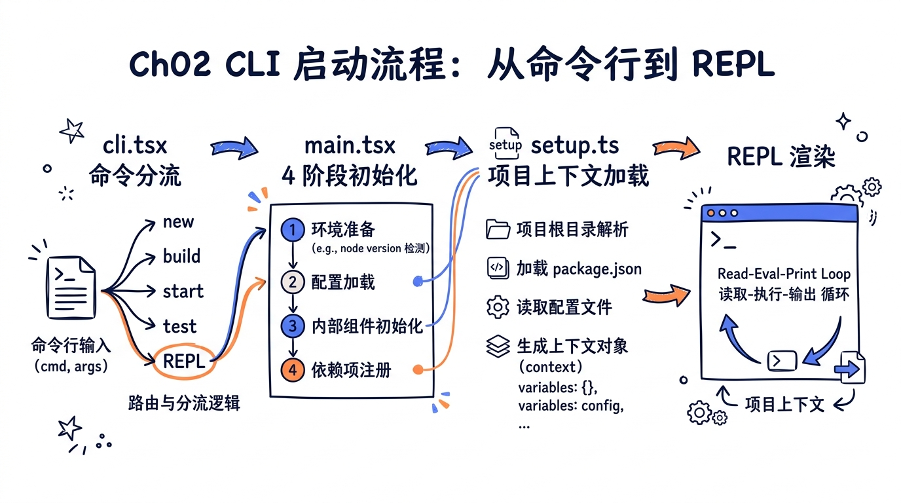
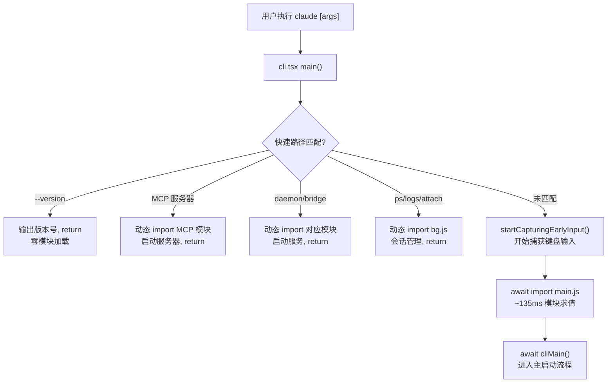
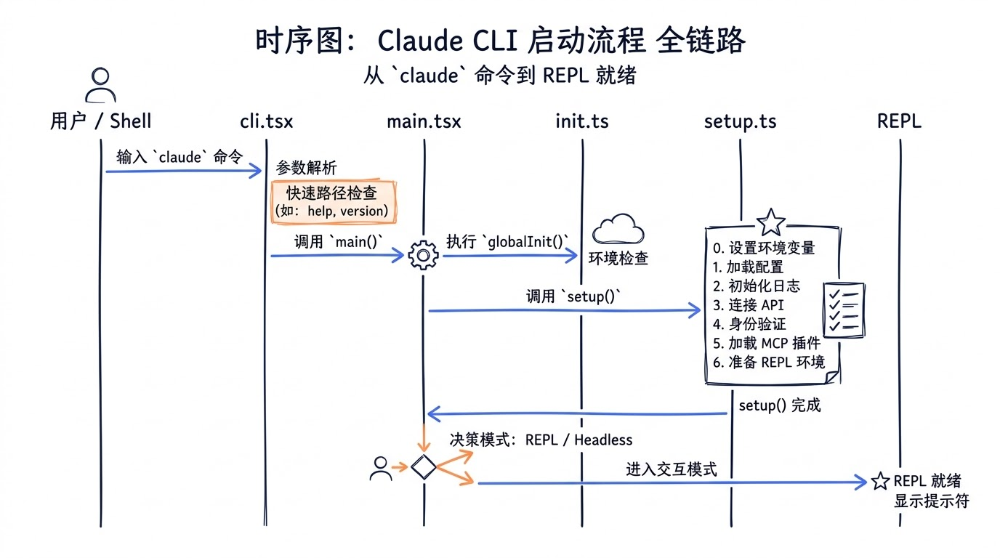
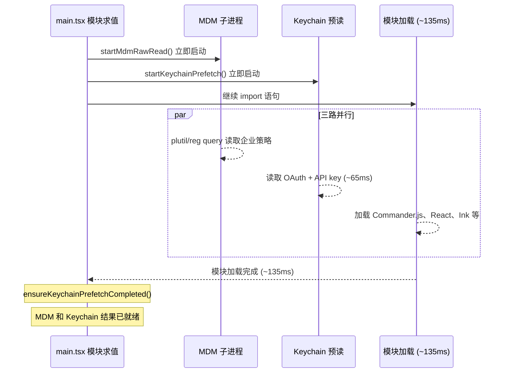
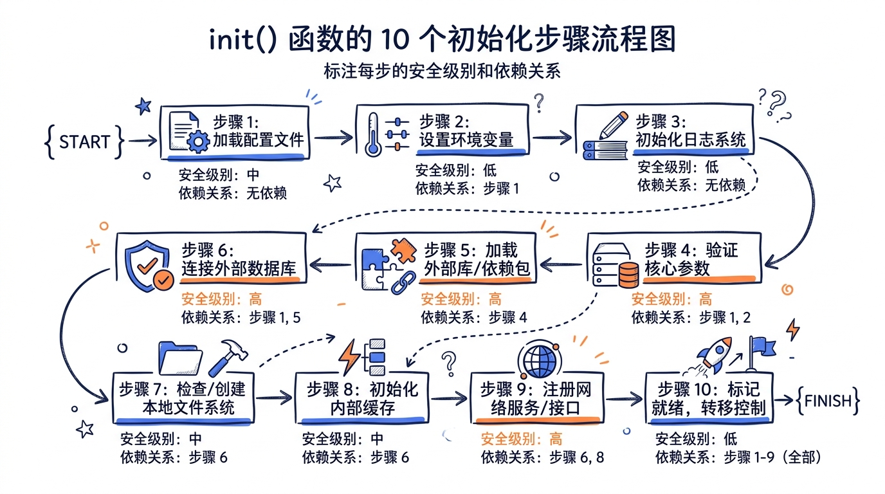
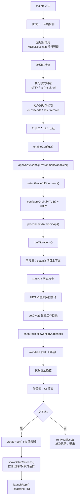
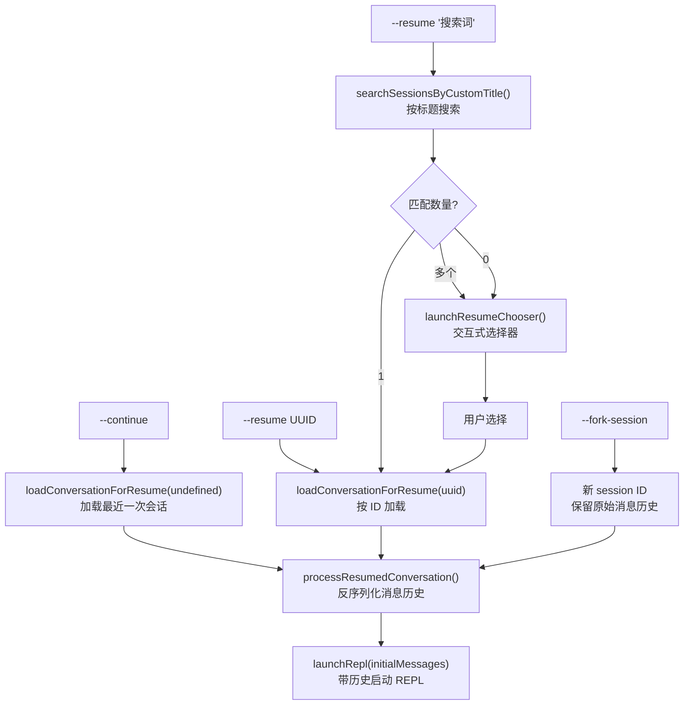
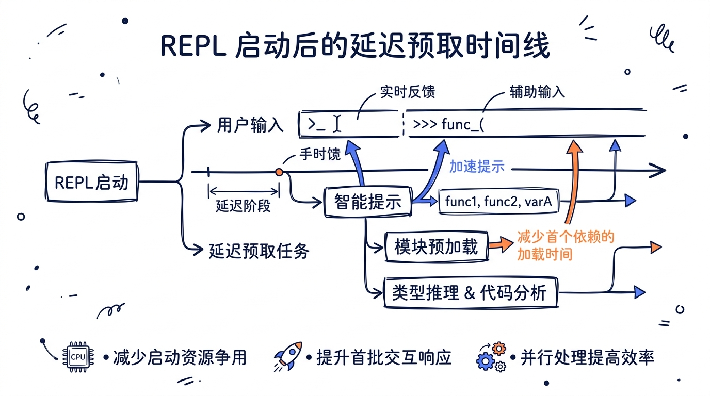
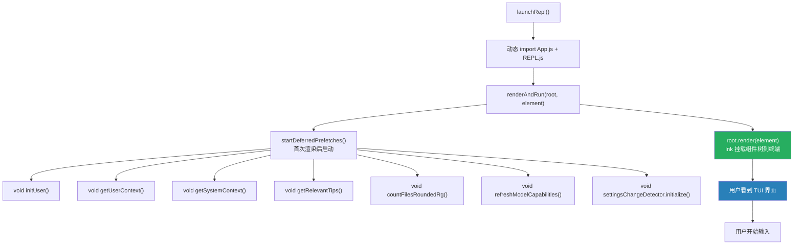

# 第二章：CLI 启动流程——从命令行到 REPL



> 本系列基于 Claude Code v2.1.88 源码（`@anthropic-ai/claude-code`）进行分析，所有代码示例均来自真实源文件。

---

当你在终端敲下 `claude` 并按下回车，肉眼可见的只是一个简洁的 TUI 界面在零点几秒内弹出。但在幕后，一场由数十个异步任务、环境探测、安全检查和状态初始化组成的精密编排已经悄然完成。理解这个启动链路，是理解整个 Code Agent 架构的第一步——因为启动阶段的设计决策，决定了 Agent 此后所有行为的边界和能力。


---

## 学习目标

完成本章学习后，你将能够：

1. **完整追踪** `claude` 命令执行到 REPL 就绪的全链路，包括每个阶段的输入、输出和依赖关系
2. **理解四阶段初始化过程**：环境检测 -> 认证流程 -> 项目上下文加载 -> REPL 渲染
3. **掌握多环境适配机制**：终端 CLI、VS Code 扩展、SDK 调用等不同入口如何汇入同一条初始化主线
4. **实现会话恢复**：`--resume` 和 `--continue` 背后的会话序列化与反序列化设计

---

## 2.1 入口文件 `cli.tsx`：快速路径与子命令分流

Claude Code 的真正入口不是 `main.tsx`，而是 `src/entrypoints/cli.tsx`。这个文件的核心设计理念只有一个词：**分流**。

### 2.1.1 零依赖快速路径

```typescript
// src/entrypoints/cli.tsx 第 33-42 行
async function main(): Promise<void> {
  const args = process.argv.slice(2);

  // Fast-path for --version/-v: zero module loading needed
  if (args.length === 1 && (args[0] === '--version' || args[0] === '-v' || args[0] === '-V')) {
    // MACRO.VERSION is inlined at build time
    console.log(`${MACRO.VERSION} (Claude Code)`);
    return;
  }
  // ...
}
```

`--version` 的处理是整个代码库里最快的路径：没有任何 `import`，没有模块加载，`MACRO.VERSION` 是构建时由 Bun 内联的编译期常量。这意味着 `claude --version` 的执行时间接近零。

这不是偶然的优化。一个 CLI 工具如果连 `--version` 都需要等半秒，用户对它的信任会从第一次交互就开始流失。

### 2.1.2 86 个 Slash 命令的快速路径与延迟加载

Claude Code 注册了 **86 个 Slash 命令**（位于 `src/commands/`），覆盖会话与流程、配置与环境、网络与远程、开发工作流、调试与诊断、安装与认证等 7 大类别。`cli.tsx` 接下来用一系列条件分支处理快速路径子集，每一个都使用**动态 `import()`** 来避免加载不相关的模块：

```typescript
// src/entrypoints/cli.tsx 第 72-93 行（精简展示）
if (process.argv[2] === '--claude-in-chrome-mcp') {
  profileCheckpoint('cli_claude_in_chrome_mcp_path');
  const { runClaudeInChromeMcpServer } = await import('../utils/claudeInChrome/mcpServer.js');
  await runClaudeInChromeMcpServer();
  return;
} else if (process.argv[2] === '--chrome-native-host') {
  const { runChromeNativeHost } = await import('../utils/claudeInChrome/chromeNativeHost.js');
  await runChromeNativeHost();
  return;
} else if (feature('CHICAGO_MCP') && process.argv[2] === '--computer-use-mcp') {
  const { runComputerUseMcpServer } = await import('../utils/computerUse/mcpServer.js');
  await runComputerUseMcpServer();
  return;
}
```

完整的快速路径清单：

| 快速路径 | 触发条件 | 作用 |
|---------|---------|------|
| `--version` | `-v`, `-V`, `--version` | 输出版本号，零模块加载 |
| `--dump-system-prompt` | 内部构建 | 输出系统提示，退出 |
| `--claude-in-chrome-mcp` | Chrome 扩展调用 | 启动 Chrome MCP 服务器 |
| `--chrome-native-host` | Chrome Native Messaging | 启动原生消息宿主 |
| `--computer-use-mcp` | 内部功能 | 启动 Computer Use MCP |
| `--daemon-worker` | supervisor 派生 | 启动 daemon worker |
| `remote-control` / `rc` | 远程控制模式 | 启动 bridge 模式 |
| `daemon` | 守护进程管理 | 启动 daemon supervisor |
| `ps` / `logs` / `attach` / `kill` | 后台会话管理 | 管理后台 session |
| `new` / `list` / `reply` | 模板任务 | 处理模板作业 |
| `environment-runner` | BYOC 运行器 | 无头环境运行 |
| `self-hosted-runner` | 自托管运行器 | 自托管 runner |
| `--worktree --tmux` | worktree + tmux | 在 tmux 中创建 worktree |
| `--update` / `--upgrade` | 更新命令 | 重定向到 `update` 子命令 |

注意 `feature()` 函数的使用——这是 Bun 的编译期特性标志，构建时会进行**死代码消除**（Dead Code Elimination）。外部构建不包含内部功能的代码路径，这既是安全措施也是体积优化。

### 2.1.3 进入主流程

当所有快速路径都未匹配时，控制流终于进入 `main.tsx`：

```typescript
// src/entrypoints/cli.tsx 第 287-298 行
// No special flags detected, load and run the full CLI
const { startCapturingEarlyInput } = await import('../utils/earlyInput.js');
startCapturingEarlyInput();
profileCheckpoint('cli_before_main_import');
const { main: cliMain } = await import('../main.js');
profileCheckpoint('cli_after_main_import');
await cliMain();
profileCheckpoint('cli_after_main_complete');
```

`startCapturingEarlyInput()` 值得注意——它在加载 `main.tsx`（约 135ms 的模块求值）之前就开始捕获用户的键盘输入。这样即使 Agent 还在初始化，用户已经输入的内容也不会丢失。这是 CLI 工具追求极致响应感的一个典型手法。



---

## 2.2 `main.tsx` 四阶段初始化

`main.tsx` 是整个 Claude Code 的核心启动文件，将近 4000 行代码。它的初始化过程可以分为四个清晰的阶段。

### 2.2.1 阶段一：环境检测与顶层副作用

`main.tsx` 的前 20 行做了三件必须最先完成的事——它们是**顶层副作用**，在所有 `import` 执行之前就开始运行：

```typescript
// src/main.tsx 第 9-20 行
import { profileCheckpoint, profileReport } from './utils/startupProfiler.js';
profileCheckpoint('main_tsx_entry');  // 1. 记录入口时间点

import { startMdmRawRead } from './utils/settings/mdm/rawRead.js';
startMdmRawRead();  // 2. 启动 MDM 子进程（macOS 企业策略）

import { ensureKeychainPrefetchCompleted, startKeychainPrefetch }
  from './utils/secureStorage/keychainPrefetch.js';
startKeychainPrefetch();  // 3. 启动 Keychain 预读（OAuth + API key）
```

为什么要这么早启动这些操作？代码注释说得很直白：

> startKeychainPrefetch fires both macOS keychain reads (OAuth + legacy API key) in parallel -- isRemoteManagedSettingsEligible() otherwise reads them sequentially via sync spawn inside applySafeConfigEnvironmentVariables() (~65ms on every macOS startup)

把 65ms 的串行阻塞变成与 135ms 模块加载的并行执行，启动时间从 200ms 降到 135ms。这种"**把等待时间与有效工作重叠**"的思路贯穿了整个启动流程。





**反调试保护**也在这个阶段执行：

```typescript
// src/main.tsx 第 232-271 行
function isBeingDebugged() {
  const isBun = isRunningWithBun();
  const hasInspectArg = process.execArgv.some(arg => {
    if (isBun) {
      return /--inspect(-brk)?/.test(arg);
    } else {
      return /--inspect(-brk)?|--debug(-brk)?/.test(arg);
    }
  });
  const hasInspectEnv = process.env.NODE_OPTIONS &&
    /--inspect(-brk)?|--debug(-brk)?/.test(process.env.NODE_OPTIONS);
  // ...
}

if ("external" !== 'ant' && isBeingDebugged()) {
  process.exit(1);
}
```

外部构建检测到 Node.js 调试模式时直接退出——这是对源码保护的一种措施。注意 `"external" !== 'ant'` 是编译期常量比较，在内部构建中这个分支会被完全消除。

**执行模式判定**紧跟其后：

```typescript
// src/main.tsx 第 797-812 行
const cliArgs = process.argv.slice(2);
const hasPrintFlag = cliArgs.includes('-p') || cliArgs.includes('--print');
const hasInitOnlyFlag = cliArgs.includes('--init-only');
const hasSdkUrl = cliArgs.some(arg => arg.startsWith('--sdk-url'));
const isNonInteractive = hasPrintFlag || hasInitOnlyFlag || hasSdkUrl || !process.stdout.isTTY;

if (isNonInteractive) {
  stopCapturingEarlyInput();
}

const isInteractive = !isNonInteractive;
setIsInteractive(isInteractive);
```

四种条件中的任一种触发非交互模式：`-p` 标志、`--init-only`、`--sdk-url`、或者**stdout 不是 TTY**。最后一种条件意味着如果你把 Claude Code 的输出管道到另一个程序（`claude ... | grep`），它会自动切换到非交互模式——对管道友好的设计。

**客户端类型识别**在模式判定之后：

```typescript
// src/main.tsx 第 818-833 行
const clientType = (() => {
  if (isEnvTruthy(process.env.GITHUB_ACTIONS)) return 'github-action';
  if (process.env.CLAUDE_CODE_ENTRYPOINT === 'sdk-ts') return 'sdk-typescript';
  if (process.env.CLAUDE_CODE_ENTRYPOINT === 'sdk-py') return 'sdk-python';
  if (process.env.CLAUDE_CODE_ENTRYPOINT === 'sdk-cli') return 'sdk-cli';
  if (process.env.CLAUDE_CODE_ENTRYPOINT === 'claude-vscode') return 'claude-vscode';
  if (process.env.CLAUDE_CODE_ENTRYPOINT === 'local-agent') return 'local-agent';
  if (process.env.CLAUDE_CODE_ENTRYPOINT === 'claude-desktop') return 'claude-desktop';
  const hasSessionIngressToken = process.env.CLAUDE_CODE_SESSION_ACCESS_TOKEN ||
    process.env.CLAUDE_CODE_WEBSOCKET_AUTH_FILE_DESCRIPTOR;
  if (process.env.CLAUDE_CODE_ENTRYPOINT === 'remote' || hasSessionIngressToken) {
    return 'remote';
  }
  return 'cli';
})();
setClientType(clientType);
```

这段代码揭示了 Claude Code 支持的全部环境入口——通过环境变量 `CLAUDE_CODE_ENTRYPOINT` 来区分不同的调用方。我们将在 2.5 节详细讨论这个多环境适配机制。

### 2.2.2 阶段二：`init()` 与认证流程

`main.tsx` 使用 Commander.js 的 `preAction` hook 来确保初始化在任何命令执行之前完成：

```typescript
// src/main.tsx 第 907-966 行
program.hook('preAction', async thisCommand => {
  profileCheckpoint('preAction_start');
  // 等待顶层副作用完成
  await Promise.all([ensureMdmSettingsLoaded(), ensureKeychainPrefetchCompleted()]);
  profileCheckpoint('preAction_after_mdm');

  // 核心初始化
  await init();
  profileCheckpoint('preAction_after_init');

  // 设置进程标题
  if (!isEnvTruthy(process.env.CLAUDE_CODE_DISABLE_TERMINAL_TITLE)) {
    process.title = 'claude';
  }

  // 初始化日志 sink
  const { initSinks } = await import('./utils/sinks.js');
  initSinks();

  // 运行数据迁移
  runMigrations();

  // 加载远程托管设置（非阻塞）
  void loadRemoteManagedSettings();
  void loadPolicyLimits();
});
```

`init()` 函数定义在 `src/entrypoints/init.ts`，是一个 **memoized 异步函数**——无论调用多少次，只执行一次。它的职责清单如下：

```typescript
// src/entrypoints/init.ts 第 57-237 行（关键步骤）
export const init = memoize(async (): Promise<void> => {
  // 1. 启用配置系统
  enableConfigs();

  // 2. 应用安全的环境变量（不包含危险的 LD_PRELOAD 等）
  applySafeConfigEnvironmentVariables();

  // 3. 应用额外 CA 证书
  applyExtraCACertsFromConfig();

  // 4. 注册优雅退出处理
  setupGracefulShutdown();

  // 5. 初始化 OAuth 信息
  void populateOAuthAccountInfoIfNeeded();

  // 6. 初始化 JetBrains IDE 检测
  void initJetBrainsDetection();

  // 7. 初始化远程托管设置加载 Promise
  if (isEligibleForRemoteManagedSettings()) {
    initializeRemoteManagedSettingsLoadingPromise();
  }

  // 8. 配置 mTLS
  configureGlobalMTLS();

  // 9. 配置 HTTP 代理
  configureGlobalAgents();

  // 10. 预连接 Anthropic API（TCP+TLS 握手）
  preconnectAnthropicApi();

  // 11. Windows 下设置 git-bash
  setShellIfWindows();
});
```



**认证流程**是 `init()` 中最复杂的部分之一。Claude Code 支持五种认证方式，由 `src/utils/auth.ts` 统一管理：

| 认证方式 | 环境变量 / 配置 | 适用场景 |
|---------|---------------|---------|
| **API Key** | `ANTHROPIC_API_KEY` 或 macOS Keychain | 直接 API 调用 |
| **OAuth** (Claude.ai) | `~/.claude/` 下的 token 文件 | 个人/Pro 用户 |
| **AWS Bedrock** | `CLAUDE_CODE_USE_BEDROCK` | 企业 AWS 部署 |
| **GCP Vertex AI** | `CLAUDE_CODE_USE_VERTEX` | 企业 GCP 部署 |
| **API Key Helper** | `settings.json` 中配置的外部命令 | 自定义凭证管理 |

认证优先级的核心逻辑在 `getAuthTokenSource()` 中：

```typescript
// src/utils/auth.ts 第 153-207 行（精简）
export function getAuthTokenSource() {
  // 1. 文件描述符传递的 OAuth token（SDK 场景）
  const fdOAuth = getOAuthTokenFromFileDescriptor();
  if (fdOAuth) return { type: 'oauth-fd', token: fdOAuth };

  // 2. 文件描述符传递的 API key（SDK 场景）
  const fdApiKey = getApiKeyFromFileDescriptor();
  if (fdApiKey) return { type: 'apikey-fd', key: fdApiKey };

  // 3. OAuth token（Claude.ai 登录）
  const oauthTokens = getClaudeAIOAuthTokens();
  if (shouldUseClaudeAIAuth(oauthTokens?.scopes) && oauthTokens?.accessToken) {
    return { type: 'oauth', token: oauthTokens.accessToken };
  }

  // 4. API key（环境变量 / Keychain / 配置文件）
  const apiKey = getAnthropicApiKey();
  if (apiKey) return { type: 'apikey', key: apiKey };

  // 5. Bedrock / Vertex 各有独立的凭证链
  // ...
}
```

**API Key Helper** 是一个精巧的设计——用户可以在 `settings.json` 中配置一个外部命令（如 `1password-cli`、`aws secretsmanager` 等），Claude Code 会执行这个命令来获取 API key。这允许集成任何企业级密钥管理系统：

```typescript
// src/utils/auth.ts 第 469-575 行（精简）
export async function getApiKeyFromApiKeyHelper(
  helper: string,
): Promise<string | null> {
  // 使用 TTL 缓存避免频繁调用外部命令
  const cached = getApiKeyFromApiKeyHelperCached();
  if (cached) return cached;

  // 执行外部命令
  const result = await _executeApiKeyHelper(helper);
  // 缓存结果（默认 5 分钟 TTL）
  return result;
}
```

`preconnectAnthropicApi()` 是另一个精妙的优化——在认证配置完成后、实际 API 调用之前，就发起 TCP+TLS 握手：

```typescript
// 预连接注释（init.ts 第 153-159 行）
// Preconnect to the Anthropic API — overlap TCP+TLS handshake
// (~100-200ms) with the ~100ms of action-handler work before the API
// request. After CA certs + proxy agents are configured so the warmed
// connection uses the right transport.
preconnectAnthropicApi();
```

这把 100-200ms 的网络握手隐藏在后续初始化工作的背后。

### 2.2.3 阶段三：`setup.ts`——项目上下文加载

`setup()` 函数定义在 `src/setup.ts`，是 Agent "认识自己工作环境"的阶段。

```typescript
// src/setup.ts 第 56-66 行
export async function setup(
  cwd: string,
  permissionMode: PermissionMode,
  allowDangerouslySkipPermissions: boolean,
  worktreeEnabled: boolean,
  worktreeName: string | undefined,
  tmuxEnabled: boolean,
  customSessionId?: string | null,
  worktreePRNumber?: number,
  messagingSocketPath?: string,
): Promise<void> {
```

我们在 2.5 节会深度剖析 `setup.ts` 的每一个步骤，这里先梳理它在四阶段初始化中的位置。`setup()` 在 `main.tsx` 中的调用点约在第 1907 行：

```typescript
// src/main.tsx 第 1903-1936 行
profileCheckpoint('action_before_setup');
const { setup } = await import('./setup.js');

// 并行化 setup() 与 commands/agents 加载
const preSetupCwd = getCwd();
// 注册 bundled skills/plugins（纯内存操作，< 1ms）
initBuiltinPlugins();
initBundledSkills();

const setupPromise = setup(preSetupCwd, permissionMode, ...);
const commandsPromise = worktreeEnabled ? null : getCommands(preSetupCwd);
const agentDefsPromise = worktreeEnabled ? null : getAgentDefinitionsWithOverrides(preSetupCwd);

// 抑制瞬态 unhandledRejection
commandsPromise?.catch(() => {});
agentDefsPromise?.catch(() => {});

await setupPromise;
logForDebugging(`[STARTUP] setup() completed in ${Date.now() - setupStart}ms`);
```

注意这里的**并行化策略**：`setup()` 内部主要是 socket 绑定（~20ms）等 I/O 操作，而 `getCommands()` 是文件系统读取，两者不互相竞争 CPU。除非启用了 `--worktree`（setup 可能改变 cwd），否则命令和 Agent 定义的加载与 setup 并行执行。

### 2.2.4 阶段四：交互式 UI 渲染或无头执行

四阶段初始化的最后一步是根据执行模式分流：

**交互式路径**——创建 Ink 根节点，显示 setup 界面（信任对话框、登录、权限确认），然后启动 REPL：

```typescript
// src/main.tsx 第 2218-2241 行
if (!isNonInteractiveSession) {
  const ctx = getRenderContext(false);
  const { createRoot } = await import('./ink.js');
  root = await createRoot(ctx.renderOptions);

  // 记录启动时间（在任何对话框之前）
  logEvent('tengu_timer', {
    event: 'startup',
    durationMs: Math.round(process.uptime() * 1000)
  });

  // 显示 setup 界面：信任对话框、登录、权限确认
  const onboardingShown = await showSetupScreens(
    root, permissionMode, allowDangerouslySkipPermissions,
    commands, enableClaudeInChrome, devChannels
  );
}
```

**无头路径**（`-p`）——跳过所有 UI，直接执行：

```typescript
// src/main.tsx 第 2584-2860 行
if (isNonInteractiveSession) {
  // 应用完整环境变量（信任对话框被跳过，-p 模式隐含信任）
  applyConfigEnvironmentVariables();
  initializeTelemetryAfterTrust();

  // 加载命令（仅保留支持无头模式的命令）
  const commandsHeadless = disableSlashCommands ? [] :
    commands.filter(command =>
      (command.type === 'prompt' && !command.disableNonInteractive) ||
      (command.type === 'local' && command.supportsNonInteractive)
    );

  // 创建状态 store（不使用 React）
  const headlessStore = createStore(headlessInitialState, onChangeAppState);

  // 导入并执行
  const { runHeadless } = await import('src/cli/print.js');
  void runHeadless(inputPrompt, () => headlessStore.getState(), ...);
  return;
}
```



---

## 2.3 非交互模式：`--print` / `--output-format` 的分流逻辑

非交互模式不仅仅是"没有 UI 的交互模式"——它有自己完整的输入/输出协议设计。

### 2.3.1 三种输出格式

```typescript
// src/main.tsx 第 968-971 行（Commander.js 选项注册）
.addOption(new Option('--output-format <format>',
  'Output format (only works with --print): "text" (default), "json" (single result), or "stream-json" (realtime streaming)')
  .choices(['text', 'json', 'stream-json']))
.addOption(new Option('--input-format <format>',
  'Input format (only works with --print): "text" (default), or "stream-json" (realtime streaming input)')
  .choices(['text', 'stream-json']))
```

| 格式 | 用途 | 数据结构 |
|------|------|---------|
| `text` | Shell 脚本、人类阅读 | 纯文本流 |
| `json` | 单次结果解析 | 完整 JSON 对象 |
| `stream-json` | 实时处理、SDK 集成 | NDJSON（每行一个 JSON） |

### 2.3.2 SDK URL 自动配置

当通过 SDK 调用时（`--sdk-url`），格式会被自动设置：

```typescript
// src/main.tsx 第 1236-1252 行
if (sdkUrl) {
  if (!inputFormat) inputFormat = 'stream-json';
  if (!outputFormat) outputFormat = 'stream-json';
  if (options.verbose === undefined) verbose = true;
  if (!options.print) print = true;
}
```

这段代码揭示了一个重要的设计原则：**SDK 调用本质上是一种特殊的非交互模式**。通过环境变量和自动配置，SDK 可以与 CLI 共享同一条代码路径。

### 2.3.3 stdin 智能处理

无头模式下的 stdin 处理有一个巧妙的超时机制：

```typescript
// src/main.tsx 第 857-883 行
async function getInputPrompt(
  prompt: string,
  inputFormat: 'text' | 'stream-json'
): Promise<string | AsyncIterable<string>> {
  if (!process.stdin.isTTY && !process.argv.includes('mcp')) {
    if (inputFormat === 'stream-json') {
      return process.stdin;  // stream-json 直接返回流
    }
    // text 模式：读取全部 stdin
    process.stdin.setEncoding('utf8');
    let data = '';
    const onData = (chunk: string) => { data += chunk; };
    process.stdin.on('data', onData);

    // 3 秒超时：防止从未写入的管道永远阻塞
    const timedOut = await peekForStdinData(process.stdin, 3000);
    process.stdin.off('data', onData);
    if (timedOut) {
      process.stderr.write('Warning: no stdin data received in 3s, proceeding without it.\n');
    }
    return [prompt, data].filter(Boolean).join('\n');
  }
  return prompt;
}
```

为什么需要 3 秒超时？注释解释了："Stdin is likely an inherited pipe from a parent that isn't writing"。在复杂的进程树中，子进程可能继承了父进程的 stdin 管道，但父进程并不会向它写数据。没有超时的话，程序会永远等下去。

### 2.3.4 执行控制参数

无头模式提供了一系列控制执行行为的参数：

```typescript
// 最大轮数（防止 Agent 无限循环）
.addOption(new Option('--max-turns <turns>',
  'Maximum number of agentic turns (only works with --print)')
  .argParser(Number))

// 最大预算（按美元计费）
.addOption(new Option('--max-budget-usd <amount>',
  'Maximum dollar amount to spend on API calls')
  .argParser(value => {
    const amount = Number(value);
    if (isNaN(amount) || amount <= 0) {
      throw new Error('--max-budget-usd must be a positive number greater than 0');
    }
    return amount;
  }))

// JSON Schema 结构化输出
.addOption(new Option('--json-schema <schema>',
  'JSON Schema for structured output validation.'))
```

`--max-budget-usd` 是一个实用的安全阀——在 CI/CD 中防止一次失控的 Agent 会话消耗过多 API 额度。

---

## 2.4 多环境适配：终端 / VS Code / JetBrains / Desktop / SDK

Claude Code 不仅仅是一个终端工具。同一套核心代码运行在多种环境中，通过 `CLAUDE_CODE_ENTRYPOINT` 环境变量来识别和适配。

### 2.4.1 入口点识别

```typescript
// src/main.tsx 第 517-540 行
function initializeEntrypoint(isNonInteractive: boolean): void {
  if (process.env.CLAUDE_CODE_ENTRYPOINT) {
    return;  // 已由外部设置（SDK / Desktop）
  }
  const cliArgs = process.argv.slice(2);

  // MCP serve 命令
  const mcpIndex = cliArgs.indexOf('mcp');
  if (mcpIndex !== -1 && cliArgs[mcpIndex + 1] === 'serve') {
    process.env.CLAUDE_CODE_ENTRYPOINT = 'mcp';
    return;
  }

  // GitHub Action
  if (isEnvTruthy(process.env.CLAUDE_CODE_ACTION)) {
    process.env.CLAUDE_CODE_ENTRYPOINT = 'claude-code-github-action';
    return;
  }

  // 根据交互状态设置
  process.env.CLAUDE_CODE_ENTRYPOINT = isNonInteractive ? 'sdk-cli' : 'cli';
}
```

### 2.4.2 各环境的行为差异

| 环境 | `CLAUDE_CODE_ENTRYPOINT` | 特殊行为 |
|------|------------------------|---------|
| **终端 CLI** | `cli` | 完整 TUI，信任对话框 |
| **VS Code 扩展** | `claude-vscode` | questionPreviewFormat 由扩展设置 |
| **JetBrains 插件** | （运行时检测） | `initJetBrainsDetection()` 异步探测 |
| **Claude Desktop** | `claude-desktop` | 跳过 `--dangerously-skip-permissions` 检查 |
| **Agent SDK (TS)** | `sdk-ts` | 自动 stream-json，跳过 UI |
| **Agent SDK (Python)** | `sdk-py` | 同上 |
| **远程会话** | `remote` | Session Ingress Token 认证 |
| **GitHub Action** | `claude-code-github-action` | 从 `GITHUB_ACTION_INPUTS` 读取配置 |
| **MCP 服务器** | `mcp` | 启动 MCP serve 模式 |
| **Local Agent** | `local-agent` | 跳过 bundled plugins/skills 初始化 |

客户端类型影响着 Question Preview 格式的选择：

```typescript
// src/main.tsx 第 835-843 行
const previewFormat = process.env.CLAUDE_CODE_QUESTION_PREVIEW_FORMAT;
if (previewFormat === 'markdown' || previewFormat === 'html') {
  setQuestionPreviewFormat(previewFormat);
} else if (!clientType.startsWith('sdk-') &&
  clientType !== 'claude-desktop' &&
  clientType !== 'local-agent' &&
  clientType !== 'remote') {
  setQuestionPreviewFormat('markdown');  // CLI 默认使用 markdown
}
```

### 2.4.3 SDK 集成的三种模式

SDK 通过以下方式调用 Claude Code：

1. **直接 CLI 调用**（`sdk-cli`）：通过命令行参数传递配置，`-p` 模式执行
2. **TypeScript SDK**（`sdk-ts`）：通过 `--sdk-url` 建立 WebSocket 连接
3. **Python SDK**（`sdk-py`）：通过 stdin/stdout 的 stream-json 协议通信

```typescript
// src/main.tsx 第 1236-1252 行 — SDK URL 自动切换到 stream-json
if (sdkUrl) {
  if (!inputFormat) inputFormat = 'stream-json';
  if (!outputFormat) outputFormat = 'stream-json';
  if (options.verbose === undefined) verbose = true;
  if (!options.print) print = true;
}
```

---

## 2.5 `setup.ts` 深度剖析

`setup.ts` 是 Agent "认识自己工作环境"的核心文件。虽然只有 477 行，但每一行都有严格的顺序约束。

### 2.5.1 Node.js 版本门槛

```typescript
// src/setup.ts 第 70-79 行
const nodeVersion = process.version.match(/^v(\d+)\./)?.[1];
if (!nodeVersion || parseInt(nodeVersion) < 18) {
  console.error(chalk.bold.red(
    'Error: Claude Code requires Node.js version 18 or higher.',
  ));
  process.exit(1);
}
```

Node 18 是硬性最低要求——它引入了原生 `fetch`、稳定的 ES Module、和 `AbortSignal.timeout()` 等 Claude Code 依赖的 API。

### 2.5.2 UDS 消息服务器

```typescript
// src/setup.ts 第 89-102 行
if (!isBareMode() || messagingSocketPath !== undefined) {
  if (feature('UDS_INBOX')) {
    const m = await import('./utils/udsMessaging.js');
    await m.startUdsMessaging(
      messagingSocketPath ?? m.getDefaultUdsSocketPath(),
      { isExplicit: messagingSocketPath !== undefined },
    );
  }
}
```

Unix Domain Socket 消息服务器是多 Agent 协作（swarm）的基础设施。它**必须**在 `setup()` 中启动且 await 完成，因为后续的 `SessionStart` hook 可能会派生子进程，那些子进程需要在 `process.env` 中找到 socket 路径。

`--bare` 模式（`CLAUDE_CODE_SIMPLE=1`）跳过此步——脚本化调用不需要多 Agent 协作。

### 2.5.3 工作目录设置与 Hooks 快照

```typescript
// src/setup.ts 第 160-169 行
// IMPORTANT: setCwd() must be called before any other code that depends on the cwd
setCwd(cwd);

// IMPORTANT: Must be called AFTER setCwd() so hooks are loaded from the correct directory
captureHooksConfigSnapshot();
initializeFileChangedWatcher(cwd);
```

两条 `IMPORTANT` 注释标记了一个**不可违反的顺序约束**：

1. `setCwd()` 必须先执行——几乎所有后续操作都依赖 cwd
2. `captureHooksConfigSnapshot()` 必须在 `setCwd()` 之后——否则会读取错误目录的 hooks 配置

**Hooks 配置快照**是一个安全机制：在会话开始时拍摄 `.claude/settings.json` 中 hooks 配置的快照，后续使用快照而非实时配置。这防止了"Agent 在执行过程中修改了 hooks 配置，然后用新配置执行恶意操作"的攻击场景。

### 2.5.4 Worktree 创建

```typescript
// src/setup.ts 第 175-285 行（精简）
if (worktreeEnabled) {
  const hasHook = hasWorktreeCreateHook();
  const inGit = await getIsGit();
  if (!hasHook && !inGit) {
    process.stderr.write(chalk.red(
      `Error: Can only use --worktree in a git repository...`
    ));
    process.exit(1);
  }

  const slug = worktreePRNumber
    ? `pr-${worktreePRNumber}`
    : (worktreeName ?? getPlanSlug());

  // 解析到主仓库根目录（处理从 worktree 内部调用的情况）
  if (inGit) {
    const mainRepoRoot = findCanonicalGitRoot(getCwd());
    if (mainRepoRoot !== (findGitRoot(getCwd()) ?? getCwd())) {
      process.chdir(mainRepoRoot);
      setCwd(mainRepoRoot);
    }
  }

  // 创建 worktree
  let worktreeSession = await createWorktreeForSession(
    getSessionId(), slug, tmuxSessionName, ...
  );

  // 切换到 worktree 目录
  process.chdir(worktreeSession.worktreePath);
  setCwd(worktreeSession.worktreePath);
  setOriginalCwd(getCwd());
  setProjectRoot(getCwd());

  // 重新加载配置和 hooks
  clearMemoryFileCaches();
  updateHooksConfigSnapshot();
}
```

Worktree 创建后会**重新设置 cwd 和项目根目录**，并刷新所有缓存。这确保 Agent 在 worktree 中工作时使用正确的配置。

### 2.5.5 安全策略初始化

`--dangerously-skip-permissions` 的安全检查是分层的：

```typescript
// src/setup.ts 第 396-441 行
if (permissionMode === 'bypassPermissions' || allowDangerouslySkipPermissions) {
  // 层级 1：禁止 root/sudo（除非在沙箱中）
  if (process.platform !== 'win32' &&
      typeof process.getuid === 'function' &&
      process.getuid() === 0 &&
      process.env.IS_SANDBOX !== '1' &&
      !isEnvTruthy(process.env.CLAUDE_CODE_BUBBLEWRAP)) {
    console.error('--dangerously-skip-permissions cannot be used with root/sudo...');
    process.exit(1);
  }

  // 层级 2：内部用户必须在沙箱且无互联网
  if (process.env.USER_TYPE === 'ant' &&
      process.env.CLAUDE_CODE_ENTRYPOINT !== 'local-agent' &&
      process.env.CLAUDE_CODE_ENTRYPOINT !== 'claude-desktop') {
    const [isDocker, hasInternet] = await Promise.all([
      envDynamic.getIsDocker(),
      env.hasInternetAccess(),
    ]);
    const isSandboxed = isDocker || isBubblewrap || isSandbox;
    if (!isSandboxed || hasInternet) {
      console.error('--dangerously-skip-permissions can only be used in Docker/sandbox...');
      process.exit(1);
    }
  }
}
```

安全模型遵循**最小权限原则**：权限绕过越强，要求的隔离条件越严格。

### 2.5.6 工具预注册与 MCP 连接

工具和 MCP 的预注册发生在 `main.tsx` 中（在 `setup()` 之前或并行）：

```typescript
// src/main.tsx 第 1923-1926 行
if (process.env.CLAUDE_CODE_ENTRYPOINT !== 'local-agent') {
  initBuiltinPlugins();   // 注册内置插件
  initBundledSkills();     // 注册内置技能
}
```

MCP 配置的加载也是并行启动的：

```typescript
// src/main.tsx 第 1803-1814 行
const mcpConfigPromise = (strictMcpConfig || isBareMode()
  ? Promise.resolve({ servers: {} })
  : getClaudeCodeMcpConfigs(dynamicMcpConfig)
).then(result => {
  mcpConfigResolvedMs = Date.now() - mcpConfigStart;
  return result;
});
```

`--bare` 模式跳过自动发现的 MCP 配置（`.mcp.json`、用户设置、插件），只使用 `--mcp-config` 显式传入的配置。

### 2.5.7 上一次会话数据补报

```typescript
// src/setup.ts 第 449-476 行
const projectConfig = getCurrentProjectConfig();
if (projectConfig.lastCost !== undefined &&
    projectConfig.lastDuration !== undefined) {
  logEvent('tengu_exit', {
    last_session_cost: projectConfig.lastCost,
    last_session_duration: projectConfig.lastDuration,
    last_session_total_input_tokens: projectConfig.lastTotalInputTokens,
    last_session_total_output_tokens: projectConfig.lastTotalOutputTokens,
    last_session_fps_average: projectConfig.lastFpsAverage,
    last_session_id: projectConfig.lastSessionId,
    // ...
  });
}
```

在新会话启动时补报上一次会话的退出数据。为什么不在退出时直接上报？因为退出可能是非正常的（Ctrl+C、kill -9、系统重启），来不及完成异步上报。这种"下次启动时补报"的模式，保证了数据完整性，又不影响退出速度。

---

## 2.6 会话恢复：`--resume` / `--continue` 的实现

Claude Code 支持两种会话恢复方式，在 `main.tsx` 的交互式路径中处理。

### 2.6.1 `--continue`：恢复最近一次会话

```typescript
// src/main.tsx 第 3101-3155 行
if (options.continue) {
  let resumeSucceeded = false;
  try {
    const resumeStart = performance.now();

    // 清除陈旧缓存，确保新鲜的文件/技能发现
    const { clearSessionCaches } = await import('./commands/clear/caches.js');
    clearSessionCaches();

    // 加载最近的会话（不指定 sessionId）
    const result = await loadConversationForResume(
      undefined, // sessionId — undefined 表示"最近一次"
      undefined  // sourceFile
    );
    if (!result) {
      return await exitWithError(root, 'No conversation found to continue');
    }

    // 处理恢复的会话
    const loaded = await processResumedConversation(result, {
      forkSession: !!options.forkSession,
      includeAttribution: true,
      transcriptPath: result.fullPath
    }, resumeContext);

    // 启动 REPL，使用恢复的消息历史
    await launchRepl(root, {
      getFpsMetrics, stats,
      initialState: loaded.initialState
    }, {
      ...sessionConfig,
      initialMessages: loaded.messages,
      initialFileHistorySnapshots: loaded.fileHistorySnapshots,
      initialContentReplacements: loaded.contentReplacements,
      initialAgentName: loaded.agentName,
      initialAgentColor: loaded.agentColor
    }, renderAndRun);
  } catch (error) { /* ... */ }
}
```

### 2.6.2 `--resume`：按 ID 或交互式选择恢复

`--resume` 支持三种用法：

```bash
# 1. 按 UUID 恢复特定会话
claude --resume a1b2c3d4-e5f6-...

# 2. 打开交互式选择器
claude --resume

# 3. 按搜索词过滤后选择
claude --resume "重构 API"
```

```typescript
// src/main.tsx 第 3355-3383 行（精简）
} else if (options.resume || options.fromPr || teleport || remote !== null) {
  const { clearSessionCaches } = await import('./commands/clear/caches.js');
  clearSessionCaches();

  let messages: MessageType[] | null = null;
  let maybeSessionId = validateUuid(options.resume);
  let searchTerm: string | undefined = undefined;

  // 如果不是 UUID，尝试按自定义标题精确匹配
  if (typeof options.resume === 'string' && !maybeSessionId) {
    const matchedLogs = searchSessionsByCustomTitle(options.resume);
    if (matchedLogs.length === 1) {
      matchedLog = matchedLogs[0]!;
      // 直接恢复匹配到的会话
    } else if (matchedLogs.length > 1) {
      searchTerm = options.resume;
      // 打开交互式选择器，预填搜索词
    } else {
      searchTerm = options.resume;
    }
  }

  // 如果没有直接找到会话，打开交互式选择器
  if (!messages && !maybeSessionId && !matchedLog) {
    const choice = await launchResumeChooser(root, {
      searchTerm, filterByPr
    });
    // ...
  }
}
```

### 2.6.3 会话序列化与反序列化

会话数据以 JSONL 格式存储在 `~/.claude/projects/<cwd-hash>/` 目录下。`loadConversationForResume()` 负责加载和反序列化：

```typescript
// src/utils/conversationRecovery.ts 第 456-481 行
export async function loadConversationForResume(
  source: string | LogOption | undefined,
  sourceJsonlFile: string | undefined,
): Promise<{
  messages: Message[]
  turnInterruptionState: TurnInterruptionState
  fileHistorySnapshots?: FileHistorySnapshot[]
  attributionSnapshots?: AttributionSnapshotMessage[]
  contentReplacements?: ContentReplacementRecord[]
  sessionId: UUID | undefined
  agentName?: string
  agentColor?: string
  agentSetting?: string
  customTitle?: string
  fullPath?: string
} | null> {
```

返回的数据结构包含完整的消息历史、文件快照、内容替换记录等——所有让 Agent "回到上次断点"所需的上下文。

### 2.6.4 `--fork-session`：会话分叉

```typescript
// 命令行选项定义
.option('--fork-session', 'When resuming, create a new session ID instead of reusing the original')
```

`--fork-session` 与 `--resume` / `--continue` 搭配使用，恢复会话内容但分配新的 session ID。这对于"从某个历史点开始尝试不同方向"的场景很有用——原始会话保持不变，新的对话在分叉上继续。



---

## 2.7 `showSetupScreens()`：信任链的建立

在交互模式下，Agent 就绪之前必须通过一系列安全对话框。这个过程由 `showSetupScreens()` 函数编排，定义在 `src/interactiveHelpers.tsx`：

```typescript
// src/interactiveHelpers.tsx 第 104-253 行（关键流程）
export async function showSetupScreens(
  root: Root,
  permissionMode: PermissionMode,
  allowDangerouslySkipPermissions: boolean,
  commands?: Command[],
  claudeInChrome?: boolean,
  devChannels?: ChannelEntry[]
): Promise<boolean> {
  const config = getGlobalConfig();
  let onboardingShown = false;

  // 1. 首次使用引导
  if (!config.theme || !config.hasCompletedOnboarding) {
    onboardingShown = true;
    const { Onboarding } = await import('./components/Onboarding.js');
    await showSetupDialog(root, done => <Onboarding onDone={() => {
      completeOnboarding();
      void done();
    }} />);
  }

  // 2. 信任对话框（工作区信任边界）
  if (!checkHasTrustDialogAccepted()) {
    const { TrustDialog } = await import('./components/TrustDialog/TrustDialog.js');
    await showSetupDialog(root, done => <TrustDialog commands={commands} onDone={done} />);
  }
  setSessionTrustAccepted(true);

  // 3. 重置并重新初始化 GrowthBook（特性标志）
  resetGrowthBook();
  void initializeGrowthBook();

  // 4. 预取系统上下文（信任已建立后才安全）
  void getSystemContext();

  // 5. MCP 服务器审批
  await handleMcpjsonServerApprovals(root);

  // 6. CLAUDE.md 外部 include 审批
  if (await shouldShowClaudeMdExternalIncludesWarning()) {
    // 显示警告对话框
  }

  // 7. 应用完整环境变量（包含可能危险的 LD_PRELOAD 等）
  applyConfigEnvironmentVariables();

  // 8. 自定义 API key 审批
  if (process.env.ANTHROPIC_API_KEY && !isRunningOnHomespace()) {
    const keyStatus = getCustomApiKeyStatus(normalizeApiKeyForConfig(apiKey));
    if (keyStatus === 'new') {
      // 显示 API key 审批对话框
    }
  }

  // 9. bypass 权限模式确认
  if (permissionMode === 'bypassPermissions' && !hasSkipDangerousModePermissionPrompt()) {
    // 显示确认对话框
  }

  // 10. Auto mode opt-in（如适用）
  if (permissionMode === 'auto' && !hasAutoModeOptIn()) {
    // 显示 opt-in 对话框
  }

  return onboardingShown;
}
```

为什么信任对话框在所有 setup 之后才显示？因为 `getSystemContext()` 会执行 `git` 命令，而 git 可以通过 hooks 和配置执行任意代码（如 `core.fsmonitor`、`diff.external`）。在不受信任的仓库中执行 git 命令是危险的——所以必须先让用户确认信任，再触发任何 git 操作。

```typescript
// src/main.tsx 第 360-380 行
function prefetchSystemContextIfSafe(): void {
  const isNonInteractiveSession = getIsNonInteractiveSession();
  if (isNonInteractiveSession) {
    // -p 模式隐含信任
    void getSystemContext();
    return;
  }
  // 交互模式：只有信任已建立才预取
  const hasTrust = checkHasTrustDialogAccepted();
  if (hasTrust) {
    void getSystemContext();
  }
  // 否则等信任建立后再预取
}
```

---

## 2.8 REPL 的启动：React 渲染到终端

当所有初始化完成后，交互模式最终调用 `launchRepl()`。这个函数定义在 `src/replLauncher.tsx`，出乎意料地简洁：

```typescript
// src/replLauncher.tsx 完整文件
import React from 'react';

export async function launchRepl(
  root: Root,
  appProps: AppWrapperProps,
  replProps: REPLProps,
  renderAndRun: (root: Root, element: React.ReactNode) => Promise<void>,
): Promise<void> {
  const { App } = await import('./components/App.js');
  const { REPL } = await import('./screens/REPL.js');

  await renderAndRun(
    root,
    <App {...appProps}>
      <REPL {...replProps} />
    </App>,
  );
}
```

`App` 是应用级 Provider 容器（状态管理、错误边界），`REPL` 是实际的交互界面。整个 TUI 使用 [Ink](https://github.com/vadimdemedes/ink) 库将 React 组件树渲染到终端。

`renderAndRun()` 定义在 `interactiveHelpers.tsx`，它做了两件事：

```typescript
// src/interactiveHelpers.tsx 第 98-100 行
export async function renderAndRun(root: Root, element: React.ReactNode): Promise<void> {
  root.render(element);
  startDeferredPrefetches();  // 首次渲染后才启动延迟预取
```

`startDeferredPrefetches()` 是一个精心设计的"首次渲染后"任务列表：

```typescript
// src/main.tsx 第 388-431 行
export function startDeferredPrefetches(): void {
  // 跳过条件：性能测量模式 或 --bare 模式
  if (isEnvTruthy(process.env.CLAUDE_CODE_EXIT_AFTER_FIRST_RENDER) || isBareMode()) {
    return;
  }

  // 用户信息初始化
  void initUser();
  void getUserContext();
  prefetchSystemContextIfSafe();
  void getRelevantTips();

  // 云提供商凭证预取
  if (isEnvTruthy(process.env.CLAUDE_CODE_USE_BEDROCK)) {
    void prefetchAwsCredentialsAndBedRockInfoIfSafe();
  }
  if (isEnvTruthy(process.env.CLAUDE_CODE_USE_VERTEX)) {
    void prefetchGcpCredentialsIfSafe();
  }

  // 文件计数（用于上下文窗口估算）
  void countFilesRoundedRg(getCwd(), AbortSignal.timeout(3000), []);

  // 特性标志和模型能力刷新
  void initializeAnalyticsGates();
  void prefetchOfficialMcpUrls();
  void refreshModelCapabilities();

  // 文件和技能变更监听器
  void settingsChangeDetector.initialize();
  void skillChangeDetector.initialize();
}
```

这些任务全部使用 `void` 前缀——fire-and-forget。它们的结果会在用户开始输入之前的几百毫秒内陆续到达缓存，让第一次 API 调用不必等待这些信息。





---

## 2.9 全局状态的 AppState 初始化

进入 REPL 之前，`main.tsx` 构建了一个庞大的 `initialState` 对象（约 100 个字段），它定义了 Agent 的全部初始配置：

```typescript
// src/main.tsx 第 2926-3036 行（关键字段）
const initialState: AppState = {
  settings: getInitialSettings(),
  verbose: verbose ?? getGlobalConfig().verbose ?? false,
  mainLoopModel: initialMainLoopModel,

  // 权限上下文
  toolPermissionContext: effectiveToolPermissionContext,

  // Agent 定义
  agent: mainThreadAgentDefinition?.agentType,
  agentDefinitions,

  // MCP 状态（此时为空，异步填充）
  mcp: {
    clients: [],
    tools: [],
    commands: [],
    resources: {},
    pluginReconnectKey: 0
  },

  // 会话元数据
  kairosEnabled,
  replBridgeEnabled: fullRemoteControl || ccrMirrorEnabled,

  // 思考模式
  thinkingEnabled,

  // 初始消息（CLI 传入的 prompt）
  initialMessage: inputPrompt ? {
    message: createUserMessage({ content: String(inputPrompt) })
  } : null,

  // 努力级别
  effortValue: parseEffortValue(options.effort) ?? getInitialEffortSetting(),

  // 快速模式
  fastMode: getInitialFastModeSetting(resolvedInitialModel),

  // 投机执行状态
  speculation: IDLE_SPECULATION_STATE,
  // ...
};
```

这个状态对象通过 `createStore()` 创建一个响应式 store，驱动整个 React 组件树的渲染：

```typescript
// REPL 的交互式路径使用 App 组件包装
<App getFpsMetrics={...} stats={...} initialState={initialState}>
  <REPL commands={...} initialTools={...} mcpClients={...} ... />
</App>
```

---

## 2.10 数据迁移机制

Claude Code 内置了一个版本化的迁移系统，确保用户配置在版本升级时平滑过渡：

```typescript
// src/main.tsx 第 325-352 行
const CURRENT_MIGRATION_VERSION = 11;

function runMigrations(): void {
  if (getGlobalConfig().migrationVersion !== CURRENT_MIGRATION_VERSION) {
    migrateAutoUpdatesToSettings();
    migrateBypassPermissionsAcceptedToSettings();
    migrateEnableAllProjectMcpServersToSettings();
    resetProToOpusDefault();
    migrateSonnet1mToSonnet45();
    migrateLegacyOpusToCurrent();
    migrateSonnet45ToSonnet46();
    migrateOpusToOpus1m();
    migrateReplBridgeEnabledToRemoteControlAtStartup();
    // ...
    saveGlobalConfig(prev =>
      prev.migrationVersion === CURRENT_MIGRATION_VERSION
        ? prev
        : { ...prev, migrationVersion: CURRENT_MIGRATION_VERSION }
    );
  }
  // 异步迁移 — fire and forget
  migrateChangelogFromConfig().catch(() => {});
}
```

迁移按版本号幂等执行——如果 `migrationVersion` 已经是最新的，就跳过所有迁移。每次添加新迁移时递增 `CURRENT_MIGRATION_VERSION`。这个模式与数据库迁移的设计理念相同。

---

## 2.11 动手实践

### 练习 1：追踪启动性能

在 Claude Code 源码中搜索所有 `profileCheckpoint` 调用，绘制一张完整的启动时间线图。尝试回答：

- 从 `cli_entry` 到 `action_handler_start` 大约经过多少个 checkpoint？
- 哪些 checkpoint 之间的间隔最可能成为性能瓶颈？
- `--bare` 模式跳过了哪些 checkpoint？

### 练习 2：构建你自己的最小化 CLI 入口

用同样的架构模式构建一个 Agent CLI 骨架：

```typescript
// my-agent-cli.ts — 基于 Claude Code 架构模式的最小实现

// 1. 顶层副作用：尽早启动需要时间的工作
void prefetchConfig();

async function main() {
  const args = process.argv.slice(2);

  // 2. 零依赖快速路径
  if (args[0] === '--version') {
    console.log('my-agent 0.1.0');
    return;
  }

  // 3. 子命令快速路径（动态 import）
  if (args[0] === 'doctor') {
    const { doctor } = await import('./commands/doctor.js');
    await doctor();
    return;
  }

  // 4. Commander.js 参数解析
  const program = new Command();
  program
    .name('my-agent')
    .argument('[prompt]', 'Initial prompt')
    .option('-p, --print', 'Non-interactive mode')
    .option('--model <model>', 'Model to use', 'default')
    .option('-c, --continue', 'Continue last conversation')
    .hook('preAction', async () => {
      // 5. 初始化（只执行一次）
      await init();
    })
    .action(async (prompt, options) => {
      // 6. 模式判定
      const isInteractive = !options.print && process.stdout.isTTY;

      // 7. setup()
      await setup(process.cwd());

      // 8. 会话恢复
      if (options.continue) {
        const history = await loadLastSession();
        // ... 恢复逻辑
      }

      // 9. 分流执行
      if (isInteractive) {
        await launchRepl({ initialPrompt: prompt });
      } else {
        const result = await runHeadless(prompt, options);
        process.stdout.write(result);
      }
    });

  await program.parseAsync();
}
```

### 练习 3：实现会话恢复

设计一个简单的 JSONL 格式会话存储，支持 `--continue` 和 `--resume <id>`：

```typescript
// 会话序列化
function saveMessage(sessionId: string, message: Message) {
  const line = JSON.stringify(message) + '\n';
  appendFileSync(getSessionPath(sessionId), line);
}

// 会话反序列化
function loadSession(sessionId: string): Message[] {
  const content = readFileSync(getSessionPath(sessionId), 'utf8');
  return content.trim().split('\n').map(line => JSON.parse(line));
}

// "最近一次会话"查找
function findMostRecentSession(cwd: string): string | null {
  const dir = getSessionDir(cwd);
  const files = readdirSync(dir)
    .map(f => ({ name: f, mtime: statSync(join(dir, f)).mtime }))
    .sort((a, b) => b.mtime.getTime() - a.mtime.getTime());
  return files[0]?.name.replace('.jsonl', '') ?? null;
}
```

---

## 源码对照表

| 概念 | 源码文件 | 关键行号 |
|------|---------|---------|
| CLI 入口与快速路径 | `src/entrypoints/cli.tsx` | 第 33-298 行 |
| 顶层副作用（MDM/Keychain 并行预读） | `src/main.tsx` | 第 9-20 行 |
| 反调试检测 | `src/main.tsx` | 第 232-271 行 |
| 执行模式判定 | `src/main.tsx` | 第 797-812 行 |
| 客户端类型识别 | `src/main.tsx` | 第 818-833 行 |
| Commander.js 参数注册 | `src/main.tsx` | 第 968-1006 行 |
| `init()` 核心初始化 | `src/entrypoints/init.ts` | 第 57-237 行 |
| `setup()` 项目上下文 | `src/setup.ts` | 第 56-477 行 |
| 认证流程 | `src/utils/auth.ts` | 第 153-207 行 |
| API Key Helper | `src/utils/auth.ts` | 第 469-575 行 |
| 信任对话框流程 | `src/interactiveHelpers.tsx` | 第 104-253 行 |
| REPL 启动 | `src/replLauncher.tsx` | 完整文件 |
| 延迟预取 | `src/main.tsx` | 第 388-431 行 |
| 会话恢复（`--continue`） | `src/main.tsx` | 第 3101-3155 行 |
| 会话恢复（`--resume`） | `src/main.tsx` | 第 3355-3383 行 |
| 会话反序列化 | `src/utils/conversationRecovery.ts` | 第 456-481 行 |
| 数据迁移 | `src/main.tsx` | 第 325-352 行 |
| AppState 初始化 | `src/main.tsx` | 第 2926-3036 行 |
| `renderAndRun` | `src/interactiveHelpers.tsx` | 第 98-100 行 |
| 全局状态 | `src/bootstrap/state.ts` | 完整文件 |

---

## 本章小结

本章完整追踪了 `claude` 命令从终端到 REPL 就绪的全链路。以下是核心要点：

1. **`cli.tsx` 是真正的入口**。它的核心设计是分流——86 个 Slash 命令中的快速路径子集通过动态 `import()` 避免加载不相关的模块。`--version` 是零依赖快速路径的极致体现。

2. **四阶段初始化**有严格的顺序约束：
   - 阶段一（环境检测）：顶层副作用并行预读、反调试、模式判定、客户端识别
   - 阶段二（`init()` 认证）：配置系统启用、环境变量应用、mTLS/代理配置、API 预连接
   - 阶段三（`setup()` 项目上下文）：版本检查、UDS 服务器、cwd 设置、hooks 快照、worktree、安全检查
   - 阶段四（UI 渲染）：信任对话框 -> REPL 启动 / 无头执行

3. **性能优化贯穿全程**："把等待时间与有效工作重叠"的哲学体现在每一个阶段——Keychain 预读与模块加载并行、API 预连接与 setup 并行、延迟预取与用户输入并行。

4. **安全是分层的**：信任对话框 -> Hooks 快照 -> 权限模式 -> bypass 检查 -> root 检查 -> 沙箱检查。每一层都有明确的触发条件和绕过条件。

5. **多环境适配**通过 `CLAUDE_CODE_ENTRYPOINT` 实现。同一套核心代码支持终端 CLI、VS Code 扩展、Desktop App、Agent SDK 等多种入口。

6. **会话恢复**基于 JSONL 格式的消息序列化。`--continue` 恢复最近一次会话，`--resume` 支持按 ID、按标题搜索、交互式选择。`--fork-session` 允许从历史点分叉。

Agent 已经完成了所有准备工作，进入了就绪状态。下一章，我们将深入工具系统——Agent 最核心的能力：读写文件、执行命令、搜索代码。这是 Code Agent 区别于普通 Chatbot 的根本所在。

---

*下一章：[Ch03：Agent 主循环——query() 的 while(true)](./03-agent-loop.md)*

## 思考题

Claude Code 的 4 阶段初始化为什么不能合并成一阶段？哪些工序必须前置？

欢迎在评论区聊聊你的想法。

下一讲，我们换个角度看《Agent 主循环》。

