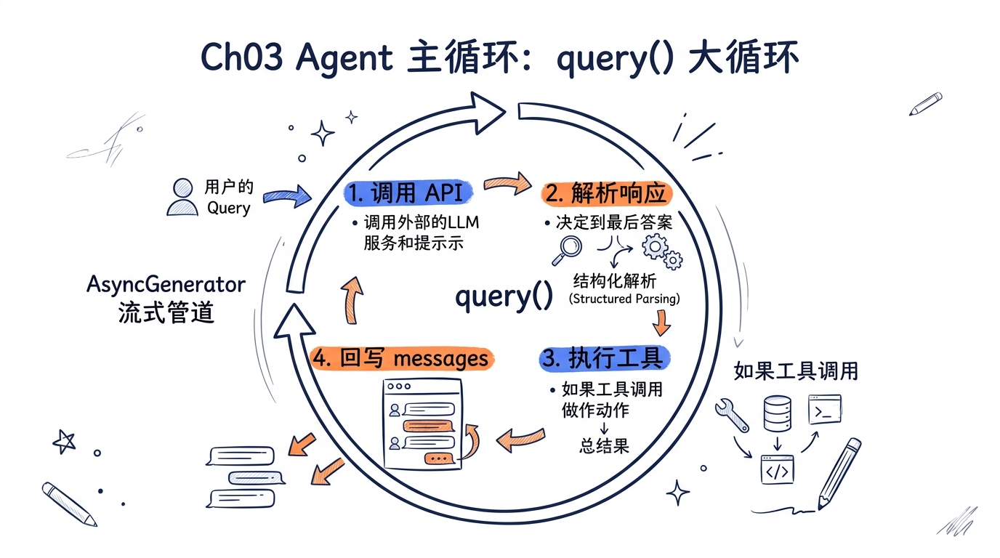
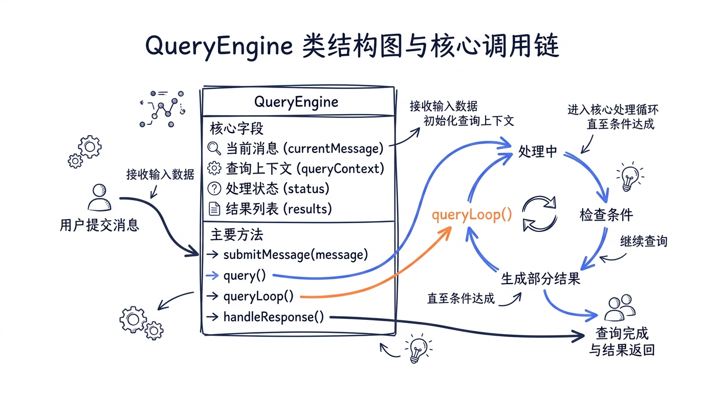
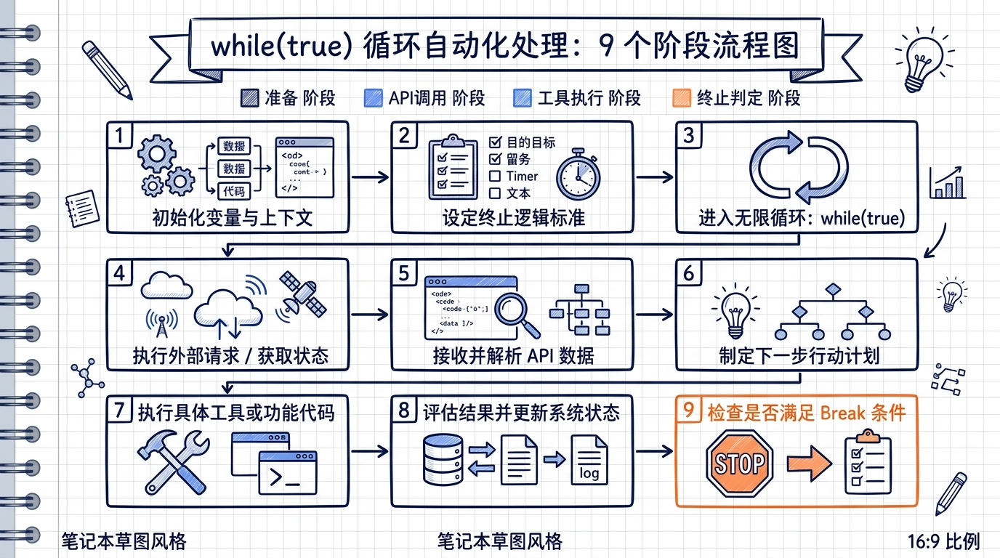
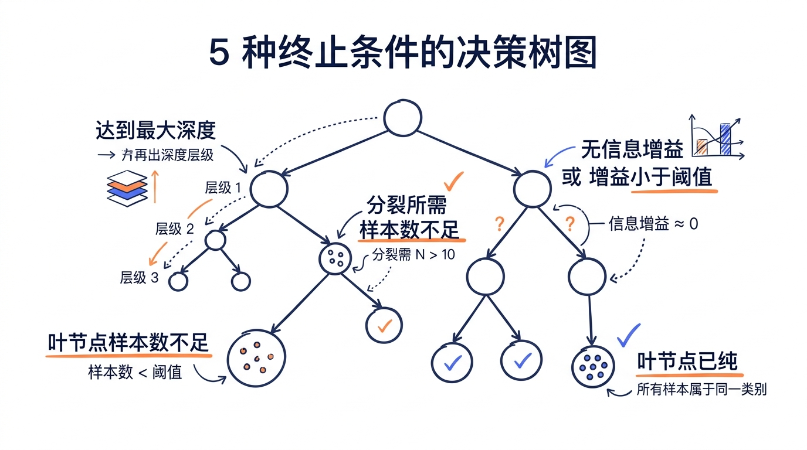

---
layout: default
title: "Ch03 Agent 主循环"
nav_order: 12
parent: "模块一：架构与启动"
---


# 第三章：Agent 主循环——query() 的 while(true)



> 如果你只能读懂 Claude Code 源码中的一个函数，那应该是 `queryLoop`。它是整个系统的心跳，是"聊天"和"Agent"之间真正的分界线。一个普通的聊天机器人只需要"请求-响应"；而一个 Agent 需要不断地思考、行动、观察、再思考——直到任务完成。这个"不断"，在代码里就是一个 `while(true)`。

---

## 学习目标

完成本章后，你将能够：

1. 理解 `QueryEngine` 类如何管理对话生命周期和状态
2. 掌握 `query()` → `queryLoop()` 的核心 while(true) 循环结构
3. 理解 AsyncGenerator 流式管道如何实现实时响应和内存效率
4. 掌握 `messages[]` 数组的增长、压缩和管理模型
5. 理解 API 调用封装中的重试策略、速率限制处理和流式响应解析
6. 列举并解释循环终止的 5 种情况
7. 理解错误恢复的三层机制：API 重试、Tool 错误处理、上下文溢出压缩
8. 评价流式架构在内存效率、实时反馈、可中断性方面的工程优势

---

## 3.1 QueryEngine：对话生命周期的管理者

在深入循环之前，我们先看一个更高层的抽象——`QueryEngine`。它是整个查询生命周期的"拥有者"，管理着对话状态、消息历史、权限追踪和使用量统计。



### 3.1.1 类的核心职责

```typescript
// src/QueryEngine.ts 第 184-207 行
export class QueryEngine {
  private config: QueryEngineConfig
  private mutableMessages: Message[]
  private abortController: AbortController
  private permissionDenials: SDKPermissionDenial[]
  private totalUsage: NonNullableUsage
  private hasHandledOrphanedPermission = false
  private readFileState: FileStateCache

  constructor(config: QueryEngineConfig) {
    this.config = config
    this.mutableMessages = config.initialMessages ?? []
    this.abortController = config.abortController ?? createAbortController()
    this.permissionDenials = []
    this.readFileState = config.readFileCache
    this.totalUsage = EMPTY_USAGE
  }
  // ...
}
```

注意这几个关键字段：

| 字段 | 作用 |
|------|------|
| `mutableMessages` | 对话历史的可变数组，随着每一轮交互不断增长 |
| `abortController` | 用户中断信号的传递通道 |
| `permissionDenials` | 权限拒绝的追踪，用于 SDK 报告 |
| `totalUsage` | 跨多轮的累计 token 使用量 |
| `readFileState` | 文件读取缓存，避免重复读取已知文件 |

`QueryEngine` 的设计遵循**一个引擎一个对话**的原则：

> One QueryEngine per conversation. Each submitMessage() call starts a new turn within the same conversation. State (messages, file cache, usage, etc.) persists across turns.

### 3.1.2 submitMessage：一轮对话的入口

`submitMessage()` 是一个 `AsyncGenerator`——这不是偶然的选择，而是整个流式架构的起点：

```typescript
// src/QueryEngine.ts 第 209-212 行
async *submitMessage(
  prompt: string | ContentBlockParam[],
  options?: { uuid?: string; isMeta?: boolean },
): AsyncGenerator<SDKMessage, void, unknown> {
```

这个方法负责：

1. **准备系统提示**：调用 `fetchSystemPromptParts()` 构建完整的 system prompt
2. **处理用户输入**：通过 `processUserInput()` 解析斜杠命令、附件等
3. **持久化消息**：将用户消息写入 transcript（在 API 响应之前！这样即使进程被杀死，消息也不会丢失）
4. **进入查询循环**：调用 `query()` 并逐个 yield 结果

其中最重要的一步是第 675 行开始的 `for await` 循环——它将 `query()` 产出的每一条消息分发到正确的处理路径：

```typescript
// src/QueryEngine.ts 第 675-686 行
for await (const message of query({
  messages,
  systemPrompt,
  userContext,
  systemContext,
  canUseTool: wrappedCanUseTool,
  toolUseContext: processUserInputContext,
  fallbackModel,
  querySource: 'sdk',
  maxTurns,
  taskBudget,
})) {
  // 根据 message.type 分发处理：
  // assistant → 记录 + yield 给 SDK 调用方
  // user      → 追加到历史（tool_result 消息）
  // system    → 处理压缩边界、API 错误重试等
  // ...
}
```

这里有一个精妙的设计：`QueryEngine` 对 `canUseTool` 做了包装，在每次权限判断时追踪拒绝记录——这让 SDK 调用方可以在最终 `result` 消息中看到哪些工具调用被拒绝了。

```typescript
// src/QueryEngine.ts 第 244-271 行
const wrappedCanUseTool: CanUseToolFn = async (
  tool, input, toolUseContext, assistantMessage, toolUseID, forceDecision,
) => {
  const result = await canUseTool(
    tool, input, toolUseContext, assistantMessage, toolUseID, forceDecision,
  )
  // Track denials for SDK reporting
  if (result.behavior !== 'allow') {
    this.permissionDenials.push({
      tool_name: sdkCompatToolName(tool.name),
      tool_use_id: toolUseID,
      tool_input: input,
    })
  }
  return result
}
```

---

## 3.2 query() 的核心结构：while(true) 循环

### 3.2.1 两层函数的设计

Claude Code 的主循环实际上由两个函数组成：外层 `query()` 和内层 `queryLoop()`。

```typescript
// src/query.ts 第 218-239 行
export async function* query(
  params: QueryParams,
): AsyncGenerator<
  | StreamEvent
  | RequestStartEvent
  | Message
  | TombstoneMessage
  | ToolUseSummaryMessage,
  Terminal
> {
  const consumedCommandUuids: string[] = []
  const terminal = yield* queryLoop(params, consumedCommandUuids)
  // 只在正常返回时执行，throw/abort 时跳过
  for (const uuid of consumedCommandUuids) {
    notifyCommandLifecycle(uuid, 'completed')
  }
  return terminal
}
```

为什么要分两层？外层 `query()` 负责**命令生命周期管理**——它追踪在循环期间消费的命令 UUID，并在正常结束时通知它们已完成。如果循环因错误抛出或用户中断而退出，这些通知不会发送——这是刻意的设计，让命令系统知道"这个命令的处理被中断了"。

`yield*` 语法至关重要：它将 `queryLoop()` 的所有产出直接转发给 `query()` 的调用方，同时保持双向通信通道——调用方对生成器调用 `.return()` 会穿透到内层，使两个生成器同时关闭。

### 3.2.2 State：跨迭代的可变状态

进入 `queryLoop()` 之前，我们先看它维护的状态结构——这是理解循环的关键：

```typescript
// src/query.ts 第 204-217 行
type State = {
  messages: Message[]               // 当前轮次的消息数组
  toolUseContext: ToolUseContext     // 工具执行上下文
  autoCompactTracking: AutoCompactTrackingState | undefined  // 自动压缩追踪
  maxOutputTokensRecoveryCount: number   // 输出 token 超限恢复计数
  hasAttemptedReactiveCompact: boolean   // 是否已尝试过反应式压缩
  maxOutputTokensOverride: number | undefined  // 输出 token 限制覆盖
  pendingToolUseSummary: Promise<ToolUseSummaryMessage | null> | undefined
  stopHookActive: boolean | undefined   // Stop Hook 是否激活
  turnCount: number                      // 当前轮次计数
  transition: Continue | undefined       // 上一次迭代为什么继续
}
```

`transition` 字段特别值得关注。它记录了"上一次迭代为什么选择 `continue` 而不是 `return`"，可能的值包括：

- `next_turn`：正常的下一轮工具调用
- `reactive_compact_retry`：反应式压缩后重试
- `max_output_tokens_recovery`：输出 token 超限后注入恢复消息
- `max_output_tokens_escalate`：从 8K 默认升级到 64K
- `collapse_drain_retry`：上下文折叠后重试
- `stop_hook_blocking`：Stop Hook 返回了阻止错误
- `token_budget_continuation`：token 预算允许继续

每次循环继续时，整个 `State` 被替换为一个新对象，而不是逐个字段赋值——这让"继续点"的意图一目了然，也让测试可以轻松断言"在什么条件下选择了什么路径"。

### 3.2.3 while(true) 的完整骨架

下面是去除细节后的循环骨架，每个阶段用注释标出：

```typescript
// src/query.ts 第 307-1728 行（骨架）
while (true) {
  // ===== 阶段 1：准备消息 =====
  let { toolUseContext } = state
  const { messages, turnCount, ... } = state

  yield { type: 'stream_request_start' }       // 通知 UI：新一轮请求开始

  // 消息预处理管线：
  let messagesForQuery = [...getMessagesAfterCompactBoundary(messages)]
  messagesForQuery = await applyToolResultBudget(messagesForQuery, ...)  // 工具结果裁剪
  messagesForQuery = snipCompactIfNeeded(messagesForQuery)               // 历史裁剪
  messagesForQuery = await microcompact(messagesForQuery, ...)           // 微压缩
  messagesForQuery = await contextCollapse.applyCollapsesIfNeeded(...)   // 上下文折叠
  const { compactionResult } = await autocompact(messagesForQuery, ...)  // 自动压缩

  // ===== 阶段 2：调用 API（流式） =====
  const assistantMessages: AssistantMessage[] = []
  const toolResults: (UserMessage | AttachmentMessage)[] = []
  const toolUseBlocks: ToolUseBlock[] = []
  let needsFollowUp = false

  for await (const message of deps.callModel({ messages, systemPrompt, tools, ... })) {
    yield message                    // 流式转发给 UI
    if (message.type === 'assistant') {
      assistantMessages.push(message)
      // 检测 tool_use 块
      if (hasToolUseBlocks(message)) {
        needsFollowUp = true
        // 流式工具执行：模型还在生成时就开始执行工具
        streamingToolExecutor.addTool(toolBlock, message)
      }
    }
  }

  // ===== 阶段 3：中断检查 =====
  if (toolUseContext.abortController.signal.aborted) {
    yield createUserInterruptionMessage({ toolUse: false })
    return { reason: 'aborted_streaming' }
  }

  // ===== 阶段 4：终止判定 =====
  if (!needsFollowUp) {
    // 没有工具调用 → 检查各种恢复/终止条件
    // ... prompt-too-long 恢复、max_output_tokens 恢复、stop hooks ...
    return { reason: 'completed' }
  }

  // ===== 阶段 5：执行工具 =====
  for await (const update of toolUpdates) {
    yield update.message
    toolResults.push(...)
  }

  // ===== 阶段 6：中断检查（工具执行后） =====
  if (toolUseContext.abortController.signal.aborted) {
    return { reason: 'aborted_tools' }
  }

  // ===== 阶段 7：附件注入 =====
  for await (const attachment of getAttachmentMessages(...)) {
    yield attachment
    toolResults.push(attachment)
  }

  // ===== 阶段 8：轮次限制检查 =====
  if (maxTurns && nextTurnCount > maxTurns) {
    return { reason: 'max_turns', turnCount: nextTurnCount }
  }

  // ===== 阶段 9：准备下一轮 =====
  state = {
    messages: [...messagesForQuery, ...assistantMessages, ...toolResults],
    toolUseContext: toolUseContextWithQueryTracking,
    turnCount: nextTurnCount,
    transition: { reason: 'next_turn' },
    // ...
  }
} // while (true)
```



让我们逐一深入每个阶段。

---

## 3.3 AsyncGenerator 流式管道

### 3.3.1 三层生成器架构

Claude Code 的流式管道由三层 `AsyncGenerator` 嵌套而成：

```
QueryEngine.submitMessage()     ← 最外层，面向 SDK/UI
  └─ query()                    ← 中间层，命令生命周期
      └─ queryLoop()            ← 核心循环
          ├─ deps.callModel()   ← API 流式响应
          ├─ runTools()         ← 工具执行结果
          └─ getAttachmentMessages()  ← 附件注入
```

每一层都是 `AsyncGenerator`，它们通过 `yield` 和 `yield*` 将数据向上传递，形成一条从 API 到 UI 的流式管道。

```typescript
// 三层之间的连接方式

// 层 1: QueryEngine.submitMessage() 消费 query() 的产出
for await (const message of query({ ... })) {
  switch (message.type) {
    case 'assistant': yield* normalizeMessage(message); break;
    case 'stream_event': if (includePartialMessages) yield ...; break;
    // ...
  }
}

// 层 2: query() 透传 queryLoop() 的所有产出
const terminal = yield* queryLoop(params, consumedCommandUuids)

// 层 3: queryLoop() 产出 API 流中的每条消息
for await (const message of deps.callModel({ ... })) {
  yield message  // 直接向上传递
}
```

### 3.3.2 yield 的类型系统

注意 `queryLoop()` 的返回类型签名：

```typescript
// src/query.ts 第 241-251 行
async function* queryLoop(
  params: QueryParams,
  consumedCommandUuids: string[],
): AsyncGenerator<
  | StreamEvent          // API 流事件（content_block_delta 等）
  | RequestStartEvent    // 每轮请求开始信号
  | Message              // 完整消息（assistant/user/system/attachment/progress）
  | TombstoneMessage     // 消息删除标记
  | ToolUseSummaryMessage,  // 工具使用摘要
  Terminal               // return 值：终止原因
> {
```

产出类型（yield 类型）是一个联合类型，包含了循环中所有可能向外传递的数据。返回类型 `Terminal` 是一个对象，描述了循环终止的原因。

这种设计让 TypeScript 编译器能够精确检查：生成器的消费方必须处理所有可能的产出类型，而 `return` 值也有明确的结构。

### 3.3.3 流式工具执行：StreamingToolExecutor

传统的 Agent 循环是串行的：等 API 完成 → 解析工具调用 → 执行工具 → 下一轮。Claude Code 引入了一个关键优化——**流式工具执行**：

```typescript
// src/query.ts 第 560-568 行
const useStreamingToolExecution = config.gates.streamingToolExecution
let streamingToolExecutor = useStreamingToolExecution
  ? new StreamingToolExecutor(
      toolUseContext.options.tools,
      canUseTool,
      toolUseContext,
    )
  : null
```

当 API 流中出现一个完整的 `tool_use` 块时，不等待 API 完成，立即开始执行：

```typescript
// src/query.ts 第 838-844 行（在 API 流式循环内部）
if (streamingToolExecutor && !toolUseContext.abortController.signal.aborted) {
  for (const toolBlock of msgToolUseBlocks) {
    streamingToolExecutor.addTool(toolBlock, message)
  }
}
```

同时，已完成的工具结果也在流式阶段就被收集：

```typescript
// src/query.ts 第 848-862 行
if (streamingToolExecutor && !toolUseContext.abortController.signal.aborted) {
  for (const result of streamingToolExecutor.getCompletedResults()) {
    if (result.message) {
      yield result.message
      toolResults.push(...)
    }
  }
}
```

这意味着：当 Claude 在说"让我先读取 A 文件，然后再看 B 文件"的时候，A 文件的读取可能已经完成了。这对用户体验的影响是巨大的——多工具调用的总延迟不再是各工具延迟之和，而接近最慢那个工具的延迟。

工具编排层（`toolOrchestration.ts`）还做了更细粒度的优化——将工具调用分为并发安全和非并发安全两组：

```typescript
// src/services/tools/toolOrchestration.ts 第 19-80 行（简化）
export async function* runTools(
  toolUseMessages: ToolUseBlock[],
  assistantMessages: AssistantMessage[],
  canUseTool: CanUseToolFn,
  toolUseContext: ToolUseContext,
): AsyncGenerator<MessageUpdate, void> {
  let currentContext = toolUseContext
  for (const { isConcurrencySafe, blocks } of partitionToolCalls(
    toolUseMessages, currentContext,
  )) {
    if (isConcurrencySafe) {
      // 读取类工具（Read、Grep 等）并发执行
      for await (const update of runToolsConcurrently(blocks, ...)) {
        yield { message: update.message, newContext: currentContext }
      }
    } else {
      // 写入类工具串行执行，保证顺序
      for await (const update of runToolsSerially(blocks, ...)) {
        yield { message: update.message, newContext: currentContext }
      }
    }
  }
}
```

---

## 3.4 消息累积模型：messages[] 的增长与管理

### 3.4.1 消息的增长

每一次循环迭代，`messages` 数组都在增长。在阶段 9（准备下一轮）中，新消息被追加：

```typescript
// src/query.ts 第 1715-1728 行
const next: State = {
  messages: [...messagesForQuery, ...assistantMessages, ...toolResults],
  toolUseContext: toolUseContextWithQueryTracking,
  turnCount: nextTurnCount,
  transition: { reason: 'next_turn' },
  // ...
}
state = next
```

一轮典型的交互会增加：
- 1 条 `AssistantMessage`（模型的响应，包含 thinking + text + tool_use 块）
- N 条 `UserMessage`（每个 tool_use 对应一个 tool_result）
- M 条 `AttachmentMessage`（文件变更通知、记忆注入等）

在一个复杂任务中（比如"重构这个模块"），模型可能调用 20+ 次工具，每次读取或写入文件都会产生消息。经过 10 轮迭代后，消息数组可能包含 200+ 条消息，总 token 数轻松突破 100K。

### 3.4.2 上下文压缩管线

这就是为什么循环的阶段 1 有一条复杂的压缩管线。它由五个步骤组成，按顺序执行：

```
原始消息
  │
  ├── 1. getMessagesAfterCompactBoundary()  ← 跳过已压缩的历史
  │
  ├── 2. applyToolResultBudget()             ← 大工具结果裁剪
  │
  ├── 3. snipCompactIfNeeded()               ← 历史修剪
  │
  ├── 4. microcompactMessages()              ← 微压缩（移除冗余的工具结果）
  │
  ├── 5. contextCollapse.applyCollapsesIfNeeded()  ← 上下文折叠
  │
  └── 6. autoCompactIfNeeded()               ← 全量压缩（超过阈值时触发）
```

**全量自动压缩**是最重要的一环。它有一个 token 阈值，当消息总量接近模型上下文窗口时触发：

```typescript
// src/services/compact/autoCompact.ts 第 72-76 行
export function getAutoCompactThreshold(model: string): number {
  const effectiveContextWindow = getEffectiveContextWindowSize(model)
  const autocompactThreshold =
    effectiveContextWindow - AUTOCOMPACT_BUFFER_TOKENS  // 13,000 token 缓冲
  return autocompactThreshold
}
```

压缩成功后，整个消息历史被替换为一条压缩摘要 + 被保留的尾部消息：

```typescript
// src/query.ts 第 528-535 行
if (compactionResult) {
  const postCompactMessages = buildPostCompactMessages(compactionResult)
  for (const message of postCompactMessages) {
    yield message  // 通知 UI 发生了压缩
  }
  messagesForQuery = postCompactMessages
}
```

### 3.4.3 压缩的连续失败保护

自动压缩不一定总能成功——比如压缩 API 自身可能失败，或者压缩后仍然超过阈值。Claude Code 对此有一个断路器（circuit breaker）：

```typescript
// src/services/compact/autoCompact.ts 第 67-70 行
// Stop trying autocompact after this many consecutive failures.
// BQ 2026-03-10: 1,279 sessions had 50+ consecutive failures (up to 3,272)
// in a single session, wasting ~250K API calls/day globally.
const MAX_CONSECUTIVE_AUTOCOMPACT_FAILURES = 3
```

三次连续失败后停止重试——这不是凭感觉定的，注释引用了真实的线上数据：曾有 1,279 个会话遭遇 50 次以上的连续失败，全球每天浪费了 25 万次 API 调用。

---

## 3.5 API 调用封装

### 3.5.1 依赖注入：QueryDeps

循环不直接调用 API，而是通过依赖注入：

```typescript
// src/query/deps.ts 第 21-40 行
export type QueryDeps = {
  callModel: typeof queryModelWithStreaming   // API 调用
  microcompact: typeof microcompactMessages  // 微压缩
  autocompact: typeof autoCompactIfNeeded    // 自动压缩
  uuid: () => string                         // UUID 生成
}

export function productionDeps(): QueryDeps {
  return {
    callModel: queryModelWithStreaming,
    microcompact: microcompactMessages,
    autocompact: autoCompactIfNeeded,
    uuid: randomUUID,
  }
}
```

这个设计让测试可以替换任何依赖——注入一个假的 `callModel` 就能测试循环逻辑而不需要真正调用 API。注释说得很直白：

> Passing a `deps` override into QueryParams lets tests inject fakes directly instead of spyOn-per-module — the most common mocks (callModel, autocompact) are each spied in 6-8 test files today with module-import-and-spy boilerplate.

### 3.5.2 queryModelWithStreaming：流式 API 调用

`deps.callModel` 在生产环境中指向 `queryModelWithStreaming`：

```typescript
// src/services/api/claude.ts 第 752-780 行
export async function* queryModelWithStreaming({
  messages, systemPrompt, thinkingConfig, tools, signal, options,
}: { ... }): AsyncGenerator<
  StreamEvent | AssistantMessage | SystemAPIErrorMessage,
  void
> {
  return yield* withStreamingVCR(messages, async function* () {
    yield* queryModel(
      messages, systemPrompt, thinkingConfig, tools, signal, options,
    )
  })
}
```

这里有一层 VCR（录像/回放）包装，用于测试时录制和回放 API 交互——但核心逻辑在 `queryModel()` 中。

`queryModel()` 内部做了大量的工作：

1. **构建工具 Schema**：将内部 Tool 定义转换为 API 格式
2. **消息归一化**：`normalizeMessagesForAPI()` 将内部 Message 类型转为 API 格式
3. **Prompt 缓存**：在关键位置添加 `cache_control` 标记
4. **流式解析**：将 API 的 SSE 流解析为结构化消息
5. **模型回退**：streaming 失败时回退到非流式请求

### 3.5.3 重试策略：withRetry

API 调用的重试逻辑在 `withRetry` 中，它本身也是一个 `AsyncGenerator`——这让它可以在等待重试时向上通知 UI：

```typescript
// src/services/api/withRetry.ts 第 170-178 行
export async function* withRetry<T>(
  getClient: () => Promise<Anthropic>,
  operation: (client: Anthropic, attempt: number, context: RetryContext) => Promise<T>,
  options: RetryOptions,
): AsyncGenerator<SystemAPIErrorMessage, T> {
```

返回类型 `AsyncGenerator<SystemAPIErrorMessage, T>` 含义是：yield 出重试状态消息（显示给用户），最终 return API 响应。

重试策略包含多个层次：

**指数退避 + 抖动**：

```typescript
// src/services/api/withRetry.ts 第 530-548 行
export function getRetryDelay(
  attempt: number,
  retryAfterHeader?: string | null,
  maxDelayMs = 32000,
): number {
  if (retryAfterHeader) {
    const seconds = parseInt(retryAfterHeader, 10)
    if (!isNaN(seconds)) return seconds * 1000
  }
  const baseDelay = Math.min(
    BASE_DELAY_MS * Math.pow(2, attempt - 1),  // 500ms, 1s, 2s, 4s, 8s, 16s, 32s
    maxDelayMs,
  )
  const jitter = Math.random() * 0.25 * baseDelay  // 25% 随机抖动
  return baseDelay + jitter
}
```

**529 过载保护**：连续 3 次 529 错误后触发模型回退：

```typescript
// src/services/api/withRetry.ts 第 327-364 行
if (is529Error(error)) {
  consecutive529Errors++
  if (consecutive529Errors >= MAX_529_RETRIES) {
    if (options.fallbackModel) {
      throw new FallbackTriggeredError(options.model, options.fallbackModel)
    }
  }
}
```

**持久重试模式**（无人值守会话）：当环境变量 `CLAUDE_CODE_UNATTENDED_RETRY` 开启时，429/529 会无限重试，同时发送心跳保持会话活跃：

```typescript
// src/services/api/withRetry.ts 第 486-512 行
if (persistent) {
  let remaining = delayMs
  while (remaining > 0) {
    if (options.signal?.aborted) throw new APIUserAbortError()
    yield createSystemAPIErrorMessage(error, remaining, reportedAttempt, maxRetries)
    const chunk = Math.min(remaining, HEARTBEAT_INTERVAL_MS)  // 30 秒心跳
    await sleep(chunk, options.signal, { abortError })
    remaining -= chunk
  }
  if (attempt >= maxRetries) attempt = maxRetries  // 永不终止
}
```

**上下文溢出自动调整**：当 API 返回 `input_tokens + max_tokens > context_limit` 错误时，自动减小 `max_tokens`：

```typescript
// src/services/api/withRetry.ts 第 389-427 行
const overflowData = parseMaxTokensContextOverflowError(error)
if (overflowData) {
  const { inputTokens, contextLimit } = overflowData
  const safetyBuffer = 1000
  const availableContext = Math.max(0, contextLimit - inputTokens - safetyBuffer)
  retryContext.maxTokensOverride = Math.max(FLOOR_OUTPUT_TOKENS, availableContext)
  continue  // 用新的 max_tokens 重试
}
```

**非前台请求不重试 529**：背景任务（摘要、分类器等）遇到 529 直接失败，避免在服务过载时雪上加霜：

```typescript
// src/services/api/withRetry.ts 第 62-89 行
const FOREGROUND_529_RETRY_SOURCES = new Set<QuerySource>([
  'repl_main_thread', 'sdk', 'agent:custom', 'compact', ...
])

function shouldRetry529(querySource: QuerySource | undefined): boolean {
  return querySource === undefined || FOREGROUND_529_RETRY_SOURCES.has(querySource)
}
```

### 3.5.4 模型回退：FallbackTriggeredError

当 `withRetry` 抛出 `FallbackTriggeredError` 时，`queryLoop` 中的内层 `while(attemptWithFallback)` 循环会捕获它：

```typescript
// src/query.ts 第 893-950 行
} catch (innerError) {
  if (innerError instanceof FallbackTriggeredError && fallbackModel) {
    currentModel = fallbackModel
    attemptWithFallback = true

    // 清理旧的未完成消息
    yield* yieldMissingToolResultBlocks(assistantMessages, 'Model fallback triggered')
    assistantMessages.length = 0
    toolResults.length = 0

    // 丢弃流式工具执行器的待处理结果
    if (streamingToolExecutor) {
      streamingToolExecutor.discard()
      streamingToolExecutor = new StreamingToolExecutor(...)
    }

    // 通知用户
    yield createSystemMessage(
      `Switched to ${renderModelName(innerError.fallbackModel)} due to high demand`,
      'warning',
    )
    continue  // 用新模型重试
  }
  throw innerError
}
```

这个回退是**透明的**——用户只会看到一条切换通知，循环继续正常运行。

---

## 3.6 终止条件的 5 种情况

循环的 `return` 语句散布在代码各处。整理后，有 5 大类终止原因：

> **教学口径说明**：本章把终止条件归纳为 **5 种**（正常完成 / 用户中断 / 最大轮次 / 致命错误 / Hook 阻止），是为了便于初学者建立心智模型。**源码内部的 `reason` 字段实际上有 7+ 种取值**（completed / aborted_streaming / aborted_tools / max_turns / model_error / image_error / prompt_too_long / blocking_limit / stop_hook_prevented / hook_stopped 等），细分原因详见 3.6.6 节的"终止原因一览"。`SessionEnd` Hook 还有独立的 `EXIT_REASONS = 5`（clear / resume / logout / prompt_input_exit / other），属于会话级别终止，与单轮 query 的终止 reason 不同。完整数字口径详见 `docs/canonical-numbers.md`。



### 3.6.1 正常完成（end_turn）

这是最常见的终止：模型没有返回 `tool_use` 块，说明它认为任务已完成。

```typescript
// src/query.ts 第 1062 行附近
if (!needsFollowUp) {
  // ... 各种恢复检查 ...
  // 如果没有需要恢复的情况：
  return { reason: 'completed' }
}
```

在返回之前，还会经过 Stop Hook 检查——Hook 可以阻止终止，强制循环继续（比如验证 hook 发现了遗留问题）：

```typescript
// src/query.ts 第 1267-1306 行
const stopHookResult = yield* handleStopHooks(
  messagesForQuery, assistantMessages,
  systemPrompt, userContext, systemContext,
  toolUseContext, querySource, stopHookActive,
)

if (stopHookResult.preventContinuation) {
  return { reason: 'stop_hook_prevented' }
}

if (stopHookResult.blockingErrors.length > 0) {
  // 注入阻止消息，继续循环
  state = {
    messages: [...messagesForQuery, ...assistantMessages, ...stopHookResult.blockingErrors],
    stopHookActive: true,
    transition: { reason: 'stop_hook_blocking' },
    // ...
  }
  continue
}
```

### 3.6.2 用户中断（abort）

用户按 Ctrl+C 或通过 SDK 调用 `interrupt()` 时触发。循环在两个检查点检测中断：

**API 流式阶段中断**：

```typescript
// src/query.ts 第 1015-1052 行
if (toolUseContext.abortController.signal.aborted) {
  if (streamingToolExecutor) {
    // 消费剩余结果，生成合成的 tool_result
    for await (const update of streamingToolExecutor.getRemainingResults()) {
      if (update.message) yield update.message
    }
  } else {
    yield* yieldMissingToolResultBlocks(assistantMessages, 'Interrupted by user')
  }
  yield createUserInterruptionMessage({ toolUse: false })
  return { reason: 'aborted_streaming' }
}
```

**工具执行阶段中断**：

```typescript
// src/query.ts 第 1484-1515 行
if (toolUseContext.abortController.signal.aborted) {
  if (toolUseContext.abortController.signal.reason !== 'interrupt') {
    yield createUserInterruptionMessage({ toolUse: true })
  }
  return { reason: 'aborted_tools' }
}
```

注意一个细节：如果中断原因是 `'interrupt'`（提交新消息中断），则不发送 `[Request interrupted by user]` 消息——因为紧接着就会有新的用户消息作为上下文。

还有一个关键设计：中断时必须为所有未完成的 `tool_use` 块补充 `tool_result`。API 要求每个 `tool_use` 都有对应的 `tool_result`，否则下一轮请求会失败。`yieldMissingToolResultBlocks` 负责这件事：

```typescript
// src/query.ts 第 123-149 行
function* yieldMissingToolResultBlocks(
  assistantMessages: AssistantMessage[],
  errorMessage: string,
) {
  for (const assistantMessage of assistantMessages) {
    const toolUseBlocks = assistantMessage.message.content.filter(
      content => content.type === 'tool_use',
    ) as ToolUseBlock[]
    for (const toolUse of toolUseBlocks) {
      yield createUserMessage({
        content: [{
          type: 'tool_result',
          content: errorMessage,
          is_error: true,
          tool_use_id: toolUse.id,
        }],
      })
    }
  }
}
```

### 3.6.3 最大轮次限制

SDK 调用方可以设置 `maxTurns` 限制 Agent 的自主运行轮次：

```typescript
// src/query.ts 第 1705-1712 行
if (maxTurns && nextTurnCount > maxTurns) {
  yield createAttachmentMessage({
    type: 'max_turns_reached',
    maxTurns,
    turnCount: nextTurnCount,
  })
  return { reason: 'max_turns', turnCount: nextTurnCount }
}
```

`QueryEngine` 捕获这个附件消息后会生成一个 `error_max_turns` 结果：

```typescript
// src/QueryEngine.ts 第 851-873 行
if (message.attachment.type === 'max_turns_reached') {
  yield {
    type: 'result',
    subtype: 'error_max_turns',
    is_error: true,
    num_turns: message.attachment.turnCount,
    errors: [`Reached maximum number of turns (${message.attachment.maxTurns})`],
    // ...
  }
  return
}
```

### 3.6.4 致命错误

当 API 调用抛出不可重试的错误时（已用完所有重试次数，或者是不可恢复的错误类型）：

```typescript
// src/query.ts 第 955-997 行
} catch (error) {
  logError(error)

  // 图片相关错误：直接终止
  if (error instanceof ImageSizeError || error instanceof ImageResizeError) {
    yield createAssistantAPIErrorMessage({ content: error.message })
    return { reason: 'image_error' }
  }

  // 其他错误：补充缺失的 tool_result，上报错误
  yield* yieldMissingToolResultBlocks(assistantMessages, errorMessage)
  yield createAssistantAPIErrorMessage({ content: errorMessage })
  return { reason: 'model_error', error }
}
```

### 3.6.5 权限拒绝与 Hook 阻止

当 Stop Hook 明确表示"不允许继续"时：

```typescript
// src/query.ts 第 1278-1280 行
if (stopHookResult.preventContinuation) {
  return { reason: 'stop_hook_prevented' }
}
```

另外，工具执行中如果 hook 返回了 `hook_stopped_continuation` 附件：

```typescript
// src/query.ts 第 1519-1521 行
if (shouldPreventContinuation) {
  return { reason: 'hook_stopped' }
}
```

### 3.6.6 终止原因一览

| 终止原因 | 触发条件 | 对用户的含义 |
|----------|----------|------------|
| `completed` | 模型返回纯文本，无 tool_use | 任务正常完成 |
| `aborted_streaming` | 流式阶段用户 Ctrl+C | 用户主动中断 |
| `aborted_tools` | 工具执行阶段用户 Ctrl+C | 用户主动中断 |
| `max_turns` | 超过 maxTurns 限制 | 安全阀，防止无限运行 |
| `model_error` | API 不可恢复的错误 | 需要检查 API 状态 |
| `image_error` | 图片太大或不支持 | 需要调整图片 |
| `prompt_too_long` | 上下文超限且压缩失败 | 需要手动压缩 |
| `blocking_limit` | 手动压缩模式下 token 超限 | 需要运行 /compact |
| `stop_hook_prevented` | Stop Hook 阻止继续 | Hook 逻辑决定终止 |
| `hook_stopped` | 工具 hook 阻止继续 | Hook 逻辑决定终止 |

---

## 3.7 错误恢复机制

Claude Code 的错误恢复不是简单的"重试"，而是一个分层的、有状态的恢复系统。

### 3.7.1 API 错误重试（withRetry 层）

这在 3.5.3 节已详细讨论。核心策略：
- 指数退避 + 25% 抖动
- 429/529 有专门的处理路径
- 持久模式下无限重试（带心跳）
- 上下文溢出自动调整 max_tokens

### 3.7.2 prompt-too-long 的多级恢复

当 API 返回"prompt too long"错误时，恢复是分阶段的。错误在流式循环中被暂时**扣留**（withheld），不立即向上传递——给恢复逻辑一个尝试修复的机会：

```typescript
// src/query.ts 第 799-825 行（流式循环内）
let withheld = false
if (feature('CONTEXT_COLLAPSE')) {
  if (contextCollapse?.isWithheldPromptTooLong(message, ...)) {
    withheld = true
  }
}
if (reactiveCompact?.isWithheldPromptTooLong(message)) {
  withheld = true
}
if (!withheld) {
  yield yieldMessage  // 只有不被扣留的消息才 yield
}
```

恢复的优先级：

**第一级：上下文折叠排空**

```typescript
// src/query.ts 第 1086-1117 行
if (feature('CONTEXT_COLLAPSE') && contextCollapse
    && state.transition?.reason !== 'collapse_drain_retry') {
  const drained = contextCollapse.recoverFromOverflow(messagesForQuery, querySource)
  if (drained.committed > 0) {
    state = { ...state, messages: drained.messages,
      transition: { reason: 'collapse_drain_retry', committed: drained.committed } }
    continue  // 排空折叠后重试
  }
}
```

**第二级：反应式压缩**

```typescript
// src/query.ts 第 1119-1166 行
if ((isWithheld413 || isWithheldMedia) && reactiveCompact) {
  const compacted = await reactiveCompact.tryReactiveCompact({
    hasAttempted: hasAttemptedReactiveCompact,
    querySource,
    messages: messagesForQuery,
    // ...
  })
  if (compacted) {
    const postCompactMessages = buildPostCompactMessages(compacted)
    for (const msg of postCompactMessages) yield msg
    state = { ...state, messages: postCompactMessages,
      hasAttemptedReactiveCompact: true,
      transition: { reason: 'reactive_compact_retry' } }
    continue  // 压缩后重试
  }
  // 压缩也失败了：释放扣留的错误消息
  yield lastMessage
  return { reason: 'prompt_too_long' }
}
```

注意 `hasAttemptedReactiveCompact` 标志——它防止无限压缩循环。如果压缩后仍然超限，直接报错。

### 3.7.3 max_output_tokens 恢复

当模型输出被截断（达到 `max_output_tokens` 限制）时，恢复分两步：

**第一步：升级 token 限制**

```typescript
// src/query.ts 第 1195-1221 行
if (maxOutputTokensOverride === undefined
    && !process.env.CLAUDE_CODE_MAX_OUTPUT_TOKENS) {
  // 从默认 8K 升级到 64K
  state = { ...state,
    maxOutputTokensOverride: ESCALATED_MAX_TOKENS,
    transition: { reason: 'max_output_tokens_escalate' } }
  continue
}
```

**第二步：注入恢复消息**

如果升级后仍然截断，注入一条用户消息让模型继续——最多 3 次：

```typescript
// src/query.ts 第 1223-1252 行
if (maxOutputTokensRecoveryCount < MAX_OUTPUT_TOKENS_RECOVERY_LIMIT) {
  const recoveryMessage = createUserMessage({
    content:
      `Output token limit hit. Resume directly — no apology, no recap of what you were doing. ` +
      `Pick up mid-thought if that is where the cut happened. ` +
      `Break remaining work into smaller pieces.`,
    isMeta: true,
  })
  state = { ...state,
    messages: [...messagesForQuery, ...assistantMessages, recoveryMessage],
    maxOutputTokensRecoveryCount: maxOutputTokensRecoveryCount + 1,
    transition: { reason: 'max_output_tokens_recovery',
      attempt: maxOutputTokensRecoveryCount + 1 } }
  continue
}
// 3 次恢复都用完了：释放扣留的错误消息
yield lastMessage
```

`MAX_OUTPUT_TOKENS_RECOVERY_LIMIT = 3` 和提示文本本身都经过精心设计。提示要求模型"不要道歉、不要复述、直接继续"——因为每一轮恢复都消耗宝贵的上下文空间。

### 3.7.4 工具执行失败处理

工具执行失败不会终止循环——错误信息作为 `is_error: true` 的 `tool_result` 返回给模型，让模型自己决定如何处理：

```typescript
// 工具执行层（toolExecution.ts 中）将错误转为 tool_result
{
  type: 'tool_result',
  content: 'Error: file not found: /foo/bar.ts',
  is_error: true,
  tool_use_id: toolUse.id,
}
```

这是 Agent 模式的核心设计理念之一：**错误不是异常，而是信息**。模型看到文件找不到，可能会搜索正确的路径；看到权限拒绝，可能会选择另一种方法。循环不关心工具成功还是失败——它只关心模型是否返回了新的 `tool_use` 块。

### 3.7.5 错误恢复决策图

```
API 错误
├── 可重试？（withRetry 判断）
│   ├── 是 → 指数退避 → 重试
│   └── 否 → CannotRetryError → return { reason: 'model_error' }
│
├── 529 过载？
│   ├── 非前台请求 → 立即失败
│   ├── 连续 3 次 → 有 fallback 模型？
│   │   ├── 是 → FallbackTriggeredError → 切换模型重试
│   │   └── 否 → 报错
│   └── 未满 3 次 → 正常重试
│
├── prompt-too-long？
│   ├── 上下文折叠可排空 → 排空后 continue
│   ├── 反应式压缩未尝试 → 压缩后 continue
│   └── 都试过了 → return { reason: 'prompt_too_long' }
│
└── max_output_tokens？
    ├── 未升级过 → 升级到 64K → continue
    ├── 恢复次数 < 3 → 注入恢复消息 → continue
    └── 恢复次数 >= 3 → yield 错误 → return
```

---

## 3.8 流式架构的工程优势

### 3.8.1 内存效率

传统的"收集全部结果再返回"模式需要在内存中保存整个响应。流式架构通过 AsyncGenerator，每条消息产出后就可以被消费方处理并释放引用：

```typescript
// QueryEngine.submitMessage() 中的消费模式
for await (const message of query({ ... })) {
  // message 被处理后，上一次迭代的 message 可以被 GC
  switch (message.type) {
    case 'assistant': yield* normalizeMessage(message); break;
    // ...
  }
}
```

同样，API 流的消费也是逐块的——一条 10000 token 的响应不需要等全部接收完毕再处理，而是每个 content block 完成时就立即处理。

压缩后的内存释放也值得关注。`QueryEngine` 在收到 compact_boundary 消息后，会截断 `mutableMessages`：

```typescript
// src/QueryEngine.ts 第 926-933 行
if (message.subtype === 'compact_boundary' && message.compactMetadata) {
  const mutableBoundaryIdx = this.mutableMessages.length - 1
  if (mutableBoundaryIdx > 0) {
    this.mutableMessages.splice(0, mutableBoundaryIdx)  // 释放旧消息
  }
}
```

### 3.8.2 实时反馈

流式架构让 UI 可以在模型思考的同时展示进度。循环中有多个 yield 点：

```
yield { type: 'stream_request_start' }     // "正在发送请求"
yield message (type: 'stream_event')       // 打字机效果的文字流
yield message (type: 'assistant')          // 完整的助手消息块
yield update.message (type: 'progress')    // 工具执行进度
yield attachment                           // 文件变更通知
```

特别是 `stream_request_start` 事件——它在 API 调用之前就被发送，让 UI 可以立即显示"正在思考"的状态，而不需要等待网络往返。

### 3.8.3 可中断性

`AbortController` 贯穿了整个调用链：

```
QueryEngine.interrupt()
  → this.abortController.abort()
    → signal 传递到 API 调用 → fetch abort → 流停止
    → signal 传递到工具执行 → 子进程终止
    → signal 传递到 withRetry → sleep 中断
```

循环在关键节点检查 `signal.aborted`——API 流结束后、工具执行结束后——确保用户中断可以在合理的时间内被响应。

### 3.8.4 背压（Backpressure）控制

AsyncGenerator 的一个隐含优势是**自然的背压**：如果消费方没有调用 `next()`，生产方就不会继续执行。这意味着如果 UI 渲染速度跟不上数据产生速度，循环会自动放慢——不需要额外的缓冲区管理。

```typescript
// 消费方的 for-await-of 自动实现背压
for await (const message of query({ ... })) {
  // 如果这行代码处理很慢，query() 内部的 yield 会阻塞
  // → API 流的消费也会阻塞
  // → 没有无限制的内存增长
  await heavyProcessing(message)
}
```

---

## 3.9 一次完整交互的时序分析

让我们用一个具体例子——用户输入"修改 config.ts 中的端口号为 8080"——来追踪一次完整的循环：

```
时间轴 →

T0  用户输入 "修改 config.ts 中的端口号为 8080"
T1  QueryEngine.submitMessage() 开始
T2    processUserInput() 处理输入
T3    recordTranscript() 持久化用户消息
T4    query() → queryLoop() 开始

=== 第 1 轮迭代 ===
T5    yield { type: 'stream_request_start' }
T6    消息预处理（微压缩、自动压缩检查 → 不需要）
T7    deps.callModel() 开始流式调用 API
T8      Claude 思考："我需要先读取 config.ts..."
T9      yield stream_event (thinking 块)
T10     yield assistant message: "我来看一下 config.ts 的内容"
T11     yield assistant message: tool_use { name: 'Read', path: 'config.ts' }
T11.5   StreamingToolExecutor.addTool() → 立即开始读取文件！
T12   API 流结束
T13   收集 streamingToolExecutor 结果
T14     yield user message: tool_result { content: "文件内容..." }
T15   needsFollowUp = true → continue

=== 第 2 轮迭代 ===
T16   yield { type: 'stream_request_start' }
T17   消息预处理（消息数组已包含第 1 轮的所有消息）
T18   deps.callModel() 流式调用
T19     Claude 分析文件，决定修改
T20     yield assistant message: "我看到端口定义在第 42 行..."
T21     yield assistant message: tool_use { name: 'Edit', path: 'config.ts', ... }
T22   API 流结束
T23   工具执行：Edit 工具修改文件
T24     yield user message: tool_result { content: "文件已修改" }
T25     yield attachment: { type: 'edited_text_file', ... }  // 文件变更通知
T26   needsFollowUp = true → continue

=== 第 3 轮迭代 ===
T27   yield { type: 'stream_request_start' }
T28   deps.callModel() 流式调用
T29     Claude: "已将端口号修改为 8080，修改了 config.ts 的第 42 行。"
T30     yield assistant message: 纯文本（无 tool_use）
T31   API 流结束
T32   needsFollowUp = false
T33   handleStopHooks() → 无阻止
T34   return { reason: 'completed' }

T35 QueryEngine 收到 return，yield result 消息
T36 完成
```

整个过程 3 轮迭代，用户从 T9 开始就能看到 Claude 的思考过程——这是流式架构带来的体验优势。

---

## 3.10 动手实践

### 实践 1：构建最小 Agent 循环

用 TypeScript 实现一个简化版的 Agent 循环，包含核心的 while(true) 结构：

```typescript
// mini-agent-loop.ts
import Anthropic from '@anthropic-ai/sdk';

const client = new Anthropic();

// 定义工具
const tools: Anthropic.Tool[] = [
  {
    name: 'read_file',
    description: 'Read a file from disk',
    input_schema: {
      type: 'object' as const,
      properties: { path: { type: 'string', description: 'File path' } },
      required: ['path'],
    },
  },
  {
    name: 'write_file',
    description: 'Write content to a file',
    input_schema: {
      type: 'object' as const,
      properties: {
        path: { type: 'string', description: 'File path' },
        content: { type: 'string', description: 'Content to write' },
      },
      required: ['path', 'content'],
    },
  },
];

// 工具执行
async function executeTool(
  name: string,
  input: Record<string, string>
): Promise<string> {
  const fs = await import('fs/promises');
  switch (name) {
    case 'read_file':
      return await fs.readFile(input.path, 'utf-8');
    case 'write_file':
      await fs.writeFile(input.path, input.content);
      return 'File written successfully';
    default:
      return `Unknown tool: ${name}`;
  }
}

// 核心循环——模仿 Claude Code 的 queryLoop()
async function* agentLoop(
  userMessage: string
): AsyncGenerator<string, { reason: string }> {
  const messages: Anthropic.MessageParam[] = [
    { role: 'user', content: userMessage },
  ];
  const MAX_TURNS = 10;
  let turnCount = 0;

  while (true) {
    turnCount++;
    yield `\n--- 第 ${turnCount} 轮 ---\n`;

    // 阶段 1: 调用 API
    const response = await client.messages.create({
      model: 'claude-sonnet-4-20250514',
      max_tokens: 4096,
      tools,
      messages,
    });

    // 阶段 2: 处理响应
    let hasToolUse = false;
    const toolResults: Anthropic.ToolResultBlockParam[] = [];

    for (const block of response.content) {
      if (block.type === 'text') {
        yield `Claude: ${block.text}\n`;
      }
      if (block.type === 'tool_use') {
        hasToolUse = true;
        yield `[调用工具] ${block.name}(${JSON.stringify(block.input)})\n`;
        try {
          const result = await executeTool(
            block.name,
            block.input as Record<string, string>
          );
          yield `[工具结果] ${result.substring(0, 200)}...\n`;
          toolResults.push({
            type: 'tool_result',
            tool_use_id: block.id,
            content: result,
          });
        } catch (error) {
          const errMsg = error instanceof Error ? error.message : String(error);
          yield `[工具错误] ${errMsg}\n`;
          toolResults.push({
            type: 'tool_result',
            tool_use_id: block.id,
            content: errMsg,
            is_error: true,
          });
        }
      }
    }

    // 阶段 3: 终止判定
    if (!hasToolUse) {
      return { reason: 'completed' };
    }

    if (turnCount >= MAX_TURNS) {
      return { reason: 'max_turns' };
    }

    // 阶段 4: 累积消息，继续循环
    messages.push({ role: 'assistant', content: response.content });
    messages.push({ role: 'user', content: toolResults });
  }
}

// 使用
async function main() {
  const generator = agentLoop('读取 package.json 文件，告诉我项目名称和版本号');
  for await (const output of generator) {
    process.stdout.write(output);
  }
}

main().catch(console.error);
```

### 实践 2：添加中断支持

扩展上面的循环，添加 AbortController 支持：

```typescript
async function* agentLoopWithAbort(
  userMessage: string,
  signal: AbortSignal
): AsyncGenerator<string, { reason: string }> {
  // ... 同上 ...
  while (true) {
    // 检查点 1：循环开始时
    if (signal.aborted) {
      return { reason: 'aborted' };
    }

    const response = await client.messages.create({
      model: 'claude-sonnet-4-20250514',
      max_tokens: 4096,
      tools,
      messages,
    });  // 注意：实际应把 signal 传给 fetch

    // 检查点 2：API 响应后
    if (signal.aborted) {
      return { reason: 'aborted_after_api' };
    }

    // ... 处理响应 ...

    // 检查点 3：工具执行后
    if (signal.aborted) {
      return { reason: 'aborted_after_tools' };
    }
  }
}

// 使用：5 秒后自动中断
const controller = new AbortController();
setTimeout(() => controller.abort(), 5000);

const gen = agentLoopWithAbort('分析所有 TypeScript 文件', controller.signal);
for await (const output of gen) {
  process.stdout.write(output);
}
```

### 实践 3：添加简单的上下文管理

当消息过长时进行简单的截断：

```typescript
function trimMessages(
  messages: Anthropic.MessageParam[],
  maxTokenEstimate: number = 100000
): Anthropic.MessageParam[] {
  // 粗略估算：1 token ≈ 4 字符
  const estimateTokens = (msgs: Anthropic.MessageParam[]) =>
    JSON.stringify(msgs).length / 4;

  if (estimateTokens(messages) < maxTokenEstimate) {
    return messages;
  }

  // 保留第一条（用户原始请求）和最后 N 条消息
  const first = messages[0];
  const keepLast = 10;
  const tail = messages.slice(-keepLast);

  // 注入压缩标记
  return [
    first,
    {
      role: 'user' as const,
      content: '[Earlier conversation history was summarized to save context space]',
    },
    ...tail,
  ];
}
```

---

## 3.11 源码对照表

| 概念 | 源文件 | 关键行号 |
|------|--------|---------|
| QueryEngine 类定义 | `src/QueryEngine.ts` | 184-207 |
| submitMessage 入口 | `src/QueryEngine.ts` | 209-1049 |
| query() 外层函数 | `src/query.ts` | 218-239 |
| queryLoop() 核心循环 | `src/query.ts` | 241-1729 |
| State 类型定义 | `src/query.ts` | 204-217 |
| QueryParams 类型 | `src/query.ts` | 181-199 |
| 消息预处理管线 | `src/query.ts` | 365-467 |
| API 流式消费 | `src/query.ts` | 654-863 |
| 流式工具执行 | `src/query.ts` | 560-568, 838-862 |
| 中断处理（流式阶段） | `src/query.ts` | 1015-1052 |
| 中断处理（工具阶段） | `src/query.ts` | 1484-1515 |
| 终止判定 | `src/query.ts` | 1062-1357 |
| Stop Hook 处理 | `src/query/stopHooks.ts` | 65-473 |
| 工具执行编排 | `src/services/tools/toolOrchestration.ts` | 19-80 |
| prompt-too-long 恢复 | `src/query.ts` | 1062-1183 |
| max_output_tokens 恢复 | `src/query.ts` | 1188-1256 |
| queryModelWithStreaming | `src/services/api/claude.ts` | 752-780 |
| queryModel 内部 | `src/services/api/claude.ts` | 1017-1350+ |
| withRetry 重试策略 | `src/services/api/withRetry.ts` | 170-517 |
| 重试延迟计算 | `src/services/api/withRetry.ts` | 530-548 |
| 529 过载处理 | `src/services/api/withRetry.ts` | 318-364 |
| FallbackTriggeredError | `src/services/api/withRetry.ts` | 160-168 |
| 模型回退处理 | `src/query.ts` | 893-950 |
| QueryDeps 依赖注入 | `src/query/deps.ts` | 21-40 |
| QueryConfig 配置快照 | `src/query/config.ts` | 16-46 |
| 自动压缩阈值 | `src/services/compact/autoCompact.ts` | 72-76 |
| 压缩失败断路器 | `src/services/compact/autoCompact.ts` | 67-70 |
| 缺失 tool_result 补充 | `src/query.ts` | 123-149 |
| 消息增长（准备下一轮） | `src/query.ts` | 1715-1728 |
| 内存释放（compact 后） | `src/QueryEngine.ts` | 926-933 |

---

## 3.12 本章小结

本章深入剖析了 Claude Code 的核心——Agent 主循环。以下是关键的设计洞察：

**1. 循环即 Agent 的本质**

一个 `while(true)` 循环将"聊天模型"变成了"Agent"。循环内部的 `callAPI → processToolUse → checkTermination` 模式是所有 Agent 系统的基本骨架，无论框架如何变化，这个核心模式不变。

**2. AsyncGenerator 是流式架构的基石**

Claude Code 选择 AsyncGenerator 而非 EventEmitter 或 Observable 来实现流式管道，获得了三个关键优势：类型安全的双向通信（yield/return）、自然的背压控制、以及通过 yield* 实现的生成器组合。这是一个值得在你自己的项目中借鉴的架构选择。

**3. 错误是信息，不是异常**

工具执行错误不会终止循环——它们作为 `is_error: true` 的 tool_result 返回给模型。API 级别的错误有分层的恢复策略：重试、回退、压缩、升级。只有真正不可恢复的错误才会终止循环。

**4. 状态管理的不可变替换模式**

每次 `continue` 时，整个 `State` 对象被替换为新的——而不是逐字段修改。这让"为什么继续"（`transition`）成为可追踪的、可测试的数据。

**5. 依赖注入让测试成为可能**

通过 `QueryDeps`，循环的核心逻辑可以在不调用真实 API 的情况下被完整测试。这是大型生产系统的必备模式。

下一章，我们将进入循环内部最复杂的子系统之一——**会话上下文与对话管理**，看看 `messages[]` 数组是如何构建、压缩和恢复的。

## 思考题

你会怎么把 5 种终止条件简化为更少的几种？哪些可以合并？

欢迎在评论区聊聊你的想法。

下一讲，我们换个角度看《Tool 抽象与注册》。

