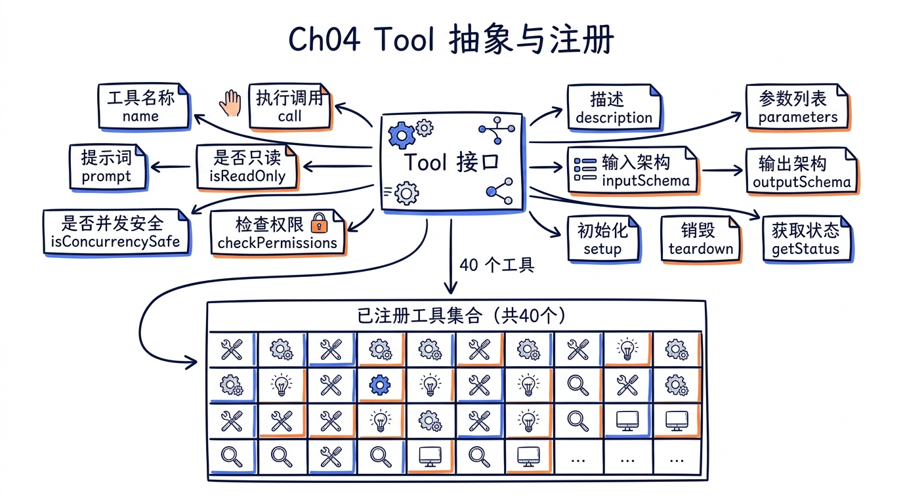
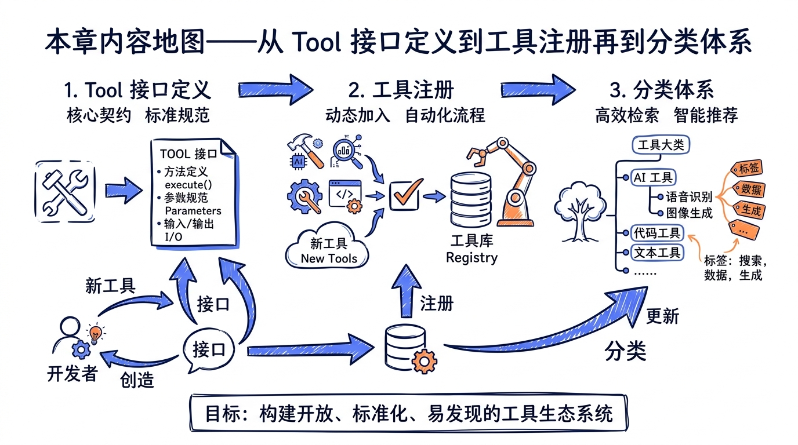

---
layout: default
title: "Ch04 Tool 抽象与注册机制"
nav_order: 20
parent: "模块二：工具系统"
---


# 第四章：Tool 抽象与注册机制



> **源码版本**：Claude Code v2.1.88
> **核心文件**：`src/Tool.ts`、`src/tools.ts`、`src/tools/*/`、`src/utils/toolSearch.ts`

上一章我们从宏观角度认识了工具系统的整体架构。本章将深入微观层面：逐一解剖 `Tool` 接口里的约 13 个核心字段，理解 `buildTool()` 工厂函数如何用"fail-closed"默认值守住安全底线，弄清 `getAllBaseTools()` 如何将 40 个工具组装成一个完整的工具池，以及 Feature Flag 和 ToolSearch 如何让这个池子动态伸缩。



---

## 一、Tool 类型全解析

### 1.1 为什么是类型而不是类

`Tool` 在 TypeScript 里被定义为一个泛型 `type`，而非 `class` 或 `abstract class`：

```typescript
// src/Tool.ts (第362-695行)
export type Tool<
  Input extends AnyObject = AnyObject,
  Output = unknown,
  P extends ToolProgressData = ToolProgressData,
> = {
  readonly name: string
  aliases?: string[]
  searchHint?: string
  call(...): Promise<ToolResult<Output>>
  description(...): Promise<string>
  readonly inputSchema: Input
  // ... 30+ 个方法和属性
}
```

三个泛型参数各有分工：

| 泛型参数 | 含义 | 示例 |
|---------|------|------|
| `Input` | Zod schema，定义工具输入的形状 | `z.strictObject({ pattern: z.string(), path: z.string().optional() })` |
| `Output` | 工具返回值的类型 | `{ numFiles: number, filenames: string[] }` |
| `P` | 进度事件的类型 | `BashProgress`、`MCPProgress` |

选择 `type` 而非 `class` 的设计动机，在上一章已有铺垫：工具实现可以是纯对象字面量，避免继承链带来的耦合。每个工具就是一个满足 `Tool` 类型的对象，没有 `new`，没有 `super`，没有 `this` 绑定的困扰。

### 1.2 方法分类总览

`Tool` 类型包含的方法和属性可以按职责划分为七个层次。下面这张表是全部方法的速查索引，后续小节逐一展开。

| 层次 | 方法/属性 | 必需 | 说明 |
|------|----------|------|------|
| **元数据** | `name` | 是 | 工具唯一标识 |
| | `aliases` | 否 | 旧名称兼容 |
| | `searchHint` | 否 | ToolSearch 关键词匹配用 |
| | `description()` | 是 | 给 API 的工具描述 |
| | `prompt()` | 是 | 完整的系统提示词 |
| | `userFacingName()` | 是 | UI 显示名 |
| **Schema** | `inputSchema` | 是 | Zod schema（输入） |
| | `inputJSONSchema` | 否 | MCP 工具的 JSON Schema |
| | `outputSchema` | 否 | Zod schema（输出） |
| | `validateInput()` | 否 | 运行前校验 |
| **执行** | `call()` | 是 | 核心执行逻辑 |
| | `isReadOnly()` | 是 | 是否只读 |
| | `isDestructive()` | 否 | 是否不可逆 |
| | `isConcurrencySafe()` | 是 | 能否并发 |
| | `interruptBehavior()` | 否 | 用户中断时的行为 |
| **权限** | `checkPermissions()` | 是 | 工具级权限检查 |
| | `needsPermissions` | -- | 由 `checkPermissions` 返回值隐含 |
| | `preparePermissionMatcher()` | 否 | Hook 模式匹配 |
| | `getPath()` | 否 | 文件类工具返回路径 |
| **生命周期** | `isEnabled()` | 是 | 是否可用 |
| | `shouldDefer` | 否 | 是否延迟加载 |
| | `alwaysLoad` | 否 | 是否永远加载 |
| **UI 渲染** | `renderToolUseMessage()` | 是 | 渲染工具调用 |
| | `renderToolResultMessage()` | 否 | 渲染工具结果 |
| | `renderToolUseProgressMessage()` | 否 | 渲染进度 |
| | `renderGroupedToolUse()` | 否 | 批量渲染 |
| | 6 个其它 render 方法 | 否 | 错误、拒绝、标签等 |
| **分类器** | `toAutoClassifierInput()` | 是 | 安全分类器摘要 |
| | `isSearchOrReadCommand()` | 否 | 折叠 UI 判断 |
| | `isOpenWorld()` | 否 | 开放世界标记 |
| | `backfillObservableInput()` | 否 | 观察者输入补全 |
| | `extractSearchText()` | 否 | 搜索索引 |
| | `getActivityDescription()` | 否 | Spinner 文案 |
| **杂项** | `maxResultSizeChars` | 是 | 结果大小上限 |
| | `strict` | 否 | 严格模式 |
| | `isMcp` / `isLsp` | 否 | 协议标记 |
| | `mcpInfo` | 否 | MCP 服务器信息 |

---

## 二、元数据方法：工具的"身份证"

### 2.1 name 与 aliases

```typescript
// src/Tool.ts (第456行)
readonly name: string

// 第369-371行
aliases?: string[]
```

`name` 是工具的唯一标识符，在整个系统中作为查找键使用。`aliases` 提供向后兼容——当工具重命名时，旧名称仍然可以被识别：

```typescript
// src/Tool.ts (第348-353行)
export function toolMatchesName(
  tool: { name: string; aliases?: string[] },
  name: string,
): boolean {
  return tool.name === name || (tool.aliases?.includes(name) ?? false)
}
```

`findToolByName()` 在工具池中查找工具时同时匹配 `name` 和 `aliases`：

```typescript
// src/Tool.ts (第358-360行)
export function findToolByName(tools: Tools, name: string): Tool | undefined {
  return tools.find(t => toolMatchesName(t, name))
}
```

### 2.2 description() 与 prompt()

这两个方法容易混淆。`description()` 给 API 调用时的 `tools[].description` 字段使用，是一两句话的简短描述：

```typescript
// src/tools/GlobTool/GlobTool.ts (第61-63行)
async description() {
  return DESCRIPTION  // "Fast file pattern matching using glob patterns..."
},
```

`prompt()` 更详细，是完整的使用说明，会注入到系统提示词中：

```typescript
prompt(options: {
  getToolPermissionContext: () => Promise<ToolPermissionContext>
  tools: Tools
  agents: AgentDefinition[]
  allowedAgentTypes?: string[]
}): Promise<string>
```

注意 `prompt()` 接收的参数中包含 `tools`（当前所有可用工具）和 `agents`（Agent 定义列表），这意味着工具的提示词可以根据上下文动态调整。例如，AgentTool 的 prompt 会根据是否启用了 Swarm 模式列出不同的可用 Agent 类型。

### 2.3 searchHint

```typescript
// src/Tool.ts (第377行)
searchHint?: string
```

当工具被延迟加载（deferred）时，ToolSearch 通过关键词匹配来帮助模型找到正确的工具。`searchHint` 提供额外的匹配关键词，补充 `name` 里没有的信息：

```typescript
// GlobTool
searchHint: 'find files by name pattern or wildcard'

// NotebookEditTool
searchHint: 'jupyter'  // 名字里没有 jupyter，但这是核心关键词

// TodoWriteTool
searchHint: 'manage the session task checklist'
```

---

## 三、Schema 方法：类型安全的输入输出

### 3.1 inputSchema 与延迟初始化

每个工具的输入 schema 都使用 Zod 定义，但不是直接赋值，而是通过 `lazySchema()` 延迟构造：

```typescript
// src/utils/lazySchema.ts (完整文件)
export function lazySchema<T>(factory: () => T): () => T {
  let cached: T | undefined
  return () => (cached ??= factory())
}
```

`lazySchema` 只有 4 行代码，却解决了一个真实的工程问题：Zod schema 的构造发生在模块加载时（top-level），如果 40 个工具的 schema 全部在启动时构造，会拖慢冷启动速度。`lazySchema` 将构造推迟到首次访问：

```typescript
// src/tools/GlobTool/GlobTool.ts (第26-36行)
const inputSchema = lazySchema(() =>
  z.strictObject({
    pattern: z.string().describe('The glob pattern to match files against'),
    path: z
      .string()
      .optional()
      .describe('The directory to search in...'),
  }),
)

// 在工具定义中作为 getter 暴露
export const GlobTool = buildTool({
  get inputSchema(): InputSchema {
    return inputSchema()  // 首次调用时才构造 Zod schema
  },
  // ...
})
```

### 3.2 inputJSONSchema：MCP 工具的特殊路径

MCP 工具的 schema 来自外部服务器，已经是 JSON Schema 格式，不需要经过 Zod：

```typescript
// src/Tool.ts (第397行)
readonly inputJSONSchema?: ToolInputJSONSchema
```

MCP 工具同时设置 `inputSchema`（一个宽松的 `z.object({}).passthrough()`）和 `inputJSONSchema`（真正的约束）。API 请求时优先使用后者。

### 3.3 validateInput()：运行前的额外校验

```typescript
// src/Tool.ts (第489-493行)
validateInput?(
  input: z.infer<Input>,
  context: ToolUseContext,
): Promise<ValidationResult>
```

Schema 验证只能检查结构和类型，`validateInput()` 做的是语义级别的校验。例如 GlobTool 会检查路径是否存在：

```typescript
// ValidationResult 的类型定义
export type ValidationResult =
  | { result: true }
  | {
      result: false
      message: string    // 告诉模型为什么失败
      errorCode: number  // 错误码
    }
```

校验失败时，`message` 会回传给模型（而非显示给用户），让模型理解错误并尝试修正。

---

## 四、执行方法：工具的"心脏"

### 4.1 call()：核心执行逻辑

```typescript
// src/Tool.ts (第379-385行)
call(
  args: z.infer<Input>,
  context: ToolUseContext,
  canUseTool: CanUseToolFn,
  parentMessage: AssistantMessage,
  onProgress?: ToolCallProgress<P>,
): Promise<ToolResult<Output>>
```

五个参数各司其职：

| 参数 | 作用 |
|------|------|
| `args` | 经过 schema 解析的输入 |
| `context` | `ToolUseContext`——工具执行的完整上下文（下节详解） |
| `canUseTool` | 一个回调函数，用于在执行过程中检查是否可以使用其它工具 |
| `parentMessage` | 触发此工具调用的 Assistant 消息 |
| `onProgress` | 进度回调（例如 Bash 命令的实时输出） |

返回值 `ToolResult<Output>` 的结构值得关注：

```typescript
// src/Tool.ts (第321-336行)
export type ToolResult<T> = {
  data: T                       // 工具的实际输出
  newMessages?: (               // 工具产生的新消息（注入对话流）
    | UserMessage
    | AssistantMessage
    | AttachmentMessage
    | SystemMessage
  )[]
  contextModifier?: (context: ToolUseContext) => ToolUseContext  // 修改后续上下文
  mcpMeta?: {                   // MCP 协议元数据
    _meta?: Record<string, unknown>
    structuredContent?: Record<string, unknown>
  }
}
```

`contextModifier` 是一个精巧的设计：工具可以在执行后修改后续工具调用的上下文。例如，`EnterWorktreeTool` 可以改变工作目录，影响后续所有文件操作。但文档明确指出：**`contextModifier` 仅对非并发安全的工具有效**，并发安全的工具之间不会共享上下文修改。

### 4.2 isReadOnly() 与 isDestructive()

```typescript
// src/Tool.ts (第404行)
isReadOnly(input: z.infer<Input>): boolean

// 第406行
isDestructive?(input: z.infer<Input>): boolean
```

这两个方法形成一个三级安全分类：

```
只读 (isReadOnly=true)     → 最安全，如 FileRead、Glob、Grep
写入 (isReadOnly=false)    → 可逆操作，如 FileEdit、FileWrite
不可逆 (isDestructive=true) → 删除、覆盖、发送，需要更强确认
```

注意它们都接收 `input` 参数——同一个工具对不同输入可能有不同的安全等级。例如 BashTool，`ls` 是只读的，而 `rm -rf` 是破坏性的。

### 4.3 isConcurrencySafe()：并发控制

```typescript
// src/Tool.ts (第402行)
isConcurrencySafe(input: z.infer<Input>): boolean
```

当模型在一个回复中发出多个 `tool_use` 块时，系统需要判断哪些工具可以并行执行。GlobTool 和 GrepTool 是并发安全的（纯只读），而 FileEditTool 不是（可能改同一个文件）：

```typescript
// GlobTool
isConcurrencySafe() {
  return true
},

// buildTool 默认值
isConcurrencySafe: (_input?: unknown) => false  // 假设不安全
```

默认值为 `false` 体现了 **fail-closed** 原则：如果工具作者忘了声明，系统假设最保守的情况。

### 4.4 interruptBehavior()：用户中断策略

```typescript
// src/Tool.ts (第416行)
interruptBehavior?(): 'cancel' | 'block'
```

当用户在工具运行时提交新消息：
- `'cancel'`：停止当前工具，丢弃结果
- `'block'`：继续运行，新消息排队等待

默认是 `'block'`——长时间运行的 Agent 子任务不应该被意外中断。

---

## 五、ToolUseContext：50+ 字段的执行上下文

`ToolUseContext` 是工具执行时的"环境变量"，包含了工具可能需要的一切。它的字段多达 50+，我们按类别梳理核心部分。

```typescript
// src/Tool.ts (第158-300行)
export type ToolUseContext = {
  options: {
    commands: Command[]
    debug: boolean
    mainLoopModel: string
    tools: Tools
    verbose: boolean
    thinkingConfig: ThinkingConfig
    mcpClients: MCPServerConnection[]
    mcpResources: Record<string, ServerResource[]>
    isNonInteractiveSession: boolean
    agentDefinitions: AgentDefinitionsResult
    maxBudgetUsd?: number
    customSystemPrompt?: string
    appendSystemPrompt?: string
    querySource?: QuerySource
    refreshTools?: () => Tools
  }
  abortController: AbortController
  readFileState: FileStateCache
  getAppState(): AppState
  setAppState(f: (prev: AppState) => AppState): void
  setToolJSX?: SetToolJSXFn
  messages: Message[]
  // ... 30+ 更多字段
}
```

### 5.1 核心字段分组

**配置层** (`options`)：

| 字段 | 作用 |
|------|------|
| `tools` | 当前可用的完整工具池 |
| `mainLoopModel` | 当前使用的模型 |
| `mcpClients` | 已连接的 MCP 服务器 |
| `agentDefinitions` | Agent 类型定义 |
| `maxBudgetUsd` | 预算上限 |
| `refreshTools` | 工具池刷新回调（MCP 服务器动态连接时使用） |

**状态层**：

| 字段 | 作用 |
|------|------|
| `getAppState()` / `setAppState()` | 全局应用状态的读写 |
| `readFileState` | 文件内容缓存（`FileStateCache`） |
| `messages` | 当前对话的完整消息历史 |

**控制层**：

| 字段 | 作用 |
|------|------|
| `abortController` | 取消控制器 |
| `setToolJSX` | 设置工具自定义 UI |
| `setInProgressToolUseIDs` | 追踪正在运行的工具 |
| `setHasInterruptibleToolInProgress` | 标记可中断的工具 |

**追踪层**：

| 字段 | 作用 |
|------|------|
| `agentId` | 子 Agent 标识（仅子 Agent 设置） |
| `agentType` | 子 Agent 类型名 |
| `toolUseId` | 当前 tool_use 块的 ID |
| `queryTracking` | 查询链追踪（chainId + depth） |

### 5.2 readFileState：文件缓存的关键角色

`readFileState` 是一个 LRU 缓存，记录了哪些文件已经被读取过以及它们的时间戳。这不是为了性能优化（虽然也有这个效果），而是为了**检测文件冲突**：当模型尝试编辑一个文件时，系统会比较缓存中的时间戳和磁盘上的时间戳，如果文件在模型读取之后被外部修改了，编辑会被拒绝并提示 `FILE_UNEXPECTEDLY_MODIFIED_ERROR`。

### 5.3 setToolJSX：工具的自定义 UI

```typescript
// src/Tool.ts (第103-114行)
export type SetToolJSXFn = (
  args: {
    jsx: React.ReactNode | null
    shouldHidePromptInput: boolean
    shouldContinueAnimation?: true
    showSpinner?: boolean
    isLocalJSXCommand?: boolean
    isImmediate?: boolean
    clearLocalJSX?: boolean
  } | null,
) => void
```

这是 Claude Code 的一个独特设计：工具可以在执行过程中接管终端 UI。例如，团队创建工具（TeamCreateTool）在 iTerm2 中需要显示设置向导时，通过 `setToolJSX` 渲染一个交互式 React 组件，隐藏常规的输入提示，等用户操作完成后再恢复。

---

## 六、权限方法：安全门禁

### 6.1 checkPermissions()

```typescript
// src/Tool.ts (第499-503行)
checkPermissions(
  input: z.infer<Input>,
  context: ToolUseContext,
): Promise<PermissionResult>
```

这是工具级别的权限检查，在通用权限系统（`permissions.ts`）之外提供工具特定的逻辑。返回值 `PermissionResult` 有多种行为：

```typescript
// 典型返回值模式
{ behavior: 'allow', updatedInput: input }       // 允许执行
{ behavior: 'passthrough', message: '...' }       // 交给通用权限系统处理
{ behavior: 'deny', message: '...' }              // 直接拒绝
```

看几个实际的 `checkPermissions` 实现：

```typescript
// TodoWriteTool (第58-61行) - 总是允许
async checkPermissions(input) {
  return { behavior: 'allow', updatedInput: input }
},

// MCPTool (第56-61行) - 交给通用权限系统
async checkPermissions(): Promise<PermissionResult> {
  return {
    behavior: 'passthrough',
    message: 'MCPTool requires permission.',
  }
},

// SyntheticOutputTool (第66-71行) - 总是允许
async checkPermissions(input): Promise<PermissionResult> {
  return { behavior: 'allow', updatedInput: input }
},
```

### 6.2 preparePermissionMatcher()

```typescript
// src/Tool.ts (第513-516行)
preparePermissionMatcher?(
  input: z.infer<Input>,
): Promise<(pattern: string) => boolean>
```

这个方法支持 Hook 中的 `if` 条件匹配。例如，BashTool 的权限规则 `"Bash(git *)"` 表示"允许所有 git 子命令"。`preparePermissionMatcher` 将输入解析为闭包，然后对每个 Hook 模式调用该闭包进行匹配。

解析只做一次，匹配可能做多次（多个 Hook 规则），这是一个典型的"编译-执行"分离优化。

---

## 七、生命周期方法：动态的工具池

### 7.1 isEnabled()：Feature Flag 守卫

```typescript
// src/Tool.ts (第403行)
isEnabled(): boolean
```

这个方法决定工具是否出现在模型可用的工具列表中。它是 Feature Flag 与工具系统的连接点：

```typescript
// TodoWriteTool (第52-54行) - 根据 TodoV2 开关决定
isEnabled() {
  return !isTodoV2Enabled()  // TodoV2 启用后，旧 TodoWrite 关闭
},

// EnterPlanModeTool (第56-60行) - 多条件守卫
isEnabled() {
  if (getAllowedChannels().length > 0) return false  // --channels 模式下禁用
  if (isPlanModeInterviewPhaseEnabled()) return false
  return true
},
```

在 `tools.ts` 的 `getTools()` 函数中，`isEnabled()` 作为过滤条件确保模型永远不会看到被禁用的工具：

```typescript
// src/tools.ts (第325-327行)
const isEnabled = allowedTools.map(_ => _.isEnabled())
return allowedTools.filter((_, i) => isEnabled[i])
```

### 7.2 shouldDefer 与 alwaysLoad：延迟加载机制

```typescript
// src/Tool.ts (第442-449行)
readonly shouldDefer?: boolean
readonly alwaysLoad?: boolean
```

当工具数量增多（尤其是 MCP 工具），把所有工具的完整 schema 一次性发送给模型会占用大量 context window。`shouldDefer` 标记的工具只会以名称形式出现，模型需要通过 ToolSearch 加载完整定义后才能调用。

判断一个工具是否应该被延迟加载的逻辑在 `isDeferredTool()` 中：

```typescript
// src/tools/ToolSearchTool/prompt.ts (第62-108行)
export function isDeferredTool(tool: Tool): boolean {
  // 显式标记 alwaysLoad 的工具永远不延迟
  if (tool.alwaysLoad === true) return false

  // MCP 工具总是延迟加载
  if (tool.isMcp === true) return true

  // ToolSearch 自己不能被延迟（否则无法加载其它工具）
  if (tool.name === TOOL_SEARCH_TOOL_NAME) return false

  // 某些关键工具需要立即可用
  if (feature('FORK_SUBAGENT') && tool.name === AGENT_TOOL_NAME) {
    if (m.isForkSubagentEnabled()) return false
  }

  // 最终看 shouldDefer 标记
  return tool.shouldDefer === true
}
```

这里的决策链非常清晰：

```
alwaysLoad=true → 不延迟
isMcp=true → 延迟
是 ToolSearch 自己 → 不延迟
是关键工具（Agent等） → 看具体条件
shouldDefer=true → 延迟
其它 → 不延迟
```

---

## 八、buildTool() 工厂函数：安全默认值

### 8.1 为什么需要工厂函数

每个工具都需要实现 `Tool` 类型的所有必需方法。但很多方法有"显而易见"的默认行为——例如大多数工具不是并发安全的，大多数工具没有特殊的权限逻辑。`buildTool()` 封装了这些默认值：

```typescript
// src/Tool.ts (第757-769行)
const TOOL_DEFAULTS = {
  isEnabled: () => true,
  isConcurrencySafe: (_input?: unknown) => false,
  isReadOnly: (_input?: unknown) => false,
  isDestructive: (_input?: unknown) => false,
  checkPermissions: (
    input: { [key: string]: unknown },
    _ctx?: ToolUseContext,
  ): Promise<PermissionResult> =>
    Promise.resolve({ behavior: 'allow', updatedInput: input }),
  toAutoClassifierInput: (_input?: unknown) => '',
  userFacingName: (_input?: unknown) => '',
}
```

### 8.2 Fail-Closed 设计哲学

看这些默认值的选择：

| 方法 | 默认值 | 含义 |
|------|--------|------|
| `isEnabled` | `true` | 工具默认可用——合理，否则忘记设置的工具会"消失" |
| `isConcurrencySafe` | `false` | **默认不安全**——忘记标记的工具不会被并行执行 |
| `isReadOnly` | `false` | **默认有写操作**——忘记标记的工具会触发权限检查 |
| `isDestructive` | `false` | 默认非破坏性——合理，破坏性工具需要显式声明 |
| `checkPermissions` | `allow` | 默认允许——权限的主要守卫在通用权限系统中 |
| `toAutoClassifierInput` | `''` | 默认跳过分类——安全相关的工具必须主动覆盖 |

这组默认值在安全相关的维度上全部选择了**更保守**的默认行为。`isConcurrencySafe=false` 意味着如果工具作者忘了声明并发安全性，工具不会被意外地并行执行导致数据竞争。`isReadOnly=false` 意味着忘了声明只读的工具会触发权限弹窗而不是静默通过。

### 8.3 类型体操：BuiltTool<D>

`buildTool` 的类型签名是整个 codebase 中最精巧的类型体操之一：

```typescript
// src/Tool.ts (第707-726行)
type DefaultableToolKeys =
  | 'isEnabled'
  | 'isConcurrencySafe'
  | 'isReadOnly'
  | 'isDestructive'
  | 'checkPermissions'
  | 'toAutoClassifierInput'
  | 'userFacingName'

export type ToolDef<...> = Omit<Tool<...>, DefaultableToolKeys> &
  Partial<Pick<Tool<...>, DefaultableToolKeys>>
```

`ToolDef` 就是"把默认方法变成可选的 `Tool`"。`buildTool` 接收 `ToolDef`，返回完整的 `Tool`——运行时就是一个 spread 操作：

```typescript
// src/Tool.ts (第783-792行)
export function buildTool<D extends AnyToolDef>(def: D): BuiltTool<D> {
  return {
    ...TOOL_DEFAULTS,
    userFacingName: () => def.name,  // userFacingName 默认返回工具名
    ...def,                          // 用户定义覆盖默认值
  } as BuiltTool<D>
}
```

`satisfies ToolDef` 语法在工具定义末尾经常出现，用于在 `buildTool` 之外提供额外的类型检查：

```typescript
// src/tools/MCPTool/MCPTool.ts (第77行)
} satisfies ToolDef<InputSchema, Output>)
```

---

## 九、工具注册：从定义到可用

### 9.1 getAllBaseTools()：完整工具列表

`src/tools.ts` 是所有工具的注册中心。`getAllBaseTools()` 返回所有内置工具的基础列表：

```typescript
// src/tools.ts (第193-251行)
export function getAllBaseTools(): Tools {
  return [
    AgentTool,
    TaskOutputTool,
    BashTool,
    // 搜索工具（有嵌入式搜索时不需要）
    ...(hasEmbeddedSearchTools() ? [] : [GlobTool, GrepTool]),
    ExitPlanModeV2Tool,
    FileReadTool,
    FileEditTool,
    FileWriteTool,
    NotebookEditTool,
    WebFetchTool,
    TodoWriteTool,
    WebSearchTool,
    TaskStopTool,
    AskUserQuestionTool,
    SkillTool,
    EnterPlanModeTool,
    // Feature-gated 工具
    ...(process.env.USER_TYPE === 'ant' ? [ConfigTool] : []),
    ...(isTodoV2Enabled()
      ? [TaskCreateTool, TaskGetTool, TaskUpdateTool, TaskListTool]
      : []),
    ...(isWorktreeModeEnabled() ? [EnterWorktreeTool, ExitWorktreeTool] : []),
    getSendMessageTool(),
    ...(isAgentSwarmsEnabled()
      ? [getTeamCreateTool(), getTeamDeleteTool()]
      : []),
    // 条件加载的工具
    ...(SleepTool ? [SleepTool] : []),
    ...cronTools,
    ...(RemoteTriggerTool ? [RemoteTriggerTool] : []),
    BriefTool,
    ...(getPowerShellTool() ? [getPowerShellTool()] : []),
    ListMcpResourcesTool,
    ReadMcpResourceTool,
    ...(isToolSearchEnabledOptimistic() ? [ToolSearchTool] : []),
  ]
}
```

这段代码展示了三种条件注册模式：

**模式一：编译时消除（Dead Code Elimination）**

```typescript
// src/tools.ts (第16-19行)
const REPLTool =
  process.env.USER_TYPE === 'ant'
    ? require('./tools/REPLTool/REPLTool.js').REPLTool
    : null
```

使用 `process.env` 在顶层做条件 `require`，bundler 在编译时根据环境变量消除不需要的代码分支。

**模式二：Feature Flag 守卫**

```typescript
// src/tools.ts (第29-35行)
const cronTools = feature('AGENT_TRIGGERS')
  ? [
      require('./tools/ScheduleCronTool/CronCreateTool.js').CronCreateTool,
      require('./tools/ScheduleCronTool/CronDeleteTool.js').CronDeleteTool,
      require('./tools/ScheduleCronTool/CronListTool.js').CronListTool,
    ]
  : []
```

`feature()` 来自 `bun:bundle`，在打包时解析 Feature Flag，实现编译期的条件编译。

**模式三：延迟 require 打破循环依赖**

```typescript
// src/tools.ts (第63-72行)
const getTeamCreateTool = () =>
  require('./tools/TeamCreateTool/TeamCreateTool.js')
    .TeamCreateTool as typeof import('./tools/TeamCreateTool/TeamCreateTool.js').TeamCreateTool
const getTeamDeleteTool = () =>
  require('./tools/TeamDeleteTool/TeamDeleteTool.js')
    .TeamDeleteTool as typeof import('./tools/TeamDeleteTool/TeamDeleteTool.js').TeamDeleteTool
```

TeamCreateTool 和 tools.ts 存在循环依赖。通过把 `require` 包装成函数，将模块解析推迟到调用时，打破了初始化时的循环。

### 9.2 getTools()：过滤后的工具池

`getTools()` 在 `getAllBaseTools()` 基础上应用多层过滤：

```typescript
// src/tools.ts (第271-327行)
export const getTools = (permissionContext: ToolPermissionContext): Tools => {
  // 简单模式：只有 Bash、Read、Edit
  if (isEnvTruthy(process.env.CLAUDE_CODE_SIMPLE)) {
    const simpleTools: Tool[] = [BashTool, FileReadTool, FileEditTool]
    return filterToolsByDenyRules(simpleTools, permissionContext)
  }

  // 过滤掉特殊工具
  const specialTools = new Set([
    ListMcpResourcesTool.name,
    ReadMcpResourceTool.name,
    SYNTHETIC_OUTPUT_TOOL_NAME,
  ])
  const tools = getAllBaseTools().filter(tool => !specialTools.has(tool.name))

  // 过滤 deny 规则
  let allowedTools = filterToolsByDenyRules(tools, permissionContext)

  // REPL 模式下隐藏原始工具
  if (isReplModeEnabled()) {
    const replEnabled = allowedTools.some(tool =>
      toolMatchesName(tool, REPL_TOOL_NAME),
    )
    if (replEnabled) {
      allowedTools = allowedTools.filter(
        tool => !REPL_ONLY_TOOLS.has(tool.name),
      )
    }
  }

  // 最终 isEnabled() 过滤
  const isEnabled = allowedTools.map(_ => _.isEnabled())
  return allowedTools.filter((_, i) => isEnabled[i])
}
```

过滤层层叠加：

```
getAllBaseTools()          ← 编译时 Feature Flag
  → 移除 special tools   ← ListMcpResources 等按需加入
  → filterToolsByDenyRules ← 用户配置的拒绝规则
  → REPL 过滤              ← REPL 模式下隐藏原始工具
  → isEnabled() 过滤       ← 运行时 Feature Flag
```

### 9.3 assembleToolPool()：合并 MCP 工具

内置工具和 MCP 工具最终在 `assembleToolPool()` 中合并：

```typescript
// src/tools.ts (第345-367行)
export function assembleToolPool(
  permissionContext: ToolPermissionContext,
  mcpTools: Tools,
): Tools {
  const builtInTools = getTools(permissionContext)
  const allowedMcpTools = filterToolsByDenyRules(mcpTools, permissionContext)

  // 分区排序保证 prompt cache 稳定性
  const byName = (a: Tool, b: Tool) => a.name.localeCompare(b.name)
  return uniqBy(
    [...builtInTools].sort(byName).concat(allowedMcpTools.sort(byName)),
    'name',
  )
}
```

注意这里的 **分区排序**：内置工具作为前缀，MCP 工具作为后缀，每个分区内部按名称排序。这是为了 **prompt cache 稳定性**——API 服务器的缓存策略在最后一个内置工具之后设置断点，如果 MCP 工具被排入内置工具之间，每次 MCP 工具变化都会使所有下游的缓存失效。

同名冲突时内置工具优先（`uniqBy` 保留先出现的）。

---

## 十、40 个工具的分类体系

Claude Code 的 `tools/` 目录下有 40 个真正的工具目录（其余条目如 `shared/`、`testing/`、`utils.ts` 是支持代码，不计入工具数量）。

### 10.0 完整 40 工具索引（按字母序）

下表列出**全部 40 个工具**，便于按需查阅。详细分类与每个工具的设计在后续 10.1–10.8 小节展开：

| # | 工具 | # | 工具 | # | 工具 | # | 工具 |
|---|---|---|---|---|---|---|---|
| 1 | AgentTool | 11 | FileReadTool | 21 | REPLTool | 31 | TaskListTool |
| 2 | AskUserQuestionTool | 12 | FileWriteTool | 22 | ReadMcpResourceTool | 32 | TaskOutputTool |
| 3 | BashTool | 13 | GlobTool | 23 | RemoteTriggerTool | 33 | TaskStopTool |
| 4 | BriefTool | 14 | GrepTool | 24 | ScheduleCronTool | 34 | TaskUpdateTool |
| 5 | ConfigTool | 15 | LSPTool | 25 | SendMessageTool | 35 | TeamCreateTool |
| 6 | EnterPlanModeTool | 16 | ListMcpResourcesTool | 26 | SkillTool | 36 | TeamDeleteTool |
| 7 | EnterWorktreeTool | 17 | MCPTool | 27 | SleepTool | 37 | TodoWriteTool |
| 8 | ExitPlanModeTool | 18 | McpAuthTool | 28 | SyntheticOutputTool | 38 | ToolSearchTool |
| 9 | ExitWorktreeTool | 19 | NotebookEditTool | 29 | TaskCreateTool | 39 | WebFetchTool |
| 10 | FileEditTool | 20 | PowerShellTool | 30 | TaskGetTool | 40 | WebSearchTool |

按功能域可以分为以下类别：


### 10.1 文件操作（6 个）

| 工具 | 说明 | 只读 | 并发安全 |
|------|------|------|---------|
| `FileRead` | 读取文件内容（支持图片、PDF、Notebook） | 是 | 是 |
| `FileWrite` | 创建/覆盖文件 | 否 | 否 |
| `FileEdit` | 精确字符串替换（补丁式编辑） | 否 | 否 |
| `Glob` | 文件名模式匹配搜索 | 是 | 是 |
| `Grep` | 文件内容正则搜索 | 是 | 是 |
| `NotebookEdit` | Jupyter Notebook 单元格编辑 | 否 | 否 |

FileEditTool 的设计特别值得关注：它不是"写入整个文件"，而是"找到 old_string，替换为 new_string"。这样做的好处是模型只需要生成差异部分而非整个文件内容，大幅减少 token 消耗和出错概率。

### 10.2 执行环境（3 个）

| 工具 | 说明 | 平台 |
|------|------|------|
| `Bash` | Shell 命令执行 | Unix/macOS |
| `PowerShell` | PowerShell 命令执行 | Windows |
| `REPL` | 虚拟执行环境（包装其它工具） | 内部 |

BashTool 是整个系统中最复杂的工具之一。它需要处理：
- 命令解析（判断是搜索、读取还是修改操作）
- 超时管理（前台/后台自动切换）
- 沙箱（安全隔离）
- Git 操作追踪（提交、推送、PR 创建的自动检测）
- 图片输出（截屏命令返回图片）

### 10.3 代理协作（9 个）

| 工具 | 说明 |
|------|------|
| `Agent` | 派生子 Agent 执行子任务 |
| `SendMessage` | 向团队成员发送消息 |
| `TaskCreate` | 创建 TodoV2 任务 |
| `TaskGet` | 获取任务详情 |
| `TaskList` | 列出所有任务 |
| `TaskOutput` | 生成任务输出 |
| `TaskStop` | 停止后台任务 |
| `TaskUpdate` | 更新任务状态 |
| `TeamCreate` / `TeamDelete` | 创建/删除团队（Swarm 模式） |

AgentTool 是第二复杂的工具，支持多种执行模式：
- **前台子 Agent**：同步执行，阻塞主线程
- **后台子 Agent**：异步执行，完成后通知
- **远程 Agent**：在远程环境中执行
- **Worktree 隔离**：在独立的 git worktree 中执行
- **团队成员生成**：通过 tmux/iTerm2 分窗格或进程内执行

### 10.4 计划与思考（4 个）

| 工具 | 说明 |
|------|------|
| `EnterPlanMode` | 进入计划模式（只读探索） |
| `ExitPlanMode` | 退出计划模式 |
| `TodoWrite` | 管理会话任务清单 |
| `Brief` | 主通信通道（Kairos 模式） |

`EnterPlanMode` 和 `ExitPlanMode` 形成一个"安全沙箱"：在计划模式中，模型只能使用只读工具，可以自由探索代码库而不用担心意外修改。用户审批计划后，模型退出计划模式进入执行阶段。

### 10.5 工作区（2 个）

| 工具 | 说明 |
|------|------|
| `EnterWorktree` | 进入 git worktree |
| `ExitWorktree` | 退出 git worktree |

Git worktree 为 Agent 提供了代码级别的隔离——子 Agent 可以在独立的 worktree 中工作，避免与主分支的改动冲突。

### 10.6 MCP 集成（4 个）

| 工具 | 说明 |
|------|------|
| `MCP` | MCP 工具的基础模板（被 `mcpClient.ts` 覆盖） |
| `McpAuth` | MCP 服务器认证 |
| `ListMcpResources` | 列出 MCP 资源 |
| `ReadMcpResource` | 读取 MCP 资源 |

MCPTool 的设计很有意思：它本身只是一个"壳"，所有方法（`name`、`description`、`call` 等）在 `mcpClient.ts` 中被覆盖为真实的 MCP 服务器信息。这意味着每个 MCP 工具实例都是 MCPTool 的一个定制副本。

### 10.7 网络（2 个）

| 工具 | 说明 |
|------|------|
| `WebFetch` | 获取 URL 内容并用 prompt 处理 |
| `WebSearch` | 网络搜索 |

WebFetchTool 的权限模型基于**域名**而非完整 URL：

```typescript
// src/tools/WebFetchTool/WebFetchTool.ts (第50-60行)
function webFetchToolInputToPermissionRuleContent(input: { ... }): string {
  const { url } = parsedInput.data
  const hostname = new URL(url).hostname
  return `domain:${hostname}`
}
```

一旦用户允许了某个域名，该域名下的所有 URL 都不再弹窗。

### 10.8 扩展与系统（10+ 个）

| 工具 | 说明 |
|------|------|
| `Skill` | 执行已注册的 Skill（插件命令） |
| `ToolSearch` | 搜索和加载延迟工具 |
| `Config` | 修改配置（内部用） |
| `RemoteTrigger` | 远程触发 |
| `ScheduleCron` (Create/Delete/List) | 定时任务管理 |
| `SyntheticOutput` | 结构化输出（SDK 模式） |
| `Sleep` | 等待指定时间 |
| `LSP` | Language Server Protocol 交互 |
| `AskUserQuestion` | 向用户提问 |

### 10.9 工具的权限分级

`constants/tools.ts` 定义了不同运行环境中工具的可用范围：

```typescript
// src/constants/tools.ts (第36-46行)
export const ALL_AGENT_DISALLOWED_TOOLS = new Set([
  TASK_OUTPUT_TOOL_NAME,
  EXIT_PLAN_MODE_V2_TOOL_NAME,
  ENTER_PLAN_MODE_TOOL_NAME,
  ...(process.env.USER_TYPE === 'ant' ? [] : [AGENT_TOOL_NAME]),
  ASK_USER_QUESTION_TOOL_NAME,
  TASK_STOP_TOOL_NAME,
])

// 第55-71行
export const ASYNC_AGENT_ALLOWED_TOOLS = new Set([
  FILE_READ_TOOL_NAME, WEB_SEARCH_TOOL_NAME, TODO_WRITE_TOOL_NAME,
  GREP_TOOL_NAME, WEB_FETCH_TOOL_NAME, GLOB_TOOL_NAME,
  ...SHELL_TOOL_NAMES, FILE_EDIT_TOOL_NAME, FILE_WRITE_TOOL_NAME,
  NOTEBOOK_EDIT_TOOL_NAME, SKILL_TOOL_NAME, SYNTHETIC_OUTPUT_TOOL_NAME,
  TOOL_SEARCH_TOOL_NAME,
  ENTER_WORKTREE_TOOL_NAME, EXIT_WORKTREE_TOOL_NAME,
])

// 第107-112行 - Coordinator 模式只允许调度工具
export const COORDINATOR_MODE_ALLOWED_TOOLS = new Set([
  AGENT_TOOL_NAME,
  TASK_STOP_TOOL_NAME,
  SEND_MESSAGE_TOOL_NAME,
  SYNTHETIC_OUTPUT_TOOL_NAME,
])
```

这构成了一个"最小权限"矩阵：

| 上下文 | 可用工具 | 禁用工具 | 设计原因 |
|--------|---------|---------|---------|
| 主线程 | 全部 | -- | 用户直接控制 |
| 子 Agent | 大部分 | PlanMode、AskUser、TaskStop | 防止影响主线程状态 |
| 异步 Agent | 文件 + 搜索 + 编辑 | Agent（防递归）、MCP（待定） | 最小必要权限 |
| Coordinator | Agent + Stop + SendMessage | 其它所有 | 只做调度不做执行 |

---

## 十一、ToolSearch：动态工具发现

### 11.1 问题背景

随着 MCP 生态的发展，一个 Claude Code 实例可能连接了数十个 MCP 服务器，每个服务器暴露多个工具。如果把所有工具的完整 schema 都塞进 system prompt，会消耗大量 context window（10% 甚至更多），挤占留给实际对话的空间。

### 11.2 ToolSearch 工作流

ToolSearch 的解决方案是**延迟加载**：

```
1. 初始化时：
   - 核心工具 → 发送完整 schema
   - 延迟工具 → 只发送名称（defer_loading: true）

2. 模型需要某个延迟工具时：
   - 调用 ToolSearch({query: "select:TodoWrite,NotebookEdit"})
   - 系统返回完整 schema（以 tool_reference 块的形式）
   - 模型获得完整定义后可以正常调用

3. 自动模式（tst-auto）：
   - 延迟工具的 token 占比 < 10% context window → 不延迟
   - 延迟工具的 token 占比 >= 10% → 启用延迟加载
```

### 11.3 ToolSearch 模式

```typescript
// src/utils/toolSearch.ts (第161行)
export type ToolSearchMode = 'tst' | 'tst-auto' | 'standard'
```

| 模式 | ENABLE_TOOL_SEARCH 值 | 行为 |
|------|----------------------|------|
| `tst` | `true`、`auto:0`、未设置 | 总是延迟 MCP 和 shouldDefer 工具 |
| `tst-auto` | `auto`、`auto:1-99` | 超过阈值时延迟 |
| `standard` | `false`、`auto:100` | 不延迟，所有工具完整加载 |

自动阈值的计算考虑了两个维度：

```typescript
// 精确方式：通过 token counting API
const deferredToolTokens = await countToolDefinitionTokens(deferredTools, ...)
const threshold = contextWindow * percentage  // 默认 10%
return deferredToolTokens >= threshold

// 回退方式：字符数估算
const CHARS_PER_TOKEN = 2.5
const charThreshold = tokenThreshold * CHARS_PER_TOKEN
```

### 11.4 跨 Compact 的工具发现保持

当对话被压缩（compact）时，包含 `tool_reference` 块的消息会被摘要替换。为了不丢失已发现的工具，compact 操作会将发现的工具名快照到 `compactMetadata.preCompactDiscoveredTools`：

```typescript
// src/utils/toolSearch.ts (第545-592行)
export function extractDiscoveredToolNames(messages: Message[]): Set<string> {
  const discoveredTools = new Set<string>()

  for (const msg of messages) {
    // 从 compact 边界恢复
    if (msg.type === 'system' && msg.subtype === 'compact_boundary') {
      const carried = msg.compactMetadata?.preCompactDiscoveredTools
      if (carried) {
        for (const name of carried) discoveredTools.add(name)
      }
      continue
    }

    // 从 tool_result 中提取 tool_reference
    if (msg.type !== 'user') continue
    for (const block of content) {
      if (isToolResultBlockWithContent(block)) {
        for (const item of block.content) {
          if (isToolReferenceWithName(item)) {
            discoveredTools.add(item.tool_name)
          }
        }
      }
    }
  }
  return discoveredTools
}
```

---

## 十二、UI 渲染方法详解

工具的渲染方法是 Claude Code 终端 UI 的核心。每个工具可以控制自己在四个阶段的显示。

### 12.1 四阶段渲染

```
tool_use 到达 → renderToolUseMessage()          显示"正在执行什么"
执行中       → renderToolUseProgressMessage()    显示进度
执行完成     → renderToolResultMessage()         显示结果
被拒绝       → renderToolUseRejectedMessage()    显示拒绝原因
```

以 GlobTool 为例：

```typescript
// 调用时：显示 "Glob **/*.ts in src/"
renderToolUseMessage(input) { ... }

// 进度：无（Glob 很快）
// renderToolUseProgressMessage 未定义

// 结果：显示 "Found 42 files in 12ms"
renderToolResultMessage(content, progressMessages, options) { ... }
```

而 BashTool 则有丰富的进度显示：

```typescript
// 调用时：显示命令
renderToolUseMessage(input) { ... }

// 进度：实时显示 stdout 输出
renderToolUseProgressMessage(progressMessages, options) { ... }

// 结果：显示完整输出
renderToolResultMessage(content, progressMessages, options) { ... }
```

### 12.2 分组渲染

```typescript
// src/Tool.ts (第678-694行)
renderGroupedToolUse?(
  toolUses: Array<{
    param: ToolUseBlockParam
    isResolved: boolean
    isError: boolean
    isInProgress: boolean
    progressMessages: ProgressMessage<P>[]
    result?: { param: ToolResultBlockParam; output: unknown }
  }>,
  options: { shouldAnimate: boolean; tools: Tools },
): React.ReactNode | null
```

当模型并行调用多个同类工具时（例如同时搜索 5 个文件），`renderGroupedToolUse` 可以将它们合并为一个紧凑的显示，而不是 5 个独立的块。AgentTool 用这个方法将并行子 Agent 渲染为一个统一的面板。

### 12.3 辅助渲染方法

```typescript
// 活动描述（Spinner 旁边的文案）
getActivityDescription?(input): string | null
// 例如 GlobTool 返回 "Finding **/*.ts"

// 工具使用摘要（折叠视图）
getToolUseSummary?(input): string | null

// 结果是否被截断（决定是否显示"点击展开"）
isResultTruncated?(output): boolean

// 搜索/读取命令识别（决定是否折叠显示）
isSearchOrReadCommand?(input): { isSearch: boolean; isRead: boolean; isList?: boolean }
```

---

## 十三、分类器与安全方法

### 13.1 toAutoClassifierInput()

```typescript
// src/Tool.ts (第556行)
toAutoClassifierInput(input: z.infer<Input>): unknown
```

Auto 模式（`--permission-mode auto`）使用安全分类器自动审批低风险的工具调用。`toAutoClassifierInput` 将工具输入转换为分类器可理解的紧凑表示：

```typescript
// TodoWriteTool
toAutoClassifierInput(input) {
  return `${input.todos.length} items`
},

// BashTool (概念性)
toAutoClassifierInput(input) {
  return input.command  // "ls -la src/"
},
```

默认值返回 `''`（空字符串），表示跳过此工具的分类——这是安全的，因为跳过意味着分类器不会自动审批，而是回退到手动确认。

### 13.2 backfillObservableInput()

```typescript
// src/Tool.ts (第481行)
backfillObservableInput?(input: Record<string, unknown>): void
```

这个方法在观察者看到工具输入之前被调用，可以添加向后兼容的字段。它是幂等的，原地修改，并且**不会修改发送给 API 的原始输入**（保护 prompt cache）。

---

## 十四、工具共享模块

`src/tools/shared/` 目录包含跨工具共享的逻辑：

### 14.1 gitOperationTracking.ts

```typescript
// src/tools/shared/gitOperationTracking.ts
export function detectGitOperation(
  command: string,
  output: string,
): {
  commit?: { sha: string; kind: CommitKind }
  push?: { branch: string }
  branch?: { ref: string; action: BranchAction }
  pr?: { number: number; url?: string; action: PrAction }
}
```

BashTool 和 PowerShellTool 共享这个模块来检测 git 操作。它通过正则表达式匹配命令字符串和输出，识别 commit、push、PR 创建等操作，然后触发 OTLP 计数器和分析事件。

### 14.2 spawnMultiAgent.ts

这个模块为 TeamCreateTool 和 AgentTool 提供了团队成员生成的共享逻辑，支持三种后端：

1. **tmux 分窗格**：在 tmux 中创建新窗格
2. **iTerm2 原生分窗格**：使用 iTerm2 的 it2 CLI
3. **进程内执行**：在同一 Node.js 进程中通过 AsyncLocalStorage 隔离

---

## 十五、一个工具从定义到执行的完整旅程

让我们追踪 GlobTool 从定义到被模型调用的全过程：

```
1. 定义阶段
   GlobTool.ts → buildTool({...}) → 填充默认值 → 导出 GlobTool 对象

2. 注册阶段
   tools.ts → getAllBaseTools() → [..., GlobTool, ...]
   → getTools(permCtx) → filterToolsByDenyRules → isEnabled() 过滤
   → assembleToolPool(permCtx, mcpTools) → 合并 MCP 工具

3. 发送给 API
   GlobTool.inputSchema → zodToJsonSchema() → JSON Schema
   GlobTool.prompt() → 工具说明文本
   GlobTool.description() → 短描述
   → 作为 tools[] 参数发送给 Claude API

4. 模型返回 tool_use
   { type: "tool_use", name: "Glob", input: { pattern: "**/*.ts" } }

5. 权限检查
   GlobTool.validateInput(input, ctx)     → 路径存在检查
   GlobTool.checkPermissions(input, ctx)  → 读取权限检查
   → permissions.ts 通用权限系统          → 规则匹配

6. 执行
   GlobTool.call(args, context, canUseTool, parentMsg, onProgress)
   → glob(pattern, opts) → 文件系统搜索
   → return { data: { numFiles, filenames, truncated, durationMs } }

7. 渲染
   GlobTool.renderToolUseMessage(input)     → "Glob **/*.ts"
   GlobTool.renderToolResultMessage(output) → "Found 42 files in 12ms"

8. 回传 API
   GlobTool.mapToolResultToToolResultBlockParam(content, toolUseID)
   → { type: "tool_result", tool_use_id: "...", content: "..." }
```


---

## 十六、动手实践

### 练习 1：实现一个最小工具

创建一个 `WordCountTool`，接收文件路径，返回行数和字数。要求使用 `buildTool()` 和 `lazySchema()`：

```typescript
import { z } from 'zod/v4'
import { buildTool } from '../../Tool.js'
import { lazySchema } from '../../utils/lazySchema.js'

const inputSchema = lazySchema(() =>
  z.strictObject({
    file_path: z.string().describe('要统计的文件路径'),
  }),
)

export const WordCountTool = buildTool({
  name: 'WordCount',
  maxResultSizeChars: 10_000,
  async description() { return '统计文件的行数和字数' },
  async prompt() { return '使用此工具来获取文件的行数和字数统计' },
  get inputSchema() { return inputSchema() },

  // 只读工具
  isReadOnly() { return true },
  isConcurrencySafe() { return true },

  async call({ file_path }, context) {
    const fs = await import('fs/promises')
    const content = await fs.readFile(file_path, 'utf-8')
    const lines = content.split('\n').length
    const words = content.split(/\s+/).filter(Boolean).length
    return { data: { file_path, lines, words } }
  },

  renderToolUseMessage(input) { return `WordCount ${input.file_path}` },
  mapToolResultToToolResultBlockParam(content, toolUseID) {
    return {
      type: 'tool_result',
      tool_use_id: toolUseID,
      content: JSON.stringify(content),
    }
  },
})
```

**思考题**：
1. 这个工具缺少了哪些在生产环境中必要的方法？（提示：权限、活动描述、分类器输入）
2. 如果要把它标记为可延迟加载，需要设置什么属性？
3. `buildTool` 会为它填充哪些默认值？

### 练习 2：分析工具注册流程

阅读 `src/tools.ts` 的 `getAllBaseTools()` 函数，回答：

1. 有多少工具使用了编译时 Feature Flag（`feature()`）守卫？
2. 有多少工具使用了运行时环境变量（`process.env`）守卫？
3. 为什么 `TeamCreateTool` 使用延迟 `require` 而不是直接 `import`？
4. `CLAUDE_CODE_SIMPLE` 模式下只有哪 3 个工具可用？

### 练习 3：追踪 ToolSearch 的延迟加载

1. 找到所有设置了 `shouldDefer: true` 的工具
2. 解释为什么 ToolSearch 自己不能被延迟加载
3. 在 `tst-auto` 模式下，如果有 200 个 MCP 工具，每个工具的 schema 平均占 500 token，context window 为 200K，工具搜索会被启用吗？（提示：200 * 500 = 100K，100K / 200K = 50% > 10%）

---

## 十七、源码对照表

| 概念 | 源码位置 | 说明 |
|------|----------|------|
| Tool 类型定义 | `src/Tool.ts:362-695` | 完整的 Tool 泛型类型 |
| ToolUseContext | `src/Tool.ts:158-300` | 工具执行上下文 |
| ToolResult | `src/Tool.ts:321-336` | 工具返回值类型 |
| buildTool() | `src/Tool.ts:783-792` | 工厂函数 |
| TOOL_DEFAULTS | `src/Tool.ts:757-769` | 默认值定义 |
| ToolDef | `src/Tool.ts:721-726` | 可选默认方法的工具定义 |
| ValidationResult | `src/Tool.ts:95-101` | 输入验证结果 |
| toolMatchesName() | `src/Tool.ts:348-353` | 名称/别名匹配 |
| findToolByName() | `src/Tool.ts:358-360` | 按名称查找工具 |
| lazySchema() | `src/utils/lazySchema.ts` | Schema 延迟构造 |
| getAllBaseTools() | `src/tools.ts:193-251` | 完整工具列表 |
| getTools() | `src/tools.ts:271-327` | 过滤后的工具池 |
| assembleToolPool() | `src/tools.ts:345-367` | 合并内置和 MCP 工具 |
| filterToolsByDenyRules() | `src/tools.ts:262-269` | 拒绝规则过滤 |
| isDeferredTool() | `src/tools/ToolSearchTool/prompt.ts:62-108` | 延迟加载判断 |
| isToolSearchEnabled() | `src/utils/toolSearch.ts:385-473` | ToolSearch 启用检查 |
| extractDiscoveredToolNames() | `src/utils/toolSearch.ts:545-592` | 从消息历史提取已发现的工具 |
| ALL_AGENT_DISALLOWED_TOOLS | `src/constants/tools.ts:36-46` | 子 Agent 禁用列表 |
| ASYNC_AGENT_ALLOWED_TOOLS | `src/constants/tools.ts:55-71` | 异步 Agent 白名单 |
| COORDINATOR_MODE_ALLOWED_TOOLS | `src/constants/tools.ts:107-112` | Coordinator 模式白名单 |
| gitOperationTracking | `src/tools/shared/gitOperationTracking.ts` | Git 操作检测 |
| spawnMultiAgent | `src/tools/shared/spawnMultiAgent.ts` | 团队成员生成 |

---

## 本章小结

本章从微观层面解剖了 Claude Code 的工具抽象：

1. **Tool 类型**是一个 30+ 方法的接口，覆盖了元数据、schema、执行、权限、生命周期、UI 渲染和安全分类七个层次。选择 `type` 而非 `class` 避免了继承链耦合。

2. **buildTool() 工厂函数**通过 fail-closed 默认值（`isConcurrencySafe=false`、`isReadOnly=false`）确保忘记设置的工具走最安全的路径。

3. **工具注册**经过三层过滤：编译时 Feature Flag → 拒绝规则 → 运行时 `isEnabled()`。`assembleToolPool()` 以分区排序的方式合并内置工具和 MCP 工具，保证 prompt cache 的稳定性。

4. **40 个工具**按功能分为 8 大类，不同运行上下文（主线程、子 Agent、Coordinator）有不同的可用工具子集，遵循最小权限原则。

5. **ToolSearch** 通过延迟加载机制解决了大量 MCP 工具占用 context window 的问题，支持手动、自动和关闭三种模式。

6. **ToolUseContext** 以 50+ 字段的"胖上下文"模式，让工具可以访问从应用状态到文件缓存再到 UI 渲染的一切。

下一章 Ch05，我们将深入剖析 Claude Code 中最复杂、最具代表性的 6 个核心工具——BashTool、FileEditTool、FileReadTool、AgentTool、Grep/Glob、WebFetch——把"接口设计"层面的抽象，落到"工程实现"层面的细节。

## 思考题

如果新增一个工具，Tool 接口的 13 个核心字段中，你会先实现哪几个？为什么？

欢迎在评论区聊聊你的想法。

下一讲，我们换个角度看《核心工具深度剖析》。

