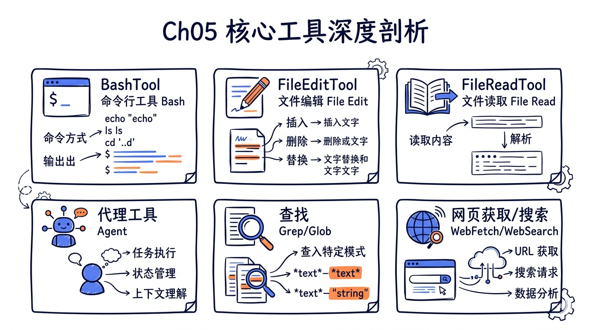
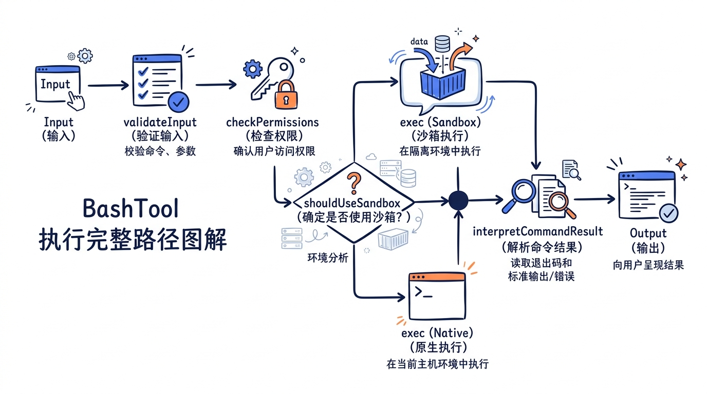
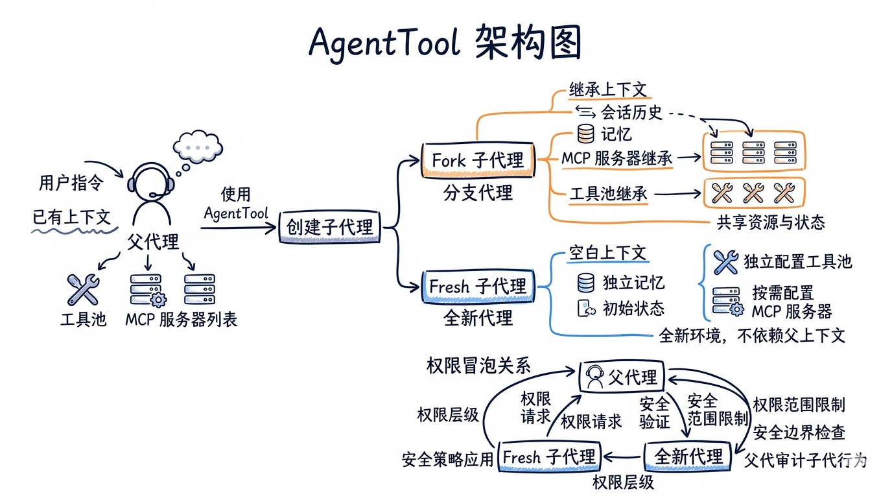
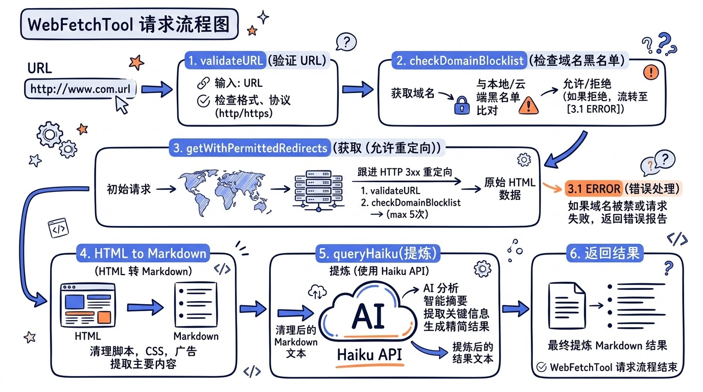

# 第五章: 核心工具深度剖析



> **源码版本**: Claude Code v2.1.88
> **源码路径**: `src/src/tools/`
> **阅读时间**: 约 45 分钟

前面四章我们走通了 CLI 启动、Agent Loop、对话上下文的完整链路。但真正让 AI 能"动手做事"的，是挂载在 Agent Loop 上的**工具系统**。Claude Code 内置了二十余种工具，其中六类是日常使用频率最高的核心工具。本章将逐一拆解它们的源码实现，带你看清每一行代码背后的设计决策。


---

## 5.1 BashTool: 最强大也最危险的工具

BashTool 是 Claude Code 中代码量最大、安全机制最复杂的单一工具。它允许 AI 在用户机器上执行任意 shell 命令——这既是它强大的根源，也是安全风险的主要来源。

### 5.1.1 文件结构一览

```
tools/BashTool/
├── BashTool.tsx              # 主文件，核心逻辑 (~900行)
├── prompt.ts                 # System prompt 生成
├── bashSecurity.ts           # 安全校验引擎 (~800行)
├── bashPermissions.ts        # 权限规则匹配
├── bashCommandHelpers.ts     # 复合命令拆分与校验
├── shouldUseSandbox.ts       # Sandbox 判定逻辑
├── destructiveCommandWarning.ts # 危险命令警告
├── commandSemantics.ts       # Exit code 语义解释
├── sedEditParser.ts          # sed 命令特殊处理
├── readOnlyValidation.ts     # 只读模式校验
├── modeValidation.ts         # 模式级别校验
├── pathValidation.ts         # 路径安全校验
└── toolName.ts               # 工具名常量
```

### 5.1.2 Input Schema：精心设计的参数

BashTool 的输入 schema 定义在 `BashTool.tsx` 中，看似简单，但每个字段都有深意：

```typescript
// 文件: src/src/tools/BashTool/BashTool.tsx (L227-L258)
const fullInputSchema = lazySchema(() => z.strictObject({
  command: z.string().describe('The command to execute'),
  timeout: semanticNumber(z.number().optional())
    .describe(`Optional timeout in milliseconds (max ${getMaxTimeoutMs()})`),
  description: z.string().optional()
    .describe(`Clear, concise description of what this command does...`),
  run_in_background: semanticBoolean(z.boolean().optional())
    .describe(`Set to true to run this command in the background.`),
  dangerouslyDisableSandbox: semanticBoolean(z.boolean().optional())
    .describe('Set this to true to dangerously override sandbox mode...'),
  _simulatedSedEdit: z.object({
    filePath: z.string(),
    newContent: z.string()
  }).optional().describe('Internal: pre-computed sed edit result from preview')
}));
```

这里有几个值得注意的设计：

1. **`semanticNumber` / `semanticBoolean`**: 这不是普通的 Zod type。Claude 模型有时会把 boolean 输出为 `"true"`（字符串），这两个 wrapper 能容错解析。
2. **`_simulatedSedEdit`**: 以下划线开头的内部字段，**永远不会暴露给模型**。它在用户通过 permission dialog 预览 sed 编辑后注入，确保"所见即所得"。
3. **`description`**: 不是给人看的——它出现在 UI 的权限确认弹窗中，帮助用户理解这个命令在做什么。

关键安全措施：`_simulatedSedEdit` 字段从面向模型的 schema 中移除：

```typescript
// 文件: src/src/tools/BashTool/BashTool.tsx (L254-L259)
const inputSchema = lazySchema(() => isBackgroundTasksDisabled
  ? fullInputSchema().omit({
      run_in_background: true,
      _simulatedSedEdit: true
    })
  : fullInputSchema().omit({
      _simulatedSedEdit: true
    })
);
```

如果将 `_simulatedSedEdit` 暴露给模型，模型就能用一个无害的 command 搭配一个恶意的 file write 来绕过 sandbox——这是一个典型的"安全边界不能泄露给不受信内部组件"的案例。

### 5.1.3 Sandbox 机制

Sandbox 是 BashTool 的核心安全层。`shouldUseSandbox.ts` 决定是否启用沙箱：

```typescript
// 文件: src/src/tools/BashTool/shouldUseSandbox.ts (L130-L153)
export function shouldUseSandbox(input: Partial<SandboxInput>): boolean {
  if (!SandboxManager.isSandboxingEnabled()) {
    return false
  }
  // 用户显式关闭 + 策略允许
  if (input.dangerouslyDisableSandbox &&
      SandboxManager.areUnsandboxedCommandsAllowed()) {
    return false
  }
  if (!input.command) {
    return false
  }
  // 用户配置的排除命令（如 bazel、docker）
  if (containsExcludedCommand(input.command)) {
    return false
  }
  return true
}
```

排除命令的匹配逻辑处理复合命令（`docker ps && curl evil.com`），对每个子命令独立检查，防止恶意命令通过 `&&` 搭便车：

```typescript
// 文件: src/src/tools/BashTool/shouldUseSandbox.ts (L64-L69)
let subcommands: string[]
try {
  subcommands = splitCommand_DEPRECATED(command)
} catch {
  subcommands = [command]
}
```

Sandbox 的限制在 prompt 中以 JSON 格式告知模型，包含文件系统读写规则和网络规则。值得注意的一个优化：为了避免破坏跨用户的 prompt cache，系统把用户特定的临时目录（如 `/private/tmp/claude-1001/`）替换为 `$TMPDIR`：

```typescript
// 文件: src/src/tools/BashTool/prompt.ts (L188-L191)
const claudeTempDir = getClaudeTempDir()
const normalizeAllowOnly = (paths: string[]): string[] =>
  [...new Set(paths)].map(p => (p === claudeTempDir ? '$TMPDIR' : p))
```

### 5.1.4 危险命令检测

`destructiveCommandWarning.ts` 是一个纯信息层——它不阻止命令执行，但在权限确认弹窗中显示警告：

```typescript
// 文件: src/src/tools/BashTool/destructiveCommandWarning.ts (L12-L89)
const DESTRUCTIVE_PATTERNS: DestructivePattern[] = [
  // Git — 数据丢失
  { pattern: /\bgit\s+reset\s+--hard\b/,
    warning: 'Note: may discard uncommitted changes' },
  { pattern: /\bgit\s+push\b[^;&|\n]*[ \t](--force|--force-with-lease|-f)\b/,
    warning: 'Note: may overwrite remote history' },
  // 文件删除
  { pattern: /(^|[;&|\n]\s*)rm\s+-[a-zA-Z]*[rR][a-zA-Z]*f/,
    warning: 'Note: may recursively force-remove files' },
  // 数据库
  { pattern: /\b(DROP|TRUNCATE)\s+(TABLE|DATABASE|SCHEMA)\b/i,
    warning: 'Note: may drop or truncate database objects' },
  // 基础设施
  { pattern: /\bkubectl\s+delete\b/,
    warning: 'Note: may delete Kubernetes resources' },
  { pattern: /\bterraform\s+destroy\b/,
    warning: 'Note: may destroy Terraform infrastructure' },
];
```

注意正则表达式的精确性——`git clean` 的检测排除了 `--dry-run` 模式：

```typescript
{ pattern: /\bgit\s+clean\b(?![^;&|\n]*(?:-[a-zA-Z]*n|--dry-run))[^;&|\n]*-[a-zA-Z]*f/,
  warning: 'Note: may permanently delete untracked files' },
```

### 5.1.5 安全校验引擎

`bashSecurity.ts` 是 BashTool 中最复杂的文件（超过 800 行）。它定义了一套全面的命令注入防御体系。以下是部分关键检测维度：

**命令替换检测**——阻止 `$()` 等 shell 元编程语法：

```typescript
// 文件: src/src/tools/BashTool/bashSecurity.ts (L16-L41)
const COMMAND_SUBSTITUTION_PATTERNS = [
  { pattern: /<\(/, message: 'process substitution <()' },
  { pattern: />\(/, message: 'process substitution >()' },
  { pattern: /=\(/, message: 'Zsh process substitution =()' },
  { pattern: /\$\(/, message: '$() command substitution' },
  { pattern: /\$\{/, message: '${} parameter substitution' },
  { pattern: /\$\[/, message: '$[] legacy arithmetic expansion' },
];
```

**Zsh 危险命令阻断**——Claude Code 同时支持 bash 和 zsh，而 zsh 有独特的危险特性：

```typescript
// 文件: src/src/tools/BashTool/bashSecurity.ts (L43-L74)
const ZSH_DANGEROUS_COMMANDS = new Set([
  'zmodload',   // 模块加载——通往 mapfile/sysopen/ztcp 的入口
  'emulate',    // 带 -c 时等同于 eval
  'sysopen',    // 精细文件 I/O (zsh/system)
  'syswrite',   // 文件描述符写入
  'zpty',       // 伪终端命令执行
  'ztcp',       // TCP 网络连接（可用于数据渗透）
  'zf_rm',      // 内建 rm，绕过 binary 检查
  'zf_mv',      // 内建 mv
  'zf_chmod',   // 内建 chmod
]);
```

系统对每条命令定义了唯一的数字 ID，用于日志追踪：

```typescript
// 文件: src/src/tools/BashTool/bashSecurity.ts (L77-L101)
const BASH_SECURITY_CHECK_IDS = {
  INCOMPLETE_COMMANDS: 1,
  JQ_SYSTEM_FUNCTION: 2,
  OBFUSCATED_FLAGS: 4,
  SHELL_METACHARACTERS: 5,
  DANGEROUS_VARIABLES: 6,
  NEWLINES: 7,
  DANGEROUS_PATTERNS_COMMAND_SUBSTITUTION: 8,
  IFS_INJECTION: 11,
  CONTROL_CHARACTERS: 17,
  UNICODE_WHITESPACE: 18,
  // ...
} as const
```

### 5.1.6 Exit Code 语义解释

`commandSemantics.ts` 告诉 Agent Loop 不同命令的 exit code 含义。例如 `grep` 返回 1 只是"没找到"，不是错误：

```typescript
// 文件: src/src/tools/BashTool/commandSemantics.ts (L31-L86)
const COMMAND_SEMANTICS: Map<string, CommandSemantic> = new Map([
  ['grep', (exitCode) => ({
    isError: exitCode >= 2,
    message: exitCode === 1 ? 'No matches found' : undefined,
  })],
  ['diff', (exitCode) => ({
    isError: exitCode >= 2,
    message: exitCode === 1 ? 'Files differ' : undefined,
  })],
  ['test', (exitCode) => ({
    isError: exitCode >= 2,
    message: exitCode === 1 ? 'Condition is false' : undefined,
  })],
]);
```

对于复合命令，系统提取最后一个命令的语义——因为在 shell 中，复合命令的 exit code 由最后一个命令决定。

### 5.1.7 复合命令安全检查

`bashCommandHelpers.ts` 处理管道和复合命令的安全校验。一个关键检查是防止跨 pipe segment 的 `cd + git` 攻击：

```typescript
// 文件: src/src/tools/BashTool/bashCommandHelpers.ts (L49-L82)
// SECURITY: 检查跨 pipe segment 的 cd+git 模式
// 防止 bare repo fsmonitor bypass
{
  let hasCd = false
  let hasGit = false
  for (const segment of segments) {
    const subcommands = splitCommand_DEPRECATED(segment)
    for (const sub of subcommands) {
      if (checkers.isNormalizedCdCommand(sub.trim())) hasCd = true
      if (checkers.isNormalizedGitCommand(sub.trim())) hasGit = true
    }
  }
  if (hasCd && hasGit) {
    return {
      behavior: 'ask',
      decisionReason: {
        type: 'other',
        reason: 'Compound commands with cd and git require approval...',
      },
    }
  }
}
```

这防范的是一种真实攻击：通过 `cd` 进入一个恶意的 bare git repository，然后执行 `git status`——git 的 fsmonitor hook 会自动执行仓库中预设的恶意脚本。



---

## 5.2 FileEditTool: 精准的文本替换引擎

FileEditTool 实现了一种看似简单但细节丰富的编辑机制：`old_string` -> `new_string` 精确替换。

### 5.2.1 核心设计理念

为什么不用 diff/patch？为什么不用行号定位？选择 string replacement 有深层原因：

1. **模型友好**: LLM 天然擅长生成文本替换，不擅长生成精确行号偏移
2. **无序依赖**: 多个独立编辑不受顺序影响
3. **唯一性约束**: 强制 `old_string` 在文件中唯一出现，避免模型编辑错误位置

### 5.2.2 唯一性校验

这是 FileEditTool 最核心的安全机制。在 `validateInput` 中：

```typescript
// 文件: src/src/tools/FileEditTool/FileEditTool.ts (L329-L343)
const matches = file.split(actualOldString).length - 1

if (matches > 1 && !replace_all) {
  return {
    result: false,
    behavior: 'ask',
    message: `Found ${matches} matches of the string to replace, 
      but replace_all is false. To replace all occurrences, 
      set replace_all to true.`,
    errorCode: 9,
  }
}
```

当 `old_string` 出现多次时，工具不会静默选择第一个匹配，而是报错要求模型：要么提供更多上下文使匹配唯一，要么显式设置 `replace_all: true`。

### 5.2.3 Curly Quote 处理

很多文件使用 curly quotes（`“` `”`），但 LLM 只能输出 straight quotes（`"` `"`）。`findActualString` 函数解决了这个问题：

```typescript
// 文件: src/src/tools/FileEditTool/utils.ts (L73-L93)
export function findActualString(
  fileContent: string,
  searchString: string,
): string | null {
  // 先尝试精确匹配
  if (fileContent.includes(searchString)) {
    return searchString
  }
  // 再尝试 quote 归一化匹配
  const normalizedSearch = normalizeQuotes(searchString)
  const normalizedFile = normalizeQuotes(fileContent)
  const searchIndex = normalizedFile.indexOf(normalizedSearch)
  if (searchIndex !== -1) {
    return fileContent.substring(
      searchIndex, searchIndex + searchString.length
    )
  }
  return null
}
```

配套地，当匹配成功后，`preserveQuoteStyle` 确保 `new_string` 也使用文件原有的 curly quote 风格——连缩写中的撇号（如 don't）也能正确处理。

### 5.2.4 并发写入保护——乐观锁模式

FileEditTool 有一套精密的"读后写"保护机制，形成一个**乐观锁**：

```typescript
// 文件: src/src/tools/FileEditTool/FileEditTool.ts (L274-L311)
// 步骤 1：检查文件是否已读取
const readTimestamp = toolUseContext.readFileState.get(fullFilePath)
if (!readTimestamp || readTimestamp.isPartialView) {
  return {
    result: false,
    message: 'File has not been read yet. Read it first.',
    errorCode: 6,
  }
}

// 步骤 2：检查文件是否在读取后被修改
if (readTimestamp) {
  const lastWriteTime = getFileModificationTime(fullFilePath)
  if (lastWriteTime > readTimestamp.timestamp) {
    const isFullRead = readTimestamp.offset === undefined &&
                       readTimestamp.limit === undefined
    // Windows 回退：mtime 变了但内容没变（云同步/杀毒软件场景）
    if (isFullRead && fileContent === readTimestamp.content) {
      // 安全，继续
    } else {
      return {
        result: false,
        message: 'File has been modified since read...',
        errorCode: 7,
      }
    }
  }
}
```

这个模式确保：Read -> Edit 之间如果文件被外部（linter、用户手动编辑、其他工具）修改，编辑会被拒绝。

### 5.2.5 De-sanitization 机制

Claude API 对某些 XML-like 标签会做安全化处理（如 `<function_results>` 变成 `<fnr>`），模型看到的是处理后的版本。FileEditTool 自动还原：

```typescript
// 文件: src/src/tools/FileEditTool/utils.ts (L531-L550)
const DESANITIZATIONS: Record<string, string> = {
  '<fnr>': '<function_results>',
  '<n>':   '<name>',
  '</n>':  '</name>',
  '<e>':   '<error>',
  '</e>':  '</error>',
  '<s>':   '<system>',
  '</s>':  '</system>',
  '\n\nH:': '\n\nHuman:',
  '\n\nA:': '\n\nAssistant:',
}
```

当精确匹配失败时，系统尝试对 `old_string` 和 `new_string` 做反安全化处理，然后重新匹配。


---

## 5.3 FileReadTool: 多格式文件读取器

FileReadTool 不仅能读文本——它是一个支持文本、图片、PDF、Jupyter Notebook 的多格式读取器。

### 5.3.1 格式分发逻辑

`callInner` 函数根据文件扩展名分发到不同的处理路径：

```typescript
// 文件: src/src/tools/FileReadTool/FileReadTool.ts (L804-L1017)
async function callInner(file_path, fullFilePath, resolvedFilePath,
  ext, offset, limit, pages, maxSizeBytes, maxTokens, ...) {
  // --- Notebook ---
  if (ext === 'ipynb') {
    const cells = await readNotebook(resolvedFilePath)
    // ...
  }
  // --- Image ---
  if (IMAGE_EXTENSIONS.has(ext)) {
    const data = await readImageWithTokenBudget(resolvedFilePath, maxTokens)
    // ...
  }
  // --- PDF ---
  if (isPDFExtension(ext)) {
    // 带 pages 参数 -> 提取指定页
    // 不带 pages -> 尝试完整读取或分页提取
    // ...
  }
  // --- Text file ---
  const { content, lineCount, totalLines, totalBytes, readBytes, mtimeMs } =
    await readFileInRange(resolvedFilePath, lineOffset, limit, ...)
  // ...
}
```

### 5.3.2 Token 预算控制

读取大文件是 LLM 工具的常见问题。FileReadTool 有一套双层限制系统：

```typescript
// 文件: src/src/tools/FileReadTool/limits.ts (L1-L14)
// 两层限制：
// | limit         | default | cost          | on overflow     |
// |---------------|---------|---------------|-----------------|
// | maxSizeBytes  | 256 KB  | 1 stat        | throws pre-read |
// | maxTokens     | 25000   | API roundtrip | throws post-read|
```

`maxSizeBytes` 是快速检查（一次 stat 调用），`maxTokens` 是精确检查（需要 API 估算 token 数）。当文件过大时，抛出的错误消息引导模型使用 `offset` 和 `limit` 分段读取：

```typescript
// 文件: src/src/tools/FileReadTool/FileReadTool.ts (L175-L185)
export class MaxFileReadTokenExceededError extends Error {
  constructor(public tokenCount: number, public maxTokens: number) {
    super(
      `File content (${tokenCount} tokens) exceeds maximum allowed ` +
      `tokens (${maxTokens}). Use offset and limit parameters to ` +
      `read specific portions of the file, or search for specific ` +
      `content instead of reading the whole file.`
    )
  }
}
```

### 5.3.3 图片 Token 预算压缩

图片读取有自己的 token 预算管理。系统先尝试标准 resize，如果超出预算再激进压缩：

```typescript
// 文件: src/src/tools/FileReadTool/FileReadTool.ts (L1097-L1183)
export async function readImageWithTokenBudget(
  filePath: string,
  maxTokens: number,
): Promise<ImageResult> {
  const imageBuffer = await getFsImplementation().readFileBytes(filePath)
  // 标准 resize
  const resized = await maybeResizeAndDownsampleImageBuffer(
    imageBuffer, originalSize, detectedFormat
  )
  result = createImageResponse(resized.buffer, resized.mediaType, ...)
  
  // 检查是否超出 token 预算
  const estimatedTokens = Math.ceil(result.file.base64.length * 0.125)
  if (estimatedTokens > maxTokens) {
    // 激进压缩——仍然使用同一个 buffer（不重新读文件）
    const compressed = await compressImageBufferWithTokenLimit(
      imageBuffer, maxTokens, detectedMediaType
    )
    return { type: 'image', file: { base64: compressed.base64, ... } }
  }
  return result
}
```

关键细节：全程只读取一次文件。标准 resize 和激进压缩都基于同一个 `imageBuffer`。

### 5.3.4 读取去重优化

一个重要的性能优化：当模型重复读取同一文件的同一范围时，如果文件未变化，返回一个轻量 stub 而不是完整内容：

```typescript
// 文件: src/src/tools/FileReadTool/FileReadTool.ts (L536-L573)
const existingState = dedupKillswitch
  ? undefined
  : readFileState.get(fullFilePath)

if (existingState && !existingState.isPartialView &&
    existingState.offset !== undefined) {
  const rangeMatch = existingState.offset === offset &&
                     existingState.limit === limit
  if (rangeMatch) {
    const mtimeMs = await getFileModificationTimeAsync(fullFilePath)
    if (mtimeMs === existingState.timestamp) {
      logEvent('tengu_file_read_dedup', { ... })
      return {
        data: {
          type: 'file_unchanged' as const,
          file: { filePath: file_path },
        },
      }
    }
  }
}
```

这个优化减少了约 18% 的重复 Read 调用的 token 消耗。只有来自 Read 工具的缓存条目（`offset !== undefined`）才参与去重——Edit/Write 的缓存条目反映的是编辑后的 mtime，用它去重会错误地指向编辑前的内容。

### 5.3.5 设备文件防护

一个容易被忽视的安全细节：阻止读取会导致挂起的设备文件：

```typescript
// 文件: src/src/tools/FileReadTool/FileReadTool.ts (L98-L128)
const BLOCKED_DEVICE_PATHS = new Set([
  '/dev/zero',     // 无限输出
  '/dev/random',   // 无限输出
  '/dev/urandom',  // 无限输出
  '/dev/stdin',    // 阻塞等待输入
  '/dev/tty',      // 阻塞等待输入
  '/dev/console',  // 阻塞等待输入
  '/dev/fd/0',     // stdin 别名
  '/dev/fd/1',     // stdout 别名
  '/dev/fd/2',     // stderr 别名
]);
```

注意 `/dev/null` 不在列表中——读取它是安全的（返回空）。

### 5.3.6 恶意代码分析提醒

读取文件后，系统注入一段安全提醒到 tool result 中：

```typescript
// 文件: src/src/tools/FileReadTool/FileReadTool.ts (L729-L730)
export const CYBER_RISK_MITIGATION_REMINDER =
  '\n\n<system-reminder>\nWhenever you read a file, you should consider ' +
  'whether it would be considered malware. You CAN and SHOULD provide ' +
  'analysis of malware, what it is doing. But you MUST refuse to improve ' +
  'or augment the code.\n</system-reminder>\n'
```

但对于最新的 `claude-opus-4-6` 模型，这个提醒被跳过——因为该模型已经内建了足够的安全判断能力：

```typescript
const MITIGATION_EXEMPT_MODELS = new Set(['claude-opus-4-6'])
```

---

## 5.4 AgentTool: 子代理协调器

AgentTool 是 Claude Code 的"分身术"——它能启动独立的子代理来并行处理任务。这是整个工具系统中架构最复杂的部分。

### 5.4.1 Agent 类型体系

Claude Code 内置了多种 agent 类型：

```typescript
// 文件: src/src/tools/AgentTool/builtInAgents.ts (L45-L72)
const agents: AgentDefinition[] = [
  GENERAL_PURPOSE_AGENT,    // 通用代理
  STATUSLINE_SETUP_AGENT,   // 状态栏配置
]

if (areExplorePlanAgentsEnabled()) {
  agents.push(EXPLORE_AGENT, PLAN_AGENT)  // 探索 + 规划代理
}

if (isNonSdkEntrypoint) {
  agents.push(CLAUDE_CODE_GUIDE_AGENT)  // 使用指南代理
}

// 验证代理（实验性）
if (feature('VERIFICATION_AGENT') && ...) {
  agents.push(VERIFICATION_AGENT)
}
```

除了内建 agent，用户和插件还可以通过 Markdown frontmatter 定义自定义 agent。

### 5.4.2 Fork Subagent：上下文继承

v2.1.88 引入了 Fork Subagent 机制——子代理可以继承父代理的完整对话上下文：

```typescript
// 文件: src/src/tools/AgentTool/forkSubagent.ts (L31-L39)
export function isForkSubagentEnabled(): boolean {
  if (feature('FORK_SUBAGENT')) {
    if (isCoordinatorMode()) return false      // 与 coordinator 互斥
    if (getIsNonInteractiveSession()) return false  // SDK 模式不支持
    return true
  }
  return false
}
```

Fork 子代理的核心优势是**prompt cache 共享**。因为它继承了父代理的系统 prompt 和工具定义，API 请求的前缀字节完全相同，可以命中 Anthropic API 的 prompt cache：

```typescript
// 文件: src/src/tools/AgentTool/forkSubagent.ts (L60-L71)
export const FORK_AGENT = {
  agentType: FORK_SUBAGENT_TYPE,
  tools: ['*'],           // 继承父代理的全部工具
  maxTurns: 200,
  model: 'inherit',       // 继承父代理的模型
  permissionMode: 'bubble', // 权限请求冒泡到父终端
  source: 'built-in',
  getSystemPrompt: () => '',  // 不用——直接用父代理的
} satisfies BuiltInAgentDefinition
```

### 5.4.3 防止递归 fork

Fork 子代理保留了 Agent tool 在工具池中（为了 cache 一致性），但通过检测对话历史中的特殊标签来阻止递归 fork：

```typescript
// 文件: src/src/tools/AgentTool/forkSubagent.ts (L78-L89)
export function isInForkChild(messages: MessageType[]): boolean {
  return messages.some(m => {
    if (m.type !== 'user') return false
    const content = m.message.content
    if (!Array.isArray(content)) return false
    return content.some(
      block => block.type === 'text' &&
        block.text.includes(`<${FORK_BOILERPLATE_TAG}>`)
    )
  })
}
```

### 5.4.4 子代理的生命周期管理

`runAgent.ts` 是子代理的核心运行逻辑。它处理了大量生命周期细节：

**创建阶段**——构建隔离的上下文：

```typescript
// 文件: src/src/tools/AgentTool/runAgent.ts (L375-L379)
const agentReadFileState =
  forkContextMessages !== undefined
    ? cloneFileStateCache(toolUseContext.readFileState)
    : createFileStateCacheWithSizeLimit(READ_FILE_STATE_CACHE_SIZE)
```

Fork 子代理克隆父代理的文件状态缓存，普通子代理创建空缓存。

**销毁阶段**——全面的资源清理：

```typescript
// 文件: src/src/tools/AgentTool/runAgent.ts (L817-L858)
finally {
  await mcpCleanup()                    // 清理 MCP 服务器连接
  clearSessionHooks(rootSetAppState, agentId)  // 清理 session hooks
  cleanupAgentTracking(agentId)         // 清理 prompt cache 追踪
  agentToolUseContext.readFileState.clear()  // 释放文件状态缓存
  initialMessages.length = 0            // 释放消息数组
  unregisterPerfettoAgent(agentId)      // 释放 Perfetto 追踪
  clearAgentTranscriptSubdir(agentId)   // 清理 transcript 目录
  // 清理 todos（防止每个子代理都留下空 entry）
  rootSetAppState(prev => {
    if (!(agentId in prev.todos)) return prev
    const { [agentId]: _removed, ...todos } = prev.todos
    return { ...prev, todos }
  })
  // 杀死子代理启动的后台 bash 任务
  killShellTasksForAgent(agentId, ...)
}
```

特别值得注意的是 todos 清理：每个使用了 TodoWrite 的子代理会在 `AppState.todos` 中留下一个 key。即使 todo 列表为空，key 本身也是内存泄漏。大型会话可能启动数百个子代理，这些孤儿 key 会逐渐累积。

### 5.4.5 MCP 服务器继承

子代理可以在 frontmatter 中声明自己的 MCP 服务器，与父代理的服务器合并使用：

```typescript
// 文件: src/src/tools/AgentTool/runAgent.ts (L95-L218)
async function initializeAgentMcpServers(
  agentDefinition: AgentDefinition,
  parentClients: MCPServerConnection[],
) {
  for (const spec of agentDefinition.mcpServers) {
    if (typeof spec === 'string') {
      // 引用已有服务器——共享连接
      config = getMcpConfigByName(spec)
    } else {
      // 内联定义——创建新连接，子代理结束时清理
      isNewlyCreated = true
    }
  }
  // 返回合并后的客户端列表
  return {
    clients: [...parentClients, ...agentClients],
    cleanup: async () => {
      // 只清理新创建的，不清理共享的
      for (const client of newlyCreatedClients) { ... }
    },
  }
}
```



---

## 5.5 GrepTool 与 GlobTool: 高效搜索组合

### 5.5.1 GrepTool：ripgrep 的智能封装

GrepTool 不是简单地调用 ripgrep——它在上层增加了大量智能处理。

**三种输出模式**：

```typescript
// 文件: src/src/tools/GrepTool/GrepTool.ts (L55-L58)
output_mode: z.enum(['content', 'files_with_matches', 'count'])
  .optional()
  .describe('Output mode: "content" shows matching lines, ' +
    '"files_with_matches" shows file paths, "count" shows match counts.')
```

**结果分页**——默认限制 250 条结果，防止 context 膨胀：

```typescript
// 文件: src/src/tools/GrepTool/GrepTool.ts (L108-L128)
const DEFAULT_HEAD_LIMIT = 250

function applyHeadLimit<T>(
  items: T[],
  limit: number | undefined,
  offset: number = 0,
): { items: T[]; appliedLimit: number | undefined } {
  // 显式传 0 = 无限（转义口）
  if (limit === 0) {
    return { items: items.slice(offset), appliedLimit: undefined }
  }
  const effectiveLimit = limit ?? DEFAULT_HEAD_LIMIT
  const sliced = items.slice(offset, offset + effectiveLimit)
  // 只有真正发生截断时才报告 appliedLimit
  const wasTruncated = items.length - offset > effectiveLimit
  return {
    items: sliced,
    appliedLimit: wasTruncated ? effectiveLimit : undefined,
  }
}
```

**版本控制目录排除**：

```typescript
// 文件: src/src/tools/GrepTool/GrepTool.ts (L95-L103)
const VCS_DIRECTORIES_TO_EXCLUDE = [
  '.git', '.svn', '.hg', '.bzr', '.jj', '.sl',
] as const
```

**结果按修改时间排序**——最近修改的文件排在前面，使用 `Promise.allSettled` 确保单个文件 stat 失败不会影响整体结果：

```typescript
// 文件: src/src/tools/GrepTool/GrepTool.ts (L529-L553)
const stats = await Promise.allSettled(
  results.map(_ => getFsImplementation().stat(_))
)
const sortedMatches = results
  .map((_, i) => {
    const r = stats[i]!
    return [_, r.status === 'fulfilled' ? (r.value.mtimeMs ?? 0) : 0]
  })
  .sort((a, b) => b[1] - a[1])  // 最近修改在前
  .map(_ => _[0])
```

**路径压缩**——所有输出路径自动转为相对路径，节省 token：

```typescript
// 文件: src/src/tools/GrepTool/GrepTool.ts (L563)
const relativeMatches = finalMatches.map(toRelativePath)
```

### 5.5.2 GlobTool：文件名模式匹配

GlobTool 相对简单，核心是对底层 glob 库的封装，加上路径校验和结果限制：

```typescript
// 文件: src/src/tools/GlobTool/GlobTool.ts (L154-L176)
async call(input, { abortController, getAppState, globLimits }) {
  const start = Date.now()
  const appState = getAppState()
  const limit = globLimits?.maxResults ?? 100  // 默认最多 100 个文件
  const { files, truncated } = await glob(
    input.pattern,
    GlobTool.getPath(input),
    { limit, offset: 0 },
    abortController.signal,
    appState.toolPermissionContext,
  )
  const filenames = files.map(toRelativePath)
  return {
    data: {
      filenames,
      durationMs: Date.now() - start,
      numFiles: filenames.length,
      truncated,
    },
  }
}
```

当结果被截断时，提示模型缩小搜索范围：

```typescript
// 文件: src/src/tools/GlobTool/GlobTool.ts (L190-L195)
content: [
  ...output.filenames,
  ...(output.truncated
    ? ['(Results are truncated. Consider using a more specific ' +
       'path or pattern.)']
    : []),
].join('\n')
```

两个工具都标记了 `isConcurrencySafe: true` 和 `isReadOnly: true`，意味着它们可以与其他工具并行执行，不会产生副作用。

---

## 5.6 WebFetchTool 与 WebSearchTool: 联网能力

### 5.6.1 WebFetchTool：安全的网页抓取

WebFetchTool 允许 AI 从互联网获取内容。它的安全机制分为多层。

**预批准域名列表**——不需要用户确认即可访问的技术文档站点：

```typescript
// 文件: src/src/tools/WebFetchTool/preapproved.ts (L14-L131)
export const PREAPPROVED_HOSTS = new Set([
  // Anthropic
  'platform.claude.com', 'modelcontextprotocol.io',
  // 编程语言文档
  'docs.python.org', 'doc.rust-lang.org', 'go.dev',
  // 框架文档
  'react.dev', 'nextjs.org', 'vuejs.org',
  // 数据库文档
  'www.postgresql.org', 'redis.io',
  // 云服务文档
  'docs.aws.amazon.com', 'kubernetes.io',
  // ...共约 80 个域名
]);
```

安全注释强调：这些预批准域名**仅限 WebFetch**（GET 请求）。Sandbox 的网络限制不继承此列表，因为 Hugging Face、Kaggle 等站点允许文件上传，不限制的网络访问可能导致数据渗透。

**路径级别匹配**——某些域名只预批准特定路径：

```typescript
// 文件: src/src/tools/WebFetchTool/preapproved.ts (L154-L166)
export function isPreapprovedHost(
  hostname: string, pathname: string
): boolean {
  if (HOSTNAME_ONLY.has(hostname)) return true
  const prefixes = PATH_PREFIXES.get(hostname)
  if (prefixes) {
    for (const p of prefixes) {
      // 强制路径段边界："/anthropics" 不得匹配 "/anthropics-evil/malware"
      if (pathname === p || pathname.startsWith(p + '/')) return true
    }
  }
  return false
}
```

例如 `github.com/anthropics` 是预批准的，但 `github.com/anthropics-evil` 不是。

**重定向安全**——不自动跟随跨域重定向：

```typescript
// 文件: src/src/tools/WebFetchTool/utils.ts (L212-L243)
export function isPermittedRedirect(
  originalUrl: string, redirectUrl: string
): boolean {
  const parsedOriginal = new URL(originalUrl)
  const parsedRedirect = new URL(redirectUrl)
  // 协议必须相同
  if (parsedRedirect.protocol !== parsedOriginal.protocol) return false
  // 端口必须相同
  if (parsedRedirect.port !== parsedOriginal.port) return false
  // 不允许包含用户名/密码
  if (parsedRedirect.username || parsedRedirect.password) return false
  // 只允许 www 前缀的变化
  const stripWww = (h: string) => h.replace(/^www\./, '')
  return stripWww(parsedOriginal.hostname) ===
         stripWww(parsedRedirect.hostname)
}
```

**域名黑名单检查**——在真正发起请求前，先查询 Anthropic API 确认域名是否安全：

```typescript
// 文件: src/src/tools/WebFetchTool/utils.ts (L176-L203)
export async function checkDomainBlocklist(
  domain: string
): Promise<DomainCheckResult> {
  if (DOMAIN_CHECK_CACHE.has(domain)) {
    return { status: 'allowed' }
  }
  const response = await axios.get(
    `https://api.anthropic.com/api/web/domain_info?domain=` +
    `${encodeURIComponent(domain)}`,
    { timeout: DOMAIN_CHECK_TIMEOUT_MS }
  )
  if (response.status === 200 && response.data.can_fetch === true) {
    DOMAIN_CHECK_CACHE.set(domain, true)
    return { status: 'allowed' }
  }
  return { status: 'blocked' }
}
```

域名检查结果缓存 5 分钟，URL 内容缓存 15 分钟。

**内容处理**——HTML 转 Markdown，然后用 Haiku 小模型提炼：

```typescript
// 文件: src/src/tools/WebFetchTool/utils.ts (L484-L530)
export async function applyPromptToMarkdown(
  prompt: string,
  markdownContent: string,
  signal: AbortSignal,
  ...
): Promise<string> {
  // 截断到 100K 字符
  const truncatedContent = markdownContent.length > MAX_MARKDOWN_LENGTH
    ? markdownContent.slice(0, MAX_MARKDOWN_LENGTH) + '\n\n[Content truncated...]'
    : markdownContent
  
  // 用 Haiku 模型提炼
  const assistantMessage = await queryHaiku({
    systemPrompt: asSystemPrompt([]),
    userPrompt: makeSecondaryModelPrompt(truncatedContent, prompt, ...),
    signal,
    options: { querySource: 'web_fetch_apply', ... },
  })
  // ...
}
```

这是一个"小模型服务大模型"的经典模式：用 Haiku（快速廉价）做内容提取，结果返回给主模型（Sonnet/Opus）做推理。

### 5.6.2 WebSearchTool：服务端搜索

WebSearchTool 的架构与 WebFetchTool 完全不同。它不是客户端搜索，而是调用 Anthropic 的服务端搜索能力：

```typescript
// 文件: src/src/tools/WebSearchTool/WebSearchTool.ts (L76-L84)
function makeToolSchema(input: Input): BetaWebSearchTool20250305 {
  return {
    type: 'web_search_20250305',
    name: 'web_search',
    allowed_domains: input.allowed_domains,
    blocked_domains: input.blocked_domains,
    max_uses: 8,  // 硬编码最多 8 次搜索
  }
}
```

它通过 streaming 处理搜索结果，实时提供进度反馈：

```typescript
// 文件: src/src/tools/WebSearchTool/WebSearchTool.ts (L299-L388)
for await (const event of queryStream) {
  // 追踪搜索查询
  if (event.type === 'stream_event' &&
      event.event?.type === 'content_block_start') {
    if (contentBlock.type === 'server_tool_use') {
      currentToolUseId = contentBlock.id
    }
  }
  // 搜索结果到达时发送进度通知
  if (contentBlock.type === 'web_search_tool_result') {
    onProgress?.({
      toolUseID: toolUseId,
      data: {
        type: 'search_results_received',
        resultCount: Array.isArray(content) ? content.length : 0,
        query: actualQuery,
      },
    })
  }
}
```

WebSearchTool 只在特定 API provider 下可用：

```typescript
// 文件: src/src/tools/WebSearchTool/WebSearchTool.ts (L168-L193)
isEnabled() {
  const provider = getAPIProvider()
  if (provider === 'firstParty') return true  // Anthropic 直连
  if (provider === 'vertex') {                // Google Vertex AI
    return model.includes('claude-opus-4') ||
           model.includes('claude-sonnet-4') ||
           model.includes('claude-haiku-4')
  }
  if (provider === 'foundry') return true     // Amazon Foundry
  return false
}
```



---

## 5.7 工具间的协作模式

六类核心工具不是孤立运作的，它们之间存在精密的协作关系。

### 5.7.1 Read-Before-Write 约束

FileEditTool 和 FileWriteTool 都要求文件必须先被 FileReadTool 读取过。这个约束通过 `readFileState` 共享状态实现：

1. FileReadTool 读取文件时，在 `readFileState` 中记录 `{ content, timestamp, offset, limit }`
2. FileEditTool 校验时，检查 `readFileState` 是否有该文件的记录
3. 编辑完成后，FileEditTool 更新 `readFileState` 中的记录

### 5.7.2 搜索到编辑的链路

典型的工作流是：GrepTool 搜索 -> FileReadTool 读取 -> FileEditTool 编辑。工具的设计支持这个流程：

- GrepTool 输出相对路径，节省 token
- FileReadTool 用行号标注内容，帮助模型定位
- FileEditTool 用字符串匹配而非行号，避免行号偏移问题

### 5.7.3 BashTool 作为兜底

当专用工具无法完成任务时，BashTool 是万能兜底。但 prompt 明确引导模型优先使用专用工具：

```typescript
// 文件: src/src/tools/BashTool/prompt.ts (L280-L291)
const toolPreferenceItems = [
  `File search: Use ${GLOB_TOOL_NAME} (NOT find or ls)`,
  `Content search: Use ${GREP_TOOL_NAME} (NOT grep or rg)`,
  `Read files: Use ${FILE_READ_TOOL_NAME} (NOT cat/head/tail)`,
  `Edit files: Use ${FILE_EDIT_TOOL_NAME} (NOT sed/awk)`,
  `Write files: Use ${FILE_WRITE_TOOL_NAME} (NOT echo >/cat <<EOF)`,
  'Communication: Output text directly (NOT echo/printf)',
]
```

---

## 动手实践

### 练习 1：追踪一次 BashTool 调用的安全检查链

在 Claude Code 中执行 `git push --force`，然后阅读日志，追踪以下问题：

1. `destructiveCommandWarning.ts` 返回了什么警告？
2. `bashSecurity.ts` 的哪些检查被触发了？
3. 最终的 permission decision 是 `allow`、`ask` 还是 `deny`？

### 练习 2：FileEditTool 的唯一性检查实验

创建一个包含重复字符串的测试文件，尝试用 FileEditTool 编辑：

```bash
# 创建测试文件
echo -e "hello world\nhello world\nhello world" > /tmp/test-edit.txt
```

然后让 Claude Code 执行 `Edit(file_path="/tmp/test-edit.txt", old_string="hello world", new_string="hi")`，观察错误消息。

### 练习 3：阅读 AgentTool 的 fork 消息构建

阅读 `forkSubagent.ts` 中的 `buildChildMessage` 函数，理解：

1. 为什么 fork 子代理被告知"不要再 fork"？
2. 输出格式为什么强制以 `Scope:` 开头？
3. 500 字限制的设计意图是什么？

### 练习 4：实现一个简化版 GrepTool

参考 `GrepTool.ts` 的结构，用 `buildTool` 实现一个只支持 `files_with_matches` 模式的简化版。需要实现：`inputSchema`、`validateInput`、`call`、`mapToolResultToToolResultBlockParam`。

---

## 源码对照表

| 功能模块 | 核心文件路径 | 行数(约) | 关键函数/类 |
|---------|------------|---------|------------|
| BashTool 主逻辑 | `tools/BashTool/BashTool.tsx` | ~900 | `BashTool.call()`, `runShellCommand()` |
| Bash 安全引擎 | `tools/BashTool/bashSecurity.ts` | ~800 | `bashCommandIsSafeAsync_DEPRECATED()` |
| Bash 危险命令 | `tools/BashTool/destructiveCommandWarning.ts` | ~100 | `getDestructiveCommandWarning()` |
| Bash Sandbox | `tools/BashTool/shouldUseSandbox.ts` | ~150 | `shouldUseSandbox()` |
| Bash Exit Code | `tools/BashTool/commandSemantics.ts` | ~140 | `interpretCommandResult()` |
| Bash 复合命令 | `tools/BashTool/bashCommandHelpers.ts` | ~265 | `checkCommandOperatorPermissions()` |
| FileEdit 主逻辑 | `tools/FileEditTool/FileEditTool.ts` | ~625 | `FileEditTool.call()`, `validateInput()` |
| FileEdit 工具函数 | `tools/FileEditTool/utils.ts` | ~775 | `findActualString()`, `preserveQuoteStyle()` |
| FileEdit Prompt | `tools/FileEditTool/prompt.ts` | ~30 | `getEditToolDescription()` |
| FileRead 主逻辑 | `tools/FileReadTool/FileReadTool.ts` | ~1180 | `callInner()`, `readImageWithTokenBudget()` |
| FileRead 限制 | `tools/FileReadTool/limits.ts` | ~90 | `getDefaultFileReadingLimits()` |
| AgentTool Prompt | `tools/AgentTool/prompt.ts` | ~290 | `getPrompt()` |
| AgentTool 运行 | `tools/AgentTool/runAgent.ts` | ~970 | `runAgent()` |
| AgentTool Fork | `tools/AgentTool/forkSubagent.ts` | ~210 | `buildForkedMessages()`, `isInForkChild()` |
| AgentTool 内建 | `tools/AgentTool/builtInAgents.ts` | ~70 | `getBuiltInAgents()` |
| GrepTool | `tools/GrepTool/GrepTool.ts` | ~580 | `GrepTool.call()`, `applyHeadLimit()` |
| GlobTool | `tools/GlobTool/GlobTool.ts` | ~200 | `GlobTool.call()` |
| WebFetchTool | `tools/WebFetchTool/WebFetchTool.ts` | ~320 | `WebFetchTool.call()` |
| WebFetch Utils | `tools/WebFetchTool/utils.ts` | ~530 | `getURLMarkdownContent()`, `applyPromptToMarkdown()` |
| WebFetch 预批准 | `tools/WebFetchTool/preapproved.ts` | ~165 | `isPreapprovedHost()` |
| WebSearchTool | `tools/WebSearchTool/WebSearchTool.ts` | ~435 | `WebSearchTool.call()` |

---

## 本章小结

本章深入剖析了 Claude Code 的六类核心工具，揭示了以下关键设计原则：

**1. 纵深防御（Defense in Depth）**

BashTool 展示了这一原则的极致运用。从外到内有五层防护：Sandbox 隔离 -> 安全校验引擎 -> 复合命令分析 -> 危险命令警告 -> 权限确认。任何单层失效都不会直接导致安全事故。

**2. 对 LLM 的容错设计**

FileEditTool 的 curly quote 处理、`semanticNumber`/`semanticBoolean` 的类型容错、de-sanitization 机制——这些都不是"正确性"需求，而是对"模型可能犯的错"的主动兜底。好的 AI 工具必须理解它的调用者（LLM）的行为特征。

**3. 乐观锁与最终一致性**

FileEditTool 的 Read-Before-Write + mtime 校验是经典的乐观锁模式。它不阻止并发（多个工具可以同时工作），但在提交时检测冲突。这比悲观锁（全局文件锁）更适合 AI Agent 的工作模式。

**4. 小模型服务大模型**

WebFetchTool 用 Haiku 做内容提取是一个高效的架构模式。大模型的 context window 是昂贵资源，用小模型做预处理可以显著节省成本。

**5. 工具是约束，不只是能力**

每个工具不仅赋予 AI 能力，更重要的是通过 `validateInput`、`checkPermissions`、安全检查等机制**约束** AI 的行为边界。工具系统的核心价值不是"让 AI 能做什么"，而是"让 AI 安全地做什么"。

下一章 Ch06 进入"工具系统"模块的最后一块拼图——**StreamingToolExecutor**：当多个工具调用同时到来时，Claude Code 如何决定哪些可以并行、哪些必须串行、如何在保持顺序的前提下最大化吞吐？这是工具系统从"能用"到"高效"的关键工程。

## 思考题

BashTool 和 FileEditTool 的设计哲学有什么本质差异？

欢迎在评论区聊聊你的想法。

下一讲，我们换个角度看《流式执行引擎》。

