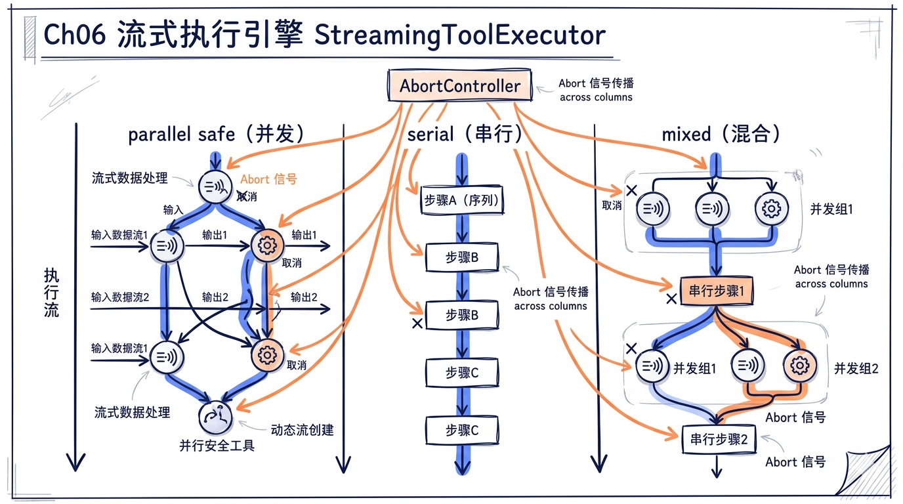
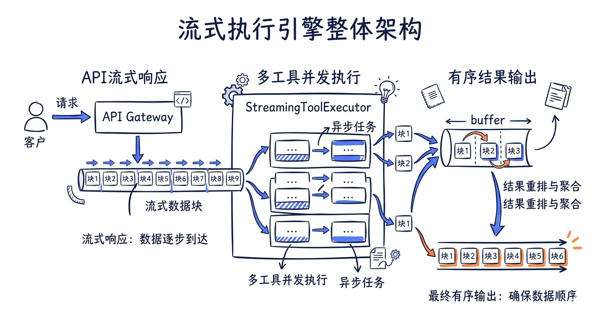
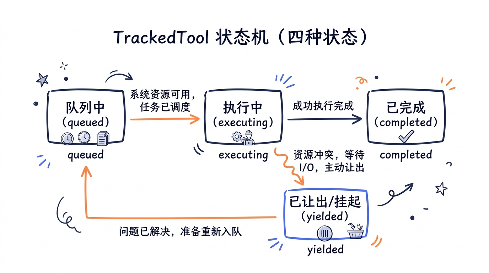
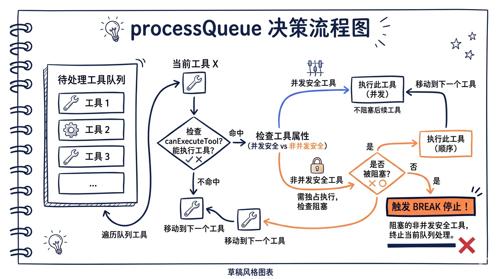

---
layout: default
title: "06 流式执行引擎"
nav_order: 22
parent: "模块二：工具系统"
---


# 第六章：流式执行引擎——StreamingToolExecutor



> **源码版本**：Claude Code v2.1.88
> **核心文件**：`src/services/tools/StreamingToolExecutor.ts`、`src/services/tools/toolOrchestration.ts`、`src/services/tools/toolExecution.ts`、`src/services/tools/toolHooks.ts`

上一章我们讨论了 Agent Loop 的宏观控制流——模型调用、工具调度、多轮循环。但我们刻意跳过了一个关键问题：当模型在一次响应中同时返回 5 个工具调用时，这些工具是怎样被执行的？是排队串行、全部并行、还是某种更精巧的混合策略？

本章将深入 Claude Code 的**流式执行引擎**，回答这个问题。这套引擎的核心挑战是：在工具尚未全部到达（流式传输中）的同时，尽可能早地开始执行安全的工具，同时严格保证有副作用的工具按序执行、结果按序输出。



---

## 一、为什么需要流式执行引擎

### 1.1 问题的来源

Claude API 使用 Server-Sent Events (SSE) 流式返回响应。一条助手消息可能包含多个 `tool_use` block，但这些 block 不是一次性到达的——它们是逐个构建、逐个完成的。

传统做法是等所有 tool_use block 都到齐之后，再统一调度执行。这就是 `toolOrchestration.ts` 中 `runTools()` 函数的工作方式——它是"非流式"时代的遗产。但这种做法有一个显而易见的性能问题：

```
时间轴（非流式执行）：
├── API 流式响应 ─────────────────────┤
│    tool_use A 到达    tool_use B 到达    tool_use C 到达
│                                         │
│              等待所有 block 到齐          │
│                                         ├── 执行 A ──┤
│                                         ├── 执行 B ──┤
│                                         ├── 执行 C ──┤
```

如果 A 是一个 `Read` 操作，在 B 还没从 API 流里出来时就已经可以安全执行了，为什么要等？

```
时间轴（流式执行）：
├── API 流式响应 ─────────────────────┤
│    tool_use A 到达 → 立即执行 A ──────┤
│              tool_use B 到达 → 立即执行 B ──────┤
│                        tool_use C 到达 → 执行 C ──┤
```

`StreamingToolExecutor` 正是为了实现这种"边收边执行"的优化而设计的。

### 1.2 双引擎并存

Claude Code 内部实际上维护着两套工具执行引擎：

| 引擎 | 文件 | 使用场景 |
|------|------|---------|
| `StreamingToolExecutor` | `StreamingToolExecutor.ts` | 流式工具执行（Feature Flag 开启时） |
| `runTools()` | `toolOrchestration.ts` | 非流式工具执行（Feature Flag 关闭时的回退） |

在 `query.ts` 中，是否使用流式执行由 Feature Gate 控制：

```typescript
// src/query.ts (第561-568行)
const useStreamingToolExecution = config.gates.streamingToolExecution
let streamingToolExecutor = useStreamingToolExecution
  ? new StreamingToolExecutor(
      toolUseContext.options.tools,
      canUseTool,
      toolUseContext,
    )
  : null
```

当 `streamingToolExecution` 为 `true` 时，每当一个 `tool_use` block 从流式响应中完整到达，就立即通过 `addTool()` 提交给执行器；当为 `false` 时，等所有 block 到齐后调用 `runTools()` 批量处理。

本章重点剖析 `StreamingToolExecutor`，同时在必要处对比 `runTools()` 以揭示设计演进。

---

## 二、StreamingToolExecutor 核心设计

### 2.1 类结构概览

`StreamingToolExecutor` 是一个有状态的类，维护了一个工具执行队列，内部跟踪每个工具的完整生命周期：

```typescript
// src/services/tools/StreamingToolExecutor.ts (第14-32行)
type ToolStatus = 'queued' | 'executing' | 'completed' | 'yielded'

type TrackedTool = {
  id: string
  block: ToolUseBlock
  assistantMessage: AssistantMessage
  status: ToolStatus
  isConcurrencySafe: boolean
  promise?: Promise<void>
  results?: Message[]
  // Progress messages are stored separately and yielded immediately
  pendingProgress: Message[]
  contextModifiers?: Array<(context: ToolUseContext) => ToolUseContext>
}
```

整个类的核心成员变量：

```typescript
// src/services/tools/StreamingToolExecutor.ts (第40-51行)
export class StreamingToolExecutor {
  private tools: TrackedTool[] = []
  private toolUseContext: ToolUseContext
  private hasErrored = false
  private erroredToolDescription = ''
  // Child of toolUseContext.abortController. Fires when a Bash tool errors
  // so sibling subprocesses die immediately instead of running to completion.
  // Aborting this does NOT abort the parent — query.ts won't end the turn.
  private siblingAbortController: AbortController
  private discarded = false
  // Signal to wake up getRemainingResults when progress is available
  private progressAvailableResolve?: () => void
```

几个关键设计决策值得注意：

1. **`tools` 是有序数组**——不是 Map，不是 Set，因为需要按接收顺序产出结果
2. **`siblingAbortController` 独立于父 AbortController**——Bash 错误只取消兄弟工具，不终止整个 query 循环
3. **`discarded` 标志**——当流式 fallback 发生时，整个执行器的所有待处理结果被丢弃
4. **`progressAvailableResolve`**——一个 Promise resolve 回调，用于唤醒等待中的结果消费者



### 2.2 状态机：四阶段生命周期

每个工具调用在执行器中经历四个状态：

```
queued ──→ executing ──→ completed ──→ yielded
  │              │              │
  │              │              └── 结果已产出给调用方
  │              └── 正在执行（异步）
  └── 已入队，等待并发条件满足
```

**queued**：工具刚通过 `addTool()` 提交，尚未开始执行。原因可能是：
- 前面有正在执行的非并发安全工具
- 自身是非并发安全工具，而前面有工具正在执行

**executing**：并发条件满足，`executeTool()` 已被调用，异步操作正在进行。

**completed**：工具执行完毕，结果已收集到 `results` 数组中，但尚未产出给调用方。

**yielded**：结果已通过 `getCompletedResults()` 或 `getRemainingResults()` 产出给调用方。这是终态。

### 2.3 工具提交：addTool()

当 API 流式响应中一个 `tool_use` block 完整到达时，`query.ts` 会立即调用 `addTool()`：

```typescript
// src/query.ts (第840-844行)
if (streamingToolExecutor && !toolUseContext.abortController.signal.aborted) {
  for (const toolBlock of msgToolUseBlocks) {
    streamingToolExecutor.addTool(toolBlock, message)
  }
}
```

`addTool()` 的实现做了三件事：

```typescript
// src/services/tools/StreamingToolExecutor.ts (第76-124行)
addTool(block: ToolUseBlock, assistantMessage: AssistantMessage): void {
  const toolDefinition = findToolByName(this.toolDefinitions, block.name)
  if (!toolDefinition) {
    // 未知工具：直接标记为 completed，填充错误消息
    this.tools.push({
      id: block.id,
      block,
      assistantMessage,
      status: 'completed',      // 注意：跳过 queued/executing
      isConcurrencySafe: true,
      pendingProgress: [],
      results: [
        createUserMessage({
          content: [{
            type: 'tool_result',
            content: `<tool_use_error>Error: No such tool available: ${block.name}</tool_use_error>`,
            is_error: true,
            tool_use_id: block.id,
          }],
          toolUseResult: `Error: No such tool available: ${block.name}`,
          sourceToolAssistantUUID: assistantMessage.uuid,
        }),
      ],
    })
    return
  }

  // 解析输入，判断是否并发安全
  const parsedInput = toolDefinition.inputSchema.safeParse(block.input)
  const isConcurrencySafe = parsedInput?.success
    ? (() => {
        try {
          return Boolean(toolDefinition.isConcurrencySafe(parsedInput.data))
        } catch {
          return false   // 解析失败则保守处理
        }
      })()
    : false

  this.tools.push({
    id: block.id,
    block,
    assistantMessage,
    status: 'queued',
    isConcurrencySafe,
    pendingProgress: [],
  })

  void this.processQueue()  // 立即尝试调度
}
```

这里有几个精妙之处：

1. **未知工具快速失败**——直接跳到 `completed` 状态并填充错误消息，不浪费任何调度时间
2. **并发安全性在入队时就确定**——通过调用工具的 `isConcurrencySafe()` 方法
3. **`isConcurrencySafe` 的异常处理**——如果方法抛出异常（比如 `shell-quote` 解析失败），保守地返回 `false`
4. **`void this.processQueue()`**——提交后立即尝试调度，不等待

---

## 三、工具状态跟踪

### 3.1 ToolStatus 的语义

四个状态各有精确的语义，不仅仅是"进度指示"，更是**并发调度的决策依据**：

```typescript
type ToolStatus = 'queued' | 'executing' | 'completed' | 'yielded'
```

| 状态 | 对并发调度的影响 | 对结果产出的影响 |
|------|-----------------|-----------------|
| `queued` | 还需要检查并发条件 | 不可产出 |
| `executing` | 影响后续工具能否开始 | 不可产出（progress 除外） |
| `completed` | 不再阻塞任何工具 | 可以产出 |
| `yielded` | 无影响 | 已产出，跳过 |

这些查询方法提供了状态快照：

```typescript
// src/services/tools/StreamingToolExecutor.ts (第495-511行)
private hasCompletedResults(): boolean {
  return this.tools.some(t => t.status === 'completed')
}

private hasExecutingTools(): boolean {
  return this.tools.some(t => t.status === 'executing')
}

private hasUnfinishedTools(): boolean {
  return this.tools.some(t => t.status !== 'yielded')
}
```

### 3.2 进度消息的特殊通道

在 `executing` 状态下，工具通常不能产出结果——这是有序产出的要求。但**进度消息（progress）是例外**。Claude Code 将进度消息存储在 `pendingProgress` 数组中，并通过独立机制立即传递给调用方：

```typescript
// src/services/tools/StreamingToolExecutor.ts (第366-375行)
// 在 executeTool 的 collectResults 内部
if (update.message) {
  // Progress messages go to pendingProgress for immediate yielding
  if (update.message.type === 'progress') {
    tool.pendingProgress.push(update.message)
    // Signal that progress is available
    if (this.progressAvailableResolve) {
      this.progressAvailableResolve()
      this.progressAvailableResolve = undefined
    }
  } else {
    messages.push(update.message)
  }
}
```

这里用了一个巧妙的信号机制：`progressAvailableResolve` 是一个 Promise 的 resolve 回调。当 `getRemainingResults()` 正在等待工具完成时，如果某个工具产生了进度消息，这个回调会被触发，唤醒等待者立即消费进度信息。

在 `getCompletedResults()` 中，进度消息的产出优先级最高：

```typescript
// src/services/tools/StreamingToolExecutor.ts (第412-440行)
*getCompletedResults(): Generator<MessageUpdate, void> {
  if (this.discarded) { return }

  for (const tool of this.tools) {
    // Always yield pending progress messages immediately,
    // regardless of tool status
    while (tool.pendingProgress.length > 0) {
      const progressMessage = tool.pendingProgress.shift()!
      yield { message: progressMessage, newContext: this.toolUseContext }
    }

    if (tool.status === 'yielded') { continue }

    if (tool.status === 'completed' && tool.results) {
      tool.status = 'yielded'
      for (const message of tool.results) {
        yield { message, newContext: this.toolUseContext }
      }
      markToolUseAsComplete(this.toolUseContext, tool.id)
    } else if (tool.status === 'executing' && !tool.isConcurrencySafe) {
      break  // 非并发安全工具执行中：停止遍历，保证顺序
    }
  }
}
```

注意最后的 `break`——当遇到一个正在执行的非并发安全工具时，即使后续工具已经完成，也不能产出它们的结果。这保证了有副作用的工具的结果严格有序。

### 3.3 in-progress 跟踪

执行器还通过 `toolUseContext` 暴露了一个"正在执行中"的工具 ID 集合，供 UI 使用：

```typescript
// src/services/tools/StreamingToolExecutor.ts (第266-269行)
private async executeTool(tool: TrackedTool): Promise<void> {
  tool.status = 'executing'
  this.toolUseContext.setInProgressToolUseIDs(prev =>
    new Set(prev).add(tool.id),
  )
  this.updateInterruptibleState()
  // ...
}

// src/services/tools/StreamingToolExecutor.ts (第521-530行)
function markToolUseAsComplete(
  toolUseContext: ToolUseContext,
  toolUseID: string,
) {
  toolUseContext.setInProgressToolUseIDs(prev => {
    const next = new Set(prev)
    next.delete(toolUseID)
    return next
  })
}
```

这个集合让 UI 能实时显示"哪些工具正在运行"的状态指示器。

---

## 四、toolOrchestration.ts：批次分区与并发控制

### 4.1 批次分区算法

`toolOrchestration.ts` 提供的 `runTools()` 是非流式执行路径，但它的分区算法同样重要——`StreamingToolExecutor` 在概念上使用了类似的并发判断逻辑。

`partitionToolCalls()` 将工具调用列表分割为**交替的并发批次和串行批次**：

```typescript
// src/services/tools/toolOrchestration.ts (第84-116行)
type Batch = { isConcurrencySafe: boolean; blocks: ToolUseBlock[] }

function partitionToolCalls(
  toolUseMessages: ToolUseBlock[],
  toolUseContext: ToolUseContext,
): Batch[] {
  return toolUseMessages.reduce((acc: Batch[], toolUse) => {
    const tool = findToolByName(toolUseContext.options.tools, toolUse.name)
    const parsedInput = tool?.inputSchema.safeParse(toolUse.input)
    const isConcurrencySafe = parsedInput?.success
      ? (() => {
          try {
            return Boolean(tool?.isConcurrencySafe(parsedInput.data))
          } catch {
            return false
          }
        })()
      : false
    if (isConcurrencySafe && acc[acc.length - 1]?.isConcurrencySafe) {
      // 连续的并发安全工具合并到同一批次
      acc[acc.length - 1]!.blocks.push(toolUse)
    } else {
      // 新建批次
      acc.push({ isConcurrencySafe, blocks: [toolUse] })
    }
    return acc
  }, [])
}
```

![分区算法示例——[Read, Read, Grep, Bash, Read, Read] 被分为三个批次：[Read,Read,Grep](并发)、[Bash](串行)、[Read,Read](并发)](images/ch06/03-img03.png)

假设模型返回了以下 6 个工具调用：

```
[Read("a.ts"), Read("b.ts"), Grep("pattern"), Bash("npm test"), Read("c.ts"), Read("d.ts")]
```

分区结果为：

| 批次 | 类型 | 工具 |
|------|------|------|
| Batch 1 | 并发 | `Read("a.ts")`, `Read("b.ts")`, `Grep("pattern")` |
| Batch 2 | 串行 | `Bash("npm test")` |
| Batch 3 | 并发 | `Read("c.ts")`, `Read("d.ts")` |

### 4.2 并发执行路径

并发批次通过 `runToolsConcurrently()` 执行，底层使用 `all()` 工具函数：

```typescript
// src/services/tools/toolOrchestration.ts (第152-177行)
async function* runToolsConcurrently(
  toolUseMessages: ToolUseBlock[],
  assistantMessages: AssistantMessage[],
  canUseTool: CanUseToolFn,
  toolUseContext: ToolUseContext,
): AsyncGenerator<MessageUpdateLazy, void> {
  yield* all(
    toolUseMessages.map(async function* (toolUse) {
      toolUseContext.setInProgressToolUseIDs(prev =>
        new Set(prev).add(toolUse.id),
      )
      yield* runToolUse(
        toolUse,
        assistantMessages.find(_ =>
          _.message.content.some(
            _ => _.type === 'tool_use' && _.id === toolUse.id,
          ),
        )!,
        canUseTool,
        toolUseContext,
      )
      markToolUseAsComplete(toolUseContext, toolUse.id)
    }),
    getMaxToolUseConcurrency(),
  )
}
```

### 4.3 最大并发度

并发上限通过环境变量 `CLAUDE_CODE_MAX_TOOL_USE_CONCURRENCY` 控制，默认值为 10：

```typescript
// src/services/tools/toolOrchestration.ts (第8-12行)
function getMaxToolUseConcurrency(): number {
  return (
    parseInt(process.env.CLAUDE_CODE_MAX_TOOL_USE_CONCURRENCY || '', 10) || 10
  )
}
```

`all()` 函数是一个通用的并发 AsyncGenerator 运行器，实现了经典的"滑动窗口"并发控制模式：

```typescript
// src/utils/generators.ts (第32-72行)
export async function* all<A>(
  generators: AsyncGenerator<A, void>[],
  concurrencyCap = Infinity,
): AsyncGenerator<A, void> {
  const next = (generator: AsyncGenerator<A, void>) => {
    const promise: Promise<QueuedGenerator<A>> = generator
      .next()
      .then(({ done, value }) => ({
        done, value, generator, promise,
      }))
    return promise
  }
  const waiting = [...generators]
  const promises = new Set<Promise<QueuedGenerator<A>>>()

  // Start initial batch up to concurrency cap
  while (promises.size < concurrencyCap && waiting.length > 0) {
    const gen = waiting.shift()!
    promises.add(next(gen))
  }

  while (promises.size > 0) {
    const { done, value, generator, promise } = await Promise.race(promises)
    promises.delete(promise)

    if (!done) {
      promises.add(next(generator))
      if (value !== undefined) {
        yield value
      }
    } else if (waiting.length > 0) {
      // Start a new generator when one finishes
      const nextGen = waiting.shift()!
      promises.add(next(nextGen))
    }
  }
}
```

工作原理：初始启动 `concurrencyCap` 个 generator，然后用 `Promise.race` 等待任意一个产出值。当某个 generator 完成时，从 `waiting` 队列中取出下一个补上。这样就实现了恒定的并发度——始终有最多 N 个 generator 在同时运行。

### 4.4 串行执行路径

串行批次通过 `runToolsSerially()` 执行，逻辑简单得多——逐个执行，每个工具的 context modifier 立即应用：

```typescript
// src/services/tools/toolOrchestration.ts (第118-150行)
async function* runToolsSerially(
  toolUseMessages: ToolUseBlock[],
  assistantMessages: AssistantMessage[],
  canUseTool: CanUseToolFn,
  toolUseContext: ToolUseContext,
): AsyncGenerator<MessageUpdate, void> {
  let currentContext = toolUseContext

  for (const toolUse of toolUseMessages) {
    toolUseContext.setInProgressToolUseIDs(prev =>
      new Set(prev).add(toolUse.id),
    )
    for await (const update of runToolUse(
      toolUse,
      assistantMessages.find(_ =>
        _.message.content.some(
          _ => _.type === 'tool_use' && _.id === toolUse.id,
        ),
      )!,
      canUseTool,
      currentContext,
    )) {
      if (update.contextModifier) {
        currentContext = update.contextModifier.modifyContext(currentContext)
      }
      yield {
        message: update.message,
        newContext: currentContext,
      }
    }
    markToolUseAsComplete(toolUseContext, toolUse.id)
  }
}
```

注意串行路径的一个关键区别：`contextModifier` 在每次工具执行后立即应用到 `currentContext`，后续工具会看到更新后的上下文。而在并发路径中，所有 context modifier 被排队到批次结束后统一应用。

### 4.5 StreamingToolExecutor 的并发判定

`StreamingToolExecutor` 使用更动态的并发控制逻辑——不是预先分区，而是在每次 `processQueue()` 时实时判断：

```typescript
// src/services/tools/StreamingToolExecutor.ts (第129-135行)
private canExecuteTool(isConcurrencySafe: boolean): boolean {
  const executingTools = this.tools.filter(t => t.status === 'executing')
  return (
    executingTools.length === 0 ||
    (isConcurrencySafe && executingTools.every(t => t.isConcurrencySafe))
  )
}
```

这个判断简洁地编码了两条规则：

1. **如果没有工具在执行**——任何工具都可以开始
2. **如果有工具在执行**——当且仅当"新工具是并发安全的"且"所有正在执行的工具也都是并发安全的"时，新工具才能并行启动

换言之：**非并发安全工具享有独占执行权**。一个 `Bash` 在执行时，不会有第二个工具同时启动。

```typescript
// src/services/tools/StreamingToolExecutor.ts (第140-151行)
private async processQueue(): Promise<void> {
  for (const tool of this.tools) {
    if (tool.status !== 'queued') continue

    if (this.canExecuteTool(tool.isConcurrencySafe)) {
      await this.executeTool(tool)
    } else {
      // Can't execute this tool yet, and since we need to maintain
      // order for non-concurrent tools, stop here
      if (!tool.isConcurrencySafe) break
    }
  }
}
```

`processQueue()` 遍历工具列表，遇到可以执行的就启动。但当一个非并发安全工具被阻塞时，遍历直接 `break`——因为非并发安全工具必须按顺序执行，跳过它去执行后面的工具会破坏语义正确性。



---

## 五、并发安全性分类

### 5.1 isConcurrencySafe() 的设计哲学

工具是否可以并发执行，取决于其 `isConcurrencySafe()` 方法的返回值。这个方法的设计遵循一个核心原则：**默认不安全**。

```typescript
// src/Tool.ts (第757-759行)
const TOOL_DEFAULTS = {
  // ...
  isConcurrencySafe: (_input?: unknown) => false,
  // ...
}
```

任何没有显式声明 `isConcurrencySafe` 的工具，默认被视为不安全。这是一个 **fail-closed** 的安全设计——忘记标注的代价是性能损失（串行执行），而不是正确性错误（并发冲突）。

### 5.2 安全 vs 不安全工具

通过全局搜索 `isConcurrencySafe`，可以将所有工具分为两类：

**并发安全（`return true`）**——纯读取/查询类工具：
- 文件系统只读：`FileRead`、`Grep`、`Glob`
- 网络只读：`WebFetch`、`WebSearch`
- 元数据查询：`ToolSearch`、`LSP`、`Brief`、`Config`
- 任务管理：`TaskCreate`、`TaskGet`、`TaskList`、`TaskUpdate`
- MCP 只读：`ReadMcpResource`、`ListMcpResources`
- 其他：`CronList`、`SyntheticOutput`、`RemoteTrigger`

**非并发安全（`return false` 或默认）**——有副作用的工具：
- 文件修改：`FileEdit`、`FileWrite`、`NotebookEdit`
- Shell 执行：`Bash`、`PowerShell`
- 模式切换：`EnterPlanMode`、`ExitPlanMode`
- 认证：`McpAuth`
- 所有 MCP 工具（默认）

注意 `Bash` 工具的不安全性尤为重要。虽然 `cat`、`ls` 等命令是只读的，但 `isConcurrencySafe` 在**工具级别**判断，而非命令级别。Bash 可以执行任意 shell 代码，必须保守处理。MCP 工具同理——Claude Code 无法知道外部服务器的工具是否有副作用，所以默认不安全。

---

## 六、AbortController 传播与 Sibling Abort

### 6.1 三层 AbortController 结构

`StreamingToolExecutor` 的取消机制涉及三层 `AbortController`，形成了一个精心设计的层级：

```
toolUseContext.abortController    ← 最顶层，用户中断或 query 结束
        │
        └── siblingAbortController   ← 中间层，Bash 错误取消兄弟
                │
                └── toolAbortController  ← 最底层，每个工具独立的取消控制器
```

每一层的职责：

| 层级 | 创建时机 | 取消含义 | 向上冒泡？ |
|------|---------|---------|-----------|
| `toolUseContext.abortController` | query 开始时 | 用户按 ESC 或 query 结束 | N/A（顶层） |
| `siblingAbortController` | `StreamingToolExecutor` 构造时 | Bash 工具出错 | 否 |
| `toolAbortController` | 每个工具开始执行时 | 权限拒绝、工具自身取消 | 有条件地是 |

### 6.2 createChildAbortController 的实现

所有这些层级关系由 `createChildAbortController()` 建立：

```typescript
// src/utils/abortController.ts (第68-99行)
export function createChildAbortController(
  parent: AbortController,
  maxListeners?: number,
): AbortController {
  const child = createAbortController(maxListeners)

  // Fast path: parent already aborted, no listener setup needed
  if (parent.signal.aborted) {
    child.abort(parent.signal.reason)
    return child
  }

  // WeakRef prevents the parent from keeping an abandoned child alive
  const weakChild = new WeakRef(child)
  const weakParent = new WeakRef(parent)
  const handler = propagateAbort.bind(weakParent, weakChild)

  parent.signal.addEventListener('abort', handler, { once: true })

  // Auto-cleanup: remove parent listener when child is aborted
  child.signal.addEventListener(
    'abort',
    removeAbortHandler.bind(weakParent, new WeakRef(handler)),
    { once: true },
  )

  return child
}
```

关键设计点：

1. **WeakRef 防止内存泄漏**——父 controller 不会阻止被丢弃的子 controller 被垃圾回收
2. **单向传播**——父取消会传播到子，但子取消不影响父
3. **自动清理**——子被取消时，自动从父的监听器列表中移除自己

### 6.3 Sibling Abort 机制

当一个 Bash 工具执行出错时，`StreamingToolExecutor` 会触发 sibling abort——取消所有正在执行的兄弟工具：

```typescript
// src/services/tools/StreamingToolExecutor.ts (第347-364行)
const isErrorResult =
  update.message.type === 'user' &&
  Array.isArray(update.message.message.content) &&
  update.message.message.content.some(
    _ => _.type === 'tool_result' && _.is_error === true,
  )

if (isErrorResult) {
  thisToolErrored = true
  // Only Bash errors cancel siblings. Bash commands often have implicit
  // dependency chains (e.g. mkdir fails → subsequent commands pointless).
  // Read/WebFetch/etc are independent — one failure shouldn't nuke the rest.
  if (tool.block.name === BASH_TOOL_NAME) {
    this.hasErrored = true
    this.erroredToolDescription = this.getToolDescription(tool)
    this.siblingAbortController.abort('sibling_error')
  }
}
```

为什么只有 Bash 错误触发 sibling abort？源码注释解释得很清楚：

- **Bash 命令经常有隐式依赖链**——比如 `mkdir -p build` 失败了，后续的 `cp dist/* build/` 就毫无意义
- **Read/WebFetch 等工具是独立的**——一个文件读取失败不应该阻止其他文件的读取

### 6.4 toolAbortController 的有条件冒泡

每个工具的独立 `toolAbortController` 的 abort 事件有**有条件地向上冒泡**的行为：

```typescript
// src/services/tools/StreamingToolExecutor.ts (第301-318行)
const toolAbortController = createChildAbortController(
  this.siblingAbortController,
)
toolAbortController.signal.addEventListener(
  'abort',
  () => {
    if (
      toolAbortController.signal.reason !== 'sibling_error' &&
      !this.toolUseContext.abortController.signal.aborted &&
      !this.discarded
    ) {
      this.toolUseContext.abortController.abort(
        toolAbortController.signal.reason,
      )
    }
  },
  { once: true },
)
```

这段代码的意思是：

1. 如果取消原因是 `sibling_error`（兄弟工具导致的），**不冒泡**——只取消兄弟，不终止整个 query
2. 如果取消原因是其他（比如权限拒绝），**冒泡到顶层**——终止整个 query 循环
3. 如果顶层已经取消或者执行器已经 discarded，**不冒泡**——避免重复取消

源码注释中提到了一个具体的 regression（#21056）：如果不做这个冒泡，`ExitPlanMode` 的权限拒绝会导致 `REJECT_MESSAGE` 被发送给模型，而不是正确地中止 query。

### 6.5 Abort Reason 判断

执行器通过 `getAbortReason()` 方法统一判断工具应该被取消的原因：

```typescript
// src/services/tools/StreamingToolExecutor.ts (第210-231行)
private getAbortReason(
  tool: TrackedTool,
): 'sibling_error' | 'user_interrupted' | 'streaming_fallback' | null {
  if (this.discarded) {
    return 'streaming_fallback'
  }
  if (this.hasErrored) {
    return 'sibling_error'
  }
  if (this.toolUseContext.abortController.signal.aborted) {
    if (this.toolUseContext.abortController.signal.reason === 'interrupt') {
      return this.getToolInterruptBehavior(tool) === 'cancel'
        ? 'user_interrupted'
        : null
    }
    return 'user_interrupted'
  }
  return null
}
```

这里有三种取消原因，优先级从高到低：

1. **`streaming_fallback`**——流式 fallback 发生，所有结果作废
2. **`sibling_error`**——兄弟 Bash 工具出错
3. **`user_interrupted`**——用户按 ESC 中断

注意 `interrupt` reason 的特殊处理：当用户在工具执行期间提交了新消息（submit-interrupt），只有 `interruptBehavior` 为 `'cancel'` 的工具才会被取消。`'block'` 行为的工具会继续执行，新消息等待。

### 6.6 合成错误消息

被取消的工具需要一个合成的 `tool_result` 消息，以保持 API 协议的正确性（每个 `tool_use` 必须有对应的 `tool_result`）：

```typescript
// src/services/tools/StreamingToolExecutor.ts (第153-205行)
private createSyntheticErrorMessage(
  toolUseId: string,
  reason: 'sibling_error' | 'user_interrupted' | 'streaming_fallback',
  assistantMessage: AssistantMessage,
): Message {
  if (reason === 'user_interrupted') {
    return createUserMessage({
      content: [{
        type: 'tool_result',
        content: withMemoryCorrectionHint(REJECT_MESSAGE),
        is_error: true,
        tool_use_id: toolUseId,
      }],
      toolUseResult: 'User rejected tool use',
      sourceToolAssistantUUID: assistantMessage.uuid,
    })
  }
  if (reason === 'streaming_fallback') {
    return createUserMessage({
      content: [{
        type: 'tool_result',
        content: '<tool_use_error>Error: Streaming fallback - tool execution discarded</tool_use_error>',
        is_error: true,
        tool_use_id: toolUseId,
      }],
      toolUseResult: 'Streaming fallback - tool execution discarded',
      sourceToolAssistantUUID: assistantMessage.uuid,
    })
  }
  // sibling_error
  const desc = this.erroredToolDescription
  const msg = desc
    ? `Cancelled: parallel tool call ${desc} errored`
    : 'Cancelled: parallel tool call errored'
  return createUserMessage({
    content: [{
      type: 'tool_result',
      content: `<tool_use_error>${msg}</tool_use_error>`,
      is_error: true,
      tool_use_id: toolUseId,
    }],
    toolUseResult: msg,
    sourceToolAssistantUUID: assistantMessage.uuid,
  })
}
```

每种取消原因产生不同的错误消息，让模型能理解发生了什么。特别地，`user_interrupted` 使用了 `REJECT_MESSAGE` 配合 `withMemoryCorrectionHint()`，这样 UI 会显示"用户拒绝了编辑"而不是"文件编辑出错"。

---

## 七、错误隔离

### 7.1 错误不扩散原则

`StreamingToolExecutor` 的一个重要设计目标是**错误隔离**——一个工具的错误不应该无差别地影响所有其他工具。具体规则是：

| 错误来源 | 影响范围 | 原因 |
|---------|---------|------|
| Bash 工具出错 | 取消所有兄弟工具 | Bash 命令有隐式依赖链 |
| Read/Grep 等工具出错 | 仅影响自身 | 独立的只读操作 |
| WebFetch 出错 | 仅影响自身 | 独立的网络请求 |
| 权限拒绝 | 终止整个 query | 安全关键事件 |

### 7.2 自身错误不重复

在 `executeTool()` 中，有一个精妙的防重复机制：

```typescript
// src/services/tools/StreamingToolExecutor.ts (第326-345行)
// Track if this specific tool has produced an error result.
// This prevents the tool from receiving a duplicate "sibling error"
// message when it is the one that caused the error.
let thisToolErrored = false

for await (const update of generator) {
  // Check if we were aborted by a sibling tool error or user interruption.
  // Only add the synthetic error if THIS tool didn't produce the error.
  const abortReason = this.getAbortReason(tool)
  if (abortReason && !thisToolErrored) {
    messages.push(
      this.createSyntheticErrorMessage(
        tool.id,
        abortReason,
        tool.assistantMessage,
      ),
    )
    break
  }
  // ...
}
```

考虑这个场景：Bash A 出错了，触发了 sibling abort。在处理 Bash A 自身的下一个 `update` 时，`getAbortReason()` 会返回 `'sibling_error'`（因为 `this.hasErrored` 为 `true`）。但 `thisToolErrored` 也为 `true`，所以不会为 A 自身创建重复的合成错误消息——A 已经有了自己的真实错误消息。

### 7.3 discard 机制

当流式 fallback 发生时（比如模型切换了 API 端点），之前的所有工具执行结果都需要丢弃：

```typescript
// src/services/tools/StreamingToolExecutor.ts (第69-71行)
discard(): void {
  this.discarded = true
}
```

这个看似简单的标志位影响了整个执行器的行为：

1. `getCompletedResults()` 在 `discarded` 为 `true` 时直接返回，不产出任何结果
2. `getRemainingResults()` 同样直接返回
3. `getAbortReason()` 返回 `'streaming_fallback'`，正在执行的工具会收到合成取消消息

在 `query.ts` 中，fallback 触发时会丢弃旧执行器并创建新的：

```typescript
// src/query.ts (第733-740行)
if (streamingToolExecutor) {
  streamingToolExecutor.discard()
  streamingToolExecutor = new StreamingToolExecutor(
    toolUseContext.options.tools,
    canUseTool,
    toolUseContext,
  )
}
```

---

## 八、toolExecution.ts：单工具执行管线

### 8.1 runToolUse() 入口

无论是 `StreamingToolExecutor` 还是 `runTools()`，最终都通过 `runToolUse()` 函数执行单个工具：

```typescript
// src/services/tools/toolExecution.ts (第337-342行)
export async function* runToolUse(
  toolUse: ToolUseBlock,
  assistantMessage: AssistantMessage,
  canUseTool: CanUseToolFn,
  toolUseContext: ToolUseContext,
): AsyncGenerator<MessageUpdateLazy, void> {
```

这是一个 AsyncGenerator 函数，在工具执行过程中会 yield 多种消息类型：进度更新、附件消息、最终的 `tool_result`。

### 8.2 工具查找与兼容性

`runToolUse()` 首先尝试在当前可用工具列表中查找，如果找不到，还会检查已废弃的别名：

```typescript
// src/services/tools/toolExecution.ts (第343-356行)
const toolName = toolUse.name
let tool = findToolByName(toolUseContext.options.tools, toolName)

// If not found, check if it's a deprecated tool being called by alias
if (!tool) {
  const fallbackTool = findToolByName(getAllBaseTools(), toolName)
  if (fallbackTool && fallbackTool.aliases?.includes(toolName)) {
    tool = fallbackTool
  }
}
```

这保证了旧的 transcript 中使用废弃工具名（比如 `KillShell`）的记录，仍然能正确映射到新工具（`TaskStop`）。

### 8.3 执行管线概览

`checkPermissionsAndCallTool()` 是完整的单工具执行管线，大约 1100 行代码，依次完成：

```
输入验证 → 输入增强（backfill） → PreToolUse hooks → 权限检查
→ 工具执行 → PostToolUse hooks → 结果格式化 → 错误处理
```

让我们分解每个阶段：

**1. 输入验证**（Zod schema）

```typescript
// src/services/tools/toolExecution.ts (第615-616行)
const parsedInput = tool.inputSchema.safeParse(input)
if (!parsedInput.success) {
  // 返回 InputValidationError
}
```

如果工具是一个"延迟加载"（deferred）工具且 schema 未被发送到 API，错误消息会包含一个提示，引导模型先调用 `ToolSearch` 加载完整 schema：

```typescript
// src/services/tools/toolExecution.ts (第578-597行)
export function buildSchemaNotSentHint(
  tool: Tool,
  messages: Message[],
  tools: readonly { name: string }[],
): string | null {
  if (!isToolSearchEnabledOptimistic()) return null
  if (!isToolSearchToolAvailable(tools)) return null
  if (!isDeferredTool(tool)) return null
  const discovered = extractDiscoveredToolNames(messages)
  if (discovered.has(tool.name)) return null
  return (
    `\n\nThis tool's schema was not sent to the API...` +
    `Load the tool first: call ${TOOL_SEARCH_TOOL_NAME}...`
  )
}
```

**2. 输入增强**——某些工具有 `backfillObservableInput()` 方法，用于添加派生字段（如展开 `~` 为完整路径）。这些修改只对 hooks 和权限系统可见，不影响 `tool.call()` 参数。

**3. 权限检查**——通过 `resolveHookPermissionDecision()` 综合考虑 hook 的权限决定和正常的权限流程（详见本章第九节 toolHooks）。

**4. 工具执行**——权限通过后调用 `tool.call(callInput, context, canUseTool, assistantMessage, progressCallback)`。

### 8.4 Stream 适配器

`streamedCheckPermissionsAndCallTool()` 使用 `Stream` 类将基于回调的进度报告转换为 AsyncIterable。`Stream`（`src/utils/stream.ts`）是一个单次可迭代的异步队列，核心设计是推-拉模式转换：

```typescript
// src/utils/stream.ts（简化展示核心逻辑）
export class Stream<T> implements AsyncIterator<T> {
  private readonly queue: T[] = []
  private readResolve?: (value: IteratorResult<T>) => void

  enqueue(value: T): void {
    if (this.readResolve) {
      // 消费者在等——直接交付，零缓冲
      const resolve = this.readResolve
      this.readResolve = undefined
      resolve({ done: false, value })
    } else {
      // 无消费者——缓冲
      this.queue.push(value)
    }
  }

  next(): Promise<IteratorResult<T, unknown>> {
    if (this.queue.length > 0) {
      return Promise.resolve({ done: false, value: this.queue.shift()! })
    }
    // 缓冲区空——挂起，等待 enqueue 唤醒
    return new Promise<IteratorResult<T>>((resolve) => {
      this.readResolve = resolve
    })
  }
}
```

在 `streamedCheckPermissionsAndCallTool()` 中，`checkPermissionsAndCallTool()` 的进度回调 `enqueue` 到 Stream 中，`then` 将最终结果也 `enqueue` 进去，`finally` 调用 `stream.done()`。整个函数返回 Stream 作为 AsyncIterable，让 `StreamingToolExecutor` 通过 `for await` 消费。

这个模式在 Claude Code 中很重要——工具执行的进度事件通过回调产生，但上层需要以 AsyncGenerator 消费。`Stream` 充当了两种异步模式之间的桥梁。

---

## 九、toolHooks.ts：Pre/Post Hook 执行

### 9.1 Hook 系统概述

Claude Code 的 Hook 系统允许用户在工具执行的不同阶段注入自定义逻辑。`toolHooks.ts` 负责管理三种 hook 的执行：

| Hook 类型 | 触发时机 | 功能 |
|----------|---------|------|
| `PreToolUse` | 工具执行前 | 权限控制、输入修改、阻止执行 |
| `PostToolUse` | 工具成功执行后 | 输出修改（MCP）、附加上下文、阻止继续 |
| `PostToolUseFailure` | 工具执行失败后 | 失败处理、附加上下文 |

### 9.2 PreToolUse Hook

`runPreToolUseHooks()` 是最复杂的 hook 执行函数，因为它需要处理多种类型的返回值：

```typescript
// src/services/tools/toolHooks.ts (第435-461行)
export async function* runPreToolUseHooks(
  toolUseContext: ToolUseContext,
  tool: Tool,
  processedInput: Record<string, unknown>,
  toolUseID: string,
  messageId: string,
  requestId: string | undefined,
  mcpServerType: McpServerType,
  mcpServerBaseUrl: string | undefined,
): AsyncGenerator<
  | { type: 'message'; message: MessageUpdateLazy<...> }
  | { type: 'hookPermissionResult'; hookPermissionResult: PermissionResult }
  | { type: 'hookUpdatedInput'; updatedInput: Record<string, unknown> }
  | { type: 'preventContinuation'; shouldPreventContinuation: boolean }
  | { type: 'stopReason'; stopReason: string }
  | { type: 'additionalContext'; message: MessageUpdateLazy<...> }
  | { type: 'stop' }
> {
```

注意 yield 的类型联合——PreToolUse hook 可以产出七种不同类型的结果。这七种结果在 `toolExecution.ts` 的 `checkPermissionsAndCallTool()` 中被 switch-case 分别处理：

```typescript
// src/services/tools/toolExecution.ts (第800-862行)
for await (const result of runPreToolUseHooks(...)) {
  switch (result.type) {
    case 'message':
      // 进度消息或附件消息
      if (result.message.message.type === 'progress') {
        onToolProgress(result.message.message)
      } else {
        resultingMessages.push(result.message)
      }
      break
    case 'hookPermissionResult':
      hookPermissionResult = result.hookPermissionResult
      break
    case 'hookUpdatedInput':
      processedInput = result.updatedInput
      break
    case 'preventContinuation':
      shouldPreventContinuation = result.shouldPreventContinuation
      break
    case 'stopReason':
      stopReason = result.stopReason
      break
    case 'additionalContext':
      resultingMessages.push(result.message)
      break
    case 'stop':
      // 中止——创建合成 tool_result 并返回
      resultingMessages.push({ message: createUserMessage({
        content: [createToolResultStopMessage(toolUseID)],
        toolUseResult: `Error: ${stopReason}`,
        sourceToolAssistantUUID: assistantMessage.uuid,
      })})
      return resultingMessages
  }
}
```

### 9.3 Hook 权限决策的解析

Hook 可以做出 `allow`、`deny` 或 `ask` 三种权限决策。但 hook 的 `allow` 不是无条件绕过所有检查——`resolveHookPermissionDecision()` 确保了 settings.json 的 deny/ask 规则仍然生效：

```typescript
// src/services/tools/toolHooks.ts (第332-433行)
export async function resolveHookPermissionDecision(
  hookPermissionResult: PermissionResult | undefined,
  tool: Tool,
  input: Record<string, unknown>,
  toolUseContext: ToolUseContext,
  canUseTool: CanUseToolFn,
  assistantMessage: AssistantMessage,
  toolUseID: string,
): Promise<{
  decision: PermissionDecision
  input: Record<string, unknown>
}> {
  if (hookPermissionResult?.behavior === 'allow') {
    const hookInput = hookPermissionResult.updatedInput ?? input

    // Hook provided updatedInput for an interactive tool — the hook IS the
    // user interaction
    const interactionSatisfied =
      requiresInteraction && hookPermissionResult.updatedInput !== undefined

    if ((requiresInteraction && !interactionSatisfied) || requireCanUseTool) {
      // 仍然需要交互式权限确认
      return {
        decision: await canUseTool(tool, hookInput, ...),
        input: hookInput,
      }
    }

    // Hook allow skips the interactive prompt, but deny/ask rules still apply
    const ruleCheck = await checkRuleBasedPermissions(tool, hookInput, toolUseContext)
    if (ruleCheck === null) {
      // 没有 deny/ask 规则——hook 的 allow 生效
      return { decision: hookPermissionResult, input: hookInput }
    }
    if (ruleCheck.behavior === 'deny') {
      // deny 规则覆盖 hook 的 allow
      return { decision: ruleCheck, input: hookInput }
    }
    // ask 规则——即使 hook allow 也需要交互
    return {
      decision: await canUseTool(tool, hookInput, ...),
      input: hookInput,
    }
  }
  // ...
}
```

这个设计的安全语义非常重要：**Hook 不能绕过管理员配置的安全规则**。一个 `PreToolUse` hook 说"allow"，但如果 settings.json 中有 deny 规则，deny 仍然生效。

### 9.4 PostToolUse 与 PostToolUseFailure Hook

`runPostToolUseHooks()`（`toolHooks.ts:39-191`）在工具成功执行后运行，关键能力包括：阻止后续 agent loop 继续（`preventContinuation`）、向对话注入附加上下文（`additionalContexts`）、修改 MCP 工具输出（`updatedMCPToolOutput`，仅 MCP 工具生效）。

`runPostToolUseFailureHooks()`（`toolHooks.ts:193-319`）在工具执行失败后运行，结构更简单——没有输出修改功能，主要用于失败后的上下文附加。

### 9.5 Hook 执行期间的取消处理

所有三种 hook 都在每次 yield 后检查 `abortController.signal.aborted`，确保用户中断时及时停止。被取消的 hook 会产生一个 `hook_cancelled` 附件消息，通知 UI 显示取消状态，然后 yield `{ type: 'stop' }` 终止执行。

---

## 十、与 Agent Loop 的集成

### 10.1 流式执行中的结果消费

在 `query.ts` 的主流式循环中，`StreamingToolExecutor` 的结果通过两个时机消费：

**时机 1：流式响应进行中**——每收到一个消息，就检查是否有已完成的工具结果可以产出：

```typescript
// src/query.ts (第849-862行)
if (streamingToolExecutor && !toolUseContext.abortController.signal.aborted) {
  for (const result of streamingToolExecutor.getCompletedResults()) {
    if (result.message) {
      yield result.message
      toolResults.push(
        ...normalizeMessagesForAPI(
          [result.message],
          toolUseContext.options.tools,
        ).filter(_ => _.type === 'user'),
      )
    }
  }
}
```

**时机 2：流式响应结束后**——等待所有剩余工具完成并产出结果：

```typescript
// src/query.ts (第1013-1029行)
if (toolUseContext.abortController.signal.aborted) {
  if (streamingToolExecutor) {
    // Consume remaining results - executor generates synthetic tool_results
    // for aborted tools since it checks the abort signal in executeTool()
    for await (const update of streamingToolExecutor.getRemainingResults()) {
      if (update.message) {
        yield update.message
      }
    }
  }
}
```

### 10.2 getRemainingResults() 的等待机制

`getRemainingResults()` 是一个 AsyncGenerator，它会等待所有工具完成：

```typescript
// src/services/tools/StreamingToolExecutor.ts (第453-490行)
async *getRemainingResults(): AsyncGenerator<MessageUpdate, void> {
  if (this.discarded) { return }

  while (this.hasUnfinishedTools()) {
    await this.processQueue()

    for (const result of this.getCompletedResults()) {
      yield result
    }

    // If we still have executing tools but nothing completed, wait
    if (
      this.hasExecutingTools() &&
      !this.hasCompletedResults() &&
      !this.hasPendingProgress()
    ) {
      const executingPromises = this.tools
        .filter(t => t.status === 'executing' && t.promise)
        .map(t => t.promise!)

      // Also wait for progress to become available
      const progressPromise = new Promise<void>(resolve => {
        this.progressAvailableResolve = resolve
      })

      if (executingPromises.length > 0) {
        await Promise.race([...executingPromises, progressPromise])
      }
    }
  }

  // Final sweep
  for (const result of this.getCompletedResults()) {
    yield result
  }
}
```

等待策略是 `Promise.race`——等到**任一工具完成**或**任一工具产生进度消息**就继续。这确保了：
- 进度消息能立即传递给 UI
- 完成的工具的结果能尽快产出
- 不会有不必要的等待

### 10.3 context modifier 的串行应用

`StreamingToolExecutor` 对 context modifier 的处理有一个限制——只有非并发工具的 context modifier 会被应用：

```typescript
// src/services/tools/StreamingToolExecutor.ts (第389-395行)
// NOTE: we currently don't support context modifiers for concurrent
//       tools. None are actively being used, but if we want to use
//       them in concurrent tools, we need to support that here.
if (!tool.isConcurrencySafe && contextModifiers.length > 0) {
  for (const modifier of contextModifiers) {
    this.toolUseContext = modifier(this.toolUseContext)
  }
}
```

这是因为并发工具的执行顺序是不确定的，context modifier 的应用顺序也就不确定了。为了避免非确定性行为，只有串行工具的 modifier 被支持。源码注释明确标注了这个限制，说明了如果未来需要支持并发 modifier 需要修改这里。

### 10.4 完整的执行时序

把所有片段组合起来，一个典型的流式执行时序如下：

```
API 流开始
  │
  ├─ 收到 tool_use A (Read "a.ts")
  │   └─ addTool(A) → status: queued
  │   └─ processQueue() → canExecuteTool(true) → executeTool(A)
  │       └─ A.status = executing
  │       └─ runToolUse(A) 开始异步执行
  │
  ├─ 收到 tool_use B (Read "b.ts")
  │   └─ addTool(B) → status: queued
  │   └─ processQueue() → canExecuteTool(true) → executeTool(B)
  │       └─ B.status = executing  ← A 和 B 并行执行！
  │
  ├─ getCompletedResults()
  │   └─ A 已完成 → yield A 的结果, A.status = yielded
  │   └─ B 还在执行中，有 progress → yield progress
  │
  ├─ 收到 tool_use C (Bash "npm test")
  │   └─ addTool(C) → status: queued, isConcurrencySafe: false
  │   └─ processQueue() → canExecuteTool(false) 因为 B 在执行
  │       └─ C 留在 queued（不安全工具不能跳过）
  │
API 流结束
  │
  ├─ getRemainingResults()
  │   ├─ processQueue() → B 完成了 → yield B 的结果
  │   │   └─ C 可以执行了 → executeTool(C)
  │   ├─ 等待 C... C 产生 progress → yield progress
  │   ├─ C 完成 → yield C 的结果
  │   └─ 所有工具完成，退出循环
  │
  └─ query 继续下一轮（将工具结果发回模型）
```

### 10.5 Interrupt 行为

工具的 `interruptBehavior()` 方法决定了用户在工具执行期间提交新消息时的行为：

```typescript
// src/services/tools/StreamingToolExecutor.ts (第233-241行)
private getToolInterruptBehavior(tool: TrackedTool): 'cancel' | 'block' {
  const definition = findToolByName(this.toolDefinitions, tool.block.name)
  if (!definition?.interruptBehavior) return 'block'
  try {
    return definition.interruptBehavior()
  } catch {
    return 'block'
  }
}
```

默认行为是 `'block'`——工具继续执行，新消息等待。只有少数工具（如长时间运行的搜索操作）可能声明 `'cancel'` 行为。

执行器还维护了一个"是否所有正在执行的工具都可中断"的状态，供 UI 显示相应的提示：

```typescript
// src/services/tools/StreamingToolExecutor.ts (第254-260行)
private updateInterruptibleState(): void {
  const executing = this.tools.filter(t => t.status === 'executing')
  this.toolUseContext.setHasInterruptibleToolInProgress?.(
    executing.length > 0 &&
      executing.every(t => this.getToolInterruptBehavior(t) === 'cancel'),
  )
}
```

---

## 十一、动手实践

### 实践 1：追踪工具并发行为

在 Claude Code 中执行一个需要多工具调用的任务，观察并发行为：

1. 启动 Claude Code，设置环境变量 `CLAUDE_CODE_DEBUG=1` 以获得详细日志
2. 给出一个需要读取多个文件的提示，例如："请阅读 src/query.ts、src/Tool.ts、src/tools.ts 这三个文件"
3. 观察日志输出：
   - 三个 `Read` 工具调用应该并行执行（`isConcurrencySafe: true`）
   - 应该看到三个工具同时处于 `executing` 状态
4. 然后给出一个混合提示："读取 package.json，然后运行 npm test"
   - `Read` 和 `Bash` 不应该并行——`Bash` 会等待 `Read` 完成

### 实践 2：模拟 Sibling Abort

在一个需要执行多个 Bash 命令的场景中观察 sibling abort：

1. 构造一个会失败的并行场景（在非流式路径下更容易观察）
2. 设置 `CLAUDE_CODE_MAX_TOOL_USE_CONCURRENCY=2`
3. 观察当第一个 Bash 命令失败时，第二个 Bash 命令是否被取消
4. 比较 Read 命令失败时的行为——其他工具应该不受影响

### 实践 3：实现自己的并发控制器

基于本章学到的设计模式，尝试实现一个简化版的工具执行器：

```typescript
// 核心挑战：
// 1. 实现 canExecute 逻辑
// 2. 实现有序结果产出
// 3. 实现 sibling abort

class SimpleToolExecutor {
  private tools: Array<{
    id: string
    status: 'queued' | 'executing' | 'completed'
    isSafe: boolean
    result?: string
  }> = []

  canExecute(isSafe: boolean): boolean {
    const executing = this.tools.filter(t => t.status === 'executing')
    // 你的实现：参考 StreamingToolExecutor.canExecuteTool()
    return false
  }

  addTool(id: string, isSafe: boolean): void {
    // 你的实现：参考 StreamingToolExecutor.addTool()
  }

  *getResults(): Generator<string> {
    // 你的实现：参考 StreamingToolExecutor.getCompletedResults()
    // 关键约束：非安全工具执行中时，不能跳过它去产出后续结果
  }
}
```

### 实践 4：阅读 Stream 适配器

仔细阅读 `src/utils/stream.ts`，理解推-拉模式转换：

1. 画出 `enqueue` 和 `next` 之间的交互时序图
2. 思考：如果 `enqueue` 在 `next` 之前调用会怎样？之后呢？同时呢？
3. 思考：为什么 `Stream` 限制只能迭代一次（`started` 标志）？如果允许多次迭代会出什么问题？

---

## 源码对照表

| 概念 | 源码位置 | 关键函数/类 |
|------|---------|------------|
| 流式执行器 | `src/services/tools/StreamingToolExecutor.ts` | `class StreamingToolExecutor` |
| 工具状态跟踪 | `StreamingToolExecutor.ts:19` | `type ToolStatus` |
| 被跟踪工具 | `StreamingToolExecutor.ts:21-32` | `type TrackedTool` |
| 工具提交 | `StreamingToolExecutor.ts:76-124` | `addTool()` |
| 并发判定 | `StreamingToolExecutor.ts:129-135` | `canExecuteTool()` |
| 队列处理 | `StreamingToolExecutor.ts:140-151` | `processQueue()` |
| 工具执行 | `StreamingToolExecutor.ts:265-405` | `executeTool()` |
| 已完成结果产出 | `StreamingToolExecutor.ts:412-440` | `getCompletedResults()` |
| 剩余结果等待 | `StreamingToolExecutor.ts:453-490` | `getRemainingResults()` |
| 取消原因判断 | `StreamingToolExecutor.ts:210-231` | `getAbortReason()` |
| 合成错误消息 | `StreamingToolExecutor.ts:153-205` | `createSyntheticErrorMessage()` |
| Sibling abort | `StreamingToolExecutor.ts:347-364` | `executeTool()` 内 `isErrorResult` 处理 |
| Discard 机制 | `StreamingToolExecutor.ts:69-71` | `discard()` |
| 中断行为查询 | `StreamingToolExecutor.ts:233-241` | `getToolInterruptBehavior()` |
| 批次分区 | `src/services/tools/toolOrchestration.ts:91-116` | `partitionToolCalls()` |
| 并发执行 | `toolOrchestration.ts:152-177` | `runToolsConcurrently()` |
| 串行执行 | `toolOrchestration.ts:118-150` | `runToolsSerially()` |
| 最大并发度 | `toolOrchestration.ts:8-12` | `getMaxToolUseConcurrency()` |
| 并发 generator 运行器 | `src/utils/generators.ts:32-72` | `all()` |
| 单工具执行管线 | `src/services/tools/toolExecution.ts:337-490` | `runToolUse()` |
| 权限和执行 | `toolExecution.ts:599-1745` | `checkPermissionsAndCallTool()` |
| Stream 适配器 | `toolExecution.ts:492-570` | `streamedCheckPermissionsAndCallTool()` |
| Stream 类 | `src/utils/stream.ts` | `class Stream<T>` |
| PreToolUse hook | `src/services/tools/toolHooks.ts:435-650` | `runPreToolUseHooks()` |
| PostToolUse hook | `toolHooks.ts:39-191` | `runPostToolUseHooks()` |
| PostToolUseFailure hook | `toolHooks.ts:193-319` | `runPostToolUseFailureHooks()` |
| Hook 权限解析 | `toolHooks.ts:332-433` | `resolveHookPermissionDecision()` |
| 子 AbortController | `src/utils/abortController.ts:68-99` | `createChildAbortController()` |
| 工具默认值 | `src/Tool.ts:757-759` | `TOOL_DEFAULTS.isConcurrencySafe` |
| 查询循环集成 | `src/query.ts:560-1052` | `query()` 函数内 `streamingToolExecutor` 使用 |

---

## 本章小结

本章深入解剖了 Claude Code 的流式执行引擎，揭示了它如何在保证正确性的前提下最大化工具执行的并行度。核心要点回顾：

1. **双引擎架构**：`StreamingToolExecutor`（流式）和 `runTools()`（非流式）并存，前者是性能优化的方向，后者是稳定的后备。Feature Gate 控制切换。

2. **四状态生命周期**：每个工具从 `queued` → `executing` → `completed` → `yielded` 严格单向流转，状态既驱动并发调度又保证有序产出。

3. **并发安全性的 fail-closed 设计**：工具默认不安全（`isConcurrencySafe: false`），只有显式声明的只读工具才能并发执行。这把正确性置于性能之上。

4. **三层 AbortController**：顶层（query 级别）→ 中间层（sibling 级别）→ 底层（工具级别），每层有不同的取消语义和冒泡规则。

5. **Bash 错误的特殊地位**：只有 Bash 工具的错误会触发 sibling abort——因为 Bash 命令之间常有隐式依赖链。其他工具的错误仅影响自身。

6. **进度消息的独立通道**：`pendingProgress` 数组配合 Promise resolve 回调，让进度消息绕过有序产出的约束立即传递给 UI。

7. **Hook 系统的安全语义**：PreToolUse hook 的 `allow` 不能绕过 settings.json 的 deny/ask 规则。管理员策略始终优先于自动化决策。

8. **Stream 适配器**：推模型（回调）与拉模型（AsyncGenerator）的转换，是整个流式执行架构中不起眼但至关重要的基础设施。

下一章 Ch07 我们进入"上下文与记忆"模块——剖析 Claude Code 的三层上下文模型：System Prompt 是怎么动态组装的？CLAUDE.md 五级加载优先级如何工作？AGENTS.md 与 GEMINI.md 兼容机制又是什么？工具执行的舞台已经搭好，下一步要看清楚演员（消息）在舞台上怎么调度。

---

> **下一章预告**：第七章——对话上下文三层架构

## 思考题

对你的项目而言，哪些工具应该是 readonly 并发安全的？

欢迎在评论区聊聊你的想法。

下一讲，我们换个角度看《对话上下文三层架构》。

