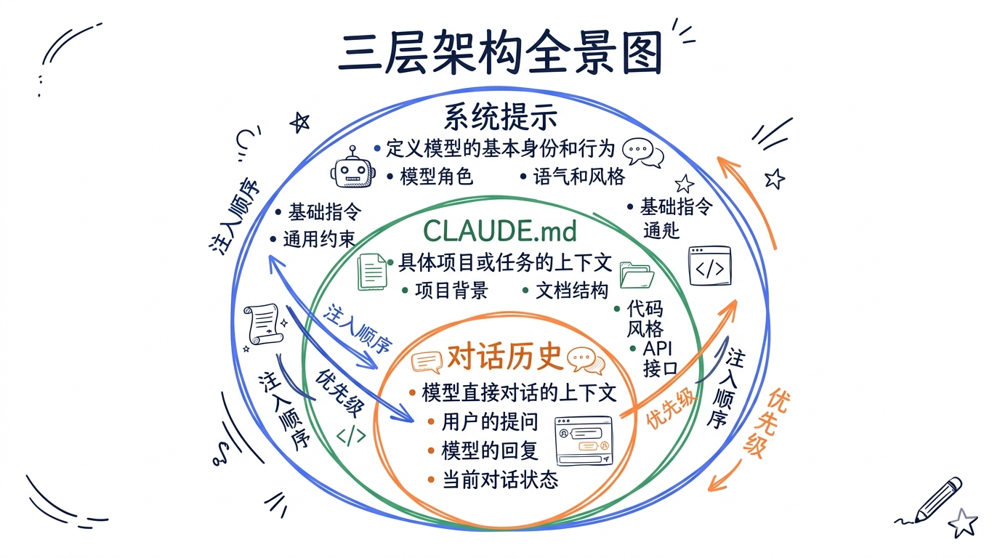
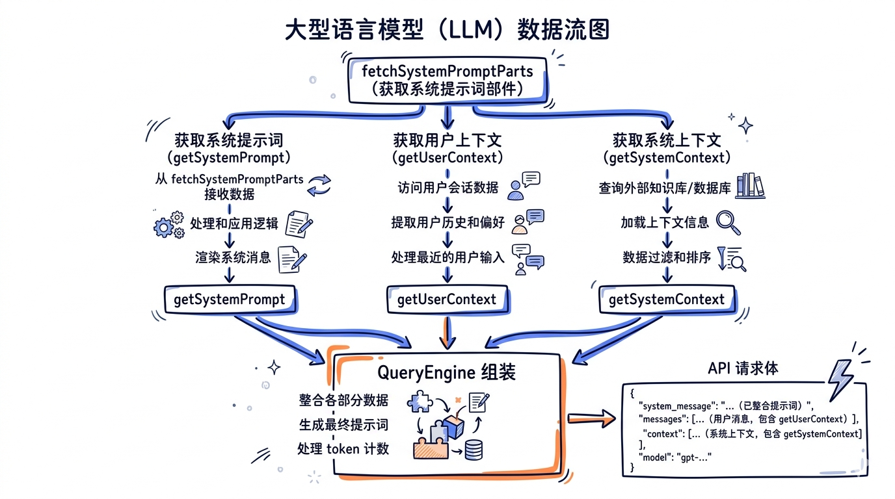
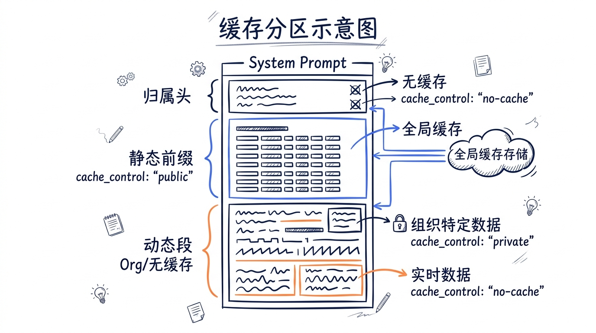
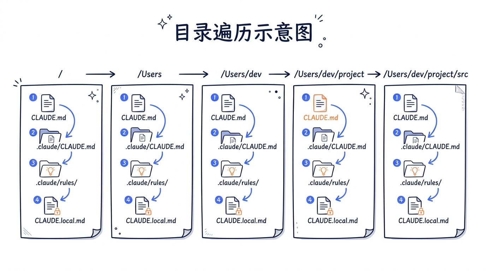
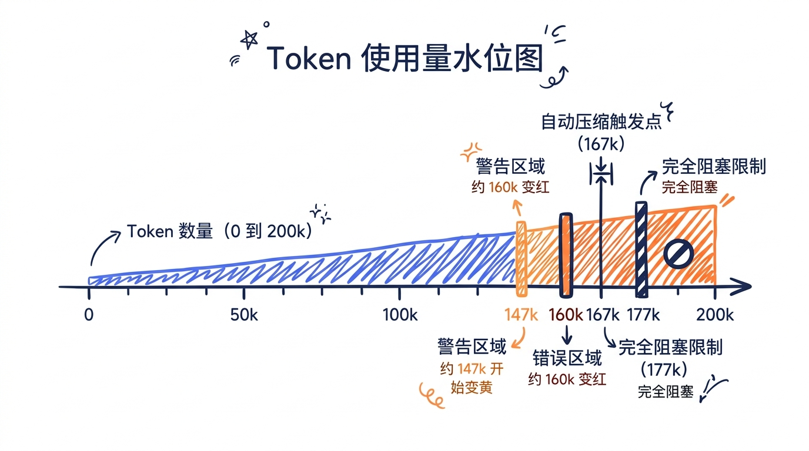

---
layout: default
title: "07 对话上下文三层架构"
nav_order: 30
parent: "模块三：上下文与记忆"
---


# 第七章: 对话上下文三层架构


在前面的章节中，我们已经了解了 Claude Code 的整体架构、工具系统和权限模型。现在要进入一个核心问题：当用户发送一条消息时，Claude 模型实际"看到"的完整上下文是什么？

Claude Code 采用了一个精心设计的三层上下文架构，将不同来源、不同生命周期、不同优先级的指令组合成一个完整的 API 请求。理解这个架构，是理解 Claude Code 如何"思考"的关键。



## 7.1 三层模型全景

Claude Code 的对话上下文由三个层次构成：

```
┌────────────────────────────────────────────────┐
│  Layer 1: System Prompt (系统提示)               │
│  - 基础人设与行为规范                              │
│  - 工具使用说明                                   │
│  - 环境信息（OS、Git、CWD）                        │
│  - MCP Server 指令                               │
│  - Feature Flags 控制的动态段落                    │
├────────────────────────────────────────────────┤
│  Layer 2: CLAUDE.md (用户指令)                    │
│  - 五级优先级的指令文件体系                         │
│  - @include 引用机制                              │
│  - .claude/rules/ 条件规则                        │
│  - Frontmatter 路径匹配                           │
├────────────────────────────────────────────────┤
│  Layer 3: Conversation History (对话历史)          │
│  - 用户消息 + 助手回复                             │
│  - 工具调用与结果                                  │
│  - Attachment 消息                                │
│  - <system-reminder> 上下文注入                    │
│  - Token 计数与自动压缩                            │
└────────────────────────────────────────────────┘
```

这三层的组装发生在 `fetchSystemPromptParts()` 函数中，它是 Query Engine 调用 API 前的最后一道拼装工序：

```typescript
// 文件: src/utils/queryContext.ts

export async function fetchSystemPromptParts({
  tools,
  mainLoopModel,
  additionalWorkingDirectories,
  mcpClients,
  customSystemPrompt,
}: { ... }): Promise<{
  defaultSystemPrompt: string[]
  userContext: { [k: string]: string }
  systemContext: { [k: string]: string }
}> {
  const [defaultSystemPrompt, userContext, systemContext] = await Promise.all([
    customSystemPrompt !== undefined
      ? Promise.resolve([])
      : getSystemPrompt(tools, mainLoopModel, additionalWorkingDirectories, mcpClients),
    getUserContext(),
    customSystemPrompt !== undefined ? Promise.resolve({}) : getSystemContext(),
  ])
  return { defaultSystemPrompt, userContext, systemContext }
}
```

注意这里的三路并行：`getSystemPrompt()` 构建 Layer 1，`getUserContext()` 加载 Layer 2 的 CLAUDE.md，`getSystemContext()` 收集 Git 状态等环境快照。三者互不依赖，可以同时执行。

最终组装发生在 QueryEngine 中：

```typescript
// 文件: src/QueryEngine.ts (简化)

const systemPrompt = asSystemPrompt([
  ...(customPrompt !== undefined ? [customPrompt] : defaultSystemPrompt),
  ...(memoryMechanicsPrompt ? [memoryMechanicsPrompt] : []),
  ...(appendSystemPrompt ? [appendSystemPrompt] : []),
])
```

而在 query loop 中，`systemContext` 被追加到 system prompt 末尾，`userContext`（包含 CLAUDE.md 内容）被作为第一条用户消息注入对话历史：

```typescript
// 文件: src/query.ts

const fullSystemPrompt = asSystemPrompt(
  appendSystemContext(systemPrompt, systemContext),
)
```

```typescript
// 文件: src/utils/api.ts

export function prependUserContext(
  messages: Message[],
  context: { [k: string]: string },
): Message[] {
  return [
    createUserMessage({
      content: `<system-reminder>\nAs you answer the user's questions, you can use the following context:\n${Object.entries(context)
        .map(([key, value]) => `# ${key}\n${value}`)
        .join('\n')}
      IMPORTANT: this context may or may not be relevant to your tasks...\n</system-reminder>\n`,
      isMeta: true,
    }),
    ...messages,
  ]
}
```



这个设计有一个重要含义：CLAUDE.md 的内容不是作为 system prompt 的一部分发送的，而是以 `<system-reminder>` 标签包裹后，作为对话历史中的第一条"虚拟用户消息"注入。这样做的好处是：

1. System Prompt 保持稳定，有利于 Prompt Cache 命中
2. CLAUDE.md 内容变化不会破坏整个 system prompt 的缓存
3. 模型能区分"系统内置指令"和"用户自定义指令"

## 7.2 System Prompt 动态组装

System Prompt 是模型看到的第一段文本，定义了 Claude Code 的身份、行为规范和能力边界。它的组装过程远比看起来复杂——涉及静态模板、Feature Flags、工具描述、MCP 指令等多个动态因子。

### 7.2.1 组装入口

核心函数 `getSystemPrompt()` 位于 `src/constants/prompts.ts`：

```typescript
// 文件: src/constants/prompts.ts

export async function getSystemPrompt(
  tools: Tools,
  model: string,
  additionalWorkingDirectories?: string[],
  mcpClients?: MCPServerConnection[],
): Promise<string[]> {
  // 极简模式直接返回最小 prompt
  if (isEnvTruthy(process.env.CLAUDE_CODE_SIMPLE)) {
    return [
      `You are Claude Code, Anthropic's official CLI for Claude.\n\nCWD: ${getCwd()}\nDate: ${getSessionStartDate()}`,
    ]
  }

  const cwd = getCwd()
  const [skillToolCommands, outputStyleConfig, envInfo] = await Promise.all([
    getSkillToolCommands(cwd),
    getOutputStyleConfig(),
    computeSimpleEnvInfo(model, additionalWorkingDirectories),
  ])

  const settings = getInitialSettings()
  const enabledTools = new Set(tools.map(_ => _.name))

  // ... 省略 proactive mode 分支 ...

  return [
    // --- 静态内容（可全局缓存）---
    getSimpleIntroSection(outputStyleConfig),       // 身份与安全声明
    getSimpleSystemSection(),                       // 系统行为规范
    getSimpleDoingTasksSection(),                   // 编码任务指南
    getActionsSection(),                            // 操作安全性原则
    getUsingYourToolsSection(enabledTools),          // 工具使用优先级
    getSimpleToneAndStyleSection(),                  // 语气与格式
    getOutputEfficiencySection(),                    // 输出效率要求

    // === 边界标记 — 不要移动或删除 ===
    ...(shouldUseGlobalCacheScope() ? [SYSTEM_PROMPT_DYNAMIC_BOUNDARY] : []),

    // --- 动态内容（Section Registry 管理）---
    ...resolvedDynamicSections,
  ].filter(s => s !== null)
}
```

返回值是 `string[]` 数组，每个元素是一个 section。最终发送 API 时会被拼接成完整文本。

### 7.2.2 静态/动态边界

System Prompt 被一个关键的边界标记 `SYSTEM_PROMPT_DYNAMIC_BOUNDARY` 分为两部分：

```typescript
// 文件: src/constants/prompts.ts

export const SYSTEM_PROMPT_DYNAMIC_BOUNDARY =
  '__SYSTEM_PROMPT_DYNAMIC_BOUNDARY__'
```

边界标记之前的所有 section 是**静态内容**，对于同一版本的 Claude Code，这些内容在所有用户、所有会话中完全相同。这使得 Anthropic API 的 Prompt Cache 可以使用 `scope: 'global'` 级别缓存——所有用户共享同一份缓存，大幅减少 token 计算。

边界标记之后的 section 是**动态内容**，包含会话特定的环境信息、用户语言偏好、MCP 指令等。这些内容使用 `scope: 'org'` 或 `null` 级别缓存。

这个分区在 API 请求构建时被实际使用：

```typescript
// 文件: src/utils/api.ts

export function splitSysPromptPrefix(
  systemPrompt: SystemPrompt,
  options?: { skipGlobalCacheForSystemPrompt?: boolean },
): SystemPromptBlock[] {
  const useGlobalCacheFeature = shouldUseGlobalCacheScope()

  if (useGlobalCacheFeature) {
    const boundaryIndex = systemPrompt.findIndex(
      s => s === SYSTEM_PROMPT_DYNAMIC_BOUNDARY,
    )
    if (boundaryIndex !== -1) {
      // ... 解析 attribution header 和 prefix ...
      const result: SystemPromptBlock[] = []
      if (attributionHeader) result.push({ text: attributionHeader, cacheScope: null })
      if (systemPromptPrefix) result.push({ text: systemPromptPrefix, cacheScope: null })
      // 静态部分 → 全局缓存
      const staticJoined = staticBlocks.join('\n\n')
      if (staticJoined) result.push({ text: staticJoined, cacheScope: 'global' })
      // 动态部分 → 不缓存
      const dynamicJoined = dynamicBlocks.join('\n\n')
      if (dynamicJoined) result.push({ text: dynamicJoined, cacheScope: null })
      return result
    }
  }
  // ... fallback 到 org 级缓存 ...
}
```



### 7.2.3 Section Registry 机制

动态 section 通过一个注册表机制管理，避免在运行时重复计算：

```typescript
// 文件: src/constants/systemPromptSections.ts

type SystemPromptSection = {
  name: string
  compute: ComputeFn
  cacheBreak: boolean
}

// 创建一个会被缓存的 section — 计算一次后不再重新求值
export function systemPromptSection(
  name: string,
  compute: ComputeFn,
): SystemPromptSection {
  return { name, compute, cacheBreak: false }
}

// 创建一个每轮都重新计算的 section — 会破坏 prompt cache
export function DANGEROUS_uncachedSystemPromptSection(
  name: string,
  compute: ComputeFn,
  _reason: string,  // 必须说明为什么需要破坏缓存
): SystemPromptSection {
  return { name, compute, cacheBreak: true }
}
```

每个 section 要么是"安全的"（只计算一次），要么被标记为"危险的"（每轮重算，会破坏缓存命中率）。使用 `DANGEROUS_` 前缀是一种代码审查约束——任何引入缓存破坏的 section 都需要明确的 reason 参数。

解析过程中，缓存的 section 从 bootstrap state 中读取：

```typescript
// 文件: src/constants/systemPromptSections.ts

export async function resolveSystemPromptSections(
  sections: SystemPromptSection[],
): Promise<(string | null)[]> {
  const cache = getSystemPromptSectionCache()

  return Promise.all(
    sections.map(async s => {
      if (!s.cacheBreak && cache.has(s.name)) {
        return cache.get(s.name) ?? null
      }
      const value = await s.compute()
      setSystemPromptSectionCacheEntry(s.name, value)
      return value
    }),
  )
}
```

### 7.2.4 各 Section 详解

System Prompt 中实际注册的动态 section 包括：

| Section 名称 | 类型 | 内容 |
|---|---|---|
| `session_guidance` | cached | 会话特定工具使用指南（AskUser、Agent、Skill 等） |
| `memory` | cached | Auto Memory 机制提示词 |
| `ant_model_override` | cached | 内部模型配置覆盖 |
| `env_info_simple` | cached | 环境信息（CWD、Git、OS、Shell、模型名） |
| `language` | cached | 用户语言偏好 |
| `output_style` | cached | 输出风格配置 |
| `mcp_instructions` | **uncached** | MCP Server 指令（服务器可能中途连接/断开） |
| `scratchpad` | cached | 临时文件目录指令 |
| `frc` | cached | Function Result Clearing 配置 |
| `summarize_tool_results` | cached | 工具结果总结提示 |

MCP instructions 是唯一使用 `DANGEROUS_uncachedSystemPromptSection` 的 section，因为 MCP 服务器可能在会话中途连接或断开——如果缓存了，模型可能会引用已经断开的 MCP 工具。

### 7.2.5 环境信息组装

`computeSimpleEnvInfo()` 构建模型看到的运行环境描述：

```typescript
// 文件: src/constants/prompts.ts

export async function computeSimpleEnvInfo(
  modelId: string,
  additionalWorkingDirectories?: string[],
): Promise<string> {
  const [isGit, unameSR] = await Promise.all([getIsGit(), getUnameSR()])

  const marketingName = getMarketingNameForModel(modelId)
  const modelDescription = marketingName
    ? `You are powered by the model named ${marketingName}. The exact model ID is ${modelId}.`
    : `You are powered by the model ${modelId}.`

  const cutoff = getKnowledgeCutoff(modelId)

  const envItems = [
    `Primary working directory: ${cwd}`,
    `Is a git repository: ${isGit}`,
    `Platform: ${env.platform}`,
    `Shell: ${shellName}`,
    `OS Version: ${unameSR}`,
    modelDescription,
    cutoff ? `Assistant knowledge cutoff is ${cutoff}.` : null,
    `The most recent Claude model family is Claude 4.5/4.6. ...`,
  ].filter(item => item !== null)

  return [
    `# Environment`,
    `You have been invoked in the following environment: `,
    ...prependBullets(envItems),
  ].join(`\n`)
}
```

这段信息告诉模型：你在什么操作系统上、当前目录是什么、是否在 Git 仓库中、使用什么 Shell、你自己是什么模型。这些信息影响模型生成的命令（比如在 Windows 上不会生成 Linux 特有的命令）。

### 7.2.6 MCP Server 指令注入

当有 MCP 服务器连接时，它们的 `instructions` 字段被组装成独立的 section：

```typescript
// 文件: src/constants/prompts.ts

function getMcpInstructions(mcpClients: MCPServerConnection[]): string | null {
  const connectedClients = mcpClients.filter(
    (client): client is ConnectedMCPServer => client.type === 'connected',
  )

  const clientsWithInstructions = connectedClients.filter(
    client => client.instructions,
  )

  if (clientsWithInstructions.length === 0) return null

  const instructionBlocks = clientsWithInstructions
    .map(client => `## ${client.name}\n${client.instructions}`)
    .join('\n\n')

  return `# MCP Server Instructions

The following MCP servers have provided instructions for how to use their tools and resources:

${instructionBlocks}`
}
```

每个 MCP Server 可以通过 `instructions` 字段告诉模型如何使用自己的工具——比如 "use `computer-use` tools for native desktop apps" 或 "use `context7` to fetch documentation for libraries"。

## 7.3 CLAUDE.md 五级优先级体系

CLAUDE.md 是 Claude Code 最强大的定制机制。用户通过在不同位置放置 Markdown 文件来注入指令，这些指令会被模型当作"用户提供的行为规范"来遵守。

### 7.3.1 文件发现规则

源代码顶部的注释完整描述了加载规则：

```typescript
// 文件: src/utils/claudemd.ts

/**
 * Files are loaded in the following order:
 *
 * 1. Managed memory (eg. /etc/claude-code/CLAUDE.md) - Global instructions for all users
 * 2. User memory (~/.claude/CLAUDE.md) - Private global instructions for all projects
 * 3. Project memory (CLAUDE.md, .claude/CLAUDE.md, and .claude/rules/*.md in project roots)
 * 4. Local memory (CLAUDE.local.md in project roots) - Private project-specific instructions
 *
 * Files are loaded in reverse order of priority, i.e. the latest files are highest priority
 * with the model paying more attention to them.
 *
 * File discovery:
 * - User memory is loaded from the user's home directory
 * - Project and Local files are discovered by traversing from the current directory up to root
 * - Files closer to the current directory have higher priority (loaded later)
 */
```

五级优先级体系（从低到高）：

```
优先级低 ──────────────────────────────────────────── 优先级高

  Managed        User         Project        Local       AutoMem
  /etc/...     ~/.claude/    项目根目录      项目根目录    ~/.claude/
  CLAUDE.md     CLAUDE.md    CLAUDE.md     CLAUDE.local  memory/
                             .claude/         .md        MEMORY.md
                             CLAUDE.md
                             .claude/rules/
```

每一级的路径由 `getMemoryPath()` 函数确定：

```typescript
// 文件: src/utils/config.ts

export function getMemoryPath(memoryType: MemoryType): string {
  const cwd = getOriginalCwd()

  switch (memoryType) {
    case 'User':
      return join(getClaudeConfigHomeDir(), 'CLAUDE.md')      // ~/.claude/CLAUDE.md
    case 'Local':
      return join(cwd, 'CLAUDE.local.md')                     // ./CLAUDE.local.md
    case 'Project':
      return join(cwd, 'CLAUDE.md')                           // ./CLAUDE.md
    case 'Managed':
      return join(getManagedFilePath(), 'CLAUDE.md')           // /etc/claude-code/CLAUDE.md
    case 'AutoMem':
      return getAutoMemEntrypoint()                           // ~/.claude/memory/MEMORY.md
  }
}
```

Managed 路径根据平台不同：

```typescript
// 文件: src/utils/settings/managedPath.ts

export const getManagedFilePath = memoize(function (): string {
  switch (getPlatform()) {
    case 'macos':
      return '/Library/Application Support/ClaudeCode'
    case 'windows':
      return 'C:\\Program Files\\ClaudeCode'
    default:
      return '/etc/claude-code'
  }
})
```

### 7.3.2 完整加载流程

`getMemoryFiles()` 是加载所有指令文件的核心函数。它执行一个完整的目录遍历：

```typescript
// 文件: src/utils/claudemd.ts (简化)

export const getMemoryFiles = memoize(
  async (forceIncludeExternal: boolean = false): Promise<MemoryFileInfo[]> => {
    const result: MemoryFileInfo[] = []
    const processedPaths = new Set<string>()

    // 1. Managed 文件（政策级别，最低优先级）
    const managedClaudeMd = getMemoryPath('Managed')
    result.push(...(await processMemoryFile(managedClaudeMd, 'Managed', processedPaths, includeExternal)))
    // Managed .claude/rules/*.md
    result.push(...(await processMdRules({ rulesDir: getManagedClaudeRulesDir(), type: 'Managed', ... })))

    // 2. User 文件（用户全局指令）
    if (isSettingSourceEnabled('userSettings')) {
      const userClaudeMd = getMemoryPath('User')
      result.push(...(await processMemoryFile(userClaudeMd, 'User', processedPaths, true)))
      // User ~/.claude/rules/*.md
      result.push(...(await processMdRules({ rulesDir: getUserClaudeRulesDir(), type: 'User', ... })))
    }

    // 3. 从根目录到 CWD 的逐级遍历
    const dirs: string[] = []
    let currentDir = originalCwd
    while (currentDir !== parse(currentDir).root) {
      dirs.push(currentDir)
      currentDir = dirname(currentDir)
    }

    // 从根目录向 CWD 方向处理（越靠近 CWD 优先级越高）
    for (const dir of dirs.reverse()) {
      // Project: CLAUDE.md
      result.push(...(await processMemoryFile(join(dir, 'CLAUDE.md'), 'Project', ...)))
      // Project: .claude/CLAUDE.md
      result.push(...(await processMemoryFile(join(dir, '.claude', 'CLAUDE.md'), 'Project', ...)))
      // Project: .claude/rules/*.md
      result.push(...(await processMdRules({ rulesDir: join(dir, '.claude', 'rules'), type: 'Project', ... })))
      // Local: CLAUDE.local.md
      result.push(...(await processMemoryFile(join(dir, 'CLAUDE.local.md'), 'Local', ...)))
    }

    // 4. AutoMem（自动记忆入口）
    if (isAutoMemoryEnabled()) {
      const { info: memdirEntry } = await safelyReadMemoryFileAsync(getAutoMemEntrypoint(), 'AutoMem')
      if (memdirEntry) result.push(memdirEntry)
    }

    return result
  },
)
```



几个关键设计决策值得注意：

**Memoize 缓存**：`getMemoryFiles` 被 `memoize` 包裹，整个会话只执行一次目录遍历。后续对 CLAUDE.md 内容的读取都走缓存。

**Worktree 去重**：当工作目录是 git worktree 时，向上遍历会经过 worktree 根目录和主仓库根目录。代码检测这种情况并跳过重复的 Project 文件：

```typescript
const isNestedWorktree =
  gitRoot !== null &&
  canonicalRoot !== null &&
  normalizePathForComparison(gitRoot) !== normalizePathForComparison(canonicalRoot) &&
  pathInWorkingPath(gitRoot, canonicalRoot)

// 跳过 worktree 之外、主仓库之内的 checked-in 文件
const skipProject =
  isNestedWorktree &&
  pathInWorkingPath(dir, canonicalRoot) &&
  !pathInWorkingPath(dir, gitRoot)
```

**设置源开关**：每种文件类型受 `isSettingSourceEnabled()` 控制。SDK 用户可以通过 `settingSources` 参数禁用特定级别的指令加载。

### 7.3.3 单文件处理管线

每个 CLAUDE.md 文件经过一个完整的处理管线：

```
读取文件 → 检查文件类型 → 解析 Frontmatter → 解析 Markdown tokens
    → 剥离 HTML 注释 → 提取 @include 路径 → 截断过大内容 → 返回 MemoryFileInfo
```

核心数据结构：

```typescript
// 文件: src/utils/claudemd.ts

export type MemoryFileInfo = {
  path: string
  type: MemoryType                      // 'User' | 'Project' | 'Local' | 'Managed' | 'AutoMem'
  content: string                       // 处理后的内容
  parent?: string                       // 包含此文件的父文件路径
  globs?: string[]                      // Frontmatter 中的路径匹配模式
  contentDiffersFromDisk?: boolean      // 内容是否经过转换
  rawContent?: string                   // 原始磁盘内容
}
```

处理核心在 `parseMemoryFileContent()` 中：

```typescript
// 文件: src/utils/claudemd.ts

function parseMemoryFileContent(
  rawContent: string,
  filePath: string,
  type: MemoryType,
  includeBasePath?: string,
): { info: MemoryFileInfo | null; includePaths: string[] } {
  // 1. 跳过非文本文件
  const ext = extname(filePath).toLowerCase()
  if (ext && !TEXT_FILE_EXTENSIONS.has(ext)) {
    return { info: null, includePaths: [] }
  }

  // 2. 解析 Frontmatter（提取 paths 等元数据）
  const { content: withoutFrontmatter, paths } = parseFrontmatterPaths(rawContent)

  // 3. 词法分析（用于注释剥离和 @include 提取）
  const tokens = (hasComment || includeBasePath !== undefined)
    ? new Lexer({ gfm: false }).lex(withoutFrontmatter)
    : undefined

  // 4. 剥离 HTML 注释（仅块级注释）
  const strippedContent = hasComment && tokens
    ? stripHtmlCommentsFromTokens(tokens).content
    : withoutFrontmatter

  // 5. 提取 @include 路径
  const includePaths = tokens && includeBasePath !== undefined
    ? extractIncludePathsFromTokens(tokens, includeBasePath)
    : []

  // 6. 截断 MEMORY.md（AutoMem/TeamMem 有行数和字节上限）
  let finalContent = strippedContent
  if (type === 'AutoMem' || type === 'TeamMem') {
    finalContent = truncateEntrypointContent(strippedContent).content
  }

  return {
    info: { path: filePath, type, content: finalContent, globs: paths, ... },
    includePaths,
  }
}
```

### 7.3.4 HTML 注释剥离

一个精巧的设计：CLAUDE.md 中的块级 HTML 注释 `<!-- ... -->` 会在注入前被自动移除。这允许用户在 CLAUDE.md 中写"元注释"——给人类读者看但不发送给模型的备注：

```typescript
// 文件: src/utils/claudemd.ts

export function stripHtmlComments(content: string): { content: string; stripped: boolean } {
  if (!content.includes('<!--')) {
    return { content, stripped: false }
  }
  return stripHtmlCommentsFromTokens(new Lexer({ gfm: false }).lex(content))
}
```

使用 marked 的 Lexer 确保只有真正的块级 HTML 注释被移除——代码块内的 `<!--` 和行内注释不受影响。

### 7.3.5 @include 指令

CLAUDE.md 支持 `@path` 语法引用其他文件：

```markdown
<!-- 在 CLAUDE.md 中 -->
@./coding-standards.md
@~/shared-rules/security.md
@/etc/company-standards/api-conventions.md
```

引用解析逻辑：

```typescript
// 文件: src/utils/claudemd.ts

function extractPathsFromText(textContent: string) {
  const includeRegex = /(?:^|\s)@((?:[^\s\\]|\\ )+)/g
  let match
  while ((match = includeRegex.exec(textContent)) !== null) {
    let path = match[1]
    if (!path) continue

    // 去掉 fragment identifier（#heading）
    const hashIndex = path.indexOf('#')
    if (hashIndex !== -1) path = path.substring(0, hashIndex)

    // 接受 @path、@./path、@~/path、@/path
    const isValidPath =
      path.startsWith('./') ||
      path.startsWith('~/') ||
      (path.startsWith('/') && path !== '/') ||
      (!path.startsWith('@') && path.match(/^[a-zA-Z0-9._-]/))

    if (isValidPath) {
      const resolvedPath = expandPath(path, dirname(basePath))
      absolutePaths.add(resolvedPath)
    }
  }
}
```

递归深度限制为 5 层，防止循环引用：

```typescript
const MAX_INCLUDE_DEPTH = 5
```

引用的文件必须是文本类型。源码维护了一个长达 100+ 种扩展名的白名单 `TEXT_FILE_EXTENSIONS`，涵盖从 `.ts` 到 `.proto` 的几乎所有文本格式，拒绝 `.png`、`.pdf` 等二进制文件。

### 7.3.6 条件规则（Frontmatter Paths）

`.claude/rules/` 下的规则文件可以通过 Frontmatter 指定只在操作特定文件时才生效：

```yaml
---
paths: src/api/**/*.ts, src/models/**
---
所有 API 层代码必须使用参数化查询，禁止拼接 SQL 字符串。
```

匹配逻辑使用 `ignore` 库（与 `.gitignore` 语法一致）：

```typescript
// 文件: src/utils/claudemd.ts

export async function processConditionedMdRules(
  targetPath: string,
  rulesDir: string,
  type: MemoryType,
  processedPaths: Set<string>,
  includeExternal: boolean,
): Promise<MemoryFileInfo[]> {
  const conditionedRuleMdFiles = await processMdRules({
    rulesDir, type, processedPaths, includeExternal,
    conditionalRule: true,  // 只取有 frontmatter paths 的文件
  })

  return conditionedRuleMdFiles.filter(file => {
    if (!file.globs || file.globs.length === 0) return false

    const baseDir = type === 'Project'
      ? dirname(dirname(rulesDir))  // .claude 的父目录
      : getOriginalCwd()           // 用户/管理级规则以 CWD 为基准

    const relativePath = isAbsolute(targetPath)
      ? relative(baseDir, targetPath)
      : targetPath

    return ignore().add(file.globs).ignores(relativePath)
  })
}
```

Frontmatter 中的路径支持 brace expansion：

```typescript
// 文件: src/utils/frontmatterParser.ts

// splitPathInFrontmatter("src/*.{ts,tsx}")
// → ["src/*.ts", "src/*.tsx"]
//
// splitPathInFrontmatter("{a,b}/{c,d}")
// → ["a/c", "a/d", "b/c", "b/d"]
```

### 7.3.7 最终拼接

所有文件加载后，`getClaudeMds()` 将它们拼接成一个完整字符串：

```typescript
// 文件: src/utils/claudemd.ts

export const getClaudeMds = (
  memoryFiles: MemoryFileInfo[],
  filter?: (type: MemoryType) => boolean,
): string => {
  const memories: string[] = []

  for (const file of memoryFiles) {
    if (filter && !filter(file.type)) continue

    const description =
      file.type === 'Project'
        ? ' (project instructions, checked into the codebase)'
        : file.type === 'Local'
          ? " (user's private project instructions, not checked in)"
          : " (user's private global instructions for all projects)"

    memories.push(`Contents of ${file.path}${description}:\n\n${file.content.trim()}`)
  }

  if (memories.length === 0) return ''

  return `${MEMORY_INSTRUCTION_PROMPT}\n\n${memories.join('\n\n')}`
}
```

其中 `MEMORY_INSTRUCTION_PROMPT` 是一句强制遵守指令的声明：

```typescript
const MEMORY_INSTRUCTION_PROMPT =
  'Codebase and user instructions are shown below. Be sure to adhere to these instructions. IMPORTANT: These instructions OVERRIDE any default behavior and you MUST follow them exactly as written.'
```

这句声明是 CLAUDE.md 优先级高于 System Prompt 内置行为的关键——它告诉模型"用户的指令覆盖默认行为"。

### 7.3.8 排除与禁用

支持两种方式禁用 CLAUDE.md 加载：

**环境变量**：`CLAUDE_CODE_DISABLE_CLAUDE_MDS=true` 完全禁用。

**Bare 模式**：`--bare` 标志跳过自动发现，但仍然遵守 `--add-dir` 显式指定的目录。

**排除模式**：`claudeMdExcludes` 设置支持 glob 模式排除特定文件：

```typescript
// 文件: src/utils/claudemd.ts

function isClaudeMdExcluded(filePath: string, type: MemoryType): boolean {
  if (type !== 'User' && type !== 'Project' && type !== 'Local') {
    return false  // Managed 和 AutoMem 永远不被排除
  }

  const patterns = getInitialSettings().claudeMdExcludes
  if (!patterns || patterns.length === 0) return false

  // 展开 symlink 路径（macOS 上 /tmp → /private/tmp）
  const expandedPatterns = resolveExcludePatterns(patterns)
  return picomatch.isMatch(normalizedPath, expandedPatterns, { dot: true })
}
```

## 7.4 AGENTS.md 和竞品兼容

Claude Code 没有原生加载 `AGENTS.md`（Google Gemini）或 `.cursorrules`（Cursor）等竞品配置文件。但在 `/init` 命令中，它会主动扫描并吸收这些文件的内容：

```typescript
// 文件: src/commands/init.ts

// /init 命令的 subagent 提示词（节选）
`Launch a subagent to survey the codebase, and ask it to read key files to understand
the project: manifest files (package.json, Cargo.toml, ...), README, Makefile/build
configs, CI config, existing CLAUDE.md, .claude/rules/, AGENTS.md, .cursor/rules or
.cursorrules, .github/copilot-instructions.md, .windsurfrules, .clinerules, .mcp.json.`

// 输出到 CLAUDE.md 时的指令
`- Important parts from existing AI coding tool configs if they exist
  (AGENTS.md, .cursor/rules, .cursorrules, .github/copilot-instructions.md,
   .windsurfrules, .clinerules)`
```

设计哲学很清楚：Claude Code 不会在运行时自动加载竞品的配置格式（那会引入不可控的指令源），而是在初始化时提取其中有用的部分，由用户审核后写入 CLAUDE.md。

## 7.5 指令冲突解决

当多层指令存在冲突时，Claude Code 使用**位置优先级**原则：加载越晚的内容，模型越容易"记住"（recency bias）。但这不是简单的覆盖，而是通过几个机制协同工作：

### 7.5.1 加载顺序即优先级

`getMemoryFiles()` 的加载顺序决定了内容在 prompt 中的排列：

```
Managed → User → Project(从根到CWD) → Local → AutoMem
```

越后面加载的内容在 prompt 中出现越晚。由于 LLM 的 recency bias，后面的指令实际优先级更高。

### 7.5.2 MEMORY_INSTRUCTION_PROMPT 的覆盖声明

开头的 `IMPORTANT: These instructions OVERRIDE any default behavior` 声明建立了 CLAUDE.md 整体高于 System Prompt 的优先级基线。

### 7.5.3 类型描述标注

每个文件在注入时都带有类型描述，帮助模型理解来源：

- `(project instructions, checked into the codebase)` — 团队共享的规范
- `(user's private project instructions, not checked in)` — 个人对项目的定制
- `(user's private global instructions for all projects)` — 个人全局偏好

当冲突发生时，模型可以根据这些标注推理出哪个更"局部"、更"具体"。

### 7.5.4 实际冲突场景

假设存在以下文件：

```
~/.claude/CLAUDE.md        → "Always use TypeScript"
./CLAUDE.md                → "This project uses JavaScript"
./src/.claude/rules/api.md → "API files must use TypeScript strict mode"
```

模型看到的最终 prompt 中这三条指令都存在，但因为加载顺序，`./CLAUDE.md` 比 `~/.claude/CLAUDE.md` 更晚出现，所以"JavaScript"的指令优先级更高。而 `api.md` 中的条件规则只在操作 API 文件时才被注入，此时 TypeScript strict 会覆盖 JavaScript 偏好。

## 7.6 Context Window 管理

对话进行一段时间后，累积的消息会逐渐填满模型的上下文窗口。Claude Code 通过一套精密的 token 计数和自动压缩机制来管理这个限制。

### 7.6.1 上下文窗口大小

不同模型有不同的上下文窗口：

```typescript
// 文件: src/utils/context.ts

export const MODEL_CONTEXT_WINDOW_DEFAULT = 200_000

export function getContextWindowForModel(model: string, betas?: string[]): number {
  // 环境变量覆盖
  if (process.env.CLAUDE_CODE_MAX_CONTEXT_TOKENS) {
    const override = parseInt(process.env.CLAUDE_CODE_MAX_CONTEXT_TOKENS, 10)
    if (!isNaN(override) && override > 0) return override
  }

  // [1m] 后缀 — 显式启用 1M 上下文
  if (has1mContext(model)) return 1_000_000

  // 模型能力表查询
  const cap = getModelCapability(model)
  if (cap?.max_input_tokens && cap.max_input_tokens >= 100_000) {
    return cap.max_input_tokens
  }

  // Beta header 检查
  if (betas?.includes(CONTEXT_1M_BETA_HEADER) && modelSupports1M(model)) {
    return 1_000_000
  }

  return MODEL_CONTEXT_WINDOW_DEFAULT  // 200k
}
```

### 7.6.2 Token 计数策略

Claude Code 使用三种 token 计数方式，从精确到粗略：

**方式一：API 精确计数**

```typescript
// 文件: src/services/tokenEstimation.ts

export async function countTokensWithAPI(content: string): Promise<number | null> {
  if (!content) return 0

  const message: Anthropic.Beta.Messages.BetaMessageParam = {
    role: 'user', content: content,
  }
  return countMessagesTokensWithAPI([message], [])
}
```

调用 Anthropic API 的 `countTokens` 端点，得到精确的 token 数。但这是一次网络请求，有延迟和成本。

**方式二：Haiku 回退计数**

```typescript
// 文件: src/services/tokenEstimation.ts

export async function countTokensViaHaikuFallback(
  messages: Anthropic.Beta.Messages.BetaMessageParam[],
  tools: Anthropic.Beta.Messages.BetaToolUnion[],
): Promise<number | null> {
  const model = isVertexGlobalEndpoint || isBedrockWithThinking
    ? getDefaultSonnetModel()
    : getSmallFastModel()   // 通常是 Haiku

  const response = await anthropic.beta.messages.create({
    model: normalizeModelStringForAPI(model),
    max_tokens: containsThinking ? TOKEN_COUNT_MAX_TOKENS : 1,
    messages: messagesToSend,
    tools: tools.length > 0 ? tools : undefined,
    // ...
  })

  return response.usage.input_tokens + 
         (response.usage.cache_creation_input_tokens || 0) +
         (response.usage.cache_read_input_tokens || 0)
}
```

用一个廉价的小模型（Haiku）做一次 `max_tokens: 1` 的请求，目的不是获取回复，而是利用 `usage` 字段获取精确的 input token 计数。

**方式三：粗估计算**

```typescript
// 文件: src/services/tokenEstimation.ts

export function roughTokenCountEstimation(
  content: string,
  bytesPerToken: number = 4,
): number {
  return Math.round(content.length / bytesPerToken)
}

// JSON 文件因为大量单字符 token（{, }, :, ,, "）而更密集
export function bytesPerTokenForFileType(fileExtension: string): number {
  switch (fileExtension) {
    case 'json': case 'jsonl': case 'jsonc':
      return 2    // JSON 每 2 字符约 1 token
    default:
      return 4    // 一般文本每 4 字符约 1 token
  }
}
```

默认按 4 字符/token 估算。JSON 文件因为充满短 token（`{`, `}`, `:`, `,`, `"`），使用更保守的 2 字符/token。

### 7.6.3 综合估算函数

实际使用中，`tokenCountWithEstimation()` 结合 API 返回的精确数据和后续新消息的粗估：

```typescript
// 文件: src/utils/tokens.ts

export function tokenCountWithEstimation(messages: readonly Message[]): number {
  let i = messages.length - 1
  while (i >= 0) {
    const message = messages[i]
    const usage = message ? getTokenUsage(message) : undefined
    if (message && usage) {
      // 处理并行工具调用的消息分裂
      const responseId = getAssistantMessageId(message)
      if (responseId) {
        let j = i - 1
        while (j >= 0) {
          const prior = messages[j]
          const priorId = prior ? getAssistantMessageId(prior) : undefined
          if (priorId === responseId) {
            i = j  // 回退到同一 API 响应的第一个分片
          } else if (priorId !== undefined) {
            break
          }
          j--
        }
      }
      // 精确计数 + 新消息粗估
      return getTokenCountFromUsage(usage) + roughTokenCountEstimationForMessages(messages.slice(i + 1))
    }
    i--
  }
  // 无 API 响应数据时全部粗估
  return roughTokenCountEstimationForMessages(messages)
}
```

这个函数找到最近一次有 `usage` 数据的 assistant 消息，用它的精确 token 数作为基线，然后对之后新增的消息做粗估。这样避免了每次都调用 API，同时保持了合理的精度。

### 7.6.4 Auto Compact 触发

当 token 数接近上下文窗口限制时，自动压缩触发：

```typescript
// 文件: src/services/compact/autoCompact.ts

export const AUTOCOMPACT_BUFFER_TOKENS = 13_000

export function getAutoCompactThreshold(model: string): number {
  const effectiveContextWindow = getEffectiveContextWindowSize(model)
  return effectiveContextWindow - AUTOCOMPACT_BUFFER_TOKENS
}

export function getEffectiveContextWindowSize(model: string): number {
  const reservedTokensForSummary = Math.min(
    getMaxOutputTokensForModel(model),
    MAX_OUTPUT_TOKENS_FOR_SUMMARY,  // 20,000
  )
  let contextWindow = getContextWindowForModel(model, getSdkBetas())
  return contextWindow - reservedTokensForSummary
}
```

对于默认的 200k 上下文窗口：
- 有效窗口 = 200,000 - 20,000（预留给压缩摘要输出）= 180,000
- 自动压缩阈值 = 180,000 - 13,000 = 167,000

也就是说，当上下文使用量达到约 167k tokens 时，自动压缩启动。

```typescript
// 文件: src/services/compact/autoCompact.ts

export function calculateTokenWarningState(tokenUsage: number, model: string) {
  const threshold = isAutoCompactEnabled()
    ? autoCompactThreshold
    : getEffectiveContextWindowSize(model)

  const percentLeft = Math.max(0,
    Math.round(((threshold - tokenUsage) / threshold) * 100),
  )

  const warningThreshold = threshold - WARNING_THRESHOLD_BUFFER_TOKENS   // -20k
  const errorThreshold = threshold - ERROR_THRESHOLD_BUFFER_TOKENS       // -20k
  const blockingLimit = actualContextWindow - MANUAL_COMPACT_BUFFER_TOKENS // -3k

  return {
    percentLeft,
    isAboveWarningThreshold: tokenUsage >= warningThreshold,
    isAboveErrorThreshold: tokenUsage >= errorThreshold,
    isAboveAutoCompactThreshold: isAutoCompactEnabled() && tokenUsage >= autoCompactThreshold,
    isAtBlockingLimit: tokenUsage >= blockingLimit,
  }
}
```



### 7.6.5 压缩失败的断路器

一个值得注意的工程细节：自动压缩有连续失败的断路器机制：

```typescript
// 文件: src/services/compact/autoCompact.ts

const MAX_CONSECUTIVE_AUTOCOMPACT_FAILURES = 3

// 如果连续 3 次压缩都失败了，停止重试
if (
  tracking?.consecutiveFailures !== undefined &&
  tracking.consecutiveFailures >= MAX_CONSECUTIVE_AUTOCOMPACT_FAILURES
) {
  return { wasCompacted: false }
}
```

这是从生产数据中学到的教训——曾经有 1,279 个会话出现了 50 次以上的连续压缩失败（最高达 3,272 次），浪费了大量 API 调用。断路器设置为 3 次后停止。

## 7.7 完整数据流

将所有层次串联起来，一次完整的 API 请求构建过程如下：

```
                     ┌───────────────────────────┐
                     │     getSystemPrompt()     │
                     │  静态 sections (模板文本)   │
                     │  ──────────────────────── │
                     │  DYNAMIC_BOUNDARY 标记     │
                     │  ──────────────────────── │
                     │  动态 sections (缓存/重算)  │
                     └───────────┬───────────────┘
                                 │
                     ┌───────────┴───────────────┐
                     │     getSystemContext()     │
                     │  Git Status 快照           │
                     │  Cache Breaker (调试用)     │
                     └───────────┬───────────────┘
                                 │
                     ┌───────────┴───────────────┐
                     │  appendSystemContext()     │
                     │  合并到 system prompt 末尾  │
                     └───────────┬───────────────┘
                                 │
                     ┌───────────┴───────────────┐
                     │  splitSysPromptPrefix()    │
                     │  拆分为缓存区块:            │
                     │   [header | static(global) │
                     │    | dynamic(org/null)]    │
                     └───────────┬───────────────┘
                                 │
                     ┌───────────┴───────────────┐
                     │  buildSystemPromptBlocks() │
                     │  添加 cache_control 标记    │
                     │  → TextBlockParam[]        │
                     └───────────┬───────────────┘
                                 │
                                 ▼
        ┌─────────────────────────────────────────┐
        │              API Request                 │
        │  system: TextBlockParam[]                │
        │  messages: [                             │
        │    { role: "user", // CLAUDE.md 注入     │
        │      content: "<system-reminder>..." },  │
        │    { role: "user", content: "用户问题" }, │
        │    { role: "assistant", content: "..." },│
        │    ...                                   │
        │  ]                                       │
        │  tools: [...]                            │
        └─────────────────────────────────────────┘
```

## 7.8 动手实践

### 练习 1：观察你的上下文

在你的项目中创建以下结构，然后启动 Claude Code 观察效果：

```bash
# 创建全局指令
mkdir -p ~/.claude
echo "Always respond in Chinese when the user writes in Chinese." > ~/.claude/CLAUDE.md

# 创建项目指令
echo "This is a TypeScript project. Use strict TypeScript." > ./CLAUDE.md

# 创建条件规则
mkdir -p .claude/rules
cat > .claude/rules/api-security.md << 'EOF'
---
paths: src/api/**/*.ts
---
All API endpoints must validate input parameters.
Never trust user-provided data without sanitization.
EOF

# 创建私有指令
echo "My preferred test framework is Vitest." > ./CLAUDE.local.md
```

### 练习 2：实现简化版指令加载器

```typescript
import { readFileSync, existsSync } from 'fs'
import { join, dirname, parse } from 'path'

type MemoryType = 'User' | 'Project' | 'Local'

interface MemoryFile {
  path: string
  type: MemoryType
  content: string
}

function loadMemoryFiles(cwd: string): MemoryFile[] {
  const result: MemoryFile[] = []
  const homeDir = process.env.HOME || process.env.USERPROFILE || ''

  // 1. User memory
  const userPath = join(homeDir, '.claude', 'CLAUDE.md')
  if (existsSync(userPath)) {
    result.push({
      path: userPath,
      type: 'User',
      content: readFileSync(userPath, 'utf-8'),
    })
  }

  // 2. 从根目录到 CWD 逐级遍历
  const dirs: string[] = []
  let currentDir = cwd
  while (currentDir !== parse(currentDir).root) {
    dirs.push(currentDir)
    currentDir = dirname(currentDir)
  }

  for (const dir of dirs.reverse()) {
    // Project: CLAUDE.md
    const projectPath = join(dir, 'CLAUDE.md')
    if (existsSync(projectPath)) {
      result.push({
        path: projectPath,
        type: 'Project',
        content: readFileSync(projectPath, 'utf-8'),
      })
    }
    // Local: CLAUDE.local.md
    const localPath = join(dir, 'CLAUDE.local.md')
    if (existsSync(localPath)) {
      result.push({
        path: localPath,
        type: 'Local',
        content: readFileSync(localPath, 'utf-8'),
      })
    }
  }

  return result
}

function assembleContext(files: MemoryFile[]): string {
  const INSTRUCTION_PROMPT =
    'Instructions are shown below. Follow them exactly as written.'

  const sections = files.map(f => {
    const desc = f.type === 'Project'
      ? '(project instructions)'
      : f.type === 'Local'
        ? '(private project instructions)'
        : '(global user instructions)'
    return `Contents of ${f.path} ${desc}:\n\n${f.content.trim()}`
  })

  return `${INSTRUCTION_PROMPT}\n\n${sections.join('\n\n')}`
}

// 使用
const files = loadMemoryFiles(process.cwd())
console.log(assembleContext(files))
```

### 练习 3：实现粗略 Token 估算器

```typescript
function estimateTokens(text: string, fileType?: string): number {
  const bytesPerToken = fileType === 'json' ? 2 : 4
  return Math.round(text.length / bytesPerToken)
}

function shouldAutoCompact(
  messages: string[],
  contextWindow: number = 200_000,
): { shouldCompact: boolean; usage: number; threshold: number } {
  const RESERVED_FOR_SUMMARY = 20_000
  const BUFFER = 13_000

  const effectiveWindow = contextWindow - RESERVED_FOR_SUMMARY
  const threshold = effectiveWindow - BUFFER

  const totalTokens = messages.reduce((sum, msg) => sum + estimateTokens(msg), 0)

  return {
    shouldCompact: totalTokens >= threshold,
    usage: totalTokens,
    threshold,
  }
}

// 测试
const messages = ['Hello, world!'.repeat(1000)]  // 模拟长对话
const result = shouldAutoCompact(messages)
console.log(`Token usage: ${result.usage} / Threshold: ${result.threshold}`)
console.log(`Should compact: ${result.shouldCompact}`)
```

## 源码对照表

| 概念 | 文件路径 | 关键函数/常量 |
|---|---|---|
| 三层上下文组装入口 | `src/utils/queryContext.ts` | `fetchSystemPromptParts()` |
| System Prompt 主体 | `src/constants/prompts.ts` | `getSystemPrompt()` |
| 静态/动态边界标记 | `src/constants/prompts.ts` | `SYSTEM_PROMPT_DYNAMIC_BOUNDARY` |
| Section 注册与解析 | `src/constants/systemPromptSections.ts` | `systemPromptSection()`, `resolveSystemPromptSections()` |
| 环境信息 | `src/constants/prompts.ts` | `computeSimpleEnvInfo()` |
| MCP 指令注入 | `src/constants/prompts.ts` | `getMcpInstructions()` |
| CLAUDE.md 加载入口 | `src/utils/claudemd.ts` | `getMemoryFiles()` |
| 文件路径定义 | `src/utils/config.ts` | `getMemoryPath()` |
| Managed 路径 | `src/utils/settings/managedPath.ts` | `getManagedFilePath()` |
| 文件内容解析 | `src/utils/claudemd.ts` | `parseMemoryFileContent()` |
| HTML 注释剥离 | `src/utils/claudemd.ts` | `stripHtmlComments()` |
| @include 解析 | `src/utils/claudemd.ts` | `extractIncludePathsFromTokens()` |
| Frontmatter 解析 | `src/utils/frontmatterParser.ts` | `parseFrontmatter()`, `splitPathInFrontmatter()` |
| 条件规则匹配 | `src/utils/claudemd.ts` | `processConditionedMdRules()` |
| 最终拼接 | `src/utils/claudemd.ts` | `getClaudeMds()` |
| 系统上下文 | `src/context.ts` | `getSystemContext()`, `getUserContext()` |
| UserContext 注入 | `src/utils/api.ts` | `prependUserContext()` |
| SystemContext 追加 | `src/utils/api.ts` | `appendSystemContext()` |
| 缓存区块拆分 | `src/utils/api.ts` | `splitSysPromptPrefix()` |
| API 层构建 | `src/services/api/claude.ts` | `buildSystemPromptBlocks()` |
| Token 精确计数 | `src/services/tokenEstimation.ts` | `countTokensWithAPI()`, `countTokensViaHaikuFallback()` |
| Token 粗估 | `src/services/tokenEstimation.ts` | `roughTokenCountEstimation()` |
| 综合估算 | `src/utils/tokens.ts` | `tokenCountWithEstimation()` |
| 上下文窗口大小 | `src/utils/context.ts` | `getContextWindowForModel()` |
| 自动压缩触发 | `src/services/compact/autoCompact.ts` | `shouldAutoCompact()`, `getAutoCompactThreshold()` |
| MemoryType 定义 | `src/utils/memory/types.ts` | `MEMORY_TYPE_VALUES` |
| 竞品配置读取 | `src/commands/init.ts` | `/init` 命令提示词 |

## 本章小结

本章深入剖析了 Claude Code 的对话上下文三层架构：

1. **System Prompt** 是模型的"身份证"和"操作手册"。它通过静态/动态边界标记实现精细的 Prompt Cache 控制——静态部分全局共享缓存，动态部分按会话变化。Section Registry 机制确保大多数 section 只计算一次，只有 MCP 指令等真正需要实时更新的 section 才使用 `DANGEROUS_uncachedSystemPromptSection`。

2. **CLAUDE.md** 是用户定制行为的核心通道。五级优先级体系（Managed → User → Project → Local → AutoMem）覆盖了从企业政策到个人偏好的全部场景。@include 指令、Frontmatter 条件规则、HTML 注释剥离等机制使其成为一个功能完备的指令系统。它被注入为对话历史的第一条 `<system-reminder>` 消息，既保持了 system prompt 的缓存稳定性，又确保了用户指令的高优先级。

3. **Context Window 管理** 通过三级 token 计数策略（API 精确计数 → Haiku 回退 → 字符粗估）和自动压缩机制，使得对话长度理论上没有上限。167k tokens 的自动压缩阈值、连续失败断路器、并行工具调用的消息分裂处理等细节，都是从大规模生产环境中打磨出来的工程实践。

下一章，我们将进入 Claude Code 的 API 通信层，看看这些精心组装的上下文是如何通过流式传输发送到模型、又如何处理模型的流式响应的。

## 思考题

三层上下文中哪一层对你的实际开发最有价值？为什么？

欢迎在评论区聊聊你的想法。

下一讲，我们换个角度看《上下文压缩四策略》。

