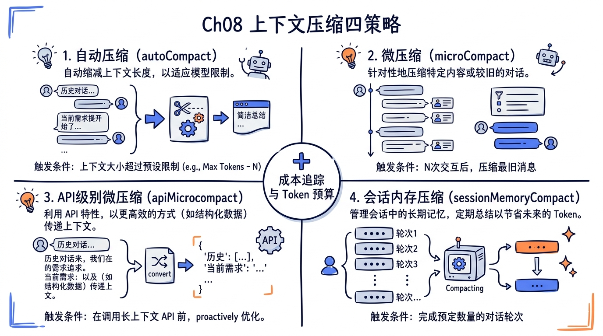
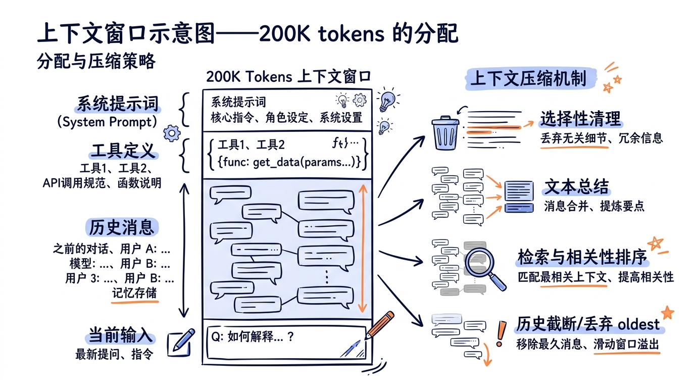
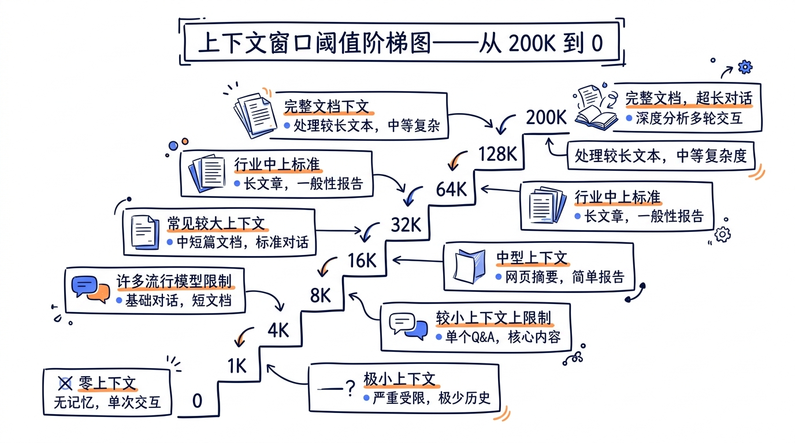
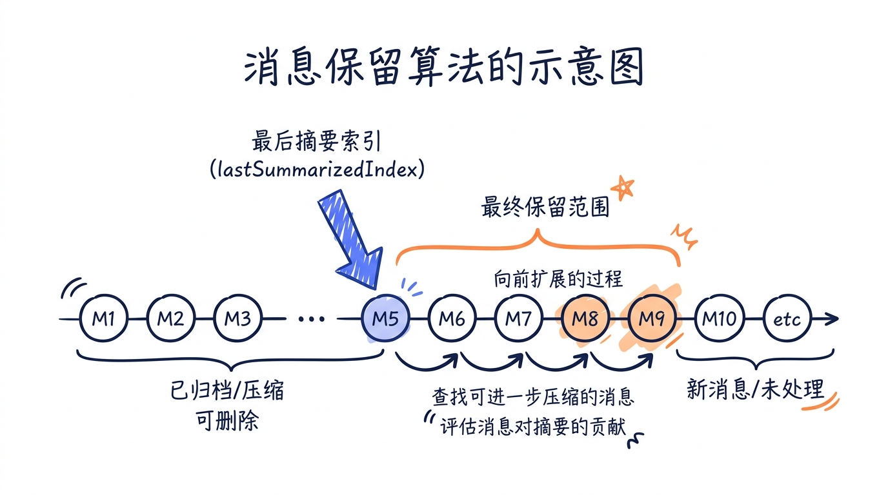

# 第八章：上下文压缩四策略——让 Agent 在有限窗口中永续运转



> 上下文窗口是 LLM 的短期记忆。它不是无限的，也不是免费的。一个真正可用的 AI 编程代理，必须学会遗忘——精确地、有策略地遗忘。

当你用 Claude Code 进行一次较长的编程会话——比如连续修改十几个文件、调试一个顽固的 bug、或者执行一个多步骤的重构计划——你可能从未注意到上下文窗口正在悄悄填满。这并非偶然。Claude Code 在幕后运行着一套精密的上下文压缩系统，它由四种互相协作的策略组成，确保 Agent 在 200K tokens 的硬限制下永续运转，同时最大限度地保留关键信息。

本章将完整拆解 `services/compact/` 目录中的 11 个源文件，带你理解这套压缩系统的设计哲学、触发机制、协作关系和工程细节。



---

## 一、为什么需要压缩？上下文窗口的真实可用量

### 1.1 200K tokens 不等于 200K tokens

Claude 模型的标称上下文窗口是 200K tokens，但 Agent 场景下的实际可用量远低于此。来看源码中的定义：

```typescript
// 文件: src/utils/context.ts (第 8-9 行)

// Model context window size (200k tokens for all models right now)
export const MODEL_CONTEXT_WINDOW_DEFAULT = 200_000
```

看起来有 200K tokens，但实际可用量需要减去多个固定开销：

```typescript
// 文件: src/services/compact/autoCompact.ts (第 28-37 行)

// Reserve this many tokens for output during compaction
// Based on p99.99 of compact summary output being 17,387 tokens.
const MAX_OUTPUT_TOKENS_FOR_SUMMARY = 20_000

// Returns the context window size minus the max output tokens for the model
export function getEffectiveContextWindowSize(model: string): number {
  const reservedTokensForSummary = Math.min(
    getMaxOutputTokensForModel(model),
    MAX_OUTPUT_TOKENS_FOR_SUMMARY,
  )
  let contextWindow = getContextWindowForModel(model, getSdkBetas())

  const autoCompactWindow = process.env.CLAUDE_CODE_AUTO_COMPACT_WINDOW
  if (autoCompactWindow) {
    const parsed = parseInt(autoCompactWindow, 10)
    if (!isNaN(parsed) && parsed > 0) {
      contextWindow = Math.min(contextWindow, parsed)
    }
  }

  return contextWindow - reservedTokensForSummary
}
```

有效上下文 = 200K - 20K（输出预留）= 180K。但这仍然不是 Agent 能用于对话历史的全部空间。还需要减去：

| 固定开销 | 大致消耗 |
|---------|---------|
| 系统提示词 (system prompt) | 约 5-10K tokens |
| 工具定义 (tool schemas) | 约 10-20K tokens（取决于注册的工具数量） |
| 用户上下文 (CLAUDE.md 等) | 约 2-5K tokens |
| 输出预留 | 20K tokens |
| 安全缓冲 (autocompact buffer) | 13K tokens |

这意味着真正留给对话历史的空间大约只有 **130-150K tokens**——标称值的 65%-75%。

### 1.2 自动压缩的触发阈值

系统通过一组精心设计的阈值来管理上下文压力：

```typescript
// 文件: src/services/compact/autoCompact.ts (第 62-65 行)

export const AUTOCOMPACT_BUFFER_TOKENS = 13_000
export const WARNING_THRESHOLD_BUFFER_TOKENS = 20_000
export const ERROR_THRESHOLD_BUFFER_TOKENS = 20_000
export const MANUAL_COMPACT_BUFFER_TOKENS = 3_000
```

阈值的计算逻辑：

```typescript
// 文件: src/services/compact/autoCompact.ts (第 72-91 行)

export function getAutoCompactThreshold(model: string): number {
  const effectiveContextWindow = getEffectiveContextWindowSize(model)

  const autocompactThreshold =
    effectiveContextWindow - AUTOCOMPACT_BUFFER_TOKENS

  // Override for easier testing of autocompact
  const envPercent = process.env.CLAUDE_AUTOCOMPACT_PCT_OVERRIDE
  if (envPercent) {
    const parsed = parseFloat(envPercent)
    if (!isNaN(parsed) && parsed > 0 && parsed <= 100) {
      const percentageThreshold = Math.floor(
        effectiveContextWindow * (parsed / 100),
      )
      return Math.min(percentageThreshold, autocompactThreshold)
    }
  }

  return autocompactThreshold
}
```

以默认 200K 模型为例，各阈值的含义：

```
200K (标称窗口)
 |
 ├── 180K (有效窗口 = 200K - 20K 输出预留)
 |    |
 |    ├── 167K (自动压缩阈值 = 180K - 13K 缓冲)  ← 到这里自动触发压缩
 |    |
 |    ├── 160K (警告阈值 = 180K - 20K)             ← 到这里显示黄色警告
 |    |
 |    ├── 160K (错误阈值 = 180K - 20K)             ← 到这里显示红色警告
 |    |
 |    └── 177K (阻塞阈值 = 180K - 3K)              ← 到这里强制要求手动压缩
 |
 └── 0
```



### 1.3 熔断机制

当自动压缩反复失败时，系统不会无限重试：

```typescript
// 文件: src/services/compact/autoCompact.ts (第 67-70 行)

// Stop trying autocompact after this many consecutive failures.
// BQ 2026-03-10: 1,279 sessions had 50+ consecutive failures (up to 3,272)
// in a single session, wasting ~250K API calls/day globally.
const MAX_CONSECUTIVE_AUTOCOMPACT_FAILURES = 3
```

这个熔断器是从真实生产数据中得到教训后加入的。代码注释揭示了一个关键数字：在加入熔断前，有 1,279 个会话出现了 50 次以上的连续失败（最多达 3,272 次！），每天浪费约 25 万次 API 调用。

---

## 二、四种压缩策略详解

Claude Code 的上下文压缩体系由四种策略组成，从轻到重、从局部到全局：

```
┌──────────────────────────────────────────────────────┐
│                压缩策略频谱                            │
│                                                      │
│  轻量 ←────────────────────────────────────→ 重量     │
│                                                      │
│  MicroCompact    Snip    AutoCompact    SessionMemory │
│  (微压缩)       (裁剪)    (自动压缩)     (会话记忆)     │
│                                                      │
│  单条消息级别    消息级别   全对话级别     跨会话级别      │
│  清除工具结果    移除过时    LLM 摘要       提取关键       │
│  无 LLM 调用    无 LLM     需要 LLM      信息持久化      │
│  毫秒级         毫秒级     秒级          需要 LLM        │
└──────────────────────────────────────────────────────┘
```

### 2.1 策略一：MicroCompact（微压缩）

MicroCompact 是最轻量的压缩策略。它不调用 LLM，而是直接清除消息中的旧工具执行结果。核心逻辑在 `microCompact.ts` 中。

#### 2.1.1 可压缩的工具集

不是所有工具结果都可以清除，只有输出通常较大且信息时效性较短的工具：

```typescript
// 文件: src/services/compact/microCompact.ts (第 41-50 行)

// Only compact these tools
const COMPACTABLE_TOOLS = new Set<string>([
  FILE_READ_TOOL_NAME,
  ...SHELL_TOOL_NAMES,
  GREP_TOOL_NAME,
  GLOB_TOOL_NAME,
  WEB_SEARCH_TOOL_NAME,
  WEB_FETCH_TOOL_NAME,
  FILE_EDIT_TOOL_NAME,
  FILE_WRITE_TOOL_NAME,
])
```

这些工具的共同特点是：输出可能很长（一个文件读取可能返回上千行代码），但历史结果的价值随时间递减——如果模型已经基于这些信息做出了决策并采取了行动，保留完整的原始输出意义不大。

#### 2.1.2 工具结果 token 估算

MicroCompact 需要估算每条消息的 token 消耗来决定压缩收益：

```typescript
// 文件: src/services/compact/microCompact.ts (第 138-157 行)

// Helper to calculate tool result tokens
function calculateToolResultTokens(block: ToolResultBlockParam): number {
  if (!block.content) {
    return 0
  }

  if (typeof block.content === 'string') {
    return roughTokenCountEstimation(block.content)
  }

  // Array of TextBlockParam | ImageBlockParam | DocumentBlockParam
  return block.content.reduce((sum, item) => {
    if (item.type === 'text') {
      return sum + roughTokenCountEstimation(item.text)
    } else if (item.type === 'image' || item.type === 'document') {
      // Images/documents are approximately 2000 tokens regardless of format
      return sum + IMAGE_MAX_TOKEN_SIZE
    }
    return sum
  }, 0)
}
```

注意图片和文档统一按 2000 tokens 估算——这是一个实用的近似值，避免了精确计算的开销。

#### 2.1.3 三条 MicroCompact 路径

`microcompactMessages` 函数是 MicroCompact 的入口，它内部有三条路径：

```typescript
// 文件: src/services/compact/microCompact.ts (第 253-293 行)

export async function microcompactMessages(
  messages: Message[],
  toolUseContext?: ToolUseContext,
  querySource?: QuerySource,
): Promise<MicrocompactResult> {
  // Clear suppression flag at start of new microcompact attempt
  clearCompactWarningSuppression()

  // 路径 1: 基于时间的触发
  // 如果距离上次 assistant 消息超过阈值（默认 60 分钟），
  // 服务器缓存已过期，直接清除旧工具结果
  const timeBasedResult = maybeTimeBasedMicrocompact(messages, querySource)
  if (timeBasedResult) {
    return timeBasedResult
  }

  // 路径 2: 缓存编辑路径（仅限内部用户）
  // 使用 cache_edits API 在不破坏提示缓存的前提下删除工具结果
  if (feature('CACHED_MICROCOMPACT')) {
    const mod = await getCachedMCModule()
    const model = toolUseContext?.options.mainLoopModel ?? getMainLoopModel()
    if (
      mod.isCachedMicrocompactEnabled() &&
      mod.isModelSupportedForCacheEditing(model) &&
      isMainThreadSource(querySource)
    ) {
      return await cachedMicrocompactPath(messages, querySource)
    }
  }

  // 路径 3: 无操作（回退到 autocompact 处理）
  return { messages }
}
```

这三条路径的优先级非常清晰：时间触发 > 缓存编辑 > 回退。让我们逐一深入。

#### 2.1.4 基于时间的微压缩

当用户离开一段时间后回来继续会话，服务器端的提示缓存（Prompt Cache）已经过期。此时压缩不会额外损失缓存命中，反而能减少重新发送的 token 数量：

```typescript
// 文件: src/services/compact/microCompact.ts (第 422-444 行)

export function evaluateTimeBasedTrigger(
  messages: Message[],
  querySource: QuerySource | undefined,
): { gapMinutes: number; config: TimeBasedMCConfig } | null {
  const config = getTimeBasedMCConfig()
  // Require an explicit main-thread querySource
  if (!config.enabled || !querySource || !isMainThreadSource(querySource)) {
    return null
  }
  const lastAssistant = messages.findLast(m => m.type === 'assistant')
  if (!lastAssistant) {
    return null
  }
  const gapMinutes =
    (Date.now() - new Date(lastAssistant.timestamp).getTime()) / 60_000
  if (!Number.isFinite(gapMinutes) || gapMinutes < config.gapThresholdMinutes) {
    return null
  }
  return { gapMinutes, config }
}
```

一旦触发，它会保留最近 N 个工具结果，清除其余的：

```typescript
// 文件: src/services/compact/microCompact.ts (第 446-529 行)

function maybeTimeBasedMicrocompact(
  messages: Message[],
  querySource: QuerySource | undefined,
): MicrocompactResult | null {
  const trigger = evaluateTimeBasedTrigger(messages, querySource)
  if (!trigger) {
    return null
  }
  const { gapMinutes, config } = trigger

  const compactableIds = collectCompactableToolIds(messages)

  // Floor at 1: slice(-0) returns the full array (paradoxically keeps
  // everything), and clearing ALL results leaves the model with zero working
  // context.
  const keepRecent = Math.max(1, config.keepRecent)
  const keepSet = new Set(compactableIds.slice(-keepRecent))
  const clearSet = new Set(compactableIds.filter(id => !keepSet.has(id)))

  if (clearSet.size === 0) {
    return null
  }

  let tokensSaved = 0
  const result: Message[] = messages.map(message => {
    if (message.type !== 'user' || !Array.isArray(message.message.content)) {
      return message
    }
    let touched = false
    const newContent = message.message.content.map(block => {
      if (
        block.type === 'tool_result' &&
        clearSet.has(block.tool_use_id) &&
        block.content !== TIME_BASED_MC_CLEARED_MESSAGE
      ) {
        tokensSaved += calculateToolResultTokens(block)
        touched = true
        return { ...block, content: TIME_BASED_MC_CLEARED_MESSAGE }
      }
      return block
    })
    if (!touched) return message
    return {
      ...message,
      message: { ...message.message, content: newContent },
    }
  })

  // ...日志记录和状态重置...
  return { messages: result }
}
```

被清除的工具结果被替换为一个固定占位符：

```typescript
// 文件: src/services/compact/microCompact.ts (第 36 行)

export const TIME_BASED_MC_CLEARED_MESSAGE = '[Old tool result content cleared]'
```

这个设计巧妙地保留了消息结构（`tool_use` 和 `tool_result` 的配对关系不会被破坏），只是内容被清空了。

#### 2.1.5 时间阈值配置

时间触发的默认配置来自 `timeBasedMCConfig.ts`：

```typescript
// 文件: src/services/compact/timeBasedMCConfig.ts (第 18-44 行)

export type TimeBasedMCConfig = {
  /** Master switch. When false, time-based microcompact is a no-op. */
  enabled: boolean
  /** Trigger when (now - last assistant timestamp) exceeds this many minutes.
   *  60 is the safe choice: the server's 1h cache TTL is guaranteed expired. */
  gapThresholdMinutes: number
  /** Keep this many most-recent compactable tool results. */
  keepRecent: number
}

const TIME_BASED_MC_CONFIG_DEFAULTS: TimeBasedMCConfig = {
  enabled: false,
  gapThresholdMinutes: 60,
  keepRecent: 5,
}

export function getTimeBasedMCConfig(): TimeBasedMCConfig {
  return getFeatureValue_CACHED_MAY_BE_STALE<TimeBasedMCConfig>(
    'tengu_slate_heron',
    TIME_BASED_MC_CONFIG_DEFAULTS,
  )
}
```

60 分钟的阈值不是随意选的——它恰好对应服务器端提示缓存的 1 小时 TTL。超过这个时间，缓存已经过期，清除旧工具结果不会造成额外的缓存失效。

#### 2.1.6 缓存编辑路径

当 Cached MicroCompact 启用时，系统使用 API 的 `cache_edits` 机制，在不破坏提示缓存的前提下删除工具结果：

```typescript
// 文件: src/services/compact/microCompact.ts (第 305-399 行)

async function cachedMicrocompactPath(
  messages: Message[],
  querySource: QuerySource | undefined,
): Promise<MicrocompactResult> {
  const mod = await getCachedMCModule()
  const state = ensureCachedMCState()
  const config = mod.getCachedMCConfig()

  const compactableToolIds = new Set(collectCompactableToolIds(messages))
  // 注册新的工具结果
  for (const message of messages) {
    if (message.type === 'user' && Array.isArray(message.message.content)) {
      const groupIds: string[] = []
      for (const block of message.message.content) {
        if (
          block.type === 'tool_result' &&
          compactableToolIds.has(block.tool_use_id) &&
          !state.registeredTools.has(block.tool_use_id)
        ) {
          mod.registerToolResult(state, block.tool_use_id)
          groupIds.push(block.tool_use_id)
        }
      }
      mod.registerToolMessage(state, groupIds)
    }
  }

  const toolsToDelete = mod.getToolResultsToDelete(state)

  if (toolsToDelete.length > 0) {
    // 创建 cache_edits 块并排队等待 API 层处理
    const cacheEdits = mod.createCacheEditsBlock(state, toolsToDelete)
    if (cacheEdits) {
      pendingCacheEdits = cacheEdits
    }

    // ...日志和通知...

    // 返回未修改的消息——cache_reference 和 cache_edits
    // 在 API 层添加
    return {
      messages,
      compactionInfo: {
        pendingCacheEdits: {
          trigger: 'auto',
          deletedToolIds: toolsToDelete,
          baselineCacheDeletedTokens: baseline,
        },
      },
    }
  }

  return { messages }
}
```

这条路径有一个非常重要的特性：**它不修改本地消息内容**。删除操作通过 API 的 `cache_edits` 机制在服务端完成，本地保留完整的消息历史。这意味着如果用户向上滚动查看历史，仍然能看到完整的工具输出。

### 2.2 策略二：API-Level Context Management（API 级上下文管理）

`apiMicrocompact.ts` 定义了通过 API 原生 context management 机制进行的压缩配置。这是服务端驱动的策略：

```typescript
// 文件: src/services/compact/apiMicrocompact.ts (第 35-57 行)

// Context management strategy types matching API documentation
export type ContextEditStrategy =
  | {
      type: 'clear_tool_uses_20250919'
      trigger?: {
        type: 'input_tokens'
        value: number
      }
      keep?: {
        type: 'tool_uses'
        value: number
      }
      clear_tool_inputs?: boolean | string[]
      exclude_tools?: string[]
      clear_at_least?: {
        type: 'input_tokens'
        value: number
      }
    }
  | {
      type: 'clear_thinking_20251015'
      keep: { type: 'thinking_turns'; value: number } | 'all'
    }
```

这个配置描述了两种 API 级编辑策略：

1. **`clear_tool_uses_20250919`**：当 input tokens 超过阈值时，清除旧的工具调用结果，保留最近 N 个
2. **`clear_thinking_20251015`**：管理 thinking blocks（思考过程），可以保留全部或只保留最近 N 轮

```typescript
// 文件: src/services/compact/apiMicrocompact.ts (第 64-92 行)

export function getAPIContextManagement(options?: {
  hasThinking?: boolean
  isRedactThinkingActive?: boolean
  clearAllThinking?: boolean
}): ContextManagementConfig | undefined {
  const {
    hasThinking = false,
    isRedactThinkingActive = false,
    clearAllThinking = false,
  } = options ?? {}

  const strategies: ContextEditStrategy[] = []

  // Preserve thinking blocks in previous assistant turns. Skip when
  // redact-thinking is active — redacted blocks have no model-visible content.
  // When clearAllThinking is set (>1h idle = cache miss), keep only the last
  // thinking turn.
  if (hasThinking && !isRedactThinkingActive) {
    strategies.push({
      type: 'clear_thinking_20251015',
      keep: clearAllThinking ? { type: 'thinking_turns', value: 1 } : 'all',
    })
  }

  // ...工具清除策略（仅限内部用户）...
}
```

默认的 token 阈值配置透露了系统的设计目标：

```typescript
// 文件: src/services/compact/apiMicrocompact.ts (第 15-17 行)

const DEFAULT_MAX_INPUT_TOKENS = 180_000 // Typical warning threshold
const DEFAULT_TARGET_INPUT_TOKENS = 40_000 // Keep last 40k tokens like client-side
```

180K 触发压缩，目标保留 40K——也就是说，当压缩触发时，系统会尝试清除约 140K tokens 的工具结果。

### 2.3 策略三：AutoCompact（自动压缩）

AutoCompact 是最核心的压缩策略。与 MicroCompact 不同，它调用 LLM 生成对话摘要来替换完整的历史消息。核心编排逻辑在 `autoCompact.ts`，实际的压缩执行在 `compact.ts`。

#### 2.3.1 触发条件判断

```typescript
// 文件: src/services/compact/autoCompact.ts (第 160-239 行)

export async function shouldAutoCompact(
  messages: Message[],
  model: string,
  querySource?: QuerySource,
  snipTokensFreed = 0,
): Promise<boolean> {
  // 递归守卫：session_memory 和 compact 本身不触发
  if (querySource === 'session_memory' || querySource === 'compact') {
    return false
  }
  // Context Collapse 的子代理也不触发
  if (feature('CONTEXT_COLLAPSE')) {
    if (querySource === 'marble_origami') {
      return false
    }
  }

  if (!isAutoCompactEnabled()) {
    return false
  }

  // 反应式压缩模式下，抑制主动 autocompact
  if (feature('REACTIVE_COMPACT')) {
    if (getFeatureValue_CACHED_MAY_BE_STALE('tengu_cobalt_raccoon', false)) {
      return false
    }
  }

  // Context Collapse 模式下也抑制
  // Collapse 有自己的上下文管理系统
  if (feature('CONTEXT_COLLAPSE')) {
    const { isContextCollapseEnabled } =
      require('../contextCollapse/index.js') as typeof import('../contextCollapse/index.js')
    if (isContextCollapseEnabled()) {
      return false
    }
  }

  const tokenCount = tokenCountWithEstimation(messages) - snipTokensFreed
  const threshold = getAutoCompactThreshold(model)

  const { isAboveAutoCompactThreshold } = calculateTokenWarningState(
    tokenCount,
    model,
  )

  return isAboveAutoCompactThreshold
}
```

这段代码展示了多层防御性设计：
- **递归防护**：压缩过程本身不能触发新的压缩
- **子代理隔离**：不同的上下文管理系统互不干扰
- **特性开关**：通过 feature flags 控制不同压缩模式的优先级

#### 2.3.2 AutoCompact 编排流程

```typescript
// 文件: src/services/compact/autoCompact.ts (第 241-351 行)

export async function autoCompactIfNeeded(
  messages: Message[],
  toolUseContext: ToolUseContext,
  cacheSafeParams: CacheSafeParams,
  querySource?: QuerySource,
  tracking?: AutoCompactTrackingState,
  snipTokensFreed?: number,
): Promise<{
  wasCompacted: boolean
  compactionResult?: CompactionResult
  consecutiveFailures?: number
}> {
  if (isEnvTruthy(process.env.DISABLE_COMPACT)) {
    return { wasCompacted: false }
  }

  // 熔断器检查
  if (
    tracking?.consecutiveFailures !== undefined &&
    tracking.consecutiveFailures >= MAX_CONSECUTIVE_AUTOCOMPACT_FAILURES
  ) {
    return { wasCompacted: false }
  }

  const model = toolUseContext.options.mainLoopModel
  const shouldCompact = await shouldAutoCompact(
    messages, model, querySource, snipTokensFreed,
  )

  if (!shouldCompact) {
    return { wasCompacted: false }
  }

  // 先尝试 Session Memory 压缩（更轻量）
  const sessionMemoryResult = await trySessionMemoryCompaction(
    messages,
    toolUseContext.agentId,
    recompactionInfo.autoCompactThreshold,
  )
  if (sessionMemoryResult) {
    setLastSummarizedMessageId(undefined)
    runPostCompactCleanup(querySource)
    if (feature('PROMPT_CACHE_BREAK_DETECTION')) {
      notifyCompaction(querySource ?? 'compact', toolUseContext.agentId)
    }
    markPostCompaction()
    return { wasCompacted: true, compactionResult: sessionMemoryResult }
  }

  // Session Memory 不可用时，执行传统 LLM 压缩
  try {
    const compactionResult = await compactConversation(
      messages, toolUseContext, cacheSafeParams,
      true,      // 抑制后续问题
      undefined, // 无自定义指令
      true,      // 标记为自动压缩
      recompactionInfo,
    )

    setLastSummarizedMessageId(undefined)
    runPostCompactCleanup(querySource)

    return {
      wasCompacted: true,
      compactionResult,
      consecutiveFailures: 0,  // 成功后重置失败计数
    }
  } catch (error) {
    if (!hasExactErrorMessage(error, ERROR_MESSAGE_USER_ABORT)) {
      logError(error)
    }
    const prevFailures = tracking?.consecutiveFailures ?? 0
    const nextFailures = prevFailures + 1
    return { wasCompacted: false, consecutiveFailures: nextFailures }
  }
}
```

这里的关键设计决策是：**先尝试 SessionMemory 压缩，再回退到传统 LLM 压缩**。SessionMemory 压缩不需要调用 LLM，速度更快、成本更低。

#### 2.3.3 核心压缩函数 compactConversation

`compact.ts` 中的 `compactConversation` 函数是整个压缩系统最核心的部分，超过 400 行代码。让我们分段解析：

**第一步：预处理**

```typescript
// 文件: src/services/compact/compact.ts (第 387-491 行，简化展示)

export async function compactConversation(
  messages: Message[],
  context: ToolUseContext,
  cacheSafeParams: CacheSafeParams,
  suppressFollowUpQuestions: boolean,
  customInstructions?: string,
  isAutoCompact: boolean = false,
  recompactionInfo?: RecompactionInfo,
): Promise<CompactionResult> {
  // 1. 记录压缩前 token 数
  const preCompactTokenCount = tokenCountWithEstimation(messages)

  // 2. 执行 PreCompact hooks
  context.setSDKStatus?.('compacting')
  const hookResult = await executePreCompactHooks(
    { trigger: isAutoCompact ? 'auto' : 'manual', customInstructions: customInstructions ?? null },
    context.abortController.signal,
  )
  customInstructions = mergeHookInstructions(customInstructions, hookResult.newCustomInstructions)

  // 3. 构造压缩提示词
  const compactPrompt = getCompactPrompt(customInstructions)
  const summaryRequest = createUserMessage({ content: compactPrompt })

  // 4. 调用 LLM 生成摘要（含 PTL 重试循环）
  let messagesToSummarize = messages
  let summaryResponse: AssistantMessage
  let summary: string | null
  let ptlAttempts = 0
  for (;;) {
    summaryResponse = await streamCompactSummary({
      messages: messagesToSummarize,
      summaryRequest,
      appState,
      context,
      preCompactTokenCount,
      cacheSafeParams,
    })
    summary = getAssistantMessageText(summaryResponse)
    if (!summary?.startsWith(PROMPT_TOO_LONG_ERROR_MESSAGE)) break

    // CC-1180: 压缩请求本身命中了 prompt-too-long
    // 截断最旧的消息组并重试
    ptlAttempts++
    const truncated = ptlAttempts <= MAX_PTL_RETRIES
      ? truncateHeadForPTLRetry(messagesToSummarize, summaryResponse)
      : null
    if (!truncated) {
      throw new Error(ERROR_MESSAGE_PROMPT_TOO_LONG)
    }
    messagesToSummarize = truncated
  }
  // ...
}
```

**第二步：重建上下文**

压缩完成后，系统需要恢复模型继续工作所需的关键上下文：

```typescript
// 文件: src/services/compact/compact.ts (第 516-585 行，简化展示)

  // 清除文件读取缓存
  context.readFileState.clear()
  context.loadedNestedMemoryPaths?.clear()

  // 并行生成文件附件和异步代理附件
  const [fileAttachments, asyncAgentAttachments] = await Promise.all([
    createPostCompactFileAttachments(
      preCompactReadFileState, context,
      POST_COMPACT_MAX_FILES_TO_RESTORE,
    ),
    createAsyncAgentAttachmentsIfNeeded(context),
  ])

  // 恢复计划文件
  const planAttachment = createPlanAttachmentIfNeeded(context.agentId)

  // 恢复计划模式指令
  const planModeAttachment = await createPlanModeAttachmentIfNeeded(context)

  // 恢复已调用的技能内容
  const skillAttachment = createSkillAttachmentIfNeeded(context.agentId)

  // 重新声明延迟加载的工具、代理列表、MCP 指令
  for (const att of getDeferredToolsDeltaAttachment(...)) { ... }
  for (const att of getAgentListingDeltaAttachment(...)) { ... }
  for (const att of getMcpInstructionsDeltaAttachment(...)) { ... }
```

#### 2.3.4 压缩后文件恢复的精细控制

压缩后需要恢复最近读取的文件，但有严格的预算控制：

```typescript
// 文件: src/services/compact/compact.ts (第 122-131 行)

export const POST_COMPACT_MAX_FILES_TO_RESTORE = 5
export const POST_COMPACT_TOKEN_BUDGET = 50_000
export const POST_COMPACT_MAX_TOKENS_PER_FILE = 5_000
// Skills can be large (verify=18.7KB, claude-api=20.1KB). Previously re-injected
// unbounded on every compact → 5-10K tok/compact. Per-skill truncation beats
// dropping.
export const POST_COMPACT_MAX_TOKENS_PER_SKILL = 5_000
export const POST_COMPACT_SKILLS_TOKEN_BUDGET = 25_000
```

文件恢复函数的实现展示了精细的预算管理：

```typescript
// 文件: src/services/compact/compact.ts (第 1415-1464 行)

export async function createPostCompactFileAttachments(
  readFileState: Record<string, { content: string; timestamp: number }>,
  toolUseContext: ToolUseContext,
  maxFiles: number,
  preservedMessages: Message[] = [],
): Promise<AttachmentMessage[]> {
  // 收集保留消息中已有的 Read 结果路径（避免重复注入）
  const preservedReadPaths = collectReadToolFilePaths(preservedMessages)
  const recentFiles = Object.entries(readFileState)
    .map(([filename, state]) => ({ filename, ...state }))
    .filter(
      file =>
        !shouldExcludeFromPostCompactRestore(file.filename, toolUseContext.agentId)
        && !preservedReadPaths.has(expandPath(file.filename)),
    )
    .sort((a, b) => b.timestamp - a.timestamp)  // 按时间降序
    .slice(0, maxFiles)  // 最多 5 个文件

  const results = await Promise.all(
    recentFiles.map(async file => {
      const attachment = await generateFileAttachment(
        file.filename,
        { ...toolUseContext, fileReadingLimits: { maxTokens: POST_COMPACT_MAX_TOKENS_PER_FILE } },
        'tengu_post_compact_file_restore_success',
        'tengu_post_compact_file_restore_error',
        'compact',
      )
      return attachment ? createAttachmentMessage(attachment) : null
    }),
  )

  // 严格的 token 预算控制
  let usedTokens = 0
  return results.filter((result): result is AttachmentMessage => {
    if (result === null) return false
    const attachmentTokens = roughTokenCountEstimation(jsonStringify(result))
    if (usedTokens + attachmentTokens <= POST_COMPACT_TOKEN_BUDGET) {
      usedTokens += attachmentTokens
      return true
    }
    return false
  })
}
```

这里有几个重要的设计决策：

1. **排除特定文件**：计划文件和 `CLAUDE.md` 等记忆文件不通过文件恢复注入（它们有专门的恢复路径）
2. **去重**：如果保留的消息尾部已经包含某个文件的 Read 结果，就不重复注入
3. **预算硬上限**：所有恢复文件的总 token 不超过 50K

#### 2.3.5 技能内容的截断策略

技能文件可能很大，需要截断：

```typescript
// 文件: src/services/compact/compact.ts (第 1657-1672 行)

const SKILL_TRUNCATION_MARKER =
  '\n\n[... skill content truncated for compaction; use Read on the skill path if you need the full text]'

function truncateToTokens(content: string, maxTokens: number): string {
  if (roughTokenCountEstimation(content) <= maxTokens) {
    return content
  }
  const charBudget = maxTokens * 4 - SKILL_TRUNCATION_MARKER.length
  return content.slice(0, charBudget) + SKILL_TRUNCATION_MARKER
}
```

截断时保留文件头部（通常包含使用说明），并添加标记告诉模型可以通过 Read 工具获取完整内容。

#### 2.3.6 处理图片和附件

压缩前会先剥离图片以避免压缩请求本身过大：

```typescript
// 文件: src/services/compact/compact.ts (第 145-200 行)

export function stripImagesFromMessages(messages: Message[]): Message[] {
  return messages.map(message => {
    if (message.type !== 'user') {
      return message
    }

    const content = message.message.content
    if (!Array.isArray(content)) {
      return message
    }

    let hasMediaBlock = false
    const newContent = content.flatMap(block => {
      if (block.type === 'image') {
        hasMediaBlock = true
        return [{ type: 'text' as const, text: '[image]' }]
      }
      if (block.type === 'document') {
        hasMediaBlock = true
        return [{ type: 'text' as const, text: '[document]' }]
      }
      // Also strip images/documents nested inside tool_result content arrays
      if (block.type === 'tool_result' && Array.isArray(block.content)) {
        let toolHasMedia = false
        const newToolContent = block.content.map(item => {
          if (item.type === 'image') {
            toolHasMedia = true
            return { type: 'text' as const, text: '[image]' }
          }
          if (item.type === 'document') {
            toolHasMedia = true
            return { type: 'text' as const, text: '[document]' }
          }
          return item
        })
        if (toolHasMedia) {
          hasMediaBlock = true
          return [{ ...block, content: newToolContent }]
        }
      }
      return [block]
    })

    if (!hasMediaBlock) return message

    return {
      ...message,
      message: { ...message.message, content: newContent },
    } as typeof message
  })
}
```

图片被替换为 `[image]` 占位符，文档被替换为 `[document]`。这保留了"这里曾经有一张图片"的信息，而不浪费 token 发送实际图片数据给压缩 LLM。

#### 2.3.7 Prompt-Too-Long 重试机制

当对话实在太长，连压缩请求本身都超过了 API 限制时，系统有一个优雅的降级策略：

```typescript
// 文件: src/services/compact/compact.ts (第 243-291 行)

export function truncateHeadForPTLRetry(
  messages: Message[],
  ptlResponse: AssistantMessage,
): Message[] | null {
  // 去掉之前重试留下的合成标记
  const input =
    messages[0]?.type === 'user' &&
    messages[0].isMeta &&
    messages[0].message.content === PTL_RETRY_MARKER
      ? messages.slice(1)
      : messages

  const groups = groupMessagesByApiRound(input)
  if (groups.length < 2) return null

  const tokenGap = getPromptTooLongTokenGap(ptlResponse)
  let dropCount: number
  if (tokenGap !== undefined) {
    // 根据 API 返回的差额精确计算需要丢弃的组数
    let acc = 0
    dropCount = 0
    for (const g of groups) {
      acc += roughTokenCountEstimationForMessages(g)
      dropCount++
      if (acc >= tokenGap) break
    }
  } else {
    // 无法解析差额时，默认丢弃 20%
    dropCount = Math.max(1, Math.floor(groups.length * 0.2))
  }

  // 至少保留一个组用于生成摘要
  dropCount = Math.min(dropCount, groups.length - 1)
  if (dropCount < 1) return null

  const sliced = groups.slice(dropCount).flat()
  // 如果裁剪后首条消息是 assistant，需要补一条 user 消息
  if (sliced[0]?.type === 'assistant') {
    return [
      createUserMessage({ content: PTL_RETRY_MARKER, isMeta: true }),
      ...sliced,
    ]
  }
  return sliced
}
```

最多重试 3 次（`MAX_PTL_RETRIES`），每次从最旧的 API 轮次开始丢弃，直到请求能够通过。

### 2.4 策略四：SessionMemoryCompact（会话记忆压缩）

SessionMemoryCompact 是四种策略中最"聪明"的一种。它不像 AutoCompact 那样临时生成摘要，而是利用持续积累的会话记忆来替代历史消息。

#### 2.4.1 核心理念

SessionMemory 是一个在后台持续运行的提取器，它会定期从对话中提取关键信息（决策、文件修改、错误修复等）并写入一个持久化文件。当需要压缩时，这个文件就成了天然的摘要来源。

```typescript
// 文件: src/services/compact/sessionMemoryCompact.ts (第 47-61 行)

export type SessionMemoryCompactConfig = {
  /** Minimum tokens to preserve after compaction */
  minTokens: number
  /** Minimum number of messages with text blocks to keep */
  minTextBlockMessages: number
  /** Maximum tokens to preserve after compaction (hard cap) */
  maxTokens: number
}

export const DEFAULT_SM_COMPACT_CONFIG: SessionMemoryCompactConfig = {
  minTokens: 10_000,
  minTextBlockMessages: 5,
  maxTokens: 40_000,
}
```

默认配置表明：压缩后至少保留 10K tokens 和 5 条有文本内容的消息，最多保留 40K tokens。

#### 2.4.2 是否使用 SessionMemory 压缩的决策

```typescript
// 文件: src/services/compact/sessionMemoryCompact.ts (第 403-432 行)

export function shouldUseSessionMemoryCompaction(): boolean {
  // 环境变量覆盖
  if (isEnvTruthy(process.env.ENABLE_CLAUDE_CODE_SM_COMPACT)) {
    return true
  }
  if (isEnvTruthy(process.env.DISABLE_CLAUDE_CODE_SM_COMPACT)) {
    return false
  }

  // 需要两个 feature flag 同时开启
  const sessionMemoryFlag = getFeatureValue_CACHED_MAY_BE_STALE(
    'tengu_session_memory', false,
  )
  const smCompactFlag = getFeatureValue_CACHED_MAY_BE_STALE(
    'tengu_sm_compact', false,
  )
  return sessionMemoryFlag && smCompactFlag
}
```

#### 2.4.3 计算保留消息的起始位置

这是 SessionMemory 压缩中最复杂的算法。它需要在"保留足够的近期上下文"和"清除足够多的旧消息"之间找到平衡：

```typescript
// 文件: src/services/compact/sessionMemoryCompact.ts (第 324-397 行)

export function calculateMessagesToKeepIndex(
  messages: Message[],
  lastSummarizedIndex: number,
): number {
  if (messages.length === 0) return 0

  const config = getSessionMemoryCompactConfig()

  // 从已摘要位置的下一条消息开始
  let startIndex =
    lastSummarizedIndex >= 0 ? lastSummarizedIndex + 1 : messages.length

  // 计算从 startIndex 到末尾的 token 数和文本消息数
  let totalTokens = 0
  let textBlockMessageCount = 0
  for (let i = startIndex; i < messages.length; i++) {
    const msg = messages[i]!
    totalTokens += estimateMessageTokens([msg])
    if (hasTextBlocks(msg)) {
      textBlockMessageCount++
    }
  }

  // 已达最大上限则直接返回
  if (totalTokens >= config.maxTokens) {
    return adjustIndexToPreserveAPIInvariants(messages, startIndex)
  }

  // 已满足两个最小值则返回
  if (
    totalTokens >= config.minTokens &&
    textBlockMessageCount >= config.minTextBlockMessages
  ) {
    return adjustIndexToPreserveAPIInvariants(messages, startIndex)
  }

  // 向前扩展，直到满足两个最小值或达到最大上限
  // 不能越过最后一个压缩边界
  const idx = messages.findLastIndex(m => isCompactBoundaryMessage(m))
  const floor = idx === -1 ? 0 : idx + 1
  for (let i = startIndex - 1; i >= floor; i--) {
    const msg = messages[i]!
    const msgTokens = estimateMessageTokens([msg])
    totalTokens += msgTokens
    if (hasTextBlocks(msg)) textBlockMessageCount++
    startIndex = i

    if (totalTokens >= config.maxTokens) break
    if (
      totalTokens >= config.minTokens &&
      textBlockMessageCount >= config.minTextBlockMessages
    ) {
      break
    }
  }

  return adjustIndexToPreserveAPIInvariants(messages, startIndex)
}
```



#### 2.4.4 保持 API 不变量

在确定保留范围后，还需要调整边界以确保不会拆散 `tool_use` / `tool_result` 配对：

```typescript
// 文件: src/services/compact/sessionMemoryCompact.ts (第 232-314 行)

export function adjustIndexToPreserveAPIInvariants(
  messages: Message[],
  startIndex: number,
): number {
  if (startIndex <= 0 || startIndex >= messages.length) {
    return startIndex
  }

  let adjustedIndex = startIndex

  // 第一步：处理 tool_use/tool_result 配对
  // 收集保留范围内所有 tool_result 的 ID
  const allToolResultIds: string[] = []
  for (let i = startIndex; i < messages.length; i++) {
    allToolResultIds.push(...getToolResultIds(messages[i]!))
  }

  if (allToolResultIds.length > 0) {
    // 找出保留范围内已有的 tool_use ID
    const toolUseIdsInKeptRange = new Set<string>()
    for (let i = adjustedIndex; i < messages.length; i++) {
      const msg = messages[i]!
      if (msg.type === 'assistant' && Array.isArray(msg.message.content)) {
        for (const block of msg.message.content) {
          if (block.type === 'tool_use') {
            toolUseIdsInKeptRange.add(block.id)
          }
        }
      }
    }

    // 找出需要但缺失的 tool_use
    const neededToolUseIds = new Set(
      allToolResultIds.filter(id => !toolUseIdsInKeptRange.has(id)),
    )

    // 向前搜索包含缺失 tool_use 的 assistant 消息
    for (let i = adjustedIndex - 1; i >= 0 && neededToolUseIds.size > 0; i--) {
      const message = messages[i]!
      if (hasToolUseWithIds(message, neededToolUseIds)) {
        adjustedIndex = i
        // 从需求集中移除已找到的
        if (message.type === 'assistant' && Array.isArray(message.message.content)) {
          for (const block of message.message.content) {
            if (block.type === 'tool_use' && neededToolUseIds.has(block.id)) {
              neededToolUseIds.delete(block.id)
            }
          }
        }
      }
    }
  }

  // 第二步：处理共享 message.id 的 thinking blocks
  const messageIdsInKeptRange = new Set<string>()
  for (let i = adjustedIndex; i < messages.length; i++) {
    const msg = messages[i]!
    if (msg.type === 'assistant' && msg.message.id) {
      messageIdsInKeptRange.add(msg.message.id)
    }
  }

  for (let i = adjustedIndex - 1; i >= 0; i--) {
    const message = messages[i]!
    if (
      message.type === 'assistant' &&
      message.message.id &&
      messageIdsInKeptRange.has(message.message.id)
    ) {
      adjustedIndex = i
    }
  }

  return adjustedIndex
}
```

代码注释中详细描述了这个函数要解决的 bug 场景。流式传输会将一个 API 响应拆成多条消息（thinking、tool_use 等），它们共享同一个 `message.id` 但有不同的 `uuid`。如果保留边界恰好落在这些消息中间，会导致：

1. **孤立的 tool_result**：保留了 `tool_result` 但对应的 `tool_use` 被丢弃
2. **丢失的 thinking block**：`normalizeMessagesForAPI` 需要根据 `message.id` 合并消息，缺少的 thinking block 会破坏合并逻辑

#### 2.4.5 完整的 SessionMemory 压缩流程

```typescript
// 文件: src/services/compact/sessionMemoryCompact.ts (第 514-630 行)

export async function trySessionMemoryCompaction(
  messages: Message[],
  agentId?: AgentId,
  autoCompactThreshold?: number,
): Promise<CompactionResult | null> {
  if (!shouldUseSessionMemoryCompaction()) return null

  // 从远程配置初始化（仅一次）
  await initSessionMemoryCompactConfig()

  // 等待进行中的会话记忆提取完成（最多 15 秒超时）
  await waitForSessionMemoryExtraction()

  const lastSummarizedMessageId = getLastSummarizedMessageId()
  const sessionMemory = await getSessionMemoryContent()

  // 没有会话记忆或内容为空模板 → 回退到传统压缩
  if (!sessionMemory) return null
  if (await isSessionMemoryEmpty(sessionMemory)) return null

  try {
    let lastSummarizedIndex: number

    if (lastSummarizedMessageId) {
      // 正常情况：知道哪些消息已被摘要
      lastSummarizedIndex = messages.findIndex(
        msg => msg.uuid === lastSummarizedMessageId,
      )
      if (lastSummarizedIndex === -1) return null
    } else {
      // 恢复的会话：有记忆但不知道边界
      lastSummarizedIndex = messages.length - 1
    }

    // 计算保留范围
    const startIndex = calculateMessagesToKeepIndex(messages, lastSummarizedIndex)
    const messagesToKeep = messages
      .slice(startIndex)
      .filter(m => !isCompactBoundaryMessage(m))

    // 运行 session start hooks 恢复 CLAUDE.md 等上下文
    const hookResults = await processSessionStartHooks('compact', {
      model: getMainLoopModel(),
    })

    const compactionResult = createCompactionResultFromSessionMemory(
      messages, sessionMemory, messagesToKeep, hookResults,
      getTranscriptPath(), agentId,
    )

    // 检查压缩后是否仍超过阈值
    const postCompactMessages = buildPostCompactMessages(compactionResult)
    const postCompactTokenCount = estimateMessageTokens(postCompactMessages)

    if (autoCompactThreshold !== undefined && postCompactTokenCount >= autoCompactThreshold) {
      // 压缩后仍超标 → 回退到传统压缩
      return null
    }

    return { ...compactionResult, postCompactTokenCount, truePostCompactTokenCount: postCompactTokenCount }
  } catch (error) {
    return null
  }
}
```

**SessionMemory 压缩的核心优势**：不需要调用 LLM 生成摘要。会话记忆文件已经是一个高质量的结构化摘要，直接使用即可。这让压缩过程从秒级（LLM 调用）降低到毫秒级（文件读取）。

---

## 三、四策略协作关系与触发优先级

### 3.1 执行管线

在 `query.ts` 的主循环中，四种策略按照严格的顺序执行：

```typescript
// 文件: src/query.ts (第 396-468 行，简化展示)

// 步骤 1: Snip（如果启用）
let snipTokensFreed = 0
if (feature('HISTORY_SNIP')) {
  const snipResult = snipModule!.snipCompactIfNeeded(messagesForQuery)
  messagesForQuery = snipResult.messages
  snipTokensFreed = snipResult.tokensFreed
}

// 步骤 2: MicroCompact
const microcompactResult = await deps.microcompact(
  messagesForQuery, toolUseContext, querySource,
)
messagesForQuery = microcompactResult.messages

// 步骤 3: Context Collapse（如果启用）
if (feature('CONTEXT_COLLAPSE') && contextCollapse) {
  const collapseResult = await contextCollapse.applyCollapsesIfNeeded(
    messagesForQuery, toolUseContext, querySource,
  )
  messagesForQuery = collapseResult.messages
}

// 步骤 4: AutoCompact（含 SessionMemory 尝试）
const { compactionResult, consecutiveFailures } = await deps.autocompact(
  messagesForQuery, toolUseContext, cacheSafeParams,
  querySource, tracking, snipTokensFreed,
)
```

这个顺序有深刻的工程理由：

```
┌─────────────────────────────────────────────────────────┐
│                                                         │
│  Snip (裁剪过时内容)                                      │
│    ↓                                                    │
│  MicroCompact (清除旧工具结果)                             │
│    ↓                                                    │
│  Context Collapse (折叠上下文段)                           │
│    ↓                                                    │
│  AutoCompact (全对话 LLM 摘要)                            │
│    内部优先级:                                            │
│    ├── 尝试 SessionMemoryCompact (无 LLM, 毫秒级)         │
│    └── 回退到 compactConversation (LLM 调用, 秒级)        │
│                                                         │
└─────────────────────────────────────────────────────────┘
```

**为什么 MicroCompact 在 AutoCompact 之前？**

如果 MicroCompact 能释放足够的空间使 token 数降到 AutoCompact 阈值以下，就不需要执行昂贵的 LLM 压缩了。轻量策略先行，避免不必要的 API 调用。

**为什么 Snip 的释放量要传给 AutoCompact？**

```typescript
// src/services/compact/autoCompact.ts (第 164-167 行)
// Snip removes messages but the surviving assistant's usage still reflects
// pre-snip context, so tokenCountWithEstimation can't see the savings.
// Subtract the rough-delta that snip already computed.
snipTokensFreed = 0,
```

Snip 移除了消息但没有改变存活消息的 `usage` 字段（它仍然反映 Snip 前的上下文大小），所以需要手动将释放量传递给 AutoCompact 的阈值检查。

### 3.2 互斥与兼容

| 策略 A | 策略 B | 关系 | 说明 |
|--------|--------|------|------|
| MicroCompact | AutoCompact | **互补** | MC 先跑，可能避免触发 AC |
| SessionMemory | AutoCompact | **互斥** | SM 成功则跳过 AC |
| Time-Based MC | Cached MC | **互斥** | 时间触发短路后跳过缓存编辑 |
| Snip | MicroCompact | **互补** | 各自独立运行，释放量累计 |
| Context Collapse | AutoCompact | **互斥** | Collapse 启用时抑制 AC |

### 3.3 递归防护

压缩系统最大的设计挑战之一是防止递归触发。一个压缩操作本身也会消耗 token（发送整个对话历史给 LLM），如果不小心，压缩可能触发新的压缩：

```typescript
// 文件: src/services/compact/autoCompact.ts (第 170-173 行)

// Recursion guards. session_memory and compact are forked agents that
// would deadlock.
if (querySource === 'session_memory' || querySource === 'compact') {
  return false
}
```

通过 `querySource` 参数传递调用来源，每种策略都能判断自己是否在被另一种策略调用，从而避免循环。

---

## 四、压缩预警系统

### 4.1 compactWarningState：状态管理

```typescript
// 文件: src/services/compact/compactWarningState.ts (完整文件)

import { createStore } from '../../state/store.js'

/**
 * Tracks whether the "context left until autocompact" warning should be suppressed.
 * We suppress immediately after successful compaction since we don't have accurate
 * token counts until the next API response.
 */
export const compactWarningStore = createStore<boolean>(false)

/** Suppress the compact warning. Call after successful compaction. */
export function suppressCompactWarning(): void {
  compactWarningStore.setState(() => true)
}

/** Clear the compact warning suppression. Called at start of new compact attempt. */
export function clearCompactWarningSuppression(): void {
  compactWarningStore.setState(() => false)
}
```

这是一个极简的状态存储，跟踪"是否应该隐藏上下文容量警告"。压缩成功后立即隐藏警告（因为此时还没有准确的 token 计数），等到下次 API 响应返回真实的 token 使用量后再重新评估。

### 4.2 compactWarningHook：React 集成

```typescript
// 文件: src/services/compact/compactWarningHook.ts (完整文件)

import { useSyncExternalStore } from 'react'
import { compactWarningStore } from './compactWarningState.js'

/**
 * React hook to subscribe to compact warning suppression state.
 *
 * Lives in its own file so that compactWarningState.ts stays React-free:
 * microCompact.ts imports the pure state functions, and pulling React into
 * that module graph would drag it into the print-mode startup path.
 */
export function useCompactWarningSuppression(): boolean {
  return useSyncExternalStore(
    compactWarningStore.subscribe,
    compactWarningStore.getState,
  )
}
```

这个文件之所以独立存在，是为了保持 `compactWarningState.ts` 不依赖 React。`microCompact.ts` 需要导入状态函数，如果状态文件依赖了 React，整个 React 库就会被拉入非 UI 的启动路径中。这是一个典型的依赖隔离设计。

### 4.3 token 警告状态的计算

```typescript
// 文件: src/services/compact/autoCompact.ts (第 93-145 行)

export function calculateTokenWarningState(
  tokenUsage: number,
  model: string,
): {
  percentLeft: number
  isAboveWarningThreshold: boolean
  isAboveErrorThreshold: boolean
  isAboveAutoCompactThreshold: boolean
  isAtBlockingLimit: boolean
} {
  const autoCompactThreshold = getAutoCompactThreshold(model)
  const threshold = isAutoCompactEnabled()
    ? autoCompactThreshold
    : getEffectiveContextWindowSize(model)

  const percentLeft = Math.max(
    0,
    Math.round(((threshold - tokenUsage) / threshold) * 100),
  )

  const warningThreshold = threshold - WARNING_THRESHOLD_BUFFER_TOKENS
  const errorThreshold = threshold - ERROR_THRESHOLD_BUFFER_TOKENS

  const isAboveWarningThreshold = tokenUsage >= warningThreshold
  const isAboveErrorThreshold = tokenUsage >= errorThreshold

  const isAboveAutoCompactThreshold =
    isAutoCompactEnabled() && tokenUsage >= autoCompactThreshold

  const actualContextWindow = getEffectiveContextWindowSize(model)
  const defaultBlockingLimit = actualContextWindow - MANUAL_COMPACT_BUFFER_TOKENS

  // Allow override for testing
  const blockingLimitOverride = process.env.CLAUDE_CODE_BLOCKING_LIMIT_OVERRIDE
  const parsedOverride = blockingLimitOverride
    ? parseInt(blockingLimitOverride, 10)
    : NaN
  const blockingLimit =
    !isNaN(parsedOverride) && parsedOverride > 0
      ? parsedOverride
      : defaultBlockingLimit

  const isAtBlockingLimit = tokenUsage >= blockingLimit

  return {
    percentLeft,
    isAboveWarningThreshold,
    isAboveErrorThreshold,
    isAboveAutoCompactThreshold,
    isAtBlockingLimit,
  }
}
```

四级警告体系：
1. **percentLeft**：剩余容量百分比，UI 显示用
2. **isAboveWarningThreshold**：黄色警告——"快要满了"
3. **isAboveErrorThreshold**：红色警告——"即将满"
4. **isAtBlockingLimit**：阻塞——"必须立即压缩才能继续"

---

## 五、消息分组：确保 tool_use 与 tool_result 不被拆散

`grouping.ts` 解决的是压缩系统中一个根本性的结构问题：如何安全地切分消息序列。

### 5.1 API 轮次分组

```typescript
// 文件: src/services/compact/grouping.ts (完整文件)

import type { Message } from '../../types/message.js'

/**
 * Groups messages at API-round boundaries: one group per API round-trip.
 * A boundary fires when a NEW assistant response begins (different
 * message.id from the prior assistant).
 */
export function groupMessagesByApiRound(messages: Message[]): Message[][] {
  const groups: Message[][] = []
  let current: Message[] = []
  let lastAssistantId: string | undefined

  for (const msg of messages) {
    if (
      msg.type === 'assistant' &&
      msg.message.id !== lastAssistantId &&
      current.length > 0
    ) {
      groups.push(current)
      current = [msg]
    } else {
      current.push(msg)
    }
    if (msg.type === 'assistant') {
      lastAssistantId = msg.message.id
    }
  }

  if (current.length > 0) {
    groups.push(current)
  }
  return groups
}
```

这个函数的分组逻辑基于一个关键观察：**同一个 API 响应的所有消息共享同一个 `message.id`**。流式传输时，一个 API 响应可能产生多条消息（thinking → tool_use → tool_result → text），但它们的 `message.id` 相同。

分组边界在"新的 assistant 消息出现且 id 不同于前一个 assistant"时触发。这确保了：

1. **tool_use 和 tool_result 在同一组**：因为 tool_result 紧跟在 tool_use 之后，但在下一个 assistant 响应之前
2. **thinking 和对应的 tool_use 在同一组**：因为它们共享 message.id
3. **用户消息归入前一组**：因为用户的输入是上一轮 API 调用的触发

```
消息序列示例:

组 0: [user("修复bug"), system(...)]
组 1: [assistant(thinking, id=A), assistant(tool_use:Read, id=A), user(tool_result)]
组 2: [assistant(thinking, id=B), assistant(tool_use:Edit, id=B), user(tool_result), assistant(text, id=B)]
组 3: [user("看起来不错"), assistant(text, id=C)]
```

### 5.2 分组在 PTL 重试中的应用

当压缩请求遇到 Prompt-Too-Long 错误时，`truncateHeadForPTLRetry` 使用这个分组函数来确保丢弃的是完整的 API 轮次，而不是半截的 tool_use/tool_result 对：

```typescript
// compact.ts 中的使用
const groups = groupMessagesByApiRound(input)
// 从最旧的组开始丢弃
const sliced = groups.slice(dropCount).flat()
```

---

## 六、压缩后清理

### 6.1 runPostCompactCleanup 的职责

```typescript
// 文件: src/services/compact/postCompactCleanup.ts (完整文件)

export function runPostCompactCleanup(querySource?: QuerySource): void {
  // 子代理共享主线程的模块级状态
  // 只在主线程压缩时重置主线程状态
  const isMainThreadCompact =
    querySource === undefined ||
    querySource.startsWith('repl_main_thread') ||
    querySource === 'sdk'

  // 1. 重置 MicroCompact 状态
  resetMicrocompactState()

  // 2. 重置 Context Collapse（仅主线程）
  if (feature('CONTEXT_COLLAPSE')) {
    if (isMainThreadCompact) {
      ;(require('../contextCollapse/index.js') as typeof import('../contextCollapse/index.js'))
        .resetContextCollapse()
    }
  }

  // 3. 清除用户上下文缓存（仅主线程）
  if (isMainThreadCompact) {
    getUserContext.cache.clear?.()
    resetGetMemoryFilesCache('compact')
  }

  // 4. 清除系统提示词段落缓存
  clearSystemPromptSections()

  // 5. 清除分类器审批缓存
  clearClassifierApprovals()

  // 6. 清除推测性权限检查缓存
  clearSpeculativeChecks()

  // 7. 清除 beta tracing 状态
  clearBetaTracingState()

  // 8. 清理文件内容归因缓存（仅 COMMIT_ATTRIBUTION 功能开启时）
  if (feature('COMMIT_ATTRIBUTION')) {
    void import('../../utils/attributionHooks.js').then(m =>
      m.sweepFileContentCache(),
    )
  }

  // 9. 清除会话消息缓存
  clearSessionMessagesCache()
}
```

### 6.2 主线程 vs 子代理的隔离

清理函数中最微妙的设计是 `isMainThreadCompact` 的判断。子代理（subagent）和主线程运行在同一进程中，共享模块级别的静态变量。如果子代理的压缩操作重置了主线程的状态，会导致主线程在下一轮对话中丢失关键上下文。

代码注释特别指出了几个共享状态的风险：

- **Context Collapse store**：主线程的折叠记录
- **getMemoryFiles 缓存**：CLAUDE.md 的一次性加载钩子
- **getUserContext 缓存**：包装了 getClaudeMds() 的 memoized 函数

### 6.3 有意不清除的状态

注释中特别提到了一个**不清除**的状态——已调用的技能内容（invoked skills）：

```typescript
// 注释来自 postCompactCleanup.ts
// Note: We intentionally do NOT clear invoked skill content here.
// Skill content must survive across multiple compactions so that
// createSkillAttachmentIfNeeded() can include the full skill text
// in subsequent compaction attachments.
```

技能内容需要跨多次压缩存活，因为每次压缩后都需要重新注入技能指令。

---

## 七、压缩提示词的设计艺术

`prompt.ts` 包含了发送给 LLM 的压缩指令，它的设计直接影响摘要的质量。

### 7.1 禁止工具调用的强制前言

```typescript
// 文件: src/services/compact/prompt.ts (第 19-26 行)

const NO_TOOLS_PREAMBLE = `CRITICAL: Respond with TEXT ONLY. Do NOT call any tools.

- Do NOT use Read, Bash, Grep, Glob, Edit, Write, or ANY other tool.
- You already have all the context you need in the conversation above.
- Tool calls will be REJECTED and will waste your only turn — you will fail the task.
- Your entire response must be plain text: an <analysis> block followed by a <summary> block.

`
```

这段前言有一个具体的工程背景：在 Sonnet 4.6+ 的自适应思考模型上，即使有较弱的后缀提示，模型有时仍会尝试调用工具。由于压缩使用 `maxTurns: 1`，一次被拒绝的工具调用意味着没有文本输出，导致回退到流式备选路径（在 4.6 上发生率为 2.79%，vs 4.5 的 0.01%）。把这段强制指令放在最前面显著降低了这个问题。

### 7.2 Analysis + Summary 两阶段输出

```typescript
// 文件: src/services/compact/prompt.ts (第 31-44 行)

const DETAILED_ANALYSIS_INSTRUCTION_BASE = `Before providing your final summary, wrap your analysis in <analysis> tags to organize your thoughts and ensure you've covered all necessary points. In your analysis process:

1. Chronologically analyze each message and section of the conversation. For each section thoroughly identify:
   - The user's explicit requests and intents
   - Your approach to addressing the user's requests
   - Key decisions, technical concepts and code patterns
   - Specific details like:
     - file names
     - full code snippets
     - function signatures
     - file edits
   - Errors that you ran into and how you fixed them
   - Pay special attention to specific user feedback that you received, especially if the user told you to do something differently.
2. Double-check for technical accuracy and completeness, addressing each required element thoroughly.`
```

这是一个经典的 Chain-of-Thought 设计：先让模型在 `<analysis>` 标签中进行分析（草稿），然后在 `<summary>` 标签中输出最终摘要。`<analysis>` 部分随后会被格式化函数剥除：

```typescript
// 文件: src/services/compact/prompt.ts (第 311-335 行)

export function formatCompactSummary(summary: string): string {
  let formattedSummary = summary

  // Strip analysis section — it's a drafting scratchpad that improves summary
  // quality but has no informational value once the summary is written.
  formattedSummary = formattedSummary.replace(
    /<analysis>[\s\S]*?<\/analysis>/,
    '',
  )

  // Extract and format summary section
  const summaryMatch = formattedSummary.match(/<summary>([\s\S]*?)<\/summary>/)
  if (summaryMatch) {
    const content = summaryMatch[1] || ''
    formattedSummary = formattedSummary.replace(
      /<summary>[\s\S]*?<\/summary>/,
      `Summary:\n${content.trim()}`,
    )
  }

  formattedSummary = formattedSummary.replace(/\n\n+/g, '\n\n')
  return formattedSummary.trim()
}
```

### 7.3 九段式摘要结构

摘要提示词要求生成 9 个标准化段落：

1. **Primary Request and Intent**：用户的显式请求
2. **Key Technical Concepts**：技术概念和框架
3. **Files and Code Sections**：涉及的文件和代码片段
4. **Errors and fixes**：遇到的错误及修复方式
5. **Problem Solving**：问题解决过程
6. **All user messages**：所有非工具结果的用户消息
7. **Pending Tasks**：待完成的任务
8. **Current Work**：当前正在进行的工作（含代码片段）
9. **Optional Next Step**：可选的下一步

第 9 段有一个重要的约束：

```
IMPORTANT: ensure that this step is DIRECTLY in line with the user's most recent explicit requests,
and the task you were working on immediately before this summary request. If your last task was
concluded, then only list next steps if they are explicitly in line with the users request. Do not
start on tangential requests or really old requests that were already completed without confirming
with the user first.
```

这防止了一个常见问题：压缩后模型"跑偏"去做之前已完成的旧任务，而不是继续当前工作。

### 7.4 部分压缩的两种方向

`getPartialCompactPrompt` 支持两个方向的部分压缩：

```typescript
// 文件: src/services/compact/prompt.ts (第 274-291 行)

export function getPartialCompactPrompt(
  customInstructions?: string,
  direction: PartialCompactDirection = 'from',
): string {
  const template =
    direction === 'up_to'
      ? PARTIAL_COMPACT_UP_TO_PROMPT
      : PARTIAL_COMPACT_PROMPT
  let prompt = NO_TOOLS_PREAMBLE + template

  if (customInstructions && customInstructions.trim() !== '') {
    prompt += `\n\nAdditional Instructions:\n${customInstructions}`
  }

  prompt += NO_TOOLS_TRAILER
  return prompt
}
```

- **`from`** 方向：保留早期消息，摘要后期消息。提示缓存可以保留（前缀不变）
- **`up_to`** 方向：摘要早期消息，保留后期消息。提示缓存失效（前缀改变了）

`up_to` 方向的提示词有一个独特的第 9 段——"Context for Continuing Work"替代了"Optional Next Step"，因为摘要在前、保留消息在后，需要为后续消息提供上下文桥接。

### 7.5 压缩后的引导消息

```typescript
// 文件: src/services/compact/prompt.ts (第 337-374 行)

export function getCompactUserSummaryMessage(
  summary: string,
  suppressFollowUpQuestions?: boolean,
  transcriptPath?: string,
  recentMessagesPreserved?: boolean,
): string {
  const formattedSummary = formatCompactSummary(summary)

  let baseSummary = `This session is being continued from a previous conversation that ran out of context. The summary below covers the earlier portion of the conversation.

${formattedSummary}`

  if (transcriptPath) {
    baseSummary += `\n\nIf you need specific details from before compaction (like exact code snippets, error messages, or content you generated), read the full transcript at: ${transcriptPath}`
  }

  if (recentMessagesPreserved) {
    baseSummary += `\n\nRecent messages are preserved verbatim.`
  }

  if (suppressFollowUpQuestions) {
    let continuation = `${baseSummary}
Continue the conversation from where it left off without asking the user any further questions. Resume directly — do not acknowledge the summary, do not recap what was happening, do not preface with "I'll continue" or similar. Pick up the last task as if the break never happened.`

    // 自主模式下的特殊处理
    if ((feature('PROACTIVE') || feature('KAIROS')) && proactiveModule?.isProactiveActive()) {
      continuation += `

You are running in autonomous/proactive mode. This is NOT a first wake-up — you were already working autonomously before compaction. Continue your work loop: pick up where you left off based on the summary above. Do not greet the user or ask what to work on.`
    }

    return continuation
  }

  return baseSummary
}
```

几个关键设计决策：

1. **转录路径**：告诉模型可以从完整转录文件中读取被压缩掉的细节
2. **抑制问题**：自动压缩时不应该问用户"要继续什么？"
3. **自主模式**：如果 Agent 在自主运行中被压缩，不应该"醒来"问候用户

---

## 八、压缩质量保证

### 8.1 缓存共享优化

压缩过程本身也是一次 LLM 调用，如何减少这次调用的成本？Claude Code 使用了一个精妙的方案——**复用主对话的提示缓存**：

```typescript
// 文件: src/services/compact/compact.ts (第 1178-1249 行，简化展示)

if (promptCacheSharingEnabled) {
  try {
    // 使用 forked agent 复用主对话的缓存前缀
    // 不设置 maxOutputTokens——设置会改变 thinking config
    // 从而使缓存键不匹配
    const result = await runForkedAgent({
      promptMessages: [summaryRequest],
      cacheSafeParams,
      canUseTool: createCompactCanUseTool(),
      querySource: 'compact',
      forkLabel: 'compact',
      maxTurns: 1,
      skipCacheWrite: true,
      overrides: { abortController: context.abortController },
    })
    const assistantMsg = getLastAssistantMessage(result.messages)
    if (assistantMsg && assistantText && !assistantMsg.isApiErrorMessage) {
      // 成功复用缓存
      logEvent('tengu_compact_cache_sharing_success', {
        cacheHitRate: ...,
      })
      return assistantMsg
    }
  } catch (error) {
    // 回退到普通流式路径
  }
}
```

缓存共享的关键约束在注释中说明得很清楚：

```
// DO NOT set maxOutputTokens here. The fork piggybacks on the main thread's
// prompt cache by sending identical cache-key params (system, tools, model,
// messages prefix, thinking config). Setting maxOutputTokens would clamp
// budget_tokens via Math.min(budget, maxOutputTokens-1) in claude.ts,
// creating a thinking config mismatch that invalidates the cache.
```

哪怕一个参数的微小差异，都会导致缓存未命中。

### 8.2 工具调用禁止机制

压缩代理被严格禁止使用任何工具：

```typescript
// 文件: src/services/compact/compact.ts (第 1125-1134 行)

export function createCompactCanUseTool(): CanUseToolFn {
  return async () => ({
    behavior: 'deny' as const,
    message: 'Tool use is not allowed during compaction',
    decisionReason: {
      type: 'other' as const,
      reason: 'compaction agent should only produce text summary',
    },
  })
}
```

这是一个全面拒绝的权限函数——无论什么工具、什么情况，一律拒绝。配合提示词中的 `NO_TOOLS_PREAMBLE`，形成了双重保险。

### 8.3 Keep-Alive 心跳

压缩 API 调用可能需要 5-10 秒甚至更长。为了防止远程会话的 WebSocket 因为空闲而断开：

```typescript
// 文件: src/services/compact/compact.ts (第 1163-1176 行)

const activityInterval = isSessionActivityTrackingActive()
  ? setInterval(
      (statusSetter?: (status: 'compacting' | null) => void) => {
        sendSessionActivitySignal()
        statusSetter?.('compacting')
      },
      30_000,
      context.setSDKStatus,
    )
  : undefined
```

每 30 秒发送一次心跳信号和状态更新，确保服务器端不会认为会话已经断开。

### 8.4 压缩结果的组装与保存

```typescript
// 文件: src/services/compact/compact.ts (第 329-337 行)

export function buildPostCompactMessages(result: CompactionResult): Message[] {
  return [
    result.boundaryMarker,          // 压缩边界标记
    ...result.summaryMessages,       // 摘要消息
    ...(result.messagesToKeep ?? []),// 保留的原始消息
    ...result.attachments,           // 文件/技能/计划附件
    ...result.hookResults,           // 钩子执行结果
  ]
}
```

消息的顺序非常重要：
1. **边界标记**在最前面——它标记了"压缩发生在这里"
2. **摘要**紧随其后——为模型提供历史上下文
3. **保留消息**（如果有）——SessionMemory 和部分压缩会保留部分原始消息
4. **附件**——恢复文件内容、技能指令等
5. **钩子结果**——CLAUDE.md 等上下文恢复

### 8.5 遥测与监控

压缩系统记录了丰富的遥测数据，用于监控压缩质量和优化策略：

```typescript
// compact.ts 中的 logEvent('tengu_compact', {...}) 包含以下指标：
{
  preCompactTokenCount,           // 压缩前 token 数
  postCompactTokenCount,          // 压缩 API 调用的 token 使用
  truePostCompactTokenCount,      // 压缩后真实上下文大小
  autoCompactThreshold,           // 触发阈值
  willRetriggerNextTurn,          // 下一轮是否会再次触发
  isAutoCompact,                  // 是否自动触发
  isRecompactionInChain,          // 是否是链式重压缩
  turnsSincePreviousCompact,      // 距上次压缩的轮次数
  compactionInputTokens,          // 压缩调用的输入 token
  compactionOutputTokens,         // 压缩调用的输出 token
  compactionCacheReadTokens,      // 缓存命中的 token
  compactionCacheCreationTokens,  // 新建缓存的 token
}
```

`willRetriggerNextTurn` 是一个特别重要的指标——如果为 `true`，说明压缩后的上下文仍然超过阈值，下一轮会立即再次压缩，形成压缩循环。这通常意味着保留了过多的附件或上下文。

---

## 九、完整数据流图

```
┌─────────────────────────────────────────────────────────────────┐
│                      用户发送消息                                 │
└──────────────────────────┬──────────────────────────────────────┘
                           │
                           ▼
┌─────────────────────────────────────────────────────────────────┐
│  query.ts 主循环                                                │
│                                                                 │
│  1. Snip (feature-gated)                                        │
│     └── 基于 readFileTimestamps 移除过时内容                       │
│         └── 输出 snipTokensFreed                                 │
│                                                                 │
│  2. MicroCompact                                                │
│     ├── 检查时间触发 (gap > 60min?)                               │
│     │   └── 是 → 清除旧工具结果 → 短路返回                         │
│     │                                                           │
│     ├── 检查 Cached MC (cache_edits API)                         │
│     │   └── 是 → 注册工具 → 排队删除 → 返回                        │
│     │                                                           │
│     └── 无操作 → 继续                                             │
│                                                                 │
│  3. Context Collapse (feature-gated)                            │
│     └── 折叠上下文段                                              │
│                                                                 │
│  4. AutoCompact                                                 │
│     ├── shouldAutoCompact(tokens - snipFreed > threshold?)       │
│     │   └── 否 → 跳过                                            │
│     │                                                           │
│     ├── 尝试 SessionMemoryCompact                                │
│     │   ├── 检查 feature flags                                   │
│     │   ├── 等待进行中的提取                                       │
│     │   ├── 读取 SessionMemory 文件                               │
│     │   ├── 计算保留范围 (minTokens/minMessages/maxTokens)         │
│     │   ├── 调整边界 (保护 tool_use/tool_result 配对)               │
│     │   └── 构建 CompactionResult                                │
│     │                                                           │
│     └── 回退到 compactConversation                                │
│         ├── PreCompact hooks                                    │
│         ├── 剥离图片和可重注入附件                                  │
│         ├── 调用 LLM (尝试缓存共享 → 回退流式)                     │
│         │   └── PTL 重试 (最多 3 次, 按组截断)                     │
│         ├── 清除文件读取缓存                                       │
│         ├── 恢复文件/计划/技能/工具附件                              │
│         ├── SessionStart hooks                                  │
│         ├── PostCompact hooks                                   │
│         └── runPostCompactCleanup()                             │
│                                                                 │
│  5. 构建 API 请求                                                │
│     └── 发送给模型                                                │
└─────────────────────────────────────────────────────────────────┘
```

---

## 九点五、Cost Tracking 与 Token Budget：压缩的成本视角

压缩系统不是孤立的——它与 Cost Tracking 和 Token Budget 紧密耦合，共同实现"成本可控、上下文不溢"的双目标。当我们追踪模型 token 消耗时，关心的是两件事：**眼前的钱**（这一轮花了多少美元）和**剩余的预算**（还能跑多少轮才需要压缩或终止）。Claude Code 把这两件事拆成两个独立模块——`cost-tracker` 负责美元层面，`tokenBudget` 负责窗口层面——再通过 PreCompact / PostCompact Hook 把两者串起来。

### 9.5.1 Cost Tracker 模块总览

完整成本追踪只有两个文件：

| 文件 | 行数 | 职责 |
|---|---|---|
| `src/cost-tracker.ts` | **323 行** | 全局成本状态、价格表、累加 API |
| `src/costHook.ts` | **22 行** | 把 cost 注入到 Hook 输入流 |
| **合计** | **345 行** | 完整成本追踪 |

为什么这么短？因为成本追踪的本质就是"单调累加 + 模型查表"，复杂度全在数据结构和模型表里。它不需要持久化到磁盘——每次会话从 0 开始，统计的是"本次会话的成本"。退出时由 telemetry 上报，下一次会话重新开始计数。

### 9.5.2 CostState 数据结构

`cost-tracker.ts` 用一个全局可变状态保存所有成本相关字段：

```typescript
// 简化的概念示意
type CostState = {
  // 美元层面
  totalCostUSD: number          // 累计成本（美元）

  // Token 层面（按类型分桶）
  totalInputTokens: number      // 普通输入 token
  totalOutputTokens: number     // 输出 token
  totalCacheReadTokens: number  // 缓存命中（折扣 90%）
  totalCacheCreationTokens: number  // 缓存写入（溢价 25%）

  // 时间层面
  totalAPIDurationMs: number    // 累计 API 耗时
  startTime: number             // 会话开始时间戳

  // 多模型分桶（v2.1.88 新增）
  perModelBreakdown: Record<string, ModelCostBreakdown>
}
```

**关键设计**：cache token 和普通 token 分桶。Anthropic 的 prompt caching 给缓存命中 90% 的折扣，但缓存写入要付 25% 溢价。如果不分桶，无法准确计算成本，也无法判断"缓存策略到底有没有省钱"。

### 9.5.3 多模型成本计算公式

Claude Code 的 cost-tracker 内置了多个模型的价格表：

| 模型 | Input ($/M) | Output ($/M) | Cache Read ($/M) | Cache Write ($/M) |
|---|---|---|---|---|
| Claude Opus 4.7 | $15.00 | $75.00 | $1.50 | $18.75 |
| Claude Sonnet 4.6 | $3.00 | $15.00 | $0.30 | $3.75 |
| Claude Haiku 4.5 | $0.80 | $4.00 | $0.08 | $1.00 |

> 价格随官方调整动态变化，源码会在新模型发布时同步更新。最新价格以 `cost-tracker.ts` 中的常量为准。

成本累加公式：

```typescript
function addCost(usage: APIUsage, model: string) {
  const pricing = getPricingForModel(model)

  const inputCost = usage.input_tokens * pricing.input / 1_000_000
  const outputCost = usage.output_tokens * pricing.output / 1_000_000
  const cacheReadCost = usage.cache_read_input_tokens
    * pricing.cacheRead / 1_000_000
  const cacheWriteCost = usage.cache_creation_input_tokens
    * pricing.cacheWrite / 1_000_000

  costState.totalCostUSD +=
    inputCost + outputCost + cacheReadCost + cacheWriteCost
}
```

注意**所有 token 数都按"百万 token"为单位定价**。这是 Anthropic API 的官方计价单位。

### 9.5.4 Cache Token 折扣计算实例

举例：一次 API 调用使用了：
- input_tokens = 1,000
- output_tokens = 500
- cache_read_input_tokens = 50,000（命中缓存）
- cache_creation_input_tokens = 0

如果用 Sonnet 4.6 模型，成本是：

```
input:       1,000 × $3.00  / 1M = $0.003
output:      500   × $15.00 / 1M = $0.0075
cache read:  50,000 × $0.30 / 1M = $0.015   ← 而不是 $0.15（不命中价）
cache write: 0
─────────────────────────────────────────────
total: $0.0255
```

**省了多少**？如果不命中缓存，cache_read 那 50,000 token 要按 input 价计：50,000 × $3.00 / 1M = $0.15。命中后只要 $0.015，**省了 90%**。

这就是为什么 Claude Code 在压缩时**必须保留 cache 边界**：如果压缩破坏了 prompt cache 的前缀，下一次 API 调用会失去缓存，成本立即翻 10 倍。

### 9.5.5 Token Budget 与 Compaction 联动

`src/query/tokenBudget.ts` 维护"窗口预算"——它和 cost tracker 是不同的视角：

| 维度 | cost-tracker | tokenBudget |
|---|---|---|
| 关心什么 | 累计花了多少钱 | 距离上下文窗口还有多少 token |
| 单调性 | 单调递增 | 随每轮浮动 |
| 触发什么 | telemetry 上报 / `/cost` 显示 | 触发 AutoCompact / MicroCompact / SessionMemoryCompact |
| 持久化 | 仅会话内 | 仅会话内 |

`tokenBudget` 在每一轮 API 响应回来后更新当前消耗，并对照阈值表决定下一步：

```
当前 token / 窗口上限
    ├── < 60%  → 不动
    ├── 60-80% → MicroCompact（清理过时工具结果）
    ├── 80-92% → AutoCompact（LLM 摘要重写）
    └── > 92%  → BlockingCompact（强制压缩，不允许继续）
```

这套阈值是经验值——既要让模型有足够"工作内存"，又要在崩溃前预留压缩窗口。压缩本身也要消耗 token（让 LLM 写摘要要花一次完整的 API 调用），所以阈值必须留出足够的"压缩预算"。

### 9.5.6 实操：监控成本

Claude Code 提供 `/cost` 命令实时查看本次会话的成本明细：

```
$ claude
> /cost
─── Session Cost ───
Total: $0.4231
Duration: 12m 34s
API calls: 18

Token Breakdown:
  Input:        45,231  ($0.135)
  Output:       12,408  ($0.186)
  Cache read:   89,002  ($0.027)  ← 90% 折扣
  Cache write:   8,411  ($0.032)

Per Model:
  claude-sonnet-4-6:  $0.3812 (15 calls)
  claude-haiku-4-5:   $0.0419 (3 calls)
```

`/cost` 直接读取 `costState`，无需额外计算——所有累加在每次 API 调用回来时已经完成。这就是为什么这两个文件加起来只要 345 行：状态结构清晰，更新点单一，查询时直接 dump。

**给你的启示**：构建 LLM 应用时，**第一天就把 cost tracking 加进去**。等出了"上个月跑出 5000 美元"的事故再补，已经晚了。

---

## 十、动手实践

### 实践 1：观察压缩触发

设置环境变量来降低压缩阈值，让压缩更早触发以便观察：

```bash
# 将自动压缩阈值设为有效窗口的 20%
CLAUDE_AUTOCOMPACT_PCT_OVERRIDE=20 claude

# 或者直接缩小上下文窗口
CLAUDE_CODE_AUTO_COMPACT_WINDOW=50000 claude
```

在对话中读取几个文件后，你应该能看到压缩触发。观察压缩前后的 token 使用量变化。

### 实践 2：构建一个简化的消息分组器

```typescript
// simple-grouper.ts
type SimpleMessage = {
  role: 'user' | 'assistant'
  id: string        // API 响应 ID
  content: string
  hasToolUse?: boolean
  hasToolResult?: boolean
}

function groupByApiRound(messages: SimpleMessage[]): SimpleMessage[][] {
  const groups: SimpleMessage[][] = []
  let current: SimpleMessage[] = []
  let lastAssistantId: string | undefined

  for (const msg of messages) {
    if (
      msg.role === 'assistant' &&
      msg.id !== lastAssistantId &&
      current.length > 0
    ) {
      groups.push(current)
      current = [msg]
    } else {
      current.push(msg)
    }
    if (msg.role === 'assistant') {
      lastAssistantId = msg.id
    }
  }
  if (current.length > 0) groups.push(current)
  return groups
}

// 测试
const messages: SimpleMessage[] = [
  { role: 'user', id: '', content: '修复 login 的 bug' },
  { role: 'assistant', id: 'resp-1', content: '让我先看看代码', hasToolUse: true },
  { role: 'user', id: '', content: '<tool_result>文件内容...</tool_result>', hasToolResult: true },
  { role: 'assistant', id: 'resp-1', content: '我发现了问题' },
  { role: 'assistant', id: 'resp-2', content: '让我修复它', hasToolUse: true },
  { role: 'user', id: '', content: '<tool_result>成功</tool_result>', hasToolResult: true },
  { role: 'assistant', id: 'resp-2', content: '已修复！' },
]

const groups = groupByApiRound(messages)
console.log(`分成了 ${groups.length} 组`)
groups.forEach((g, i) => console.log(`组 ${i}: ${g.length} 条消息`))
// 输出: 分成了 2 组
// 组 0: 4 条消息  (user + assistant*2(id=resp-1) + user-tool-result)
// 组 1: 3 条消息  (assistant(id=resp-2) + user-tool-result + assistant(id=resp-2))
```

### 实践 3：实现一个简化的压缩预算管理器

```typescript
// compact-budget.ts
interface FileToRestore {
  path: string
  content: string
  timestamp: number
}

function roughTokenCount(text: string): number {
  return Math.ceil(text.length / 4)
}

function selectFilesWithinBudget(
  files: FileToRestore[],
  maxFiles: number,
  maxTokensPerFile: number,
  totalBudget: number,
): FileToRestore[] {
  // 1. 按时间降序排列
  const sorted = [...files].sort((a, b) => b.timestamp - a.timestamp)

  // 2. 截断到最大文件数
  const candidates = sorted.slice(0, maxFiles)

  // 3. 截断每个文件的内容
  const truncated = candidates.map(f => ({
    ...f,
    content: roughTokenCount(f.content) > maxTokensPerFile
      ? f.content.slice(0, maxTokensPerFile * 4) + '\n[... truncated]'
      : f.content,
  }))

  // 4. 按总预算过滤
  let usedTokens = 0
  return truncated.filter(f => {
    const tokens = roughTokenCount(f.content)
    if (usedTokens + tokens <= totalBudget) {
      usedTokens += tokens
      return true
    }
    return false
  })
}

// 模拟
const files: FileToRestore[] = [
  { path: 'src/auth.ts', content: 'x'.repeat(20000), timestamp: Date.now() },
  { path: 'src/db.ts', content: 'y'.repeat(8000), timestamp: Date.now() - 1000 },
  { path: 'src/api.ts', content: 'z'.repeat(30000), timestamp: Date.now() - 2000 },
  { path: 'CLAUDE.md', content: 'memory...', timestamp: Date.now() - 500 }, // 应被排除
]

const selected = selectFilesWithinBudget(
  files.filter(f => f.path !== 'CLAUDE.md'), // 排除记忆文件
  5,      // 最多 5 个文件
  5_000,  // 每文件最多 5K tokens
  50_000, // 总预算 50K tokens
)
console.log(`恢复了 ${selected.length} 个文件:`)
selected.forEach(f =>
  console.log(`  ${f.path}: ${roughTokenCount(f.content)} tokens`)
)
```

### 实践 4：实现基于时间的微压缩

```typescript
// time-based-mc.ts
interface ToolResult {
  toolUseId: string
  toolName: string
  content: string
  timestamp: number
}

const COMPACTABLE_TOOLS = new Set([
  'Read', 'Bash', 'Grep', 'Glob', 'WebFetch', 'Edit', 'Write',
])

function timeBasedMicrocompact(
  toolResults: ToolResult[],
  lastAssistantTimestamp: number,
  gapThresholdMinutes: number = 60,
  keepRecent: number = 5,
): { results: ToolResult[], tokensSaved: number } {
  const gapMinutes = (Date.now() - lastAssistantTimestamp) / 60_000

  if (gapMinutes < gapThresholdMinutes) {
    return { results: toolResults, tokensSaved: 0 }
  }

  // 只处理可压缩工具
  const compactable = toolResults.filter(r => COMPACTABLE_TOOLS.has(r.toolName))
  const nonCompactable = toolResults.filter(r => !COMPACTABLE_TOOLS.has(r.toolName))

  // 保留最近 N 个
  const keepSet = new Set(
    compactable.slice(-Math.max(1, keepRecent)).map(r => r.toolUseId)
  )

  let tokensSaved = 0
  const processed = compactable.map(r => {
    if (!keepSet.has(r.toolUseId)) {
      tokensSaved += Math.ceil(r.content.length / 4)
      return { ...r, content: '[Old tool result content cleared]' }
    }
    return r
  })

  console.log(`[TIME-MC] gap ${Math.round(gapMinutes)}min > ${gapThresholdMinutes}min, ` +
    `cleared ${compactable.length - keepSet.size} results, saved ~${tokensSaved} tokens`)

  return {
    results: [...processed, ...nonCompactable],
    tokensSaved,
  }
}
```

---

## 源码对照表

| 文件 | 行数 | 核心职责 |
|------|------|---------|
| `compact.ts` | 1706 | 全量压缩和部分压缩的核心实现，含文件恢复、技能恢复、PTL 重试、缓存共享 |
| `autoCompact.ts` | 352 | 自动压缩的触发判断、阈值计算、熔断器、编排逻辑 |
| `microCompact.ts` | 531 | 微压缩三路径：时间触发、缓存编辑、回退；token 估算 |
| `sessionMemoryCompact.ts` | 631 | 会话记忆压缩：保留范围计算、API 不变量保护、配置管理 |
| `apiMicrocompact.ts` | 154 | API 原生 context management 配置：工具清除和 thinking 管理 |
| `prompt.ts` | 375 | 压缩提示词模板：9 段式结构、Analysis+Summary、部分压缩变体 |
| `grouping.ts` | 63 | 按 API 轮次分组消息，确保 tool_use/tool_result 配对完整 |
| `postCompactCleanup.ts` | 78 | 压缩后缓存清理，主线程/子代理隔离 |
| `compactWarningState.ts` | 19 | 压缩警告抑制状态（纯逻辑，React-free） |
| `compactWarningHook.ts` | 17 | 压缩警告的 React hook 封装 |
| `timeBasedMCConfig.ts` | 44 | 基于时间的微压缩配置，与服务器缓存 TTL 对齐 |

---

## 本章小结

Claude Code 的上下文压缩系统是一个多层防御架构，四种策略从轻到重、各司其职：

1. **MicroCompact** 是前线哨兵——它在每次 API 调用前运行，通过清除旧工具结果来释放空间，不需要 LLM 调用，开销极低。时间触发、缓存编辑、直接清除三条路径覆盖了不同场景。

2. **API Context Management** 是服务端协作者——通过声明式的编辑策略配置，让 API 在服务端清除不需要的内容，包括工具调用结果和 thinking blocks。

3. **AutoCompact** 是重型武器——当轻量策略不足以控制上下文增长时，调用 LLM 生成九段式结构化摘要，替换整个对话历史。精心设计的提示词、PTL 重试机制和缓存共享优化确保了摘要质量和执行效率。

4. **SessionMemoryCompact** 是聪明的替代者——利用后台持续提取的会话记忆，跳过 LLM 调用直接完成压缩，将延迟从秒级降到毫秒级。

几个值得学习的工程思想：

- **分层防御**：轻量策略先行，避免不必要的重型操作
- **熔断器模式**：连续失败 3 次后停止重试，防止浪费 API 调用
- **递归防护**：通过 querySource 传播调用来源，防止压缩嵌套
- **不变量保护**：无论怎么切分消息，tool_use/tool_result 配对和 streaming 消息的 message.id 关联都不会被破坏
- **主线程隔离**：子代理的压缩不会污染主线程的模块级状态
- **预算控制**：每个恢复项都有独立的 token 上限和总预算限制

对于构建自己的 AI 编程代理，最核心的启示是：**上下文管理不是一个单点问题，而是一个持续的、多层次的系统工程问题**。你的 Agent 不仅需要会"说话"，更需要会"遗忘"——精确地、有策略地、可恢复地遗忘。

## 思考题

在你的应用场景中，4 种压缩策略哪种最不可或缺？哪种可以简化？

欢迎在评论区聊聊你的想法。

下一讲，我们换个角度看《记忆系统与智能文档》。

