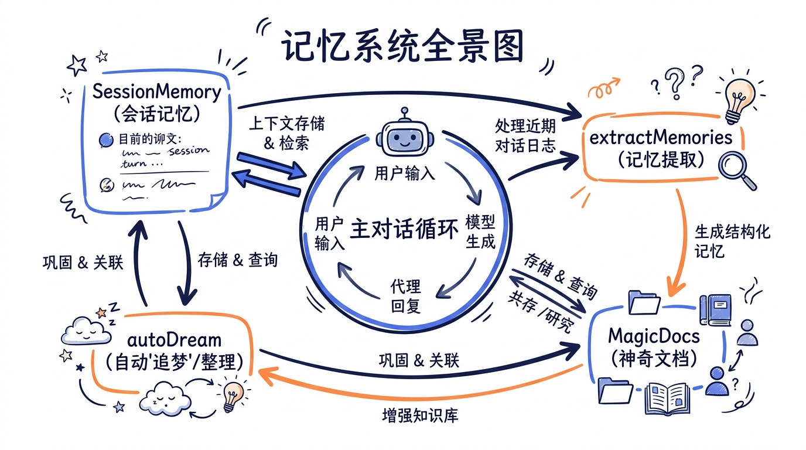
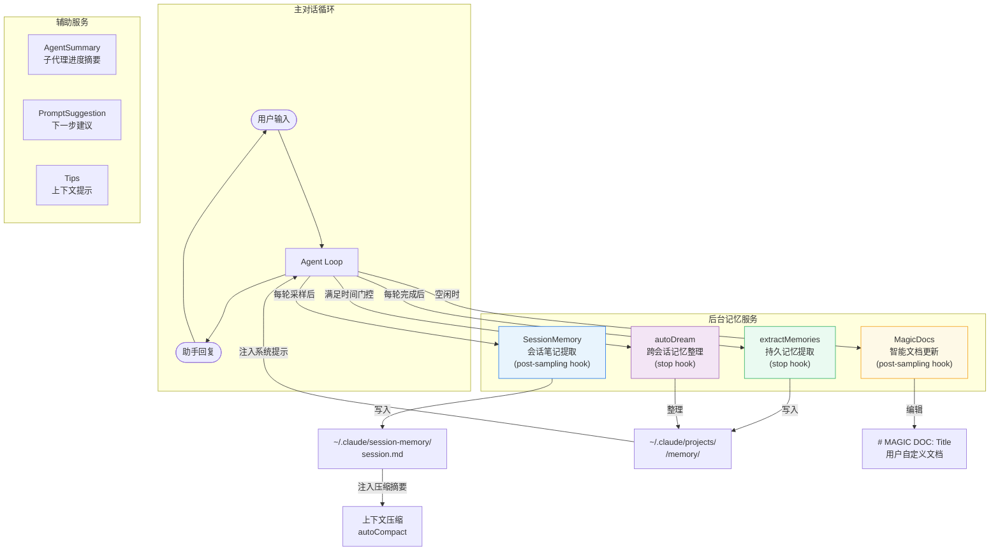
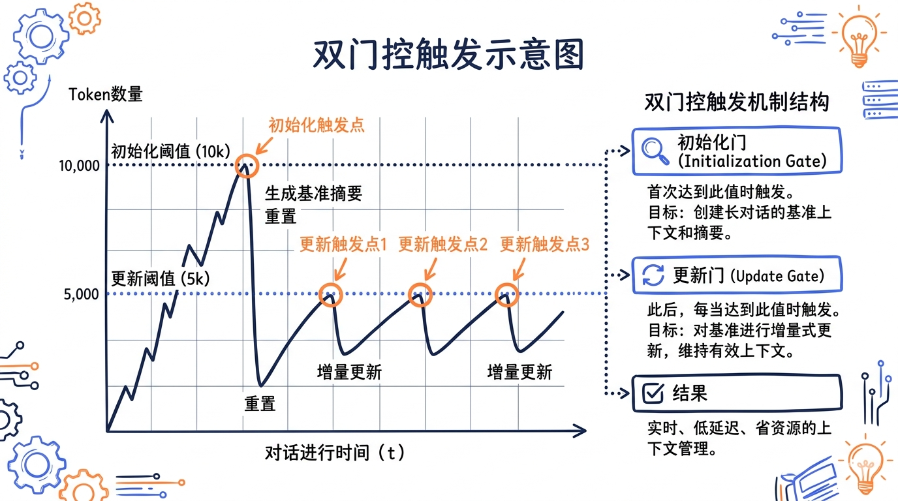
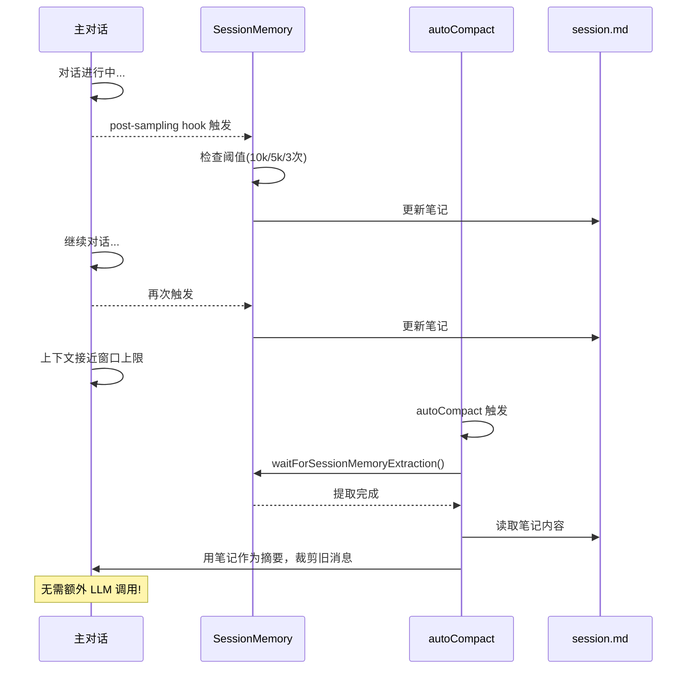
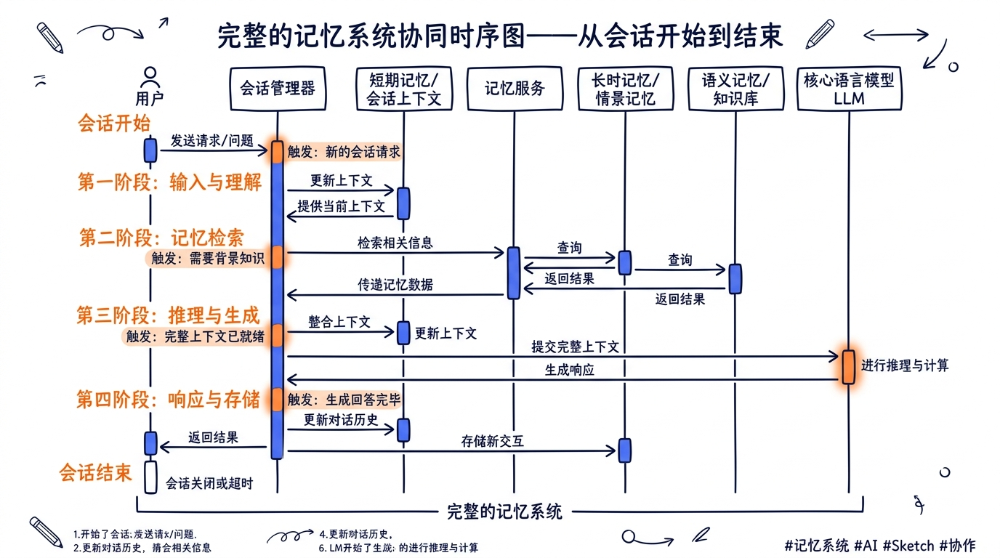

---
layout: default
title: "Ch09 记忆系统与智能文档"
nav_order: 32
parent: "模块三：上下文与记忆"
---


# 第九章：记忆系统与智能文档（SessionMemory / MagicDocs）


> 人的大脑不会记住每一句对话的原文，它会在你睡觉时自动整理白天的经历，把重要的碎片编织成长期记忆，把无关紧要的细节悄悄丢掉。Claude Code 的记忆系统做的是同一件事——只不过它不需要睡觉，它用的是后台 subagent。

前面几章我们看到了上下文压缩（compact）如何在对话膨胀时"删减"历史消息。但压缩只是硬币的一面：它解决的是"上下文塞不下"的问题，却没有回答"压缩掉的信息去了哪里"。如果压缩就是遗忘，那长对话必然越来越蠢。

Claude Code 的答案是：**压缩不是丢弃，而是转移**。被压缩掉的对话内容，早在压缩发生之前就已经被后台 subagent 提取到了持久化的记忆文件中。压缩时，系统把这些记忆文件的内容重新注入为"会话摘要"，实现了信息从对话历史到记忆层的无缝流转。

本章将完整拆解这个记忆系统的五个组成部分，以及它们如何协同工作。





---

## 一、SessionMemory：会话级笔记系统

SessionMemory 是 Claude Code 记忆系统的第一层。它的职责很明确：在对话进行过程中，定期用后台 subagent 把对话内容提炼成结构化的笔记，写入一个 Markdown 文件。当上下文压缩发生时，这个笔记文件就成了"压缩摘要"的核心来源。

### 1.1 核心数据结构与模板

SessionMemory 的笔记文件有固定的结构模板。每次会话开始时，如果笔记文件不存在，系统会用这个模板初始化：

```typescript
// 文件: src/services/SessionMemory/prompts.ts

const MAX_SECTION_LENGTH = 2000
const MAX_TOTAL_SESSION_MEMORY_TOKENS = 12000

export const DEFAULT_SESSION_MEMORY_TEMPLATE = `
# Session Title
_A short and distinctive 5-10 word descriptive title for the session._

# Current State
_What is actively being worked on right now? Pending tasks not yet completed._

# Task specification
_What did the user ask to build? Any design decisions or other explanatory context_

# Files and Functions
_What are the important files? What do they contain and why are they relevant?_

# Workflow
_What bash commands are usually run and in what order?_

# Errors & Corrections
_Errors encountered and how they were fixed. What approaches failed?_

# Codebase and System Documentation
_What are the important system components? How do they work/fit together?_

# Learnings
_What has worked well? What has not? What to avoid?_

# Key results
_If the user asked a specific output, repeat the exact result here_

# Worklog
_Step by step, what was attempted, done? Very terse summary for each step_
`
```

这个模板设计得非常讲究。九个 section 覆盖了一次编程会话中所有可能需要"记住"的维度：

| Section | 记录什么 | 为什么重要 |
|---------|---------|-----------|
| Session Title | 会话的简短描述性标题 | 快速识别会话主题 |
| Current State | 当前正在做什么，待完成的任务 | **压缩后恢复工作状态的关键** |
| Task specification | 用户的原始需求和设计决策 | 防止压缩后丢失任务上下文 |
| Files and Functions | 重要文件及其作用 | 保留代码导航信息 |
| Workflow | 常用命令和执行顺序 | 保留操作流程 |
| Errors & Corrections | 遇到的错误和修复方式 | 避免重复犯错 |
| Codebase and System Documentation | 系统架构理解 | 保留对代码库的宏观认知 |
| Learnings | 什么方法有效/无效 | 经验积累 |
| Key results | 用户要求的具体输出 | 完整保留关键结果 |
| Worklog | 工作日志 | 保留操作时间线 |

每个 section 有 2000 token 的软上限，整个文件有 12000 token 的总上限。超出时，后台 subagent 会被指令进行压缩。

### 1.2 触发机制：什么时候提取记忆

SessionMemory 不是每轮对话都运行的。它有一个精心设计的双门控触发机制：

```typescript
// 文件: src/services/SessionMemory/sessionMemory.ts

export function shouldExtractMemory(messages: Message[]): boolean {
  const currentTokenCount = tokenCountWithEstimation(messages)

  // 门控 1: 初始化阈值——上下文至少达到 10000 tokens 才启动
  if (!isSessionMemoryInitialized()) {
    if (!hasMetInitializationThreshold(currentTokenCount)) {
      return false
    }
    markSessionMemoryInitialized()
  }

  // 门控 2a: token 增长阈值——自上次提取以来增长了至少 5000 tokens
  const hasMetTokenThreshold = hasMetUpdateThreshold(currentTokenCount)

  // 门控 2b: 工具调用阈值——自上次提取以来至少有 3 次工具调用
  const toolCallsSinceLastUpdate = countToolCallsSince(
    messages, lastMemoryMessageUuid,
  )
  const hasMetToolCallThreshold =
    toolCallsSinceLastUpdate >= getToolCallsBetweenUpdates()

  // 触发条件:
  // (token增长 AND 工具调用足够) OR (token增长 AND 对话处于空闲)
  const hasToolCallsInLastTurn = hasToolCallsInLastAssistantTurn(messages)
  const shouldExtract =
    (hasMetTokenThreshold && hasMetToolCallThreshold) ||
    (hasMetTokenThreshold && !hasToolCallsInLastTurn)

  return shouldExtract
}
```

这个触发策略背后的设计思路值得细品：



```
对话进程 ─────────────────────────────────────────────────►
                                                        时间
token 数  ┌─────────────────────────────────────────────
          │
 30k ──── │                                    ▲ 第3次提取
          │                               ╱╱╱╱│
 25k ──── │                          ╱╱╱╱╱    │
          │                     ╱╱╱╱╱          │
 20k ──── │                ▲╱╱╱╱               │
          │           ╱╱╱╱ │ 第2次提取          │
 15k ──── │      ╱╱╱╱╱     │                   │
          │ ▲╱╱╱╱          │                   │
 10k ──── │ │ 第1次提取     │                   │
          │ │ (初始化)      │                   │
  5k ──── │╱               │                   │
          │                │                   │
  0  ─────┼────────────────┼───────────────────┼──
          开始             +5k tokens          +5k tokens
```

**初始化阈值（10000 tokens）**：对话刚开始时，内容太少，没有什么值得提取的。等到上下文积累到一定量级才启动首次提取。

**更新阈值（5000 tokens）**：每次提取后，要等上下文再增长 5000 tokens 才触发下次提取。这个阈值是基于上下文窗口的实际增长量（而非累计 API 消耗），和 autoCompact 使用相同的计量方式。

**工具调用阈值（3 次）**：token 增长是必要条件，但不充分。还需要至少 3 次工具调用。这防止了"用户发了一大段文字但 Agent 还没开始干活"时就急着提取。

**空闲检测**：如果最后一轮助手回复没有工具调用（说明 Agent 刚完成了一个任务），即使工具调用阈值没满，只要 token 阈值满了就立即提取。这确保了在"自然断点"处抓住提取机会。

这些默认值可以通过远程配置（GrowthBook）动态调整：

```typescript
// 文件: src/services/SessionMemory/sessionMemoryUtils.ts

export const DEFAULT_SESSION_MEMORY_CONFIG: SessionMemoryConfig = {
  minimumMessageTokensToInit: 10000,   // 初始化阈值
  minimumTokensBetweenUpdate: 5000,    // 更新间隔
  toolCallsBetweenUpdates: 3,          // 工具调用间隔
}
```

### 1.3 提取流程：forked subagent 模式

SessionMemory 的提取通过 `runForkedAgent` 运行。这是一个"完美分叉"的 subagent——它和主对话共享同一个 prompt cache，但在完全隔离的上下文中执行：

```typescript
// 文件: src/services/SessionMemory/sessionMemory.ts

const extractSessionMemory = sequential(async function (
  context: REPLHookContext,
): Promise<void> {
  const { messages, toolUseContext, querySource } = context

  // 只在主 REPL 线程上运行
  if (querySource !== 'repl_main_thread') return

  // 检查 feature gate
  if (!isSessionMemoryGateEnabled()) return

  // 初始化远程配置（懒加载，仅一次）
  initSessionMemoryConfigIfNeeded()

  // 检查是否满足触发条件
  if (!shouldExtractMemory(messages)) return

  markExtractionStarted()

  // 创建隔离的上下文
  const setupContext = createSubagentContext(toolUseContext)

  // 初始化笔记文件并读取当前内容
  const { memoryPath, currentMemory } =
    await setupSessionMemoryFile(setupContext)

  // 构建提取提示词
  const userPrompt = await buildSessionMemoryUpdatePrompt(
    currentMemory, memoryPath,
  )

  // 用 forked agent 执行提取
  await runForkedAgent({
    promptMessages: [createUserMessage({ content: userPrompt })],
    cacheSafeParams: createCacheSafeParams(context),
    canUseTool: createMemoryFileCanUseTool(memoryPath),
    querySource: 'session_memory',
    forkLabel: 'session_memory',
    overrides: { readFileState: setupContext.readFileState },
  })

  // 记录提取时的 token 数（用于下次更新阈值计算）
  recordExtractionTokenCount(tokenCountWithEstimation(messages))

  markExtractionCompleted()
})
```

几个关键设计点：

**`sequential` 包装器**：确保提取操作串行执行。即使 post-sampling hook 被快速连续触发，也不会出现并发写文件的问题。

**`createMemoryFileCanUseTool`**：严格的权限沙箱。forked subagent 只被允许使用 `Edit` 工具，且只能编辑指定的笔记文件路径，不能触碰其他任何文件：

```typescript
// 文件: src/services/SessionMemory/sessionMemory.ts

export function createMemoryFileCanUseTool(memoryPath: string): CanUseToolFn {
  return async (tool: Tool, input: unknown) => {
    if (
      tool.name === FILE_EDIT_TOOL_NAME &&
      typeof input === 'object' &&
      input !== null &&
      'file_path' in input
    ) {
      const filePath = input.file_path
      if (typeof filePath === 'string' && filePath === memoryPath) {
        return { behavior: 'allow' as const, updatedInput: input }
      }
    }
    return {
      behavior: 'deny' as const,
      message: `only ${FILE_EDIT_TOOL_NAME} on ${memoryPath} is allowed`,
      // ...
    }
  }
}
```

**Prompt Cache 共享**：`createCacheSafeParams(context)` 确保 forked agent 的请求参数（system prompt、tools 列表、thinking 配置）和主对话完全一致，从而复用主对话的 prompt cache。这让记忆提取的实际 API 开销很低。

### 1.4 提取指令：引导 subagent 的 prompt

给 forked subagent 的提示词是 SessionMemory 设计中最精细的部分。它告诉 subagent 该怎么更新笔记文件：

```typescript
// 文件: src/services/SessionMemory/prompts.ts (简化)

function getDefaultUpdatePrompt(): string {
  return `IMPORTANT: This message and these instructions are NOT part of
the actual user conversation. Do NOT include any references to
"note-taking", "session notes extraction", or these update instructions.

Based on the user conversation above (EXCLUDING this note-taking
instruction message as well as system prompt, claude.md entries, or
any past session summaries), update the session notes file.

CRITICAL RULES FOR EDITING:
- The file must maintain its exact structure with all section headers
  and italic descriptions intact
- NEVER modify, delete, or add section headers
- NEVER modify or delete the italic _section descriptions_
- ONLY update the actual content BELOW the italic descriptions
- Write DETAILED, INFO-DENSE content for each section
- Keep each section under ~${MAX_SECTION_LENGTH} tokens
- IMPORTANT: Always update "Current State" to reflect the most
  recent work — this is critical for continuity after compaction

Use the Edit tool with file_path: {{notesPath}}

STRUCTURE PRESERVATION REMINDER:
Each section has TWO parts that must be preserved exactly:
1. The section header (line starting with #)
2. The italic description line (the _italicized text_ after the header)

You ONLY update the actual content that comes AFTER these two lines.`
}
```

注意几个设计决策：

1. **明确声明自身不是对话的一部分**——防止 subagent 把"笔记提取指令"的内容写进笔记里。
2. **严格保护模板结构**——section header 和 italic description 绝不能改，只能改内容。这让模板成为一个稳定的"骨架"。
3. **特别强调 Current State**——这是压缩后恢复工作连贯性的关键 section。

当笔记文件的某些 section 超过了 token 上限时，prompt 会动态追加警告：

```typescript
// 文件: src/services/SessionMemory/prompts.ts

function generateSectionReminders(
  sectionSizes: Record<string, number>,
  totalTokens: number,
): string {
  const overBudget = totalTokens > MAX_TOTAL_SESSION_MEMORY_TOKENS
  const oversizedSections = Object.entries(sectionSizes)
    .filter(([_, tokens]) => tokens > MAX_SECTION_LENGTH)

  if (overBudget) {
    parts.push(
      `CRITICAL: The session memory file is currently ~${totalTokens} tokens,
       which exceeds the maximum of ${MAX_TOTAL_SESSION_MEMORY_TOKENS} tokens.
       You MUST condense the file to fit within this budget.`
    )
  }
  // ...
}
```

### 1.5 自定义模板与提示词

SessionMemory 支持用户自定义。你可以在 `~/.claude/session-memory/config/` 目录下放置自己的模板和提示词：

```
~/.claude/session-memory/config/
  ├── template.md     # 自定义笔记模板（替代默认的 9 个 section）
  └── prompt.md       # 自定义提取提示词（使用 {{variable}} 语法）
```

加载逻辑会优先读取自定义文件，不存在则回退到默认：

```typescript
// 文件: src/services/SessionMemory/prompts.ts

export async function loadSessionMemoryTemplate(): Promise<string> {
  const templatePath = join(
    getClaudeConfigHomeDir(), 'session-memory', 'config', 'template.md',
  )
  try {
    return await readFile(templatePath, { encoding: 'utf-8' })
  } catch (e: unknown) {
    const code = getErrnoCode(e)
    if (code === 'ENOENT') {
      return DEFAULT_SESSION_MEMORY_TEMPLATE  // 回退到默认
    }
    return DEFAULT_SESSION_MEMORY_TEMPLATE
  }
}
```

### 1.6 与上下文压缩的协同

这是整个记忆系统最精妙的部分：SessionMemory 和 autoCompact 的协同工作。

当 autoCompact 触发时，系统会检查 SessionMemory 的内容是否可用。如果可用，就直接用 SessionMemory 的笔记替代传统的 LLM 摘要压缩：

```typescript
// 文件: src/services/compact/sessionMemoryCompact.ts (简化)

export async function trySessionMemoryCompaction(
  messages: Message[],
): Promise<CompactionResult | null> {
  // 检查 feature gate
  if (!shouldUseSessionMemoryCompaction()) return null

  // 等待正在进行的提取完成
  await waitForSessionMemoryExtraction()

  // 读取 SessionMemory 内容
  const sessionMemory = await getSessionMemoryContent()
  if (!sessionMemory) return null
  if (await isSessionMemoryEmpty(sessionMemory)) return null

  // 根据 lastSummarizedMessageId 确定哪些消息已被记忆覆盖
  const lastSummarizedIndex = messages.findIndex(
    msg => msg.uuid === lastSummarizedMessageId,
  )

  // 计算保留的消息范围
  const startIndex = calculateMessagesToKeepIndex(messages, lastSummarizedIndex)
  const messagesToKeep = messages.slice(startIndex)

  // 用 SessionMemory 内容构建压缩结果（无需再调 LLM）
  return createCompactionResultFromSessionMemory(
    messages, sessionMemory, messagesToKeep, ...
  )
}
```

**关键洞察**：传统的上下文压缩需要调用一次 LLM 来生成摘要。而 SessionMemory 模式下，笔记文件已经在后台逐步维护好了，压缩时直接读取文件即可，**省掉了压缩时的 LLM 调用**。这不仅更快，而且因为笔记是在有完整上下文时提取的，质量通常比事后回顾式的摘要更高。



`waitForSessionMemoryExtraction` 的等待机制也很有趣——最多等 15 秒，如果提取已经在进行超过 1 分钟（可能卡住了），则不再等待：

```typescript
// 文件: src/services/SessionMemory/sessionMemoryUtils.ts

const EXTRACTION_WAIT_TIMEOUT_MS = 15000
const EXTRACTION_STALE_THRESHOLD_MS = 60000

export async function waitForSessionMemoryExtraction(): Promise<void> {
  const startTime = Date.now()
  while (extractionStartedAt) {
    const extractionAge = Date.now() - extractionStartedAt
    if (extractionAge > EXTRACTION_STALE_THRESHOLD_MS) return  // 陈旧，放弃等待
    if (Date.now() - startTime > EXTRACTION_WAIT_TIMEOUT_MS) return  // 超时
    await sleep(1000)
  }
}
```

压缩时还有一个安全机制——如果某些 section 过长，会在注入前进行截断，防止会话记忆占掉压缩后的全部 token 预算：

```typescript
// 文件: src/services/SessionMemory/prompts.ts

export function truncateSessionMemoryForCompact(content: string): {
  truncatedContent: string
  wasTruncated: boolean
} {
  // 按 section 逐个检查，超过 MAX_SECTION_LENGTH * 4 字符的截断
  // 在行边界处截断，追加 "[... section truncated for length ...]"
}
```

---

## 二、extractMemories：跨会话持久记忆

如果说 SessionMemory 是"会话级笔记本"，那 extractMemories 就是"长期记忆库"。SessionMemory 的内容只在当前会话中有效；extractMemories 把真正值得长期保留的信息写入磁盘上的记忆文件，在未来的所有会话中都可以被召回。

### 2.1 记忆类型分类

extractMemories 使用一个四类型分类体系来组织记忆：

```typescript
// 文件: src/memdir/memoryTypes.ts

export const MEMORY_TYPES = ['user', 'feedback', 'project', 'reference'] as const
```

| 类型 | 存储内容 | 示例 |
|------|---------|------|
| `user` | 用户的角色、目标、偏好、知识水平 | "用户是数据科学家，目前专注于日志和可观测性" |
| `feedback` | 用户对 Agent 行为的纠正或确认 | "不要 mock 数据库，之前 mock 测试通过但线上迁移失败了" |
| `project` | 项目的进行中工作、目标、截止日期 | "周四后冻结所有非关键合并——移动团队要切分支" |
| `reference` | 外部系统中信息的位置指向 | "Pipeline bug 在 Linear 的 INGEST 项目中跟踪" |

分类体系的核心原则是：**只存储无法从当前项目状态推导出来的信息**。代码模式、架构、git 历史、文件结构——这些都可以通过 grep/git/读代码获得，不应该变成记忆。

```typescript
// 文件: src/memdir/memoryTypes.ts

export const WHAT_NOT_TO_SAVE_SECTION: readonly string[] = [
  '## What NOT to save in memory',
  '',
  '- Code patterns, conventions, architecture, file paths, or project structure',
  '- Git history, recent changes, or who-changed-what',
  '- Debugging solutions or fix recipes — the fix is in the code',
  '- Anything already documented in CLAUDE.md files',
  '- Ephemeral task details: in-progress work, temporary state',
]
```

### 2.2 记忆文件格式

每个记忆是一个独立的 Markdown 文件，带有 YAML frontmatter：

```markdown
---
name: database-testing-policy
description: Integration tests must hit real database, not mocks
type: feedback
---

Integration tests must use a real database, not mocks.

**Why:** Prior incident where mock/prod divergence masked a broken migration.

**How to apply:** Any time writing or reviewing test code that interacts
with the database layer, use real database connections.
```

记忆文件存储在 `~/.claude/projects/<project-path>/memory/` 目录下，加上一个 `MEMORY.md` 索引文件作为入口点。索引文件每行一条记录，控制在 150 字符以内：

```markdown
- [Database Testing Policy](database-testing-policy.md) — use real DB, not mocks
- [User Profile](user_role.md) — data scientist, focused on observability
```

### 2.3 提取流程

extractMemories 的执行时机和 SessionMemory 不同。它在每轮查询循环结束时（stop hook）触发，而非每次采样后：

```typescript
// 文件: src/services/extractMemories/extractMemories.ts (简化)

export function initExtractMemories(): void {
  // 闭包作用域的可变状态
  let lastMemoryMessageUuid: string | undefined
  let inProgress = false
  let turnsSinceLastExtraction = 0
  let pendingContext: { context: REPLHookContext } | undefined

  async function runExtraction({ context, isTrailingRun }) {
    const memoryDir = getAutoMemPath()

    // 互斥: 如果主 Agent 已经直接写了记忆文件，跳过
    if (hasMemoryWritesSince(messages, lastMemoryMessageUuid)) {
      lastMemoryMessageUuid = messages.at(-1)?.uuid
      return
    }

    // 频率控制: 每 N 个合格 turn 才执行一次
    if (!isTrailingRun) {
      turnsSinceLastExtraction++
      if (turnsSinceLastExtraction < throttleInterval) return
    }
    turnsSinceLastExtraction = 0

    inProgress = true
    try {
      // 预注入现有记忆文件清单（省去一轮 ls）
      const existingMemories = formatMemoryManifest(
        await scanMemoryFiles(memoryDir, signal),
      )

      // 构建提取 prompt
      const userPrompt = buildExtractAutoOnlyPrompt(
        newMessageCount, existingMemories, skipIndex,
      )

      // 运行 forked agent
      const result = await runForkedAgent({
        promptMessages: [createUserMessage({ content: userPrompt })],
        cacheSafeParams,
        canUseTool,
        querySource: 'extract_memories',
        forkLabel: 'extract_memories',
        skipTranscript: true,
        maxTurns: 5,  // 硬上限防止失控
      })

      // 提取写入的文件路径
      const writtenPaths = extractWrittenPaths(result.messages)

      // 通知主线程
      if (memoryPaths.length > 0) {
        appendSystemMessage?.(createMemorySavedMessage(memoryPaths))
      }
    } finally {
      inProgress = false
      // 如果有积压的上下文，执行尾随提取
      if (pendingContext) {
        const trailing = pendingContext
        pendingContext = undefined
        await runExtraction({ context: trailing.context, isTrailingRun: true })
      }
    }
  }
}
```

### 2.4 工具权限沙箱

extractMemories 的 subagent 比 SessionMemory 的权限范围更大一些，但仍然受到严格约束：

```typescript
// 文件: src/services/extractMemories/extractMemories.ts

export function createAutoMemCanUseTool(memoryDir: string): CanUseToolFn {
  return async (tool: Tool, input: Record<string, unknown>) => {
    // 允许 REPL（因为 REPL 模式下工具通过 REPL 调用）
    if (tool.name === REPL_TOOL_NAME)
      return { behavior: 'allow', updatedInput: input }

    // 允许只读工具：Read、Grep、Glob
    if ([FILE_READ_TOOL_NAME, GREP_TOOL_NAME, GLOB_TOOL_NAME]
        .includes(tool.name))
      return { behavior: 'allow', updatedInput: input }

    // 允许只读 Bash 命令
    if (tool.name === BASH_TOOL_NAME) {
      const parsed = tool.inputSchema.safeParse(input)
      if (parsed.success && tool.isReadOnly(parsed.data))
        return { behavior: 'allow', updatedInput: input }
      return denyAutoMemTool(tool, 'Only read-only shell commands are permitted')
    }

    // 允许 Edit/Write，但仅限记忆目录内的路径
    if ((tool.name === FILE_EDIT_TOOL_NAME || tool.name === FILE_WRITE_TOOL_NAME)
        && 'file_path' in input) {
      if (typeof input.file_path === 'string' && isAutoMemPath(input.file_path))
        return { behavior: 'allow', updatedInput: input }
    }

    // 其他一切拒绝
    return denyAutoMemTool(tool, '...')
  }
}
```

这个权限设计的逻辑很清晰：

- **读取任意文件**：允许。subagent 需要理解代码库才能判断什么值得记住。
- **只读 shell 命令**：允许。`ls`、`find`、`grep`、`cat` 等。
- **写入记忆目录**：允许。这是它的本职工作。
- **写入其他位置**：拒绝。subagent 不能修改用户的代码。
- **非只读 shell 命令**：拒绝。不能 `rm`、不能 `git commit`。

### 2.5 主 Agent 与 subagent 的互斥

一个重要的设计：主 Agent 的系统提示词中也有保存记忆的指令。当用户说"记住这个"时，主 Agent 可以直接写记忆文件。extractMemories 的 subagent 不应该在同一轮再做一次重复的提取：

```typescript
// 文件: src/services/extractMemories/extractMemories.ts

function hasMemoryWritesSince(
  messages: Message[],
  sinceUuid: string | undefined,
): boolean {
  // 检查自上次提取以来，主 Agent 是否有 Edit/Write 操作
  // 目标路径在 auto-memory 目录内
  for (const message of messages) {
    if (message.type !== 'assistant') continue
    for (const block of message.message.content) {
      const filePath = getWrittenFilePath(block)
      if (filePath !== undefined && isAutoMemPath(filePath))
        return true
    }
  }
  return false
}
```

如果检测到主 Agent 已经写了记忆，subagent 会跳过本轮提取并推进游标，确保两者不会互相冲突。

### 2.6 记忆扫描与格式化

记忆文件的扫描是一个高效的单遍操作：

```typescript
// 文件: src/memdir/memoryScan.ts

export async function scanMemoryFiles(
  memoryDir: string,
  signal: AbortSignal,
): Promise<MemoryHeader[]> {
  const entries = await readdir(memoryDir, { recursive: true })
  const mdFiles = entries.filter(
    f => f.endsWith('.md') && basename(f) !== 'MEMORY.md',
  )

  // 并行读取所有文件的 frontmatter（只读前 30 行）
  const headerResults = await Promise.allSettled(
    mdFiles.map(async (relativePath): Promise<MemoryHeader> => {
      const { content, mtimeMs } = await readFileInRange(
        filePath, 0, FRONTMATTER_MAX_LINES, undefined, signal,
      )
      const { frontmatter } = parseFrontmatter(content, filePath)
      return {
        filename: relativePath,
        filePath,
        mtimeMs,
        description: frontmatter.description || null,
        type: parseMemoryType(frontmatter.type),
      }
    }),
  )

  // 按修改时间降序排列，最多保留 200 个
  return results.sort((a, b) => b.mtimeMs - a.mtimeMs).slice(0, 200)
}
```

扫描结果会被格式化为文本清单，注入到 subagent 的 prompt 中，让它知道已有哪些记忆文件，避免创建重复：

```
- [feedback] database-testing-policy.md (2026-04-20T10:30:00Z): use real DB
- [user] user_role.md (2026-04-19T15:00:00Z): data scientist
- [project] merge-freeze.md (2026-04-18T09:00:00Z): freeze after Thursday
```

---

## 三、MagicDocs：智能自更新文档

MagicDocs 是一种"活的文档"机制。你在任何 Markdown 文件的开头写上 `# MAGIC DOC: <标题>`，Claude Code 就会在对话过程中自动用学到的新信息更新这个文件。

### 3.1 发现机制

MagicDocs 的发现是被动的——当用户通过 `FileReadTool` 读取了一个文件时，系统检查文件内容是否包含 Magic Doc 头部：

```typescript
// 文件: src/services/MagicDocs/magicDocs.ts

const MAGIC_DOC_HEADER_PATTERN = /^#\s*MAGIC\s+DOC:\s*(.+)$/im
const ITALICS_PATTERN = /^[_*](.+?)[_*]\s*$/m

export function detectMagicDocHeader(
  content: string,
): { title: string; instructions?: string } | null {
  const match = content.match(MAGIC_DOC_HEADER_PATTERN)
  if (!match || !match[1]) return null

  const title = match[1].trim()

  // 检查标题下方是否有斜体的自定义指令
  const nextLineMatch = afterHeader.match(/^\s*\n(?:\s*\n)?(.+?)(?:\n|$)/)
  if (nextLineMatch && nextLineMatch[1]) {
    const italicsMatch = nextLineMatch[1].match(ITALICS_PATTERN)
    if (italicsMatch && italicsMatch[1]) {
      return { title, instructions: italicsMatch[1].trim() }
    }
  }

  return { title }
}
```

发现后的文件路径被注册到一个 Map 中。检测是一次性的——同一个路径只注册一次：

```typescript
// 文件: src/services/MagicDocs/magicDocs.ts

const trackedMagicDocs = new Map<string, MagicDocInfo>()

export function registerMagicDoc(filePath: string): void {
  if (!trackedMagicDocs.has(filePath)) {
    trackedMagicDocs.set(filePath, { path: filePath })
  }
}
```

初始化时，通过 `registerFileReadListener` 在文件读取管线上挂钩：

```typescript
// 文件: src/services/MagicDocs/magicDocs.ts

export async function initMagicDocs(): Promise<void> {
  // 注册文件读取监听器
  registerFileReadListener((filePath: string, content: string) => {
    const result = detectMagicDocHeader(content)
    if (result) {
      registerMagicDoc(filePath)
    }
  })

  // 注册 post-sampling hook
  registerPostSamplingHook(updateMagicDocs)
}
```

### 3.2 更新流程

MagicDocs 的更新也通过 post-sampling hook 触发，但和 SessionMemory 有一个重要区别：**只在对话空闲时更新**（即最后一轮助手回复没有工具调用）。这避免了在 Agent 执行多步任务的中间打断更新文档。

```typescript
// 文件: src/services/MagicDocs/magicDocs.ts

const updateMagicDocs = sequential(async function (
  context: REPLHookContext,
): Promise<void> {
  if (querySource !== 'repl_main_thread') return

  // 只在空闲时更新
  if (hasToolCallsInLastAssistantTurn(messages)) return

  if (trackedMagicDocs.size === 0) return

  // 逐个更新
  for (const docInfo of trackedMagicDocs.values()) {
    await updateMagicDoc(docInfo, context)
  }
})
```

每个 Magic Doc 的更新使用 `runAgent`（而不是 `runForkedAgent`）来执行。subagent 的权限被限制为只能 Edit 该文档文件本身：

```typescript
// 文件: src/services/MagicDocs/magicDocs.ts

async function updateMagicDoc(docInfo, context) {
  // 重新读取文件，获取最新内容
  const result = await FileReadTool.call(
    { file_path: docInfo.path }, clonedToolUseContext,
  )

  // 重新检测 Magic Doc 头部（文件可能已被修改或删除标记）
  const detected = detectMagicDocHeader(currentDoc)
  if (!detected) {
    trackedMagicDocs.delete(docInfo.path)  // 标记已移除，取消跟踪
    return
  }

  // 构建更新 prompt
  const userPrompt = await buildMagicDocsUpdatePrompt(
    currentDoc, docInfo.path, detected.title, detected.instructions,
  )

  // 运行 subagent
  for await (const _message of runAgent({
    agentDefinition: getMagicDocsAgent(),
    promptMessages: [createUserMessage({ content: userPrompt })],
    canUseTool,  // 只允许 Edit 这个文件
    isAsync: true,
    querySource: 'magic_docs',
    // ...
  })) {
    // 消费完所有消息
  }
}
```

### 3.3 更新 prompt 的设计哲学

MagicDocs 的更新 prompt 体现了一种明确的文档哲学：

```typescript
// 文件: src/services/MagicDocs/prompts.ts (节选)

// DOCUMENTATION PHILOSOPHY:
// - BE TERSE. High signal only. No filler words.
// - Documentation is for OVERVIEWS, ARCHITECTURE, and ENTRY POINTS
// - Do NOT duplicate information obvious from reading the source code
// - Focus on: WHY things exist, HOW components connect,
//             WHERE to start reading, WHAT patterns are used
// - Skip: detailed implementation steps, exhaustive API docs
```

关键规则还包括：

- **保持当前状态**：文档应反映代码库的当前状态，不是变更日志
- **就地更新**：修改现有内容而不是追加历史记录
- **清理过时内容**：删除不再相关的 section
- **修正错误**：修复错别字、语法错误、过时信息

用户可以通过 `~/.claude/magic-docs/prompt.md` 提供自定义 prompt，并使用 `{{variable}}` 语法引用变量。

### 3.4 自定义更新指令

Magic Doc 的标题下方如果有斜体文本，会被解析为文档特定的更新指令：

```markdown
# MAGIC DOC: API Architecture
_Focus on request flow, middleware chain, and error handling patterns_

## Request Lifecycle
...
```

斜体行 `_Focus on request flow..._` 会被提取出来，在更新 prompt 中以高优先级注入：

```typescript
// 文件: src/services/MagicDocs/prompts.ts

const customInstructions = instructions
  ? `DOCUMENT-SPECIFIC UPDATE INSTRUCTIONS:
     The document author has provided specific instructions for how this
     file should be updated. Pay extra attention to these instructions
     and follow them carefully:
     "${instructions}"
     These instructions take priority over the general rules below.`
  : ''
```

这让每个 Magic Doc 可以有自己独特的更新策略。

---

## 四、autoDream：Agent 的"做梦"机制

人在睡觉时会通过做梦整理白天的记忆。Claude Code 的 autoDream 做的是同一件事——在满足一定条件时，自动启动一个后台 subagent 来整理和优化已有的记忆文件。

### 4.1 门控设计

autoDream 有三层门控，按计算成本从低到高排列：

```typescript
// 文件: src/services/autoDream/autoDream.ts

runner = async function runAutoDream(context, appendSystemMessage) {
  const cfg = getConfig()

  // --- 前置检查 ---
  if (!isGateOpen()) return      // KAIROS/远程模式/未启用

  // --- 门控 1: 时间门控（一次 stat 调用）---
  const lastAt = await readLastConsolidatedAt()
  const hoursSince = (Date.now() - lastAt) / 3_600_000
  if (hoursSince < cfg.minHours) return  // 默认 24 小时

  // --- 扫描节流: 10 分钟内不重复扫描 ---
  if (sinceScanMs < SESSION_SCAN_INTERVAL_MS) return

  // --- 门控 2: 会话数门控 ---
  const sessionIds = await listSessionsTouchedSince(lastAt)
  // 排除当前会话
  sessionIds = sessionIds.filter(id => id !== currentSession)
  if (sessionIds.length < cfg.minSessions) return  // 默认 5 个

  // --- 门控 3: 锁（防止并发整理）---
  const priorMtime = await tryAcquireConsolidationLock()
  if (priorMtime === null) return

  // 所有门控通过，开始做梦
  // ...
}
```

门控顺序是精心设计的：

1. **时间门控**：一次 `stat` 调用，几乎零成本。大多数情况在这里就被拦住了。
2. **扫描节流**：即使时间门控通过，10 分钟内也只扫描一次会话目录。防止每轮对话都执行目录扫描。
3. **会话数门控**：扫描 transcript 目录，统计自上次整理以来有多少个新会话。不够就不整理。
4. **锁机制**：使用文件锁确保同一时间只有一个进程在执行整理。

默认配置是"距上次整理超过 24 小时 + 至少 5 个新会话"才触发。这些值可以通过 GrowthBook 远程调整：

```typescript
// 文件: src/services/autoDream/autoDream.ts

const DEFAULTS: AutoDreamConfig = {
  minHours: 24,
  minSessions: 5,
}
```

### 4.2 锁机制

autoDream 的锁机制非常巧妙——它用锁文件的 **mtime 作为 lastConsolidatedAt 的存储**，锁文件的内容是持有者的 PID：

```typescript
// 文件: src/services/autoDream/consolidationLock.ts

const LOCK_FILE = '.consolidate-lock'
const HOLDER_STALE_MS = 60 * 60 * 1000  // 1 小时

// 读取上次整理时间 = 读取锁文件的 mtime
export async function readLastConsolidatedAt(): Promise<number> {
  try {
    const s = await stat(lockPath())
    return s.mtimeMs
  } catch {
    return 0  // 文件不存在 = 从未整理过
  }
}

// 获取锁：写入 PID，mtime 自动更新为当前时间
export async function tryAcquireConsolidationLock(): Promise<number | null> {
  // 1. 检查现有锁是否被活跃进程持有
  // 2. 如果持有者已死亡或锁已陈旧，可以回收
  // 3. 写入自己的 PID
  // 4. 再读一次确认是自己写的（防竞争）
  await writeFile(path, String(process.pid))
  const verify = await readFile(path, 'utf8')
  if (parseInt(verify.trim(), 10) !== process.pid) return null
  return mtimeMs ?? 0
}
```

三种结果场景：

- **成功完成整理**：mtime 保持为整理开始时间（自然更新了 lastConsolidatedAt）
- **失败**：调用 `rollbackConsolidationLock(priorMtime)` 把 mtime 回退到获取锁之前的值
- **进程崩溃**：mtime 停留在获取锁的时间，但 PID 已死。下一个进程发现 PID 已死后可以回收

```typescript
// 文件: src/services/autoDream/consolidationLock.ts

export async function rollbackConsolidationLock(
  priorMtime: number,
): Promise<void> {
  if (priorMtime === 0) {
    await unlink(path)  // 回退到"从未整理过"
    return
  }
  await writeFile(path, '')     // 清空 PID，避免被误认为在持有
  const t = priorMtime / 1000   // utimes 需要秒
  await utimes(path, t, t)      // 回退 mtime
}
```

### 4.3 整理 prompt：四阶段流程

autoDream 的整理 prompt 定义了一个清晰的四阶段流程：

```typescript
// 文件: src/services/autoDream/consolidationPrompt.ts

export function buildConsolidationPrompt(
  memoryRoot: string,
  transcriptDir: string,
  extra: string,
): string {
  return `# Dream: Memory Consolidation

You are performing a dream — a reflective pass over your memory files.

Memory directory: \`${memoryRoot}\`
Session transcripts: \`${transcriptDir}\`

## Phase 1 — Orient
- ls the memory directory
- Read MEMORY.md to understand the current index
- Skim existing topic files

## Phase 2 — Gather recent signal
Look for new information worth persisting:
1. Daily logs if present
2. Existing memories that drifted from current codebase state
3. Transcript search (grep narrowly, don't read whole files)

## Phase 3 — Consolidate
- Merge new signal into existing topic files
- Convert relative dates to absolute dates
- Delete contradicted facts

## Phase 4 — Prune and index
- Update MEMORY.md, keep under ${MAX_ENTRYPOINT_LINES} lines
- Remove stale pointers
- Shorten verbose entries
- Resolve contradictions

Return a brief summary of what you consolidated.${extra}`
}
```

注意 Phase 2 中关于 transcript 的指导："grep narrowly, don't read whole files"。JSONL transcript 文件可能非常大，subagent 被明确告知只做窄范围搜索，不要尝试读取完整文件。

### 4.4 任务可视化：DreamTask

autoDream 运行时会在 UI 的后台任务面板中显示进度。这通过 `DreamTask` 实现：

```typescript
// 文件: src/tasks/DreamTask/DreamTask.ts

export type DreamPhase = 'starting' | 'updating'

export type DreamTaskState = TaskStateBase & {
  type: 'dream'
  phase: DreamPhase
  sessionsReviewing: number
  filesTouched: string[]
  turns: DreamTurn[]
  abortController?: AbortController
  priorMtime: number
}
```

DreamTask 支持用户手动终止（kill）。终止时会同时回退锁文件的 mtime，确保下次会话可以重试：

```typescript
// 文件: src/tasks/DreamTask/DreamTask.ts

export const DreamTask: Task = {
  name: 'DreamTask',
  type: 'dream',

  async kill(taskId, setAppState) {
    let priorMtime: number | undefined
    updateTaskState<DreamTaskState>(taskId, setAppState, task => {
      if (task.status !== 'running') return task
      task.abortController?.abort()
      priorMtime = task.priorMtime
      return { ...task, status: 'killed', endTime: Date.now() }
    })
    if (priorMtime !== undefined) {
      await rollbackConsolidationLock(priorMtime)  // 回退锁
    }
  },
}
```

### 4.5 进度监控

autoDream 通过 `onMessage` 回调实时追踪 subagent 的工作进展：

```typescript
// 文件: src/services/autoDream/autoDream.ts

function makeDreamProgressWatcher(taskId, setAppState) {
  return (msg: Message) => {
    if (msg.type !== 'assistant') return
    let text = ''
    let toolUseCount = 0
    const touchedPaths: string[] = []

    for (const block of msg.message.content) {
      if (block.type === 'text') {
        text += block.text
      } else if (block.type === 'tool_use') {
        toolUseCount++
        // 收集 Edit/Write 的文件路径
        if (block.name === FILE_EDIT_TOOL_NAME || block.name === FILE_WRITE_TOOL_NAME) {
          const input = block.input as { file_path?: unknown }
          if (typeof input.file_path === 'string')
            touchedPaths.push(input.file_path)
        }
      }
    }

    addDreamTurn(taskId, { text: text.trim(), toolUseCount }, touchedPaths, setAppState)
  }
}
```

当检测到第一个 Edit/Write 操作时，任务阶段从 `starting` 切换到 `updating`，让 UI 能显示更有意义的状态信息。

---

## 五、辅助记忆服务

除了上述四个核心记忆服务，Claude Code 还有三个辅助服务，它们不直接管理持久记忆，但在信息流转中起着重要的支撑作用。

### 5.1 AgentSummary：子代理进度摘要

在多代理（coordinator mode）场景中，主 Agent 派出多个 subagent 并行工作。AgentSummary 服务每隔 30 秒 fork 一次子代理的对话，生成一个 3-5 词的进度摘要，展示在 UI 上：

```typescript
// 文件: src/services/AgentSummary/agentSummary.ts

const SUMMARY_INTERVAL_MS = 30_000

function buildSummaryPrompt(previousSummary: string | null): string {
  const prevLine = previousSummary
    ? `\nPrevious: "${previousSummary}" — say something NEW.\n`
    : ''

  return `Describe your most recent action in 3-5 words using present
tense (-ing). Name the file or function, not the branch. Do not use tools.
${prevLine}
Good: "Reading runAgent.ts"
Good: "Fixing null check in validate.ts"
Good: "Running auth module tests"

Bad (past tense): "Analyzed the branch diff"
Bad (too vague): "Investigating the issue"
Bad (too long): "Reviewing full branch diff and AgentTool.tsx integration"`
}
```

设计要点：

- **定时触发**：每 30 秒一次，在上一次完成后才安排下一次（防止堆积）。
- **共享 cache**：工具列表和系统提示词完全不动，通过 `canUseTool` 回调拒绝所有工具（而不是传空工具列表），确保 prompt cache 命中。
- **最小化开销**：不设 `maxOutputTokens`（会改变 thinking config，破坏缓存），让模型自然地生成短回复。
- **避免重复**：注入上一次的摘要并要求"say something NEW"。

```typescript
// 文件: src/services/AgentSummary/agentSummary.ts

export function startAgentSummarization(
  taskId, agentId, cacheSafeParams, setAppState,
): { stop: () => void } {
  const { forkContextMessages: _drop, ...baseParams } = cacheSafeParams
  let stopped = false
  let previousSummary: string | null = null

  async function runSummary() {
    if (stopped) return

    // 从 transcript 读取当前消息
    const transcript = await getAgentTranscript(agentId)
    if (!transcript || transcript.messages.length < 3) return

    const cleanMessages = filterIncompleteToolCalls(transcript.messages)

    const forkParams = { ...baseParams, forkContextMessages: cleanMessages }

    // 拒绝所有工具（保持 cache 键一致）
    const canUseTool = async () => ({
      behavior: 'deny' as const,
      message: 'No tools needed for summary',
    })

    const result = await runForkedAgent({
      promptMessages: [createUserMessage({ content: buildSummaryPrompt(previousSummary) })],
      cacheSafeParams: forkParams,
      canUseTool,
      querySource: 'agent_summary',
      forkLabel: 'agent_summary',
      skipTranscript: true,
    })

    // 提取摘要文本
    for (const msg of result.messages) {
      if (msg.type !== 'assistant') continue
      const textBlock = msg.message.content.find(b => b.type === 'text')
      if (textBlock?.type === 'text' && textBlock.text.trim()) {
        previousSummary = textBlock.text.trim()
        updateAgentSummary(taskId, previousSummary, setAppState)
        break
      }
    }
  }

  function scheduleNext() {
    if (stopped) return
    timeoutId = setTimeout(runSummary, SUMMARY_INTERVAL_MS)
  }

  scheduleNext()  // 启动第一次
  return { stop() { stopped = true; /* 清理... */ } }
}
```

### 5.2 PromptSuggestion：下一步建议

PromptSuggestion 在每轮对话结束后，预测用户接下来可能会输入什么，并在输入框中显示灰色建议文本。

```typescript
// 文件: src/services/PromptSuggestion/promptSuggestion.ts

const SUGGESTION_PROMPT = `[SUGGESTION MODE: Suggest what the user might
naturally type next into Claude Code.]

THE TEST: Would they think "I was just about to type that"?

EXAMPLES:
User asked "fix the bug and run tests", bug is fixed → "run the tests"
After code written → "try it out"
Task complete, obvious follow-up → "commit this" or "push it"

NEVER SUGGEST:
- Evaluative ("looks good", "thanks")
- Questions ("what about...?")
- Claude-voice ("Let me...", "I'll...")

Format: 2-12 words, match the user's style. Or nothing.
Reply with ONLY the suggestion, no quotes or explanation.`
```

建议生成后会经过一系列严格的过滤器：

```typescript
// 文件: src/services/PromptSuggestion/promptSuggestion.ts

export function shouldFilterSuggestion(suggestion: string | null): boolean {
  const filters: Array<[string, () => boolean]> = [
    ['done', () => lower === 'done'],
    ['meta_text', () => lower.startsWith('no suggestion') || ...],
    ['error_message', () => lower.startsWith('api error:') || ...],
    ['prefixed_label', () => /^\w+:\s/.test(suggestion)],
    ['too_few_words', () => wordCount < 2 && !isAllowedSingleWord],
    ['too_many_words', () => wordCount > 12],
    ['too_long', () => suggestion.length >= 100],
    ['multiple_sentences', () => /[.!?]\s+[A-Z]/.test(suggestion)],
    ['evaluative', () => /thanks|looks good|sounds good/.test(lower)],
    ['claude_voice', () => /^(let me|i'll|here's|sure,)/.test(lower)],
  ]
  // ...
}
```

允许的单词建议包括一个精心筛选的白名单：`yes`、`push`、`commit`、`deploy`、`continue`、`no` 等。

PromptSuggestion 还有一个进阶功能——**Speculation（投机执行）**：当建议生成后，系统可以直接"假设用户接受了这个建议"并开始预先执行，当用户真的按下 Tab 接受时，结果可以立即呈现。这个机制类似 CPU 的分支预测。

### 5.3 Tips：上下文提示

Tips 系统在 Agent 工作时的 spinner 旁边显示功能提示，帮助用户发现 Claude Code 的各种功能：

```typescript
// 文件: src/services/tips/tipRegistry.ts (部分)

const externalTips: Tip[] = [
  {
    id: 'plan-mode-for-complex-tasks',
    content: async () =>
      `Use Plan Mode to prepare for a complex request. Press shift+tab twice.`,
    cooldownSessions: 5,
    isRelevant: async () => {
      // 7天内没用过 Plan Mode 才显示
      const daysSinceLastUse = config.lastPlanModeUse
        ? (Date.now() - config.lastPlanModeUse) / (1000 * 60 * 60 * 24)
        : Infinity
      return daysSinceLastUse > 7
    },
  },
  {
    id: 'git-worktrees',
    content: async () =>
      'Use git worktrees to run multiple Claude sessions in parallel.',
    cooldownSessions: 10,
    isRelevant: async () => {
      const worktreeCount = await getWorktreeCount()
      return worktreeCount <= 1 && config.numStartups > 50
    },
  },
  // ... 50+ 个 tips
]
```

Tips 的调度算法基于"最久未展示"策略：

```typescript
// 文件: src/services/tips/tipScheduler.ts

export function selectTipWithLongestTimeSinceShown(
  availableTips: Tip[],
): Tip | undefined {
  const tipsWithSessions = availableTips.map(tip => ({
    tip,
    sessions: getSessionsSinceLastShown(tip.id),
  }))
  tipsWithSessions.sort((a, b) => b.sessions - a.sessions)
  return tipsWithSessions[0]?.tip
}
```

每个 tip 有一个 `cooldownSessions` 属性（显示后需要间隔多少个会话才再次显示）和一个 `isRelevant` 函数（判断当前环境下是否应该显示）。展示历史存储在全局配置中：

```typescript
// 文件: src/services/tips/tipHistory.ts

export function recordTipShown(tipId: string): void {
  const numStartups = getGlobalConfig().numStartups
  saveGlobalConfig(c => {
    const history = c.tipsHistory ?? {}
    return { ...c, tipsHistory: { ...history, [tipId]: numStartups } }
  })
}

export function getSessionsSinceLastShown(tipId: string): number {
  const config = getGlobalConfig()
  const lastShown = config.tipsHistory?.[tipId]
  if (!lastShown) return Infinity
  return config.numStartups - lastShown
}
```

---

## 六、记忆系统的整体协同

现在我们可以完整地看到这些服务如何在一次会话中协同工作：



```
                           会话生命周期
  ┌──────────────────────────────────────────────────────┐
  │                                                      │
  │  启动                                                │
  │  ├── initSessionMemory()  注册 post-sampling hook     │
  │  ├── initExtractMemories() 注册 stop hook             │
  │  ├── initMagicDocs()      注册 file-read listener     │
  │  └── initAutoDream()      注册 stop hook              │
  │                                                      │
  │  对话进行中                                            │
  │  ├─[每轮采样后] ─── SessionMemory: 检查阈值，提取笔记   │
  │  │                  MagicDocs: 空闲时更新文档           │
  │  │                  PromptSuggestion: 生成建议         │
  │  │                                                    │
  │  ├─[每轮完成后] ─── extractMemories: 提取持久记忆       │
  │  │                  autoDream: 检查时间/会话门控        │
  │  │                                                    │
  │  └─[压缩触发时] ─── autoCompact:                      │
  │                     ├── 等待 SessionMemory 提取完成     │
  │                     ├── 读取 session.md 作为摘要       │
  │                     └── 裁剪旧消息，注入摘要            │
  │                                                      │
  │  会话结束                                              │
  │  └── drainPendingExtraction() 等待进行中的提取完成      │
  │                                                      │
  └──────────────────────────────────────────────────────┘
```

### 6.1 信息流转的两条路径

信息从对话中流出有两条路径：

**路径一：会话内（SessionMemory -> autoCompact）**

```
对话消息 → SessionMemory 提取 → session.md 笔记文件
                                      ↓
                               autoCompact 读取
                                      ↓
                               注入为压缩后的摘要
                                      ↓
                               新的对话上下文（精简但信息完整）
```

这条路径解决的是"当前会话的连贯性"。压缩掉的对话内容通过 session.md 得到了保全。

**路径二：跨会话（extractMemories -> MEMORY.md -> 系统提示）**

```
对话消息 → extractMemories 提取 → memory/*.md 记忆文件
                                        ↓
                               MEMORY.md 索引
                                        ↓
                               下次会话启动时注入系统提示
                                        ↓
                               Agent 在新会话中"记得"重要信息
```

这条路径解决的是"跨会话的知识积累"。用户的偏好、项目的背景信息、犯过的错误——这些会在未来的每次会话中自动可用。

**autoDream 是连接两条路径的桥梁**：它定期整理和优化跨会话记忆，合并重复、删除过时、解决矛盾，保持记忆库的健康度。

### 6.2 共享的 subagent 模式

所有后台记忆服务都使用相同的 subagent 模式：

| 特性 | SessionMemory | extractMemories | MagicDocs | autoDream | AgentSummary |
|------|:---:|:---:|:---:|:---:|:---:|
| 执行方式 | `runForkedAgent` | `runForkedAgent` | `runAgent` | `runForkedAgent` | `runForkedAgent` |
| Cache 共享 | 是 | 是 | 否 | 是 | 是 |
| 触发时机 | post-sampling | stop hook | post-sampling | stop hook | 定时 30s |
| 串行保护 | `sequential()` | 闭包锁 | `sequential()` | 文件锁 | 定时器 |
| 写权限 | 仅 session.md | memory 目录 | 仅 magic doc | memory 目录 | 无 |
| 最大轮数 | 无限制 | 5 | 无限制 | 无限制 | 1 |

这些服务共享的设计模式包括：

1. **权限沙箱**：每个 subagent 只能操作自己该操作的文件。
2. **状态隔离**：`createSubagentContext` 或 `cloneFileStateCache` 确保 subagent 不会污染主对话的状态。
3. **优雅降级**：所有提取都是 best-effort，失败只记日志不报错。
4. **非阻塞**：后台运行，不影响主对话的响应速度。

---

## 七、动手实践

### 实践一：实现一个简化版 SessionMemory

我们在 MiniAgent（第八章构建的）基础上，添加会话级记忆提取功能：

```typescript
// mini-session-memory.ts

import { writeFileSync, readFileSync, existsSync } from 'fs'
import Anthropic from '@anthropic-ai/sdk'

const MEMORY_TEMPLATE = `# Session Title
_短标题_

# Current State
_当前正在做什么_

# Key Findings
_重要发现_

# Errors & Solutions
_遇到的错误和解决方案_
`

const MEMORY_PATH = './session-memory.md'
const TOKEN_THRESHOLD = 3000  // 简化的阈值

interface Message {
  role: 'user' | 'assistant'
  content: string
}

export class MiniSessionMemory {
  private client: Anthropic
  private lastExtractionTokens = 0
  private initialized = false

  constructor(client: Anthropic) {
    this.client = client
  }

  // 初始化记忆文件
  private ensureFile(): void {
    if (!existsSync(MEMORY_PATH)) {
      writeFileSync(MEMORY_PATH, MEMORY_TEMPLATE, 'utf-8')
    }
  }

  // 粗略估算 token 数
  private estimateTokens(messages: Message[]): number {
    return messages.reduce((sum, m) => sum + Math.ceil(m.content.length / 4), 0)
  }

  // 检查是否应该提取
  shouldExtract(messages: Message[]): boolean {
    const currentTokens = this.estimateTokens(messages)

    // 初始化阈值
    if (!this.initialized) {
      if (currentTokens < TOKEN_THRESHOLD) return false
      this.initialized = true
    }

    // 增长阈值
    const growth = currentTokens - this.lastExtractionTokens
    return growth >= TOKEN_THRESHOLD
  }

  // 执行提取
  async extract(messages: Message[]): Promise<void> {
    this.ensureFile()

    const currentMemory = readFileSync(MEMORY_PATH, 'utf-8')

    const extractionPrompt = `Based on the conversation above, update
the session notes. Current notes:

<current_notes>
${currentMemory}
</current_notes>

Rules:
- Keep all section headers intact
- Write concise, info-dense content
- Focus on what changed since last update
- Return the COMPLETE updated file content`

    // 构造 fork 的消息序列：原始对话 + 提取指令
    const forkMessages = [
      ...messages,
      { role: 'user' as const, content: extractionPrompt },
    ]

    const response = await this.client.messages.create({
      model: 'claude-sonnet-4-20250514',
      max_tokens: 2000,
      messages: forkMessages,
    })

    const text = response.content
      .filter(b => b.type === 'text')
      .map(b => b.text)
      .join('')

    if (text.includes('# Session Title')) {
      writeFileSync(MEMORY_PATH, text, 'utf-8')
      console.log('[SessionMemory] Notes updated')
    }

    this.lastExtractionTokens = this.estimateTokens(messages)
  }

  // 获取记忆内容（用于压缩时注入）
  getMemoryContent(): string | null {
    if (!existsSync(MEMORY_PATH)) return null
    return readFileSync(MEMORY_PATH, 'utf-8')
  }
}
```

### 实践二：实现记忆提取子系统

从对话中提取值得长期保留的记忆：

```typescript
// mini-extract-memories.ts

import { writeFileSync, readFileSync, existsSync, mkdirSync, readdirSync } from 'fs'
import { join } from 'path'
import Anthropic from '@anthropic-ai/sdk'

const MEMORY_DIR = './.memories'

interface MemoryFile {
  filename: string
  description: string
  type: 'user' | 'feedback' | 'project' | 'reference'
}

export class MiniMemoryExtractor {
  private client: Anthropic
  private lastProcessedIndex = 0

  constructor(client: Anthropic) {
    this.client = client
    if (!existsSync(MEMORY_DIR)) {
      mkdirSync(MEMORY_DIR, { recursive: true })
    }
  }

  // 扫描现有记忆
  private scanExisting(): MemoryFile[] {
    const files = readdirSync(MEMORY_DIR).filter(f => f.endsWith('.md'))
    return files.map(f => {
      const content = readFileSync(join(MEMORY_DIR, f), 'utf-8')
      const descMatch = content.match(/^description:\s*(.+)$/m)
      const typeMatch = content.match(/^type:\s*(.+)$/m)
      return {
        filename: f,
        description: descMatch?.[1] ?? '',
        type: (typeMatch?.[1] ?? 'project') as MemoryFile['type'],
      }
    })
  }

  // 提取记忆
  async extract(messages: Array<{ role: string; content: string }>): Promise<void> {
    const newMessages = messages.slice(this.lastProcessedIndex)
    if (newMessages.length < 4) return  // 至少 2 轮对话

    const existing = this.scanExisting()
    const existingList = existing.length > 0
      ? existing.map(m => `- [${m.type}] ${m.filename}: ${m.description}`).join('\n')
      : '(no existing memories)'

    const prompt = `Analyze the last ${newMessages.length} messages.
Extract information worth remembering long-term.

Types: user (preferences), feedback (corrections),
       project (ongoing work), reference (external pointers)

Do NOT save: code patterns derivable from reading files,
git history, anything in CLAUDE.md.

Existing memories:
${existingList}

If something worth saving, respond with JSON:
{ "memories": [{ "filename": "topic.md", "type": "...",
  "description": "one-line", "content": "full content" }] }

If nothing to save, respond: { "memories": [] }`

    const response = await this.client.messages.create({
      model: 'claude-sonnet-4-20250514',
      max_tokens: 1500,
      messages: [
        ...messages.map(m => ({ role: m.role as 'user' | 'assistant', content: m.content })),
        { role: 'user', content: prompt },
      ],
    })

    const text = response.content
      .filter(b => b.type === 'text')
      .map(b => b.text)
      .join('')

    try {
      const parsed = JSON.parse(text)
      for (const mem of parsed.memories ?? []) {
        const fileContent = `---
name: ${mem.filename.replace('.md', '')}
description: ${mem.description}
type: ${mem.type}
---

${mem.content}`
        writeFileSync(join(MEMORY_DIR, mem.filename), fileContent, 'utf-8')
        console.log(`[Memory] Saved: ${mem.filename}`)
      }
    } catch {
      // 解析失败，静默忽略
    }

    this.lastProcessedIndex = messages.length
  }
}
```

### 实践三：实现 MagicDocs 自动更新

```typescript
// mini-magic-docs.ts

import { readFileSync, writeFileSync } from 'fs'
import Anthropic from '@anthropic-ai/sdk'

const MAGIC_DOC_PATTERN = /^#\s*MAGIC\s+DOC:\s*(.+)$/m

export class MiniMagicDocs {
  private client: Anthropic
  private trackedDocs = new Map<string, string>()  // path -> title

  constructor(client: Anthropic) {
    this.client = client
  }

  // 检测并注册 Magic Doc
  onFileRead(filePath: string, content: string): void {
    const match = content.match(MAGIC_DOC_PATTERN)
    if (match && match[1]) {
      this.trackedDocs.set(filePath, match[1].trim())
      console.log(`[MagicDocs] Tracking: ${filePath}`)
    }
  }

  // 更新所有跟踪的文档
  async updateAll(
    messages: Array<{ role: string; content: string }>
  ): Promise<void> {
    for (const [path, title] of this.trackedDocs) {
      await this.updateOne(path, title, messages)
    }
  }

  private async updateOne(
    path: string, title: string,
    messages: Array<{ role: string; content: string }>
  ): Promise<void> {
    let content: string
    try {
      content = readFileSync(path, 'utf-8')
    } catch {
      this.trackedDocs.delete(path)
      return
    }

    const prompt = `Update this Magic Doc with new learnings from
the conversation. Keep the header "# MAGIC DOC: ${title}" unchanged.
Be terse. Focus on architecture and WHY, not implementation details.
Update in-place, don't append history.

Current content:
${content}

Return the complete updated file, or "NO CHANGES" if nothing to add.`

    const response = await this.client.messages.create({
      model: 'claude-sonnet-4-20250514',
      max_tokens: 2000,
      messages: [
        ...messages.map(m => ({
          role: m.role as 'user' | 'assistant',
          content: m.content,
        })),
        { role: 'user', content: prompt },
      ],
    })

    const text = response.content
      .filter(b => b.type === 'text')
      .map(b => b.text)
      .join('')

    if (!text.includes('NO CHANGES') && text.includes(`# MAGIC DOC: ${title}`)) {
      writeFileSync(path, text, 'utf-8')
      console.log(`[MagicDocs] Updated: ${path}`)
    }
  }
}
```

---

## 源码对照表

| 概念 | 源码位置 | 核心函数/类型 |
|------|---------|-------------|
| SessionMemory 主服务 | `src/services/SessionMemory/sessionMemory.ts` | `initSessionMemory()`, `shouldExtractMemory()`, `extractSessionMemory()` |
| SessionMemory 配置与工具 | `src/services/SessionMemory/sessionMemoryUtils.ts` | `SessionMemoryConfig`, `waitForSessionMemoryExtraction()`, `getSessionMemoryContent()` |
| SessionMemory 模板与 prompt | `src/services/SessionMemory/prompts.ts` | `DEFAULT_SESSION_MEMORY_TEMPLATE`, `buildSessionMemoryUpdatePrompt()`, `truncateSessionMemoryForCompact()` |
| extractMemories 主服务 | `src/services/extractMemories/extractMemories.ts` | `initExtractMemories()`, `executeExtractMemories()`, `createAutoMemCanUseTool()` |
| extractMemories prompt | `src/services/extractMemories/prompts.ts` | `buildExtractAutoOnlyPrompt()`, `buildExtractCombinedPrompt()` |
| 记忆类型定义 | `src/memdir/memoryTypes.ts` | `MEMORY_TYPES`, `TYPES_SECTION_INDIVIDUAL`, `WHAT_NOT_TO_SAVE_SECTION` |
| 记忆文件扫描 | `src/memdir/memoryScan.ts` | `scanMemoryFiles()`, `formatMemoryManifest()` |
| MagicDocs 主服务 | `src/services/MagicDocs/magicDocs.ts` | `initMagicDocs()`, `detectMagicDocHeader()`, `updateMagicDoc()` |
| MagicDocs prompt | `src/services/MagicDocs/prompts.ts` | `buildMagicDocsUpdatePrompt()` |
| autoDream 主服务 | `src/services/autoDream/autoDream.ts` | `initAutoDream()`, `executeAutoDream()` |
| autoDream 锁机制 | `src/services/autoDream/consolidationLock.ts` | `tryAcquireConsolidationLock()`, `rollbackConsolidationLock()` |
| autoDream prompt | `src/services/autoDream/consolidationPrompt.ts` | `buildConsolidationPrompt()` |
| autoDream 配置 | `src/services/autoDream/config.ts` | `isAutoDreamEnabled()` |
| DreamTask UI | `src/tasks/DreamTask/DreamTask.ts` | `DreamTaskState`, `registerDreamTask()`, `DreamTask.kill()` |
| SessionMemory 压缩集成 | `src/services/compact/sessionMemoryCompact.ts` | `trySessionMemoryCompaction()`, `calculateMessagesToKeepIndex()` |
| AgentSummary 服务 | `src/services/AgentSummary/agentSummary.ts` | `startAgentSummarization()`, `buildSummaryPrompt()` |
| PromptSuggestion 服务 | `src/services/PromptSuggestion/promptSuggestion.ts` | `executePromptSuggestion()`, `generateSuggestion()`, `shouldFilterSuggestion()` |
| Speculation 投机执行 | `src/services/PromptSuggestion/speculation.ts` | `startSpeculation()`, `acceptSpeculation()` |
| Tips 注册表 | `src/services/tips/tipRegistry.ts` | `getRelevantTips()`, Tip 定义列表 |
| Tips 调度器 | `src/services/tips/tipScheduler.ts` | `getTipToShowOnSpinner()`, `selectTipWithLongestTimeSinceShown()` |
| Tips 历史 | `src/services/tips/tipHistory.ts` | `recordTipShown()`, `getSessionsSinceLastShown()` |

---

## 本章小结

Claude Code 的记忆系统不是一个单一模块，而是一组协同工作的后台服务，每个服务解决记忆管理的不同维度：

1. **SessionMemory** 是会话内的"笔记本"。它在对话进行过程中持续更新，当上下文压缩时直接作为摘要使用，省去了额外的 LLM 调用。这是"压缩不是丢弃，而是转移"的核心实现。

2. **extractMemories** 是跨会话的"长期记忆"。它用四类型分类体系（user / feedback / project / reference）将值得长期保留的信息写入磁盘，在未来的所有会话中自动可用。关键设计原则：只存储无法从当前项目状态推导出来的信息。

3. **MagicDocs** 是用户控制的"活文档"。通过在文件头部添加 `# MAGIC DOC:` 标记，用户可以让 Claude Code 在对话过程中自动维护和更新指定的文档。

4. **autoDream** 是后台的"记忆整理员"。它定期审查和优化已有的记忆文件——合并重复、删除过时、解决矛盾、更新索引。门控设计（时间 + 会话数 + 锁）确保它不会过于频繁地运行。

5. **辅助服务**（AgentSummary、PromptSuggestion、Tips）虽然不直接管理持久记忆，但在用户体验层面提供了重要的"信息辅助"——实时进度、下一步建议、功能发现。

这些服务共享的设计模式值得你在自己的 Agent 中借鉴：

- **后台 subagent + 权限沙箱**：用 forked agent 在后台执行，通过 `canUseTool` 严格限制其能力范围。
- **Prompt Cache 共享**：后台 agent 和主对话使用相同的 cache-key 参数，最大化缓存命中率。
- **多层门控 + 优雅降级**：从最廉价的检查开始，逐步深入。任何一步失败都不影响主对话。
- **闭包封装状态**：用 `initXxx()` 创建闭包来封装模块状态，避免模块级全局变量导致的测试困难和循环依赖。

记住这个核心洞察：**一个有效的记忆系统不只是"能存"和"能取"，更关键的是"什么时候存"、"存什么"、"什么时候整理"**。Claude Code 在这三个维度上都做了精细的工程设计，这也是它在长时间交互中保持高效的秘密。

## 思考题

DreamTask 的'做梦'机制对你的项目有什么启发？

欢迎在评论区聊聊你的想法。

下一讲，我们换个角度看《权限系统》。

