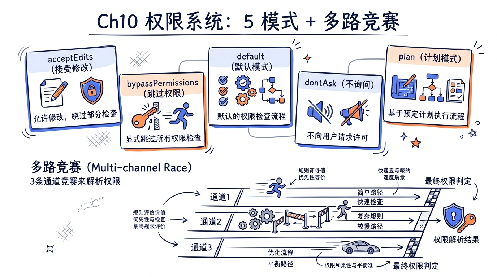
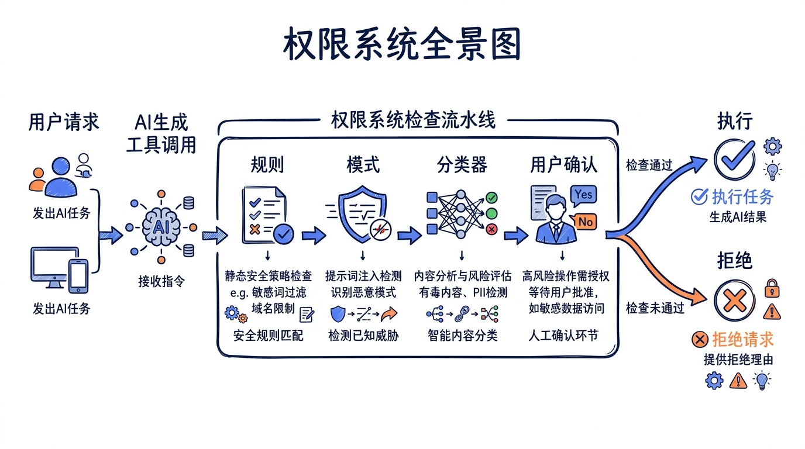
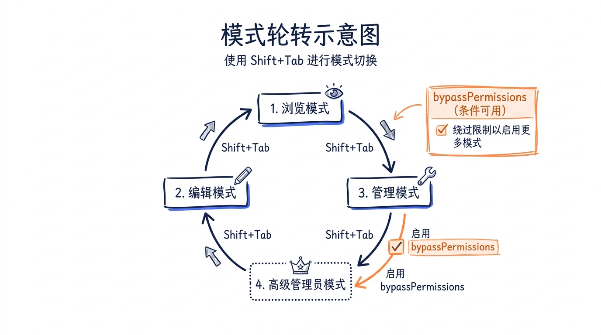
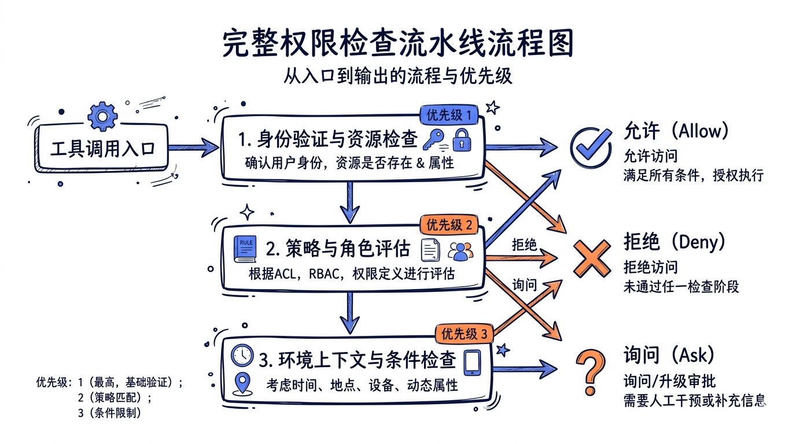

# 第十章：权限系统——五模式 + 多路竞赛



> **核心命题**：AI 代理能读文件、写代码、执行 Shell 命令，这意味着它拥有了和你一样的操作权限。如果不加约束，一行 `rm -rf /` 就能让你的系统灰飞烟灭。Claude Code 的权限系统，就是那道站在 AI 和真实系统之间的安全闸门。



## 10.1 为什么需要权限系统

传统 IDE 插件的安全模型很简单：用户手动点击按钮，每一步都有人类确认。但 AI 编程代理彻底打破了这个假设。Claude Code 中的 AI 可以：

- **自主决定**执行哪些 Shell 命令
- **连续调用**多个工具，形成工具链
- **生成参数**，包括文件路径、命令字符串这些高危输入
- **在子代理中**进一步派生操作，层层嵌套

这引出了三个核心安全问题：

1. **过度授权风险**：AI 可能执行超出用户意图的操作（比如用户让它"清理临时文件"，它删除了整个项目目录）
2. **注入攻击**：恶意 prompt 可能诱导 AI 执行危险命令
3. **信任边界模糊**：AI 读取的 `CLAUDE.md` 文件可能包含恶意指令

Claude Code 的解决方案是一个多层权限系统，它不是简单的 yes/no 开关，而是一套精密的检查流水线——从静态规则匹配到 AI 分类器判断，从本地键盘确认到远程手机批准，多条路径同时竞赛，第一个到达的结果生效。

## 10.2 五种权限模式

权限模式是整个系统的"总开关"，决定了默认的权限严格程度。在 `src/types/permissions.ts` 中定义了所有模式：

```typescript
// src/types/permissions.ts

export const EXTERNAL_PERMISSION_MODES = [
  'acceptEdits',
  'bypassPermissions',
  'default',
  'dontAsk',
  'plan',
] as const

export type ExternalPermissionMode = (typeof EXTERNAL_PERMISSION_MODES)[number]

// 内部还有 'auto' 和 'bubble' 两个模式
export type InternalPermissionMode = ExternalPermissionMode | 'auto' | 'bubble'
export type PermissionMode = InternalPermissionMode
```

### 10.2.1 五+二模式详解

> **教学口径说明**：用户**可见的权限模式有 5 种**（acceptEdits / bypassPermissions / default / dontAsk / plan），定义在 `EXTERNAL_PERMISSION_MODES` 常量中——这是用户在 UI 上能选到的"对外口径"。**内部还有 2 种额外模式**（auto / bubble），通过条件触发或父子代理委派激活，用户不会主动切换到它们。所以全书统一表述为 **"5+2 = 7 种权限模式"**：5 个对外可见 + 2 个内部使用。3 种权限**行为**（allow / deny / ask）则贯穿所有模式，由权限检查管线最终输出。完整数字口径详见 `docs/canonical-numbers.md`。

| 模式 | 严格程度 | 可见性 | 行为描述 |
|------|---------|---------|---------|
| `default` | 最严格 | 用户可见 | 每次工具调用都需要用户确认，除非被 allow 规则覆盖 |
| `acceptEdits` | 中等 | 用户可见 | 自动允许工作目录内的文件编辑，Shell 命令仍需确认 |
| `plan` | 只读 | 用户可见 | AI 只能规划不能执行，所有写操作被阻止 |
| `bypassPermissions` | 最宽松 | 用户可见 | 跳过大部分权限检查（但 deny 规则和安全检查仍生效） |
| `dontAsk` | 特殊 | 用户可见 | 不弹出权限对话框，将所有 `ask` 决策自动转为 `deny` |
| `auto` | 智能 | 内部使用 | 用 AI 分类器自动判断操作是否安全，安全则放行 |
| `bubble` | 委派 | 内部使用 | 将权限决策上报给父级代理 |

每种模式在 `PermissionMode.ts` 中有对应的 UI 配置：

```typescript
// src/utils/permissions/PermissionMode.ts

const PERMISSION_MODE_CONFIG: Partial<
  Record<PermissionMode, PermissionModeConfig>
> = {
  default: {
    title: 'Default',
    shortTitle: 'Default',
    symbol: '',
    color: 'text',
    external: 'default',
  },
  acceptEdits: {
    title: 'Accept edits',
    shortTitle: 'Accept',
    symbol: '⏵⏵',
    color: 'autoAccept',
    external: 'acceptEdits',
  },
  bypassPermissions: {
    title: 'Bypass Permissions',
    shortTitle: 'Bypass',
    symbol: '⏵⏵',
    color: 'error',       // 红色，提醒危险
    external: 'bypassPermissions',
  },
  // ...
}
```

### 10.2.2 模式切换的轮转逻辑

用户通过 Shift+Tab 循环切换模式。切换顺序定义在 `getNextPermissionMode.ts` 中：

```typescript
// src/utils/permissions/getNextPermissionMode.ts

export function getNextPermissionMode(
  toolPermissionContext: ToolPermissionContext,
): PermissionMode {
  switch (toolPermissionContext.mode) {
    case 'default':
      // Anthropic 内部员工跳过 acceptEdits 和 plan
      if (process.env.USER_TYPE === 'ant') {
        if (toolPermissionContext.isBypassPermissionsModeAvailable) {
          return 'bypassPermissions'
        }
        if (canCycleToAuto(toolPermissionContext)) {
          return 'auto'
        }
        return 'default'
      }
      return 'acceptEdits'

    case 'acceptEdits':
      return 'plan'

    case 'plan':
      if (toolPermissionContext.isBypassPermissionsModeAvailable) {
        return 'bypassPermissions'
      }
      if (canCycleToAuto(toolPermissionContext)) {
        return 'auto'
      }
      return 'default'

    case 'bypassPermissions':
      if (canCycleToAuto(toolPermissionContext)) {
        return 'auto'
      }
      return 'default'

    default:
      return 'default'
  }
}
```

对于外部用户，标准循环是：

```
default → acceptEdits → plan → (bypassPermissions →) default
```



### 10.2.3 模式切换的状态管理

模式切换不只是改一个字段，还需要处理一系列副作用。`transitionPermissionMode` 函数集中管理这些：

```typescript
// src/utils/permissions/permissionSetup.ts

export function transitionPermissionMode(
  fromMode: string,
  toMode: string,
  context: ToolPermissionContext,
): ToolPermissionContext {
  if (fromMode === toMode) return context

  handlePlanModeTransition(fromMode, toMode)
  handleAutoModeTransition(fromMode, toMode)

  if (fromMode === 'plan' && toMode !== 'plan') {
    setHasExitedPlanMode(true)
  }

  // 进入 auto 模式时，剥离危险权限规则
  if (toUsesClassifier && !fromUsesClassifier) {
    autoModeStateModule?.setAutoModeActive(true)
    context = stripDangerousPermissionsForAutoMode(context)
  }
  // 离开 auto 模式时，恢复被剥离的规则
  else if (fromUsesClassifier && !toUsesClassifier) {
    autoModeStateModule?.setAutoModeActive(false)
    context = restoreDangerousPermissions(context)
  }

  return context
}
```

关键设计：进入 auto 模式时，系统会自动剥离"危险的 allow 规则"（如 `Bash(*)`、`Bash(python:*)`），因为这些规则会绕过分类器检查。离开 auto 模式时，这些规则被恢复。

## 10.3 权限检查流水线

权限系统的核心是一条多步骤的检查流水线，定义在 `permissions.ts` 的 `hasPermissionsToUseToolInner` 函数中。这是每一次工具调用都会经过的路径。

### 10.3.1 三种决策结果

在深入流水线之前，先理解三种基本决策：

```typescript
// src/types/permissions.ts

export type PermissionBehavior = 'allow' | 'deny' | 'ask'
```

- **allow**：直接放行，工具立即执行
- **deny**：直接拒绝，工具不执行，AI 收到拒绝消息
- **ask**：需要用户确认，弹出权限对话框

实际上还有第四种内部状态 `passthrough`，表示工具自身没有明确意见，交给后续步骤判断：

```typescript
export type PermissionResult<Input> =
  | PermissionDecision<Input>
  | {
      behavior: 'passthrough'
      message: string
      // ...
    }
```

### 10.3.2 完整检查流水线

```typescript
// src/utils/permissions/permissions.ts

async function hasPermissionsToUseToolInner(
  tool: Tool,
  input: { [key: string]: unknown },
  context: ToolUseContext,
): Promise<PermissionDecision> {
```

整个流水线按严格的优先级排列：

**Step 1a — 全局 deny 规则检查**

```typescript
  // 1a. Entire tool is denied
  const denyRule = getDenyRuleForTool(appState.toolPermissionContext, tool)
  if (denyRule) {
    return {
      behavior: 'deny',
      decisionReason: { type: 'rule', rule: denyRule },
      message: `Permission to use ${tool.name} has been denied.`,
    }
  }
```

如果配置了 `"deny": ["Bash"]`，那么所有 Bash 调用都被直接拒绝，不需要经过后续步骤。

**Step 1b — 全局 ask 规则检查**

```typescript
  // 1b. Check if the entire tool should always ask
  const askRule = getAskRuleForTool(appState.toolPermissionContext, tool)
  if (askRule) {
    // 沙箱例外：如果命令会在沙箱中运行，可以跳过 ask
    const canSandboxAutoAllow =
      tool.name === BASH_TOOL_NAME &&
      SandboxManager.isSandboxingEnabled() &&
      SandboxManager.isAutoAllowBashIfSandboxedEnabled() &&
      shouldUseSandbox(input)

    if (!canSandboxAutoAllow) {
      return { behavior: 'ask', /* ... */ }
    }
  }
```

**Step 1c — 工具自身的权限检查**

每个工具可以实现自己的 `checkPermissions` 方法，进行更细粒度的检查：

```typescript
  let toolPermissionResult: PermissionResult = {
    behavior: 'passthrough',
    message: createPermissionRequestMessage(tool.name),
  }
  try {
    const parsedInput = tool.inputSchema.parse(input)
    toolPermissionResult = await tool.checkPermissions(parsedInput, context)
  } catch (e) {
    // ...
  }
```

例如 BashTool 会检查命令是否匹配 allow 规则中的前缀（如 `Bash(npm:*)` 匹配所有以 `npm` 开头的命令）。

**Step 1d — 工具拒绝优先**

```typescript
  if (toolPermissionResult?.behavior === 'deny') {
    return toolPermissionResult
  }
```

**Step 1e — 需要用户交互的工具**

某些工具（如 `AskUserQuestion`）即使在 bypass 模式也需要用户输入：

```typescript
  if (tool.requiresUserInteraction?.() &&
      toolPermissionResult?.behavior === 'ask') {
    return toolPermissionResult
  }
```

**Step 1f — 内容级 ask 规则**

即使在 bypassPermissions 模式下，内容级的 ask 规则也不能被跳过：

```typescript
  // 例如 Bash(npm publish:*) 配置在 ask 列表中
  if (toolPermissionResult?.behavior === 'ask' &&
      toolPermissionResult.decisionReason?.type === 'rule' &&
      toolPermissionResult.decisionReason.rule.ruleBehavior === 'ask') {
    return toolPermissionResult  // bypass 模式也不跳过
  }
```

**Step 1g — 安全路径检查（bypass 免疫）**

对 `.git/`、`.claude/`、`.vscode/` 等敏感目录的写操作，即使在 bypassPermissions 模式下也必须弹出确认：

```typescript
  if (toolPermissionResult?.behavior === 'ask' &&
      toolPermissionResult.decisionReason?.type === 'safetyCheck') {
    return toolPermissionResult  // 绝对不能跳过
  }
```

**Step 2a — 模式检查**

经过所有规则检查后，才检查模式是否允许绕过：

```typescript
  const shouldBypassPermissions =
    appState.toolPermissionContext.mode === 'bypassPermissions' ||
    (appState.toolPermissionContext.mode === 'plan' &&
      appState.toolPermissionContext.isBypassPermissionsModeAvailable)
  if (shouldBypassPermissions) {
    return { behavior: 'allow', /* ... */ }
  }
```

**Step 2b — 全局 allow 规则检查**

```typescript
  const alwaysAllowedRule = toolAlwaysAllowedRule(
    appState.toolPermissionContext, tool
  )
  if (alwaysAllowedRule) {
    return { behavior: 'allow', /* ... */ }
  }
```

**Step 3 — 兜底：passthrough 转 ask**

如果到这一步还没有明确决策，`passthrough` 转为 `ask`，让用户决定：

```typescript
  const result: PermissionDecision =
    toolPermissionResult.behavior === 'passthrough'
      ? { ...toolPermissionResult, behavior: 'ask' as const, /* ... */ }
      : toolPermissionResult

  return result
```

### 10.3.3 流水线后处理：模式级变换

`hasPermissionsToUseTool`（外层包装函数）对内层结果做进一步处理：

```typescript
// src/utils/permissions/permissions.ts

export const hasPermissionsToUseTool: CanUseToolFn = async (
  tool, input, context, assistantMessage, toolUseID,
): Promise<PermissionDecision> => {
  const result = await hasPermissionsToUseToolInner(tool, input, context)

  // allow 时重置拒绝计数器
  if (result.behavior === 'allow') {
    // ...reset denial tracking
    return result
  }

  if (result.behavior === 'ask') {
    // dontAsk 模式：ask → deny
    if (appState.toolPermissionContext.mode === 'dontAsk') {
      return {
        behavior: 'deny',
        message: DONT_ASK_REJECT_MESSAGE(tool.name),
      }
    }

    // auto 模式：ask → 分类器判断
    if (appState.toolPermissionContext.mode === 'auto') {
      // 先尝试 acceptEdits 快速路径
      // 再检查安全工具白名单
      // 最后运行 AI 分类器
      // ...
    }

    // 无法弹出对话框（后台代理）：ask → deny
    if (appState.toolPermissionContext.shouldAvoidPermissionPrompts) {
      return {
        behavior: 'deny',
        message: AUTO_REJECT_MESSAGE(tool.name),
      }
    }
  }

  return result
}
```



### 10.3.4 auto 模式的分类器流程

auto 模式是最复杂的权限路径。当工具调用的初始决策是 `ask` 时，auto 模式不弹出对话框，而是运行 AI 分类器来判断：

```typescript
// 在 hasPermissionsToUseTool 中（简化）

// 快速路径 1：acceptEdits 模式会允许的操作，跳过分类器
const acceptEditsResult = await tool.checkPermissions(parsedInput, {
  ...context,
  getAppState: () => ({
    ...state,
    toolPermissionContext: {
      ...state.toolPermissionContext,
      mode: 'acceptEdits' as const,
    },
  }),
})
if (acceptEditsResult.behavior === 'allow') {
  return { behavior: 'allow', /* ... */ }
}

// 快速路径 2：安全工具白名单
if (classifierDecisionModule!.isAutoModeAllowlistedTool(tool.name)) {
  return { behavior: 'allow', /* ... */ }
}

// 慢路径：运行 AI 分类器
const classifierResult = await classifyYoloAction(
  context.messages, action, context.options.tools,
  appState.toolPermissionContext, context.abortController.signal,
)

if (classifierResult.shouldBlock) {
  // 更新拒绝追踪
  const newDenialState = recordDenial(denialState)
  // 如果连续拒绝过多，降级为用户确认
  const denialLimitResult = handleDenialLimitExceeded(/* ... */)
  if (denialLimitResult) return denialLimitResult

  return { behavior: 'deny', /* ... */ }
}

// 分类器放行
return { behavior: 'allow', /* ... */ }
```

**拒绝追踪机制**：auto 模式内建了安全阀，防止 AI 陷入无限重试循环：

```typescript
// src/utils/permissions/denialTracking.ts

export const DENIAL_LIMITS = {
  maxConsecutive: 3,   // 连续拒绝 3 次后降级
  maxTotal: 20,        // 总计拒绝 20 次后降级
} as const

export function shouldFallbackToPrompting(state: DenialTrackingState): boolean {
  return (
    state.consecutiveDenials >= DENIAL_LIMITS.maxConsecutive ||
    state.totalDenials >= DENIAL_LIMITS.maxTotal
  )
}
```

当拒绝次数达到阈值时，auto 模式降级为手动确认模式，让用户直接审查。

## 10.4 useCanUseTool Hook：权限检查的 React 入口

`useCanUseTool` 是一个 React Hook，它将上述权限检查逻辑封装为 REPL 组件可用的接口。

### 10.4.1 Hook 的整体结构

```typescript
// src/hooks/useCanUseTool.tsx

function useCanUseTool(setToolUseConfirmQueue, setToolPermissionContext) {
  return async (tool, input, toolUseContext, assistantMessage, toolUseID,
                forceDecision) =>
    new Promise(resolve => {
      // 1. 创建权限上下文
      const ctx = createPermissionContext(
        tool, input, toolUseContext, assistantMessage,
        toolUseID, setToolPermissionContext,
        createPermissionQueueOps(setToolUseConfirmQueue)
      )

      // 2. 检查是否已中止
      if (ctx.resolveIfAborted(resolve)) return

      // 3. 获取初始权限决策
      const decisionPromise = forceDecision !== undefined
        ? Promise.resolve(forceDecision)
        : hasPermissionsToUseTool(tool, input, toolUseContext,
                                 assistantMessage, toolUseID)

      // 4. 根据决策分流处理
      return decisionPromise.then(async result => {
        switch (result.behavior) {
          case 'allow':
            resolve(ctx.buildAllow(result.updatedInput ?? input))
            return
          case 'deny':
            resolve(result)
            return
          case 'ask':
            // 进入多路竞赛...
        }
      })
    })
}
```

### 10.4.2 三种权限处理器

当决策为 `ask` 时，系统根据当前运行环境选择不同的处理器：

```
ask 决策
  ├── coordinatorHandler  (协调器模式：先跑自动检查，再兜底交互)
  ├── swarmWorkerHandler  (Swarm 工作者：转发给 Leader)
  └── interactiveHandler  (交互模式：多路竞赛)
```

**处理器 1：coordinatorHandler**

协调器模式下（`awaitAutomatedChecksBeforeDialog` 为 true），先依次运行 Hook 和分类器，只有自动检查都无法决策时才弹出对话框：

```typescript
// src/hooks/toolPermission/handlers/coordinatorHandler.ts

async function handleCoordinatorPermission(
  params: CoordinatorPermissionParams,
): Promise<PermissionDecision | null> {
  try {
    // 1. 先试 PermissionRequest Hook（快速，本地）
    const hookResult = await ctx.runHooks(permissionMode, suggestions, updatedInput)
    if (hookResult) return hookResult

    // 2. 再试分类器（慢，需要推理）
    const classifierResult = await ctx.tryClassifier?.(
      params.pendingClassifierCheck, updatedInput
    )
    if (classifierResult) return classifierResult
  } catch (error) {
    logError(error)
  }

  // 3. 都没决策 → 返回 null，让调用方兜底到交互对话框
  return null
}
```

**处理器 2：swarmWorkerHandler**

Swarm 工作者不能直接弹出对话框，它需要将权限请求转发给 Leader：

```typescript
// src/hooks/toolPermission/handlers/swarmWorkerHandler.ts

async function handleSwarmWorkerPermission(
  params: SwarmWorkerPermissionParams,
): Promise<PermissionDecision | null> {
  if (!isAgentSwarmsEnabled() || !isSwarmWorker()) return null

  // 先尝试分类器自动批准
  const classifierResult = await ctx.tryClassifier?.(/* ... */)
  if (classifierResult) return classifierResult

  // 转发给 Leader
  const decision = await new Promise<PermissionDecision>(resolve => {
    const { resolve: resolveOnce, claim } = createResolveOnce(resolve)

    const request = createPermissionRequest({
      toolName: ctx.tool.name,
      toolUseId: ctx.toolUseID,
      input: ctx.input,
      description,
    })

    // 注册回调（在发送请求之前！避免竞态）
    registerPermissionCallback({
      requestId: request.id,
      async onAllow(allowedInput, permissionUpdates, feedback) {
        if (!claim()) return
        resolveOnce(await ctx.handleUserAllow(/* ... */))
      },
      onReject(feedback) {
        if (!claim()) return
        resolveOnce(ctx.cancelAndAbort(feedback))
      },
    })

    // 然后才发送请求
    void sendPermissionRequestViaMailbox(request)

    // 显示等待状态
    ctx.toolUseContext.setAppState(prev => ({
      ...prev,
      pendingWorkerRequest: { toolName, toolUseId, description },
    }))
  })

  return decision
}
```

**处理器 3：interactiveHandler**

这是最复杂的处理器，它启动多路竞赛——下一节将深入分析。

### 10.4.3 PermissionContext：统一的权限操作上下文

三个处理器共享一个 `PermissionContext` 对象，它封装了权限决策所需的所有操作：

```typescript
// src/hooks/toolPermission/PermissionContext.ts

function createPermissionContext(
  tool, input, toolUseContext, assistantMessage,
  toolUseID, setToolPermissionContext, queueOps
) {
  return Object.freeze({
    tool,
    input,
    toolUseContext,
    toolUseID,

    // 日志记录
    logDecision(args, opts) { /* ... */ },
    logCancelled() { /* ... */ },

    // 权限持久化
    async persistPermissions(updates) { /* ... */ },

    // 处理用户允许
    async handleUserAllow(updatedInput, permissionUpdates, feedback) {
      const acceptedPermanentUpdates = await this.persistPermissions(permissionUpdates)
      this.logDecision({ decision: 'accept', source: { type: 'user', permanent: acceptedPermanentUpdates } })
      return this.buildAllow(updatedInput)
    },

    // 处理 Hook 允许
    async handleHookAllow(finalInput, permissionUpdates) { /* ... */ },

    // 构建允许/拒绝结果
    buildAllow(updatedInput, opts) { /* ... */ },
    buildDeny(message, decisionReason) { /* ... */ },

    // 取消并中止
    cancelAndAbort(feedback, isAbort, contentBlocks) { /* ... */ },

    // 队列操作
    pushToQueue(item) { queueOps?.push(item) },
    removeFromQueue() { queueOps?.remove(toolUseID) },
    updateQueueItem(patch) { queueOps?.update(toolUseID, patch) },

    // 分类器（条件编译）
    async tryClassifier(pendingCheck, updatedInput) { /* ... */ },

    // Hook 执行
    async runHooks(mode, suggestions, updatedInput) { /* ... */ },
  })
}
```

## 10.5 `createResolveOnce()` 多路竞赛

多路竞赛是 interactiveHandler 的核心设计——当权限对话框弹出后，多个异步操作同时运行，**第一个到达终点的结果生效**。

### 10.5.1 ResolveOnce 的原子性保证

```typescript
// src/hooks/toolPermission/PermissionContext.ts

type ResolveOnce<T> = {
  resolve(value: T): void
  isResolved(): boolean
  claim(): boolean  // 原子性的 check-and-mark
}

function createResolveOnce<T>(resolve: (value: T) => void): ResolveOnce<T> {
  let claimed = false
  let delivered = false
  return {
    resolve(value: T) {
      if (delivered) return
      delivered = true
      claimed = true
      resolve(value)
    },
    isResolved() {
      return claimed
    },
    claim() {
      if (claimed) return false
      claimed = true
      return true
    },
  }
}
```

`claim()` 方法是关键创新：它是一个原子性的"占位"操作。在异步回调的世界里，`isResolved()` 检查和 `resolve()` 调用之间可能有其他路径抢先到达。`claim()` 将"检查"和"标记"合为一个原子操作，保证只有一个路径能成功。

### 10.5.2 五路竞赛架构

interactiveHandler 中同时启动了至多五个竞赛者：

```
                    ┌──────────────┐
                    │  ask 决策    │
                    └──────┬───────┘
          ┌────────┬───────┼───────┬────────┐
          ▼        ▼       ▼       ▼        ▼
       用户键盘  Bridge  Channel  Hook   Classifier
       (本地CLI) (远程)  (手机)  (脚本)  (AI判断)
          │        │       │       │        │
          └────────┴───────┴───────┴────────┘
                         │
                   claim() 竞赛
                         │
                    第一个胜出
```

下面逐一分析每条竞赛路径：

**路径 1：本地用户交互**

通过 `pushToQueue` 将权限请求推入 UI 队列，用户看到对话框后按 Allow/Deny：

```typescript
// src/hooks/toolPermission/handlers/interactiveHandler.ts（简化）

ctx.pushToQueue({
  tool: ctx.tool,
  description,
  input: displayInput,
  toolUseID: ctx.toolUseID,
  permissionResult: result,

  async onAllow(updatedInput, permissionUpdates, feedback, contentBlocks) {
    if (!claim()) return  // 其他路径已经赢了
    // 处理用户允许...
    resolveOnce(await ctx.handleUserAllow(/* ... */))
  },

  onReject(feedback, contentBlocks) {
    if (!claim()) return
    resolveOnce(ctx.cancelAndAbort(feedback))
  },

  onAbort() {
    if (!claim()) return
    resolveOnce(ctx.cancelAndAbort(undefined, true))
  },

  async recheckPermission() {
    // 规则变更后重新检查（如用户在另一个窗口修改了 settings.json）
    if (isResolved()) return
    const freshResult = await hasPermissionsToUseTool(/* ... */)
    if (freshResult.behavior === 'allow') {
      if (!claim()) return
      resolveOnce(ctx.buildAllow(freshResult.updatedInput ?? ctx.input))
    }
  },

  onUserInteraction() {
    // 用户开始操作时取消分类器（200ms 宽限期防误触）
    const GRACE_PERIOD_MS = 200
    if (Date.now() - permissionPromptStartTimeMs < GRACE_PERIOD_MS) return
    userInteracted = true
    clearClassifierChecking(ctx.toolUseID)
  },
})
```

**路径 2：Bridge 远程批准（claude.ai Web UI）**

当 CLI 连接到 claude.ai 时，权限请求同时发送到 Web 端：

```typescript
if (bridgeCallbacks && bridgeRequestId) {
  // 发送请求到 Web UI
  bridgeCallbacks.sendRequest(
    bridgeRequestId, ctx.tool.name, displayInput,
    ctx.toolUseID, description, result.suggestions,
  )

  // 监听 Web UI 的响应
  const unsubscribe = bridgeCallbacks.onResponse(bridgeRequestId, response => {
    if (!claim()) return  // 本地用户或其他路径已经回复了

    ctx.removeFromQueue()      // 移除本地对话框
    channelUnsubscribe?.()     // 取消 Channel 监听

    if (response.behavior === 'allow') {
      if (response.updatedPermissions?.length) {
        void ctx.persistPermissions(response.updatedPermissions)
      }
      resolveOnce(ctx.buildAllow(response.updatedInput ?? displayInput))
    } else {
      resolveOnce(ctx.cancelAndAbort(response.message))
    }
  })
}
```

**路径 3：Channel 远程批准（Telegram/iMessage/Discord）**

这是最有意思的路径——用户可以从手机上通过消息应用批准权限：

```typescript
if (channelCallbacks && !ctx.tool.requiresUserInteraction?.()) {
  const channelRequestId = shortRequestId(ctx.toolUseID)

  // 找到所有启用权限中继的 Channel
  const channelClients = filterPermissionRelayClients(
    ctx.toolUseContext.getAppState().mcp.clients,
    name => findChannelEntry(name, allowedChannels) !== undefined,
  )

  // 通过 MCP notification 发送权限请求
  for (const client of channelClients) {
    void client.client.notification({
      method: CHANNEL_PERMISSION_REQUEST_METHOD,
      params: {
        request_id: channelRequestId,
        tool_name: ctx.tool.name,
        description,
        input_preview: truncateForPreview(displayInput),
      },
    })
  }

  // 监听 Channel 的结构化响应
  const mapUnsub = channelCallbacks.onResponse(channelRequestId, response => {
    if (!claim()) return
    channelUnsubscribe?.()
    ctx.removeFromQueue()

    if (response.behavior === 'allow') {
      resolveOnce(ctx.buildAllow(displayInput))
    } else {
      resolveOnce(ctx.cancelAndAbort(`Denied via channel ${response.fromServer}`))
    }
  })
}
```

**路径 4：PermissionRequest Hook**

用户可以通过 settings.json 配置的 Hook 脚本自动处理权限请求：

```typescript
void (async () => {
  if (isResolved()) return
  const hookDecision = await ctx.runHooks(
    currentAppState.toolPermissionContext.mode,
    result.suggestions,
    result.updatedInput,
    permissionPromptStartTimeMs,
  )
  if (!hookDecision || !claim()) return

  bridgeCallbacks?.cancelRequest(bridgeRequestId)
  channelUnsubscribe?.()
  ctx.removeFromQueue()
  resolveOnce(hookDecision)
})()
```

**路径 5：Bash 分类器**

对 Bash 命令，后台运行分类器判断是否安全：

```typescript
if (result.pendingClassifierCheck && ctx.tool.name === BASH_TOOL_NAME) {
  setClassifierChecking(ctx.toolUseID)
  void executeAsyncClassifierCheck(
    result.pendingClassifierCheck,
    ctx.toolUseContext.abortController.signal,
    ctx.toolUseContext.options.isNonInteractiveSession,
    {
      shouldContinue: () => !isResolved() && !userInteracted,
      onComplete: () => { clearClassifierChecking(ctx.toolUseID) },
      onAllow: decisionReason => {
        if (!claim()) return
        // 显示自动批准过渡动画
        ctx.updateQueueItem({
          classifierCheckInProgress: false,
          classifierAutoApproved: true,
        })
        resolveOnce(ctx.buildAllow(ctx.input, { decisionReason }))

        // 保持 checkmark 可见 3 秒（终端聚焦时）或 1 秒
        const checkmarkMs = getTerminalFocused() ? 3000 : 1000
        checkmarkTransitionTimer = setTimeout(() => {
          ctx.removeFromQueue()
        }, checkmarkMs)
      },
    },
  )
}
```

### 10.5.3 竞赛的清理逻辑

当一个路径胜出时，必须清理其他路径的资源。每个胜出路径都包含清理逻辑：

```
胜出路径清理清单：
├── claim() → 原子性阻止其他路径
├── bridgeCallbacks.cancelRequest() → 告知 Web UI 取消
├── channelUnsubscribe?.() → 取消 Channel 监听
├── ctx.removeFromQueue() → 移除本地对话框
├── clearClassifierChecking() → 取消分类器指示器
└── signal.removeEventListener() → 移除 abort 监听器
```

## 10.6 权限规则系统

### 10.6.1 规则的数据结构

每条规则由三个部分组成：

```typescript
// src/types/permissions.ts

export type PermissionRule = {
  source: PermissionRuleSource       // 来自哪里
  ruleBehavior: PermissionBehavior   // allow / deny / ask
  ruleValue: PermissionRuleValue     // 匹配什么
}

export type PermissionRuleValue = {
  toolName: string        // 工具名：Bash, Edit, mcp__server__tool
  ruleContent?: string    // 可选的匹配内容：npm install, prefix:*
}
```

### 10.6.2 规则来源层次

规则可以来自七种不同的来源，它们在同一个优先级内共同生效：

```typescript
// src/types/permissions.ts

export type PermissionRuleSource =
  | 'userSettings'       // ~/.claude/settings.json（全局）
  | 'projectSettings'    // .claude/settings.json（项目级）
  | 'localSettings'      // .claude/settings.local.json（项目本地，不提交 git）
  | 'flagSettings'       // Feature flag 远程配置
  | 'policySettings'     // 企业策略（管理员配置）
  | 'cliArg'            // 命令行参数 --allowed-tools
  | 'command'           // 运行时命令
  | 'session'           // 会话级（内存中，不持久化）
```

### 10.6.3 settings.json 中的权限配置

权限规则在 `settings.json` 的 `permissions` 字段中配置：

```json
{
  "permissions": {
    "allow": [
      "Read",
      "Bash(npm install:*)",
      "Bash(git status)",
      "Edit",
      "mcp__filesystem__read_file"
    ],
    "deny": [
      "Bash(rm -rf:*)",
      "mcp__dangerous_server"
    ],
    "ask": [
      "Bash(npm publish:*)"
    ],
    "defaultMode": "default",
    "additionalDirectories": [
      "/tmp/workspace"
    ]
  }
}
```

加载规则的核心函数：

```typescript
// src/utils/permissions/permissionsLoader.ts

export function loadAllPermissionRulesFromDisk(): PermissionRule[] {
  // 如果启用了"只允许管理策略"，只加载 policySettings
  if (shouldAllowManagedPermissionRulesOnly()) {
    return getPermissionRulesForSource('policySettings')
  }

  // 否则从所有启用的来源加载
  const rules: PermissionRule[] = []
  for (const source of getEnabledSettingSources()) {
    rules.push(...getPermissionRulesForSource(source))
  }
  return rules
}
```

### 10.6.4 规则解析语法

规则字符串的解析在 `permissionRuleParser.ts` 中实现：

```typescript
// src/utils/permissions/permissionRuleParser.ts

// 格式: "ToolName" 或 "ToolName(content)"
export function permissionRuleValueFromString(
  ruleString: string,
): PermissionRuleValue {
  // 找到第一个未转义的开括号
  const openParenIndex = findFirstUnescapedChar(ruleString, '(')
  if (openParenIndex === -1) {
    return { toolName: normalizeLegacyToolName(ruleString) }
  }

  const closeParenIndex = findLastUnescapedChar(ruleString, ')')
  // ...

  const toolName = ruleString.substring(0, openParenIndex)
  const rawContent = ruleString.substring(openParenIndex + 1, closeParenIndex)

  // 空内容或通配符 → 等同于工具级规则
  if (rawContent === '' || rawContent === '*') {
    return { toolName: normalizeLegacyToolName(toolName) }
  }

  // 反转义内容
  const ruleContent = unescapeRuleContent(rawContent)
  return { toolName: normalizeLegacyToolName(toolName), ruleContent }
}
```

支持的规则格式示例：

| 规则字符串 | 解析结果 | 含义 |
|-----------|---------|------|
| `Read` | `{toolName: 'Read'}` | 允许/拒绝所有 Read 操作 |
| `Bash(npm install)` | `{toolName: 'Bash', ruleContent: 'npm install'}` | 精确匹配 |
| `Bash(npm:*)` | `{toolName: 'Bash', ruleContent: 'npm:*'}` | 前缀匹配 |
| `Bash(git *)` | `{toolName: 'Bash', ruleContent: 'git *'}` | 通配符匹配 |
| `Bash(*)` | `{toolName: 'Bash'}` | 等同于工具级规则 |
| `Bash(python -c "print\\(1\\)")` | 含转义括号 | 匹配含括号的命令 |

### 10.6.5 Shell 命令的三种匹配方式

Shell 命令（Bash/PowerShell）支持三种匹配模式，定义在 `shellRuleMatching.ts` 中：

```typescript
// src/utils/permissions/shellRuleMatching.ts

export type ShellPermissionRule =
  | { type: 'exact'; command: string }      // 精确匹配
  | { type: 'prefix'; prefix: string }      // 前缀匹配（旧语法 cmd:*）
  | { type: 'wildcard'; pattern: string }   // 通配符匹配

export function parsePermissionRule(permissionRule: string): ShellPermissionRule {
  // 1. 检查旧版 :* 前缀语法
  const prefix = permissionRuleExtractPrefix(permissionRule)
  if (prefix !== null) {
    return { type: 'prefix', prefix }
  }

  // 2. 检查新版通配符语法
  if (hasWildcards(permissionRule)) {
    return { type: 'wildcard', pattern: permissionRule }
  }

  // 3. 精确匹配
  return { type: 'exact', command: permissionRule }
}
```

通配符匹配的实现支持转义，`\*` 匹配字面量星号：

```typescript
export function matchWildcardPattern(
  pattern: string, command: string, caseInsensitive = false,
): boolean {
  // 处理转义序列 \* 和 \\
  // 转换 * 为 .* 正则
  // 特殊处理：'git *' 同时匹配 'git add' 和单独的 'git'
  const regex = new RegExp(`^${regexPattern}$`, flags)
  return regex.test(command)
}
```

### 10.6.6 工具名匹配与 MCP 命名空间

工具名的匹配通过 `toolMatchesRule` 函数实现：

```typescript
// src/utils/permissions/permissions.ts

function toolMatchesRule(
  tool: Pick<Tool, 'name' | 'mcpInfo'>,
  rule: PermissionRule,
): boolean {
  // 规则不能有 ruleContent，只能匹配整个工具
  if (rule.ruleValue.ruleContent !== undefined) return false

  // MCP 工具使用全限定名 mcp__server__tool
  const nameForRuleMatch = getToolNameForPermissionCheck(tool)

  // 直接名称匹配
  if (rule.ruleValue.toolName === nameForRuleMatch) return true

  // MCP 服务器级别匹配：
  // 规则 "mcp__server1" 匹配 "mcp__server1__tool1"
  // 规则 "mcp__server1__*" 匹配 server1 的所有工具
  const ruleInfo = mcpInfoFromString(rule.ruleValue.toolName)
  const toolInfo = mcpInfoFromString(nameForRuleMatch)

  return (
    ruleInfo !== null && toolInfo !== null &&
    (ruleInfo.toolName === undefined || ruleInfo.toolName === '*') &&
    ruleInfo.serverName === toolInfo.serverName
  )
}
```

## 10.7 MCP 工具权限

MCP 工具使用 `mcp__<server>__<tool>` 命名空间，这让权限规则可以在不同粒度上控制：

### 10.7.1 命名空间结构

```typescript
// src/services/mcp/mcpStringUtils.ts

// 解析 MCP 工具名
export function mcpInfoFromString(toolString: string): {
  serverName: string
  toolName: string | undefined
} | null {
  const parts = toolString.split('__')
  const [mcpPart, serverName, ...toolNameParts] = parts
  if (mcpPart !== 'mcp' || !serverName) return null
  const toolName = toolNameParts.length > 0
    ? toolNameParts.join('__') : undefined
  return { serverName, toolName }
}

// 构建全限定名
export function buildMcpToolName(serverName: string, toolName: string): string {
  return `${getMcpPrefix(serverName)}${normalizeNameForMCP(toolName)}`
}

// 获取权限检查用的名称
export function getToolNameForPermissionCheck(tool: {
  name: string
  mcpInfo?: { serverName: string; toolName: string }
}): string {
  return tool.mcpInfo
    ? buildMcpToolName(tool.mcpInfo.serverName, tool.mcpInfo.toolName)
    : tool.name
}
```

### 10.7.2 MCP 权限规则示例

```json
{
  "permissions": {
    "allow": [
      "mcp__filesystem__read_file",
      "mcp__filesystem__list_directory",
      "mcp__github"
    ],
    "deny": [
      "mcp__dangerous_server",
      "mcp__filesystem__write_file"
    ]
  }
}
```

三种粒度：

| 规则 | 匹配范围 |
|------|---------|
| `mcp__github` | github 服务器的所有工具 |
| `mcp__github__*` | 同上（显式通配符） |
| `mcp__github__create_issue` | 仅匹配 create_issue 工具 |

### 10.7.3 Legacy 工具名映射

工具重命名后，旧规则仍然生效，因为有 Legacy 映射：

```typescript
// src/utils/permissions/permissionRuleParser.ts

const LEGACY_TOOL_NAME_ALIASES: Record<string, string> = {
  Task: AGENT_TOOL_NAME,           // Task → Agent
  KillShell: TASK_STOP_TOOL_NAME,  // KillShell → TaskStop
  AgentOutputTool: TASK_OUTPUT_TOOL_NAME,
  BashOutputTool: TASK_OUTPUT_TOOL_NAME,
}

export function normalizeLegacyToolName(name: string): string {
  return LEGACY_TOOL_NAME_ALIASES[name] ?? name
}
```

## 10.8 Channel 权限：远程批准通道

Channel 权限是 Claude Code 最具创新性的设计之一——让用户从手机上通过 Telegram、iMessage 或 Discord 批准权限请求。

### 10.8.1 设计原则

`channelPermissions.ts` 文件头的注释精准概括了设计思路：

```typescript
/**
 * Permission prompts over channels (Telegram, iMessage, Discord).
 *
 * Mirrors BridgePermissionCallbacks — when CC hits a permission dialog,
 * it ALSO sends the prompt via active channels and races the reply against
 * local UI / bridge / hooks / classifier. First resolver wins via claim().
 *
 * Inbound is a structured event: the server parses the user's "yes tbxkq"
 * reply and emits notifications/claude/channel/permission with
 * {request_id, behavior}. CC never sees the reply as text — approval
 * requires the server to deliberately emit that specific event, not just
 * relay content.
 */
```

### 10.8.2 五字母短 ID

每个权限请求生成一个 5 字母的短 ID，方便用户在手机上输入：

```typescript
// src/services/mcp/channelPermissions.ts

// 25 字母表：a-z 去掉 l（像数字 1/大写 I）
const ID_ALPHABET = 'abcdefghijkmnopqrstuvwxyz'

export function shortRequestId(toolUseID: string): string {
  // FNV-1a 哈希 → uint32 → base-25 编码
  let candidate = hashToId(toolUseID)
  // 最多重试 10 次避免生成不雅词
  for (let salt = 0; salt < 10; salt++) {
    if (!ID_AVOID_SUBSTRINGS.some(bad => candidate.includes(bad))) {
      return candidate
    }
    candidate = hashToId(`${toolUseID}:${salt}`)
  }
  return candidate
}
```

设计细节值得品味：

- **25 字母表**：去掉容易混淆的 `l`，25^5 约 980 万种组合
- **纯字母**：手机键盘不用切换数字/字母模式
- **脏词过滤**：随机 5 个字母可能拼出不当词语，用 blocklist 过滤并重新哈希
- **碰撞概率**：980 万空间中，50% 碰撞概率需要约 3000 个同时待定的请求——对单个交互会话来说完全不可能

### 10.8.3 回复格式规范

```typescript
// Channel 服务器需要实现的回复解析正则
export const PERMISSION_REPLY_RE = /^\s*(y|yes|n|no)\s+([a-km-z]{5})\s*$/i
```

用户在手机上回复 `yes tbxkq` 或 `no tbxkq` 即可批准或拒绝。格式设计考虑了：

- 不接受单独的 `yes`/`no`（避免日常对话误触发）
- 大小写不敏感（手机自动首字母大写）
- 允许前后空格（手机输入法可能添加）

### 10.8.4 结构化事件流

Channel 权限使用结构化事件，而不是文本匹配：

```
outbound (CC → Channel Server):
  notifications/claude/channel/permission_request
  params: { request_id, tool_name, description, input_preview }

inbound (Channel Server → CC):
  notifications/claude/channel/permission
  params: { request_id, behavior: 'allow' | 'deny' }
```

CC 不解析文本，只处理结构化事件。Channel 服务器负责：

1. 收到 `permission_request`，格式化为平台消息发给用户
2. 用户回复 `yes tbxkq`，服务器解析后发送结构化 `permission` 事件
3. CC 匹配 `request_id`，执行对应的 allow/deny

### 10.8.5 Channel 准入门控

不是任何 MCP 服务器都能成为权限通道。`gateChannelServer` 实现了层层门控：

```typescript
// src/services/mcp/channelNotification.ts

export function gateChannelServer(
  serverName, capabilities, pluginSource,
): ChannelGateResult {
  // Gate 1: 服务器必须声明 claude/channel 能力
  if (!capabilities?.experimental?.['claude/channel']) {
    return { action: 'skip', kind: 'capability', /* ... */ }
  }

  // Gate 2: 运行时总开关（GrowthBook tengu_harbor）
  if (!isChannelsEnabled()) {
    return { action: 'skip', kind: 'disabled', /* ... */ }
  }

  // Gate 3: 必须是 OAuth 认证（API key 用户暂不支持）
  if (!getClaudeAIOAuthTokens()?.accessToken) {
    return { action: 'skip', kind: 'auth', /* ... */ }
  }

  // Gate 4: 企业用户需要管理员显式启用
  if (managed && policy?.channelsEnabled !== true) {
    return { action: 'skip', kind: 'policy', /* ... */ }
  }

  // Gate 5: 必须在 --channels 列表中
  const entry = findChannelEntry(serverName, getAllowedChannels())
  if (!entry) {
    return { action: 'skip', kind: 'session', /* ... */ }
  }

  // Gate 6: 插件来源验证 + 白名单检查
  // ...

  return { action: 'register' }
}
```

权限中继还有额外的过滤——服务器必须同时声明 `claude/channel` 和 `claude/channel/permission` 两个能力：

```typescript
// src/services/mcp/channelPermissions.ts

export function filterPermissionRelayClients<T>(
  clients: readonly T[],
  isInAllowlist: (name: string) => boolean,
): (T & { type: 'connected' })[] {
  return clients.filter(c =>
    c.type === 'connected' &&
    isInAllowlist(c.name) &&
    c.capabilities?.experimental?.['claude/channel'] !== undefined &&
    c.capabilities?.experimental?.['claude/channel/permission'] !== undefined,
  )
}
```

### 10.8.6 回调工厂

```typescript
// src/services/mcp/channelPermissions.ts

export function createChannelPermissionCallbacks(): ChannelPermissionCallbacks {
  // pending Map 闭包在工厂内，不放在模块级也不放在 AppState
  const pending = new Map<string, (response) => void>()

  return {
    onResponse(requestId, handler) {
      const key = requestId.toLowerCase()
      pending.set(key, handler)
      return () => { pending.delete(key) }  // 返回取消订阅函数
    },

    resolve(requestId, behavior, fromServer) {
      const key = requestId.toLowerCase()
      const resolver = pending.get(key)
      if (!resolver) return false
      // 先删除再调用——防止 resolver 抛异常或重入
      pending.delete(key)
      resolver({ behavior, fromServer })
      return true
    },
  }
}
```

## 10.9 权限降级策略

Claude Code 的权限系统设计了多种降级路径，确保在各种异常情况下仍能安全运作。

### 10.9.1 bypassPermissions 远程禁用

企业管理员可以通过 Statsig gate 远程禁用 bypassPermissions 模式：

```typescript
// src/utils/permissions/bypassPermissionsKillswitch.ts

export async function checkAndDisableBypassPermissionsIfNeeded(
  toolPermissionContext, setAppState,
): Promise<void> {
  if (bypassPermissionsCheckRan) return
  bypassPermissionsCheckRan = true

  if (!toolPermissionContext.isBypassPermissionsModeAvailable) return

  const shouldDisable = await shouldDisableBypassPermissions()
  if (!shouldDisable) return

  setAppState(prev => ({
    ...prev,
    toolPermissionContext: createDisabledBypassPermissionsContext(
      prev.toolPermissionContext,
    ),
  }))
}
```

而在 `permissionSetup.ts` 中，更激进的措施是直接优雅退出：

```typescript
export async function checkAndDisableBypassPermissions(
  currentContext: ToolPermissionContext,
): Promise<void> {
  if (!currentContext.isBypassPermissionsModeAvailable) return

  const shouldDisable = await shouldDisableBypassPermissions()
  if (!shouldDisable) return

  // 直接优雅退出进程！
  void gracefulShutdown(1, 'bypass_permissions_disabled')
}
```

### 10.9.2 auto 模式降级链

auto 模式的降级策略特别丰富：

```
auto 模式降级链：

1. 分类器可用且放行 → allow
2. 分类器可用但拒绝 → deny（AI 告诉 Claude 为什么不行）
3. 连续拒绝 3 次 → 降级为用户确认（防止 Claude 无限重试）
4. 总计拒绝 20 次 → 降级为用户确认（重置计数器）
5. 分类器不可用 + iron_gate 关闭 → deny + 重试引导
6. 分类器不可用 + iron_gate 开放 → 降级为默认模式
7. 分类器上下文过长 → 降级为手动确认
8. 无头模式 + 上下文过长 → 直接中止代理
```

### 10.9.3 无头模式（headless）降级

后台代理没有 UI，无法弹出对话框，所有 `ask` 决策都需要特殊处理：

```typescript
// 在 hasPermissionsToUseTool 中

if (appState.toolPermissionContext.shouldAvoidPermissionPrompts) {
  // 先给 Hook 一次机会
  const hookDecision = await runPermissionRequestHooksForHeadlessAgent(
    tool, input, toolUseID, context,
    appState.toolPermissionContext.mode,
    result.suggestions,
  )
  if (hookDecision) return hookDecision

  // Hook 也没决策 → 自动拒绝
  return {
    behavior: 'deny',
    message: AUTO_REJECT_MESSAGE(tool.name),
  }
}
```

### 10.9.4 危险权限的自动剥离

进入 auto 模式时，会自动检测并剥离可能绕过分类器的 allow 规则：

```typescript
// src/utils/permissions/permissionSetup.ts

export function isDangerousBashPermission(
  toolName: string, ruleContent: string | undefined,
): boolean {
  if (toolName !== BASH_TOOL_NAME) return false

  // 工具级 allow（Bash 无内容）→ 允许所有命令
  if (ruleContent === undefined || ruleContent === '') return true

  // 通配符
  if (content === '*') return true

  // 脚本解释器前缀（python:*, node:*, ruby:* 等）
  for (const pattern of DANGEROUS_BASH_PATTERNS) {
    if (content === `${lowerPattern}:*`) return true
    if (content === `${lowerPattern}*`) return true
    if (content === `${lowerPattern} *`) return true
  }

  return false
}
```

类似地，PowerShell 的危险模式检查更加严格，涵盖了 `iex`、`Invoke-Expression`、`Start-Process`、`New-Object` 等所有代码执行途径。

### 10.9.5 路径安全检查

文件操作有独立的路径安全验证层，定义在 `pathValidation.ts` 中：

```typescript
// src/utils/permissions/pathValidation.ts

export function isPathAllowed(
  resolvedPath, context, operationType, precomputedPathsToCheck?,
): PathCheckResult {
  // 1. deny 规则优先
  const denyRule = matchingRuleForInput(resolvedPath, context, permissionType, 'deny')
  if (denyRule) return { allowed: false }

  // 2. 内部可编辑路径（plan 文件、scratchpad）
  if (operationType !== 'read') {
    const internal = checkEditableInternalPath(resolvedPath, {})
    if (internal.behavior === 'allow') return { allowed: true }
  }

  // 2.5. 安全检查（.git/, .claude/, .vscode/ 等）
  if (operationType !== 'read') {
    const safetyCheck = checkPathSafetyForAutoEdit(resolvedPath)
    if (!safetyCheck.safe) return { allowed: false }
  }

  // 3. 工作目录检查
  if (pathInAllowedWorkingPath(resolvedPath, context)) {
    if (operationType === 'read' || context.mode === 'acceptEdits') {
      return { allowed: true }
    }
  }

  // 3.7. 沙箱写入白名单
  if (operationType !== 'read' && !isInWorkingDir &&
      isPathInSandboxWriteAllowlist(resolvedPath)) {
    return { allowed: true }
  }

  // 4. allow 规则
  const allowRule = matchingRuleForInput(resolvedPath, context, permissionType, 'allow')
  if (allowRule) return { allowed: true }

  // 5. 不允许
  return { allowed: false }
}
```

同时，路径验证还防御了多种注入攻击：

```typescript
export function validatePath(path, cwd, toolPermissionContext, operationType) {
  const cleanPath = expandTilde(path.replace(/^['"]|['"]$/g, ''))

  // 防御 UNC 路径泄露凭证
  if (containsVulnerableUncPath(cleanPath)) {
    return { allowed: false, reason: 'UNC network paths require manual approval' }
  }

  // 防御 ~user, ~+, ~- 等 shell 扩展
  if (cleanPath.startsWith('~')) {
    return { allowed: false, reason: 'Tilde expansion variants require manual approval' }
  }

  // 防御 $VAR, ${VAR}, $(cmd), %VAR%, =cmd 等 shell 扩展
  if (cleanPath.includes('$') || cleanPath.includes('%') || cleanPath.startsWith('=')) {
    return { allowed: false, reason: 'Shell expansion syntax requires manual approval' }
  }

  // 防御写操作中的 glob
  if (GLOB_PATTERN_REGEX.test(cleanPath) && operationType === 'write') {
    return { allowed: false, reason: 'Glob patterns not allowed in write operations' }
  }

  // ...
}
```

## 10.10 权限规则持久化

### 10.10.1 三层存储

| 层级 | 文件路径 | 作用域 | 是否提交 git |
|------|---------|--------|-------------|
| 全局 | `~/.claude/settings.json` | 所有项目 | 不在 git 中 |
| 项目 | `.claude/settings.json` | 当前项目 | 通常提交 |
| 本地 | `.claude/settings.local.json` | 当前项目 | 不提交（gitignore） |

### 10.10.2 规则写入

当用户在权限对话框中选择"Always allow"时：

```typescript
// src/utils/permissions/permissionsLoader.ts

export function addPermissionRulesToSettings(
  { ruleValues, ruleBehavior }: { ruleValues: PermissionRuleValue[]; ruleBehavior: PermissionBehavior },
  source: EditableSettingSource,
): boolean {
  // 管理策略模式下不允许写入
  if (shouldAllowManagedPermissionRulesOnly()) return false

  const ruleStrings = ruleValues.map(permissionRuleValueToString)

  // 加载现有设置（优先正常解析，失败则宽松解析保留现有规则）
  const settingsData =
    getSettingsForSource(source) ||
    getSettingsForSourceLenient_FOR_EDITING_ONLY_NOT_FOR_READING(source) ||
    getEmptyPermissionSettingsJson()

  // 去重
  const existingRulesSet = new Set(
    existingRules.map(raw =>
      permissionRuleValueToString(permissionRuleValueFromString(raw))
    )
  )
  const newRules = ruleStrings.filter(rule => !existingRulesSet.has(rule))

  // 写入
  const updatedSettingsData = {
    ...settingsData,
    permissions: {
      ...existingPermissions,
      [ruleBehavior]: [...existingRules, ...newRules],
    },
  }
  updateSettingsForSource(source, updatedSettingsData)
}
```

### 10.10.3 内存与磁盘同步

权限规则同时存在于内存（`ToolPermissionContext`）和磁盘（settings.json）中。当磁盘文件变化时，需要同步到内存：

```typescript
// src/utils/permissions/permissions.ts

export function syncPermissionRulesFromDisk(
  toolPermissionContext: ToolPermissionContext,
  rules: PermissionRule[],
): ToolPermissionContext {
  let context = toolPermissionContext

  // 管理策略模式：清空所有非策略来源
  if (shouldAllowManagedPermissionRulesOnly()) {
    for (const source of sourcesToClear) {
      for (const behavior of behaviors) {
        context = applyPermissionUpdate(context, {
          type: 'replaceRules', rules: [], behavior, destination: source,
        })
      }
    }
  }

  // 清空所有磁盘来源（防止删除的规则残留）
  for (const diskSource of ['userSettings', 'projectSettings', 'localSettings']) {
    for (const behavior of ['allow', 'deny', 'ask']) {
      context = applyPermissionUpdate(context, {
        type: 'replaceRules', rules: [], behavior, destination: diskSource,
      })
    }
  }

  // 应用磁盘上的最新规则
  const updates = convertRulesToUpdates(rules, 'replaceRules')
  return applyPermissionUpdates(context, updates)
}
```

### 10.10.4 PermissionUpdate 的应用

每个 `PermissionUpdate` 通过 `applyPermissionUpdate` 应用到 context：

```typescript
// src/utils/permissions/PermissionUpdate.ts

export function applyPermissionUpdate(
  context: ToolPermissionContext,
  update: PermissionUpdate,
): ToolPermissionContext {
  switch (update.type) {
    case 'setMode':
      return { ...context, mode: update.mode }

    case 'addRules': {
      const ruleKind = update.behavior === 'allow' ? 'alwaysAllowRules'
        : update.behavior === 'deny' ? 'alwaysDenyRules' : 'alwaysAskRules'
      return {
        ...context,
        [ruleKind]: {
          ...context[ruleKind],
          [update.destination]: [
            ...(context[ruleKind][update.destination] || []),
            ...ruleStrings,
          ],
        },
      }
    }

    case 'replaceRules': { /* 替换指定来源+行为的所有规则 */ }
    case 'removeRules': { /* 从指定来源删除特定规则 */ }
    case 'addDirectories': { /* 添加额外工作目录 */ }
    case 'removeDirectories': { /* 移除额外工作目录 */ }
  }
}
```

## 10.11 动手实践

### 实践 1：实现一个简化版权限流水线

```typescript
// 简化版权限检查——理解核心逻辑

type PermissionMode = 'default' | 'acceptEdits' | 'bypass'
type PermissionBehavior = 'allow' | 'deny' | 'ask'
type PermissionRule = { toolName: string; content?: string; behavior: PermissionBehavior }

interface ToolPermissionContext {
  mode: PermissionMode
  allowRules: PermissionRule[]
  denyRules: PermissionRule[]
  askRules: PermissionRule[]
}

function checkPermission(
  toolName: string,
  input: Record<string, unknown>,
  context: ToolPermissionContext,
): PermissionBehavior {
  // Step 1: deny 规则最高优先级
  const denyRule = context.denyRules.find(r => matchesRule(r, toolName, input))
  if (denyRule) return 'deny'

  // Step 2: ask 规则
  const askRule = context.askRules.find(r => matchesRule(r, toolName, input))
  if (askRule) return 'ask'

  // Step 3: bypass 模式
  if (context.mode === 'bypass') return 'allow'

  // Step 4: allow 规则
  const allowRule = context.allowRules.find(r => matchesRule(r, toolName, input))
  if (allowRule) return 'allow'

  // Step 5: 兜底
  return 'ask'
}

function matchesRule(
  rule: PermissionRule,
  toolName: string,
  input: Record<string, unknown>,
): boolean {
  if (rule.toolName !== toolName) return false
  if (!rule.content) return true  // 工具级规则

  // 内容级匹配（简化：仅前缀匹配）
  const command = (input as { command?: string }).command ?? ''
  if (rule.content.endsWith(':*')) {
    return command.startsWith(rule.content.slice(0, -2))
  }
  return command === rule.content
}
```

### 实践 2：实现 createResolveOnce 多路竞赛

```typescript
// 多路竞赛：模拟用户键盘、远程批准、AI 分类器三路同时进行

type ResolveOnce<T> = {
  resolve(value: T): void
  isResolved(): boolean
  claim(): boolean
}

function createResolveOnce<T>(resolve: (value: T) => void): ResolveOnce<T> {
  let claimed = false
  let delivered = false
  return {
    resolve(value: T) {
      if (delivered) return
      delivered = true
      claimed = true
      resolve(value)
    },
    isResolved() { return claimed },
    claim() {
      if (claimed) return false
      claimed = true
      return true
    },
  }
}

// 使用示例
async function racePermission(): Promise<string> {
  return new Promise(outerResolve => {
    const { resolve, claim } = createResolveOnce(outerResolve)

    // 路径 1：用户键盘（模拟 2 秒后允许）
    setTimeout(() => {
      if (!claim()) return
      console.log('[keyboard] won the race')
      resolve('allowed by keyboard')
    }, 2000)

    // 路径 2：远程批准（模拟 1 秒后允许）
    setTimeout(() => {
      if (!claim()) return
      console.log('[remote] won the race')
      resolve('allowed by remote')
    }, 1000)

    // 路径 3：分类器（模拟 500ms 后允许）
    setTimeout(() => {
      if (!claim()) return
      console.log('[classifier] won the race')
      resolve('allowed by classifier')
    }, 500)
  })
}

// 分类器最快，它赢了
racePermission().then(result => console.log('Result:', result))
// 输出:
// [classifier] won the race
// Result: allowed by classifier
```

### 实践 3：实现短 ID 生成器

```typescript
// 仿照 channelPermissions.ts 的短 ID 生成逻辑

const ID_ALPHABET = 'abcdefghijkmnopqrstuvwxyz'  // 25 letters, no 'l'

const BLOCKLIST = ['fuck', 'shit', 'damn', 'ass']

function hashToId(input: string): string {
  // FNV-1a hash
  let h = 0x811c9dc5
  for (let i = 0; i < input.length; i++) {
    h ^= input.charCodeAt(i)
    h = Math.imul(h, 0x01000193)
  }
  h = h >>> 0

  let s = ''
  for (let i = 0; i < 5; i++) {
    s += ID_ALPHABET[h % 25]
    h = Math.floor(h / 25)
  }
  return s
}

function shortRequestId(toolUseID: string): string {
  let candidate = hashToId(toolUseID)
  for (let salt = 0; salt < 10; salt++) {
    if (!BLOCKLIST.some(bad => candidate.includes(bad))) {
      return candidate
    }
    candidate = hashToId(`${toolUseID}:${salt}`)
  }
  return candidate
}

// 测试
console.log(shortRequestId('toolu_abc123'))  // 例如: "tbxkq"
console.log(shortRequestId('toolu_def456'))  // 例如: "mhrwp"
```

## 10.12 源码对照表

| 概念 | 文件路径 | 关键函数/类型 |
|------|---------|-------------|
| 权限模式定义 | `src/types/permissions.ts` | `PermissionMode`, `PERMISSION_MODES` |
| 模式 UI 配置 | `src/utils/permissions/PermissionMode.ts` | `PERMISSION_MODE_CONFIG` |
| 模式轮转 | `src/utils/permissions/getNextPermissionMode.ts` | `getNextPermissionMode()`, `cyclePermissionMode()` |
| 模式切换副作用 | `src/utils/permissions/permissionSetup.ts` | `transitionPermissionMode()` |
| 权限检查流水线 | `src/utils/permissions/permissions.ts` | `hasPermissionsToUseTool()`, `hasPermissionsToUseToolInner()` |
| 规则匹配 | `src/utils/permissions/permissions.ts` | `toolMatchesRule()`, `toolAlwaysAllowedRule()` |
| 规则解析 | `src/utils/permissions/permissionRuleParser.ts` | `permissionRuleValueFromString()` |
| Shell 规则匹配 | `src/utils/permissions/shellRuleMatching.ts` | `parsePermissionRule()`, `matchWildcardPattern()` |
| MCP 工具名 | `src/services/mcp/mcpStringUtils.ts` | `mcpInfoFromString()`, `getToolNameForPermissionCheck()` |
| React Hook 入口 | `src/hooks/useCanUseTool.tsx` | `useCanUseTool()` |
| 权限上下文 | `src/hooks/toolPermission/PermissionContext.ts` | `createPermissionContext()`, `createResolveOnce()` |
| 交互处理器 | `src/hooks/toolPermission/handlers/interactiveHandler.ts` | `handleInteractivePermission()` |
| 协调器处理器 | `src/hooks/toolPermission/handlers/coordinatorHandler.ts` | `handleCoordinatorPermission()` |
| Swarm 处理器 | `src/hooks/toolPermission/handlers/swarmWorkerHandler.ts` | `handleSwarmWorkerPermission()` |
| Channel 权限 | `src/services/mcp/channelPermissions.ts` | `shortRequestId()`, `createChannelPermissionCallbacks()` |
| Channel 准入 | `src/services/mcp/channelNotification.ts` | `gateChannelServer()` |
| Channel 白名单 | `src/services/mcp/channelAllowlist.ts` | `getChannelAllowlist()`, `isChannelsEnabled()` |
| 规则加载 | `src/utils/permissions/permissionsLoader.ts` | `loadAllPermissionRulesFromDisk()` |
| 规则持久化 | `src/utils/permissions/PermissionUpdate.ts` | `applyPermissionUpdate()`, `persistPermissionUpdates()` |
| 路径安全检查 | `src/utils/permissions/pathValidation.ts` | `isPathAllowed()`, `validatePath()` |
| 危险权限检测 | `src/utils/permissions/permissionSetup.ts` | `isDangerousBashPermission()`, `stripDangerousPermissionsForAutoMode()` |
| 拒绝追踪 | `src/utils/permissions/denialTracking.ts` | `DENIAL_LIMITS`, `shouldFallbackToPrompting()` |
| bypass 禁用 | `src/utils/permissions/bypassPermissionsKillswitch.ts` | `checkAndDisableBypassPermissionsIfNeeded()` |
| 远程权限桥接 | `src/remote/remotePermissionBridge.ts` | `createSyntheticAssistantMessage()`, `createToolStub()` |
| 权限决策类型 | `src/types/permissions.ts` | `PermissionDecision`, `PermissionDecisionReason` |
| 权限规则类型 | `src/types/permissions.ts` | `PermissionRule`, `PermissionRuleSource` |

## 10.13 本章小结

Claude Code 的权限系统是一个精心设计的多层防御体系，它在安全性和可用性之间找到了精妙的平衡：

**五种模式**提供了从最严格到最宽松的完整频谱。`default` 模式确保安全底线，`acceptEdits` 在安全范围内减少打断，`auto` 用 AI 替代人类判断，`bypassPermissions` 给予完全信任但保留安全检查，`dontAsk` 适用于无人值守场景。

**检查流水线**严格按优先级排列：deny 规则最先检查（不可绕过），安全检查次之（bypass 免疫），模式检查再次之，最后是 allow 规则。这种层次设计确保了即使配置了最宽松的模式，关键安全检查仍然生效。

**多路竞赛**是最具创新性的设计。当需要用户确认时，本地键盘、Web UI、手机 Channel、Hook 脚本、AI 分类器五条路径同时运行，`createResolveOnce` 的 `claim()` 方法保证原子性——第一个到达的结果生效，其他路径优雅退出。这让用户可以从任何设备、以任何方式回应权限请求。

**Channel 权限**的设计尤其值得学习：5 字母短 ID（25^5 约 980 万种组合）、脏词过滤、结构化事件（而非文本匹配）、六层准入门控、插件来源验证——每一个细节都体现了对安全和用户体验的深思熟虑。

**降级策略**是整个系统的韧性保障：auto 模式的拒绝追踪（连续 3 次或总计 20 次后降级）、分类器不可用时的 fail-closed/fail-open 选择、无头模式的自动拒绝、bypassPermissions 的远程禁用——系统永远有一个安全的 fallback。

构建你自己的 AI 代理时，权限系统不应该是事后添加的补丁，而应该是架构设计的起点。Claude Code 的实践表明，一个好的权限系统需要回答三个问题：**谁来决策**（规则 vs 人类 vs AI）、**何时决策**（同步 vs 异步）、**决策失败怎么办**（降级链）。把这三个问题想清楚，你的权限系统就成功了一半。

## 思考题

5 种用户可见权限模式中，你会推荐团队默认用哪一种？为什么？

欢迎在评论区聊聊你的想法。

下一讲，我们换个角度看《Hooks 系统》。

