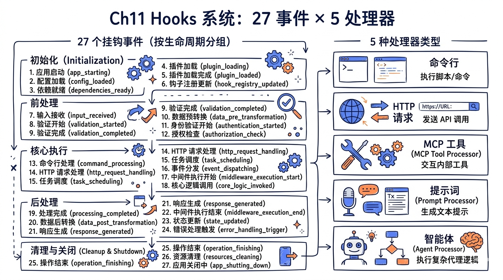
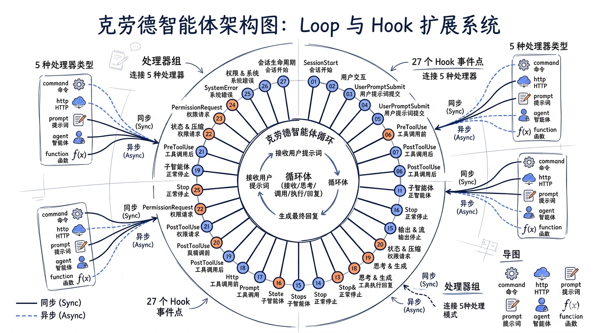
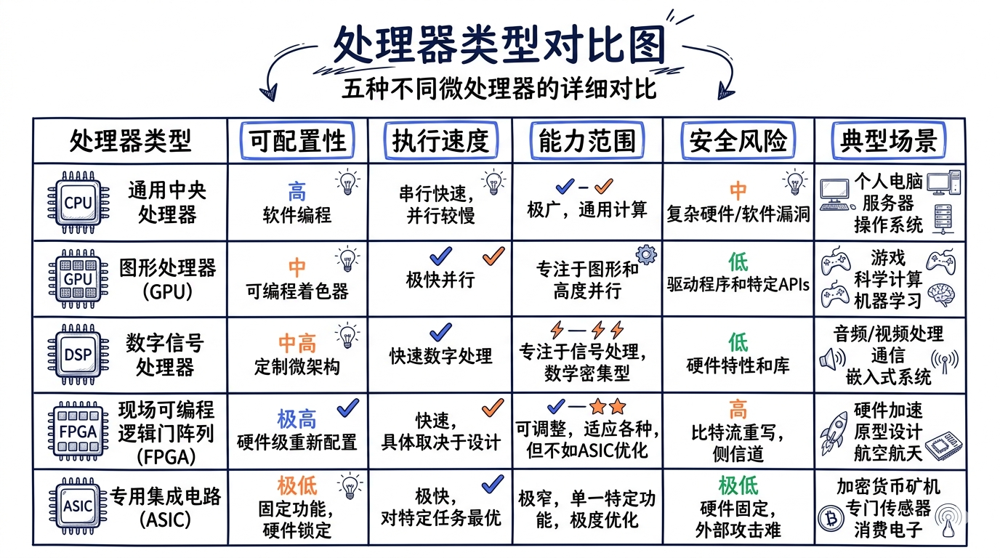

# 第十一章：Hooks 系统——27 事件 x 5 处理器类型



> **源码版本**：Claude Code v2.1.88
> **核心文件**：`src/utils/hooks.ts`（主执行引擎，~5000 行）、`src/utils/hooks/` 目录（基础设施模块）、`src/schemas/hooks.ts`（Schema 定义）、`src/types/hooks.ts`（类型体系）

Claude Code 的 Hooks 系统是一套完整的事件驱动扩展框架。它允许用户在 Claude 生命周期的关键节点——从工具调用前后、到会话启停、到压缩摘要——注入自定义逻辑。与传统的 plugin 系统不同，Hooks 不需要修改核心代码，只需在 `settings.json` 中声明配置，就能让外部脚本、HTTP 服务、甚至 LLM 判定器参与 Claude 的决策流程。

本章将从设计哲学出发，完整拆解 27 个 Hook 事件、5 种处理器类型、匹配与执行机制、以及贯穿其中的安全防线。



---

## 11.1 设计哲学：可观测、可干预、可扩展

Hooks 的设计围绕三个核心原则：

### 11.1.1 事件驱动，不侵入核心

Hooks 系统的基本模型是 **发布-订阅**：Claude 的核心流程在关键节点广播事件（如 `PreToolUse`、`Stop`），外部订阅者注册处理器来响应。核心代码只负责「发射事件 + 收集结果」，不关心处理器的具体实现。

```
核心流程 ──[广播事件]──> Hook Engine ──[查找匹配处理器]──> 执行处理器
                                                             │
                                                     ┌──────┤──────────┐
                                                     │      │          │
                                                  command  http    prompt/agent
```

### 11.1.2 Convention over Code

用户不需要写 TypeScript 或理解 Claude 内部结构。一个 Hook 的定义只需要一段 JSON 配置：

```json
{
  "hooks": {
    "PreToolUse": [{
      "matcher": "Bash",
      "hooks": [{
        "type": "command",
        "command": "echo 'About to run Bash tool'"
      }]
    }]
  }
}
```

这种声明式设计使得 Hooks 对非工程师也友好——运维人员可以配置审计钩子，安全团队可以添加拦截规则，都不需要阅读一行源码。

### 11.1.3 安全第一

Hooks 本质上是「在用户机器上执行任意代码」，因此安全是首要考量：

- **Workspace Trust Gate**：所有 Hook 必须通过工作区信任检查（`shouldSkipHookDueToTrust()`）
- **SSRF Guard**：HTTP Hook 内置了 DNS 重绑定防护（`ssrfGuardedLookup`）
- **Policy Override**：企业管理员可以通过 `policySettings` 禁用所有非托管 Hook
- **Exit Code Protocol**：用退出码区分「信息性输出」和「阻塞性错误」，防止意外中断

---

## 11.2 二十七个 Hook 事件：按生命周期分组

Claude Code 定义了 27 个 Hook 事件（源码中 `HOOK_EVENTS` 常量），覆盖了 Agent 生命周期的每一个关键节点。让我们按逻辑阶段分组理解。

### 11.2.0 全部 27 个事件速查表（按 HOOK_EVENTS 数组顺序）

下表列出**全部 27 个 Hook 事件**，便于快速查阅。详细分组与每个事件的触发时机、matcher 字段在后续 11.2.1–11.2.11 小节展开：

| # | 事件 | # | 事件 | # | 事件 |
|---|---|---|---|---|---|
| 1 | PreToolUse | 10 | SubagentStart | 19 | TaskCompleted |
| 2 | PostToolUse | 11 | SubagentStop | 20 | Elicitation |
| 3 | PostToolUseFailure | 12 | PreCompact | 21 | ElicitationResult |
| 4 | Notification | 13 | PostCompact | 22 | ConfigChange |
| 5 | UserPromptSubmit | 14 | PermissionRequest | 23 | WorktreeCreate |
| 6 | SessionStart | 15 | PermissionDenied | 24 | WorktreeRemove |
| 7 | SessionEnd | 16 | Setup | 25 | InstructionsLoaded |
| 8 | Stop | 17 | TeammateIdle | 26 | CwdChanged |
| 9 | StopFailure | 18 | TaskCreated | 27 | FileChanged |

> 完整定义在 `src/entrypoints/sdk/coreTypes.ts:25-53`。事件名称是字符串字面量，用 `as const` 锁定类型。后续小节按"会话生命周期 / 工具调用 / 权限 / 模型输出 / Subagent / 压缩 / 团队协作 / Elicitation / 配置环境 / Worktree / 通知"11 个组分别展开。

事件列表定义在 `src/entrypoints/sdk/coreTypes.ts` 中：

```typescript
export const HOOK_EVENTS = [
  'PreToolUse',        'PostToolUse',      'PostToolUseFailure',
  'Notification',      'UserPromptSubmit', 'SessionStart',
  'SessionEnd',        'Stop',             'StopFailure',
  'SubagentStart',     'SubagentStop',     'PreCompact',
  'PostCompact',       'PermissionRequest','PermissionDenied',
  'Setup',             'TeammateIdle',     'TaskCreated',
  'TaskCompleted',     'Elicitation',      'ElicitationResult',
  'ConfigChange',      'WorktreeCreate',   'WorktreeRemove',
  'InstructionsLoaded','CwdChanged',       'FileChanged',
] as const
```

### 11.2.1 会话生命周期事件

| 事件 | 触发时机 | matcher 字段 | 典型用途 |
|------|---------|-------------|---------|
| `SessionStart` | 新会话启动（包括恢复、清除、压缩后重启） | `source`: startup / resume / clear / compact | 初始化环境变量、加载项目配置 |
| `SessionEnd` | 会话结束 | `reason`: clear / logout / prompt_input_exit / other | 清理临时文件、保存统计 |
| `Setup` | 项目初始化或维护 | `trigger`: init / maintenance | 运行 `npm install`、检查依赖 |

**SessionStart 的特殊能力**：它可以通过 `CLAUDE_ENV_FILE` 环境变量写入 bash export 语句，这些变量会注入到后续的所有 BashTool 命令中。这是一个非常强大的机制——你可以在 SessionStart Hook 中动态设置项目路径、API 密钥引用等。

```typescript
// src/utils/hooks.ts 中的环境文件设置
if (
  !isPowerShell &&
  (hookEvent === 'SessionStart' ||
   hookEvent === 'Setup' ||
   hookEvent === 'CwdChanged' ||
   hookEvent === 'FileChanged') &&
  hookIndex !== undefined
) {
  envVars.CLAUDE_ENV_FILE = await getHookEnvFilePath(hookEvent, hookIndex)
}
```

**SessionEnd 的超时策略**：为了避免关闭时 Hook 阻塞太久，SessionEnd 默认只给 1500ms：

```typescript
const SESSION_END_HOOK_TIMEOUT_MS_DEFAULT = 1500

export function getSessionEndHookTimeoutMs(): number {
  const raw = process.env.CLAUDE_CODE_SESSIONEND_HOOKS_TIMEOUT_MS
  const parsed = raw ? parseInt(raw, 10) : NaN
  return Number.isFinite(parsed) && parsed > 0
    ? parsed
    : SESSION_END_HOOK_TIMEOUT_MS_DEFAULT
}
```

### 11.2.2 工具调用事件

| 事件 | 触发时机 | matcher 字段 | 典型用途 |
|------|---------|-------------|---------|
| `PreToolUse` | 工具执行前 | `tool_name`: Write / Bash / Edit ... | 参数校验、输入过滤 |
| `PostToolUse` | 工具执行后 | `tool_name` | 结果审计、格式化、后处理 |
| `PostToolUseFailure` | 工具执行失败后 | `tool_name` | 错误日志、重试逻辑 |

这三个事件构成了工具调用的完整「AOP（面向切面编程）」链。看一下 `executePreToolHooks` 的实现：

```typescript
export async function* executePreToolHooks<ToolInput>(
  toolName: string,
  toolUseID: string,
  toolInput: ToolInput,
  toolUseContext: ToolUseContext,
  permissionMode?: string,
  signal?: AbortSignal,
  timeoutMs: number = TOOL_HOOK_EXECUTION_TIMEOUT_MS,
  requestPrompt?: (...) => ...,
  toolInputSummary?: string | null,
): AsyncGenerator<AggregatedHookResult> {
  // 快速路径：无 Hook 直接返回
  const appState = toolUseContext.getAppState()
  const sessionId = toolUseContext.agentId ?? getSessionId()
  if (!hasHookForEvent('PreToolUse', appState, sessionId)) {
    return
  }

  const hookInput: PreToolUseHookInput = {
    ...createBaseHookInput(permissionMode, undefined, toolUseContext),
    hook_event_name: 'PreToolUse',
    tool_name: toolName,
    tool_input: toolInput,
    tool_use_id: toolUseID,
  }

  yield* executeHooks({
    hookInput,
    toolUseID,
    matchQuery: toolName,
    signal,
    timeoutMs,
    toolUseContext,
    requestPrompt,
    toolInputSummary,
  })
}
```

注意 `hasHookForEvent()` 这个快速路径——它避免了在无 Hook 配置时进行昂贵的 JSON 序列化和匹配操作。这种优化在高频事件上至关重要。

**Exit Code Protocol**（PreToolUse 为例）：

| 退出码 | 行为 |
|--------|------|
| 0 | stdout/stderr 不显示，Hook 成功 |
| 2 | 显示 stderr 给模型，**阻止工具调用** |
| 其他 | 显示 stderr 给用户，但继续工具调用 |

### 11.2.3 权限事件

| 事件 | 触发时机 | matcher 字段 | 典型用途 |
|------|---------|-------------|---------|
| `PermissionRequest` | 权限弹窗即将显示时 | `tool_name` | 自动批准/拒绝特定操作 |
| `PermissionDenied` | auto 模式分类器拒绝了工具调用 | `tool_name` | 通知用户、记录被拒请求 |

`PermissionRequest` 是最强大的 Hook 之一——它可以完全替代人工权限审批：

```typescript
// hookSpecificOutput 的决策格式
z.object({
  hookEventName: z.literal('PermissionRequest'),
  decision: z.union([
    z.object({
      behavior: z.literal('allow'),
      updatedInput: z.record(z.string(), z.unknown()).optional(),
      updatedPermissions: z.array(permissionUpdateSchema()).optional(),
    }),
    z.object({
      behavior: z.literal('deny'),
      message: z.string().optional(),
      interrupt: z.boolean().optional(),
    }),
  ]),
})
```

这意味着你可以通过 PermissionRequest Hook 实现自定义的权限策略服务器——Claude 把每个需要审批的操作发给你的服务器，你返回 allow 或 deny。

### 11.2.4 模型输出控制事件

| 事件 | 触发时机 | matcher 字段 | 典型用途 |
|------|---------|-------------|---------|
| `Stop` | Claude 即将结束回复 | 无 | 质量检查、完成度验证 |
| `StopFailure` | API 错误导致回合结束 | `error`: rate_limit / authentication_failed / ... | 错误监控、告警 |
| `UserPromptSubmit` | 用户提交 prompt | 无 | 输入过滤、预处理 |

`Stop` Hook 在 Agent 执行中扮演着「守门员」角色——它可以阻止 Claude 在任务未完成时就结束回复。如果 Stop Hook 返回退出码 2，Claude 会收到 stderr 内容作为反馈，继续对话。

### 11.2.5 Subagent 事件

| 事件 | 触发时机 | matcher 字段 | 典型用途 |
|------|---------|-------------|---------|
| `SubagentStart` | 子代理启动 | `agent_type` | 注入子代理上下文 |
| `SubagentStop` | 子代理即将结束 | `agent_type` | 验证子代理输出质量 |

一个巧妙的设计：当 agent frontmatter 定义了 `Stop` Hook 时，`registerFrontmatterHooks()` 会自动将其转换为 `SubagentStop`：

```typescript
// src/utils/hooks/registerFrontmatterHooks.ts
let targetEvent: HookEvent = event
if (isAgent && event === 'Stop') {
  targetEvent = 'SubagentStop'
  logForDebugging(
    `Converting Stop hook to SubagentStop for ${sourceName}
     (subagents trigger SubagentStop)`
  )
}
```

### 11.2.6 压缩事件

| 事件 | 触发时机 | matcher 字段 | 典型用途 |
|------|---------|-------------|---------|
| `PreCompact` | 对话压缩前 | `trigger`: manual / auto | 注入自定义压缩指令 |
| `PostCompact` | 对话压缩后 | `trigger` | 审计压缩摘要 |

### 11.2.7 团队协作事件

| 事件 | 触发时机 | matcher 字段 | 典型用途 |
|------|---------|-------------|---------|
| `TeammateIdle` | 队友即将空闲 | 无 | 分配新任务、防止空闲 |
| `TaskCreated` | 任务被创建 | 无 | 验证任务描述、设置标签 |
| `TaskCompleted` | 任务被标记完成 | 无 | 完成度验证、触发下游任务 |

### 11.2.8 MCP Elicitation 事件

| 事件 | 触发时机 | matcher 字段 | 典型用途 |
|------|---------|-------------|---------|
| `Elicitation` | MCP 服务器请求用户输入 | `mcp_server_name` | 自动填充、拦截 |
| `ElicitationResult` | 用户回复 MCP elicitation | `mcp_server_name` | 覆盖用户响应 |

### 11.2.9 配置与环境事件

| 事件 | 触发时机 | matcher 字段 | 典型用途 |
|------|---------|-------------|---------|
| `ConfigChange` | 配置文件在会话中变更 | `source`: user/project/local/policy/skills | 审计日志、阻止不安全变更 |
| `InstructionsLoaded` | CLAUDE.md 或 rule 被加载 | `load_reason`: session_start / path_glob_match / ... | 观测性记录 |
| `CwdChanged` | 工作目录改变 | 无 | 重新加载环境变量 |
| `FileChanged` | 被监控文件变化 | 文件名（pipe 分隔） | 自动重载 .env、重跑配置 |

### 11.2.10 Worktree 事件

| 事件 | 触发时机 | matcher 字段 | 典型用途 |
|------|---------|-------------|---------|
| `WorktreeCreate` | 创建隔离工作树 | 无 | 自定义 worktree 实现 |
| `WorktreeRemove` | 移除工作树 | 无 | 清理资源 |

### 11.2.11 通知事件

| 事件 | 触发时机 | matcher 字段 | 典型用途 |
|------|---------|-------------|---------|
| `Notification` | 系统通知发送 | `notification_type`: permission_prompt / idle_prompt / ... | 自定义通知方式 |


---

## 11.3 五种处理器类型

每个 Hook 事件可以关联一个或多个「处理器」（handler）。Claude Code 支持 5 种处理器类型，前 4 种可以通过 `settings.json` 配置，第 5 种只能通过代码注册。

### 11.3.1 command 处理器（Shell 命令）

最基础也最常用的处理器类型——直接在 shell 中执行命令：

```typescript
// src/schemas/hooks.ts
const BashCommandHookSchema = z.object({
  type: z.literal('command').describe('Shell command hook type'),
  command: z.string().describe('Shell command to execute'),
  if: IfConditionSchema(),
  shell: z.enum(SHELL_TYPES).optional()
    .describe("'bash' uses $SHELL; 'powershell' uses pwsh."),
  timeout: z.number().positive().optional(),
  statusMessage: z.string().optional(),
  once: z.boolean().optional()
    .describe('If true, hook runs once and is removed'),
  async: z.boolean().optional()
    .describe('If true, hook runs in background without blocking'),
  asyncRewake: z.boolean().optional()
    .describe('If true, hook runs in background and wakes model on exit code 2'),
})
```

**关键特性**：

1. **双 Shell 支持**：`shell` 字段可选 `'bash'` 或 `'powershell'`。Bash 路径是默认的，Windows 上自动使用 Git Bash。PowerShell 路径跳过了所有 Windows POSIX 转换。

2. **`async` 模式**：设置 `async: true` 后 Hook 在后台运行，不阻塞 Agent 主循环。命令输出 `{"async": true}` 作为第一行也能触发异步模式。

3. **`asyncRewake` 模式**：更精巧的异步变体——Hook 在后台运行，但如果退出码为 2（blocking error），会唤醒模型：

```typescript
// src/utils/hooks.ts
if (asyncRewake) {
  void shellCommand.result.then(async result => {
    await new Promise(resolve => setImmediate(resolve))
    // ... 读取 stdout/stderr ...
    if (result.code === 2) {
      enqueuePendingNotification({
        value: wrapInSystemReminder(
          `Stop hook blocking error from "${hookName}": ${stderr || stdout}`
        ),
        mode: 'task-notification',
      })
    }
  })
  return true
}
```

4. **`once` 模式**：设为 `true` 后 Hook 执行一次就自动移除，适合一次性初始化。

5. **环境变量注入**：command Hook 可以通过 `CLAUDE_ENV_FILE` 向后续命令注入环境变量。另外，所有 Hook 自动获得 `CLAUDE_PROJECT_DIR` 等上下文变量。

### 11.3.2 http 处理器（Webhook）

将事件数据 POST 到指定 URL：

```typescript
const HttpHookSchema = z.object({
  type: z.literal('http').describe('HTTP hook type'),
  url: z.string().url().describe('URL to POST the hook input JSON to'),
  if: IfConditionSchema(),
  timeout: z.number().positive().optional(),
  headers: z.record(z.string(), z.string()).optional()
    .describe('Headers with $VAR_NAME env var interpolation'),
  allowedEnvVars: z.array(z.string()).optional()
    .describe('Env vars allowed for interpolation'),
  statusMessage: z.string().optional(),
  once: z.boolean().optional(),
})
```

**安全机制三道防线**：

**第一道：SSRF Guard**。`execHttpHook` 使用 `ssrfGuardedLookup` 作为 DNS lookup 函数，在 DNS 解析阶段就拦截对私有 IP 的访问：

```typescript
// src/utils/hooks/ssrfGuard.ts
export function isBlockedAddress(address: string): boolean {
  // 阻止: 0.0.0.0/8, 10.0.0.0/8, 169.254.0.0/16, 172.16.0.0/12, 192.168.0.0/16
  // 阻止: fc00::/7, fe80::/10, IPv4-mapped IPv6 中的私有地址
  // 允许: 127.0.0.0/8, ::1 (本地开发用)
}
```

注意一个精巧的设计：loopback (127.0.0.1) 是**允许**的——因为本地策略服务器是 HTTP Hook 的主要使用场景。但 cloud metadata 地址（如 169.254.169.254）被严格阻止。

**第二道：URL Allowlist**。管理员可以通过 `allowedHttpHookUrls` 限定可访问的 URL 模式：

```typescript
const policy = getHttpHookPolicy()
if (policy.allowedUrls !== undefined) {
  const matched = policy.allowedUrls.some(p =>
    urlMatchesPattern(hook.url, p)
  )
  if (!matched) {
    return { ok: false, body: '', error: msg }
  }
}
```

**第三道：Header 注入防护**。环境变量插值有两层保护——只有 `allowedEnvVars` 显式列出的变量才会被解析，且值会过滤 CR/LF/NUL 字节防止 header injection：

```typescript
function sanitizeHeaderValue(value: string): string {
  return value.replace(/[\r\n\x00]/g, '')
}

function interpolateEnvVars(value: string, allowedEnvVars: ReadonlySet<string>): string {
  const interpolated = value.replace(
    /\$\{([A-Z_][A-Z0-9_]*)\}|\$([A-Z_][A-Z0-9_]*)/g,
    (_, braced, unbraced) => {
      const varName = braced ?? unbraced
      if (!allowedEnvVars.has(varName)) return ''
      return process.env[varName] ?? ''
    },
  )
  return sanitizeHeaderValue(interpolated)
}
```

### 11.3.3 prompt 处理器（LLM 判定器）

用一个轻量 LLM 调用来评估条件是否满足：

```typescript
const PromptHookSchema = z.object({
  type: z.literal('prompt').describe('LLM prompt hook type'),
  prompt: z.string()
    .describe('Prompt with $ARGUMENTS placeholder for hook input JSON'),
  if: IfConditionSchema(),
  timeout: z.number().positive().optional(),
  model: z.string().optional()
    .describe('Model to use (default: small fast model)'),
  statusMessage: z.string().optional(),
  once: z.boolean().optional(),
})
```

`execPromptHook()` 的执行流程：

1. 用 `addArgumentsToPrompt()` 将 Hook 输入 JSON 替换到 `$ARGUMENTS` 占位符
2. 使用 `queryModelWithoutStreaming()` 单次调用 LLM
3. 强制 JSON Schema 输出格式：`{ ok: boolean, reason?: string }`
4. `ok: true` 表示条件满足（Hook 成功），`ok: false` 表示不满足（阻塞）

```typescript
// LLM 被告知的系统 prompt
const systemPrompt = asSystemPrompt([
  `You are evaluating a hook in Claude Code.
Your response must be a JSON object:
1. If the condition is met: {"ok": true}
2. If not met: {"ok": false, "reason": "..."}`
])
```

配置示例：

```json
{
  "type": "prompt",
  "prompt": "Check if the following tool input contains any hardcoded secrets: $ARGUMENTS",
  "model": "claude-sonnet-4-6"
}
```

### 11.3.4 agent 处理器（Subagent 验证器）

最强大的处理器类型——启动一个独立的多轮 Agent 来验证条件：

```typescript
const AgentHookSchema = z.object({
  type: z.literal('agent').describe('Agentic verifier hook type'),
  prompt: z.string()
    .describe('Prompt describing what to verify. $ARGUMENTS for hook input.'),
  if: IfConditionSchema(),
  timeout: z.number().positive().optional()
    .describe('Timeout in seconds (default 60)'),
  model: z.string().optional()
    .describe('Model to use (default: Haiku)'),
  statusMessage: z.string().optional(),
  once: z.boolean().optional(),
})
```

`execAgentHook()` 的工作方式与 prompt Hook 截然不同：

1. 创建一个独立的 `hookAgentId`
2. 配置所有可用工具（排除禁止的 Agent 工具如 subagent 自身）
3. 添加 `SyntheticOutputTool` 作为结构化输出通道
4. 注册 Stop Hook 强制 Agent 调用 `SyntheticOutputTool`
5. 通过 `query()` 进行多轮执行，最多 50 轮
6. 在结构化输出中提取 `{ ok, reason }` 结果

```typescript
const MAX_AGENT_TURNS = 50

// Agent 的系统 prompt
const systemPrompt = asSystemPrompt([
  `You are verifying a stop condition in Claude Code.
  The conversation transcript is at: ${transcriptPath}
  Use available tools to inspect the codebase and verify.
  Be efficient - use as few steps as possible.
  Return result using ${SYNTHETIC_OUTPUT_TOOL_NAME} tool.`
])
```

Agent Hook 特别适合 Stop 场景——当你想确保 Claude 真正完成了任务（比如「所有测试都通过了」），一个有工具访问权限的 Agent 可以实际运行测试来验证。

### 11.3.5 function 处理器（运行时回调）

第 5 种类型只存在于运行时内存中，不可序列化到 `settings.json`：

```typescript
// src/utils/hooks/sessionHooks.ts
export type FunctionHookCallback = (
  messages: Message[],
  signal?: AbortSignal,
) => boolean | Promise<boolean>

export type FunctionHook = {
  type: 'function'
  id?: string
  timeout?: number
  callback: FunctionHookCallback
  errorMessage: string
  statusMessage?: string
}
```

Function Hook 主要用于内部机制：

- **结构化输出强制**：`registerStructuredOutputEnforcement()` 注册一个 Stop 事件的 function Hook，检查消息中是否包含 `SyntheticOutputTool` 的成功调用
- **验证逻辑**：Agent Hook 的 subagent 使用 function Hook 确保产出结构化结果

```typescript
export function registerStructuredOutputEnforcement(
  setAppState: SetAppState,
  sessionId: string,
): void {
  addFunctionHook(
    setAppState,
    sessionId,
    'Stop',           // 在 Stop 事件上注册
    '',               // 无 matcher
    messages => hasSuccessfulToolCall(messages, SYNTHETIC_OUTPUT_TOOL_NAME),
    `You MUST call the ${SYNTHETIC_OUTPUT_TOOL_NAME} tool...`,
    { timeout: 5000 },
  )
}
```



---

## 11.4 Hook 配置体系

### 11.4.1 配置文件层级

Hook 可以在三个层级的 `settings.json` 中配置：

| 层级 | 文件路径 | 适用范围 |
|------|---------|---------|
| 用户级 | `~/.claude/settings.json` | 所有项目 |
| 项目级 | `.claude/settings.json` | 当前项目 |
| 本地级 | `.claude/settings.local.json` | 当前项目（不提交到 Git） |
| 策略级 | 由组织管理 | 企业强制策略 |

配置合并由 `getHooksConfigFromSnapshot()` 和 `hooksConfigSnapshot.ts` 管理：

```typescript
function getHooksFromAllowedSources(): HooksSettings {
  const policySettings = settingsModule.getSettingsForSource('policySettings')

  // 企业管理员禁用所有 Hook
  if (policySettings?.disableAllHooks === true) return {}

  // 仅允许托管 Hook
  if (policySettings?.allowManagedHooksOnly === true) {
    return policySettings.hooks ?? {}
  }

  // strictPluginOnlyCustomization: 阻止 user/project/local Hook
  if (isRestrictedToPluginOnly('hooks')) {
    return policySettings?.hooks ?? {}
  }

  // 默认：合并所有来源
  const mergedSettings = settingsModule.getSettings_DEPRECATED()
  if (mergedSettings.disableAllHooks === true) {
    return policySettings?.hooks ?? {}
  }
  return mergedSettings.hooks ?? {}
}
```

### 11.4.2 配置结构

一个完整的 Hook 配置由三层嵌套组成：

```
settings.json
└── hooks                          // HooksSettings
    └── [HookEvent]                // e.g., "PreToolUse"
        └── HookMatcher[]          // 匹配器数组
            ├── matcher?: string   // 匹配模式
            └── hooks: HookCommand[] // 处理器数组
```

用 Zod Schema 表达：

```typescript
// src/schemas/hooks.ts
export const HookMatcherSchema = lazySchema(() =>
  z.object({
    matcher: z.string().optional()
      .describe('String pattern to match (e.g. tool names like "Write")'),
    hooks: z.array(HookCommandSchema())
      .describe('List of hooks to execute when the matcher matches'),
  }),
)

export const HooksSchema = lazySchema(() =>
  z.partialRecord(z.enum(HOOK_EVENTS), z.array(HookMatcherSchema())),
)
```

一个真实配置示例：

```json
{
  "hooks": {
    "PreToolUse": [
      {
        "matcher": "Bash",
        "hooks": [
          {
            "type": "command",
            "command": "check-dangerous-commands.sh",
            "if": "Bash(rm *)",
            "timeout": 5,
            "statusMessage": "Checking for dangerous commands..."
          }
        ]
      },
      {
        "matcher": "Write|Edit",
        "hooks": [
          {
            "type": "http",
            "url": "https://policy.example.com/code-review",
            "headers": {
              "Authorization": "Bearer $REVIEW_TOKEN"
            },
            "allowedEnvVars": ["REVIEW_TOKEN"]
          }
        ]
      }
    ],
    "Stop": [
      {
        "hooks": [
          {
            "type": "agent",
            "prompt": "Verify that all tests pass: $ARGUMENTS",
            "model": "claude-sonnet-4-6",
            "timeout": 120
          }
        ]
      }
    ]
  }
}
```

### 11.4.3 `if` 条件过滤

每个处理器都支持 `if` 字段，使用 Permission Rule 语法对 Hook 输入进行预过滤。这避免了为不相关的命令启动进程：

```typescript
// src/schemas/hooks.ts
const IfConditionSchema = lazySchema(() =>
  z.string().optional().describe(
    'Permission rule syntax to filter when this hook runs ' +
    '(e.g., "Bash(git *)"). Only runs if the tool call matches.'
  ),
)
```

`if` 条件仅支持工具相关事件（PreToolUse / PostToolUse / PostToolUseFailure / PermissionRequest）。过滤逻辑在 `prepareIfConditionMatcher()` 中实现：

```typescript
async function prepareIfConditionMatcher(
  hookInput: HookInput,
  tools: Tools | undefined,
): Promise<IfConditionMatcher | undefined> {
  // 仅工具事件支持 if 条件
  if (hookInput.hook_event_name !== 'PreToolUse' &&
      hookInput.hook_event_name !== 'PostToolUse' && ...) {
    return undefined
  }

  const toolName = normalizeLegacyToolName(hookInput.tool_name)
  const tool = tools && findToolByName(tools, hookInput.tool_name)
  const input = tool?.inputSchema.safeParse(hookInput.tool_input)
  const patternMatcher = input?.success && tool?.preparePermissionMatcher
    ? await tool.preparePermissionMatcher(input.data)
    : undefined

  return ifCondition => {
    const parsed = permissionRuleValueFromString(ifCondition)
    if (normalizeLegacyToolName(parsed.toolName) !== toolName) return false
    if (!parsed.ruleContent) return true
    return patternMatcher ? patternMatcher(parsed.ruleContent) : false
  }
}
```

---

## 11.5 HookMatcher 模式匹配

模式匹配是 Hook 系统的路由核心——它决定了哪些 Hook 应该响应当前事件。

### 11.5.1 匹配规则

`matchesPattern()` 函数实现了三种匹配模式：

```typescript
function matchesPattern(matchQuery: string, matcher: string): boolean {
  // 1. 空 matcher 或 "*" 匹配所有
  if (!matcher || matcher === '*') return true

  // 2. 简单字符串或 pipe 分隔列表（精确匹配）
  if (/^[a-zA-Z0-9_|]+$/.test(matcher)) {
    if (matcher.includes('|')) {
      const patterns = matcher.split('|').map(p =>
        normalizeLegacyToolName(p.trim())
      )
      return patterns.includes(matchQuery)
    }
    return matchQuery === normalizeLegacyToolName(matcher)
  }

  // 3. 正则表达式匹配
  try {
    const regex = new RegExp(matcher)
    if (regex.test(matchQuery)) return true
    // 也测试 legacy tool name 以保持向后兼容
    for (const legacyName of getLegacyToolNames(matchQuery)) {
      if (regex.test(legacyName)) return true
    }
    return false
  } catch {
    logForDebugging(`Invalid regex in hook matcher: ${matcher}`)
    return false
  }
}
```

### 11.5.2 事件到 matchQuery 的映射

不同事件使用不同字段作为匹配查询值。完整映射在 `getMatchingHooks()` 中定义：

```typescript
switch (hookInput.hook_event_name) {
  case 'PreToolUse':
  case 'PostToolUse':
  case 'PostToolUseFailure':
  case 'PermissionRequest':
  case 'PermissionDenied':
    matchQuery = hookInput.tool_name       // 工具名
    break
  case 'SessionStart':
    matchQuery = hookInput.source          // startup/resume/clear/compact
    break
  case 'Setup':
  case 'PreCompact':
  case 'PostCompact':
    matchQuery = hookInput.trigger         // init/maintenance 或 manual/auto
    break
  case 'Notification':
    matchQuery = hookInput.notification_type
    break
  case 'SessionEnd':
    matchQuery = hookInput.reason          // clear/logout/...
    break
  case 'StopFailure':
    matchQuery = hookInput.error           // rate_limit/auth_failed/...
    break
  case 'SubagentStart':
  case 'SubagentStop':
    matchQuery = hookInput.agent_type      // 代理类型
    break
  case 'Elicitation':
  case 'ElicitationResult':
    matchQuery = hookInput.mcp_server_name // MCP 服务器名
    break
  case 'ConfigChange':
    matchQuery = hookInput.source          // user_settings/project_settings/...
    break
  case 'InstructionsLoaded':
    matchQuery = hookInput.load_reason     // session_start/path_glob_match/...
    break
  case 'FileChanged':
    matchQuery = basename(hookInput.file_path) // 文件名
    break
  // Stop, UserPromptSubmit, TeammateIdle 等无 matchQuery
}
```

### 11.5.3 Hook 去重

当同一个 Hook 在多个 settings 层级（user/project/local）中重复定义时，需要去重。去重键由 `hookDedupKey()` 生成：

```typescript
function hookDedupKey(m: MatchedHook, payload: string): string {
  return `${m.pluginRoot ?? m.skillRoot ?? ''}\0${payload}`
}
```

去重按类型分组进行：

```typescript
const uniqueCommandHooks = Array.from(
  new Map(
    matchedHooks
      .filter(m => m.hook.type === 'command')
      .map(m => [
        hookDedupKey(m,
          `${m.hook.shell ?? DEFAULT_HOOK_SHELL}\0${m.hook.command}\0${getIfCondition(m.hook)}`
        ),
        m,
      ]),
  ).values(),
)
// 类似地处理 prompt, agent, http 类型...
```

注意 `shell` 字段也参与去重键——同一个命令字符串用 bash 和 powershell 执行是两个不同的 Hook。

---

## 11.6 执行时序：同步 vs 异步

### 11.6.1 同步执行（默认）

默认情况下，所有 Hook 在同一批次中**并行**执行，但整个批次会**阻塞** Agent 主循环：

```typescript
// src/utils/hooks.ts - executeHooks()
// Run all hooks in parallel with individual timeouts
const hookPromises = matchingHooks.map(async function* (
  { hook, pluginRoot, pluginId, skillRoot },
  hookIndex,
): AsyncGenerator<HookResult> {
  // ... 对每个 Hook 并行执行 ...
})
```

执行流程如下：

```
Agent Loop
  │
  ├── 广播 PreToolUse 事件
  │     │
  │     ├── Hook A (command) ──── 并行 ────┐
  │     ├── Hook B (http)    ──── 并行 ────┤
  │     └── Hook C (prompt)  ──── 并行 ────┤
  │                                         │
  │     ◄── 等待所有完成 / 超时 ────────────┘
  │     │
  │     ├── 聚合结果
  │     └── 根据结果决定是否继续
  │
  ├── 执行工具调用（如果未被阻止）
  │
  └── 广播 PostToolUse 事件
        └── ...
```

### 11.6.2 异步执行

command Hook 可以通过两种方式进入异步模式：

**方式一：配置声明**

```json
{
  "type": "command",
  "command": "run-long-task.sh",
  "async": true
}
```

**方式二：运行时协议**

命令的第一行输出 `{"async": true}` 可以动态进入异步模式。这种协议允许命令根据运行时条件决定是否异步执行。

```typescript
// 检测第一行输出中的异步标记
if (firstLine) {
  try {
    const parsed = jsonParse(firstLine.trim())
    if (isAsyncHookJSONOutput(parsed)) {
      const processId = `async_hook_${child.pid}`
      // 注册到异步 Hook 注册表
      registerPendingAsyncHook({
        processId,
        hookId,
        asyncResponse: parsed,
        hookName, hookEvent, command, shellCommand,
        pluginId,
      })
      return // 不等待完成
    }
  } catch { /* 不是 JSON，继续同步等待 */ }
}
```

### 11.6.3 AsyncHookRegistry

异步 Hook 由 `AsyncHookRegistry.ts` 集中管理。它维护了一个全局的 `pendingHooks` Map：

```typescript
// src/utils/hooks/AsyncHookRegistry.ts
const pendingHooks = new Map<string, PendingAsyncHook>()

export type PendingAsyncHook = {
  processId: string
  hookId: string
  hookName: string
  hookEvent: HookEvent | 'StatusLine' | 'FileSuggestion'
  startTime: number
  timeout: number
  command: string
  responseAttachmentSent: boolean
  shellCommand?: ShellCommand
  stopProgressInterval: () => void
}
```

Agent 主循环通过 `checkForAsyncHookResponses()` 周期性检查异步 Hook 是否完成。完成的 Hook 结果会被解析并注入到消息流中：

```typescript
export async function checkForAsyncHookResponses(): Promise<Array<{
  processId: string
  response: SyncHookJSONOutput
  hookName: string
  hookEvent: HookEvent
  // ...
}>> {
  const hooks = Array.from(pendingHooks.values())
  const settled = await Promise.allSettled(
    hooks.map(async hook => {
      if (hook.shellCommand?.status !== 'completed') {
        return { type: 'skip' as const }
      }
      // 解析 stdout 中的 JSON 响应
      // ...
    })
  )
  // ...
}
```

### 11.6.4 asyncRewake 模式

`asyncRewake` 是一种特殊的异步模式，专门用于 Stop Hook。它绕过了 AsyncHookRegistry，直接通过消息队列唤醒模型：

```
Agent 将要 Stop
  │
  ├── asyncRewake Hook 后台启动
  │     │ (不阻塞，Agent 可以停止)
  │     │
  │     ├── 退出码 0 → 静默完成
  │     └── 退出码 2 → enqueuePendingNotification()
  │           │
  │           └── 模型被唤醒，看到 blocking error
  │               继续对话
```

---

## 11.7 Hook 结果处理与 JSON 输出协议

### 11.7.1 HookJSONOutput Schema

Hook 可以输出 JSON 来控制 Claude 的行为。完整的 output schema：

```typescript
// src/types/hooks.ts
export const hookJSONOutputSchema = lazySchema(() => {
  const asyncHookResponseSchema = z.object({
    async: z.literal(true),
    asyncTimeout: z.number().optional(),
  })
  return z.union([asyncHookResponseSchema, syncHookResponseSchema()])
})
```

同步响应 Schema 包含了丰富的控制选项：

```typescript
export const syncHookResponseSchema = lazySchema(() =>
  z.object({
    continue: z.boolean().optional(),      // 是否继续
    suppressOutput: z.boolean().optional(), // 隐藏 stdout
    stopReason: z.string().optional(),      // 停止原因
    decision: z.enum(['approve', 'block']).optional(),
    reason: z.string().optional(),          // 决策原因
    systemMessage: z.string().optional(),   // 系统警告消息
    hookSpecificOutput: z.union([           // 事件特定输出
      // PreToolUse: 可修改工具输入
      z.object({
        hookEventName: z.literal('PreToolUse'),
        permissionDecision: permissionBehaviorSchema().optional(),
        updatedInput: z.record(z.string(), z.unknown()).optional(),
        additionalContext: z.string().optional(),
      }),
      // SessionStart: 可注入 context + watchPaths
      z.object({
        hookEventName: z.literal('SessionStart'),
        additionalContext: z.string().optional(),
        initialUserMessage: z.string().optional(),
        watchPaths: z.array(z.string()).optional(),
      }),
      // PermissionRequest: 可决定权限
      z.object({
        hookEventName: z.literal('PermissionRequest'),
        decision: z.union([
          z.object({ behavior: z.literal('allow'), ... }),
          z.object({ behavior: z.literal('deny'), ... }),
        ]),
      }),
      // ... 更多事件特定输出
    ]).optional(),
  }),
)
```

### 11.7.2 AggregatedHookResult

当多个 Hook 对同一事件响应时，结果通过 `AggregatedHookResult` 聚合：

```typescript
export type AggregatedHookResult = {
  message?: HookResultMessage
  blockingError?: HookBlockingError
  preventContinuation?: boolean
  stopReason?: string
  permissionBehavior?: PermissionResult['behavior']
  additionalContexts?: string[]   // 多个 Hook 的 context 合并为数组
  updatedInput?: Record<string, unknown>
  permissionRequestResult?: PermissionRequestResult
  // ...
}
```

**冲突解决策略**：
- `permissionBehavior`：最严格的 behavior 胜出（deny > ask > allow）
- `additionalContexts`：所有 Hook 的 context 合并为数组，全部注入模型
- `updatedInput`：后执行的 Hook 覆盖先执行的
- `blockingError`：任何一个 Hook 返回 blocking error 就阻止

---

## 11.8 Hook 基础设施模块

### 11.8.1 hookHelpers.ts

提供三个关键辅助函数：`addArgumentsToPrompt()` 处理 `$ARGUMENTS`/`$0`/`$1` 占位符替换；`createStructuredOutputTool()` 为 Agent Hook 创建结构化输出工具（`{ok, reason}` schema）；`registerStructuredOutputEnforcement()` 注册 function Hook 强制 Agent 调用 SyntheticOutputTool。

### 11.8.2 hooksConfigManager.ts

Hook 配置的高层管理器。`getHookEventMetadata()` 为 27 个事件提供描述、matcher 字段信息等元数据（memoized）。`groupHooksByEventAndMatcher()` 将所有来源（settings + registered + session）的 Hook 按 event/matcher 分组，供 `/hooks` UI 展示。`getSortedMatchersForEvent()` 按来源优先级排序 matcher。

### 11.8.3 sessionHooks.ts

管理运行时会话级 Hook——不持久化，存在于进程内存中。核心 API 是 `addSessionHook()`（注册配置类 Hook）和 `addFunctionHook()`（注册回调类 Hook，返回可用于 `removeFunctionHook()` 的 ID）。

一个重要的设计决策：`SessionHooksState` 使用 `Map` 而非 `Record`。原因是并行 Agent 场景下（N 个 schema-mode agent 在同一 tick 内调用 addFunctionHook），Map 的 `.set()` 是 O(1) 且不改变容器引用（跳过 ~30 个 store listener 的触发），而 Record + spread 是 O(N) 且每次触发所有 listener（总计 O(N^2)）。

### 11.8.4 registerFrontmatterHooks.ts

将 Agent/Skill frontmatter 中的 Hook 注册为会话级 Hook。对 Agent 会自动将 `Stop` 转换为 `SubagentStop`（因为 subagent 完成时触发的是 SubagentStop 而非 Stop）。

### 11.8.5 registerSkillHooks.ts

类似 `registerFrontmatterHooks`，但专门为 Skill 设计。核心差异是支持 `once: true`——通过注册 `onHookSuccess` 回调，在 Hook 第一次成功执行后自动调用 `removeSessionHook()` 将其移除。同时传递 `skillRoot` 参数，使 Hook 执行时能获得 `CLAUDE_PLUGIN_ROOT` 环境变量指向 Skill 的根目录。

### 11.8.6 hooksConfigSnapshot.ts

Hook 配置的快照机制——在启动时通过 `captureHooksConfigSnapshot()` 捕获配置，后续执行基于快照而非实时读取磁盘。`updateHooksConfigSnapshot()` 在 `/hooks` 命令编辑后调用，先 `resetSettingsCache()` 清缓存再重新读取。快照内部调用 `getHooksFromAllowedSources()` 处理 policy 层级过滤（disableAllHooks / allowManagedHooksOnly / strictPluginOnly）。

### 11.8.7 fileChangedWatcher.ts

使用 `chokidar` 监控文件变化，触发 `FileChanged` Hook。配置 `awaitWriteFinish`（500ms 稳定性阈值）防止写入中途触发。watch 路径支持两种来源：静态路径（matcher 字段中 pipe 分隔的文件名如 `.envrc|.env`）和动态路径（Hook 输出中的 `watchPaths` 数组）。当工作目录变化时（`onCwdChangedForHooks`），watcher 会重新解析路径并重启。

### 11.8.8 hookEvents.ts

Hook 事件广播系统——独立于主消息流的事件通道。发射三种事件：`HookStartedEvent`、`HookProgressEvent`、`HookResponseEvent`。默认仅 SessionStart 和 Setup 事件被广播，启用 `includeHookEvents` 选项或 REMOTE 模式后才发射全部事件。支持未注册 handler 时缓存最多 100 个 pending 事件。

### 11.8.9 postSamplingHooks.ts

内部 post-sampling Hook 注册表——在模型采样完成后执行。当前唯一使用者是 `skillImprovement.ts`，它每隔 5 条用户消息分析一次对话，检测用户是否表达了应该永久化到 Skill 定义中的偏好。注册表中的 Hook 静默失败（`logError` 但不影响主循环）。

---

## 11.9 Function Hooks vs Config Hooks

这是 Hooks 系统中一个容易混淆但极其重要的区分。

### 11.9.1 Config Hooks（可持久化）

定义在 `settings.json` 中的 Hook，包括 `command`、`http`、`prompt`、`agent` 四种类型。它们的核心特征是**可序列化**——可以在配置文件中声明，跨会话持久存在。

```
settings.json → HooksSchema → captureHooksConfigSnapshot() → getMatchingHooks()
```

另外，Plugin 和 Skill 的 frontmatter 也可以定义 Config Hook，但这些在注册时会转换为 Session Hook 存储在内存中。

### 11.9.2 Function Hooks（仅运行时）

只存在于进程内存中的 TypeScript 回调。**不能**写入 `settings.json`，**不能**通过配置定义。

它们在代码中主动注册：

```typescript
// 注册
const hookId = addFunctionHook(
  setAppState, sessionId,
  'Stop', '',       // 事件和 matcher
  (messages) => {   // 回调：返回 boolean
    return hasSuccessfulToolCall(messages, SYNTHETIC_OUTPUT_TOOL_NAME)
  },
  'You MUST call the tool...',  // 错误消息
  { timeout: 5000 },
)

// 稍后移除
removeFunctionHook(setAppState, sessionId, 'Stop', hookId)
```

### 11.9.3 Callback Hooks（SDK 级别）

还有第三种隐含类型——`callback` Hook，由 SDK 或插件通过 `getRegisteredHooks()` 注册。这些是 TypeScript 函数，直接接收 `HookInput` 并返回 `HookJSONOutput`：

```typescript
export type HookCallback = {
  type: 'callback'
  callback: (
    input: HookInput,
    toolUseID: string | null,
    abort: AbortSignal | undefined,
    hookIndex?: number,
    context?: HookCallbackContext,
  ) => Promise<HookJSONOutput>
  timeout?: number
  internal?: boolean  // 内部 Hook 不记录 tengu_run_hook 指标
}
```

内部 callback Hook 走快速路径——跳过 span/progress/abort/processHookJSONOutput 等开销：

```typescript
// 快速路径：所有 Hook 都是内部 callback
if (userHooks.length === 0) {
  const batchStartTime = Date.now()
  for (const [i, { hook }] of matchingHooks.entries()) {
    if (hook.type === 'callback') {
      await hook.callback(hookInput, toolUseID, signal, i, context)
    }
  }
  // 跳过 telemetry span、进度消息等
  return
}
```

三种类型的关系总结：

| 特征 | Config Hook | Function Hook | Callback Hook |
|------|------------|---------------|---------------|
| 配置方式 | settings.json | 代码注册 | SDK/Plugin 注册 |
| 可序列化 | Yes | No | No |
| 执行方式 | 进程/HTTP/LLM | 内存回调 | 内存回调 |
| 典型用途 | 用户扩展 | 内部验证 | SDK 集成 |
| 去重 | 按内容去重 | 不去重 | 不去重 |

---

## 11.10 四个实战示例

### 11.10.1 示例一：阻止危险命令

目标：在 Bash 工具执行 `rm -rf` 之前拦截。

```json
{
  "hooks": {
    "PreToolUse": [
      {
        "matcher": "Bash",
        "hooks": [
          {
            "type": "command",
            "command": "echo $HOOK_INPUT | jq -r '.tool_input.command' | grep -q 'rm.*-rf' && echo 'Dangerous: rm -rf detected' >&2 && exit 2 || exit 0",
            "if": "Bash(rm *)",
            "statusMessage": "Checking for dangerous commands..."
          }
        ]
      }
    ]
  }
}
```

**工作原理**：
1. `matcher: "Bash"` 只匹配 Bash 工具调用
2. `if: "Bash(rm *)"` 进一步过滤，只有包含 `rm` 的命令才触发 Hook
3. 退出码 2 阻止工具调用，stderr 反馈给模型

### 11.10.2 示例二：使用 Webhook 记录审计日志

目标：将所有文件写入操作发送到企业审计服务。

```json
{
  "hooks": {
    "PostToolUse": [
      {
        "matcher": "Write|Edit",
        "hooks": [
          {
            "type": "http",
            "url": "https://audit.example.com/api/claude-actions",
            "headers": {
              "Authorization": "Bearer $AUDIT_TOKEN",
              "X-Project": "my-project"
            },
            "allowedEnvVars": ["AUDIT_TOKEN"],
            "timeout": 5
          }
        ]
      }
    ]
  }
}
```

**工作原理**：
1. 仅在 Write 或 Edit 工具执行**完成后**触发
2. Hook 输入 JSON（包含 tool_input 和 tool_response）会被 POST 到审计服务
3. `$AUDIT_TOKEN` 从环境变量中安全插值
4. 5 秒超时避免审计服务故障影响 Claude 使用

### 11.10.3 示例三：用 LLM 检查代码质量

目标：在每次代码写入后让 LLM 判定是否符合编码规范。

```json
{
  "hooks": {
    "PostToolUse": [
      {
        "matcher": "Write",
        "hooks": [
          {
            "type": "prompt",
            "prompt": "Review the following file write operation. Check if the code follows best practices (no hardcoded secrets, proper error handling, consistent naming). Tool input and response: $ARGUMENTS",
            "model": "claude-haiku-4-5",
            "timeout": 30,
            "statusMessage": "Reviewing code quality..."
          }
        ]
      }
    ]
  }
}
```

**工作原理**：
1. `$ARGUMENTS` 被替换为完整的 Hook 输入 JSON
2. Haiku 模型快速评估，返回 `{ok: true}` 或 `{ok: false, reason: "..."}`
3. 如果不通过，阻塞消息反馈给 Claude 主模型

### 11.10.4 示例四：SessionStart 初始化项目环境

目标：在会话启动时自动加载项目环境变量和运行配置检查。

```json
{
  "hooks": {
    "SessionStart": [
      {
        "matcher": "startup",
        "hooks": [
          {
            "type": "command",
            "command": "#!/bin/bash\nif [ -f .env ]; then\n  while IFS= read -r line; do\n    [[ $line =~ ^#.*$ ]] && continue\n    [[ -z $line ]] && continue\n    echo \"export $line\" >> \"$CLAUDE_ENV_FILE\"\n  done < .env\nfi\necho 'Project environment loaded'",
            "statusMessage": "Loading project environment...",
            "timeout": 10
          }
        ]
      }
    ],
    "FileChanged": [
      {
        "matcher": ".env",
        "hooks": [
          {
            "type": "command",
            "command": "#!/bin/bash\nwhile IFS= read -r line; do\n  [[ $line =~ ^#.*$ ]] && continue\n  [[ -z $line ]] && continue\n  echo \"export $line\" >> \"$CLAUDE_ENV_FILE\"\ndone < .env",
            "statusMessage": "Reloading .env..."
          }
        ]
      }
    ]
  }
}
```

**工作原理**：
1. `SessionStart` Hook 读取 `.env` 文件，将变量写入 `CLAUDE_ENV_FILE`
2. 这些变量会注入到后续所有 BashTool 命令的执行环境中
3. `FileChanged` Hook 监控 `.env` 文件变化，自动重新加载
4. matcher 为 `"startup"` 确保只在新启动时运行（不在 resume/compact 时重复）

---

## 11.11 安全架构

### 11.11.1 Trust Gate

所有 Hook 执行前的第一道检查：

```typescript
export function shouldSkipHookDueToTrust(): boolean {
  // SDK 模式下信任是隐式的
  const isInteractive = !getIsNonInteractiveSession()
  if (!isInteractive) return false

  // 交互模式下必须接受 Trust Dialog
  const hasTrust = checkHasTrustDialogAccepted()
  return !hasTrust
}
```

这防止了一个历史漏洞：用户拒绝 Trust Dialog 时 SessionEnd Hook 仍然执行。

### 11.11.2 Policy 层级控制

企业管理员有三种控制模式：

1. **`disableAllHooks: true`**（policy level）：禁用一切 Hook
2. **`allowManagedHooksOnly: true`**：只运行 policy 级别定义的 Hook
3. **`disableAllHooks: true`**（non-policy level）：用户自己禁用，但 policy Hook 仍然运行

```typescript
export function shouldAllowManagedHooksOnly(): boolean {
  const policySettings = getSettingsForSource('policySettings')
  if (policySettings?.allowManagedHooksOnly === true) return true
  // 用户设 disableAllHooks 时，policy Hook 不受影响
  if (getSettings_DEPRECATED().disableAllHooks === true &&
      policySettings?.disableAllHooks !== true) {
    return true
  }
  return false
}
```

### 11.11.3 SSRF 防护

`ssrfGuard.ts` 实现了全面的地址检测：

```
阻止的地址范围:
  IPv4: 0.0.0.0/8, 10.0.0.0/8, 100.64.0.0/10 (CGNAT),
        169.254.0.0/16 (link-local), 172.16.0.0/12, 192.168.0.0/16
  IPv6: :: (unspecified), fc00::/7 (ULA), fe80::/10 (link-local),
        ::ffff:<blocked-v4> (IPv4-mapped)

允许的地址范围:
  127.0.0.0/8 (loopback), ::1 (loopback)
```

特别注意对 IPv4-mapped IPv6 地址的处理——攻击者可能用 `::ffff:169.254.169.254` 绕过简单的 IPv4 检查。代码通过 `extractMappedIPv4()` 提取嵌入地址后再检查。

### 11.11.4 ConfigChange 的策略保护

即使 Hook 能拦截配置变更，policy settings 的变更永远不会被阻止：

```typescript
export async function executeConfigChangeHooks(
  source: ConfigChangeSource,
  filePath?: string,
  timeoutMs: number = TOOL_HOOK_EXECUTION_TIMEOUT_MS,
): Promise<HookOutsideReplResult[]> {
  const results = await executeHooksOutsideREPL({ ... })

  // Policy settings 永远不能被 Hook 阻止
  if (source === 'policy_settings') {
    return results.map(r => ({ ...r, blocked: false }))
  }
  return results
}
```

---

## 11.12 性能优化

Hook 系统在每次工具调用时都会被触发（PreToolUse + PostToolUse），因此性能至关重要。源码中有四处关键优化：

1. **快速路径检测**：`hasHookForEvent()` 在进入完整匹配逻辑前做轻量存在性检查（检查 snapshot、registered hooks、session hooks），避免无 Hook 时的昂贵 JSON 序列化。

2. **内部 Hook 快速路径**：当批次中只有内部 callback Hook（如 attribution、session file access）时，跳过所有 telemetry span、进度消息、abort signal 等开销。据注释，这将 PostToolUse 的 Hook 开销从 6.01us 降到 ~1.8us（-70%）。

3. **延迟 JSON 序列化**：`getJsonInput()` 使用 lazy-once 模式——只在第一个 command/prompt/agent/http Hook 需要时才序列化 hookInput。纯 callback/function 批次零序列化成本。

4. **元数据缓存**：`getHookEventMetadata()` 使用 `memoize`，以排序后的 toolNames 拼接字符串为 cache key，避免 HooksConfigMenu 每次渲染时重复构建元数据。

---

## 动手实践

### 练习 1：自定义 PreToolUse Guard

在 `.claude/settings.json` 中配置一个 PreToolUse Hook，阻止 Claude 写入 `node_modules/` 目录下的任何文件：

```json
{
  "hooks": {
    "PreToolUse": [
      {
        "matcher": "Write|Edit",
        "hooks": [
          {
            "type": "command",
            "command": "..."
          }
        ]
      }
    ]
  }
}
```

提示：Hook 输入 JSON 中 `tool_input.file_path` 包含目标文件路径。使用 `jq` 或 `grep` 检查路径，退出码 2 阻止操作。

### 练习 2：实现 PermissionRequest Hook

编写一个 HTTP Hook 服务器（Node.js/Python）监听 `localhost:3456`，接收 PermissionRequest 事件。自动 allow 所有 Read 调用，deny 涉及 `~/.ssh/` 的操作，其他 fallthrough 到默认权限弹窗。

### 练习 3：阅读 `executeHooks()` 函数

找到 `src/utils/hooks.ts` 约第 1952 行的 `executeHooks()` 函数，跟踪四个阶段：匹配发现 → 进度 yield → 并行执行 → 结果聚合。重点观察 callback/function 与 command/prompt/agent/http 的执行路径分叉点。

---

## 源码对照表

| 概念 | 源码路径 | 说明 |
|------|---------|------|
| Hook 事件定义 | `src/entrypoints/sdk/coreTypes.ts:25-53` | 27 个事件常量 |
| Hook Schema | `src/schemas/hooks.ts` | Zod Schema：HookCommandSchema, HookMatcherSchema, HooksSchema |
| Hook 类型定义 | `src/types/hooks.ts` | HookJSONOutput, HookCallback, HookResult, AggregatedHookResult |
| 主执行引擎 | `src/utils/hooks.ts` | executeHooks(), getMatchingHooks(), matchesPattern() |
| 各事件执行器 | `src/utils/hooks.ts:3394-4967` | executePreToolHooks(), executeStopHooks() 等 27 个函数 |
| 命令 Hook 执行 | `src/utils/hooks.ts:747-1344` | execCommandHook()：Shell 双路径、环境变量、异步检测 |
| HTTP Hook 执行 | `src/utils/hooks/execHttpHook.ts` | execHttpHook()：SSRF guard、proxy、header 插值 |
| Prompt Hook 执行 | `src/utils/hooks/execPromptHook.ts` | execPromptHook()：单次 LLM 调用 |
| Agent Hook 执行 | `src/utils/hooks/execAgentHook.ts` | execAgentHook()：多轮 Agent 循环 |
| Hook 辅助函数 | `src/utils/hooks/hookHelpers.ts` | addArgumentsToPrompt(), createStructuredOutputTool() |
| 配置管理器 | `src/utils/hooks/hooksConfigManager.ts` | 元数据、分组、排序、UI 支持 |
| 配置快照 | `src/utils/hooks/hooksConfigSnapshot.ts` | 启动时捕获、policy 层级过滤 |
| Session Hooks | `src/utils/hooks/sessionHooks.ts` | 运行时内存 Hook：add/remove/get |
| Frontmatter 注册 | `src/utils/hooks/registerFrontmatterHooks.ts` | Agent/Skill frontmatter Hook 注册 |
| Skill Hook 注册 | `src/utils/hooks/registerSkillHooks.ts` | once 支持、skillRoot 绑定 |
| 异步 Hook 注册表 | `src/utils/hooks/AsyncHookRegistry.ts` | 后台 Hook 管理、轮询检查 |
| SSRF 防护 | `src/utils/hooks/ssrfGuard.ts` | IP 地址检测、IPv4-mapped IPv6 处理 |
| 文件监控 | `src/utils/hooks/fileChangedWatcher.ts` | chokidar watcher、动态 watchPaths |
| Hook 事件广播 | `src/utils/hooks/hookEvents.ts` | 独立事件通道：started/progress/response |
| Post-Sampling | `src/utils/hooks/postSamplingHooks.ts` | 内部 post-sampling Hook 注册表 |
| Skill Improvement | `src/utils/hooks/skillImprovement.ts` | 技能改进检测（post-sampling 应用） |
| API Query Helper | `src/utils/hooks/apiQueryHookHelper.ts` | 通用 API 查询 Hook 工厂 |
| Hook 配置 UI | `src/commands/hooks/` + `src/components/hooks/` | /hooks 命令和配置界面 |

---

## 本章小结

本章深入剖析了 Claude Code 的 Hooks 系统，这是整个架构中最具扩展性的模块之一。核心要点：

1. **27 个事件覆盖完整生命周期**：从 SessionStart 到 SessionEnd，从 PreToolUse 到 PostToolUse，每一个关键决策点都可以被拦截和观测。

2. **5 种处理器类型形成能力阶梯**：command（最轻量、最快）→ http（远程集成）→ prompt（LLM 判定）→ agent（多轮验证）→ function（内部回调）。选择哪种取决于验证的复杂度和延迟预算。

3. **matcher 模式匹配实现精确路由**：通过精确匹配、pipe 分隔列表、正则表达式三种模式，配合 `if` 条件过滤，Hook 可以精确到「仅在 Bash 工具执行 git push 时触发」。

4. **同步/异步执行模型兼顾实时性和效率**：默认同步阻塞保证安全性，async/asyncRewake 模式支持长耗时的后台验证。

5. **安全是第一要务**：Trust Gate、SSRF Guard、Header Injection 防护、Policy Override——多层防线确保 Hook 不会成为攻击向量。

6. **Config Hooks vs Function Hooks**：配置 Hook 面向用户扩展，function Hook 面向内部机制。理解这个分界是掌握 Hook 系统全貌的关键。

7. **性能敏感的设计**：快速路径检测、延迟序列化、内部 Hook 快速路径、元数据缓存——在每次工具调用的关键路径上，这些优化确保了亚毫秒级的额外开销。

在下一章中，我们将探索 Claude Code 的 MCP（Model Context Protocol）集成——另一个核心扩展机制，它和 Hooks 系统互补，共同构成了 Claude Code 的可扩展性基础设施。

## 思考题

27 个 Hook 事件中，你最想用哪一个挂自己的逻辑？

欢迎在评论区聊聊你的想法。

下一讲，我们换个角度看《MCP 协议全解》。

