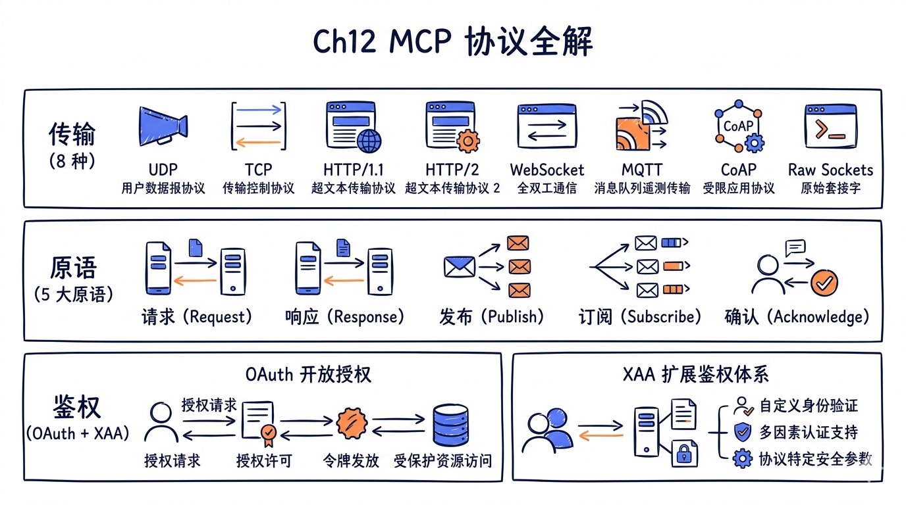
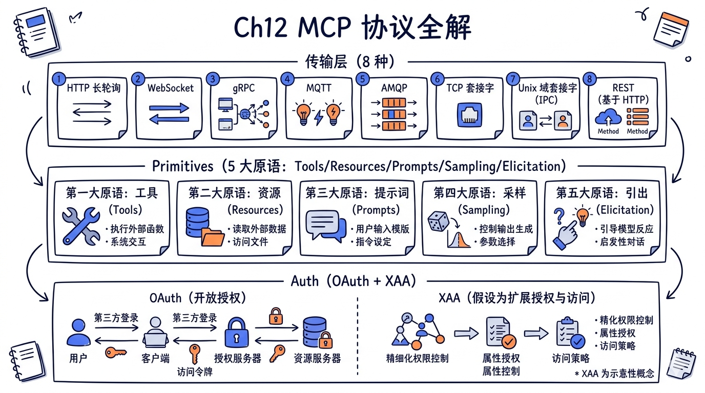
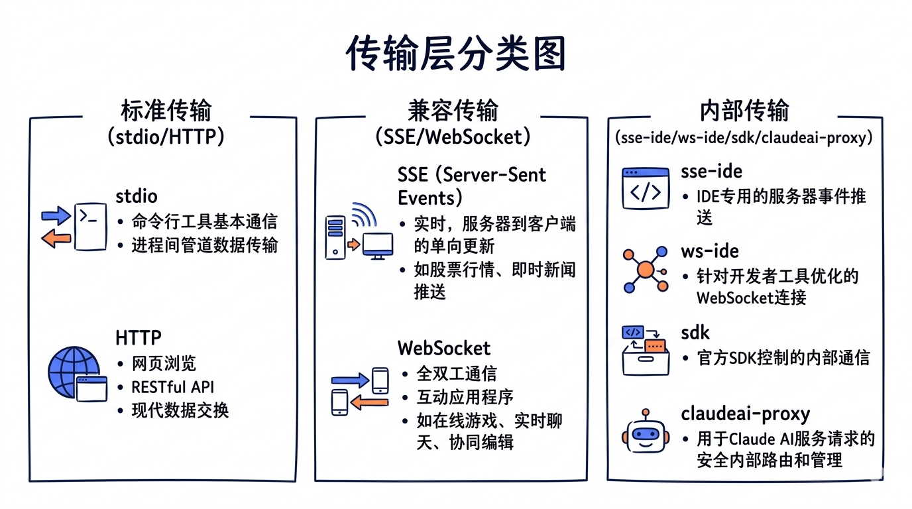
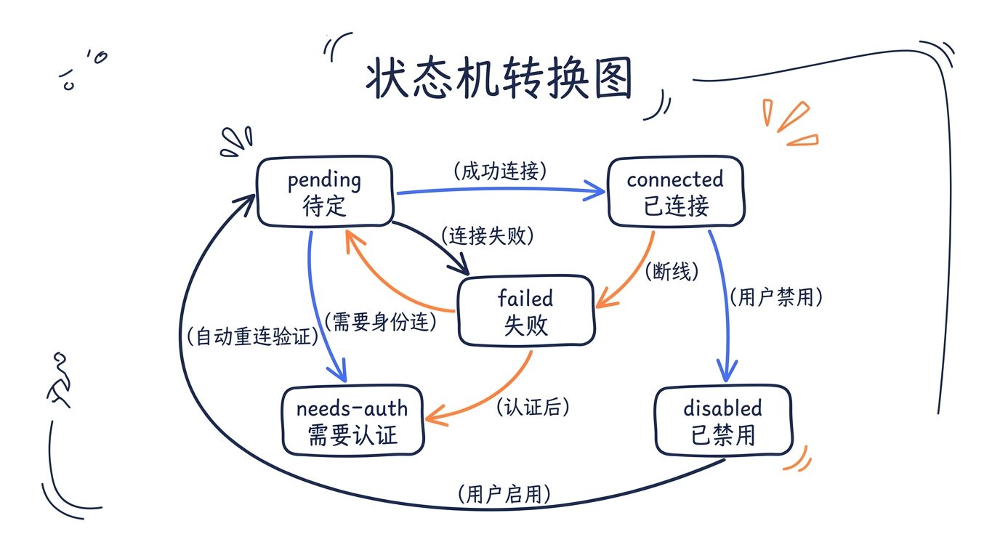
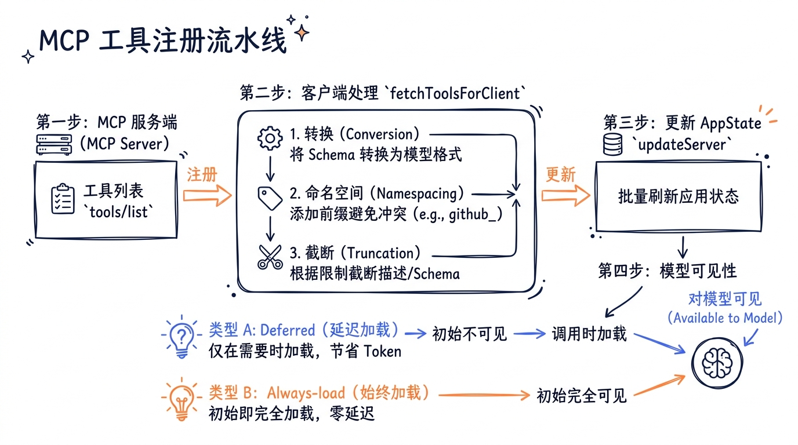
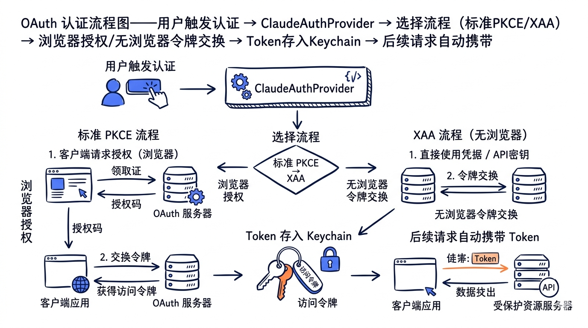

---
layout: default
title: "Ch12 MCP 协议全解"
nav_order: 50
parent: "模块五：扩展生态"
---


# 第十二章：MCP 协议全解——传输层 → 五大原语 → OAuth



> **核心命题**：一个 AI 编程代理再强大，也不可能内置所有能力。数据库查询、浏览器操作、Slack 通知、Figma 设计稿——这些能力散落在不同的外部系统中。MCP（Model Context Protocol）就是 Claude Code 用来"接驳"这些外部系统的标准协议。理解 MCP，就是理解 Claude Code 如何从一个"单机应用"变成一个"可扩展平台"。



## 12.1 MCP 协议概述

### 12.1.1 为什么需要 MCP

在没有 MCP 之前，每个 AI 应用都需要自己实现与外部工具的集成。想接 GitHub？写一套 GitHub API 适配器。想接数据库？写一套 SQL 查询包装器。每个工具一套代码，每个 AI 应用一套实现，互不兼容。

MCP 的出现就像 HTTP 之于 Web——它定义了一套标准协议，让任何 AI 应用（Host）都能以统一的方式与任何外部工具（Server）通信：

```
Host (Claude Code)
  └── Client（MCP SDK Client 实例）
        ├── Transport A (stdio) ──────→ Server A (文件系统)
        ├── Transport B (HTTP)  ──────→ Server B (GitHub)
        └── Transport C (SSE)   ──────→ Server C (数据库)
```

**关键概念**：

| 概念 | 角色 | 对应 Claude Code 中的位置 |
|------|------|--------------------------|
| Host | 运行 AI 模型的应用 | Claude Code 主进程 |
| Client | MCP 协议的客户端实现 | `@modelcontextprotocol/sdk` 的 `Client` 类 |
| Server | 暴露工具/资源/提示词的外部进程 | 用户配置的 MCP Server |
| Transport | Client 和 Server 之间的通信管道 | stdio / HTTP / SSE / WebSocket 等 |

### 12.1.2 MCP 规范版本

Claude Code v2.1.88 实现的是 MCP 规范 `2025-03-26` 版本，核心特性包括：

- **JSON-RPC 2.0** 作为消息格式
- **Streamable HTTP** 传输取代旧版 SSE-only 模式
- **Tool Annotations**（readOnlyHint、destructiveHint 等）
- **Elicitation**（Server 向 Client 请求用户输入）
- **OAuth 2.1 + PKCE** 作为标准认证方案

在 `client.ts` 中可以看到 Client 的初始化声明了对这些特性的支持：

```typescript
// src/services/mcp/client.ts

const client = new Client(
  {
    name: 'claude-code',
    title: 'Claude Code',
    version: MACRO.VERSION ?? 'unknown',
    description: "Anthropic's agentic coding tool",
    websiteUrl: PRODUCT_URL,
  },
  {
    capabilities: {
      roots: {},
      // 声明支持 Elicitation
      elicitation: {},
    },
  },
)
```

## 12.2 传输层架构

Claude Code 支持的传输类型远超 MCP 规范中的 stdio 和 Streamable HTTP 两种标准传输。在 `types.ts` 中定义了完整的传输枚举：

```typescript
// src/services/mcp/types.ts

export const TransportSchema = lazySchema(() =>
  z.enum(['stdio', 'sse', 'sse-ide', 'http', 'ws', 'sdk']),
)
```

加上 `claudeai-proxy` 和 `ws-ide` 两种内部类型，Claude Code 总共支持 **8 种传输方式**。

### 12.2.0 8 种传输的源码位置速查表

下表给出本课程教学口径下 **8 种 MCP 传输的源文件位置**，便于按图索骥：

| # | 传输 | 源文件 |
|---|---|---|
| 1 | stdio | `@modelcontextprotocol/sdk` 默认实现 |
| 2 | SSE | `src/cli/transports/SSETransport.ts` |
| 3 | Streamable HTTP | `@modelcontextprotocol/sdk` 默认实现 |
| 4 | WebSocket | `src/cli/transports/WebSocketTransport.ts` + `src/utils/mcpWebSocketTransport.ts` |
| 5 | InProcess | `src/services/mcp/InProcessTransport.ts` |
| 6 | SdkControl | `src/services/mcp/SdkControlTransport.ts` |
| 7 | ReplBridge | `src/bridge/replBridgeTransport.ts` |
| 8 | Hybrid | `src/cli/transports/HybridTransport.ts` |

> 教学口径下的 **8 种传输**与 `TransportSchema` 枚举的 6 种类型并不完全对齐——后者是配置对外暴露的合法 `type` 字段值，前者是实际承载 JSON-RPC 消息的物理通道。例如 `claudeai-proxy` 在配置层暴露独立 type，但在传输层基于 Streamable HTTP 改写；`InProcessTransport` 和 `SdkControlTransport` 则是为内置 Server / SDK 进程通信引入的特殊通道，没有对应的用户配置 type。完整数字口径详见 `docs/canonical-numbers.md`。



### 12.2.1 传输类型全景

| 传输类型 | Schema 定义 | 适用场景 | 认证支持 |
|----------|------------|---------|---------|
| `stdio` | `McpStdioServerConfigSchema` | 本地进程，最常见 | 无需认证 |
| `sse` | `McpSSEServerConfigSchema` | 远程 Server（旧版） | OAuth / Headers |
| `http` | `McpHTTPServerConfigSchema` | 远程 Server（Streamable HTTP，推荐） | OAuth / Headers |
| `ws` | `McpWebSocketServerConfigSchema` | WebSocket 长连接 | Headers |
| `sse-ide` | `McpSSEIDEServerConfigSchema` | IDE 扩展（VS Code 等） | IDE 内部 |
| `ws-ide` | `McpWebSocketIDEServerConfigSchema` | IDE 扩展（WebSocket 版） | authToken |
| `sdk` | `McpSdkServerConfigSchema` | SDK 进程内通信 | 无需认证 |
| `claudeai-proxy` | `McpClaudeAIProxyServerConfigSchema` | claude.ai 代理连接器 | OAuth Bearer |

每种传输类型对应一个 Zod Schema，用于验证配置。所有 Schema 在 `McpServerConfigSchema` 中通过 `z.union` 合并：

```typescript
// src/services/mcp/types.ts

export const McpServerConfigSchema = lazySchema(() =>
  z.union([
    McpStdioServerConfigSchema(),
    McpSSEServerConfigSchema(),
    McpSSEIDEServerConfigSchema(),
    McpWebSocketIDEServerConfigSchema(),
    McpHTTPServerConfigSchema(),
    McpWebSocketServerConfigSchema(),
    McpSdkServerConfigSchema(),
    McpClaudeAIProxyServerConfigSchema(),
  ]),
)
```

### 12.2.2 stdio 传输——本地进程通信

stdio 是最简单也最常用的传输方式。Client 启动一个子进程，通过 stdin/stdout 交换 JSON-RPC 消息：

```typescript
// src/services/mcp/client.ts - connectToServer() 中的 stdio 分支

} else if (serverRef.type === 'stdio' || !serverRef.type) {
  const finalCommand =
    process.env.CLAUDE_CODE_SHELL_PREFIX || serverRef.command
  const finalArgs = process.env.CLAUDE_CODE_SHELL_PREFIX
    ? [[serverRef.command, ...serverRef.args].join(' ')]
    : serverRef.args
  transport = new StdioClientTransport({
    command: finalCommand,
    args: finalArgs,
    env: {
      ...subprocessEnv(),
      ...serverRef.env,
    } as Record<string, string>,
    stderr: 'pipe', // 防止 MCP Server 的 stderr 输出到 UI
  })
}
```

注意几个工程细节：

1. **`CLAUDE_CODE_SHELL_PREFIX`**：允许通过环境变量包装命令（比如 Docker 内运行）
2. **`stderr: 'pipe'`**：将 Server 的 stderr 重定向到内存缓冲，避免污染终端 UI
3. **`subprocessEnv()`**：为子进程提供净化后的环境变量

stderr 的处理很有意思——它被限制在 64MB 以内，防止无限增长导致内存耗尽：

```typescript
stderrHandler = (data: Buffer) => {
  // 限制 stderr 累积量，防止内存无限增长
  if (stderrOutput.length < 64 * 1024 * 1024) {
    try {
      stderrOutput += data.toString()
    } catch {
      // 忽略超出最大字符串长度的错误
    }
  }
}
stdioTransport.stderr.on('data', stderrHandler)
```

### 12.2.3 Streamable HTTP 传输——远程 Server 通信

HTTP 传输（也叫 Streamable HTTP）是 MCP 2025-03-26 规范新增的标准远程传输。它使用 POST 请求发送消息，GET 请求建立 SSE 流接收通知：

```typescript
// src/services/mcp/client.ts

} else if (serverRef.type === 'http') {
  // 创建 OAuth 认证 Provider
  const authProvider = new ClaudeAuthProvider(name, serverRef)

  // 获取静态 + 动态 Headers
  const combinedHeaders = await getMcpServerHeaders(name, serverRef)

  const transportOptions: StreamableHTTPClientTransportOptions = {
    authProvider,
    // 每次请求使用独立的超时信号
    fetch: wrapFetchWithTimeout(
      wrapFetchWithStepUpDetection(createFetchWithInit(), authProvider),
    ),
    requestInit: {
      ...proxyOptions,
      headers: {
        'User-Agent': getMCPUserAgent(),
        ...combinedHeaders,
      },
    },
  }

  transport = new StreamableHTTPClientTransport(
    new URL(serverRef.url),
    transportOptions,
  )
}
```

**fetch 包装链**是理解 HTTP 传输的关键。Claude Code 对 fetch 函数施加了多层包装，形成了一条 middleware 链：

```
原始 fetch
  → createFetchWithInit()         // 合并初始化配置
  → wrapFetchWithStepUpDetection()  // 检测 403 Step-Up 认证
  → wrapFetchWithTimeout()         // 每次请求添加 60s 超时
```

`wrapFetchWithTimeout` 的实现展示了一个重要的工程决策：

```typescript
// src/services/mcp/client.ts

export function wrapFetchWithTimeout(baseFetch: FetchLike): FetchLike {
  return async (url: string | URL, init?: RequestInit) => {
    const method = (init?.method ?? 'GET').toUpperCase()

    // GET 请求不设超时——在 MCP 传输中，GET 是长寿命的 SSE 流
    if (method === 'GET') {
      return baseFetch(url, init)
    }

    // POST 请求：使用 setTimeout 而不是 AbortSignal.timeout()
    // 因为 Bun 的 AbortSignal.timeout 内部 timer 直到 GC 才释放，
    // 每个请求会浪费约 2.4KB 本地内存，持续 60 秒
    const controller = new AbortController()
    const timer = setTimeout(
      c => c.abort(new DOMException('The operation timed out.', 'TimeoutError')),
      MCP_REQUEST_TIMEOUT_MS,
      controller,
    )
    timer.unref?.()

    // ... 信号合并和清理逻辑
  }
}
```

这里有两个细微但重要的决定：
1. **GET 请求豁免超时**——因为 SSE 流是长连接，不应被超时杀死
2. **用 setTimeout 替代 AbortSignal.timeout()**——避免 Bun runtime 的内存泄漏

### 12.2.4 SSE 传输——兼容旧版 Server

SSE（Server-Sent Events）是 MCP 旧版规范的远程传输方式。Claude Code 继续支持它以保持向后兼容：

```typescript
} else if (serverRef.type === 'sse') {
  const authProvider = new ClaudeAuthProvider(name, serverRef)
  const combinedHeaders = await getMcpServerHeaders(name, serverRef)

  const transportOptions: SSEClientTransportOptions = {
    authProvider,
    fetch: wrapFetchWithTimeout(
      wrapFetchWithStepUpDetection(createFetchWithInit(), authProvider),
    ),
    requestInit: {
      headers: {
        'User-Agent': getMCPUserAgent(),
        ...combinedHeaders,
      },
    },
  }

  // SSE 长连接的 fetch 不使用超时包装——它需要保持打开
  transportOptions.eventSourceInit = {
    fetch: async (url, init) => {
      const authHeaders: Record<string, string> = {}
      const tokens = await authProvider.tokens()
      if (tokens) {
        authHeaders.Authorization = `Bearer ${tokens.access_token}`
      }
      return fetch(url, {
        ...init,
        ...proxyOptions,
        headers: {
          'User-Agent': getMCPUserAgent(),
          ...authHeaders,
          ...init?.headers,
          ...combinedHeaders,
          Accept: 'text/event-stream',
        },
      })
    },
  }

  transport = new SSEClientTransport(new URL(serverRef.url), transportOptions)
}
```

注意 `eventSourceInit.fetch` 与主 `fetch` 是分开配置的：SSE 的 EventSource 连接是长寿命流，不能使用 timeout wrapper。

### 12.2.5 WebSocket 传输

WebSocket 传输通过自定义的 `WebSocketTransport` 类实现，支持 Bun 原生 WebSocket 和 Node.js 的 `ws` 库：

```typescript
// src/utils/mcpWebSocketTransport.ts

export class WebSocketTransport implements Transport {
  private started = false
  private opened: Promise<void>
  private isBun = typeof Bun !== 'undefined'

  constructor(private ws: WebSocketLike) {
    this.opened = new Promise((resolve, reject) => {
      if (this.ws.readyState === WS_OPEN) {
        resolve()
      } else if (this.isBun) {
        // Bun 使用 addEventListener
        const nws = this.ws as unknown as globalThis.WebSocket
        nws.addEventListener('open', onOpen)
        nws.addEventListener('error', onError)
      } else {
        // Node.js ws 使用 EventEmitter
        const nws = this.ws as unknown as WsWebSocket
        nws.on('open', () => resolve())
        nws.on('error', error => reject(error))
      }
    })
  }
}
```

Bun 和 Node.js 的 WebSocket API 有微妙差异（addEventListener vs EventEmitter），`WebSocketTransport` 用 `isBun` 标志区分处理。

### 12.2.6 InProcessTransport——零开销内部通信

对于内置的 MCP Server（如 Claude-in-Chrome、Computer Use），Claude Code 使用一种特殊的 InProcess 传输，避免了进程间通信的开销：

```typescript
// src/services/mcp/InProcessTransport.ts

class InProcessTransport implements Transport {
  private peer: InProcessTransport | undefined
  private closed = false

  async send(message: JSONRPCMessage): Promise<void> {
    if (this.closed) {
      throw new Error('Transport is closed')
    }
    // 异步投递到对端，避免同步请求/响应时的栈深度问题
    queueMicrotask(() => {
      this.peer?.onmessage?.(message)
    })
  }

  async close(): Promise<void> {
    if (this.closed) return
    this.closed = true
    this.onclose?.()
    // 关闭对端
    if (this.peer && !this.peer.closed) {
      this.peer.closed = true
      this.peer.onclose?.()
    }
  }
}

export function createLinkedTransportPair(): [Transport, Transport] {
  const a = new InProcessTransport()
  const b = new InProcessTransport()
  a._setPeer(b)
  b._setPeer(a)
  return [a, b]
}
```

`queueMicrotask` 是这里的精髓——如果 `send` 同步触发 `onmessage`，在请求/响应循环中会导致栈溢出。`queueMicrotask` 将消息投递延迟到当前微任务之后。

使用场景示例——Chrome MCP Server：

```typescript
// connectToServer() 中的 Chrome in-process 分支
} else if (isClaudeInChromeMCPServer(name)) {
  const { createChromeContext } = await import(
    '../../utils/claudeInChrome/mcpServer.js'
  )
  const { createClaudeForChromeMcpServer } = await import(
    '@ant/claude-for-chrome-mcp'
  )
  const { createLinkedTransportPair } = await import('./InProcessTransport.js')
  
  const context = createChromeContext(serverRef.env)
  inProcessServer = createClaudeForChromeMcpServer(context)
  const [clientTransport, serverTransport] = createLinkedTransportPair()
  await inProcessServer.connect(serverTransport)
  transport = clientTransport
}
```

运行 Chrome MCP Server in-process 而不是作为子进程，省去了约 325MB 的内存开销。

### 12.2.7 SDK Control Transport——跨进程桥接

当 Claude Code 作为 SDK 被调用时，MCP Server 运行在 SDK 宿主进程中，而 Claude Code CLI 运行在另一个进程。`SdkControlTransport` 通过 stdout/stdin 的控制消息桥接两个进程：

```typescript
// src/services/mcp/SdkControlTransport.ts

// CLI 侧：将 MCP 消息包装为控制请求，通过 stdout 发送
export class SdkControlClientTransport implements Transport {
  constructor(
    private serverName: string,
    private sendMcpMessage: SendMcpMessageCallback,
  ) {}

  async send(message: JSONRPCMessage): Promise<void> {
    if (this.isClosed) throw new Error('Transport is closed')
    // 发送消息并等待响应
    const response = await this.sendMcpMessage(this.serverName, message)
    // 将响应传回 MCP Client
    this.onmessage?.(response)
  }
}

// SDK 侧：接收控制请求，转发给 MCP Server
export class SdkControlServerTransport implements Transport {
  constructor(private sendMcpMessage: (message: JSONRPCMessage) => void) {}

  async send(message: JSONRPCMessage): Promise<void> {
    if (this.isClosed) throw new Error('Transport is closed')
    this.sendMcpMessage(message)
  }
}
```

消息流向：

```
CLI Process                              SDK Process
┌──────────────────────┐                 ┌──────────────────────┐
│ MCP Client           │                 │ MCP Server           │
│   ↓                  │                 │   ↑                  │
│ SdkControlClient     │  control msg    │ SdkControlServer     │
│ Transport.send() ────┼──(stdout)─────→ │ .onmessage()         │
│   ↑                  │  response       │   ↓                  │
│ .onmessage() ←───────┼──(stdin)──────  │ Transport.send()     │
└──────────────────────┘                 └──────────────────────┘
```

### 12.2.8 claudeai-proxy 传输——Claude.ai 连接器

Claude.ai 上配置的 MCP 连接器（如 Slack、Linear）通过代理传输访问。Client 不直接连接 MCP Server，而是通过 Anthropic 的代理服务中转：

```typescript
} else if (serverRef.type === 'claudeai-proxy') {
  const tokens = getClaudeAIOAuthTokens()
  if (!tokens) throw new Error('No claude.ai OAuth token found')

  const oauthConfig = getOauthConfig()
  const proxyUrl = `${oauthConfig.MCP_PROXY_URL}${
    oauthConfig.MCP_PROXY_PATH.replace('{server_id}', serverRef.id)
  }`

  const fetchWithAuth = createClaudeAiProxyFetch(globalThis.fetch)

  transport = new StreamableHTTPClientTransport(
    new URL(proxyUrl),
    {
      fetch: wrapFetchWithTimeout(fetchWithAuth),
      requestInit: {
        ...proxyOptions,
        headers: {
          'User-Agent': getMCPUserAgent(),
          'X-Mcp-Client-Session-Id': getSessionId(),
        },
      },
    },
  )
}
```

`createClaudeAiProxyFetch` 实现了自动 token 刷新和 401 重试逻辑：

```typescript
export function createClaudeAiProxyFetch(innerFetch: FetchLike): FetchLike {
  return async (url, init) => {
    const doRequest = async () => {
      await checkAndRefreshOAuthTokenIfNeeded()
      const currentTokens = getClaudeAIOAuthTokens()
      if (!currentTokens) throw new Error('No claude.ai OAuth token available')

      const headers = new Headers(init?.headers)
      headers.set('Authorization', `Bearer ${currentTokens.accessToken}`)
      const response = await innerFetch(url, { ...init, headers })
      return { response, sentToken: currentTokens.accessToken }
    }

    const { response, sentToken } = await doRequest()
    if (response.status !== 401) return response

    // 401 时尝试刷新 token 后重试
    const tokenChanged = await handleOAuth401Error(sentToken).catch(() => false)
    if (!tokenChanged) {
      // 检查是否有其他连接器已经刷新了 token
      const now = getClaudeAIOAuthTokens()?.accessToken
      if (!now || now === sentToken) return response
    }

    try {
      return (await doRequest()).response
    } catch {
      return response // 重试失败，返回原始 401 响应
    }
  }
}
```

这段代码处理了一个常见的并发问题：当多个 claude.ai 连接器同时遇到 401 时，第一个完成 token 刷新的连接器会更新 keychain，后续连接器应该使用新 token 而不是再次刷新。

## 12.3 连接生命周期

### 12.3.1 连接批次与并发控制

Claude Code 不会同时启动所有 MCP Server 连接。它将 Server 分为本地（stdio/sdk）和远程两类，使用不同的并发度：

```typescript
// src/services/mcp/client.ts

export function getMcpServerConnectionBatchSize(): number {
  return parseInt(process.env.MCP_SERVER_CONNECTION_BATCH_SIZE || '', 10) || 3
}

function getRemoteMcpServerConnectionBatchSize(): number {
  return parseInt(
    process.env.MCP_REMOTE_SERVER_CONNECTION_BATCH_SIZE || '', 10
  ) || 20
}
```

- **本地 Server（stdio/sdk）**：默认并发 3，因为每个都要 fork 进程
- **远程 Server（http/sse/ws）**：默认并发 20，因为只是网络连接

### 12.3.2 连接超时

每个连接尝试有 30 秒超时（可通过 `MCP_TIMEOUT` 环境变量调整）：

```typescript
function getConnectionTimeoutMs(): number {
  return parseInt(process.env.MCP_TIMEOUT || '', 10) || 30000
}

// 连接时使用 Promise.race
const connectPromise = client.connect(transport)
const timeoutPromise = new Promise<never>((_, reject) => {
  const timeoutId = setTimeout(() => {
    transport.close().catch(() => {})
    reject(new Error(`MCP server "${name}" connection timed out`))
  }, getConnectionTimeoutMs())

  connectPromise.then(
    () => clearTimeout(timeoutId),
    () => clearTimeout(timeoutId),
  )
})

await Promise.race([connectPromise, timeoutPromise])
```

### 12.3.3 Memoization 与连接缓存

`connectToServer` 是一个 memoized 函数——同一个 Server 的相同配置不会重复连接：

```typescript
export const connectToServer = memoize(
  async (
    name: string,
    serverRef: ScopedMcpServerConfig,
    serverStats?: { /* ... */ },
  ): Promise<MCPServerConnection> => {
    // ... 连接逻辑
  },
  getServerCacheKey,  // 缓存 key 为 "${name}-${JSON.stringify(config)}"
)
```

当连接断开时，`onclose` 回调会清除缓存，允许下次调用重新连接：

```typescript
client.onclose = () => {
  const key = getServerCacheKey(name, serverRef)
  // 清除所有相关缓存
  fetchToolsForClient.cache.delete(name)
  fetchResourcesForClient.cache.delete(name)
  fetchCommandsForClient.cache.delete(name)
  connectToServer.cache.delete(key)
}
```

### 12.3.4 自动重连与指数退避

远程传输（SSE/HTTP/WebSocket）在断线后自动重连，使用指数退避策略：

```typescript
// src/services/mcp/useManageMCPConnections.ts

const MAX_RECONNECT_ATTEMPTS = 5
const INITIAL_BACKOFF_MS = 1000
const MAX_BACKOFF_MS = 30000

const reconnectWithBackoff = async () => {
  for (let attempt = 1; attempt <= MAX_RECONNECT_ATTEMPTS; attempt++) {
    // 检查 Server 是否在等待期间被禁用
    if (isMcpServerDisabled(client.name)) {
      logMCPDebug(client.name, `Server disabled during reconnection, stopping`)
      return
    }

    // 更新 UI 状态为 pending
    updateServer({
      ...client,
      type: 'pending',
      reconnectAttempt: attempt,
      maxReconnectAttempts: MAX_RECONNECT_ATTEMPTS,
    })

    try {
      const result = await reconnectMcpServerImpl(client.name, client.config)
      if (result.client.type === 'connected') {
        logMCPDebug(client.name, `Reconnection successful (attempt ${attempt})`)
        onConnectionAttempt(result)
        return
      }
    } catch (error) {
      if (attempt === MAX_RECONNECT_ATTEMPTS) {
        updateServer({ ...client, type: 'failed' })
        return
      }
    }

    // 指数退避：1s → 2s → 4s → 8s → 16s（上限 30s）
    const backoffMs = Math.min(
      INITIAL_BACKOFF_MS * Math.pow(2, attempt - 1),
      MAX_BACKOFF_MS,
    )
    await new Promise<void>(resolve => {
      const timer = setTimeout(resolve, backoffMs)
      reconnectTimersRef.current.set(client.name, timer)
    })
  }
}
```

注意重连 timer 存储在 `reconnectTimersRef` 中，这样在手动重连或禁用 Server 时可以取消正在等待的自动重连。

### 12.3.5 Session 过期检测

HTTP 传输支持 session 概念。当 Server 返回 HTTP 404 + JSON-RPC 错误码 `-32001` 时，表示 session 已过期：

```typescript
export function isMcpSessionExpiredError(error: Error): boolean {
  const httpStatus =
    'code' in error ? (error as Error & { code?: number }).code : undefined
  if (httpStatus !== 404) return false
  // 检查 JSON-RPC 错误码 -32001（Session not found）
  return (
    error.message.includes('"code":-32001') ||
    error.message.includes('"code": -32001')
  )
}
```

检测到 session 过期后，Tool 调用会自动重试一次：

```typescript
const MAX_SESSION_RETRIES = 1
for (let attempt = 0; ; attempt++) {
  try {
    const connectedClient = await ensureConnectedClient(client)
    const mcpResult = await callMCPToolWithUrlElicitationRetry({...})
    return { data: mcpResult.content }
  } catch (error) {
    if (error instanceof McpSessionExpiredError && attempt < MAX_SESSION_RETRIES) {
      logMCPDebug(client.name, `Retrying after session recovery`)
      continue  // 重试会调用 ensureConnectedClient 建立新连接
    }
    throw error
  }
}
```

### 12.3.6 连接状态机

每个 MCP Server 连接都有一个明确的状态：

```typescript
// src/services/mcp/types.ts

export type MCPServerConnection =
  | ConnectedMCPServer    // 已连接，可用
  | FailedMCPServer       // 连接失败
  | NeedsAuthMCPServer    // 需要 OAuth 认证
  | PendingMCPServer      // 连接中（可能包含重连信息）
  | DisabledMCPServer     // 用户手动禁用
```



状态转换发生在以下关键点：

| 触发条件 | 状态变化 |
|---------|---------|
| 首次加载配置 | → `pending` 或 `disabled` |
| 连接成功 | `pending` → `connected` |
| 连接失败 | `pending` → `failed` |
| 收到 401 | `pending` → `needs-auth` |
| 连接断开 | `connected` → `pending`（自动重连）|
| 重连耗尽 | `pending` → `failed` |
| 用户禁用 | 任意状态 → `disabled` |
| 用户启用 | `disabled` → `pending` |

## 12.4 五大原语

MCP 协议定义了五种原语（Primitive），每种代表 Server 能暴露的一类能力：

```
┌─────────────────────────────────────────────────────────┐
│                    MCP 五大原语                          │
├──────────┬──────────┬──────────┬──────────┬──────────────┤
│  Tools   │Resources │ Prompts  │ Sampling │ Elicitation  │
│ AI 可调用│ 数据暴露  │ 模板提示  │ 嵌套 LLM │ 向用户提问   │
│ 的函数   │ URI 寻址  │ 词复用   │ 调用     │ 收集信息     │
└──────────┴──────────┴──────────┴──────────┴──────────────┘
   Server        Server      Server       Client       Client
   暴露          暴露         暴露         提供          提供
```

### 12.4.1 Tools——AI 可调用的函数

Tools 是 MCP 最核心的原语。Server 暴露一组 Tools，Client 将它们注册为 AI 可用的工具。

**注册过程**：`fetchToolsForClient` 获取 Server 的工具列表并转换为 Claude Code 的 `Tool` 格式：

```typescript
// src/services/mcp/client.ts

export const fetchToolsForClient = memoizeWithLRU(
  async (client: MCPServerConnection): Promise<Tool[]> => {
    if (client.type !== 'connected') return []
    if (!client.capabilities?.tools) return []

    const result = await client.client.request(
      { method: 'tools/list' },
      ListToolsResultSchema,
    )

    // 消毒工具数据，移除不安全的 Unicode 字符
    const toolsToProcess = recursivelySanitizeUnicode(result.tools)

    return toolsToProcess.map((tool): Tool => {
      const fullyQualifiedName = buildMcpToolName(client.name, tool.name)
      return {
        ...MCPTool,
        name: fullyQualifiedName,  // e.g., "mcp__github__create_issue"
        mcpInfo: { serverName: client.name, toolName: tool.name },
        isMcp: true,

        // Tool Annotations——MCP 2025-03-26 新增
        isConcurrencySafe() {
          return tool.annotations?.readOnlyHint ?? false
        },
        isReadOnly() {
          return tool.annotations?.readOnlyHint ?? false
        },
        isDestructive() {
          return tool.annotations?.destructiveHint ?? false
        },
        isOpenWorld() {
          return tool.annotations?.openWorldHint ?? false
        },

        // 描述截断——防止 OpenAPI 生成的 Server 塞入 15-60KB 的文档
        async prompt() {
          const desc = tool.description ?? ''
          return desc.length > MAX_MCP_DESCRIPTION_LENGTH  // 2048 chars
            ? desc.slice(0, MAX_MCP_DESCRIPTION_LENGTH) + '… [truncated]'
            : desc
        },
        // ... call 实现、权限检查等
      }
    })
  },
  (client) => client.name,  // 按 Server 名称缓存
  MCP_FETCH_CACHE_SIZE,     // LRU 缓存大小为 20
)
```

**命名空间**：工具名采用 `mcp__<server>__<tool>` 格式，双下划线分隔。这个约定在 `mcpStringUtils.ts` 中定义：

```typescript
// src/services/mcp/mcpStringUtils.ts

export function buildMcpToolName(serverName: string, toolName: string): string {
  return `${getMcpPrefix(serverName)}${normalizeNameForMCP(toolName)}`
}

export function getMcpPrefix(serverName: string): string {
  return `mcp__${normalizeNameForMCP(serverName)}__`
}

// 反向解析
export function mcpInfoFromString(toolString: string): {
  serverName: string
  toolName: string | undefined
} | null {
  const parts = toolString.split('__')
  const [mcpPart, serverName, ...toolNameParts] = parts
  if (mcpPart !== 'mcp' || !serverName) return null
  const toolName =
    toolNameParts.length > 0 ? toolNameParts.join('__') : undefined
  return { serverName, toolName }
}
```

**描述长度限制**：`MAX_MCP_DESCRIPTION_LENGTH = 2048`，这个限制在源码注释中解释了原因：

> OpenAPI-generated MCP servers have been observed dumping 15-60KB of endpoint docs into tool.description; this caps the p95 tail without losing the intent.

**Tool Annotations** 是 MCP 2025-03-26 规范新增的特性。它们让 Server 声明工具的行为特征，Client 据此做出权限决策：

| Annotation | 含义 | Claude Code 中的用途 |
|-----------|------|---------------------|
| `readOnlyHint` | 工具只读，不修改状态 | 标记为并发安全，权限更宽松 |
| `destructiveHint` | 工具有破坏性 | 即使在宽松模式下也要求确认 |
| `openWorldHint` | 工具与外部系统交互 | 影响 auto mode 分类器判断 |
| `title` | 人类友好的工具标题 | 显示在权限对话框中 |

**Deferred Loading（延迟加载）**是另一个重要优化。当 MCP Server 暴露大量工具时，Claude Code 不会将所有工具一次性发送给模型。`searchHint` 和 `alwaysLoad` 两个 `_meta` 字段控制加载策略：

```typescript
// 从 _meta 提取搜索提示和始终加载标志
searchHint:
  typeof tool._meta?.['anthropic/searchHint'] === 'string'
    ? tool._meta['anthropic/searchHint']
        .replace(/\s+/g, ' ')  // 折叠空白字符
        .trim() || undefined
    : undefined,
alwaysLoad: tool._meta?.['anthropic/alwaysLoad'] === true,
```

### 12.4.2 Resources——URI 可寻址的数据

Resources 让 Server 暴露数据（文件、数据库记录、API 响应等），Client 通过 URI 读取：

```typescript
export const fetchResourcesForClient = memoizeWithLRU(
  async (client: MCPServerConnection): Promise<ServerResource[]> => {
    if (client.type !== 'connected') return []
    if (!client.capabilities?.resources) return []

    const result = await client.client.request(
      { method: 'resources/list' },
      ListResourcesResultSchema,
    )

    return result.resources.map(resource => ({
      ...resource,
      server: client.name,
    }))
  },
  // ...
)
```

Resources 支持 `list_changed` 通知——当 Server 端的资源列表变化时，Client 自动刷新：

```typescript
// useManageMCPConnections.ts 中注册通知处理

if (client.capabilities?.resources?.listChanged) {
  client.client.setNotificationHandler(
    ResourceListChangedNotificationSchema,
    async () => {
      // 清除缓存并重新获取
      fetchResourcesForClient.cache.delete(client.name)
      const newResources = await fetchResourcesForClient(client)
      updateServer({ ...client, resources: newResources })
    },
  )
}
```

### 12.4.3 Prompts——可复用的提示词模板

Prompts 让 Server 暴露参数化的提示词模板。在 Claude Code 中，它们表现为 `/mcp__server__prompt` 形式的斜杠命令：

```typescript
export const fetchCommandsForClient = memoizeWithLRU(
  async (client: MCPServerConnection): Promise<Command[]> => {
    if (client.type !== 'connected') return []
    if (!client.capabilities?.prompts) return []

    const result = (await client.client.request(
      { method: 'prompts/list' },
      ListPromptsResultSchema,
    )) as ListPromptsResult

    return result.prompts.map(prompt => ({
      type: 'prompt' as const,
      name: buildMcpToolName(client.name, prompt.name),
      description: prompt.description || '',
      isMcp: true,
      // ... 执行逻辑
    }))
  },
)
```

### 12.4.4 Sampling——嵌套 LLM 调用

Sampling 允许 Server 通过 Client 请求 LLM 生成。这是一个"反向"原语——不是 Client 调用 Server，而是 Server 调用 Client。Claude Code 当前通过 `ListRootsRequestSchema` 支持基本的 Roots 请求：

```typescript
client.setRequestHandler(ListRootsRequestSchema, async () => {
  return {
    roots: [
      {
        uri: `file://${getOriginalCwd()}`,
      },
    ],
  }
})
```

### 12.4.5 Elicitation——向用户请求输入

Elicitation 是 MCP 2025-03-26 规范新增的原语，让 Server 在工具执行过程中向用户请求额外信息。Claude Code 支持两种 Elicitation 模式：

**Form 模式**——Server 发送一个 JSON Schema，Client 展示表单让用户填写：

```typescript
// src/services/mcp/elicitationHandler.ts

export function registerElicitationHandler(
  client: Client,
  serverName: string,
  setAppState: (f: (prevState: AppState) => AppState) => void,
): void {
  client.setRequestHandler(ElicitRequestSchema, async (request, extra) => {
    const mode = getElicitationMode(request.params)
    // mode === 'form' 或 'url'

    // 先尝试 hook 自动处理
    const hookResponse = await runElicitationHooks(
      serverName, request.params, extra.signal
    )
    if (hookResponse) return hookResponse

    // 将请求推入 AppState 队列，等待 UI 渲染并获取用户输入
    const response = new Promise<ElicitResult>(resolve => {
      setAppState(prev => ({
        ...prev,
        elicitation: {
          queue: [
            ...prev.elicitation.queue,
            {
              serverName,
              requestId: extra.requestId,
              params: request.params,
              signal: extra.signal,
              respond: resolve,
            },
          ],
        },
      }))

      // 如果请求被取消，返回 cancel
      extra.signal.addEventListener('abort', () => {
        resolve({ action: 'cancel' })
      }, { once: true })
    })

    return response
  })
}
```

**URL 模式**——Server 发送一个 URL，Client 打开浏览器让用户完成操作（如 OAuth 授权）：

```typescript
// Elicitation 的三种响应
type ElicitResult = {
  action: 'accept' | 'decline' | 'cancel'
  content?: Record<string, unknown>
}
```

URL 模式还支持 **完成通知**——Server 可以在用户完成操作后通过 `ElicitationCompleteNotification` 通知 Client：

```typescript
client.setNotificationHandler(
  ElicitationCompleteNotificationSchema,
  notification => {
    const { elicitationId } = notification.params
    // 找到对应的 elicitation 事件并标记为已完成
    setAppState(prev => {
      const idx = findElicitationInQueue(
        prev.elicitation.queue, serverName, elicitationId
      )
      if (idx === -1) return prev
      const queue = [...prev.elicitation.queue]
      queue[idx] = { ...queue[idx]!, completed: true }
      return { ...prev, elicitation: { queue } }
    })
  },
)
```

## 12.5 工具注册流水线

从 MCP Server 暴露工具到 AI 可以调用，中间经过一条完整的注册流水线：



### 12.5.1 名称规范化

MCP 工具名必须符合 API 的 `^[a-zA-Z0-9_-]{1,64}$` 模式。`normalizeNameForMCP` 将非法字符替换为下划线：

```typescript
// src/services/mcp/normalization.ts

export function normalizeNameForMCP(name: string): string {
  let normalized = name.replace(/[^a-zA-Z0-9_-]/g, '_')
  // claude.ai Server 额外处理：折叠连续下划线，去除首尾下划线
  if (name.startsWith('claude.ai ')) {
    normalized = normalized.replace(/_+/g, '_').replace(/^_|_$/g, '')
  }
  return normalized
}
```

claude.ai Server 的特殊处理是因为它们的显示名含空格（如 "claude.ai Slack"），如果不折叠连续下划线，会产生 `mcp__claude_ai__Slack__` 这样的名称，干扰 `__` 分隔符的解析。

### 12.5.2 批量状态更新

工具注册使用了一个精巧的批处理机制，避免每个 Server 的工具列表更新都触发一次 React re-render：

```typescript
// src/services/mcp/useManageMCPConnections.ts

const MCP_BATCH_FLUSH_MS = 16  // 约一帧的时间

const flushPendingUpdates = useCallback(() => {
  const updates = pendingUpdatesRef.current
  if (updates.length === 0) return
  pendingUpdatesRef.current = []

  setAppState(prevState => {
    let mcp = prevState.mcp
    for (const update of updates) {
      // 合并所有 Server 的更新到一次 setState
      const prefix = getMcpPrefix(client.name)
      const updatedTools = tools === undefined
        ? mcp.tools
        : [...reject(mcp.tools, t => t.name?.startsWith(prefix)), ...tools]
      // ... 类似处理 commands 和 resources
      mcp = { ...mcp, clients: updatedClients, tools: updatedTools, ... }
    }
    return { ...prevState, mcp }
  })
}, [setAppState])

const updateServer = useCallback((update: PendingUpdate) => {
  pendingUpdatesRef.current.push(update)
  if (flushTimerRef.current === null) {
    flushTimerRef.current = setTimeout(flushPendingUpdates, MCP_BATCH_FLUSH_MS)
  }
}, [flushPendingUpdates])
```

16ms 的窗口让多个 Server 在同一帧内完成工具注册的更新被合并为一次 AppState 变更。

### 12.5.3 IDE 工具过滤

IDE MCP Server 暴露的工具被白名单过滤，只保留指定的工具：

```typescript
const ALLOWED_IDE_TOOLS = ['mcp__ide__executeCode', 'mcp__ide__getDiagnostics']

function isIncludedMcpTool(tool: Tool): boolean {
  return (
    !tool.name.startsWith('mcp__ide__') || ALLOWED_IDE_TOOLS.includes(tool.name)
  )
}
```

### 12.5.4 list_changed 动态更新

MCP Server 可以在运行时动态更新其工具列表。通过 `tools/list_changed` 通知：

```typescript
if (client.capabilities?.tools?.listChanged) {
  client.client.setNotificationHandler(
    ToolListChangedNotificationSchema,
    async () => {
      // 清除缓存
      fetchToolsForClient.cache.delete(client.name)
      // 重新获取
      const newTools = await fetchToolsForClient(client)
      // 更新 AppState
      updateServer({ ...client, tools: newTools })
    },
  )
}
```

## 12.6 OAuth 认证体系

远程 MCP Server 通常需要认证。Claude Code 实现了完整的 OAuth 2.1 + PKCE 认证流程，以及企业级的 XAA（Cross-App Access）认证。



### 12.6.1 ClaudeAuthProvider

`ClaudeAuthProvider` 实现了 MCP SDK 的 `OAuthClientProvider` 接口，是整个 OAuth 流程的核心：

```typescript
// src/services/mcp/auth.ts

export class ClaudeAuthProvider implements OAuthClientProvider {
  constructor(
    private serverName: string,
    private serverConfig: McpSSEServerConfig | McpHTTPServerConfig,
    private redirectUri?: string,
    private isAuthFlow?: boolean,
    private onAuthorizationUrl?: (url: string) => void,
    private skipBrowserOpen?: boolean,
  ) {}
}
```

它的职责包括：

1. **存储和读取 Token**——通过 Keychain 安全存储
2. **生成 Server Key**——基于 Server 名称和配置 hash
3. **触发 OAuth 流程**——打开浏览器、接收回调
4. **Token 刷新**——自动刷新过期 Token
5. **Step-Up 认证**——处理权限升级请求

### 12.6.2 Server Key 生成

每个 MCP Server 的认证凭据用一个唯一 key 存储，由 Server 名称和配置 hash 组成：

```typescript
export function getServerKey(
  serverName: string,
  serverConfig: McpSSEServerConfig | McpHTTPServerConfig,
): string {
  const configJson = jsonStringify({
    type: serverConfig.type,
    url: serverConfig.url,
    headers: serverConfig.headers || {},
  })

  const hash = createHash('sha256')
    .update(configJson)
    .digest('hex')
    .substring(0, 16)

  return `${serverName}|${hash}`
}
```

这确保了：
- 同名但 URL 不同的 Server 不会共享凭据
- 重命名 Server 后旧凭据自动失效

### 12.6.3 标准 OAuth PKCE 流程

`performMCPOAuthFlow` 实现了完整的 OAuth 2.1 Authorization Code + PKCE 流程：

```
用户触发认证（/mcp 菜单选择 "Authenticate"）
  ↓
1. 清除旧凭据
2. 发现 OAuth Metadata（RFC 8414）
3. 在随机端口启动 HTTP Server 等待回调
4. 生成 PKCE code_verifier/code_challenge
5. 构造 Authorization URL 并打开浏览器
6. 用户在浏览器中授权
7. 收到回调 → 用 authorization_code + code_verifier 换取 Token
8. Token 存入 Keychain
```

关键的端口选择逻辑：

```typescript
// src/services/mcp/oauthPort.ts

const REDIRECT_PORT_RANGE =
  getPlatform() === 'windows'
    ? { min: 39152, max: 49151 }  // Windows 保留 49152-65535
    : { min: 49152, max: 65535 }

export async function findAvailablePort(): Promise<number> {
  const configuredPort = getMcpOAuthCallbackPort()
  if (configuredPort) return configuredPort

  const { min, max } = REDIRECT_PORT_RANGE
  const maxAttempts = Math.min(max - min + 1, 100)

  for (let attempt = 0; attempt < maxAttempts; attempt++) {
    const port = min + Math.floor(Math.random() * (max - min + 1))
    try {
      await new Promise<void>((resolve, reject) => {
        const testServer = createServer()
        testServer.once('error', reject)
        testServer.listen(port, () => testServer.close(() => resolve()))
      })
      return port
    } catch {
      continue  // 端口被占用，尝试下一个
    }
  }

  // 最后尝试回退端口 3118
  return REDIRECT_PORT_FALLBACK
}
```

### 12.6.4 OAuth Metadata 发现

Claude Code 支持三种 OAuth Metadata 发现路径：

1. **用户配置**：`authServerMetadataUrl` 字段直接指定（必须 HTTPS）
2. **RFC 9728**：先探测 `/.well-known/oauth-protected-resource`（PRM），读取 `authorization_servers[0]`，再用 RFC 8414 获取 AS 元数据
3. **RFC 8414 直接探测**：对 Server URL 做 path-aware 的 `/.well-known/oauth-authorization-server/{path}` 探测

```typescript
async function fetchAuthServerMetadata(
  serverName: string,
  serverUrl: string,
  configuredMetadataUrl: string | undefined,
  fetchFn?: FetchLike,
  resourceMetadataUrl?: URL,
): Promise<...> {
  // 路径 1：用户配置的 URL
  if (configuredMetadataUrl) {
    if (!configuredMetadataUrl.startsWith('https://')) {
      throw new Error(`authServerMetadataUrl must use https://`)
    }
    const response = await authFetch(configuredMetadataUrl, { ... })
    return OAuthMetadataSchema.parse(await response.json())
  }

  // 路径 2：RFC 9728 → RFC 8414
  try {
    const { authorizationServerMetadata } = await discoverOAuthServerInfo(
      serverUrl, { fetchFn, resourceMetadataUrl }
    )
    if (authorizationServerMetadata) return authorizationServerMetadata
  } catch (err) {
    logMCPDebug(serverName, `RFC 9728 discovery failed, falling back`)
  }

  // 路径 3：Path-aware RFC 8414
  const url = new URL(serverUrl)
  if (url.pathname === '/') return undefined
  return discoverAuthorizationServerMetadata(url, { fetchFn })
}
```

### 12.6.5 Token 刷新与错误处理

Token 刷新有一个特别的处理——Slack 等提供商返回非标准的错误码：

```typescript
// src/services/mcp/auth.ts

// Slack 返回 "invalid_refresh_token" 而不是标准的 "invalid_grant"
const NONSTANDARD_INVALID_GRANT_ALIASES = new Set([
  'invalid_refresh_token',
  'expired_refresh_token',
  'token_expired',
])

export async function normalizeOAuthErrorBody(
  response: Response,
): Promise<Response> {
  if (!response.ok) return response
  const text = await response.text()
  let parsed = jsonParse(text)

  // 有些 Server（如 Slack）总是返回 200，错误信息在 body 中
  if (OAuthTokensSchema.safeParse(parsed).success) {
    return new Response(text, response)
  }

  const result = OAuthErrorResponseSchema.safeParse(parsed)
  if (!result.success) return new Response(text, response)

  // 规范化非标准错误码
  const normalized = NONSTANDARD_INVALID_GRANT_ALIASES.has(result.data.error)
    ? { error: 'invalid_grant', error_description: `...` }
    : result.data

  // 将 200+error_body 改写为 400，让 SDK 正确处理
  return new Response(jsonStringify(normalized), {
    status: 400,
    statusText: 'Bad Request',
    headers: response.headers,
  })
}
```

这个 `normalizeOAuthErrorBody` 是一个经典的适配器模式——它将非标准的 OAuth 响应转换为 SDK 能正确处理的标准格式。

### 12.6.6 Auth 缓存

为了避免每次启动时都触发认证流程，Claude Code 维护了一个 needs-auth 缓存：

```typescript
const MCP_AUTH_CACHE_TTL_MS = 15 * 60 * 1000 // 15 分钟

async function isMcpAuthCached(serverId: string): Promise<boolean> {
  const cache = await getMcpAuthCache()
  const entry = cache[serverId]
  if (!entry) return false
  return Date.now() - entry.timestamp < MCP_AUTH_CACHE_TTL_MS
}
```

如果一个 Server 在 15 分钟内被标记为 needs-auth，后续连接不会重新探测，直到用户主动认证或缓存过期。

### 12.6.7 Token 撤销

当用户通过 `/mcp` 菜单清除认证时，Claude Code 会尝试在 OAuth Server 端撤销 Token（RFC 7009）：

```typescript
export async function revokeServerTokens(
  serverName: string,
  serverConfig: McpSSEServerConfig | McpHTTPServerConfig,
): Promise<void> {
  // 1. 发现 revocation_endpoint
  const metadata = await fetchAuthServerMetadata(...)
  const revocationEndpoint = metadata?.revocation_endpoint

  // 2. 先撤销 refresh_token（更重要——阻止生成新的 access_token）
  if (tokenData.refreshToken) {
    await revokeToken({
      endpoint: revocationEndpoint,
      token: tokenData.refreshToken,
      tokenTypeHint: 'refresh_token',
      clientId: tokenData.clientId,
    })
  }

  // 3. 再撤销 access_token
  if (tokenData.accessToken) {
    await revokeToken({
      endpoint: revocationEndpoint,
      token: tokenData.accessToken,
      tokenTypeHint: 'access_token',
    })
  }

  // 4. 清除本地存储
  clearServerTokensFromLocalStorage(serverName, serverConfig)
}
```

注意撤销顺序：**先 refresh_token，后 access_token**。因为撤销 refresh_token 通常会让 Server 端同时失效关联的 access_token。

## 12.7 XAA（Cross-App Access）——企业级无浏览器认证

XAA 是 Claude Code 独有的企业认证方案，基于 SEP-990 规范。它的核心思想是：用一次 IdP 登录，换取所有 MCP Server 的访问权限，无需每个 Server 单独打开浏览器授权。

### 12.7.1 XAA 认证链

```
IdP (企业身份提供商)          AS (MCP Server 的授权服务器)
       ↓ OIDC Login                    ↓
 ┌─────────────┐               ┌──────────────┐
 │  id_token   │               │ access_token │
 │ (用户身份)   │  RFC 8693     │ (MCP 访问)    │
 │             │──────────────→│              │
 │   Token     │  id_token→    │   JWT Bearer │
 │   Exchange  │  ID-JAG       │   Grant      │
 │             │  ──────────→  │ ID-JAG→      │
 │             │               │ access_token │
 └─────────────┘               └──────────────┘
```

四步流程：

1. **PRM 发现**（RFC 9728）：从 MCP Server URL 发现 Protected Resource Metadata，获取 AS 地址
2. **AS 元数据发现**（RFC 8414）：获取 AS 的 token_endpoint
3. **Token Exchange**（RFC 8693）：在 IdP 端用 id_token 换取 ID-JAG（Identity Assertion Authorization Grant）
4. **JWT Bearer Grant**（RFC 7523）：在 AS 端用 ID-JAG 换取 access_token

```typescript
// src/services/mcp/xaa.ts

export async function performCrossAppAccess(
  serverUrl: string,
  config: XaaConfig,
  serverName = 'xaa',
  abortSignal?: AbortSignal,
): Promise<XaaResult> {
  const fetchFn = makeXaaFetch(abortSignal)

  // Step 1: PRM 发现
  const prm = await discoverProtectedResource(serverUrl, { fetchFn })

  // Step 2: AS 元数据发现（尝试每个 AS，找到支持 jwt-bearer 的）
  let asMeta: AuthorizationServerMetadata | undefined
  for (const asUrl of prm.authorization_servers) {
    const candidate = await discoverAuthorizationServer(asUrl, { fetchFn })
    if (candidate.grant_types_supported?.includes(JWT_BEARER_GRANT) !== false) {
      asMeta = candidate
      break
    }
  }

  // Step 3: Token Exchange at IdP
  const jag = await requestJwtAuthorizationGrant({
    tokenEndpoint: config.idpTokenEndpoint,
    audience: asMeta.issuer,
    resource: prm.resource,
    idToken: config.idpIdToken,
    clientId: config.idpClientId,
  })

  // Step 4: JWT Bearer Grant at AS
  const tokens = await exchangeJwtAuthGrant({
    tokenEndpoint: asMeta.token_endpoint,
    assertion: jag.jwtAuthGrant,
    clientId: config.clientId,
    clientSecret: config.clientSecret,
  })

  return { ...tokens, authorizationServerUrl: asMeta.issuer }
}
```

### 12.7.2 IdP 登录与 id_token 缓存

XAA 的"一次登录"体验依赖于 id_token 的缓存。第一个 XAA Server 触发浏览器登录 IdP，获得的 id_token 被缓存在 Keychain 中，后续 Server 直接使用：

```typescript
// src/services/mcp/xaaIdpLogin.ts

export function getCachedIdpIdToken(idpIssuer: string): string | undefined {
  const storage = getSecureStorage()
  const data = storage.read()
  const key = issuerKey(idpIssuer)
  const entry = data?.xaaIdpIdTokens?.[key]
  if (!entry) return undefined

  // 检查过期时间（带 60 秒缓冲）
  if (entry.expiresAt && Date.now() >= (entry.expiresAt - ID_TOKEN_EXPIRY_BUFFER_S * 1000)) {
    return undefined  // 即将过期，不使用缓存
  }

  return entry.idToken
}
```

### 12.7.3 安全校验

XAA 实现了多层安全校验：

**Issuer Mismatch Protection**——防止混淆攻击：

```typescript
// PRM 资源校验
if (normalizeUrl(prm.resource) !== normalizeUrl(serverUrl)) {
  throw new Error(`PRM resource mismatch: expected ${serverUrl}, got ${prm.resource}`)
}

// AS issuer 校验
if (normalizeUrl(meta.issuer) !== normalizeUrl(asUrl)) {
  throw new Error(`AS issuer mismatch: expected ${asUrl}, got ${meta.issuer}`)
}
```

**HTTPS 强制**——Token endpoint 必须使用 HTTPS：

```typescript
if (new URL(meta.token_endpoint).protocol !== 'https:') {
  throw new Error(`XAA: refusing non-HTTPS token endpoint: ${meta.token_endpoint}`)
}
```

**Token 脱敏**——日志中永远不输出原始 Token：

```typescript
const SENSITIVE_TOKEN_RE =
  /"(access_token|refresh_token|id_token|assertion|subject_token|client_secret)"\s*:\s*"[^"]*"/g

function redactTokens(raw: unknown): string {
  const s = typeof raw === 'string' ? raw : jsonStringify(raw)
  return s.replace(SENSITIVE_TOKEN_RE, (_, k) => `"${k}":"[REDACTED]"`)
}
```

## 12.8 配置管理

### 12.8.1 配置作用域

MCP Server 配置可以来自 7 个不同的作用域：

```typescript
export const ConfigScopeSchema = lazySchema(() =>
  z.enum([
    'local',       // 项目私有（.claude/settings.local.json）
    'user',        // 全局用户（~/.claude.json）
    'project',     // 项目共享（.mcp.json）
    'dynamic',     // 命令行 / 插件动态注入
    'enterprise',  // 企业管理（managed-mcp.json）
    'claudeai',    // claude.ai 连接器
    'managed',     // 托管配置
  ]),
)
```

优先级（由低到高）：**plugin < user < project < local < enterprise**

当 enterprise 配置存在时，它拥有独占控制权——其他所有作用域的 Server 被忽略：

```typescript
export async function getClaudeCodeMcpConfigs(...) {
  const { servers: enterpriseServers } = getMcpConfigsByScope('enterprise')

  // 企业配置存在时，只使用企业配置
  if (doesEnterpriseMcpConfigExist()) {
    const filtered: Record<string, ScopedMcpServerConfig> = {}
    for (const [name, config] of Object.entries(enterpriseServers)) {
      if (isMcpServerAllowedByPolicy(name, config)) {
        filtered[name] = config
      }
    }
    return { servers: filtered, errors: [] }
  }
  // ...
}
```

### 12.8.2 Project Server 审批

`.mcp.json` 中的 Server 是项目级共享的，可能来自不可信的仓库。因此它们需要用户审批：

```typescript
// src/services/mcp/utils.ts

export function getProjectMcpServerStatus(
  serverName: string,
): 'approved' | 'rejected' | 'pending' {
  const settings = getSettings_DEPRECATED()
  const normalizedName = normalizeNameForMCP(serverName)

  // 检查拒绝列表
  if (settings?.disabledMcpjsonServers?.some(
    name => normalizeNameForMCP(name) === normalizedName
  )) {
    return 'rejected'
  }

  // 检查批准列表
  if (settings?.enabledMcpjsonServers?.some(
    name => normalizeNameForMCP(name) === normalizedName
  ) || settings?.enableAllProjectMcpServers) {
    return 'approved'
  }

  // 非交互模式（SDK）+ projectSettings 启用 → 自动审批
  if (getIsNonInteractiveSession() && isSettingSourceEnabled('projectSettings')) {
    return 'approved'
  }

  return 'pending'
}
```

### 12.8.3 环境变量展开

配置中支持 `${VAR}` 和 `${VAR:-default}` 语法的环境变量展开：

```typescript
// src/services/mcp/envExpansion.ts

export function expandEnvVarsInString(value: string): {
  expanded: string
  missingVars: string[]
} {
  const missingVars: string[] = []
  const expanded = value.replace(/\$\{([^}]+)\}/g, (match, varContent) => {
    const [varName, defaultValue] = varContent.split(':-', 2)
    const envValue = process.env[varName]

    if (envValue !== undefined) return envValue
    if (defaultValue !== undefined) return defaultValue

    missingVars.push(varName)
    return match  // 保留原样，方便调试
  })
  return { expanded, missingVars }
}
```

### 12.8.4 动态 Headers

除了静态配置的 `headers` 字段，MCP Server 还支持 `headersHelper`——一个外部脚本，运行后返回 JSON 格式的 headers：

```typescript
// src/services/mcp/headersHelper.ts

export async function getMcpHeadersFromHelper(
  serverName: string,
  config: McpSSEServerConfig | McpHTTPServerConfig | McpWebSocketServerConfig,
): Promise<Record<string, string> | null> {
  if (!config.headersHelper) return null

  // 安全检查：项目级配置需要先建立信任
  if (isMcpServerFromProjectOrLocalSettings(config) && !getIsNonInteractiveSession()) {
    if (!checkHasTrustDialogAccepted()) {
      logEvent('tengu_mcp_headersHelper_missing_trust', {})
      return null  // 未信任时不执行脚本
    }
  }

  const execResult = await execFileNoThrowWithCwd(config.headersHelper, [], {
    shell: true,
    timeout: 10000,
    env: {
      ...process.env,
      CLAUDE_CODE_MCP_SERVER_NAME: serverName,  // 传递 Server 上下文
      CLAUDE_CODE_MCP_SERVER_URL: config.url,
    },
  })

  return jsonParse(execResult.stdout.trim())
}

export async function getMcpServerHeaders(
  serverName: string,
  config: McpSSEServerConfig | McpHTTPServerConfig | McpWebSocketServerConfig,
): Promise<Record<string, string>> {
  const staticHeaders = config.headers || {}
  const dynamicHeaders = (await getMcpHeadersFromHelper(serverName, config)) || {}
  return { ...staticHeaders, ...dynamicHeaders }  // 动态覆盖静态
}
```

### 12.8.5 企业策略管控

企业管理员可以通过 `allowedMcpServers` 和 `deniedMcpServers` 控制用户可用的 Server：

```typescript
// src/services/mcp/config.ts

function isMcpServerAllowedByPolicy(
  serverName: string,
  config?: McpServerConfig,
): boolean {
  // Deny 列表有绝对优先权
  if (isMcpServerDenied(serverName, config)) return false

  const settings = getMcpAllowlistSettings()
  if (!settings.allowedMcpServers) return true  // 无白名单限制

  // 支持名称、命令、URL 三种匹配方式
  // URL 匹配支持通配符：https://*.example.com/*
  // ...
}

function urlMatchesPattern(url: string, pattern: string): boolean {
  const escaped = pattern.replace(/[.+?^${}()|[\]\\]/g, '\\$&')
  const regexStr = escaped.replace(/\*/g, '.*')
  return new RegExp(`^${regexStr}$`).test(url)
}
```

## 12.9 Official Registry

Claude Code 在启动时会异步拉取 Anthropic 官方 MCP Registry，用于识别官方认可的 MCP Server：

```typescript
// src/services/mcp/officialRegistry.ts

let officialUrls: Set<string> | undefined = undefined

export async function prefetchOfficialMcpUrls(): Promise<void> {
  if (process.env.CLAUDE_CODE_DISABLE_NONESSENTIAL_TRAFFIC) return

  try {
    const response = await axios.get<RegistryResponse>(
      'https://api.anthropic.com/mcp-registry/v0/servers?version=latest&visibility=commercial',
      { timeout: 5000 },
    )

    const urls = new Set<string>()
    for (const entry of response.data.servers) {
      for (const remote of entry.server.remotes ?? []) {
        const normalized = normalizeUrl(remote.url)
        if (normalized) urls.add(normalized)
      }
    }
    officialUrls = urls
  } catch (error) {
    logForDebugging(`Failed to fetch MCP registry: ${errorMessage(error)}`)
  }
}

export function isOfficialMcpUrl(normalizedUrl: string): boolean {
  return officialUrls?.has(normalizedUrl) ?? false  // 未加载时 fail-closed
}
```

关键设计决策：
- **Fire-and-forget**——不阻塞启动
- **5 秒超时**——如果注册表不可达，不影响功能
- **Fail-closed**——注册表未加载时，`isOfficialMcpUrl` 返回 `false`
- **URL 规范化**——去除 query string 和尾部斜杠，确保匹配准确

## 12.10 claude.ai 连接器

Claude.ai 上配置的 MCP 连接器通过 API 同步到 CLI：

```typescript
// src/services/mcp/claudeai.ts

export const fetchClaudeAIMcpConfigsIfEligible = memoize(
  async (): Promise<Record<string, ScopedMcpServerConfig>> => {
    // 检查前提条件
    const tokens = getClaudeAIOAuthTokens()
    if (!tokens?.accessToken) return {}
    if (!tokens.scopes?.includes('user:mcp_servers')) return {}

    // 通过 API 获取连接器列表
    const response = await axios.get<ClaudeAIMcpServersResponse>(
      `${baseUrl}/v1/mcp_servers?limit=1000`,
      {
        headers: {
          Authorization: `Bearer ${tokens.accessToken}`,
          'anthropic-beta': 'mcp-servers-2025-12-04',
        },
        timeout: 5000,
      },
    )

    // 转换为 claudeai-proxy 配置
    for (const server of response.data.data) {
      configs[`claude.ai ${server.display_name}`] = {
        type: 'claudeai-proxy',
        url: server.url,
        id: server.id,
        scope: 'claudeai',
      }
    }

    return configs
  },
)
```

**去重逻辑**——当 claude.ai 连接器和本地配置指向同一个 MCP Server 时，本地配置优先：

```typescript
export function dedupClaudeAiMcpServers(
  claudeAiServers: Record<string, ScopedMcpServerConfig>,
  manualServers: Record<string, ScopedMcpServerConfig>,
): { servers; suppressed } {
  const manualSigs = new Map<string, string>()
  for (const [name, config] of Object.entries(manualServers)) {
    if (isMcpServerDisabled(name)) continue  // 禁用的手动 Server 不参与去重
    const sig = getMcpServerSignature(config)
    if (sig && !manualSigs.has(sig)) manualSigs.set(sig, name)
  }

  // 按签名去重
  for (const [name, config] of Object.entries(claudeAiServers)) {
    const sig = getMcpServerSignature(config)
    const manualDup = sig ? manualSigs.get(sig) : undefined
    if (manualDup) {
      // 抑制 claude.ai 连接器
      suppressed.push({ name, duplicateOf: manualDup })
      continue
    }
    servers[name] = config
  }
}
```

Server 签名基于 URL（远程 Server）或命令数组（stdio Server）：

```typescript
export function getMcpServerSignature(config: McpServerConfig): string | null {
  const cmd = getServerCommandArray(config)
  if (cmd) return `stdio:${jsonStringify(cmd)}`
  const url = getServerUrl(config)
  if (url) return `url:${unwrapCcrProxyUrl(url)}`
  return null
}
```

`unwrapCcrProxyUrl` 处理 CCR（Claude Code Remote）代理 URL 的情况——代理 URL 中的 `mcp_url` 参数包含原始 vendor URL，用于签名比较：

```typescript
export function unwrapCcrProxyUrl(url: string): string {
  if (!CCR_PROXY_PATH_MARKERS.some(m => url.includes(m))) return url
  try {
    const parsed = new URL(url)
    return parsed.searchParams.get('mcp_url') || url
  } catch {
    return url
  }
}
```

## 12.11 Channel 通知

MCP Server 不仅可以被动等待 Client 调用，还可以主动推送消息。Channel 通知机制让 MCP Server 充当"消息通道"（如 Slack、Telegram、Discord），将用户消息推送到 Claude Code 会话中：

```typescript
// src/services/mcp/channelNotification.ts

// Server 声明 channel 能力
// capabilities.experimental['claude/channel']: {}

// 通知格式
export const ChannelMessageNotificationSchema = lazySchema(() =>
  z.object({
    method: z.literal('notifications/claude/channel'),
    params: z.object({
      content: z.string(),
      meta: z.record(z.string(), z.string()).optional(),
    }),
  }),
)
```

消息被包装为 XML 标签后注入会话：

```typescript
export function wrapChannelMessage(
  serverName: string,
  content: string,
  meta?: Record<string, string>,
): string {
  const attrs = Object.entries(meta ?? {})
    .filter(([k]) => SAFE_META_KEY.test(k))  // 防注入
    .map(([k, v]) => ` ${k}="${escapeXmlAttr(v)}"`)
    .join('')
  return `<channel source="${escapeXmlAttr(serverName)}"${attrs}>\n${content}\n</channel>`
}
```

Channel 功能有严格的多层门控：

```typescript
export function gateChannelServer(
  serverName: string,
  capabilities: ServerCapabilities | undefined,
  pluginSource: string | undefined,
): ChannelGateResult {
  // 1. 能力检查：Server 必须声明 claude/channel
  if (!capabilities?.experimental?.['claude/channel']) {
    return { action: 'skip', kind: 'capability', ... }
  }

  // 2. 运行时开关
  if (!isChannelsEnabled()) {
    return { action: 'skip', kind: 'disabled', ... }
  }

  // 3. 认证检查：必须使用 claude.ai OAuth
  if (!getClaudeAIOAuthTokens()?.accessToken) {
    return { action: 'skip', kind: 'auth', ... }
  }

  // 4. 组织策略：Teams/Enterprise 需要 channelsEnabled: true
  if (managed && policy?.channelsEnabled !== true) {
    return { action: 'skip', kind: 'policy', ... }
  }

  // 5. 会话 --channels 参数
  const entry = findChannelEntry(serverName, getAllowedChannels())
  if (!entry) {
    return { action: 'skip', kind: 'session', ... }
  }

  // 6. 白名单验证（插件类型额外验证 marketplace）
  // ...

  return { action: 'register' }
}
```

## 12.12 动手实践

### 实践 1：观察 MCP 连接过程

启动 Claude Code 时使用 `--debug` 标志，观察 MCP Server 的连接日志：

```bash
claude --debug 2>&1 | grep '\[MCP\]'
```

你会看到类似这样的输出：

```
[MCP][my-server] SSE transport initialized, awaiting connection
[MCP][my-server] Starting connection with timeout of 30000ms
[MCP][my-server] Successfully connected (transport: sse) in 245ms
[MCP][my-server] Connection established with capabilities: {"hasTools":true,"hasPrompts":false,"hasResources":true}
```

### 实践 2：编写最小 MCP Server

创建一个支持 Streamable HTTP 的 MCP Server，暴露一个带 Tool Annotations 的工具：

```typescript
import { McpServer } from '@modelcontextprotocol/sdk/server/mcp.js'
import { StreamableHTTPServerTransport } from '@modelcontextprotocol/sdk/server/streamableHttp.js'

const server = new McpServer({
  name: 'my-server',
  version: '1.0.0',
})

// 注册工具，带 annotations
server.tool(
  'get_time',
  'Get current time',
  {},
  {
    // Tool Annotations
    readOnlyHint: true,      // 只读操作
    destructiveHint: false,  // 非破坏性
    openWorldHint: false,    // 不涉及外部系统
  },
  async () => ({
    content: [{ type: 'text', text: new Date().toISOString() }],
  }),
)
```

然后在 `.mcp.json` 中配置连接：

```json
{
  "mcpServers": {
    "my-server": {
      "type": "http",
      "url": "http://localhost:3000/mcp"
    }
  }
}
```

### 实践 3：调试 OAuth 流程

在 `.mcp.json` 中配置一个需要 OAuth 的 Server：

```json
{
  "mcpServers": {
    "secure-server": {
      "type": "http",
      "url": "https://mcp.example.com/mcp",
      "oauth": {
        "clientId": "your-client-id",
        "callbackPort": 3118,
        "authServerMetadataUrl": "https://auth.example.com/.well-known/oauth-authorization-server"
      }
    }
  }
}
```

启动后使用 `/mcp` 命令查看 Server 状态并触发认证。观察 `~/.claude/mcp-needs-auth-cache.json` 文件了解认证缓存状态。

### 实践 4：查看 Server 去重逻辑

如果你同时在 claude.ai 和本地 `.mcp.json` 中配置了同一个 MCP Server（比如 Slack），启动 Claude Code 后检查 `--debug` 日志：

```
Suppressing claude.ai connector "claude.ai Slack": duplicates manually-configured "slack"
```

这表明去重逻辑正在工作——基于 URL 签名识别重复 Server 并抑制低优先级的那个。

---

## 12.13 源码对照表

| 主题 | 源码文件 | 关键函数/类 |
|------|---------|-----------|
| **类型定义** | `services/mcp/types.ts` | `McpServerConfigSchema`, `MCPServerConnection`, `TransportSchema` |
| **连接管理** | `services/mcp/client.ts` | `connectToServer()`, `ensureConnectedClient()`, `clearServerCache()` |
| **工具注册** | `services/mcp/client.ts` | `fetchToolsForClient()`, `fetchResourcesForClient()`, `fetchCommandsForClient()` |
| **动态更新** | `services/mcp/useManageMCPConnections.ts` | `useManageMCPConnections()`, `updateServer()`, `flushPendingUpdates()` |
| **React Context** | `services/mcp/MCPConnectionManager.tsx` | `MCPConnectionManager`, `useMcpReconnect()` |
| **OAuth 认证** | `services/mcp/auth.ts` | `ClaudeAuthProvider`, `performMCPOAuthFlow()`, `revokeServerTokens()` |
| **XAA 认证** | `services/mcp/xaa.ts` | `performCrossAppAccess()`, `requestJwtAuthorizationGrant()` |
| **XAA IdP** | `services/mcp/xaaIdpLogin.ts` | `acquireIdpIdToken()`, `getCachedIdpIdToken()` |
| **配置管理** | `services/mcp/config.ts` | `getClaudeCodeMcpConfigs()`, `addMcpConfig()`, `filterMcpServersByPolicy()` |
| **名称规范化** | `services/mcp/normalization.ts` | `normalizeNameForMCP()` |
| **工具命名** | `services/mcp/mcpStringUtils.ts` | `buildMcpToolName()`, `mcpInfoFromString()`, `getMcpPrefix()` |
| **环境变量** | `services/mcp/envExpansion.ts` | `expandEnvVarsInString()` |
| **Headers** | `services/mcp/headersHelper.ts` | `getMcpServerHeaders()`, `getMcpHeadersFromHelper()` |
| **Elicitation** | `services/mcp/elicitationHandler.ts` | `registerElicitationHandler()`, `runElicitationHooks()` |
| **Channel** | `services/mcp/channelNotification.ts` | `gateChannelServer()`, `wrapChannelMessage()` |
| **Official Registry** | `services/mcp/officialRegistry.ts` | `prefetchOfficialMcpUrls()`, `isOfficialMcpUrl()` |
| **claude.ai** | `services/mcp/claudeai.ts` | `fetchClaudeAIMcpConfigsIfEligible()`, `dedupClaudeAiMcpServers()` |
| **In-process** | `services/mcp/InProcessTransport.ts` | `createLinkedTransportPair()` |
| **SDK Transport** | `services/mcp/SdkControlTransport.ts` | `SdkControlClientTransport`, `SdkControlServerTransport` |
| **WebSocket** | `utils/mcpWebSocketTransport.ts` | `WebSocketTransport` |
| **OAuth Port** | `services/mcp/oauthPort.ts` | `findAvailablePort()`, `buildRedirectUri()` |
| **工具集** | `services/mcp/utils.ts` | `filterToolsByServer()`, `getProjectMcpServerStatus()`, `hashMcpConfig()` |
| **去重** | `services/mcp/config.ts` | `dedupPluginMcpServers()`, `getMcpServerSignature()`, `unwrapCcrProxyUrl()` |

---

## 12.14 本章小结

MCP 是 Claude Code 可扩展性的基石。本章我们深入分析了它的四个层次：

**传输层**——8 种传输方式覆盖了从本地进程到企业代理的所有场景。stdio 面向本地开发，Streamable HTTP 面向云端部署，InProcessTransport 消除内置 Server 的进程开销，SdkControlTransport 打通 SDK 跨进程边界。每种传输都有针对性的工程优化：fetch timeout 的 Bun 内存泄漏规避、SSE 长连接的超时豁免、WebSocket 的双 runtime 适配。

**协议层**——五大原语中，Tools 是最核心的。2048 字符的描述截断、`mcp__server__tool` 命名空间、Tool Annotations 的行为提示、延迟加载的 `searchHint` 机制——每一个设计都指向同一个目标：让 LLM 在有限的上下文窗口中高效使用外部工具。Elicitation 原语则补全了 Server 向用户收集信息的反向通道。

**认证层**——从标准 OAuth PKCE 到企业级 XAA，Claude Code 构建了一套完整的认证体系。PKCE 处理标准 OAuth Server，XAA 的 id_token → ID-JAG → access_token 三步链实现了"一次 IdP 登录，N 个 MCP Server 静默认证"。Slack 等非标准 OAuth 响应的适配（`normalizeOAuthErrorBody`）和 claude.ai 连接器的 401 重试（`createClaudeAiProxyFetch`）展示了生产环境中 OAuth 的真实复杂度。

**管理层**——7 个配置作用域、企业策略管控、Project Server 审批、插件去重、连接器去重——这些机制共同构成了一个安全且灵活的 Server 管理系统。16ms 批量状态更新避免了大量 Server 同时注册时的 UI 性能问题。指数退避重连保证了远程 Server 的弹性。

MCP 不仅仅是一个协议实现。它是 Claude Code 从"AI 编程工具"升级为"AI 编程平台"的关键技术。理解了 MCP 的连接生命周期、工具注册流水线和认证链，你就掌握了为 Claude Code 构建任意扩展能力的核心知识。

## 思考题

如果让你给企业项目选 MCP 传输方式，你会选 8 种中的哪 1-2 种？

欢迎在评论区聊聊你的想法。

下一讲，我们换个角度看《Skills 系统全解》。

