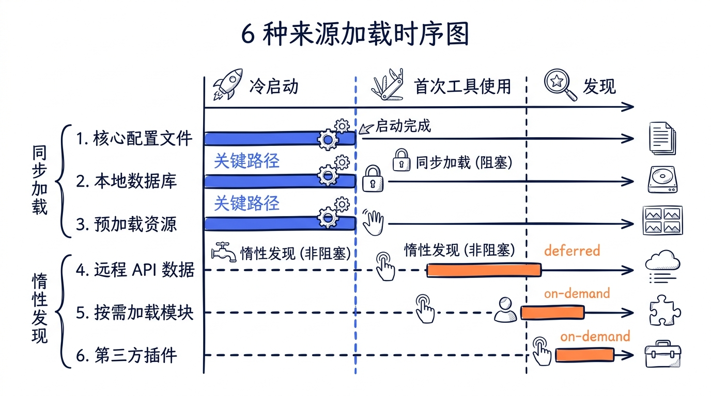
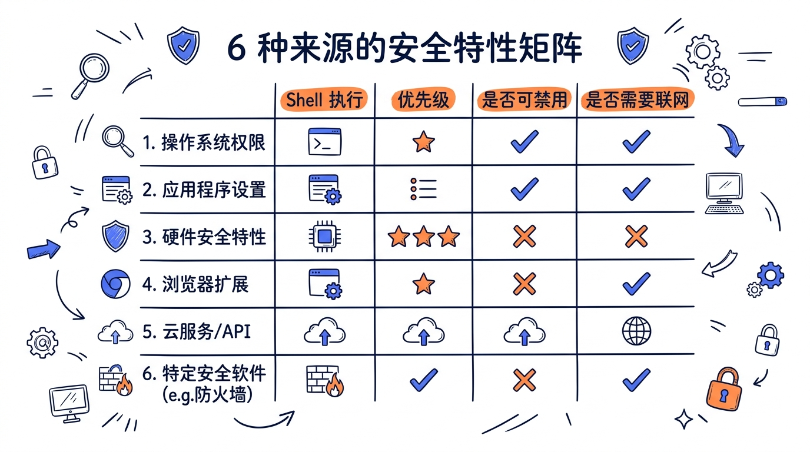
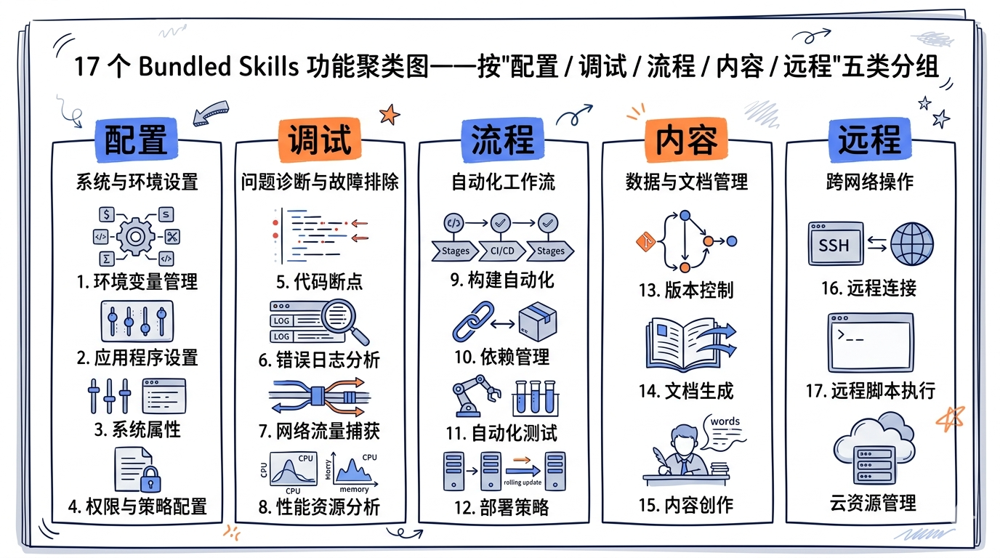
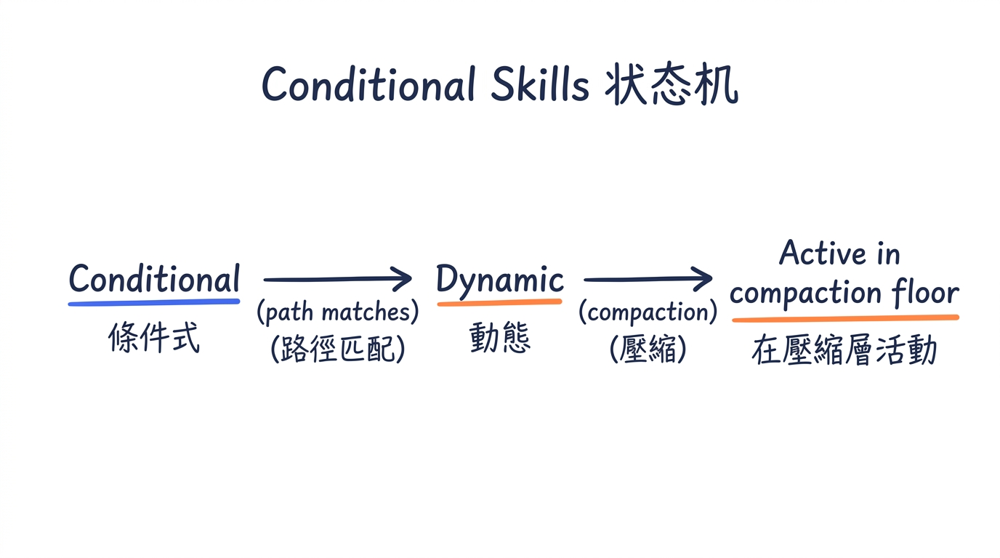
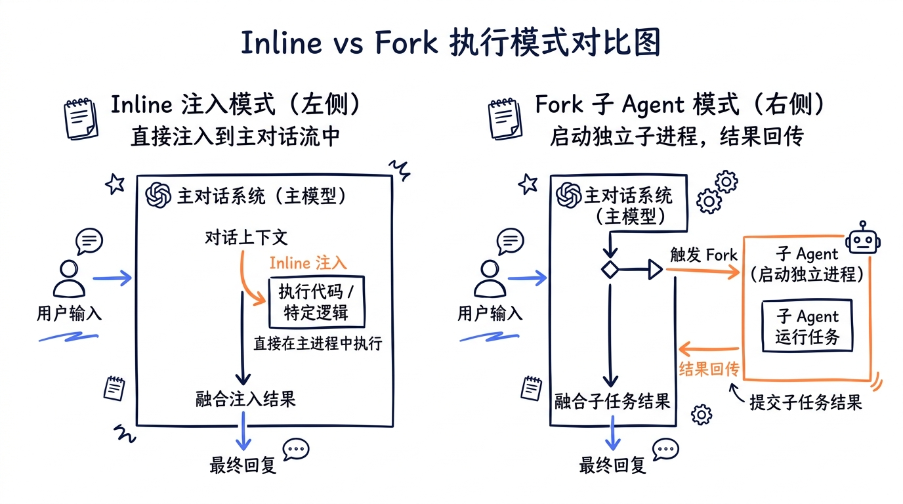
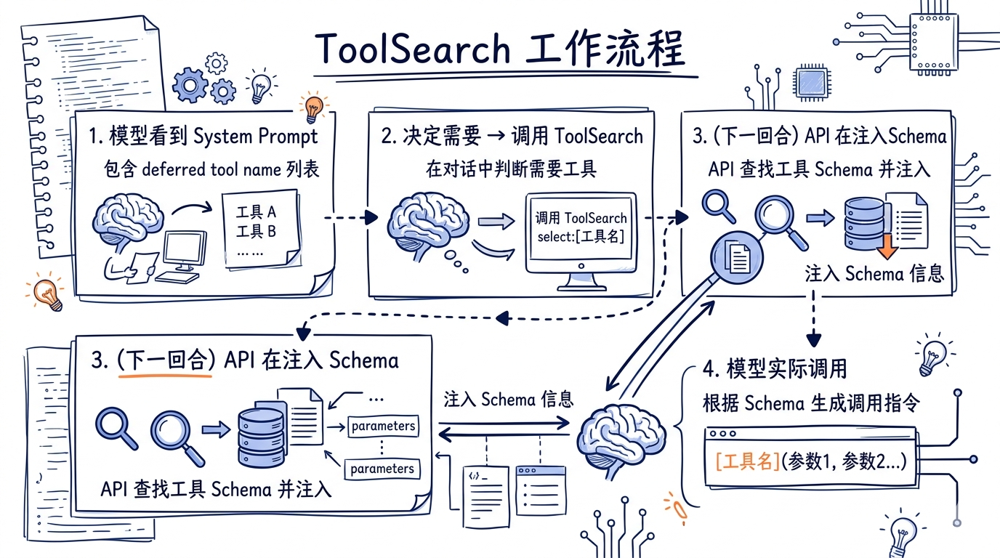
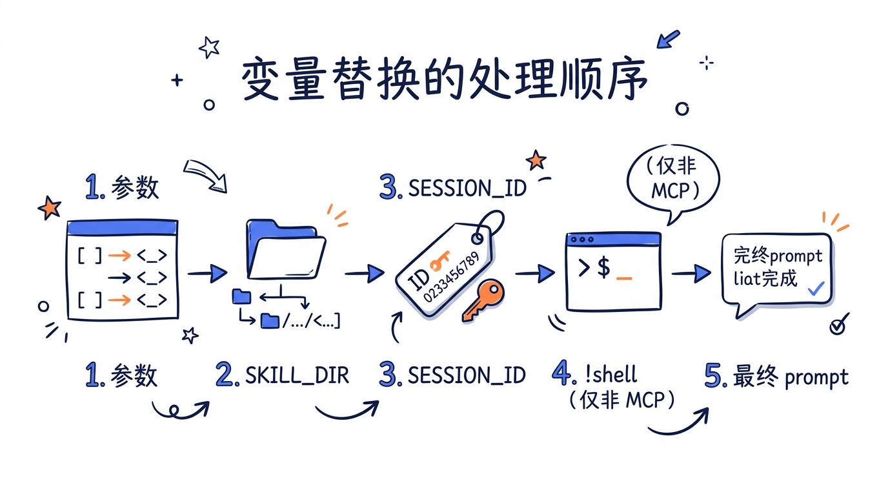
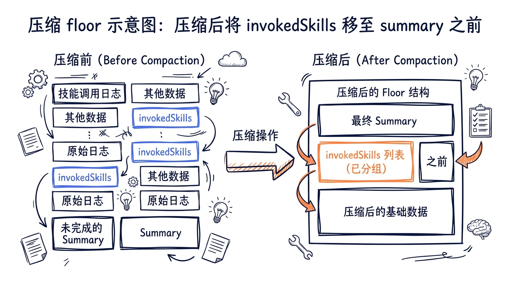
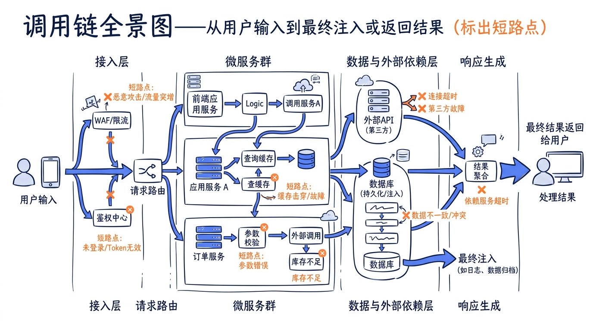

# 第十三章 Skills 体系：从加载源到调度器


> **核心问题**：一个 CLI 工具如何在不修改核心代码的前提下，让用户、项目、企业策略、第三方插件、远程 MCP 服务器各自挂上"可执行的能力包"，并被同一个 Tool 接口（SkillTool）以一致的方式调度，同时不撑爆 context window？Claude Code 的答案是 **6 种来源、1 个统一抽象（Command）、2 个调度器（SkillTool + ToolSearchTool）和 1 套延迟加载机制**。

> **本章范围**：本章只讲 Skills 一件事——从源码层面解剖 Skill 的加载、表示、调度、压缩生存。Plugin（容器分发）和 Slash Command（用户调用入口）会在 **第 14 章** 单独处理；它们和 Skill 在运行时合流到同一个 `Command` 对象上，但生命周期与组织方式各有不同。本章只在三系协作的接口处简要提及。


---

## 13.1 Skill 的本体：一段带 Frontmatter 的 Markdown

在深入 6 种加载源之前，先固定 Skill 的**最小本体**。一个 Skill 是一段 Markdown，文件名必须是 `SKILL.md`，并且**必须**位于一个以 skill 名命名的目录里：

```
~/.claude/skills/
  review-pr/
    SKILL.md           # 必须叫这个名字
    helpers/           # 可选：随 skill 一起分发的资源
      checklist.md
```

`SKILL.md` 由两部分组成：可选的 YAML frontmatter，加上正文 Markdown 内容。

```markdown
---
description: 代码审查助手
when_to_use: 用户要求对 PR 做代码审查时
allowed-tools: ["Read", "Grep", "Bash"]
model: opus
context: fork
paths: src/**
arguments: ["pr_number"]
---

你是代码审查专家。请按以下步骤审查 PR ${pr_number}：
1. 用 Bash 拉取 PR 改动
2. 用 Read/Grep 检查关键路径
3. 输出结构化审查报告

Base directory: ${CLAUDE_SKILL_DIR}
Session: ${CLAUDE_SESSION_ID}
```

关键观察：

1. **Skill 不是脚本，是 prompt**——执行时它的内容会被**注入到对话上下文**，引导模型按既定流程工作。
2. **Frontmatter 是元数据**——`allowed-tools` / `model` / `context` 等字段直接影响 SkillTool 调度时的行为开关。
3. **正文支持变量替换**——`${CLAUDE_SKILL_DIR}` / `${CLAUDE_SESSION_ID}` / `$ARGUMENTS` / `$1`/`$2` 等都会在调用时被实际值替换。
4. **可附带文件**：skill 目录里的其他文件可以被正文以相对路径引用；Bundled skill 通过特殊机制把文件懒惰提取到磁盘（见 13.4.1）。


---

## 13.2 Command 统一类型：所有来源的归一点

Skill 在运行时不会直接以 Markdown 形式存在。它们会被**包装成 `Command` 对象**——这是 Claude Code 内部的统一抽象，无论来自哪种加载源，最终都汇聚到这个类型上。这种归一化让 SkillTool、prompt 生成、权限检查这些上层模块**不必关心具体来源**。

```typescript
// 来自 types/command.ts 的简化表示
export type Command = PromptCommand | ActionCommand

export type PromptCommand = {
  type: 'prompt'
  name: string
  description: string

  // 来源标记
  source: SettingSource | 'builtin' | 'mcp' | 'plugin' | 'bundled'
  loadedFrom: LoadedFrom        // 6 种来源之一

  // 延迟求值——只在真正调用时才生成 prompt 内容
  getPromptForCommand: (
    args: string,
    ctx: ToolUseContext,
  ) => Promise<ContentBlockParam[]>

  // 元数据（来自 frontmatter）
  allowedTools: string[]
  model?: string
  effort?: EffortValue
  context?: 'inline' | 'fork'   // 执行模式
  agent?: string
  hooks?: HooksSettings
  paths?: string[]              // 条件激活路径
  whenToUse?: string            // 模型选择提示
  disableModelInvocation?: boolean
  userInvocable?: boolean

  // Plugin 信息（仅 plugin 来源）
  pluginInfo?: { repository: string; pluginManifest: PluginManifest }
}
```

字段含义按"用途分组"理解：

| 分组 | 字段 | 作用 |
|---|---|---|
| 标识 | `name` / `description` | UI 展示与名称解析 |
| 来源 | `source` / `loadedFrom` / `pluginInfo` | 调试、安全、显示前缀 |
| 内容 | `getPromptForCommand` | 延迟求值的 prompt 生成器 |
| 元数据 | `allowedTools` / `model` / `effort` / `context` / `agent` | SkillTool 调用时改写上下文 |
| 激活 | `paths` / `whenToUse` | 条件激活与模型选择提示 |
| 边界 | `disableModelInvocation` / `userInvocable` | 限制谁能调用 |

> 关键设计：`getPromptForCommand` 是**异步**且**延迟求值**的。Skill 列表在启动时只加载元数据（轻量），真实的 prompt 内容只在**被调用那一刻**才生成。这是 Claude Code 在面对几百个 skill 时还能快速冷启动的原因之一。

---

## 13.3 6 种 Skill 来源：完整清单与判定

按 `docs/canonical-numbers.md` 的口径，Claude Code 共有 **6 种 Skill 来源**。它们由 `SettingSource` 与 `LoadedFrom` 两条枚举共同表达，源码在 `src/skills/loadSkillsDir.ts`：

```typescript
// 来自 skills/loadSkillsDir.ts 的简化定义
export type LoadedFrom =
  | 'commands_DEPRECATED'   // 旧版 /commands/ 目录（兼容用）
  | 'skills'                // 新版 /skills/ 目录（用户/项目/管控级）
  | 'plugin'                // Plugin marketplace 提供的 skill
  | 'managed'               // 企业管控策略（policy）
  | 'bundled'               // 编译时内置
  | 'mcp'                   // MCP server 暴露的 prompts

export type SettingSource =
  | 'policySettings'        // 企业管控（最高优先级）
  | 'userSettings'          // 用户级 ~/.claude/
  | 'projectSettings'       // 项目级 .claude/
  | 'localSettings'         // 项目级 settings.local.json
  | 'commandLine'           // CLI 参数
```

注意：`SettingSource` 是**配置层级**（标记 settings.json 的归属），`LoadedFrom` 是**加载机制**（标记是从哪条管道进来的）。两者并非一一对应——一个 skill 可以是 `loadedFrom: 'skills'` + `source: 'projectSettings'`（项目目录里的 skill），也可以是 `loadedFrom: 'plugin'` + `source: 'userSettings'`（用户级安装的 plugin 里的 skill）。



下面逐一展开。

### 13.3.1 bundled — 编译时内置（17 个）

Bundled skills 是编译进 CLI 二进制文件的技能，随 Claude Code 一起发布。它们通过 `registerBundledSkill()` 函数注册：

```typescript
// 来自 skills/bundledSkills.ts
export type BundledSkillDefinition = {
  name: string
  description: string
  whenToUse?: string
  allowedTools?: string[]
  model?: string
  context?: 'inline' | 'fork'
  files?: Record<string, string>  // 附带的参考文件
  getPromptForCommand: (
    args: string,
    context: ToolUseContext,
  ) => Promise<ContentBlockParam[]>
}

const bundledSkills: Command[] = []

export function registerBundledSkill(definition: BundledSkillDefinition): void {
  // 处理 files 字段——首次调用时懒惰提取到磁盘
  let getPromptForCommand = definition.getPromptForCommand
  if (files && Object.keys(files).length > 0) {
    skillRoot = getBundledSkillExtractDir(definition.name)
    let extractionPromise: Promise<string | null> | undefined
    const inner = definition.getPromptForCommand
    getPromptForCommand = async (args, ctx) => {
      extractionPromise ??= extractBundledSkillFiles(definition.name, files)
      const extractedDir = await extractionPromise
      const blocks = await inner(args, ctx)
      if (extractedDir === null) return blocks
      return prependBaseDir(blocks, extractedDir)
    }
  }

  const command: Command = {
    type: 'prompt',
    name: definition.name,
    source: 'bundled',
    loadedFrom: 'bundled',
    // ...其余字段
  }
  bundledSkills.push(command)
}
```

所有 bundled skills 在 `initBundledSkills()` 中统一注册：

```typescript
// 来自 skills/bundled/index.ts
export function initBundledSkills(): void {
  registerUpdateConfigSkill()
  registerKeybindingsSkill()
  registerVerifySkill()
  registerDebugSkill()
  registerLoremIpsumSkill()
  registerSkillifySkill()
  registerRememberSkill()
  registerSimplifySkill()
  registerBatchSkill()
  registerStuckSkill()
  registerLoopSkill()
  registerScheduleRemoteAgentsSkill()
  // 以下是 feature gate 控制的条件注册
  if (feature('BUILDING_CLAUDE_APPS')) {
    registerClaudeApiSkill()
  }
  if (feature('CLAUDE_IN_CHROME')) {
    registerClaudeInChromeSkill()
  }
}
```

这种模式的优点：

- **零延迟**：不需要文件系统 I/O；进程启动时已可用。
- **Feature gate 控制**：通过 `feature()` 宏在编译期做 dead code elimination，关闭的能力不进入 binary。
- **附带文件懒惰提取**：`files` 字段会在**首次调用时**提取到 `$TMPDIR/claude-code-bundled-skills/<name>/`，避免每次启动都解压。
- **有真实写盘需求时可寻址**：提取后正文里的相对路径仍然有效（`prependBaseDir` 会改写引用）。

### 13.3.2 skills — 新版目录（用户/项目/管控）

这是面向人类用户和项目的主要扩展方式。Skills 从三个层级的 `/skills/` 目录加载：

```
~/.claude/skills/                # 用户级（source: userSettings）
.claude/skills/                  # 项目级（source: projectSettings）
<managed-path>/.claude/skills/   # 企业管控级（source: policySettings）
```

每个 Skill **必须是目录格式**，目录名即 skill 名：

```
skills/
  review/
    SKILL.md     # 唯一入口文件，文件名固定为 SKILL.md
  deploy/
    SKILL.md
```

加载过程在 `loadSkillsFromSkillsDir()` 中：

```typescript
async function loadSkillsFromSkillsDir(
  basePath: string,
  source: SettingSource,
): Promise<SkillWithPath[]> {
  const entries = await fs.readdir(basePath)

  return Promise.all(entries.map(async (entry) => {
    // 只支持目录格式（含符号链接）
    if (!entry.isDirectory() && !entry.isSymbolicLink()) return null

    const skillDirPath = join(basePath, entry.name)
    const skillFilePath = join(skillDirPath, 'SKILL.md')
    const content = await fs.readFile(skillFilePath, { encoding: 'utf-8' })

    const { frontmatter, content: markdownContent } =
      parseFrontmatter(content, skillFilePath)
    const parsed = parseSkillFrontmatterFields(
      frontmatter, markdownContent, entry.name,
    )

    return {
      skill: createSkillCommand({
        ...parsed,
        skillName: entry.name,
        markdownContent,
        source,
        baseDir: skillDirPath,
        loadedFrom: 'skills',
      }),
      filePath: skillFilePath,
    }
  }))
}
```

`getSkillDirCommands()` 函数（被 `memoize` 包装）统一编排所有目录的加载：

```typescript
export const getSkillDirCommands = memoize(
  async (cwd: string): Promise<Command[]> => {
    const [
      managedSkills,
      userSkills,
      projectSkillsNested,
      additionalSkillsNested,
      legacyCommands,
    ] = await Promise.all([
      loadSkillsFromSkillsDir(managedSkillsDir, 'policySettings'),
      loadSkillsFromSkillsDir(userSkillsDir, 'userSettings'),
      // 项目级：扫描每个祖先目录
      Promise.all(projectSkillsDirs.map(
        dir => loadSkillsFromSkillsDir(dir, 'projectSettings'),
      )),
      // --add-dir 额外目录
      Promise.all(additionalDirs.map(
        dir => loadSkillsFromSkillsDir(dir, 'projectSettings'),
      )),
      // 旧版 /commands/ 目录
      loadSkillsFromCommandsDir(cwd),
    ])

    // 合并 + 去重（通过 realpath 解析符号链接）
    return dedupByRealpath([
      ...managedSkills,
      ...userSkills,
      ...projectSkillsNested.flat(),
      ...additionalSkillsNested.flat(),
      ...legacyCommands,
    ])
  },
)
```

**去重机制**值得注意：`realpath` 把符号链接解析为规范路径，确保同一个文件不会通过不同路径加载两次。这在用户喜欢用符号链接管理 skill 集合时（比如把 superpowers 的 skill 链接到 `~/.claude/skills/`）尤为重要。

### 13.3.3 commands_DEPRECATED — 旧版目录

旧版 `/commands/` 目录是 Claude Code 早期的 skill 入口，现已被 `/skills/` 取代但仍兼容。它支持两种格式：

- **目录格式**：`commands/review/SKILL.md`（推荐，与新版一致）
- **单文件格式**：`commands/review.md`（仅旧版保留）

在 UI 层面，从 `commands_DEPRECATED` 加载的 Skill 显示时会带 `/` 前缀（如 `/review`），而新版 skills 直接显示名称。这是为了让老用户在 transition 期间还能识别"这条来自老目录"。

> **教学口径**：6 种来源里，`commands_DEPRECATED` 是历史包袱，新项目不要用；但理解它的存在能帮你看懂老仓库为什么有些 skill 在 `commands/` 而不是 `skills/`。

### 13.3.4 plugin — 插件提供

Plugin 系统通过 marketplace 分发 Skill 集合。Plugin 提供的 Skill 会带有 `pluginInfo` 字段，包含仓库地址、manifest、marketplace 信息。Plugin Skill 的名称采用 `plugin:skill` 格式（如 `superpowers:brainstorming`）。

> **本章只讲到这里**——Plugin 的安装、卸载、版本管理、scope 层级、后台同步等内容属于"容器/分发"层，与 Skill 本体无关，会在 **Ch14** 集中处理。这里只需记住：plugin 在 Skill 视角下就是"一组 `loadedFrom: 'plugin'` 的 Command 对象"。

### 13.3.5 managed — 企业管控

Managed skills 从企业策略目录加载，**优先级最高**——出现同名时会覆盖 user/project 来源的 skill。这是 IT/Security 团队推送强制能力（如安全审计、敏感数据扫描）的方式。

通过 `CLAUDE_CODE_DISABLE_POLICY_SKILLS` 环境变量可以在开发环境禁用，方便排查"为什么我的 skill 行为和文档对不上"——常见情况是 policy 覆盖了你的版本。

```bash
# 临时禁用企业管控 skill 进行调试
CLAUDE_CODE_DISABLE_POLICY_SKILLS=1 claude
```

### 13.3.6 mcp — MCP Server Prompts

MCP servers 可以暴露 prompts，这些 prompts 被包装为 Command 对象。与其他来源不同，MCP skills 有严格的安全限制——**不执行内联 shell 命令**（`!command` 语法）：

```typescript
// 来自 loadSkillsDir.ts 的 createSkillCommand
if (loadedFrom !== 'mcp') {
  finalContent = await executeShellCommandsInPrompt(
    finalContent, toolUseContext, `/${skillName}`, shell,
  )
}
```

理由很直白：MCP server 来自第三方进程，可能不可信。如果 server 在 prompt 里塞了 `!rm -rf $HOME` 之类的字符串，本地一旦执行就完了。所以 MCP 来源的 skill 只能注入文本，不能触发 shell 副作用。



### 13.3.7 6 种来源的对比表

| 来源 | 加载时机 | 优先级 | shell 注入 | 典型用途 |
|---|---|---|---|---|
| `bundled` | 启动时（编译期注册） | 中 | 是 | Claude Code 自带核心能力（debug/verify/loop ...） |
| `skills` (managed) | 启动时（policy 目录扫描） | **最高** | 是 | 企业强推的安全/合规能力 |
| `skills` (user) | 启动时（`~/.claude/skills/`） | 中 | 是 | 个人常用工具集 |
| `skills` (project) | 启动 + 动态发现 | 中 | 是 | 项目特定的开发流程 |
| `commands_DEPRECATED` | 启动时（兼容路径） | 低 | 是 | 老仓库迁移 |
| `plugin` | 启动 + 后台同步 | 中 | 是 | marketplace 分发的能力包 |
| `mcp` | 启动 + 服务连接 | 低 | **否** | 第三方 MCP server 暴露的 prompts |

---

## 13.4 17 个 Bundled Skills 完整清单

按 `docs/canonical-numbers.md`，`src/skills/bundled/` 目录下共 **17 个文件**——其中 16 个是 skill 实现，1 个是 `index.ts` 装载入口。下面逐项给出文件名、用途、和它在使用场景中的核心价值。

| # | 文件 | 用途 | 何时触发 |
|---|---|---|---|
| 1 | `batch.ts` | 批量执行多个 sub-task | 用户要"同时做 N 件相似但独立的事"时 |
| 2 | `claudeApi.ts` | 调用 Claude API、构建 SDK 应用 | 用户基于 Anthropic SDK 开发 agent 应用时 |
| 3 | `claudeApiContent.ts` | Claude API prompt 内容辅助 | 配合 `claudeApi.ts` 使用，提供模板/最佳实践 |
| 4 | `claudeInChrome.ts` | 在 Chrome 内调用 Claude（浏览器扩展场景） | 涉及 Claude in Chrome 扩展开发时 |
| 5 | `debug.ts` | 调试辅助（追踪问题、复现 bug） | 用户报告 bug、需要根因排查时 |
| 6 | `keybindings.ts` | 自定义键绑定（修改 `~/.claude/keybindings.json`） | 用户想改快捷键时 |
| 7 | `loop.ts` | 周期性循环执行某条 prompt 或 slash command | 设置定时任务、轮询状态时 |
| 8 | `loremIpsum.ts` | 占位文本生成 | UI / 文档需要假数据时 |
| 9 | `remember.ts` | 把当前对话信息写入跨会话语义记忆 | 用户说"以后记住" 时 |
| 10 | `scheduleRemoteAgents.ts` | 调度远程 agent 在 cron 时间执行 | 设置定期 agent 任务时 |
| 11 | `simplify.ts` | 内容/代码简化 | 重构时减少冗余 |
| 12 | `skillify.ts` | 把当前流程提炼为可复用 skill | 用户说"把这个流程做成 skill"时 |
| 13 | `stuck.ts` | 卡住时求助（升级到更高 effort 或更换思路） | 模型多轮失败、用户表达受阻时 |
| 14 | `updateConfig.ts` | 更新 settings.json（权限/hooks/env 等） | 用户改配置时 |
| 15 | `verify.ts` | 验证（运行测试、检查输出） | 完成前自检时 |
| 16 | `verifyContent.ts` | 内容验证（与 `verify.ts` 配合） | 校验文档/输出格式时 |
| 17 | `index.ts` | 装载入口（**不是 skill 本身**） | — |

> 注意 `index.ts` 不是 skill，是把上面 16 个注册到 `bundledSkills[]` 数组的入口。所以"17 个文件 = 16 个 skill + 1 个 index"，canonical numbers 表里特意把这个口径写清楚，避免和实际可用 skill 数混淆。



观察这 17 个 skill 的设计选择：

1. **元能力优先**：`skillify` / `remember` / `verify` / `stuck` 这种"关于流程"的 skill 占了相当比例——bundled skill 不追求覆盖业务领域，而是覆盖**与模型自我管理相关的元动作**。
2. **可证伪能力**：`verify` / `verifyContent` 让"完成"必须有可执行的检查点，对应了书中 Ch12 关于权限和 Ch08 关于压缩的"证据优先"原则。
3. **运维通道**：`updateConfig` / `keybindings` 是"用 Claude 改 Claude"——把硬配置入口包装成 skill，让对话即配置。
4. **远程钩子**：`scheduleRemoteAgents` / `loop` 让本地会话能产生"未来的 agent 调用"，把单次会话扩展到时间维度。

---

## 13.5 条件激活与动态发现

Claude Code 的 Skill 不只是在启动时一次性加载——它还支持**运行时动态发现**和**条件激活**。

### 13.5.1 路径条件激活

Skill 的 frontmatter 可以声明 `paths` 字段，指定只在操作特定文件时才激活：

```markdown
---
paths: src/components/**
description: React 组件开发辅助
---
```

启动时这种 skill 不会进入"激活集合"——它会被放进 `conditionalSkills` 池子。当模型通过 Read/Write/Edit 等工具操作文件时，系统检查文件路径是否匹配这些待激活 skill 的 `paths` 模式：

```typescript
// 来自 skills/loadSkillsDir.ts
export function activateConditionalSkillsForPaths(
  filePaths: string[],
  cwd: string,
): string[] {
  const activated: string[] = []
  for (const [name, skill] of conditionalSkills) {
    const skillIgnore = ignore().add(skill.paths)
    for (const filePath of filePaths) {
      const relativePath = relative(cwd, filePath)
      if (skillIgnore.ignores(relativePath)) {
        dynamicSkills.set(name, skill)
        conditionalSkills.delete(name)
        activatedConditionalSkillNames.add(name)
        activated.push(name)
        break
      }
    }
  }
  return activated
}
```

使用 `ignore` 库（与 `.gitignore` 相同的匹配规则）进行路径匹配。一旦激活，skill 会从 conditional 池移到 dynamic 池——之后整个会话都保持激活，不会因为后续操作离开匹配路径而退出。

### 13.5.2 目录动态发现

当模型操作深层目录中的文件时，系统会自动向上扫描是否存在 `.claude/skills/` 目录：

```typescript
export async function discoverSkillDirsForPaths(
  filePaths: string[],
  cwd: string,
): Promise<string[]> {
  const newDirs: string[] = []
  const resolvedCwd = await fs.realpath(cwd)
  for (const filePath of filePaths) {
    let currentDir = dirname(filePath)
    // 从文件位置向上扫描到 cwd（不含 cwd 本身——cwd 级的 skills 启动时已加载）
    while (currentDir.startsWith(resolvedCwd + pathSep)) {
      const skillDir = join(currentDir, '.claude', 'skills')
      if (!dynamicSkillDirs.has(skillDir)) {
        dynamicSkillDirs.add(skillDir)
        // 检查目录是否存在 + 是否被 gitignore
        if (await isPathGitignored(currentDir, resolvedCwd)) continue
        newDirs.push(skillDir)
      }
      currentDir = dirname(currentDir)
    }
  }
  return newDirs
}
```

**安全防护**：被 `.gitignore` 忽略的目录（如 `node_modules/`）中的 skills 不会被加载。这避免了"用户进了一个 npm 包目录，结果包里夹带的恶意 skill 被自动激活"的安全噩梦。

### 13.5.3 Signal 通知机制

动态发现的 Skill 通过 Signal 机制通知其他模块清理缓存：

```typescript
const skillsLoaded = createSignal()

export function onDynamicSkillsLoaded(callback: () => void): () => void {
  return skillsLoaded.subscribe(() => {
    try { callback() } catch (error) { logError(error) }
  })
}

// 加载完成时触发
export async function addSkillDirectories(dirs: string[]): Promise<void> {
  // ... 加载逻辑 ...
  skillsLoaded.emit()
}
```

订阅者包括：system prompt 重新生成器（让新 skill 出现在列表里）、SkillTool 描述缓存（让新 skill 可被搜索）、UI 状态（让用户在 `/skills` 页面看到新增项）。



---

## 13.6 SkillTool 实现深度剖析

SkillTool 是模型调用 Skill 的**唯一入口**。它是一个标准的 Tool 实现，但行为比普通工具复杂——它要做名称解析、权限检查、上下文改写、有时还要 fork 出子 agent。

### 13.6.1 工具定义骨架

```typescript
// 来自 tools/SkillTool/constants.ts
export const SKILL_TOOL_NAME = 'Skill'

// 来自 tools/SkillTool/SkillTool.ts
export const inputSchema = lazySchema(() =>
  z.object({
    skill: z.string().describe('The skill name'),
    args: z.string().optional().describe('Optional arguments'),
  }),
)

export const SkillTool = buildTool({
  name: SKILL_TOOL_NAME,
  searchHint: 'invoke a slash-command skill',
  maxResultSizeChars: 100_000,

  get inputSchema() { return inputSchema() },
  get outputSchema() { return outputSchema() },

  description: async ({ skill }) => `Execute skill: ${skill}`,
  prompt: async () => getPrompt(getProjectRoot()),

  // 三步流水线
  validateInput(...) { ... },
  checkPermissions(...) { ... },
  call(...) { ... },

  // UI 渲染
  renderToolUseMessage(...) { ... },
  renderToolResultMessage(...) { ... },
  renderToolUseProgressMessage(...) { ... },
  renderToolUseRejectedMessage(...) { ... },
  renderToolUseErrorMessage(...) { ... },

  // API 序列化
  mapToolResultToToolResultBlockParam(...) { ... },

  toAutoClassifierInput: ({ skill }) => skill ?? '',
} satisfies ToolDef<InputSchema, Output, Progress>)
```

模型调用示例：`{ skill: "review", args: "src/main.ts" }`。

### 13.6.2 验证流程：四层校验

`validateInput` 执行四层校验，每层都可能短路返回：

```typescript
async validateInput({ skill }, context): Promise<ValidationResult> {
  const trimmed = skill.trim()
  const normalizedCommandName = trimmed.startsWith('/')
    ? trimmed.substring(1) : trimmed

  // 1. 检查远程 canonical skill（实验性功能 EXPERIMENTAL_SKILL_SEARCH）
  if (feature('EXPERIMENTAL_SKILL_SEARCH')) {
    const slug = remoteSkillModules!.stripCanonicalPrefix(normalizedCommandName)
    if (slug !== null) {
      // 验证是否在本会话中被发现
    }
  }

  // 2. 获取所有可用 commands（含 MCP skills）并查找
  const commands = await getAllCommands(context)
  const foundCommand = findCommand(normalizedCommandName, commands)
  if (!foundCommand) {
    return { result: false, errorCode: 1, message: 'Skill not found' }
  }

  // 3. 检查 disableModelInvocation
  if (foundCommand.disableModelInvocation) {
    return { result: false, errorCode: 4, message: 'Not callable by model' }
  }

  // 4. 必须是 prompt 类型（action 类型由其他路径处理）
  if (foundCommand.type !== 'prompt') {
    return { result: false, errorCode: 5, message: 'Wrong command type' }
  }

  return { result: true }
}
```

短路顺序的设计逻辑：先快速失败（不存在）→ 再权限失败（disabled）→ 最后类型不匹配。每条错误都有数字 code，方便上层 UI 给出具体提示。

### 13.6.3 权限检查：三层放行 + 默认询问

`checkPermissions` 实现了精细的权限控制：

```typescript
async checkPermissions({ skill, args }, context): Promise<PermissionDecision> {
  const commandName = stripSlash(skill)
  const denyRules = collectRules(context, 'deny')
  const allowRules = collectRules(context, 'allow')

  // 1. 检查 deny 规则（最高优先级）
  for (const [ruleContent, rule] of denyRules.entries()) {
    if (ruleMatches(ruleContent, commandName)) {
      return { behavior: 'deny', reason: `Denied by rule: ${ruleContent}` }
    }
  }

  // 2. 检查 allow 规则（支持前缀匹配：review:* 匹配 review-pr）
  for (const [ruleContent, rule] of allowRules.entries()) {
    if (ruleMatches(ruleContent, commandName)) {
      return { behavior: 'allow' }
    }
  }

  // 3. 安全属性白名单——只有"安全"属性的 Skill 自动放行
  const commandObj = await findCommandObj(commandName, context)
  if (skillHasOnlySafeProperties(commandObj)) {
    return { behavior: 'allow' }
  }

  // 4. 默认询问用户，并提供可操作的规则建议
  return {
    behavior: 'ask',
    suggestions: [
      { rules: [{ toolName: 'Skill', ruleContent: commandName }] },
      { rules: [{ toolName: 'Skill', ruleContent: `${commandName}:*` }] },
    ],
  }
}
```

`SAFE_SKILL_PROPERTIES` 白名单确保新增的属性默认需要权限审批：

```typescript
const SAFE_SKILL_PROPERTIES = new Set([
  'type', 'progressMessage', 'contentLength', 'argNames', 'model',
  'effort', 'source', 'pluginInfo', 'name', 'description', 'aliases',
  'whenToUse', 'paths', 'version', 'skillRoot', 'context', 'agent',
  // ... 更多安全属性
])

function skillHasOnlySafeProperties(command: Command): boolean {
  for (const key of Object.keys(command)) {
    if (SAFE_SKILL_PROPERTIES.has(key)) continue
    const value = (command as Record<string, unknown>)[key]
    if (value !== undefined && value !== null) return false
  }
  return true
}
```

这条机制是**安全设计的关键**：当未来某天有人给 `Command` 类型加一个新字段（比如 `executeShell`），如果没有把它加入 `SAFE_SKILL_PROPERTIES`，所有用到这个字段的 skill 都会自动落入"询问用户"分支——而不是默认放行。这是典型的 fail-closed 设计。

### 13.6.4 两种执行模式：Inline vs Fork

SkillTool 的 `call()` 方法根据 `command.context` 字段选择执行模式。

**Inline 模式**（默认）——把 skill 内容**注入到当前对话**：

```typescript
async call({ skill, args }, context, canUseTool, parentMessage) {
  const commandName = stripSlash(skill)
  const commands = await getAllCommands(context)
  const command = findCommand(commandName, commands)

  if (command.context === 'fork') {
    return executeForkedSkill(command, commandName, args, context, /*...*/)
  }

  // 处理 slash command，生成 messages
  const processedCommand = await processPromptSlashCommand(
    commandName, args || '', commands, context,
  )

  // 提取 newMessages（Skill 的 prompt 内容）
  const newMessages = tagMessagesWithToolUseID(
    processedCommand.messages.filter(m => m !== null),
    toolUseID,
  )

  // 返回结果 + contextModifier
  return {
    data: {
      success: true,
      commandName,
      allowedTools: command.allowedTools,
      model: command.model,
    },
    newMessages,        // 注入到对话中
    contextModifier(ctx) {
      // 1. 修改 allowedTools——之后只能用 skill 声明的工具子集
      // 2. 修改 model——切换到 skill 指定的模型
      // 3. 修改 effort——把 effort 拉到 skill 要求的强度
      return modifiedContext
    },
  }
}
```

Inline 模式的关键特点：

- Skill 的 prompt 内容通过 `newMessages` 注入到当前对话。
- 通过 `contextModifier` 修改后续的 tool 权限、模型、effort 等——**这是一种"上下文层面的副作用"**：调用一次 skill 等于在一段时间内把整个 agent 切换到另一种工作模式。
- Skill 在当前 agent 的上下文中执行，共享对话历史。

**Fork 模式**（`context: 'fork'`）——启动**子 agent** 独立执行：

```typescript
async function executeForkedSkill(
  command: Command,
  commandName: string,
  args: string,
  context: ToolUseContext,
  // ...
) {
  const agentId = createAgentId()
  const { baseAgent, promptMessages, skillContent } =
    await prepareForkedCommandContext(command, args, context)

  const agentMessages: Message[] = []
  // 在子 agent 中运行
  for await (const message of runAgent({
    agentDefinition: { ...baseAgent, effort: command.effort },
    promptMessages,
    toolUseContext: { ...context, getAppState: modifiedGetAppState },
    canUseTool,
    isAsync: false,
    querySource: 'agent:custom',
    model: command.model,
  })) {
    agentMessages.push(message)
    // 报告进度
    if (onProgress) {
      onProgress({
        toolUseID,
        data: { message, type: 'skill_progress' },
      })
    }
  }

  // 提取结果文本
  const resultText = extractResultText(
    agentMessages, 'Skill execution completed',
  )

  // 清理子 agent 的状态
  clearInvokedSkillsForAgent(agentId)

  return {
    data: {
      success: true,
      commandName,
      status: 'forked',
      result: resultText,
    },
  }
}
```

Fork 模式的特点：

- 启动**独立的子 agent**，有自己的 token budget。
- 通过 `runAgent` AsyncGenerator 驱动——每条消息流式回送。
- 结果通过 `extractResultText` 提取，作为工具输出返回给**父 agent**。
- 执行完毕后通过 `clearInvokedSkillsForAgent` 清理状态——避免内存泄漏。

> **如何选择**：需要在父对话历史里"留痕"用 inline；需要隔离上下文、避免污染父对话用 fork。Fork 适合长流程、多轮交互的 skill（比如 `/qa` 跑完整的浏览器 QA），inline 适合"轻量增强"（比如 `/verify` 在当前对话补一段验证 prompt）。



### 13.6.5 Prompt 预算管理

Skill 列表会被放入 system prompt（让模型知道有哪些 skill 可用），但列表太长会浪费 context window。`prompt.ts` 实现了精细的预算控制：

```typescript
// 来自 tools/SkillTool/prompt.ts
export const SKILL_BUDGET_CONTEXT_PERCENT = 0.01  // 上下文窗口的 1%
export const CHARS_PER_TOKEN = 4
export const DEFAULT_CHAR_BUDGET = 8_000
export const MAX_LISTING_DESC_CHARS = 250  // 每个条目最大字符数
export const MIN_DESC_LENGTH = 32

export function formatCommandsWithinBudget(
  commands: Command[],
  contextWindowTokens?: number,
): string {
  const budget = getCharBudget(contextWindowTokens)

  // 第 1 层：尝试完整描述
  const fullEntries = commands.map(formatFullEntry)
  const fullTotal = sumLength(fullEntries)
  if (fullTotal <= budget) {
    return fullEntries.map(e => e.full).join('\n')
  }

  // 第 2 层：截断非 bundled 描述，保留 bundled 完整
  const bundledIndices = new Set(
    commands.map((c, i) => c.loadedFrom === 'bundled' ? i : -1).filter(i => i >= 0),
  )
  const truncated = truncateNonBundled(fullEntries, bundledIndices, budget)
  if (truncated) return truncated

  // 第 3 层：极端压缩，非 bundled 只显示名称
  return commands.map((cmd, i) =>
    bundledIndices.has(i) ? fullEntries[i].full : `- ${cmd.name}`,
  ).join('\n')
}
```

策略分层：

1. **预算充足** → 全量展示。
2. **预算紧张** → bundled skills 保留完整描述（核心能力不能丢），其他 skills 截断到 `MAX_LISTING_DESC_CHARS`。
3. **极端压缩** → 非 bundled skills 只显示名称，bundled 仍完整。

这套策略的隐含假设是：bundled 是 Claude Code 的"核心能力承诺"——无论 context 多紧，模型都应该能看到完整的 bundled 列表；而第三方 skill 在极端情况下可以降级，毕竟模型看到名字后还能通过 `/skills` 命令或 `whenToUse` 提示去激活。

---

## 13.7 ToolSearchTool 与 Deferred Loading

当工具数量很多时（尤其是接入多个 MCP server），把所有工具的完整 schema 放进 system prompt 会消耗大量 context。ToolSearchTool 解决了这个问题——它让"工具发现"和"工具加载"解耦。

### 13.7.1 Deferred Tool 机制

工具被标记为 "deferred" 后，**只有名称**出现在 system prompt 中；完整的 JSON Schema 需要通过 ToolSearchTool 加载：

```typescript
// 来自 tools/ToolSearchTool/prompt.ts
export function isDeferredTool(tool: Tool): boolean {
  // 明确不延迟（核心工具如 Read/Edit/Bash）
  if (tool.alwaysLoad === true) return false

  // MCP 工具总是延迟（因为可能有几百个）
  if (tool.isMcp === true) return true

  // ToolSearch 自身不能延迟（否则鸡生蛋问题）
  if (tool.name === TOOL_SEARCH_TOOL_NAME) return false

  // 特定工具（Agent, Brief 等）根据 feature gate 可能不延迟
  if (tool.name === 'Agent' && feature('AGENT_TOOL_ALWAYS_LOAD')) return false

  // 标记了 shouldDefer 的工具延迟
  return tool.shouldDefer === true
}
```

判定优先级是关键：`alwaysLoad` 一票通过（核心工具不延迟）→ MCP 一票延迟（数量多）→ ToolSearch 自己一票通过（不能延迟自己）→ 最后看 `shouldDefer` 标记。

### 13.7.2 搜索实现：两种模式

ToolSearchTool 支持两种搜索模式。

**模式 1 — Direct Select**：`select:Read,Edit,Grep`

```typescript
const selectMatch = query.match(/^select:(.+)$/i)
if (selectMatch) {
  const requested = selectMatch[1].split(',').map(s => s.trim())
  const found: string[] = []
  // 在 deferred 和 full 工具集中查找
  for (const toolName of requested) {
    const tool = findToolByName(deferredTools, toolName)
      ?? findToolByName(tools, toolName)
    if (tool) found.push(tool.name)
  }
  return found
}
```

这是**确定性加载**——模型已经知道想要哪些工具，直接按名字拿。常见于 system prompt 通过名字提示模型存在某个工具，模型就会用 `select:` 直接索取。

**模式 2 — Keyword Search**：`notebook jupyter` 或 `+slack send`

```typescript
async function searchToolsWithKeywords(
  query: string,
  deferredTools: Tools,
  tools: Tools,
  maxResults: number,
): Promise<string[]> {
  const queryLower = query.toLowerCase()

  // 精确名称匹配（快速路径）
  const exactMatch = deferredTools.find(t => t.name.toLowerCase() === queryLower)
  if (exactMatch) return [exactMatch.name]

  // MCP 前缀匹配
  if (queryLower.startsWith('mcp__') && queryLower.length > 5) {
    const prefixMatches = deferredTools
      .filter(t => t.name.toLowerCase().startsWith(queryLower))
    if (prefixMatches.length > 0) return prefixMatches.map(t => t.name)
  }

  // 解析 + 前缀（required terms）
  const queryTerms = queryLower.split(/\s+/)
  const requiredTerms: string[] = []
  const optionalTerms: string[] = []
  for (const term of queryTerms) {
    if (term.startsWith('+')) requiredTerms.push(term.slice(1))
    else optionalTerms.push(term)
  }

  // 评分搜索
  const candidateTools = [...deferredTools, ...tools]
  const scored = await Promise.all(candidateTools.map(async tool => {
    const parsed = parseToolName(tool.name)
    const hintNormalized = (tool.searchHint ?? '').toLowerCase()
    const descNormalized = (await tool.description?.({}) ?? '').toLowerCase()

    // 必须项过滤
    for (const req of requiredTerms) {
      const pattern = wordBoundaryRegex(req)
      if (!parsed.parts.includes(req)
          && !pattern.test(hintNormalized)
          && !pattern.test(descNormalized)) {
        return { name: tool.name, score: 0 }
      }
    }

    // 评分
    let score = 0
    const allScoringTerms = [...requiredTerms, ...optionalTerms]
    for (const term of allScoringTerms) {
      const pattern = wordBoundaryRegex(term)
      if (parsed.parts.includes(term)) score += parsed.isMcp ? 12 : 10
      else if (parsed.parts.some(p => p.includes(term))) score += parsed.isMcp ? 6 : 5
      if (hintNormalized && pattern.test(hintNormalized)) score += 4
      if (pattern.test(descNormalized)) score += 2
    }
    return { name: tool.name, score }
  }))

  return scored
    .filter(i => i.score > 0)
    .sort((a, b) => b.score - a.score)
    .slice(0, maxResults)
    .map(i => i.name)
}
```

评分规则的设计逻辑：

| 条件 | 分数 | 解释 |
|---|---|---|
| 名称分量精确匹配 (MCP) | 12 | MCP 工具名通常包含命名空间，精确匹配最可信 |
| 名称分量精确匹配 (非 MCP) | 10 | 名字直接命中是最强信号 |
| 名称分量部分包含 (MCP) | 6 | "包含"比"等于"弱 |
| 名称分量部分包含 (非 MCP) | 5 | 同上 |
| `searchHint` 命中 | 4 | searchHint 是人工策划的能力短语，权重中等 |
| 描述命中 | 2 | 描述里随便一个词都可能命中，权重最低 |

`+` 前缀必须项是**过滤器**，不是加分项——任何缺失必须项的候选直接被踢出。这避免了"我想要 slack 发送但模型给我搜出 email 发送"的误匹配。

### 13.7.3 返回格式：tool_reference

ToolSearchTool 返回 `tool_reference` 类型的 content blocks——这是 Claude API 的特殊类型，告诉服务端"在下一轮把这些工具的完整 schema 注入"：

```typescript
mapToolResultToToolResultBlockParam(content: Output, toolUseID: string) {
  if (content.matches.length === 0) {
    return {
      type: 'tool_result',
      tool_use_id: toolUseID,
      content: noMatchHint(content),
    }
  }
  return {
    type: 'tool_result',
    tool_use_id: toolUseID,
    content: content.matches.map(name => ({
      type: 'tool_reference' as const,
      tool_name: name,
    })),
  }
}
```

`tool_reference` 是一个不消耗 prompt token 的占位——它告诉 API "在下一轮请求时，把这个工具的 schema 加进 tools 数组"。这样模型只需要在**真正用到时**才付出 schema 的 token 成本。

### 13.7.4 缓存策略

工具描述使用 memoize 缓存（描述生成可能涉及 I/O），但当 deferred tools 集合变化时自动失效：

```typescript
let cachedDeferredToolNames: string | null = null

function maybeInvalidateCache(deferredTools: Tools): void {
  const currentKey = getDeferredToolsCacheKey(deferredTools)
  if (cachedDeferredToolNames !== currentKey) {
    getToolDescriptionMemoized.cache.clear?.()
    cachedDeferredToolNames = currentKey
  }
}
```

缓存 key 是 deferred 工具名列表的哈希——动态加载的 skill 改变了 deferred 集合时，key 变化，缓存自动作废。这是典型的"内容寻址"思路：不维护"何时失效"的逻辑，而是"内容变了 key 自然变了"。



---

## 13.8 MCP Skill Builders 与循环依赖

MCP prompts 需要被包装成 Command 对象，但 MCP 相关代码（`mcpSkills.ts`）和 Skill 加载代码（`loadSkillsDir.ts`）之间存在**严重的循环依赖**问题：

- `loadSkillsDir.ts` 需要从 MCP server 拉 prompt → 依赖 mcp 模块。
- `mcpSkills.ts` 需要把 prompt 转换为 Command → 依赖 `createSkillCommand`（在 loadSkillsDir 里）。

这种循环在静态 import 下会导致初始化竞态，在 Bun bundled binary 里动态 import 又会失败。Claude Code 的解决方案是 **write-once registry 模式**：

```typescript
// 来自 skills/mcpSkillBuilders.ts —— 依赖图的叶子节点
export type MCPSkillBuilders = {
  createSkillCommand: typeof createSkillCommand
  parseSkillFrontmatterFields: typeof parseSkillFrontmatterFields
}

let builders: MCPSkillBuilders | null = null

export function registerMCPSkillBuilders(b: MCPSkillBuilders): void {
  builders = b
}

export function getMCPSkillBuilders(): MCPSkillBuilders {
  if (!builders) {
    throw new Error(
      'MCP skill builders not registered — '
      + 'loadSkillsDir.ts has not been evaluated yet',
    )
  }
  return builders
}
```

在 `loadSkillsDir.ts` 的模块初始化阶段注册：

```typescript
// loadSkillsDir.ts 末尾
registerMCPSkillBuilders({
  createSkillCommand,
  parseSkillFrontmatterFields,
})
```

而 `mcpSkills.ts` 通过 getter 拿到这些函数：

```typescript
// 来自 mcpSkills.ts
import { getMCPSkillBuilders } from './mcpSkillBuilders'

export function buildMcpSkillCommand(prompt: McpPrompt) {
  const { createSkillCommand, parseSkillFrontmatterFields } = getMCPSkillBuilders()
  // ... 使用这些函数
}
```

这种设计避免了：

- **动态 import**（`await import('./loadSkillsDir')`）——在 Bun bundled binary 中会失败。
- **静态 import**（`import { ... } from './loadSkillsDir'`）——会造成循环依赖。
- **lazy require**（`require('./loadSkillsDir')`）——在 ESM 中不可用。

它的代价是增加了一层间接：调用方必须容忍"如果 loadSkillsDir 还没加载，就报错"的边界情况。但因为 `loadSkillsDir.ts` 在主入口被静态 import，实际运行时这个错误几乎不可能触发——它只是在重构时给后人留个明确的失败提示。

---

## 13.9 Frontmatter 解析与变量替换

### 13.9.1 Frontmatter 字段全集

每个 Skill 的 SKILL.md 文件都支持 YAML frontmatter。`parseSkillFrontmatterFields()` 解析所有支持的字段，返回一个结构化对象：

```typescript
export function parseSkillFrontmatterFields(
  frontmatter: FrontmatterData,
  markdownContent: string,
  resolvedName: string,
): {
  displayName: string | undefined
  description: string
  hasUserSpecifiedDescription: boolean
  allowedTools: string[]
  argumentHint: string | undefined
  argumentNames: string[]
  whenToUse: string | undefined
  version: string | undefined
  model: ReturnType<typeof parseUserSpecifiedModel> | undefined
  disableModelInvocation: boolean
  userInvocable: boolean
  hooks: HooksSettings | undefined
  executionContext: 'fork' | undefined
  agent: string | undefined
  effort: EffortValue | undefined
  shell: FrontmatterShell | undefined
}
```

支持的 frontmatter 字段一览：

| 字段 | 类型 | 说明 | 示例 |
|---|---|---|---|
| `description` | string | Skill 简介 | `"代码审查助手"` |
| `when_to_use` | string | 何时使用（提示模型） | `"用户要求审查时"` |
| `allowed-tools` | string[] | 允许的工具白名单 | `["Read", "Bash"]` |
| `model` | string | 模型覆盖 | `"opus"` / `"inherit"` |
| `effort` | string \| number | 推理深度 | `"high"` / `3` |
| `context` | `inline` \| `fork` | 执行上下文 | `"fork"` |
| `agent` | string | Agent 类型 | `"custom"` |
| `user-invocable` | boolean | 用户可直接调用 | `true` / `false` |
| `disable-model-invocation` | boolean | 禁止模型调用 | `true` |
| `paths` | string \| string[] | 条件激活路径（gitignore 语法） | `"src/**"` |
| `arguments` | string[] | 命名参数 | `["file", "scope"]` |
| `argument-hint` | string | 参数使用提示 | `"file [scope]"` |
| `hooks` | object | 关联的 hooks 设置 | YAML 对象 |
| `shell` | string \| object | Shell 配置 | `"bash"` / `{ command: "..." }` |
| `version` | string | Skill 版本 | `"1.2.0"` |

### 13.9.2 变量替换

Skill prompt 内容支持多种变量替换。在 `createSkillCommand` 的 `getPromptForCommand` 中：

```typescript
let finalContent = baseDir
  ? `Base directory for this skill: ${baseDir}\n\n${markdownContent}`
  : markdownContent

// 1. 命名参数替换 ($ARGUMENTS, $1, $2, ...)
finalContent = substituteArguments(finalContent, args, true, argumentNames)

// 2. Skill 目录路径替换
if (baseDir) {
  finalContent = finalContent.replace(
    /\$\{CLAUDE_SKILL_DIR\}/g,
    baseDir,
  )
}

// 3. Session ID 替换（用于跨工具通信）
finalContent = finalContent.replace(
  /\$\{CLAUDE_SESSION_ID\}/g,
  getSessionId(),
)

// 4. 内联 Shell 命令执行（仅非 MCP skills）
if (loadedFrom !== 'mcp') {
  finalContent = await executeShellCommandsInPrompt(
    finalContent, toolUseContext, `/${skillName}`, shell,
  )
}
```

支持的变量与语法：

| 变量 | 含义 | 示例 |
|---|---|---|
| `$ARGUMENTS` | 整段原始参数 | 调用 `skill foo bar` 时为 `"foo bar"` |
| `$1` / `$2` / ... | 位置参数 | `$1 = "foo"`, `$2 = "bar"` |
| `${PARAM_NAME}` | 命名参数（来自 `arguments` 字段） | 取决于声明 |
| `${CLAUDE_SKILL_DIR}` | Skill 所在目录的绝对路径 | 引用伴随文件 |
| `${CLAUDE_SESSION_ID}` | 当前会话 ID | 跨 skill 通信 |
| `!command` | 内联 shell 执行（仅非 MCP） | `!git rev-parse HEAD` |

`!command` 语法是双刃剑——它让 skill 可以在 prompt 注入前先收集真实环境信息（git hash、当前分支、文件列表），但同时是 MCP 来源 skill 被禁用的根因（MCP server 不可信，不能让它触发本地 shell）。



---

## 13.10 Skill 在 Compaction 中的存活策略

> 本节与 Ch08 的 Compaction 机制呼应。Ch08 讲了"对话历史如何被压缩"，本节聚焦 Skills 在压缩中的特殊处理。

当对话过长触发 compaction（上下文压缩）时，普通对话历史会被摘要成一段总结，以腾出 context 空间。但**已激活的 Skill 内容不能被这样压缩**——如果一个 skill 的 prompt 在压缩中被丢失，模型会"忘记"自己正在按某个流程工作。

### 13.10.1 invokedSkills 注册表

Claude Code 用 `invokedSkills` 注册表记录所有被调用过的 skill：

```typescript
// 在 SkillTool.call() 中（skill 加载完成后）
addInvokedSkill(
  commandName,
  skillPath,
  finalContent,          // 已替换变量的最终内容
  getAgentContext()?.agentId ?? null,
)
```

注册表按 `agentId` 分组——子 agent fork 出来的 skill 不会污染主对话的注册表。

### 13.10.2 Compaction floor 机制

Ch08 已经讲过 Compaction 的四种策略（autoCompact / microCompact / apiMicrocompact / sessionMemoryCompact）。在所有这些策略中，invokedSkills 的内容都会作为 **compaction floor**——压缩后的对话之上，必须重新铺一层 invokedSkills 的原始内容：

```
压缩后的对话结构：
┌─────────────────────────────────┐
│ System Prompt（含 skill 列表元数据）│
├─────────────────────────────────┤
│ Compaction Floor                │
│  - 已激活 skill #1 的完整 prompt  │
│  - 已激活 skill #2 的完整 prompt  │
│  - ...                          │
├─────────────────────────────────┤
│ Compaction Summary              │
│  - 历史对话的摘要                  │
├─────────────────────────────────┤
│ 最近的几轮对话（未被压缩）          │
└─────────────────────────────────┘
```

这样模型在压缩后的会话中仍然"看得见"自己应该按哪个 skill 工作。

### 13.10.3 Fork agent 退出时的清理

Fork 模式的 skill 在子 agent 完成后会清理它在 invokedSkills 里的条目：

```typescript
// 来自 SkillTool 的 executeForkedSkill
clearInvokedSkillsForAgent(agentId)
```

为什么要清理？因为 fork 出的 skill 是"用完即弃"的——它的目标是返回一个结果给父 agent，而不是改变父 agent 的工作模式。如果不清理，父 agent 在后续 compaction 时会重复加载子 agent 的 skill 内容，浪费 context。

### 13.10.4 与 dynamic skills 的协同

Conditional skills 被激活后会进入 `dynamicSkills` 池子（13.5.1），而被实际调用过的还会进入 `invokedSkills` 注册表。两者的关系：

- `dynamicSkills`：**已加载到 system prompt 列表**（模型知道存在）。
- `invokedSkills`：**已被调用且内容被注入对话**（模型已按其工作）。

只有 invokedSkills 才会进入 compaction floor——dynamic skills 即使在列表里，但如果模型从未真正调用过，压缩时也不需要保留其完整 prompt（保留个名称在 system prompt 里就够了）。



---

## 13.11 Skill 与三系协作的接口

本章只讲 Skills，但 Skills 在运行时不是孤立的——它会和 **Plugins**（容器/分发）以及 **Slash Commands**（用户调用接口）合流。下面只点出**接口边界**，详细机制留给 Ch14：

```
Plugin (Ch14)              Skills (Ch13 本章)              Slash Command (Ch14)
   │                          │                              │
   │  (Plugin 提供 N 个 skill) │  ──── Command 对象 ────       │  /review →
   │                          │       (本章 13.2)             │  通过 SkillTool 调度
   │                          │                              │
   ▼                          ▼                              ▼
"分发与版本"                 "本体与调度"                    "用户调用"
```

具体接口点：

1. **Plugin → Skill**：Plugin 提供的 skill 在 Command 上带 `pluginInfo` 字段，`loadedFrom: 'plugin'`。本章只关心"它出现在 commands 列表中"这个事实，不关心怎么来的。
2. **Slash Command → SkillTool**：用户在 REPL 输入 `/review` 时，`processUserInput` 会先用 `processSlashCommand` 解析，最终走到与 `SkillTool.call()` 一致的代码路径——所以"用户调用"和"模型调用"在 skill 视角下是同一套逻辑。
3. **SkillTool 与 ToolSearchTool 的协同**：SkillTool 不延迟（`alwaysLoad: true`，否则模型没法调用任何 skill）；ToolSearchTool 也不延迟（13.7.1 解释过）；两者构成扩展系统的"恒在层"，其他 tool 可以延迟加载。

---

## 13.12 SkillTool 调用链全景

把前面的所有片段串起来，一次完整的 SkillTool 调用经过这些环节：

```
用户输入 /review src/main.ts
   │
   ▼
processUserInput
   │
   ▼
processSlashCommand          (slash command 入口，与模型调用合流)
   │
   ▼
findCommand(name)            (从 6 种来源的 Command 列表中找到目标)
   │
   ▼
SkillTool.validateInput      (4 层校验：远程 → 找到 → modelInvocation → type)
   │
   ▼
SkillTool.checkPermissions   (deny → allow → safeProperties → ask)
   │
   ▼
   command.context === 'fork' ?
   │                       │
   ▼                       ▼
 Inline 模式               Fork 模式
   │                       │
processPromptSlashCommand  prepareForkedCommandContext
   │                       │
substituteArguments        runAgent(...)  (子 agent AsyncGenerator)
   │                       │
executeShellCommandsInPrompt│
(若非 mcp)                  │
   │                       │
   ▼                       ▼
newMessages + contextModifier   resultText
   │                       │
addInvokedSkill            clearInvokedSkillsForAgent
   │                       │
   ▼                       ▼
注入主对话                  返回工具结果
```

每个节点都有可能短路——validateInput 失败、permissions deny、shell 执行报错——这套调用链的设计让"失败"在早期就能被捕获，避免错误的 skill 内容污染对话。



---

## 13.13 Agent SDK 工具注册模式

对于使用 Claude Code Agent SDK 的开发者，工具注册遵循 `buildTool` 模式。每个工具实现 `ToolDef` 接口：

```typescript
export const SkillTool = buildTool({
  name: SKILL_TOOL_NAME,
  searchHint: 'invoke a slash-command skill',  // ToolSearch 用的提示
  maxResultSizeChars: 100_000,

  get inputSchema() { return inputSchema() },
  get outputSchema() { return outputSchema() },

  description: async ({ skill }) => `Execute skill: ${skill}`,
  prompt: async () => getPrompt(getProjectRoot()),

  // 验证 → 权限 → 执行 三步走
  validateInput(...) { ... },
  checkPermissions(...) { ... },
  call(...) { ... },

  // UI 渲染函数
  renderToolUseMessage(...) { ... },
  renderToolResultMessage(...) { ... },
  renderToolUseProgressMessage(...) { ... },
  renderToolUseRejectedMessage(...) { ... },
  renderToolUseErrorMessage(...) { ... },

  // API 序列化
  mapToolResultToToolResultBlockParam(...) { ... },

  // 自动分类器输入
  toAutoClassifierInput: ({ skill }) => skill ?? '',
} satisfies ToolDef<InputSchema, Output, Progress>)
```

关键模式：

1. **lazySchema**：schema 延迟创建，避免模块加载时的循环依赖。
2. **三步流水线**：`validateInput → checkPermissions → call` 是所有 Tool 的统一约定。
3. **UI 函数集**：每个工具自带 React 组件渲染逻辑（progress / result / rejected / error 各一个）。
4. **`satisfies ToolDef`**：TypeScript 4.9+ 的 satisfies 操作符确保类型安全的同时保留具体类型推断。
5. **`searchHint` 字段**：专门给 ToolSearchTool 评分用——人工策划的能力短语，不进 schema 但影响搜索结果。

---

## 动手实践

### 实践 1：创建一个条件激活 Skill

在你的项目中创建一个只在操作特定目录文件时才激活的 Skill：

```bash
mkdir -p .claude/skills/api-helper
```

创建 `.claude/skills/api-helper/SKILL.md`：

```markdown
---
description: API 端点开发辅助
when_to_use: 当用户在 API 路由文件中工作时
paths: src/api/**
allowed-tools: ["Read", "Edit", "Bash"]
---

你是 API 开发专家。在处理 API 路由文件时：
1. 确保所有端点有正确的错误处理
2. 验证输入参数
3. 返回一致的响应格式

当前 skill 目录：${CLAUDE_SKILL_DIR}
```

然后用 Claude Code 编辑 `src/api/` 下的文件，观察：

- skill 在你触碰 `src/api/` 下文件之前是否出现在 `/skills` 列表？
- 触碰后再问 `/skills` 列表，是否多了 `api-helper`？
- 模型在编辑 `src/api/users.ts` 时，是否会主动按 skill 描述的步骤工作？

### 实践 2：追踪 SkillTool 的完整调用链

在源码中添加断点或日志，追踪以下调用路径：

```
用户输入 /review → processUserInput
  → processSlashCommand → findCommand
  → 或者模型调用 SkillTool
    → validateInput → checkPermissions → call
      → context === 'fork' ? executeForkedSkill : inline
        → fork: runAgent() AsyncGenerator
        → inline: processPromptSlashCommand → newMessages + contextModifier
```

观察重点：

1. 同一个 skill 在 inline 和 fork 模式下的 token 消耗差异。
2. `addInvokedSkill` 调用时机——什么时候 skill 内容被永久"钉"到 compaction floor？
3. 子 agent 完成后 `clearInvokedSkillsForAgent` 是否真的释放了内存？

### 实践 3：分析 ToolSearch 的搜索评分

修改 `ToolSearchTool.ts` 中的 `searchToolsWithKeywords`，添加日志输出每个工具的得分明细：

```typescript
console.log(`[ToolSearch] tool=${tool.name} score=${score} parts=${parsed.parts.join(',')}`)
```

然后在 Claude Code 中让模型搜索不同的关键词，观察：

- MCP 工具名（`mcp__playwright__browser_click`）如何被拆分为可搜索的部分？
- `searchHint` 如何影响排名？把某个工具的 searchHint 删除，再搜索同一关键词，名次会怎么变？
- `+` 前缀必须项如何过滤候选集？尝试 `+slack send` vs `slack send`。

### 实践 4：观察 Compaction Floor

写一段长对话，触发自动 compaction（或手动 `/compact`）。在压缩前后分别 dump 上下文：

- 哪些 skill 内容在 floor 中保留？
- system prompt 里的 skill 名列表是否变化？
- 子 agent 中调用过的 skill 是否真的没有出现在父 agent 的 floor 里？

### 实践 5：对比 6 种来源的优先级

创建同名 skill `test-overlap`，分别放在：

1. `~/.claude/skills/test-overlap/SKILL.md`（user）
2. `.claude/skills/test-overlap/SKILL.md`（project）
3. 通过某个 plugin 提供同名 skill

观察 `/skills` 命令显示的是哪一个，验证优先级：`managed > project > user > plugin > bundled`。

---

## 源码对照表

| 概念 | 关键文件 | 行号/函数 |
|---|---|---|
| Skill 统一类型 | `types/command.ts` | `PromptCommand` type |
| 6 种加载源 | `skills/loadSkillsDir.ts` | `LoadedFrom` type (L67-73) |
| Bundled skills 注册 | `skills/bundledSkills.ts` | `registerBundledSkill()` (L53) |
| Skills 目录加载 | `skills/loadSkillsDir.ts` | `loadSkillsFromSkillsDir()` (L407) |
| 统一加载编排 | `skills/loadSkillsDir.ts` | `getSkillDirCommands()` (L638) |
| 条件激活 | `skills/loadSkillsDir.ts` | `activateConditionalSkillsForPaths()` (L997) |
| 动态目录发现 | `skills/loadSkillsDir.ts` | `discoverSkillDirsForPaths()` (L861) |
| MCP Skill 桥接 | `skills/mcpSkillBuilders.ts` | `registerMCPSkillBuilders()` (L33) |
| Bundled skills 初始化 | `skills/bundled/index.ts` | `initBundledSkills()` (L24) |
| Frontmatter 解析 | `skills/loadSkillsDir.ts` | `parseSkillFrontmatterFields()` (L185) |
| SkillTool 定义 | `tools/SkillTool/SkillTool.ts` | `SkillTool` (L331) |
| SkillTool 验证 | `tools/SkillTool/SkillTool.ts` | `validateInput()` (L354) |
| SkillTool 权限 | `tools/SkillTool/SkillTool.ts` | `checkPermissions()` (L432) |
| SkillTool 调用 | `tools/SkillTool/SkillTool.ts` | `call()` (L580) |
| Fork 模式执行 | `tools/SkillTool/SkillTool.ts` | `executeForkedSkill()` (L122) |
| 安全属性白名单 | `tools/SkillTool/SkillTool.ts` | `SAFE_SKILL_PROPERTIES` (L875) |
| Prompt 预算控制 | `tools/SkillTool/prompt.ts` | `formatCommandsWithinBudget()` (L70) |
| ToolSearchTool 定义 | `tools/ToolSearchTool/ToolSearchTool.ts` | `ToolSearchTool` (L304) |
| Deferred Tool 判定 | `tools/ToolSearchTool/prompt.ts` | `isDeferredTool()` (L62) |
| 关键词搜索 | `tools/ToolSearchTool/ToolSearchTool.ts` | `searchToolsWithKeywords()` (L186) |
| Skill UI 渲染 | `tools/SkillTool/UI.tsx` | `renderToolUseProgressMessage()` (L62) |
| invokedSkills 注册 | `tools/SkillTool/SkillTool.ts` | `addInvokedSkill()` 调用点 |
| Compaction floor 集成 | `compaction/floor.ts` (Ch08) | 与 invokedSkills 协同 |

---

## 本章小结

1. **Skill 本体很简单**——一段带 frontmatter 的 Markdown，存在 `<dir>/SKILL.md`。但围绕这个本体，Claude Code 设计了一套覆盖加载、调度、压缩、跨进程通信的完整体系。

2. **6 种加载源各有定位**：`bundled` 是零延迟的核心能力；`skills`（user/project/managed）是用户和项目的主要扩展方式；`commands_DEPRECATED` 保持向后兼容；`plugin` 提供市场化分发；`mcp` 连接外部工具生态。每种来源在加载时机、优先级、安全特性上都有差异，对应不同的使用场景。

3. **17 个 bundled skills 是 Claude Code 的能力底座**——它们覆盖元能力（skillify/remember/verify/stuck）、运维通道（updateConfig/keybindings）、远程钩子（loop/scheduleRemoteAgents）、内容工具（loremIpsum/simplify）等。这些 skill 不可被卸载，是 Claude Code 行为承诺的一部分。

4. **Command 是统一抽象**：无论来自编译内置、文件系统、Plugin 市场还是 MCP server，所有 skill 最终都表示为 `Command` 对象。这种统一让 SkillTool、prompt 生成、权限检查这些上层模块不需要关心具体来源——可扩展性的源头是抽象的归一。

5. **两层工具调度**：SkillTool 是 Skill 的执行引擎（inline/fork 两种模式），ToolSearchTool 是工具发现的按需加载器（deferred loading 模式）。两者配合解决了"扩展数量多但 context window 有限"的矛盾——这是 Claude Code 在工具数量爆炸（40 个核心 + 86 个 slash command + 17 个 bundled skill + 任意多 MCP）下还能保持响应速度的关键。

6. **安全层层设防**：从 MCP Skill 禁止 shell 执行（`!command` 仅非 MCP 可用）、gitignored 目录不被发现（`isPathGitignored` 守卫）、安全属性白名单默认拒绝未知字段（`SAFE_SKILL_PROPERTIES` fail-closed）、企业策略可强制覆盖（`policySettings` 优先级最高）——扩展体系在灵活性和安全性之间取得了平衡。

7. **Skill 在 Compaction 中存活**：通过 `addInvokedSkill` 注册表 + compaction floor 机制，已激活的 skill 内容不会因为对话压缩而丢失。这与 Ch08 讲的四种压缩策略协同——压缩负责"删冗余"，floor 负责"留关键"。

8. **运行时动态性**：条件激活（`paths`）、目录发现（向上扫描）、Signal 通知（缓存失效）构成了一套完整的运行时扩展发现机制——使得 Skill 不是静态配置，而是可以随工作上下文动态变化。

> **下一章预告**：Ch14 会讲 Plugin 的容器/分发机制（marketplace、scope、版本管理）和 Slash Command 的 86 种类型抽象（注册、参数解析、与 SkillTool 的合流路径）。Plugin 与 Slash Command 在调度层与 Skill 合流到同一个 `Command` 对象，但生命周期与组织方式各有不同。

## 思考题

17 个 bundled skill 中哪一个对你的工作流最有用？尝试改造它。

欢迎在评论区聊聊你的想法。

下一讲，我们换个角度看《Plugins 与 Slash Commands》。

