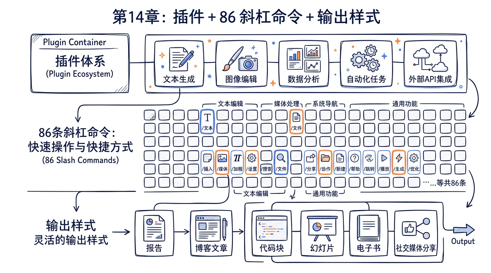
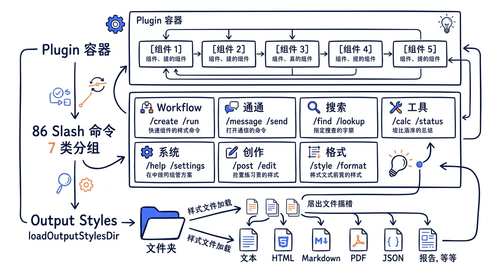
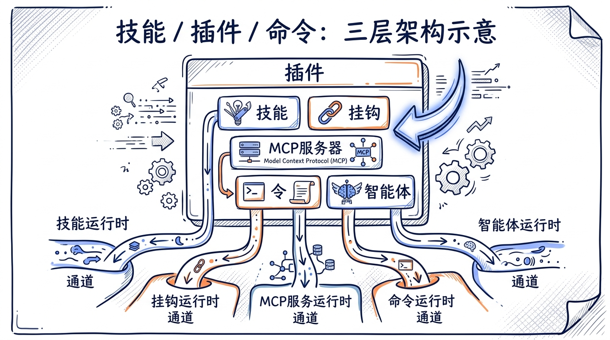
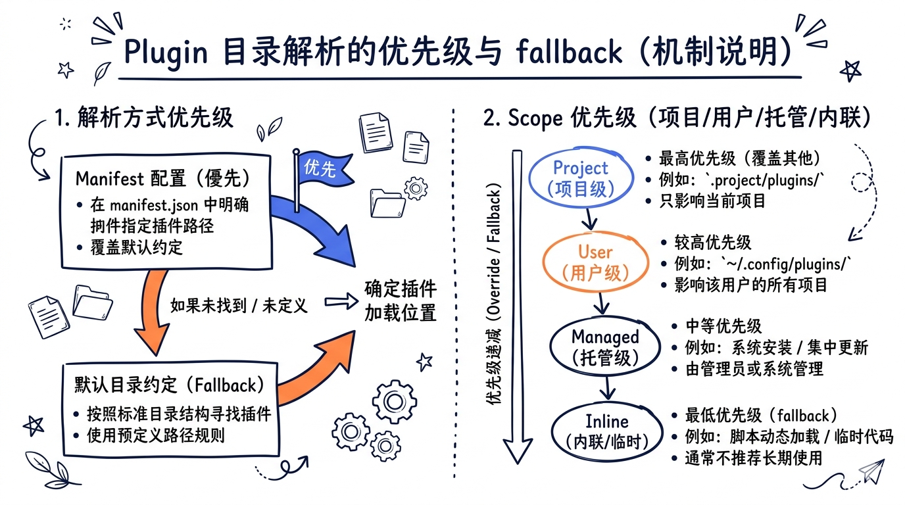
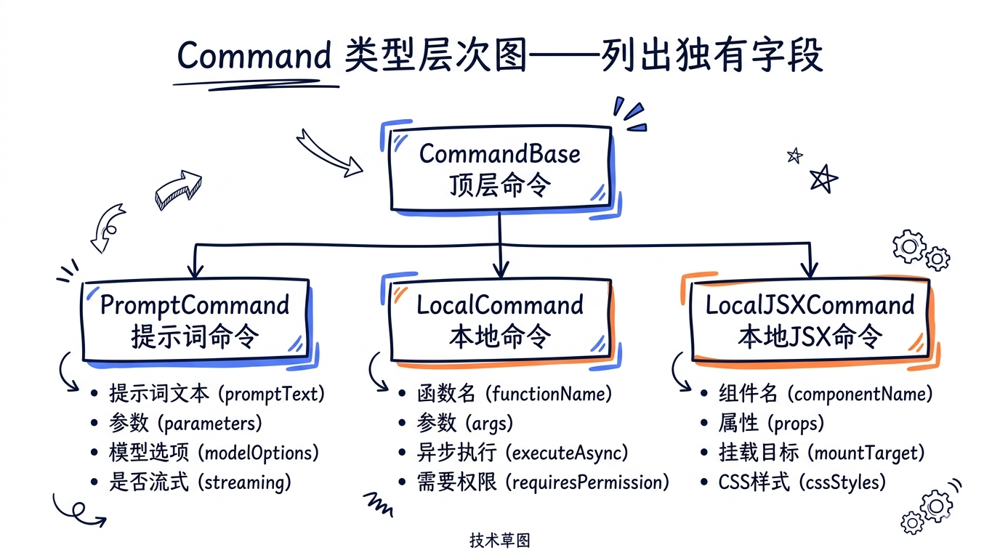
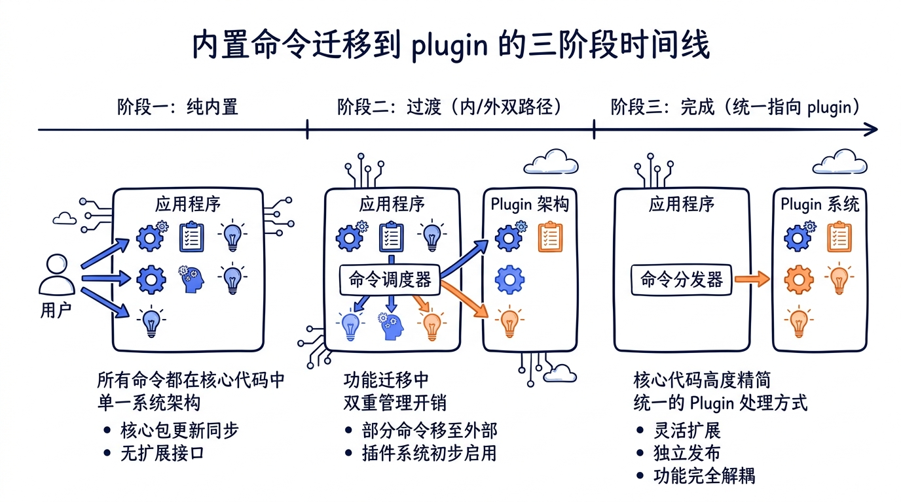
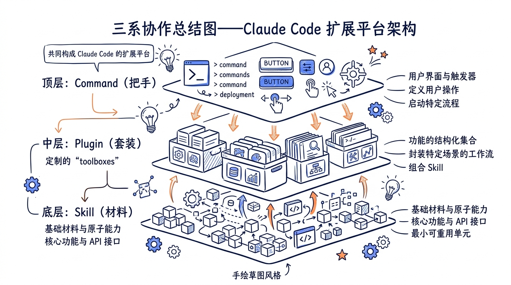

---
layout: default
title: "14 Plugins 与 Slash Commands"
nav_order: 52
parent: "模块五：扩展生态"
---


# 第十四章 Plugins 与 Slash Commands——可分发的能力包与统一调用接口



> **核心命题**：第十三章我们看到了 Skill 是 Claude Code 扩展体系的最小单元，它本质上是一段带元数据的 Markdown prompt。但如果只有 Skill，问题立刻浮现——Skill 是孤立的，它没有版本号、没有依赖、没有 Hooks 配置、没有自带的 MCP server。如果想要分发一组协作的能力（比如"前端开发套件"=10 个相关 Skill + 一组 Hooks + 一个 Figma MCP server），怎么办？答案是 **Plugin**——把 Skills、Hooks、MCP servers、命令、agents、output styles 打包在一起的"完整功能包"。理解 Plugin、Slash Command、Output Style 三者的协作关系，就理解了 Claude Code 如何从一个固定功能的 CLI 演进成一个可分发的扩展平台。



---

## 14.1 Plugin 系统设计哲学：为什么 Skill 不够用

在第十三章，我们详细分析了 Skill 体系——`SKILL.md` 文件加 frontmatter，加上 `loadSkillsDir.ts` 的六种来源加载（`policySettings` / `userSettings` / `projectSettings` / `bundled` / `commandDir` / `mcp`）。Skill 系统已经足够强大，可以让用户和企业管理员自定义 Claude 的行为模板。

那么为什么还需要 Plugin？

### 14.1.1 Skill 的天花板

Skill 解决的是"如何把一段 prompt + 工具白名单注入到对话上下文"的问题。它有三个固有的边界：

1. **粒度只到单文件**。一个 Skill 是一个 Markdown 文件，元数据放在 frontmatter 里。如果某个能力需要 10 个相互协作的 Skill，用户必须手动把这 10 个文件复制到 `~/.claude/skills/` 下。
2. **没有版本与依赖**。Skill 没有 `version` 字段（即使写了也不会被验证），更不用说 `dependencies`。如果 Skill A 的某次升级修改了它依赖的某个共享 prompt 片段的格式，没有任何机制能保护下游 Skill B 不被破坏。
3. **不能携带"非 Skill"组件**。Skill 不能自带 Hooks（它在 frontmatter 里只能引用，不能定义）、不能自带 MCP server 配置、不能自带 output style。这些"配套设施"必须由用户自己单独配置。

简单说，Skill 是"指令注入的最小单元"，但它不是"分发与协作的最小单元"。

### 14.1.2 Plugin 的边界——一个完整功能包

Plugin 是 Claude Code 的"分发与协作单元"。一个 Plugin 至少包含一个 `plugin.json` manifest，可以同时携带以下五种组件：

| 组件 | 子目录 | 角色 |
|---|---|---|
| Commands | `commands/` | 自定义 Slash Command（Markdown 形式） |
| Agents | `agents/` | 自定义 Sub-agent 角色 |
| Skills | `skills/` | 标准 Skill 文件 |
| Hooks | `hooks/hooks.json` | 生命周期钩子 |
| MCP servers | `plugin.json#mcpServers` | 内嵌 MCP server 配置 |
| Output styles | `output-styles/` | Markdown 渲染样式 |

源码里这一点写得很清楚。`src/utils/plugins/pluginLoader.ts:14-25` 的注释直接列了目录结构示例：

```
my-plugin/
├── plugin.json          # Optional manifest with metadata
├── commands/            # Custom slash commands
│   ├── build.md
│   └── deploy.md
├── agents/              # Custom AI agents
│   └── test-runner.md
└── hooks/               # Hook configurations
    └── hooks.json       # Hook definitions
```

注意 Plugin 是"组件容器"，它本身没有"主入口"——加载器会同时扫描 `commands/` `agents/` `skills/` `hooks/` 等子目录，把里面的内容**分别**注册到对应的子系统去。一个 Plugin 不是一个对象，而是 5 个子系统的"批量注入"。

### 14.1.3 Skill / Plugin / Command 三系定位

为了避免后面章节混淆，先把三个概念的边界用一张表钉死：

| 维度 | Skill | Plugin | Slash Command |
|---|---|---|---|
| 物理形态 | 一个 `SKILL.md` 文件 | 一个目录（含 `plugin.json`） | 内置：一个 TS 模块；Plugin 提供：`commands/*.md` |
| 单位 | 单个 prompt 模板 | 一组组件（含多 Skill） | 单个调用接口 |
| 分发 | 直接复制文件 | marketplace + git URL | 跟随 Plugin 分发或直接内置 |
| 版本 | frontmatter 里可写 `version`（不强制） | manifest 里有 `version`（参与依赖解析） | 跟随 Plugin |
| 调用入口 | 模型通过 SkillTool 调用，或用户 `/skill-name` | 用户通过 `/plugin` UI 管理，不直接"调用" | 用户输入 `/cmd`，或模型 SkillTool 调用 |
| 来源数量 | 6 种（参见 13.3） | 4 种 scope（user/project/local/managed） | 内置 86 个 + Plugin 提供 |

一句话总结：**Plugin 是 Skill / Command / Hook / MCP server 的容器与分发机制**，而 **Slash Command 是所有"可调用"扩展的统一接口**。Plugin 自己不直接"运行"，它只负责把内容贡献给相应的子系统。



### 14.1.4 内置 Plugin Registry 与 bundled skills 的边界

源码里有一个容易让人困惑的细节：`src/plugins/builtinPlugins.ts` 和 `src/skills/bundled/` 看起来都"内置"，它们的关系是什么？

`src/plugins/builtinPlugins.ts:6-13` 在文件头注释里直接给了答案：

```typescript
/**
 * Built-in plugins differ from bundled skills (src/skills/bundled/) in that:
 * - They appear in the /plugin UI under a "Built-in" section
 * - Users can enable/disable them (persisted to user settings)
 * - They can provide multiple components (skills, hooks, MCP servers)
 */
```

简而言之：

- **bundled skill** = 内置 skill 单元，**不可被禁用**（如 `verify`、`debug`、`remember`），共 17 个文件（16 个 skill + 1 个 index）。
- **built-in plugin** = 容器化的内置组件包，**可被用户禁用**，会出现在 `/plugin` UI。

而当前 v2.1.88 的状态是：built-in plugin **registry 存在但是空的**。`src/plugins/bundled/index.ts` 只有 23 行，整个文件就是一个空壳：

```typescript
export function initBuiltinPlugins(): void {
  // No built-in plugins registered yet — this is the scaffolding for
  // migrating bundled skills that should be user-toggleable.
}
```

这是一个"装载入口已就位但内部尚无注册项"的状态——这也是为什么权威数字表里写"**0 个 bundled plugin** + 1 个 bundled plugin index 装载入口"。这个空壳的存在本身就是一种设计——它是为未来的"用户可禁用 bundled 能力"留出的迁移路径。

### 14.1.5 设计哲学小结

Plugin 系统的设计哲学可以归纳为三个原则：

1. **打包不绑定**：Plugin 是分发单位，但运行时不存在"Plugin 这个对象"——它的内容会散到 Skills/Commands/Hooks/MCP/OutputStyles 五个子系统各自处理。这避免了"Plugin 内核"成为 monolithic API。
2. **声明式优先**：Plugin 的所有元数据通过 `plugin.json` 和子目录约定声明，没有运行时初始化代码（不需要 plugin 写"激活函数"）。这让 Plugin 可以在不执行任何代码的前提下被静态分析、缓存、签名校验。
3. **Marketplace 驱动**：Plugin 不通过 npm 直接分发，而是通过 marketplace（一个声明了一组 plugin 来源的 JSON 配置）。`plugin@marketplace` 形式的 ID 让"plugin 的真实位置"可以由用户切换的 marketplace 决定。

下一节我们就深入 Plugin 的生命周期，看看一个 Plugin 从被声明到出现在运行时调用栈的全过程。

---

## 14.2 Plugin 生命周期：从安装到激活

Plugin 不是被"导入"的——它没有 `require()` 入口。Plugin 是被"扫描、加载、注入"的。理解这个生命周期对理解为什么 `/reload-plugins` 是必要的至关重要。

### 14.2.1 五个状态阶段

源码把 Plugin 的生命周期划分为五个阶段：

| 阶段 | 触发时机 | 关键文件 |
|---|---|---|
| **install** | 用户 `/plugin` 安装、或启动时 reconcile | `src/utils/plugins/pluginInstallationHelpers.ts`、`src/services/plugins/PluginInstallationManager.ts` |
| **load** | 启动时 / `/reload-plugins` | `src/utils/plugins/pluginLoader.ts` (`loadAllPlugins()`) |
| **activate** | 加载后立即 | `src/hooks/useManagePlugins.ts` |
| **deactivate** | 用户禁用、settings 变更 | `src/utils/plugins/refresh.ts` (`refreshActivePlugins()`) |
| **uninstall** | 用户主动卸载 / 被 blocklist | `src/utils/plugins/installedPluginsManager.ts`、`src/utils/plugins/pluginBlocklist.ts` |

### 14.2.2 install 阶段——marketplace reconcile

启动时，Claude Code 不会主动去检查每个 plugin 是否已安装。它走的是一条更精巧的路径——**marketplace reconcile**。`src/services/plugins/PluginInstallationManager.ts:60-93` 是核心入口：

```typescript
export async function performBackgroundPluginInstallations(
  setAppState: SetAppState,
): Promise<void> {
  logForDebugging('performBackgroundPluginInstallations called')

  try {
    // Compute diff upfront for initial UI status (pending spinners)
    const declared = getDeclaredMarketplaces()
    const materialized = await loadKnownMarketplacesConfig().catch(() => ({}))
    const diff = diffMarketplaces(declared, materialized)

    const pendingNames = [
      ...diff.missing,
      ...diff.sourceChanged.map(c => c.name),
    ]

    setAppState(prev => ({
      ...prev,
      plugins: {
        ...prev.plugins,
        installationStatus: {
          marketplaces: pendingNames.map(name => ({
            name,
            status: 'pending' as const,
          })),
          plugins: [],
        },
      },
    }))

    if (pendingNames.length === 0) {
      return
    }
    // ...继续 reconcile
  }
}
```

注意几个关键设计：

1. **declared vs materialized 的 diff**：`declared` 来自 settings（用户/项目/管理员声明要哪些 marketplace），`materialized` 来自磁盘缓存。两者求 diff 出 `missing`（缺失的）+ `sourceChanged`（URL/branch 改了的）。
2. **后台执行**：`performBackgroundPluginInstallations` 是一个**不阻塞启动**的后台任务。REPL 已经可以交互，plugin 安装在后面悄悄进行。这个设计避免了"启动时卡在 git clone 100 个 marketplace"的最坏情况。
3. **进度通过 setAppState 推回 UI**：`pending` → `installing` → `installed` / `failed`，状态变化通过 React 状态推回 REPL 的状态条。

### 14.2.3 load 阶段——loadAllPlugins

加载阶段集中在 `src/utils/plugins/pluginLoader.ts`。这个文件足足有 30+ 个导出函数，但核心入口只有一个 `loadAllPlugins()`。它做四件事：

1. **遍历所有声明的 plugin scope**：user / project / local（CLI flag）/ managed（企业策略）。
2. **对每个 plugin 解析 `plugin.json` manifest**：用 zod schema 校验。
3. **按子目录扫描组件**：`commands/` / `agents/` / `skills/` / `hooks/` / `output-styles/`。
4. **构造 LoadedPlugin 对象**：包含元数据 + 各子目录的解析路径。

`LoadedPlugin` 类型在 `src/types/plugin.ts:48-70` 定义：

```typescript
export type LoadedPlugin = {
  name: string
  manifest: PluginManifest
  path: string
  source: string
  repository: string
  enabled?: boolean
  isBuiltin?: boolean
  sha?: string
  commandsPath?: string
  commandsPaths?: string[]
  commandsMetadata?: Record<string, CommandMetadata>
  agentsPath?: string
  agentsPaths?: string[]
  skillsPath?: string
  skillsPaths?: string[]
  outputStylesPath?: string
  outputStylesPaths?: string[]
  hooksConfig?: HooksSettings
  mcpServers?: Record<string, McpServerConfig>
  lspServers?: Record<string, LspServerConfig>
  settings?: Record<string, unknown>
}
```

注意每种组件都有 `*Path` 和 `*Paths`（plural）两个字段——这是为了支持 manifest 里声明的"额外路径"（即一个 plugin 可以让 commands 同时来自 `commands/` 和 `extra-cmds/` 两个目录）。

### 14.2.4 activate 阶段——useManagePlugins

加载完成的 LoadedPlugin 还需要被"激活"——也就是把它的内容真正注入到对应的子系统。这个角色由 React hook `src/hooks/useManagePlugins.ts` 承担。挑核心一段看：

```typescript
// src/hooks/useManagePlugins.ts:51-110

const initialPluginLoad = useCallback(async () => {
  try {
    // Load all plugins - capture errors array
    const { enabled, disabled, errors } = await loadAllPlugins()

    // Detect delisted plugins, auto-uninstall them, and record as flagged.
    await detectAndUninstallDelistedPlugins()

    // Notify if there are flagged plugins pending dismissal
    const flagged = getFlaggedPlugins()
    if (Object.keys(flagged).length > 0) {
      addNotification({
        key: 'plugin-delisted-flagged',
        text: 'Plugins flagged. Check /plugins',
        color: 'warning',
        priority: 'high',
      })
    }

    let commands: Command[] = []
    let agents: AgentDefinition[] = []

    try {
      commands = await getPluginCommands()
    } catch (error) {
      // ...错误收集到 errors[]
    }

    try {
      agents = await loadPluginAgents()
    } catch (error) {
      // ...
    }

    try {
      await loadPluginHooks()
    } catch (error) {
      // ...
    }

    // ...继续：MCP server / LSP server 加载
  }
})
```

关键点：

1. **错误隔离**：每种组件的加载失败都被局部 try/catch，不会让一个坏 plugin 把整个 Claude Code 拉崩。错误统一汇总到 `errors[]`，最终展示在 `/doctor` 输出里。
2. **delisted 检测**：每次启动会检查"该 plugin 是否被官方下架"——这是 plugin 系统的安全机制（在 14.9 详述）。
3. **MCP server 计数**：MCP server 的 connection key 会因为 plugin 列表变化而变化，触发 MCP 子系统重连，所以这里要单独维护 `mcp_count`。

### 14.2.5 deactivate / refresh 阶段

用户在 `/plugin` UI 切换某个 plugin 的启用状态后，不需要重启 Claude Code——`refreshActivePlugins()` 会处理在线刷新。`/reload-plugins` 命令的实现就是直接调用这个函数，源码 `src/commands/reload-plugins/reload-plugins.ts:36-58`：

```typescript
const r = await refreshActivePlugins(context.setAppState)

const parts = [
  n(r.enabled_count, 'plugin'),
  n(r.command_count, 'skill'),
  n(r.agent_count, 'agent'),
  n(r.hook_count, 'hook'),
  n(r.mcp_count, 'plugin MCP server'),
  n(r.lsp_count, 'plugin LSP server'),
]
let msg = `Reloaded: ${parts.join(' · ')}`

if (r.error_count > 0) {
  msg += `\n${n(r.error_count, 'error')} during load. Run /doctor for details.`
}

return { type: 'text', value: msg }
```

`refreshActivePlugins` 内部的关键操作：

1. 清空 plugin 相关的 memoize 缓存（`clearPluginCache`、`clearPluginCommandCache`、`clearPluginSkillsCache`）。
2. 重新读 settings（包括 settingsSync 拉回的远端配置）。
3. 重新跑一次 `loadAllPlugins`。
4. 把 commands / agents / hooks / MCP / LSP 五类组件**全量替换**到 AppState。

这个"全量替换"是 plugin 系统的核心一致性保证——它让 plugin 状态在任何时刻都是一个原子快照，不会出现"半启用"的中间态。

### 14.2.6 uninstall 阶段

用户主动卸载（`/plugin uninstall`）走 `installedPluginsManager.ts` 的 `uninstallPlugin()`：从 settings 里移除条目，从磁盘缓存里删除目录，触发 `refreshActivePlugins`。

而**被动卸载**（即 plugin 被 marketplace 下架）走 `pluginBlocklist.ts` 的 `detectAndUninstallDelistedPlugins()`——它会查询官方 blocklist，把已被下架的 plugin 静默卸载，并标记 flag 给用户在 `/plugins` 里看到。


---

## 14.3 bundled plugin 装载入口与 plugin 目录解析

上一节我们梳理了 plugin 的生命周期，这一节我们深入"plugin 是怎么从磁盘上被读出来的"——也就是 `plugin.json` 与目录结构的解析逻辑。

### 14.3.1 bundled/index.ts 的"装载入口"性质

先回到 `src/plugins/bundled/index.ts`。前面 14.1.4 提过它是一个空壳——但要理解为什么它依然是"装载入口"，需要看完整的 23 行：

```typescript
/**
 * Built-in Plugin Initialization
 *
 * Initializes built-in plugins that ship with the CLI and appear in the
 * /plugin UI for users to enable/disable.
 *
 * Not all bundled features should be built-in plugins — use this for
 * features that users should be able to explicitly enable/disable. For
 * features with complex setup or automatic-enabling logic (e.g.
 * claude-in-chrome), use src/skills/bundled/ instead.
 *
 * To add a new built-in plugin:
 * 1. Import registerBuiltinPlugin from '../builtinPlugins.js'
 * 2. Call registerBuiltinPlugin() with the plugin definition here
 */

/**
 * Initialize built-in plugins. Called during CLI startup.
 */
export function initBuiltinPlugins(): void {
  // No built-in plugins registered yet — this is the scaffolding for
  // migrating bundled skills that should be user-toggleable.
}
```

这个"空函数"的存在揭示了一个设计意图——**保留向后兼容的 API**。`initBuiltinPlugins()` 在 CLI 启动序列里被调用：未来无论是"把 verify skill 升格为可禁用 plugin"，还是"加一个 anthropic-managed-suite plugin"，都不需要修改启动序列，只需要在这个函数里新增 `registerBuiltinPlugin(...)` 调用。

权威数字表里写的"0 个 bundled plugin + 1 个装载入口"指的就是这个状态：**注册槽位是 1 个，注册项目数是 0 个**。

### 14.3.2 用户级 plugin 目录

用户级 plugin 安装后位于 `~/.claude/plugins/` 下。完整布局是：

```
~/.claude/
├── plugins/
│   ├── known_marketplaces.json    # 用户声明的 marketplace 列表
│   ├── marketplaces/              # marketplace 定义缓存
│   │   ├── my-marketplace.json
│   │   └── github-marketplace/
│   │       └── .claude-plugin/
│   │           └── marketplace.json
│   └── installed/
│       └── my-plugin@my-marketplace/
│           ├── plugin.json
│           ├── commands/
│           │   └── deploy.md
│           ├── skills/
│           │   └── my-skill/
│           │       └── SKILL.md
│           └── hooks/
│               └── hooks.json
```

`src/utils/plugins/marketplaceManager.ts:1-19` 的注释完整描述了这一布局：

```
File structure managed by this module:
~/.claude/
  └── plugins/
      ├── known_marketplaces.json    # Configuration of all known marketplaces
      └── marketplaces/              # Cache directory for marketplace data
          ├── my-marketplace.json    # Cached marketplace from URL source
          └── github-marketplace/    # Cloned repository for GitHub source
              └── .claude-plugin/
                  └── marketplace.json
```

注意几个关键约定：

1. **plugin ID 是 `name@marketplace` 形式**。`isBuiltinPluginId` 在 `src/plugins/builtinPlugins.ts:37-39` 直接用后缀 `@builtin` 判断是否内置：

   ```typescript
   export function isBuiltinPluginId(pluginId: string): boolean {
     return pluginId.endsWith(`@${BUILTIN_MARKETPLACE_NAME}`)
   }
   ```

2. **目录命名包含 marketplace**。即使两个 marketplace 都提供了一个名叫 `formatter` 的 plugin，它们也会被装到 `formatter@marketplace-a/` 和 `formatter@marketplace-b/` 两个不同目录，避免冲突。

3. **`.claude-plugin/marketplace.json` 是 marketplace 自身的 manifest**，不要和 `plugin.json`（plugin 自身的 manifest）搞混。

### 14.3.3 项目级 plugin 目录

项目级 plugin 的位置是 `<project>/.claude/plugins/`。它的优先级**高于**用户级 plugin（即同名 plugin，项目级覆盖用户级）。这一点和 settings 体系一致——越接近调用现场，越优先。

项目级和用户级的 plugin 走完全相同的加载流程，唯一差别是 `LoadedPlugin.source` 字段值：

- 用户级 → `source: 'userSettings'`（更准确说是 `${pluginName}@${marketplaceName}`）
- 项目级 → `source: 'projectSettings'`

### 14.3.4 inline plugin 与 --plugin-dir

除了 marketplace 安装的 plugin，Claude Code 还支持两种"非 marketplace"plugin：

1. **`--plugin-dir <path>` CLI flag**：临时加载某个本地目录作为 plugin（开发场景）。
2. **SDK `plugins` 选项**：通过 SDK 调用时直接传入 plugin 配置。

这两种统称 "inline plugin"。`src/utils/plugins/pluginLoader.ts:49` 引入它们：

```typescript
import { getInlinePlugins } from '../../bootstrap/state.js'
```

加载时它们与 marketplace plugin 走相同的子目录扫描逻辑，但**不会被持久化到 `installed_plugins.json`**——下次启动需要再次传入 `--plugin-dir`。

### 14.3.5 manifest 验证：plugin.json schema

每个 plugin 的根目录都可以放一个 `plugin.json`。它的 schema 定义在 `src/utils/plugins/schemas.ts`，核心字段包括：

| 字段 | 类型 | 用途 |
|---|---|---|
| `name` | string | plugin 名（必须） |
| `version` | string | semver 版本 |
| `description` | string | UI 展示用 |
| `author` | object/string | 作者信息 |
| `commands` | string \| array \| object | 自定义 commands 路径 |
| `agents` | string \| array | 自定义 agents 路径 |
| `skills` | string \| array | skills 路径 |
| `outputStyles` | string \| array | output styles 路径 |
| `hooks` | string \| object | hooks 路径或内联定义 |
| `mcpServers` | object | 内嵌 MCP server 配置 |

注意 `commands` 字段支持三种形式：

- **string**：单个目录路径（如 `"commands"`）
- **array**：多个目录路径
- **object**：name → metadata 映射（用于给 commands 加描述、标签等）

object 形式让 manifest 可以为命令提供"额外元数据"——这就是 `LoadedPlugin.commandsMetadata` 字段的来源（`src/types/plugin.ts:59`）：

```typescript
commandsMetadata?: Record<string, CommandMetadata>
```

### 14.3.6 plugin.json 没有时的 fallback

如果一个 plugin 目录里**没有** `plugin.json`，loader 不会报错，而是用一组默认约定：

- `name` = 目录名
- `commands` = `commands/`（如果目录存在）
- `agents` = `agents/`（如果目录存在）
- `skills` = `skills/`（如果目录存在）
- `hooks` = `hooks/hooks.json`（如果文件存在）

这个"零配置 plugin"模式让用户可以最快速地把一个本地目录当 plugin 使用——只要目录结构对，连 manifest 都不用写。



---

## 14.4 86 个 Slash Commands 完整目录与分类

`src/commands/` 目录下有 86 个 slash command 子目录（不计 `*.ts` 直接定义的若干命令），它们构成了 Claude Code 内置命令的全集。这一节我们按教学口径分成 7 大类，给出每类的代表命令、源码路径，并深入讲解 5-8 个最常用命令的实现。

### 14.4.1 7 类分组速查表

| 类别 | 数量 | 代表命令 | 关键路径 |
|---|---|---|---|
| 会话与流程 | 18 | `clear` `resume` `exit` `session` `share` `summary` `rewind` | `src/commands/clear/`、`src/commands/resume/` |
| 配置与环境 | 12 | `config` `env` `theme` `statusline` `output-style` `vim` `keybindings` | `src/commands/config/`、`src/commands/output-style/` |
| 网络与远程 | 10 | `bridge` `mobile` `desktop` `remote-env` `remote-setup` `teleport` | `src/commands/bridge/`、`src/commands/teleport/` |
| 开发工作流 | 15 | `commit` `branch` `diff` `pr_comments` `review` `autofix-pr` | `src/commands/commit.ts`、`src/commands/review.ts` |
| 调试与诊断 | 10 | `debug-tool-call` `doctor` `perf-issue` `sandbox-toggle` `heapdump` | `src/commands/doctor/`、`src/commands/debug-tool-call/` |
| 安装与认证 | 8 | `install-github-app` `install-slack-app` `login` `logout` `oauth-refresh` | `src/commands/login/`、`src/commands/install-github-app/` |
| 其他工具类 | 13 | `model` `version` `plan` `plugin` `agents` `skills` | `src/commands/plan/`、`src/commands/plugin/` |
| **合计** | **86** | | |

七类合计 86 个命令，与权威数字表一致。注意这是 v2.1.88 的快照——具体某个命令在不同 build target（如 `USER_TYPE === 'ant'` vs 外部用户、`feature('VOICE_MODE')` vs 否）下可能被裁掉，运行时实际可见的命令数因人而异。

### 14.4.2 命令的目录结构典型样貌

86 个命令在源码里有两种主要组织形式：

**Form A：单文件命令**（约 12 个）
直接在 `src/commands/` 下一个 `.ts` 文件，如 `commit.ts`、`review.ts`、`version.ts`。适合不需要 React 组件的简单 prompt 命令或纯 local 命令。

**Form B：目录命令**（约 74 个）
一个子目录，至少包含 `index.ts`。复杂命令还会有更多文件：

```
src/commands/plugin/
├── index.tsx            # Command 对象导出
├── plugin.tsx           # 主 React 组件
├── parseArgs.ts         # 参数解析
├── usePagination.ts     # 自定义 hook
├── AddMarketplace.tsx
├── BrowseMarketplace.tsx
├── DiscoverPlugins.tsx
├── ManageMarketplaces.tsx
├── ManagePlugins.tsx
├── PluginErrors.tsx
├── PluginOptionsDialog.tsx
├── PluginOptionsFlow.tsx
├── PluginSettings.tsx
├── PluginTrustWarning.tsx
├── UnifiedInstalledCell.tsx
├── ValidatePlugin.tsx
├── pluginDetailsHelpers.tsx
└── ...
```

可以看到 `/plugin` 命令实际上是一个完整的 Ink 应用——18 个 tsx 文件分别对应不同的 UI 状态（添加 marketplace、浏览 plugin、解决冲突、信任警告等）。这种规模在 86 个命令里属于"复杂派"，但说明了一件事：**Slash Command 不是简单的"prompt 拼接"**，它可以承载完整的交互式 UI。

### 14.4.3 重点命令深读：`/commit`

`/commit` 是最简单也最常用的 prompt 类型命令，源码 `src/commands/commit.ts` 共 92 行。它的核心是 `getPromptForCommand` 把"动态拼接的 prompt"返回给模型：

```typescript
// src/commands/commit.ts:6-10

const ALLOWED_TOOLS = [
  'Bash(git add:*)',
  'Bash(git status:*)',
  'Bash(git commit:*)',
]
```

注意这里的 `allowedTools` 模式——它**不允许** `git push`、不允许 `git rebase`、不允许 `git reset`。`/commit` 命令只是"提交当前改动"，所以它通过白名单把模型的能力刚好限制到这一个动作。

主体逻辑在 `getPromptContent()` 里拼一段 markdown，里面用 `!\`...\`` 反引号语法插入 git 命令的输出（这是 Claude Code 的"prompt 内嵌 shell"约定）：

```typescript
// src/commands/commit.ts:20-26

return `${prefix}## Context

- Current git status: !\`git status\`
- Current git diff (staged and unstaged changes): !\`git diff HEAD\`
- Current branch: !\`git branch --show-current\`
- Recent commits: !\`git log --oneline -10\`
```

`!\`<cmd>\`` 会在 prompt 注入前被 `executeShellCommandsInPrompt` 解析为真实的 shell 输出。这就是为什么 `/commit` 不需要写"先跑 git status，然后跑 git diff"——因为 prompt 模板已经把所有上下文准备好交给模型。

最后 `getPromptForCommand` 包了一层"自动放行"：

```typescript
// src/commands/commit.ts:65-88

async getPromptForCommand(_args, context) {
  const promptContent = getPromptContent()
  const finalContent = await executeShellCommandsInPrompt(
    promptContent,
    {
      ...context,
      getAppState() {
        const appState = context.getAppState()
        return {
          ...appState,
          toolPermissionContext: {
            ...appState.toolPermissionContext,
            alwaysAllowRules: {
              ...appState.toolPermissionContext.alwaysAllowRules,
              command: ALLOWED_TOOLS,
            },
          },
        }
      },
    },
    '/commit',
  )

  return [{ type: 'text', text: finalContent }]
}
```

注意 `alwaysAllowRules.command: ALLOWED_TOOLS` —— 命令在执行期间**临时**放宽了权限白名单，让 `git add/status/commit` 不再触发交互式询问。这是 prompt 类命令的一个常见模式——"我知道我自己要让模型干什么，所以这些工具调用免询问"。

### 14.4.4 重点命令深读：`/resume`

`/resume` 命令负责"恢复之前的会话"，是最复杂的"local-jsx"类型命令之一。`src/commands/resume/` 目录有近 20 个文件，核心是把已落盘的会话日志（`~/.claude/projects/<project-hash>/<session>.jsonl`）反序列化回内存，重建消息列表与工具调用上下文。

它在 `src/commands.ts` 里被声明为**非内部命令**（即外部用户也能用），但又被列入 `INTERNAL_ONLY_COMMANDS` 中的几个相关命令（如 `share`、`summary`、`teleport`）共用 `ResumeEntrypoint` 类型：

```typescript
// src/types/command.ts:100-105

export type ResumeEntrypoint =
  | 'cli_flag'
  | 'slash_command_picker'
  | 'slash_command_session_id'
  | 'slash_command_title'
  | 'fork'
```

5 种入口对应 5 条恢复路径——CLI 的 `--resume`、用户在 `/resume` UI 里挑选、用户输入 session ID、用户输入会话标题、Fork sub-agent。每条路径有不同的解析逻辑，但最终都会汇入 `LocalJSXCommandContext.resume()`：

```typescript
// src/types/command.ts:93-98

resume?: (
  sessionId: UUID,
  log: LogOption,
  entrypoint: ResumeEntrypoint,
) => Promise<void>
```

`/resume` 是 Slash Command 系统中"承担最多状态恢复职责"的命令——它必须正确处理 messages 列表、工具状态、permissions、cost tracker、worktree 状态等多个 AppState 切片。

### 14.4.5 重点命令深读：`/config` 与懒加载模式

`/config` 是 `local-jsx` 类型命令的代表，打开 Ink TUI 让用户编辑 settings。它的 `load: () => Promise<LocalJSXCommandModule>` 字段是**懒加载**的关键——`/config` 用了重型组件（颜色选择器、键绑定编辑器），启动时全部 import 会拖慢冷启动。

类似模式在 86 个命令里很普遍。最极端的例子是 `/insights`：实际实现 `src/commands/insights.ts` 是 113KB / 3200 行，`src/commands.ts:189-202` 用一个 13 行的 lazy shim 完全隔离：

```typescript
// insights.ts is 113KB (3200 lines, includes diffLines/html rendering). Lazy
// shim defers the heavy module until /insights is actually invoked.
const usageReport: Command = {
  type: 'prompt',
  name: 'insights',
  description: 'Generate a report analyzing your Claude Code sessions',
  contentLength: 0,
  progressMessage: 'analyzing your sessions',
  source: 'builtin',
  async getPromptForCommand(args, context) {
    const real = (await import('./commands/insights.js')).default
    if (real.type !== 'prompt') throw new Error('unreachable')
    return real.getPromptForCommand(args, context)
  },
}
```

import 只有在 `getPromptForCommand` 被调用时才发生。

### 14.4.6 重点命令深读：`/permissions`

`/permissions` 是配置类命令里逻辑最复杂的之一——它要展示 5 种用户可见权限模式（外加 2 种内部模式），让用户为每个 tool 设置 allow/deny/ask 策略，还要区分 user/project/local/managed 四个 scope。

源码位于 `src/commands/permissions/`，UI 由多个 React 组件构成。它的"展示规则"和"修改写入"是分离的——展示走 `PermissionRulesEditor`，写入走 `updateSettingsForSource`，确保任何修改都被路由到正确的 settings 文件。

### 14.4.7 重点命令深读：`/bridge`

`/bridge` 命令属于"网络与远程"类，它启动一个 Bridge mode（让一台机器作为远程控制目标）。注意它在 `src/commands.ts:73-75` 是 feature flag 控制的：

```typescript
const bridge = feature('BRIDGE_MODE')
  ? require('./commands/bridge/index.js').default
  : null
```

只有 `feature('BRIDGE_MODE')` 为真时才注册。这是 86 个命令中"非全员可见"的典型——它们写在源码里，但运行时是否激活取决于 feature flag、auth state、provider 类型。

### 14.4.8 重点命令深读：`/teleport`

`/teleport` 是"会话漂移"命令——把当前会话从一台机器搬到另一台。`src/commands/teleport/` 目录下有 `bridge.tsx` 和 `index.ts` 两个文件，它依赖 Bridge 子系统进行 cross-device 状态同步。

它和 `/share` `/summary` 一起被列入 `INTERNAL_ONLY_COMMANDS`（`src/commands.ts:243-247`）——这意味着外部用户构建里这些命令会被裁掉。这种"内部命令"的存在，让 Anthropic 团队可以在不影响外部用户体验的前提下，往主分支推自己专用的工具。

### 14.4.9 重点命令深读：`/debug-tool-call`

`/debug-tool-call` 是诊断类的瑞士军刀——它打印工具调用的完整请求/响应，包括 Schema 验证错误、Permission 检查决策、Tool.call() 实际接收到的参数。位于 `src/commands/debug-tool-call/`。

调试场景里它的核心价值是：当模型说"我调用了某个工具但失败了"，开发者用 `/debug-tool-call` 可以精确定位是 Schema 问题、Permission 问题还是 Tool 实现问题。

### 14.4.10 命令分类的设计观察

7 类分组不是源码里写死的，是教学口径反映命令"用途"的功能维度。源码本身只在 `src/commands.ts` 用一个大 `COMMANDS` 数组按字母序展开。但分组揭示了 Slash Command 系统的"使用面"——会话与流程占比最大（18），第二是开发工作流（15）。这种分布跟"40 个工具"的分布形成有趣对比：工具更偏"模型用"，命令更偏"用户用"。


---

## 14.5 Slash Command 类型抽象：Command 接口

86 个命令外加 plugin 提供的若干命令，外加 6 种来源的 skill 命令，最终都汇集到一个 `Command` 联合类型上。理解这个类型系统是理解整个扩展体系的钥匙。

### 14.5.1 三种 Command 子类型

`src/types/command.ts` 把 Command 分为三种：

```typescript
// src/types/command.ts (按代码顺序简化)

export type Command =
  | (PromptCommand & CommandBase)
  | (LocalCommand & CommandBase)
  | (LocalJSXCommand & CommandBase)
```

三类的区别：

| 类型 | 行为 | 典型命令 |
|---|---|---|
| `prompt` | 展开为文本 prompt 发给模型 | `/commit`、`/review`、`/init`、所有 skill |
| `local` | 在本地执行返回文本（不发模型） | `/version`、`/exit`、`/clear`、`/cost` |
| `local-jsx` | 在本地渲染交互式 Ink UI | `/config`、`/permissions`、`/plugin`、`/resume` |

这个三分法有清晰的语义边界：

- **`prompt`** 命令的核心是"准备一段文本上下文"。命令本身不调工具——是模型读取这段文本后再决定要不要调工具。
- **`local`** 命令的核心是"算个值"。它在本地计算结果并返回字符串，整个交互**不经过模型**。
- **`local-jsx`** 命令的核心是"打开 UI"。它启动一个交互式 Ink 组件，用户在 UI 里完成配置后退出。

### 14.5.2 PromptCommand 详细类型

最常见的 `PromptCommand` 类型 `src/types/command.ts:25-57` 完整定义：

```typescript
export type PromptCommand = {
  type: 'prompt'
  progressMessage: string
  contentLength: number // Length of command content in characters (used for token estimation)
  argNames?: string[]
  allowedTools?: string[]
  model?: string
  source: SettingSource | 'builtin' | 'mcp' | 'plugin' | 'bundled'
  pluginInfo?: {
    pluginManifest: PluginManifest
    repository: string
  }
  disableNonInteractive?: boolean
  // Hooks to register when this skill is invoked
  hooks?: HooksSettings
  // Base directory for skill resources (used to set CLAUDE_PLUGIN_ROOT environment variable for skill hooks)
  skillRoot?: string
  // Execution context: 'inline' (default) or 'fork' (run as sub-agent)
  // 'inline' = skill content expands into the current conversation
  // 'fork' = skill runs in a sub-agent with separate context and token budget
  context?: 'inline' | 'fork'
  // Agent type to use when forked (e.g., 'Bash', 'general-purpose')
  // Only applicable when context is 'fork'
  agent?: string
  effort?: EffortValue
  // Glob patterns for file paths this skill applies to
  // When set, the skill is only visible after the model touches matching files
  paths?: string[]
  getPromptForCommand(
    args: string,
    context: ToolUseContext,
  ): Promise<ContentBlockParam[]>
}
```

12 个字段里有几个需要重点理解：

1. **`source`**：标记命令的"权限来源"——`SettingSource`（user/project/policy/local）+ `builtin` + `mcp` + `plugin` + `bundled`。这个字段直接影响命令在 UI 中如何被标注（如 `(plugin)` `(bundled)`）。
2. **`context: 'inline' | 'fork'`**：两种执行模式。inline 把 skill 内容嵌进当前对话；fork 启动 sub-agent，给 skill 一个独立的 token budget 和工具集。这是 Skill 系统的"重量级 vs 轻量级"分水岭。
3. **`paths`**：条件激活——只有当模型最近触碰了匹配 glob 的文件路径时，这个 skill 才会出现在 ToolSearch / SkillTool 的列表里。这避免了上下文里塞进 100 个无关 skill 的元数据。
4. **`getPromptForCommand`**：返回 `ContentBlockParam[]`——可以包含多个文本/图片块，不仅仅是字符串。这给了命令"返回结构化 prompt"的能力。

### 14.5.3 CommandBase 共享字段

`src/types/command.ts:175-216` 定义的 `CommandBase` 是三种 Command 共享的基础字段：

```typescript
export type CommandBase = {
  availability?: CommandAvailability[]
  description: string
  hasUserSpecifiedDescription?: boolean
  isEnabled?: () => boolean
  isHidden?: boolean
  name: string
  aliases?: string[]
  isMcp?: boolean
  argumentHint?: string
  whenToUse?: string
  version?: string
  disableModelInvocation?: boolean
  userInvocable?: boolean
  loadedFrom?:
    | 'commands_DEPRECATED'
    | 'skills'
    | 'plugin'
    | 'managed'
    | 'bundled'
    | 'mcp'
  kind?: 'workflow'
  immediate?: boolean
  isSensitive?: boolean
}
```

13 个字段里几个关键点：

- **`availability`**：命令对哪类用户可见。`'claude-ai'` 表示 claude.ai 订阅用户可见，`'console'` 表示直接 API key 用户可见。这是产品分层的硬性技术边界。
- **`isEnabled`**：运行时动态判断（不同于 `availability` 的静态判断）。常用于 feature flag 集成（如 `() => feature('VOICE_MODE')`）。
- **`disableModelInvocation`** vs **`userInvocable`**：两个独立的开关。前者管"模型能否通过 SkillTool 调"，后者管"用户能否在 REPL 输入 `/cmd` 调"。一个命令可以是仅模型可调（如内部 skill）或仅用户可调（如 `/exit`）。
- **`loadedFrom`**：与 PromptCommand 的 `source` 互为补充——`source` 反映"权限来源"（policy/user/project），`loadedFrom` 反映"加载机制"（commands dir/skills dir/plugin/bundled/mcp）。两者维度不同但常被混用。
- **`isSensitive`**：敏感命令（如 `/login` 输入 token）的输入会从对话历史里被红 redacted，避免日志泄露凭证。

### 14.5.4 命令注册机制：COMMANDS 数组

86 个内置命令的"注册"实际上就是 `src/commands.ts` 里的一个大 import + 一个大数组：

```typescript
// src/commands.ts:258-346

const COMMANDS = memoize((): Command[] => [
  addDir,
  advisor,
  agents,
  branch,
  btw,
  chrome,
  clear,
  // ... 大约 70 个命令
  ...(webCmd ? [webCmd] : []),
  ...(forkCmd ? [forkCmd] : []),
  ...(buddy ? [buddy] : []),
  // ... feature flag 控制的命令
  ...(process.env.USER_TYPE === 'ant' && !process.env.IS_DEMO
    ? INTERNAL_ONLY_COMMANDS
    : []),
])
```

注意三件事：

1. **`memoize`**：数组只构造一次。但回调内的 `feature()` 调用会因为 GrowthBook 的 `_CACHED_MAY_BE_STALE` 而读到当时的快照——所以 feature 的 hot-reload 需要清缓存。
2. **`...(condition ? [cmd] : [])`**：feature flag 与 USER_TYPE 控制的"可选命令"模式。这是 TS 里在数组字面量中插入条件项的标准写法。
3. **`INTERNAL_ONLY_COMMANDS`**：这一组命令（`commit`、`autofixPr`、`bughunter`、`teleport` 等）只在 `USER_TYPE === 'ant'` 且非 demo 时加入——内部团队特供。

### 14.5.5 命令查找：findCommand / hasCommand

用户输入 `/foo` 后，CLI 通过 `src/commands.ts:688-697` 的 `findCommand` 查找匹配：

```typescript
export function findCommand(
  commandName: string,
  commands: Command[],
): Command | undefined {
  return commands.find(
    _ =>
      _.name === commandName ||
      getCommandName(_) === commandName ||
      _.aliases?.includes(commandName),
  )
}
```

三条匹配规则：

1. **`_.name === commandName`**：直接 name 匹配（如 `commit`）
2. **`getCommandName(_) === commandName`**：可能加了前缀的 name（如 plugin 命令是 `pluginName:commandName`）
3. **`_.aliases?.includes(commandName)`**：alias 匹配（少数命令支持别名，如 `/c` → `/clear`）

如果都没匹配上，返回 `undefined`。`getCommand` 在没匹配时直接抛 `ReferenceError`（带可用命令列表），这个错误会被 REPL 捕获并显示给用户。

### 14.5.6 命令的来源标注：formatDescriptionWithSource

UI 上显示命令时来源会被标注。`src/commands.ts:728-754` 的 `formatDescriptionWithSource` 根据 `source` 与 `kind` 字段拼出形如 `(superpowers) Brainstorm features`（plugin）、`Verify (bundled)`、`My skill (user)` 的标签。这种标注让用户在 typeahead 里能立刻区分"这是哪来的命令"——避免内置和自定义命令同名时的歧义。



---

## 14.6 Slash Command 命名约定与 namespace

86 个内置命令外加 plugin 提供的命令外加 skill 命令，命名空间冲突几乎是必然的。Claude Code 的解决方案是**namespace** + **优先级**。

### 14.6.1 命名规则：kebab-case

所有 slash command 名字必须是 kebab-case（小写字母 + 连字符）。这个约定在 schema 校验里被强制。

合法命名示例：

```
/commit
/auto-fix-pr
/install-github-app
/output-style
/debug-tool-call
```

非法命名示例：

```
/Commit          # 大写
/installGitHubApp # camelCase
/install_app     # 下划线
/install.app     # 句点
```

kebab-case 的好处是 URL-safe、文件名 friendly、读起来像短语。

### 14.6.2 Plugin namespace：`pluginName:commandName`

当 plugin 提供命令时，命令的最终调用名加上 plugin 前缀：

```
/superpowers:brainstorm
/gstack:browse
/figma:figma-code-connect
```

这个前缀通过冒号分隔，避免与 kebab-case 内的连字符混淆。在 `src/types/command.ts` 的 `getCommandName()` 函数里，逻辑大致是：

```typescript
function getCommandName(cmd: Command): string {
  if (cmd.source === 'plugin' && cmd.pluginInfo) {
    return `${cmd.pluginInfo.pluginManifest.name}:${cmd.name}`
  }
  return cmd.name
}
```

这意味着同一个 plugin 内的命令**不需要**额外去重——它们天然被 namespace 隔离。两个不同 plugin 都提供 `brainstorm` 命令？没问题，分别变成 `superpowers:brainstorm` 和 `other-plugin:brainstorm`。

### 14.6.3 命名空间分配

完整的命名空间分配：

| 来源 | 命名空间 | 示例 |
|---|---|---|
| 内置 builtin | 无前缀 | `/commit` `/clear` `/config` |
| bundled skill | 无前缀 | `/verify` `/debug` `/remember` |
| user skill | 无前缀 | `/my-skill` |
| project skill | 无前缀 | `/proj-skill` |
| plugin command | `<plugin>:` 前缀 | `/superpowers:brainstorm` |
| plugin skill | `<plugin>:` 前缀 | `/gstack:browse` |
| MCP prompt | `mcp__<server>__` 前缀 | `/mcp__filesystem__list` |

可以看到 plugin 和 MCP 是仅有的两个"强制带前缀"的来源——它们的命令最容易冲突，所以系统直接用前缀做物理隔离。

而 builtin / bundled / user / project 之间共用"无前缀"空间，靠优先级和强制 dedupe 来解决冲突。

### 14.6.4 冲突解决：优先级

当两个命令同名（无前缀的），优先级规则在 `src/commands.ts` 的 `loadAllCommands` 顺序里隐式定义：

```typescript
// src/commands.ts:449-468

const loadAllCommands = memoize(async (cwd: string): Promise<Command[]> => {
  const [
    { skillDirCommands, pluginSkills, bundledSkills, builtinPluginSkills },
    pluginCommands,
    workflowCommands,
  ] = await Promise.all([
    getSkills(cwd),
    getPluginCommands(),
    getWorkflowCommands ? getWorkflowCommands(cwd) : Promise.resolve([]),
  ])

  return [
    ...bundledSkills,
    ...builtinPluginSkills,
    ...skillDirCommands,
    ...workflowCommands,
    ...pluginCommands,
    ...pluginSkills,
    ...COMMANDS(),
  ]
})
```

合并顺序：

```
[bundled, builtinPlugin, skillDir, workflow, plugin, pluginSkill, COMMANDS]
```

**`findCommand` 用 `Array.find`**——它返回第一个匹配的。但这里的"第一个"取决于 typeahead/CLI 调用 `findCommand` 之前对数组做了什么排序。在大多数 UI 路径里，内置命令（COMMANDS）排在最后，但它们的 name 一定是不会和外部 skill 重合的（因为 skill 的 name 不太会取 `commit`、`clear` 这种）。

如果真的发生 "user skill 名叫 commit" 这种事，结果是 user skill 被列在前面，`findCommand` 先命中 skill。这是一个**用户优先于内置**的隐式规则——你确实可以"覆盖" `/commit` 的行为。但这个机制并不是为"覆盖"设计的，而是为"自定义"设计的——如果你写了一个 skill 叫 commit，行为就是你写的那样。

### 14.6.5 dynamic skill 的特殊插入位置

注意 `getCommands` 函数 `src/commands.ts:493-516` 里有一个特殊处理——动态发现的 skill（`paths` 字段触发）插入位置：

```typescript
if (uniqueDynamicSkills.length === 0) {
  return baseCommands
}

// Insert dynamic skills after plugin skills but before built-in commands
const builtInNames = new Set(COMMANDS().map(c => c.name))
const insertIndex = baseCommands.findIndex(c => builtInNames.has(c.name))

if (insertIndex === -1) {
  return [...baseCommands, ...uniqueDynamicSkills]
}

return [
  ...baseCommands.slice(0, insertIndex),
  ...uniqueDynamicSkills,
  ...baseCommands.slice(insertIndex),
]
```

逻辑是：动态 skill 插入在"内置命令组开始之前"。这保证了动态 skill 的优先级高于内置命令，但低于显式声明的 skill/plugin。

### 14.6.6 alias 机制

少数命令通过 `aliases` 字段提供短名：

```typescript
{
  name: 'help',
  aliases: ['?'],
  // ...
}
```

`findCommand` 会在 `_.aliases?.includes(commandName)` 这一步匹配上 alias。但注意 alias **不**走 namespace——plugin 命令的 alias 不会自动加上 plugin 前缀。这意味着 plugin 提供 alias 必须自己确保不冲突。

实践中 alias 用得不多（86 个命令大部分没有），主要用于"硬编码的便利"（如 `/?` → `/help`）。


---

## 14.7 createMovedToPluginCommand 模式：内置命令迁移到 plugin

`src/commands/createMovedToPluginCommand.ts` 是一个 65 行的小文件，但它揭示了一个非常重要的演进机制——**如何把内置命令优雅地迁移到 plugin**。

### 14.7.1 问题背景

Claude Code 在演进过程中，会有这样的需求：某个内置命令（比如假设 `/some-command`）希望被剥离成单独的 plugin。原因可能是：

- 它的依赖（特定 SDK、外部 API、特殊工具）会让 CLI 主体膨胀。
- 它有专门的维护团队。
- 它需要更频繁的迭代，而 CLI 主体的发布节奏是固定的。
- 它属于实验性功能，不希望污染稳定主体。

但直接删除内置命令会破坏向后兼容——已经习惯了 `/some-command` 的用户突然找不到它，会迷茫。

### 14.7.2 解决方案：占位 + 提示

`createMovedToPluginCommand` 的方案是：**保留命令名，但替换实现为"提示用户去装 plugin"的占位**。

完整源码 `src/commands/createMovedToPluginCommand.ts:22-65`：

```typescript
export function createMovedToPluginCommand({
  name,
  description,
  progressMessage,
  pluginName,
  pluginCommand,
  getPromptWhileMarketplaceIsPrivate,
}: Options): Command {
  return {
    type: 'prompt',
    name,
    description,
    progressMessage,
    contentLength: 0, // Dynamic content
    userFacingName() {
      return name
    },
    source: 'builtin',
    async getPromptForCommand(
      args: string,
      context: ToolUseContext,
    ): Promise<ContentBlockParam[]> {
      if (process.env.USER_TYPE === 'ant') {
        return [
          {
            type: 'text',
            text: `This command has been moved to a plugin. Tell the user:

1. To install the plugin, run:
   claude plugin install ${pluginName}@claude-code-marketplace

2. After installation, use /${pluginName}:${pluginCommand} to run this command

3. For more information, see: https://github.com/anthropics/claude-code-marketplace/blob/main/${pluginName}/README.md

Do not attempt to run the command. Simply inform the user about the plugin installation.`,
          },
        ]
      }

      return getPromptWhileMarketplaceIsPrivate(args, context)
    },
  }
}
```

这个工厂函数返回一个 `PromptCommand`，但它的 `getPromptForCommand` 不做任何实际工作——它返回一段告诉模型"通知用户装 plugin"的文本。

### 14.7.3 双重路径设计

注意 `getPromptForCommand` 内部有两条路径：

1. **`USER_TYPE === 'ant'`**：内部用户（marketplace 已经对他们开放），直接返回"装 plugin"的提示文本。
2. **外部用户**：调用 `getPromptWhileMarketplaceIsPrivate`——这是一个**回退实现**，让命令在 marketplace 还没公开时仍然能工作。

这是一个非常巧妙的过渡设计。配合 `Options` 类型 `src/commands/createMovedToPluginCommand.ts:5-20` 的注释看：

```typescript
/**
 * The prompt to use while the marketplace is private.
 * External users will get this prompt. Once the marketplace is public,
 * this parameter and the fallback logic can be removed.
 */
getPromptWhileMarketplaceIsPrivate: (
  args: string,
  context: ToolUseContext,
) => Promise<ContentBlockParam[]>
```

注释明确说："等 marketplace 公开后，这个参数和 fallback 逻辑就可以删除了。"——这是一段标记好"未来可清理"的代码，迁移完成后删除非常清晰。

### 14.7.4 三阶段迁移路径

`createMovedToPluginCommand` 实现了一个**三阶段迁移**：

```
阶段 1：纯内置 → 阶段 2：过渡（内部走 marketplace，外部走 fallback）
       → 阶段 3：完成（统一指向 plugin，删除 fallback）→ 阶段 4：可选移除占位
```

每一步都向后兼容，不会让任何用户突然遭遇 "command not found"。

### 14.7.5 消息内容的精心设计

提示文本的三个设计要点：明确的安装命令（用户复制即可）、指明新调用名 `/<plugin>:<command>`、文档链接。最后一句 `Do not attempt to run the command. Simply inform the user about the plugin installation.` 是给**模型**看的指令，避免模型自作主张去 fallback 执行。

### 14.7.6 与 deprecation 模式的对比

`createMovedToPluginCommand` 与传统的 deprecation 模式有几点不同：

| 维度 | 传统 deprecation | createMovedToPluginCommand |
|---|---|---|
| 命令是否还能用 | 还能用，但有警告 | 不直接执行，转为安装提示 |
| 用户行动 | 不改也行（暂时） | 必须装 plugin 才能继续 |
| 时间窗口 | 长期保留 + 警告 | 短期过渡 + 完全移除 |
| 代码代价 | 永久保留旧实现 | 仅保留占位（几十行） |

迁移到 plugin 的设计选择了**激进**——一旦切换，旧实现整个删掉，主体瘦身。这是 Plugin 系统的核心价值之一：**让主体可以保持精简，复杂功能外挂**。



---

## 14.8 Output Styles 系统

Output Style 是 Claude Code 第三类"用户可定制行为"——它的作用域比 Skill 更窄、比 Plugin 更专——专门控制**模型回复的呈现风格**。

### 14.8.1 Output Style 是什么

Output Style 不影响模型决策、不影响工具调用，只影响输出怎么"长样"。具体说，它会影响：

- Markdown 渲染风格（紧凑 vs 详尽）
- 代码块样式（带行号 vs 不带）
- 列表风格（编号 vs bullet 点）
- 标题层次的展开程度
- 表情/emoji 使用频率
- 某些特定语境的语气（专业 vs 轻松）

形式上，Output Style 是一个 Markdown 文件，frontmatter 声明 name + description，正文是"风格指令 prompt"。这段 prompt 会在每次模型调用时拼接到 system prompt 里，约束模型的输出格式。

典型的 output-style 文件结构：

```
~/.claude/output-styles/
└── concise.md
```

`concise.md` 内容（示意）：

```markdown
---
name: concise
description: 极简风格——直接给答案
keep-coding-instructions: true
---

# 极简风格

输出请遵守：
- 一句话能说清楚的不要分段
- 代码用最少的注释
- 不要总结自己说过的内容
- 删掉所有"让我..."这样的过程描述
```

### 14.8.2 加载机制：loadOutputStylesDir

源码 `src/outputStyles/loadOutputStylesDir.ts` 整个文件 98 行，核心是 `getOutputStyleDirStyles()`——一个 memoize 的异步函数。完整实现：

```typescript
// src/outputStyles/loadOutputStylesDir.ts:26-92

export const getOutputStyleDirStyles = memoize(
  async (cwd: string): Promise<OutputStyleConfig[]> => {
    try {
      const markdownFiles = await loadMarkdownFilesForSubdir(
        'output-styles',
        cwd,
      )

      const styles = markdownFiles
        .map(({ filePath, frontmatter, content, source }) => {
          try {
            const fileName = basename(filePath)
            const styleName = fileName.replace(/\.md$/, '')

            // Get style configuration from frontmatter
            const name = (frontmatter['name'] || styleName) as string
            const description =
              coerceDescriptionToString(
                frontmatter['description'],
                styleName,
              ) ??
              extractDescriptionFromMarkdown(
                content,
                `Custom ${styleName} output style`,
              )

            // Parse keep-coding-instructions flag (supports both boolean and string values)
            const keepCodingInstructionsRaw =
              frontmatter['keep-coding-instructions']
            const keepCodingInstructions =
              keepCodingInstructionsRaw === true ||
              keepCodingInstructionsRaw === 'true'
                ? true
                : keepCodingInstructionsRaw === false ||
                    keepCodingInstructionsRaw === 'false'
                  ? false
                  : undefined

            // Warn if force-for-plugin is set on non-plugin output style
            if (frontmatter['force-for-plugin'] !== undefined) {
              logForDebugging(
                `Output style "${name}" has force-for-plugin set, but this option only applies to plugin output styles. Ignoring.`,
                { level: 'warn' },
              )
            }

            return {
              name,
              description,
              prompt: content.trim(),
              source,
              keepCodingInstructions,
            }
          } catch (error) {
            logError(error)
            return null
          }
        })
        .filter(style => style !== null)

      return styles
    } catch (error) {
      logError(error)
      return []
    }
  },
)
```

逻辑分三步：

1. **`loadMarkdownFilesForSubdir('output-styles', cwd)`**：扫描所有 `output-styles/` 子目录（项目级 + 用户级），返回 `{filePath, frontmatter, content, source}[]`。
2. **map 转换**：每个 markdown 文件转成一个 `OutputStyleConfig` 对象。
3. **filter null**：错误的样式被设为 null，最后过滤掉。

注意它对 `keep-coding-instructions` 的处理——支持 boolean 和字符串两种形式。这是一个常见的 frontmatter 容错设计——用户可能写 `true` 或 `"true"`，都得 work。

### 14.8.3 三层来源与优先级

Output Style 来源覆盖了和 Skill 类似的层级：

| 层级 | 路径 | 优先级 |
|---|---|---|
| 项目级 | `<project>/.claude/output-styles/*.md` | 最高 |
| 用户级 | `~/.claude/output-styles/*.md` | 中 |
| Plugin 级 | `<plugin>/output-styles/*.md` | 单独通道 |

`src/outputStyles/loadOutputStylesDir.ts:11` 的 import 体现了这一点：

```typescript
import { clearPluginOutputStyleCache } from '../utils/plugins/loadPluginOutputStyles.js'
```

Plugin 提供的 output style 走 `src/utils/plugins/loadPluginOutputStyles.ts` 的独立加载路径，但缓存清理时一起清。这是为了让 `/reload-plugins` 既清掉 plugin output style 缓存，又清掉用户/项目级 cache：

```typescript
// src/outputStyles/loadOutputStylesDir.ts:94-98

export function clearOutputStyleCaches(): void {
  getOutputStyleDirStyles.cache?.clear?.()
  loadMarkdownFilesForSubdir.cache?.clear?.()
  clearPluginOutputStyleCache()
}
```

### 14.8.4 OutputStyleConfig 类型

每个加载出来的 output style 是一个 `OutputStyleConfig`：

```typescript
// 简化表示（来自 src/constants/outputStyles.ts）

type OutputStyleConfig = {
  name: string                    // UI 显示名
  description: string             // UI 描述
  prompt: string                  // 注入到 system prompt 的内容
  source: SettingSource           // 来源（user/project/plugin）
  keepCodingInstructions?: boolean // 是否保留 coding 默认指令
}
```

`keepCodingInstructions` 字段最值得讲——它决定是否在用户的 output style 之上**叠加** Claude Code 的内置 coding 指令（如"代码必须遵守..."、"工具调用必须..."）。三种情况：

- `true` 或 `'true'`：保留默认 coding 指令 + 用户 prompt（叠加模式）
- `false` 或 `'false'`：完全替换，只用用户 prompt（独占模式）
- `undefined`：使用默认行为（通常是 true，即叠加）

独占模式（`false`）非常激进——它会让 Claude 失去所有内置 coding 习惯。慎用。

### 14.8.5 与 Ink 渲染层的关系

注意 Output Style 影响的不是 Ink 的"渲染策略"，而是模型生成的 markdown **内容本身**。它通过修改模型行为让输出"看起来不一样"，而不是改变 Claude Code 怎么显示输出。

这一点和 `/theme` 命令形成有趣对比：

| 维度 | Output Style | /theme |
|---|---|---|
| 影响层 | 模型生成内容（prompt 注入） | Ink 渲染颜色（终端层） |
| 持久化 | output-styles/*.md 文件 | settings.json 字段 |
| 范围 | 跨会话、跨 CLI 实例 | 跨会话、跨 CLI 实例 |
| 动态切换 | `/output-style` 命令 | `/theme` 命令 |

两者完全独立，可以叠加使用——你可以同时用 `dark` 主题 + `concise` output style。

### 14.8.6 force-for-plugin 字段

第 65 行有一段警告日志：

```typescript
if (frontmatter['force-for-plugin'] !== undefined) {
  logForDebugging(
    `Output style "${name}" has force-for-plugin set, but this option only applies to plugin output styles. Ignoring.`,
    { level: 'warn' },
  )
}
```

这是一个 Plugin 级 output style 才支持的字段。它的语义是"plugin 强制为它的 skill 应用这个 output style"——也就是说当用户调用某个 plugin 提供的 skill 时，自动切到 plugin 推荐的 output style。

但用户/项目级 output style 写这个字段没意义，所以会被忽略并打 warning。这种"字段误用警告"是源码中很常见的模式——容错但提示。

### 14.8.7 Output Style 的设计哲学

为什么要单独搞一个 Output Style 系统，而不是让用户写一个普通 Skill 来达到同样目的？

答案在于**激活时机**：

- Skill 是"按需触发"——模型决定何时激活、用户决定 `/skill-name` 调用。
- Output Style 是"全局生效"——一旦启用，所有回复都受影响。

如果用 Skill 实现 output style 的效果，需要每次对话开头都调用一次 skill，且 skill 的指令容易被后续工具调用、消息追加给"冲淡"。Output Style 通过直接修改 system prompt，确保影响**贯穿整个会话**。

这就是为什么要把它做成独立系统——它的"挂载点"是 system prompt 本身，而不是 user prompt 流。


---

## 14.9 插件市场与官方注册中心

Plugin 系统的最后一块拼图是**marketplace**——plugin 怎么被发现、被分发、被信任。

### 14.9.1 Plugin Marketplace 的层次

Claude Code 的 plugin marketplace 不是一个集中式服务，而是一个**多源声明**机制。`src/utils/plugins/marketplaceManager.ts:1-19` 的注释把布局描述清楚了：

```
~/.claude/
  └── plugins/
      ├── known_marketplaces.json    # Configuration of all known marketplaces
      └── marketplaces/              # Cache directory for marketplace data
          ├── my-marketplace.json    # Cached marketplace from URL source
          └── github-marketplace/    # Cloned repository for GitHub source
              └── .claude-plugin/
                  └── marketplace.json
```

每个 marketplace 是一个 JSON 文件（或 git 仓库里的 JSON 文件），声明了"这个 marketplace 提供了哪些 plugin"。具体说：

```json
{
  "name": "my-marketplace",
  "plugins": [
    {
      "name": "formatter",
      "description": "...",
      "source": {
        "type": "git",
        "url": "https://github.com/user/formatter-plugin",
        "branch": "main"
      },
      "version": "1.0.0"
    }
  ]
}
```

Plugin 不直接发布——它发布到一个 marketplace，用户安装 marketplace 后才能装这个 plugin。

### 14.9.2 marketplace 的四种 source 类型

marketplace 本身可以来自四种 source：

| Type | 形式 | 示例 |
|---|---|---|
| URL | 远程 JSON | `https://example.com/marketplace.json` |
| Git | 远程仓库 | `https://github.com/anthropics/claude-code-marketplace` |
| NPM | npm 包 | `@anthropic/marketplace` |
| Local | 本地路径 | `/Users/me/my-marketplace.json` |

Git source 是最常见的——marketplace 仓库根目录里放一个 `.claude-plugin/marketplace.json`，clone 下来就能用。

### 14.9.3 known_marketplaces.json：用户的 marketplace 注册表

用户安装 marketplace 后，配置写到 `~/.claude/plugins/known_marketplaces.json`：

```json
{
  "marketplaces": {
    "claude-code-marketplace": {
      "type": "git",
      "url": "https://github.com/anthropics/claude-code-marketplace",
      "branch": "main",
      "lastUpdated": "2026-04-30T...",
      "commitSha": "abc123..."
    }
  }
}
```

`commitSha` 字段是 plugin 系统的"版本钉死"机制——它记录上次成功 reconcile 时仓库的 HEAD SHA。下次启动时如果远端 SHA 没变，可以直接读缓存；变了就重新拉取。

### 14.9.4 plugin 的 ID：name@marketplace

前面 14.3.2 提过，plugin 的全局 ID 是 `name@marketplace` 形式。这个组合是唯一的：

```
formatter@claude-code-marketplace
brainstorm@superpowers
gstack@gstack-marketplace
```

`@` 是分隔符，左边是 plugin name（marketplace 内唯一），右边是 marketplace name（全局唯一）。这种组合 ID 让两件事变得可能：

1. **同名 plugin 来自不同 marketplace 不冲突**：可以同时装 `formatter@market-a` 和 `formatter@market-b`。
2. **统一的引用语法**：用户在 `/plugin install` 时直接 paste `formatter@market-a`，系统就知道去哪个 marketplace 找。

### 14.9.5 Official Registry vs MCP Official Registry

Claude Code 引用了两个 "official registry"：

- **Plugin Official Registry**：`anthropics/claude-code-marketplace`，存放官方维护的 plugin（`bridge`、`agents-platform` 等如果迁移会落到这里）。
- **MCP Official Registry**：MCP 生态的官方 MCP server 列表，参见第十二章。

两者**完全独立**——Plugin Marketplace 不知道 MCP Registry 的存在，反之亦然。它们的关系是：

- 一个 plugin **可以**在 `plugin.json#mcpServers` 里嵌入 MCP server 配置（如内嵌一个 Slack MCP）。
- 一个 MCP server **可以**通过 plugin 分发（用户装一个 plugin 就自动连上某 MCP server）。

但 plugin marketplace 本身**不**充当 MCP 注册中心——它只是 plugin 的注册中心，附带能携带 MCP 配置的能力。

### 14.9.6 信任与下架机制

Plugin 的"信任"在两个层面：

1. **PluginTrustWarning**：用户首次启用某 plugin 时，UI 会弹一个 warning，要求用户确认信任来源。源码 `src/commands/plugin/PluginTrustWarning.tsx`。
2. **Blocklist**：官方维护的下架列表。`src/utils/plugins/pluginBlocklist.ts` 的 `detectAndUninstallDelistedPlugins()` 在每次启动时检查——如果某 plugin 被加入 blocklist，自动卸载并标记 flag 给用户。

`useManagePlugins.ts:56-68` 调用了这个机制：

```typescript
// Detect delisted plugins, auto-uninstall them, and record as flagged.
await detectAndUninstallDelistedPlugins()

// Notify if there are flagged plugins pending dismissal
const flagged = getFlaggedPlugins()
if (Object.keys(flagged).length > 0) {
  addNotification({
    key: 'plugin-delisted-flagged',
    text: 'Plugins flagged. Check /plugins',
    color: 'warning',
    priority: 'high',
  })
}
```

这是一个**防恶意软件**机制——如果某 plugin 被发现做坏事（窃取凭证、破坏文件等），Anthropic 把它加入 blocklist，所有用户的 Claude Code 在启动时静默卸载，并通过 notification 提醒。

### 14.9.7 plugin policy（企业管控）

企业用户可以通过 managed settings 管控 plugin 行为：

- **必装清单**：某些 plugin 必须装、不能禁用。
- **黑名单**：某些 plugin 完全禁止安装。
- **marketplace 限制**：只能从特定 marketplace 安装。

源码 `src/utils/plugins/pluginPolicy.ts` 实现这一逻辑。它在启动时被 `loadAllPlugins` 调用，把企业策略转换为 plugin scope 的过滤器。

### 14.9.8 marketplace UI

`src/commands/plugin/` 提供完整的 marketplace UI：

| 组件 | 用途 |
|---|---|
| `BrowseMarketplace.tsx` | 浏览已安装的 marketplace 内的所有 plugin |
| `AddMarketplace.tsx` | 添加新的 marketplace |
| `ManageMarketplaces.tsx` | 查看/删除/更新已有 marketplace |
| `DiscoverPlugins.tsx` | 发现推荐 plugin |
| `PluginSettings.tsx` | 配置某个 plugin 的运行参数 |
| `PluginOptionsDialog.tsx` | plugin 自定义配置弹窗 |
| `PluginErrors.tsx` | 显示 plugin 加载错误 |
| `ValidatePlugin.tsx` | 验证 plugin 完整性 |

注意 `PluginSettings.tsx`——plugin 自身可以接受配置（比如某个 LLM-based plugin 需要一个 API endpoint）。这些配置存在 `LoadedPlugin.settings` 里，在 plugin 调用时通过环境变量传给 hooks/commands。

<!-- IMAGE: Plugin Marketplace 三层结构——用户的 known_marketplaces.json → 多个 marketplace（git/url/npm/local）→ 每个 marketplace 列出多个 plugin → 每个 plugin 有自己的 source（git/local） -->

---

## 14.10 Skills、Plugins、Commands 三系协作

到这里我们已经分别讲清楚了 Skill（第十三章）、Plugin（14.1-14.3）、Slash Command（14.4-14.7），以及 Output Style（14.8）和 Marketplace（14.9）。最后这一节我们用一个全景视角，把三系的协作关系钉死。

### 14.10.1 三系一图：组件流向

```
   ┌──────────────────────────────────────────────────────────────────┐
   │                        Plugin (容器/分发)                         │
   │  ┌──────────┬──────────┬──────────┬──────────┬─────────────────┐ │
   │  │ commands/│  agents/ │  skills/ │  hooks/  │ output-styles/  │ │
   │  │  *.md    │   *.md   │   *.md   │ hooks.json│      *.md       │ │
   │  └──────────┴──────────┴──────────┴──────────┴─────────────────┘ │
   │  + plugin.json#mcpServers (内嵌 MCP server 配置)                  │
   └──────────────────────────────────────────────────────────────────┘
          │            │            │           │           │
          ▼            ▼            ▼           ▼           ▼
   ┌──────────┐  ┌──────────┐  ┌──────────┐ ┌──────┐  ┌──────────────┐
   │ Slash    │  │ Sub-agent│  │  Skill   │ │ Hook │  │ Output Style │
   │ Command  │  │ Registry │  │ Registry │ │ Sys  │  │   Registry   │
   │ Registry │  │          │  │          │ │      │  │              │
   └──────────┘  └──────────┘  └──────────┘ └──────┘  └──────────────┘
        │             │             │           │           │
        └─────────────┴─────────────┴───────────┴───────────┘
                              │
                              ▼
                    ┌─────────────────┐
                    │  AppState       │
                    │  (运行时单例)     │
                    └─────────────────┘
```

要点：

1. **Plugin 不是运行时实体**——它的内容在 load 时分裂到 5 个子系统的 registry。运行时去查"plugin"基本上是查 5 个 registry 的并集。
2. **5 个 registry 同时被多种来源 contribute**——内置 + plugin + user/project skill dir + MCP server prompt + bundled。
3. **AppState 是统一前端**——所有 UI、命令查找、skill index 都从 AppState 拿数据，而 AppState 是 5 个 registry 的整合视图。

### 14.10.2 三系定位对比表

再用一张表把三系定位拍死：

| 维度 | Skill | Plugin | Slash Command |
|---|---|---|---|
| 是什么 | 一段 markdown prompt | 一个组件容器 | 一个调用接口 |
| 物理形态 | `SKILL.md` 文件 | 目录 + `plugin.json` | TS 模块 / `commands/*.md` |
| 来源数量 | **6 种**（policy/user/project/bundled/commandDir/mcp） | 4 种 scope（user/project/local/managed）| 内置 + plugin + skill + mcp |
| 内置数量 | 17 个 bundled skill 文件（16 + 1 index） | 0 个内置（1 个装载入口） | 86 个内置命令 |
| 加载入口 | `loadSkillsDir.ts` | `pluginLoader.ts` | `commands.ts` 的 COMMANDS 数组 |
| 更新机制 | 文件变更（重启或 reload） | `/reload-plugins` | 重新启动 CLI |
| 用户主调用 | `/skill-name` | `/plugin`（管理 UI） | `/cmd` |
| 模型主调用 | SkillTool / ToolSearch | 不直接调用 | SkillTool（仅 prompt 类型） |
| 命名空间 | 无前缀 | 无（容器） | 内置无前缀 / plugin 用 `:` 前缀 |

这张表是后面遇到 "X 是 Skill 还是 Plugin？" 这种问题时的判别表。

### 14.10.3 加载顺序

完整的加载顺序（从启动到第一次 REPL prompt 出现）：

```
1. CLI 启动 → bootstrap state
2. initBuiltinPlugins()                    // 注册 builtin plugin（目前空）
3. registerBundledSkill() x16              // 注册 17 个内置 skill 文件（含 index）
4. performBackgroundPluginInstallations()  // 后台 reconcile marketplace
5. useManagePlugins.initialPluginLoad()    // 加载所有 plugin
   ├── loadAllPlugins()                    // 扫盘
   ├── getPluginCommands()                 // → Command Registry
   ├── loadPluginAgents()                  // → Agent Registry
   ├── loadPluginHooks()                   // → Hook System
   ├── loadPluginMcpServers()              // → MCP Connection Manager
   └── loadPluginOutputStyles()            // → Output Style Registry
6. getCommands(cwd)                        // 整合所有 Command 来源
   └── loadAllCommands()
       ├── getSkills()                     // bundled + skillDir + plugin + builtinPlugin
       ├── getPluginCommands()             // plugin commands
       └── COMMANDS()                      // 86 个内置命令
7. AppState ready → REPL 渲染
```

注意几个微妙点：

- **bundled skill 是同步注册**（启动时立刻完成），plugin 的 skill 是异步加载（可能慢几百毫秒）。
- **REPL 不等 plugin 装完就出现**——用户已经能输入命令了，plugin 装好后通过 setAppState 推回 UI。
- **`/reload-plugins` 跳过步骤 1-4，只重做 5-7**——这是它快速生效的原因。

### 14.10.4 冲突处理矩阵

不同来源同名时的冲突处理：

| 冲突场景 | 解决策略 |
|---|---|
| 两个 plugin 提供同名 command | 各自带 `<plugin>:` 前缀，物理隔离 |
| user skill 与 project skill 同名 | project 优先（loadAllCommands 顺序） |
| user skill 与内置 command 同名 | user skill 优先（findCommand 数组顺序） |
| 两个 marketplace 同名 plugin | 各自带 `@<marketplace>` 后缀，物理隔离 |
| MCP prompt 与 skill 同名 | MCP 带 `mcp__` 前缀，物理隔离 |
| bundled skill 与 user skill 同名 | user skill 排在前面（覆盖），bundled 进 fallback |

总结一句：**plugin 与 MCP 用强制前缀解决冲突；user/project/bundled 用顺序优先级解决冲突**。

### 14.10.5 何时用哪个：决策树

实际开发中"这个能力应该做成 Skill 还是 Plugin 还是 Command？"的决策可以走这个树：

```
新增能力？
├── 只是修改"模型怎么说话"
│   └── Output Style
│
├── 一段固定的 prompt 模板（无外部依赖）
│   ├── 只我自己用（个人项目）
│   │   └── ~/.claude/skills/<name>/SKILL.md
│   ├── 团队共享（项目内）
│   │   └── <project>/.claude/skills/<name>/SKILL.md
│   └── 开源给所有人
│       └── 做成 Plugin 发布到 marketplace
│
├── 需要执行 TS 代码（非纯 prompt）
│   ├── 内部使用（Anthropic 团队）
│   │   └── 加到 src/commands/ + 加入 INTERNAL_ONLY_COMMANDS
│   ├── 通用功能（外部用户也用）
│   │   └── 加到 src/commands/（如 /commit / /resume）
│   └── 第三方扩展
│       └── Plugin 提供 commands/*.md（不能写 TS，但可以包含 hooks 调外部脚本）
│
├── 需要外部进程（数据库、API）
│   └── 做成 MCP Server，可选地通过 Plugin 分发
│
├── 需要在生命周期事件触发（如 PreToolUse）
│   └── Hook（可单独写在 settings.json，也可由 Plugin 提供）
│
└── 多种东西的组合（Skill + Hook + MCP）
    └── Plugin（这是 Plugin 存在的本质场景）
```

这个决策树涵盖了 99% 的扩展场景。剩余 1% 是更专业的（如自定义 Output Style + 强制为 plugin 内 skill 应用——`force-for-plugin`）。

### 14.10.6 一个完整的 Plugin 例子

把所有部分拼起来，一个综合的 plugin 可能长这样：

```
my-fullstack-plugin/
├── plugin.json             # mcpServers: { db: { command: "node db-server.js" } }
├── commands/
│   ├── deploy.md           # /my-fullstack-plugin:deploy
│   └── rollback.md
├── agents/
│   └── reviewer.md
├── skills/frontend-tdd/SKILL.md   # /my-fullstack-plugin:frontend-tdd
├── hooks/hooks.json        # PreToolUse on Bash 安全检查
└── output-styles/ops-mode.md
```

安装后：用户能 `/my-fullstack-plugin:deploy`、模型能通过 SkillTool 调 frontend-tdd skill、Bash 调用前跑 PreToolUse hook、启动时连 db MCP server、用户可选 `ops-mode` output style。一个 plugin 一次性把"命令 + skill + hook + MCP server + output style"五件套全配齐——这就是 plugin 的最大价值。

### 14.10.7 三系协作的设计哲学小结

最后总结三个层次的协作哲学：

1. **Skill 是材料，Plugin 是套装，Command 是把手**。Skill 提供原始能力，Plugin 把多个能力打包，Command 让用户和模型都能调用。
2. **静态声明优先于运行时初始化**。Plugin 没有"激活函数"——所有元数据通过 manifest + 子目录约定声明。这让 plugin 可以在不运行任何代码的前提下被分析、缓存、签名校验。
3. **冲突用 namespace 解决，而不是版本号**。Plugin 之间用 `@marketplace` 隔离，命令之间用 `:plugin` 前缀，MCP 用 `mcp__` 前缀。这种命名空间的物理隔离比"版本号优先"更鲁棒——它让任意数量的 plugin 共存而不需要全局协调。

第十二章讲了 MCP（怎么接 5 大原语）、第十三章讲了 Skill（怎么注入 prompt）、本章讲了 Plugin/Command/OutputStyle（怎么打包分发）。三章合起来构成了 Claude Code "扩展平台"的完整图景。



---

## 动手实践

### 实践 1：实现一个最简 Plugin

目标：写一个本地 plugin，提供 1 个命令、1 个 skill、1 个 output style，验证三系协作。

**步骤 1**：创建 plugin 目录

```bash
mkdir -p ~/my-test-plugin/commands
mkdir -p ~/my-test-plugin/skills
mkdir -p ~/my-test-plugin/output-styles
```

**步骤 2**：写 `plugin.json`

```json
{
  "name": "my-test-plugin",
  "version": "0.1.0",
  "description": "My first plugin",
  "commands": "commands",
  "skills": "skills",
  "outputStyles": "output-styles"
}
```

**步骤 3**：写一个命令 `commands/hello.md`

```markdown
---
description: 打招呼并展示 plugin 工作
allowed-tools: ["Bash"]
---

请用 echo 打印 "Hello from my-test-plugin!"，然后用一句话告诉用户当前目录。
```

**步骤 4**：写一个 skill `skills/clean-formatter/SKILL.md`

```markdown
---
description: 把代码格式化成最简洁形式
when_to_use: 当用户要求清理代码冗余时
---

阅读用户提供的代码，删除：
- 多余的注释
- 空函数
- 未使用的 import
返回干净的版本。
```

**步骤 5**：写一个 output style `output-styles/no-fluff.md`

```markdown
---
name: no-fluff
description: 没有废话的输出风格
keep-coding-instructions: true
---

输出请遵守：
- 不要"让我..."这样的过程描述
- 直接给答案
- 不要总结
```

**步骤 6**：用 `--plugin-dir` 加载

```bash
claude --plugin-dir ~/my-test-plugin
```

进入 REPL 后试：

- `/my-test-plugin:hello` —— 触发命令
- 让模型主动调用 `clean-formatter` skill（可问"帮我清理这段代码：..."）
- `/output-style` 选 `no-fluff`，然后看后续回复风格变化

成功标志：三种东西都能工作，且 `/reload-plugins` 后修改的 markdown 立刻生效。

### 实践 2：列出当前会话所有可用 Slash Commands

目标：写一个 shell 脚本，扫描 Claude Code 二进制，列出当前可用命令的总数与分类。

```bash
# 进入 REPL
claude
# REPL 内输入
/help
```

`/help` 命令会列出所有可见命令。但它的输出经过了过滤（隐藏 `isHidden: true`、当前 auth 不匹配 availability 的、feature flag off 的）。

进一步用 `/skills` 命令对比——它只列 prompt 类型的 skill，可以看到 bundled / user / project / plugin 的分类。

数一下：

```
内置可见命令：约 60-70 个（取决于 USER_TYPE / feature flag）
bundled skill：16 个（17 文件减 1 个 index）
你装的 plugin：M 个 plugin，N 个命令
总计可见：60 + 16 + N
```

### 实践 3：观察 Plugin 生命周期

```bash
# 1. 看看现在装了哪些 plugin
ls ~/.claude/plugins/installed/

# 2. 观察 known_marketplaces
cat ~/.claude/plugins/known_marketplaces.json | jq

# 3. 在 REPL 内 /plugin 进入管理 UI，禁用某个 plugin
# 然后 /reload-plugins，观察输出：
# Reloaded: 5 plugins · 12 skills · 3 agents · 2 hooks · 1 plugin MCP server
```

每次 `/reload-plugins` 输出会变化，反映了实时的 5 类组件计数。

---

## 源码对照表

本章引用的关键源码路径速查：

| 主题 | 文件 | 核心内容 |
|---|---|---|
| Plugin 装载入口 | `src/plugins/bundled/index.ts` | `initBuiltinPlugins()` 空壳，注册槽位 |
| Builtin Plugin 注册表 | `src/plugins/builtinPlugins.ts` | `BUILTIN_PLUGINS` Map、`registerBuiltinPlugin()` |
| Plugin 类型定义 | `src/types/plugin.ts` | `BuiltinPluginDefinition` / `LoadedPlugin` / `PluginError` |
| Plugin 加载器 | `src/utils/plugins/pluginLoader.ts` | `loadAllPlugins()` 主入口 |
| Plugin 安装管理 | `src/services/plugins/PluginInstallationManager.ts` | `performBackgroundPluginInstallations()` |
| Plugin 操作 | `src/services/plugins/pluginOperations.ts` | install / uninstall / enable / disable |
| Plugin CLI 子命令 | `src/services/plugins/pluginCliCommands.ts` | `claude plugin` 系列子命令 |
| Plugin 管理 hook | `src/hooks/useManagePlugins.ts` | React hook 把 LoadedPlugin 注入 AppState |
| Plugin 刷新 | `src/utils/plugins/refresh.ts` | `refreshActivePlugins()` 全量替换 |
| Marketplace 管理 | `src/utils/plugins/marketplaceManager.ts` | known_marketplaces.json 操作 |
| Marketplace 协调器 | `src/utils/plugins/reconciler.ts` | `reconcileMarketplaces()` |
| Plugin Blocklist | `src/utils/plugins/pluginBlocklist.ts` | `detectAndUninstallDelistedPlugins()` |
| Plugin 信任策略 | `src/utils/plugins/pluginPolicy.ts` | 企业管控 |
| Plugin 输出样式加载 | `src/utils/plugins/loadPluginOutputStyles.ts` | plugin 级 output style |
| Plugin Schema | `src/utils/plugins/schemas.ts` | manifest 的 zod schema |
| Slash Command 总入口 | `src/commands.ts` | 86 命令的 import + COMMANDS 数组 |
| Command 类型定义 | `src/types/command.ts` | `PromptCommand` / `LocalCommand` / `LocalJSXCommand` / `CommandBase` |
| `/commit` 命令 | `src/commands/commit.ts` | 92 行的 prompt 类命令样板 |
| `/review` 命令 | `src/commands/review.ts` | 短 prompt 命令 |
| `/security-review` 命令 | `src/commands/security-review.ts` | 安全审查 prompt |
| `/resume` 命令 | `src/commands/resume/` | 复杂 local-jsx 命令样板 |
| `/config` 命令 | `src/commands/config/` | 懒加载 local-jsx 命令样板 |
| `/plugin` 命令 | `src/commands/plugin/` | 18 个 tsx 文件的 marketplace UI |
| `/permissions` 命令 | `src/commands/permissions/` | 5 种权限模式编辑器 |
| `/reload-plugins` 命令 | `src/commands/reload-plugins/reload-plugins.ts` | 调用 `refreshActivePlugins()` |
| 迁移占位 | `src/commands/createMovedToPluginCommand.ts` | 内置 → plugin 三阶段迁移 |
| Output Style 加载 | `src/outputStyles/loadOutputStylesDir.ts` | `getOutputStyleDirStyles()` 98 行 |
| `/output-style` 命令 | `src/commands/output-style/output-style.tsx` | output style 切换 UI |
| `/skills` 命令 | `src/commands/skills/skills.tsx` | skill 管理 UI |

数据：

- **86 个 Slash Commands**：`src/commands/` 子目录数（v2.1.88）
- **17 个 bundled skill 文件**（16 个 skill + 1 个 index）：`src/skills/bundled/*.ts`
- **0 个 bundled plugin + 1 个装载入口**：`src/plugins/bundled/index.ts`
- **6 种 Skill 来源**：参见第十三章 13.3
- **86 命令的 7 类教学分组**：会话流程 18 / 配置环境 12 / 网络远程 10 / 开发工作流 15 / 调试诊断 10 / 安装认证 8 / 其他工具 13

---

## 本章小结

1. **Plugin 是分发与协作单位，不是运行时实体**。它的内容在加载时分裂到 5 个子系统（commands / agents / skills / hooks / mcp / output-styles）各自处理，运行时不存在"plugin 这个对象"。这种设计让 plugin 能以静态声明的方式被分析、缓存、签名校验。

2. **86 个 Slash Commands 分三种类型**：`prompt`（展开为模型 prompt）、`local`（本地算值返回）、`local-jsx`（启动交互式 Ink UI）。所有命令通过 `Command` 联合类型统一抽象，注册在 `src/commands.ts` 的 `COMMANDS()` memoize 数组里。

3. **命名空间的物理隔离**比版本号优先更鲁棒。Plugin 命令带 `<plugin>:` 前缀，MCP prompt 带 `mcp__<server>__` 前缀，user/project/bundled 共享无前缀空间但用顺序优先级解决冲突。

4. **`createMovedToPluginCommand` 模式**支持"内置命令 → plugin"的三阶段平滑迁移：纯内置 → 过渡（marketplace 私有时双路径） → 完成（统一指向 plugin）。这让主体可以保持精简，复杂功能外挂。

5. **Output Style 是第三类用户可定制行为**——它不是 Skill，不是 Plugin，作用域仅限"模型回复怎么排版"。它通过修改 system prompt 实现全局生效，与 Skill 的"按需触发"形成互补。

6. **`/reload-plugins` 是核心一致性保证**——它清空所有 plugin 缓存并全量重新加载，避免半启用状态。命令本身只有 60 行，但触发的是整个 plugin 子系统的全量替换。

7. **Skill / Plugin / Command 三系协作可以一句话总结**：Skill 是材料，Plugin 是套装，Command 是把手。Skill 提供单条 prompt 模板，Plugin 把多个组件打包分发，Command 提供统一的用户/模型调用接口。理解了这三层，就理解了 Claude Code 从"内置工具"演进成"可扩展平台"的全部技术路径。

## 思考题

86 个 Slash 命令中你最高频用哪 5 个？为什么？

欢迎在评论区聊聊你的想法。

下一讲，我们换个角度看《终端 UI 与输入交互》。

