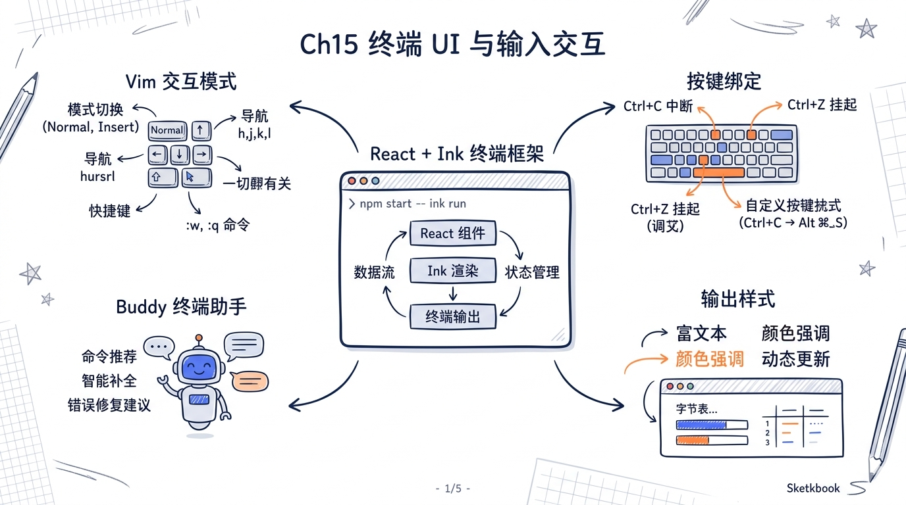
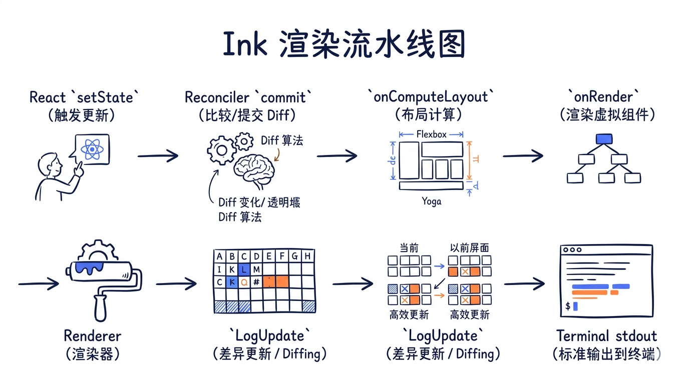
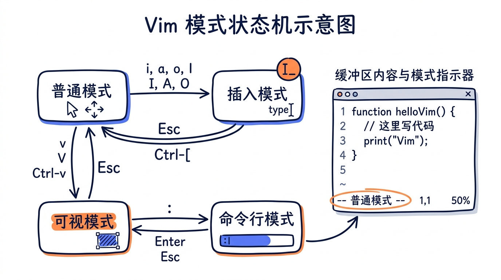
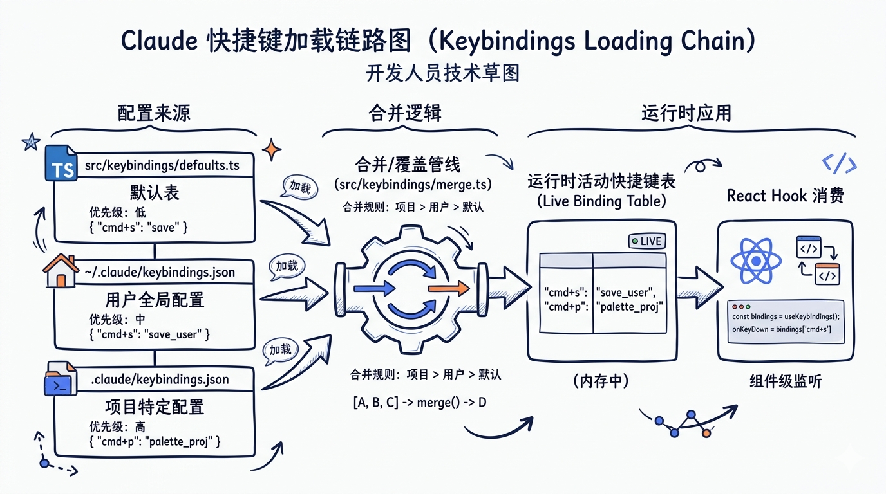
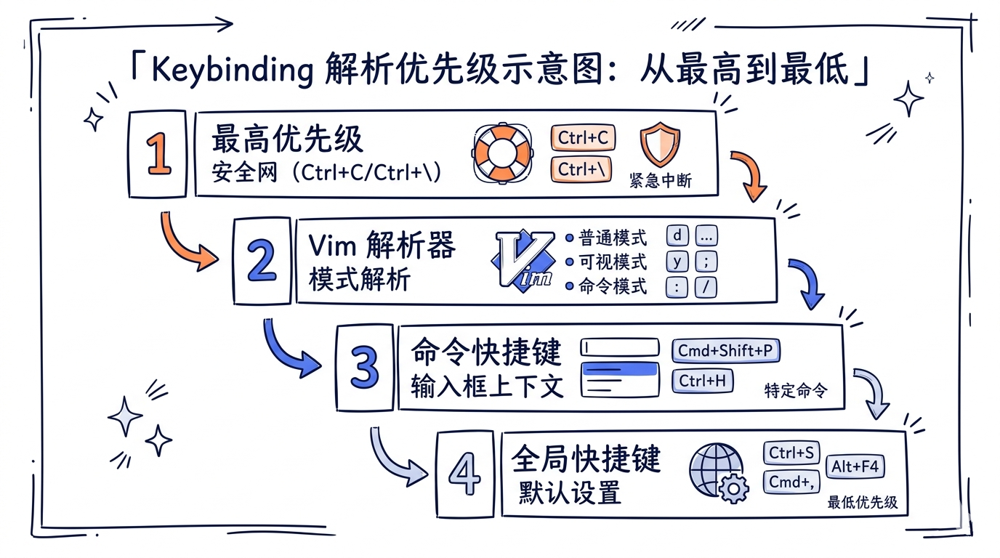
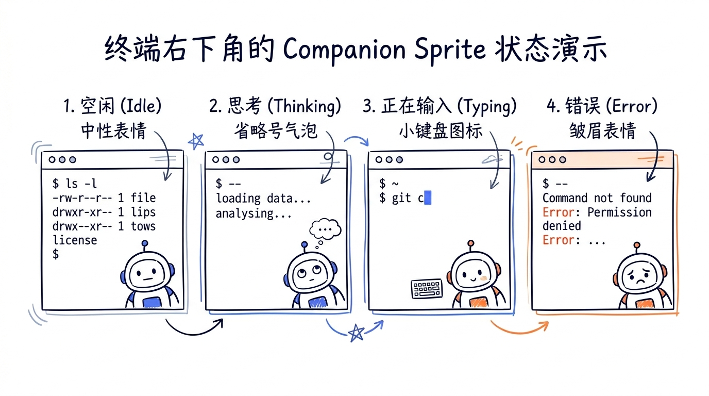
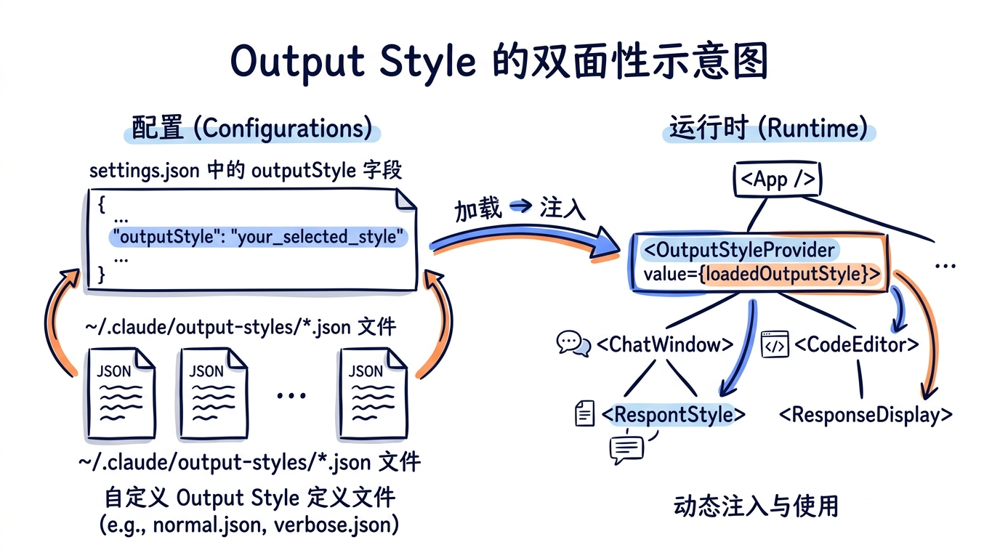

---
layout: default
title: "15 终端 UI 与输入交互"
nav_order: 53
parent: "模块五：扩展生态"
---


# 第十五章 终端 UI 与输入系统（React/Ink + Vim + Keybindings + Buddy + Output Styles）



> **核心问题**：一个 CLI 工具如何实现 Web 级别的交互体验——实时更新的进度指示器、可滚动的输出面板、焦点管理、键盘事件系统、鼠标选择——同时还要在纯文本终端中工作？Claude Code 的答案是：**用 React 驱动终端 UI**。


---

## 15.1 为什么选择 React/Ink

### 15.1.1 终端 UI 的挑战

传统 CLI 工具的 UI 很简单——打印一行行文本到 stdout。但 Claude Code 面临的场景远比这复杂：

- **多区域并行更新**：工具执行进度、模型流式输出、权限确认对话框需要同时显示
- **状态驱动渲染**：AppState 中的 50+ 个字段变化都可能触发 UI 更新
- **复杂布局**：嵌套的消息列表、缩进的工具调用、滚动视图
- **交互响应**：键盘快捷键、Tab 补全、鼠标点击、文本选择

这些需求本质上是一个 **reactive UI** 问题。

### 15.1.2 Ink 是什么

[Ink](https://github.com/vadimdemedes/ink) 是一个将 React 组件渲染到终端的框架。Claude Code 深度 fork 了 Ink，将其代码直接嵌入源码树（`src/ink/` 目录），做了大量定制优化。

核心技术栈：

| 层 | 技术 | 作用 |
|----|------|------|
| 组件 | React 19 + TypeScript | 声明式 UI |
| 协调 | react-reconciler | Fiber 树管理 |
| 布局 | Yoga Layout (native) | Flexbox 计算 |
| 渲染 | Custom Screen Buffer | ANSI 序列生成 |
| 输出 | LogUpdate (diff) | 增量终端更新 |

### 15.1.3 React 在终端中的优势

```typescript
// 这不是 Web 代码——这是终端输出
function ToolProgress({ name, status }: Props) {
  return (
    <Box flexDirection="column">
      <Text color="cyan">{name}</Text>
      <Box paddingLeft={2}>
        <Spinner /> <Text dimColor>{status}</Text>
      </Box>
    </Box>
  )
}
```

React 带来了：
1. **声明式**：描述"应该长什么样"而非"如何更新"
2. **组件化**：UI 按职责拆分为独立模块
3. **高效更新**：React 的 reconciliation 算法只更新变化的部分
4. **Hooks 生态**：`useState`、`useEffect`、`useSyncExternalStore` 直接可用

---

## 15.2 Ink 渲染引擎架构

Claude Code 的 `src/ink/` 目录包含了完整的终端渲染引擎。让我们从内向外逐层解析。

### 15.2.1 DOM 层（dom.ts）

Ink 实现了一个简化的 DOM，定义了终端中的"HTML 元素"：

```typescript
// ink/dom.ts
export type ElementNames =
  | 'ink-root'          // 根节点
  | 'ink-box'           // 等价于 <div>（flex 容器）
  | 'ink-text'          // 等价于 <span>（文本容器）
  | 'ink-virtual-text'  // 嵌套文本（Text 内的 Text）
  | 'ink-link'          // 超链接
  | 'ink-progress'      // 进度条
  | 'ink-raw-ansi'      // 原始 ANSI 序列

export type DOMElement = {
  nodeName: ElementNames
  attributes: Record<string, DOMNodeAttribute>
  childNodes: DOMNode[]
  style: Styles
  
  // 布局引擎节点
  yogaNode?: LayoutNode
  
  // 渲染状态
  dirty: boolean
  isHidden?: boolean
  
  // 滚动状态
  scrollTop?: number
  pendingScrollDelta?: number
  scrollHeight?: number
  scrollViewportHeight?: number
  stickyScroll?: boolean
  
  // 事件处理
  _eventHandlers?: Record<string, unknown>
  
  // 回调钩子
  onComputeLayout?: () => void
  onRender?: () => void
}
```

与浏览器 DOM 的关键区别：
- 只有 7 种元素类型（浏览器有 100+）
- 每个元素直接持有 Yoga Layout 节点引用
- 内置滚动状态（`scrollTop` 等）
- `dirty` 标记支持增量渲染优化

### 15.2.2 Reconciler（reconciler.ts）

Reconciler 是连接 React 和 Ink DOM 的桥梁。Claude Code 使用 `react-reconciler` 创建自定义 reconciler：

```typescript
// ink/reconciler.ts
const reconciler = createReconciler<
  ElementNames,    // 元素类型
  Props,           // 属性类型
  DOMElement,      // 容器类型
  DOMElement,      // 实例类型
  TextNode,        // 文本节点类型
  // ...更多类型参数
>({
  // 创建元素实例
  createInstance(originalType, newProps, _root, hostContext) {
    if (hostContext.isInsideText && originalType === 'ink-box') {
      throw new Error(`<Box> can't be nested inside <Text> component`)
    }
    const node = createNode(type)
    for (const [key, value] of Object.entries(newProps)) {
      applyProp(node, key, value)
    }
    return node
  },
  
  // 创建文本节点
  createTextInstance(text, _root, hostContext) {
    if (!hostContext.isInsideText) {
      throw new Error(`Text string "${text}" must be rendered inside <Text> component`)
    }
    return createTextNode(text)
  },
  
  // Commit 阶段——触发布局计算和渲染
  resetAfterCommit(rootNode) {
    // 计算 commit 耗时
    _lastCommitMs = _commitStart > 0 ? performance.now() - _commitStart : 0
    
    // 触发 Yoga 布局计算
    if (typeof rootNode.onComputeLayout === 'function') {
      rootNode.onComputeLayout()
    }
    
    // 触发渲染到终端
    rootNode.onRender?.()
  },
  
  // React 19 的 commitUpdate——直接接收新旧 props
  commitUpdate(node, _type, oldProps, newProps) {
    const props = diff(oldProps, newProps)
    const style = diff(oldProps['style'], newProps['style'])
    if (props) {
      for (const [key, value] of Object.entries(props)) {
        if (key === 'style') setStyle(node, value)
        else if (EVENT_HANDLER_PROPS.has(key)) setEventHandler(node, key, value)
        else setAttribute(node, key, value)
      }
    }
    if (style && node.yogaNode) applyStyles(node.yogaNode, style, newProps['style'])
  },
  
  // 隐藏/显示实例
  hideInstance(node) {
    node.isHidden = true
    node.yogaNode?.setDisplay(LayoutDisplay.None)
    markDirty(node)
  },
  
  unhideInstance(node) {
    node.isHidden = false
    node.yogaNode?.setDisplay(LayoutDisplay.Flex)
    markDirty(node)
  },
  
  // React 19 新增的必要方法
  maySuspendCommit: () => false,
  preloadInstance: () => true,
  supportsMutation: true,
  isPrimaryRenderer: true,
})
```

特别值得注意的是 **HostContext** 机制——它追踪当前是否在 `<Text>` 内部：

```typescript
getChildHostContext(parentHostContext, type) {
  const isInsideText = type === 'ink-text' || type === 'ink-virtual-text' || type === 'ink-link'
  if (parentHostContext.isInsideText === isInsideText) return parentHostContext
  return { isInsideText }
}
```

这确保了：
- `<Box>` 不能嵌套在 `<Text>` 中（抛出错误）
- 原始文本字符串必须在 `<Text>` 中（抛出错误）
- `<Text>` 嵌套时自动转换为 `ink-virtual-text`

### 15.2.3 Renderer（renderer.ts）

Renderer 负责将 DOM 树转换为 Screen Buffer：

```typescript
// ink/renderer.ts
export default function createRenderer(
  node: DOMElement,
  stylePool: StylePool,
): Renderer {
  let output: Output | undefined
  
  return options => {
    const { frontFrame, backFrame, terminalWidth, terminalRows } = options
    
    // 安全检查：Yoga 节点必须存在且维度有效
    const computedHeight = node.yogaNode?.getComputedHeight()
    if (!node.yogaNode || !Number.isFinite(computedHeight) || computedHeight < 0) {
      return { screen: createScreen(terminalWidth, 0, ...), cursor: { x: 0, y: 0, visible: true } }
    }
    
    const width = Math.floor(node.yogaNode.getComputedWidth())
    const height = options.altScreen ? terminalRows : Math.floor(computedHeight)
    
    // 复用 Output 对象（charCache 跨帧持久化）
    if (output) output.reset(width, height, screen)
    else output = new Output({ width, height, stylePool, screen })
    
    // 渲染 DOM 节点到 Output
    renderNodeToOutput(node, output, {
      prevScreen: options.prevFrameContaminated ? undefined : prevScreen,
    })
    
    return {
      screen: output.get(),
      viewport: { width: terminalWidth, height: terminalRows },
      cursor: { x: 0, y: screen.height, visible: !isTTY || screen.height === 0 },
    }
  }
}
```

**双缓冲机制**（`frontFrame` / `backFrame`）避免了渲染闪烁：
- `backFrame` 用于构建新帧
- 渲染完成后与 `frontFrame` 交换
- `prevScreen` 用于增量 blit 优化（只重绘变化部分）

### 15.2.4 Ink 主类（ink.tsx）

`Ink` 类是整个渲染引擎的中枢：

```typescript
// ink/ink.tsx（简化）
export default class Ink {
  private readonly log: LogUpdate
  private readonly terminal: Terminal
  private rootNode: dom.DOMElement
  private renderer: Renderer
  private readonly stylePool: StylePool
  private frontFrame: Frame
  private backFrame: Frame
  
  // 双缓冲 + 渲染节流
  private scheduleRender: (() => void) & { cancel?: () => void }
  
  // 文本选择状态（仅 alt-screen 模式）
  // 焦点管理器
  readonly focusManager: FocusManager
  
  constructor(options: Options) {
    // 1. 创建 DOM 根节点
    this.rootNode = dom.createNode('ink-root')
    
    // 2. 设置布局计算回调
    this.rootNode.onComputeLayout = () => {
      // Yoga layout 计算
      this.rootNode.yogaNode!.calculateLayout(terminalWidth, undefined)
    }
    
    // 3. 设置渲染回调
    this.rootNode.onRender = () => this.onRender()
    
    // 4. 创建 React Fiber root
    this.container = reconciler.createContainer(
      this.rootNode,
      ConcurrentRoot,  // 使用 React 19 的 Concurrent Mode
      // ...
    )
    
    // 5. 创建 renderer
    this.renderer = createRenderer(this.rootNode, this.stylePool)
    
    // 6. 节流渲染调度
    this.scheduleRender = throttle(() => {
      reconciler.flushSync(() => {})
    }, FRAME_INTERVAL_MS)
  }
  
  render(node: ReactNode): void {
    reconciler.updateContainer(
      <App ...>{node}</App>,
      this.container
    )
  }
}
```



---

## 15.3 Root API 与实例管理

`root.ts` 提供了两种启动 Ink 的方式：

```typescript
// ink/root.ts

// 方式 1: 单次渲染
export const renderSync = (node: ReactNode, options?: RenderOptions): Instance => {
  const instance = getInstance(inkOptions.stdout, () => new Ink(inkOptions))
  instance.render(node)
  return {
    rerender: instance.render,
    unmount() { instance.unmount() },
    waitUntilExit: instance.waitUntilExit,
    cleanup: () => instances.delete(inkOptions.stdout),
  }
}

// 方式 2: createRoot API（类似 react-dom 的 createRoot）
export async function createRoot(options: RenderOptions = {}): Promise<Root> {
  await Promise.resolve()  // 保留微任务边界
  const instance = new Ink(options)
  instances.set(stdout, instance)
  return {
    render: node => instance.render(node),
    unmount: () => instance.unmount(),
    waitUntilExit: () => instance.waitUntilExit(),
  }
}
```

`instances` 是一个 `Map<NodeJS.WriteStream, Ink>`，确保同一个 stdout 只有一个 Ink 实例。这在外部编辑器暂停/恢复场景中很重要。

---

## 15.4 状态管理架构

Claude Code 的状态管理是一个值得深入学习的系统。它没有使用 Redux 或 MobX，而是基于一个极简的 **pub/sub store** 加上 React 的 `useSyncExternalStore`。

### 15.4.1 Store 实现（store.ts）

整个 store 实现只有 34 行代码：

```typescript
// state/store.ts
type Listener = () => void
type OnChange<T> = (args: { newState: T; oldState: T }) => void

export type Store<T> = {
  getState: () => T
  setState: (updater: (prev: T) => T) => void
  subscribe: (listener: Listener) => () => void
}

export function createStore<T>(
  initialState: T,
  onChange?: OnChange<T>,
): Store<T> {
  let state = initialState
  const listeners = new Set<Listener>()

  return {
    getState: () => state,

    setState: (updater: (prev: T) => T) => {
      const prev = state
      const next = updater(prev)
      if (Object.is(next, prev)) return  // 相同引用则跳过
      state = next
      onChange?.({ newState: next, oldState: prev })
      for (const listener of listeners) listener()
    },

    subscribe: (listener: Listener) => {
      listeners.add(listener)
      return () => listeners.delete(listener)
    },
  }
}
```

设计亮点：
- **`Object.is` 短路**：相同引用不触发更新
- **`onChange` 回调**：在通知 listener 前先执行，用于状态变更的副作用处理
- **函数式 updater**：`setState(prev => newState)` 避免竞态条件
- **返回 unsubscribe 函数**：与 React 的 `useSyncExternalStore` 完美对接

### 15.4.2 AppState 类型（AppStateStore.ts）

`AppState` 是 Claude Code 的全局状态树，包含 50+ 个字段：

```typescript
// state/AppStateStore.ts
export type AppState = DeepImmutable<{
  // === 核心配置 ===
  settings: SettingsJson
  verbose: boolean
  mainLoopModel: ModelSetting
  
  // === UI 状态 ===
  statusLineText: string | undefined
  expandedView: 'none' | 'tasks' | 'teammates'
  footerSelection: FooterItem | null
  
  // === 权限 ===
  toolPermissionContext: ToolPermissionContext
  
  // === Agent/Assistant ===
  kairosEnabled: boolean
  agent: string | undefined
  
  // === 远程连接 ===
  remoteSessionUrl: string | undefined
  remoteConnectionStatus: 'connecting' | 'connected' | 'reconnecting' | 'disconnected'
  replBridgeEnabled: boolean
  replBridgeConnected: boolean
}> & {
  // === 非 DeepImmutable 字段（含函数类型或可变结构）===
  
  // 任务管理
  tasks: { [taskId: string]: TaskState }
  agentNameRegistry: Map<string, AgentId>
  
  // MCP 连接
  mcp: {
    clients: MCPServerConnection[]
    tools: Tool[]
    commands: Command[]
    resources: Record<string, ServerResource[]>
    pluginReconnectKey: number
  }
  
  // Plugin 系统
  plugins: {
    enabled: LoadedPlugin[]
    disabled: LoadedPlugin[]
    commands: Command[]
    errors: PluginError[]
    installationStatus: { ... }
    needsRefresh: boolean
  }
  
  // 文件历史与归因
  fileHistory: FileHistoryState
  attribution: AttributionState
  
  // TODO 列表（per agent）
  todos: { [agentId: string]: TodoList }
  
  // Thinking 和推测
  thinkingEnabled: boolean | undefined
  speculation: SpeculationState
  speculationSessionTimeSavedMs: number
  
  // 提示建议
  promptSuggestion: {
    text: string | null
    promptId: 'user_intent' | 'stated_intent' | null
    shownAt: number
    acceptedAt: number
  }
  
  // ... 更多字段
}
```

几个重要的设计决策：

1. **`DeepImmutable<T>`**：核心配置字段使用类型级别的不可变约束，防止意外修改
2. **非 DeepImmutable 部分**：包含 `Map`、函数类型、`Set` 等无法被 `DeepImmutable` 处理的字段，通过 intersection type (`&`) 分离
3. **`SpeculationState`** 使用 discriminated union：
```typescript
export type SpeculationState =
  | { status: 'idle' }
  | { status: 'active'; id: string; abort: () => void; startTime: number; ... }
```

### 15.4.3 默认状态初始化

`getDefaultAppState()` 构建初始状态：

```typescript
export function getDefaultAppState(): AppState {
  // 判断 teammate 的初始权限模式
  const initialMode: PermissionMode =
    teammateUtils.isTeammate() && teammateUtils.isPlanModeRequired()
      ? 'plan' : 'default'

  return {
    settings: getInitialSettings(),
    tasks: {},
    agentNameRegistry: new Map(),
    verbose: false,
    mainLoopModel: null,
    toolPermissionContext: {
      ...getEmptyToolPermissionContext(),
      mode: initialMode,
    },
    mcp: { clients: [], tools: [], commands: [], resources: {}, pluginReconnectKey: 0 },
    plugins: { enabled: [], disabled: [], commands: [], errors: [], ... },
    thinkingEnabled: shouldEnableThinkingByDefault(),
    promptSuggestionEnabled: shouldEnablePromptSuggestion(),
    speculation: IDLE_SPECULATION_STATE,
    // ... 50+ 个字段的初始值
  }
}
```

### 15.4.4 AppStateProvider（AppState.tsx）

Provider 将 store 注入 React 组件树：

```typescript
// state/AppState.tsx
export const AppStoreContext = React.createContext<AppStateStore | null>(null)

export function AppStateProvider({ children, initialState, onChangeAppState }: Props) {
  // 防止嵌套
  const hasAppStateContext = useContext(HasAppStateContext)
  if (hasAppStateContext) {
    throw new Error('AppStateProvider can not be nested')
  }

  // Store 只创建一次——稳定的 context value 不触发 re-render
  const [store] = useState(() =>
    createStore(initialState ?? getDefaultAppState(), onChangeAppState)
  )

  // 挂载时检查 bypass permissions 是否需要禁用
  useEffect(() => {
    const { toolPermissionContext } = store.getState()
    if (toolPermissionContext.isBypassPermissionsModeAvailable 
        && isBypassPermissionsModeDisabled()) {
      store.setState(prev => ({
        ...prev,
        toolPermissionContext: createDisabledBypassPermissionsContext(prev.toolPermissionContext),
      }))
    }
  }, [])

  // 监听外部 settings 变更（文件 watcher）
  const onSettingsChange = useEffectEvent((source: SettingSource) =>
    applySettingsChange(source, store.setState)
  )
  useSettingsChange(onSettingsChange)

  return (
    <HasAppStateContext.Provider value={true}>
      <AppStoreContext.Provider value={store}>
        <MailboxProvider>
          <VoiceProvider>{children}</VoiceProvider>
        </MailboxProvider>
      </AppStoreContext.Provider>
    </HasAppStateContext.Provider>
  )
}
```

### 15.4.5 Selector Hook（useAppState）

这是组件订阅状态的核心 Hook：

```typescript
export function useAppState<T>(selector: (state: AppState) => T): T {
  const store = useAppStore()
  
  const get = () => {
    const state = store.getState()
    const selected = selector(state)
    return selected
  }
  
  return useSyncExternalStore(store.subscribe, get, get)
}
```

使用方式：

```typescript
// 正确：选择单个字段
const verbose = useAppState(s => s.verbose)
const model = useAppState(s => s.mainLoopModel)

// 正确：选择已存在的子对象引用
const { text, promptId } = useAppState(s => s.promptSuggestion)

// 错误：不要返回新对象（Object.is 永远不等）
// const info = useAppState(s => ({ verbose: s.verbose, model: s.model }))
```

配套的 `useSetAppState` 只获取 updater 不订阅状态：

```typescript
export function useSetAppState() {
  return useAppStore().setState  // 稳定引用，不触发 re-render
}
```

### 15.4.6 安全变体

```typescript
export function useAppStateMaybeOutsideOfProvider<T>(
  selector: (state: AppState) => T,
): T | undefined {
  const store = useContext(AppStoreContext)
  return useSyncExternalStore(
    store ? store.subscribe : NOOP_SUBSCRIBE,
    () => store ? selector(store.getState()) : undefined,
  )
}
```

这个变体用于可能在 `AppStateProvider` 外部渲染的组件（例如错误边界）。

---

## 15.5 Selectors

`state/selectors.ts` 定义了纯函数选择器，用于从 AppState 派生计算状态：

```typescript
// state/selectors.ts

// 获取当前正在查看的 teammate 任务
export function getViewedTeammateTask(
  appState: Pick<AppState, 'viewingAgentTaskId' | 'tasks'>,
): InProcessTeammateTaskState | undefined {
  const { viewingAgentTaskId, tasks } = appState
  if (!viewingAgentTaskId) return undefined
  
  const task = tasks[viewingAgentTaskId]
  if (!task || !isInProcessTeammateTask(task)) return undefined
  
  return task
}

// 决定用户输入应该路由到哪个 agent
export type ActiveAgentForInput =
  | { type: 'leader' }
  | { type: 'viewed'; task: InProcessTeammateTaskState }
  | { type: 'named_agent'; task: LocalAgentTaskState }

export function getActiveAgentForInput(appState: AppState): ActiveAgentForInput {
  const viewedTask = getViewedTeammateTask(appState)
  if (viewedTask) return { type: 'viewed', task: viewedTask }
  
  const { viewingAgentTaskId, tasks } = appState
  if (viewingAgentTaskId) {
    const task = tasks[viewingAgentTaskId]
    if (task?.type === 'local_agent') return { type: 'named_agent', task }
  }
  
  return { type: 'leader' }
}
```

Selector 设计原则：
- 纯函数，无副作用
- 使用 `Pick<AppState, ...>` 类型参数明确依赖的字段
- 返回 discriminated union 类型方便模式匹配

---

## 15.6 onChange 副作用（onChangeAppState.ts）

`onChangeAppState` 是注册在 store 上的全局 onChange 回调，负责将状态变更同步到外部系统：

```typescript
// state/onChangeAppState.ts
export function onChangeAppState({ newState, oldState }: {
  newState: AppState; oldState: AppState
}) {
  // 1. 权限模式变更 → 通知 CCR 和 SDK
  const prevMode = oldState.toolPermissionContext.mode
  const newMode = newState.toolPermissionContext.mode
  if (prevMode !== newMode) {
    const prevExternal = toExternalPermissionMode(prevMode)
    const newExternal = toExternalPermissionMode(newMode)
    if (prevExternal !== newExternal) {
      notifySessionMetadataChanged({ permission_mode: newExternal })
    }
    notifyPermissionModeChanged(newMode)
  }
  
  // 2. Model 变更 → 持久化到 settings
  if (newState.mainLoopModel !== oldState.mainLoopModel) {
    if (newState.mainLoopModel === null) {
      updateSettingsForSource('userSettings', { model: undefined })
    } else {
      updateSettingsForSource('userSettings', { model: newState.mainLoopModel })
    }
    setMainLoopModelOverride(newState.mainLoopModel)
  }
  
  // 3. 视图模式变更 → 持久化到 globalConfig
  if (newState.expandedView !== oldState.expandedView) {
    saveGlobalConfig(current => ({
      ...current,
      showExpandedTodos: newState.expandedView === 'tasks',
      showSpinnerTree: newState.expandedView === 'teammates',
    }))
  }
  
  // 4. Settings 变更 → 清除 auth 缓存
  if (newState.settings !== oldState.settings) {
    clearApiKeyHelperCache()
    clearAwsCredentialsCache()
    clearGcpCredentialsCache()
    if (newState.settings.env !== oldState.settings.env) {
      applyConfigEnvironmentVariables()
    }
  }
}
```

这个设计是 Claude Code 状态管理的关键创新之一——**所有状态变更的副作用集中到一个 diff 函数**中。之前（注释中提到），权限模式的同步分散在 8+ 个不同的调用点，导致频繁的同步遗漏。现在只需要 `setState` 修改状态，副作用自动触发。

---

## 15.7 UI 与 Agent Loop 的解耦

Claude Code 的 UI 层和 Agent 执行层之间通过 **AsyncGenerator** 实现了完全解耦。

### 15.7.1 AsyncGenerator 驱动的消息流

核心的查询循环使用 AsyncGenerator：

```typescript
// query.ts
export async function* query(
  messages: Message[],
  // ...
): AsyncGenerator<Message, void> {
  // 每生成一条消息，yield 给调用方
  yield message
}

// QueryEngine.ts
export async function* ask({
  // ...
}): AsyncGenerator<Message, void> {
  // 编排 query → tool execution → 递归 query
}
```

### 15.7.2 UI 消费消息流

React 组件通过 hook 消费 AsyncGenerator 产出的消息：

```
AsyncGenerator yield → 
  message 追加到 state.messages →
    useAppState(s => s.messages) 触发 re-render →
      Message 组件渲染新消息
```

这种模式的优势：
- **Agent loop 完全不知道 UI 的存在**——它只是 yield 消息
- **UI 可以独立于 agent 更新**——用户滚动、展开/折叠不影响 agent
- **测试友好**——agent loop 可以在没有 UI 的情况下运行

### 15.7.3 Progress 更新

工具执行中的进度通过 `onProgress` 回调报告：

```typescript
// SkillTool 的 fork 模式
for await (const message of runAgent({...})) {
  if (onProgress) {
    onProgress({
      toolUseID: `skill_${parentMessage.message.id}`,
      data: {
        message: m,
        type: 'skill_progress',
        prompt: skillContent,
        agentId,
      },
    })
  }
}
```

进度消息到达 UI 后被 `renderToolUseProgressMessage` 渲染：

```typescript
// tools/SkillTool/UI.tsx
export function renderToolUseProgressMessage(
  progressMessages: ProgressMessage<Progress>[],
  { tools, verbose }
) {
  const displayedMessages = verbose
    ? progressMessages
    : progressMessages.slice(-MAX_PROGRESS_MESSAGES_TO_SHOW)
  
  return (
    <MessageResponse>
      <Box flexDirection="column">
        <SubAgentProvider>
          {displayedMessages.map(pm => (
            <Box key={pm.uuid} height={1} overflow="hidden">
              <MessageComponent message={pm.data.message} style="condensed" />
            </Box>
          ))}
        </SubAgentProvider>
        {hiddenCount > 0 && <Text dimColor>+{hiddenCount} more tool uses</Text>}
      </Box>
    </MessageResponse>
  )
}
```

---

## 15.8 Ink 组件体系

`src/ink/components/` 目录包含了终端 UI 的基础组件：

### 15.8.1 核心布局组件

| 组件 | 文件 | 说明 |
|------|------|------|
| `<App>` | `App.tsx` | 根组件，提供 context |
| `<Box>` | `Box.tsx` | Flex 容器（等价于 Web 的 `div`） |
| `<Text>` | `Text.tsx` | 文本容器（支持颜色、粗体等） |
| `<ScrollBox>` | `ScrollBox.tsx` | 可滚动容器 |
| `<Spacer>` | `Spacer.tsx` | 弹性空白 |
| `<Newline>` | `Newline.tsx` | 换行 |

### 15.8.2 交互组件

| 组件 | 文件 | 说明 |
|------|------|------|
| `<Button>` | `Button.tsx` | 可点击按钮 |
| `<Link>` | `Link.tsx` | 超链接（终端支持时可点击） |
| `<RawAnsi>` | `RawAnsi.tsx` | 原始 ANSI 序列输出 |

### 15.8.3 系统组件

| 组件 | 文件 | 说明 |
|------|------|------|
| `<AlternateScreen>` | `AlternateScreen.tsx` | Alt screen 模式 |
| `<ErrorOverview>` | `ErrorOverview.tsx` | 错误展示 |
| `<NoSelect>` | `NoSelect.tsx` | 不可选择区域 |

### 15.8.4 上下文提供者

```typescript
// StdinContext.ts — stdin 管理
// TerminalSizeContext.tsx — 终端尺寸
// TerminalFocusContext.tsx — 焦点状态
// ClockContext.tsx — 时钟（动画更新）
// CursorDeclarationContext.ts — 光标管理
```

---

## 15.9 Hooks 体系

`src/hooks/` 目录包含了大量 React hooks，是 UI 与核心逻辑交互的桥梁：

### 15.9.1 核心 Hooks

```typescript
// 终端尺寸
function useTerminalSize(): { columns: number; rows: number }

// 文本输入处理
function useTextInput(options: TextInputOptions): TextInputResult

// 全局键绑定
function useGlobalKeybindings(): void

// Tab 自动补全
function useTypeahead(): TypeaheadResult

// 历史搜索（Ctrl+R）
function useHistorySearch(): HistorySearchResult

// 选择文本复制
function useCopyOnSelect(): void
```

### 15.9.2 后台任务 Hooks

```typescript
// 后台任务导航
function useBackgroundTaskNavigation(): void

// PR 状态轮询
function usePrStatus(): void

// 队列处理
function useQueueProcessor(): void

// 任务列表监视
function useTaskListWatcher(): void
```

### 15.9.3 集成 Hooks

```typescript
// IDE 集成（VS Code extension 通信）
function useIDEIntegration(): void

// SSH 会话检测
function useSSHSession(): void

// 语音集成
function useVoiceIntegration(): void

// 更新通知
function useUpdateNotification(): void

// 设置变更监听
function useSettingsChange(callback: (source: SettingSource) => void): void
```

### 15.9.4 elapsed time Hook（典型实现）

```typescript
// hooks/useElapsedTime.ts
function useElapsedTime(startTime: number): string {
  // 利用 ClockContext 的 tick 驱动更新
  const clock = useContext(ClockContext)
  const elapsed = clock.now - startTime
  return formatDuration(elapsed)
}
```

---

## 15.10 SyntheticOutputTool：非交互模式的输出

当 Claude Code 以 SDK/headless 模式运行时，没有终端 UI。`SyntheticOutputTool` 提供了结构化输出的能力：

```typescript
// tools/SyntheticOutputTool/SyntheticOutputTool.ts
export const SYNTHETIC_OUTPUT_TOOL_NAME = 'StructuredOutput'

export function isSyntheticOutputToolEnabled(opts: {
  isNonInteractiveSession: boolean
}): boolean {
  return opts.isNonInteractiveSession  // 只在非交互模式启用
}
```

核心实现：

```typescript
export const SyntheticOutputTool = buildTool({
  name: SYNTHETIC_OUTPUT_TOOL_NAME,
  searchHint: 'return the final response as structured JSON',
  
  async prompt() {
    return `Use this tool to return your final response in the requested structured format. 
    You MUST call this tool exactly once at the end of your response.`
  },
  
  // 输入 schema 动态（由用户指定）
  get inputSchema() { return inputSchema() },  // z.object({}).passthrough()
  
  async call(input) {
    return {
      data: 'Structured output provided successfully',
      structured_output: input,
    }
  },
  
  // 永远允许
  async checkPermissions(input) {
    return { behavior: 'allow', updatedInput: input }
  },
})
```

**Schema 验证**通过动态创建带 JSON Schema 的工具实例实现：

```typescript
export function createSyntheticOutputTool(
  jsonSchema: Record<string, unknown>,
): CreateResult {
  // WeakMap 缓存——相同 schema 对象引用复用工具实例
  const cached = toolCache.get(jsonSchema)
  if (cached) return cached
  
  const ajv = new Ajv({ allErrors: true })
  const isValidSchema = ajv.validateSchema(jsonSchema)
  if (!isValidSchema) return { error: ajv.errorsText(ajv.errors) }
  
  const validateSchema = ajv.compile(jsonSchema)
  
  return {
    tool: {
      ...SyntheticOutputTool,
      inputJSONSchema: jsonSchema,
      async call(input) {
        const isValid = validateSchema(input)
        if (!isValid) {
          throw new TelemetrySafeError(
            `Output does not match required schema: ${errors}`
          )
        }
        return { data: 'Success', structured_output: input }
      },
    },
  }
}
```

**WeakMap 缓存**是一个精巧的优化：Agent SDK 的 workflow 脚本可能用相同的 schema 对象调用 `agent()` 30-80 次。WeakMap 的 identity-based cache 将 Ajv 编译开销从 ~110ms 降到 ~4ms。

---

## 15.11 渲染优化

Claude Code 在终端渲染性能上做了大量优化。

### 15.11.1 Dirty 标记与增量渲染

```typescript
// dom.ts
export function markDirty(node: DOMElement | TextNode): void {
  // 向上冒泡标记所有祖先节点为 dirty
  let current: DOMElement | undefined = node.parentNode
  while (current) {
    if (current.dirty) break  // 已经 dirty 则停止
    current.dirty = true
    current = current.parentNode
  }
}
```

渲染时只处理 dirty 子树，跳过未变化的区域。

### 15.11.2 Screen Buffer Blit

`renderNodeToOutput` 支持 `prevScreen` 参数：

```typescript
renderNodeToOutput(node, output, {
  prevScreen: options.prevFrameContaminated ? undefined : prevScreen,
})
```

当上一帧的 screen buffer 未被污染时，renderer 可以直接 blit（复制）未变化的区域而不是重新渲染。

### 15.11.3 渲染节流

```typescript
this.scheduleRender = throttle(() => {
  reconciler.flushSync(() => {})
}, FRAME_INTERVAL_MS)
```

多次快速的 state 变更只触发一次渲染（由 `FRAME_INTERVAL_MS` 控制）。

### 15.11.4 Pool 复用

```typescript
private stylePool: StylePool       // 样式对象池
private charPool: CharPool         // 字符缓存池  
private hyperlinkPool: HyperlinkPool  // 超链接池
```

Pool 在帧间复用，避免频繁的内存分配和垃圾回收。

### 15.11.5 Debug Repaints

```typescript
export function isDebugRepaintsEnabled(): boolean {
  return isEnvTruthy(process.env.CLAUDE_CODE_DEBUG_REPAINTS)
}

// 在 createInstance 中
if (isDebugRepaintsEnabled()) {
  node.debugOwnerChain = getOwnerChain(internalHandle)
}
```

设置 `CLAUDE_CODE_DEBUG_REPAINTS=1` 可以追踪每个 DOM 节点的 React 组件所有者链，用于排查不必要的 re-render。

---

## 15.12 事件系统

### 15.12.1 Keyboard Event

```typescript
// ink/events/keyboard-event.ts
export class KeyboardEvent {
  readonly key: string
  readonly code: string
  readonly shiftKey: boolean
  readonly ctrlKey: boolean
  readonly altKey: boolean
  readonly metaKey: boolean
}
```

### 15.12.2 Dispatcher

```typescript
// ink/events/dispatcher.ts
export class Dispatcher {
  currentUpdatePriority: number
  currentEvent: KeyboardEvent | null
  
  // 由 reconciler.ts 在初始化时注入
  discreteUpdates: typeof reconciler.discreteUpdates
  
  resolveEventPriority(): number {
    // 根据事件类型返回优先级
  }
}

// reconciler.ts 中的注入
dispatcher.discreteUpdates = reconciler.discreteUpdates.bind(reconciler)
```

这种设计打破了 `dispatcher.ts → reconciler.ts` 的循环依赖。

### 15.12.3 Hit Test（鼠标事件）

```typescript
// ink/hit-test.ts
export function dispatchClick(rootNode: DOMElement, x: number, y: number): void
export function dispatchHover(rootNode: DOMElement, x: number, y: number): void
```

鼠标事件通过 hit-test 找到目标 DOM 节点，然后通过 capture/bubble 路径分发。

---

## 15.13 Alt Screen 模式

Claude Code 支持 alt screen（备用屏幕）模式，用于全屏 UI（如消息选择器）：

```typescript
// ink/components/AlternateScreen.tsx
// 包裹子组件在 <Box height={rows} flexShrink={0}> 中
```

Alt screen 的特殊处理：
- 光标始终隐藏
- viewport height = terminalRows + 1（防止触发 scrollback 清理）
- Yoga 高度钳制到 terminalRows（超出的内容被裁剪而非导致终端错乱）

```typescript
// renderer.ts
const height = options.altScreen ? terminalRows : yogaHeight
if (options.altScreen && yogaHeight > terminalRows) {
  logForDebugging(
    `alt-screen: yoga height ${yogaHeight} > terminalRows ${terminalRows} — ` +
    `something is rendering outside <AlternateScreen>. Overflow clipped.`
  )
}
```

---

## 15.14 Selection 与 Text Copy

Ink 实现了完整的文本选择系统（仅在 alt screen 模式）：

```typescript
// ink/selection.ts
export type SelectionState = {
  // 选择状态的完整定义
}

export function createSelectionState(): SelectionState
export function startSelection(state: SelectionState, x: number, y: number): void
export function extendSelection(state: SelectionState, x: number, y: number): void
export function getSelectedText(state: SelectionState): string
export function clearSelection(state: SelectionState): void
export function selectWordAt(state: SelectionState, x: number, y: number): void
export function selectLineAt(state: SelectionState, y: number): void
```

选择高亮通过 overlay 叠加到渲染后的 screen buffer 上（`applySelectionOverlay`），不影响底层的渲染数据。

---

## 15.15 ScrollBox

`ScrollBox` 组件实现了虚拟滚动：

关键特性：
- `stickyScroll`：新内容追加时自动滚动到底部
- `pendingScrollDelta`：积累滚动量，每帧最多消耗 `SCROLL_MAX_PER_FRAME` 行
- `scrollClampMin/Max`：虚拟滚动时防止滚到空白区域
- `scrollToElement`：延迟到 Yoga 计算后再确定滚动位置

---

## 15.16 Vim 模式

如果用户在终端使用 Claude Code 的输入框，最容易被忽略却又非常强大的能力，是它内置了一套相当完整的 **Vim 编辑器**。`src/vim/` 与 `src/keybindings/` 合计 **4,672 行代码**（见 `docs/canonical-numbers.md` #19），其中 vim 模块占据大头——它不是一个壳子调用外部 vim，而是用 TypeScript 实现的 Vim 状态机，运行在 Ink 输入控件之上。



### 15.16.1 为什么要在 CLI 里塞一个 Vim

主要有三个动机：

1. **重度用户的肌肉记忆**：Claude Code 的核心用户群体很多是 vim/neovim 重度用户，输入框中"按 j/k 移动光标 = 输出 jk 字符"的体验对他们是地狱。
2. **多行复杂编辑**：Agent 需要长 prompt（贴代码、贴日志、贴 schema），单行编辑模式不够用。Vim 的 visual 模式 + dd/yy/p 是处理多行的最高效语义。
3. **重复操作**：`.` repeat、`5dd`、`ci"`、宏录制等，把"改 5 个相似位置"从手工劳动变成可命令化的操作。

### 15.16.2 Vim 状态机：四种模式

`src/vim/` 中的核心是一个有限状态机，定义了四个主模式：

```typescript
// src/vim/types.ts（教学还原）
export type VimMode =
  | 'normal'    // 默认模式，按键被解析为命令（h/j/k/l 移动等）
  | 'insert'    // 插入模式，按键直接插入文本
  | 'visual'    // 可视化选择模式（字符级 v / 行级 V / 块级 ctrl-v）
  | 'command'   // 冒号命令行（:w / :q / :s 等）

export type VimState = {
  mode: VimMode
  buffer: string[]            // 行缓冲
  cursor: { row: number; col: number }
  selectionAnchor?: { row: number; col: number }
  lastCommand?: VimCommand    // 用于 . repeat
  countPrefix: number         // 5dd 中的 5
  registers: Map<string, string>  // 命名寄存器（"ay"等）
  pendingOperator?: 'd' | 'c' | 'y'  // d / c / y 等待 motion
}
```

模式切换由几个关键键触发：

| 当前模式 | 触发键 | 进入模式 | 含义 |
|---|---|---|---|
| normal | `i` | insert | 在光标前插入 |
| normal | `a` | insert | 在光标后插入 |
| normal | `o` | insert | 在下一行新建并进入插入 |
| normal | `O` | insert | 在上一行新建并进入插入 |
| normal | `v` | visual | 字符级选择 |
| normal | `V` | visual | 行级选择 |
| normal | `:` | command | 进入命令行 |
| insert / visual / command | `Esc` | normal | 一律回到 normal |

### 15.16.3 命令解析：count + operator + motion

Vim 的核心抽象不是"快捷键"，而是 **count × operator × motion** 的组合语法：

```
3      d      w
^      ^      ^
count  operator motion
"对接下来 3 个单词执行删除"
```

`src/vim/parser.ts`（教学还原）实现了这套三段式解析：

```typescript
// 简化的 Vim 命令解析器
export function parseVimCommand(state: VimState, key: string) {
  // (1) 数字前缀（5dd 中的 5）
  if (/^[0-9]$/.test(key) && !(key === '0' && state.countPrefix === 0)) {
    return { command: null, nextState: { ...state, countPrefix: state.countPrefix * 10 + Number(key) } }
  }
  // (2) 等待 motion 的 operator（dw、d2w、dd 等）
  if (state.pendingOperator) {
    const motion = parseMotion(key, state)
    if (!motion) return { command: null, nextState: state }
    return {
      command: { type: 'operator', op: state.pendingOperator, motion, count: state.countPrefix || 1 },
      nextState: { ...state, pendingOperator: undefined, countPrefix: 0 },
    }
  }
  // (3) 操作符触发 / 普通命令
  if (key === 'd' || key === 'c' || key === 'y') {
    return { command: null, nextState: { ...state, pendingOperator: key } }
  }
  return { command: parseSingleCommand(key, state), nextState: state }
}
```

这个设计的厉害之处：**`dd` 不是一个特殊命令，而是 `d` (operator) + `d` (整行 motion) 的复合**。同理 `cc` = change line、`yy` = yank line。

### 15.16.4 与 Ink 输入流的集成：useVimInput

`src/hooks/useVimInput.ts`（教学还原）是把 vim 状态机接入 Ink 输入事件的桥梁：

```typescript
export function useVimInput(opts: { initialBuffer: string; enabled: boolean; onSubmit: (t: string) => void }) {
  const [state, setState] = useState<VimState>(() => initialVimState(opts.initialBuffer))
  useInput(
    (input, key) => {
      if (!opts.enabled) return
      if (key.escape) {                          // Esc 优先：任何模式回到 normal
        setState(prev => ({ ...prev, mode: 'normal', selectionAnchor: undefined }))
        return
      }
      if (state.mode === 'insert') {              // insert 模式：直接插入字符
        if (key.return) { /* 换行或提交 */ return }
        setState(prev => insertCharacter(prev, input))
        return
      }

      // normal / visual / command：走 vim 解析器
      const { command, nextState } = parseVimCommand(state, input)
      const newState = command ? executeCommand(nextState, command) : nextState
      setState(newState)
    },
    { isActive: opts.enabled },
  )

  return { state, getText: () => state.buffer.join('\n') }
}
```

### 15.16.5 核心命令实现：dd / yy / p / . repeat / visual

`dd` 删除整行的实现（简化）：

```typescript
// src/vim/commands/delete.ts（教学还原）
export function executeDeleteLine(state: VimState, count: number): VimState {
  const startRow = state.cursor.row
  const endRow = Math.min(state.buffer.length, startRow + count)
  const deletedLines = state.buffer.slice(startRow, endRow)
  const newRegisters = new Map(state.registers)
  newRegisters.set('"', deletedLines.join('\n') + '\n')   // 默认寄存器
  newRegisters.set('0', deletedLines.join('\n') + '\n')   // yank 寄存器
  const newBuffer = [...state.buffer.slice(0, startRow), ...state.buffer.slice(endRow)]
  if (newBuffer.length === 0) newBuffer.push('')          // buffer 不可空
  return {
    ...state,
    buffer: newBuffer,
    cursor: { row: Math.min(newBuffer.length - 1, startRow), col: 0 },
    registers: newRegisters,
    countPrefix: 0,
    lastCommand: { type: 'operator', op: 'd', motion: { type: 'line' }, count },
  }
}
```

关键点：删除内容进入默认寄存器（`p` 可粘回）；`lastCommand` 记录用于 `.` repeat；纯 motion（h/j/k/l/w/b）**不**写入 `lastCommand`，所以 `.` 不会重复移动。

`.` repeat 与 visual 选择的实现非常薄：

```typescript
// 仅 7 行
export function executeRepeat(state: VimState): VimState {
  return state.lastCommand ? executeCommand(state, state.lastCommand) : state
}

// visual 模式入口：记录 anchor，UI 层用 <Text inverse> 反白渲染
export function enterVisualMode(state: VimState, type: 'char' | 'line'): VimState {
  return { ...state, mode: 'visual', selectionAnchor: { ...state.cursor }, selectionType: type }
}
```

![终端中的 Vim 模式截图。下方有一个状态指示器显示 [NORMAL] / [INSERT] / [VISUAL]，光标用方块（normal）/ 竖线（insert）区分；visual 模式下选中文本用反白色块表示](images/ch15/04-img04.png)

### 15.16.6 与 Ink Reconciler 的协同

Vim 状态机不直接渲染光标——它只更新 `state.cursor` 然后由 React 重渲染。`<TextInput>` 组件读取 state 后用 ANSI 序列在正确位置画光标：

```typescript
// 简化
return (
  <Box flexDirection="column">
    {state.buffer.map((line, row) => (
      <Text key={row}>
        {row === state.cursor.row
          ? <>{line.slice(0, state.cursor.col)}<CursorOverlay shape={cursorShape(state.mode)} />{line.slice(state.cursor.col)}</>
          : line}
      </Text>
    ))}
  </Box>
)
```

**这是 Ink 设计哲学的好例子**：vim 这种"指令驱动 UI"在 Web 上往往要操纵 DOM，但在 React + Ink 里只是 setState，剩下的交给 reconciler。

---

## 15.17 Keybindings 体系

Vim 模式只是 **快捷键宇宙** 的一部分。Claude Code 还有"全局快捷键"（任何上下文都生效，例如 `Ctrl+C` 取消、`Ctrl+R` 历史搜索）和"命令快捷键"（输入框上下文中的特殊操作）。这套体系定义在 `src/keybindings/`，由 `src/hooks/useGlobalKeybindings.tsx` 与 `src/hooks/useCommandKeybindings.tsx` 消费。



### 15.17.1 三种作用域

```typescript
// src/keybindings/types.ts（教学还原）
export type KeybindingScope =
  | 'global'    // 任何上下文：Ctrl+C / Ctrl+L / Ctrl+\
  | 'command'   // 输入框激活时：Tab 补全、↑/↓ 历史
  | 'vim'       // vim 模式特化：仅 normal / visual / command 模式生效
```

每个 binding 声明它的 scope，运行时按 **scope 优先级 → 最后定义优先** 的顺序解析冲突。

### 15.17.2 Modifiers：超越单键

Claude Code 支持比传统 CLI 更丰富的 modifiers：

| Modifier | macOS 表达 | Linux/Windows 表达 |
|---|---|---|
| `ctrl` | `Ctrl` | `Ctrl` |
| `alt` | `Option` | `Alt` |
| `cmd` / `meta` | `Cmd` | `Meta`/`Win` |
| `shift` | `Shift` | `Shift` |

终端协议（kitty keyboard protocol、CSI u）让 `Ctrl+Shift+P` 这种过去无法捕获的组合现在可用。

### 15.17.3 Chord 序列（多键和弦）

不只是组合键——Claude Code 还支持 **chord**（先按 leader，再按下一个键）：

```jsonc
// ~/.claude/keybindings.json
{
  "bindings": [
    { "scope": "global", "chord": ["ctrl+k", "ctrl+s"], "action": "save_session" },
    { "scope": "global", "chord": ["ctrl+k", "ctrl+r"], "action": "reload_settings" }
  ]
}
```

实现思路：

```typescript
// src/keybindings/chordResolver.ts（教学还原）
export class ChordResolver {
  private pending: string[] = []
  private timer: NodeJS.Timeout | null = null

  resolve(input: string, table: Binding[]): Binding | 'pending' | null {
    this.pending.push(input)
    const exact = table.find(b => arraysEqual(b.chord, this.pending))
    if (exact) { this.reset(); return exact }                                 // 完整匹配
    if (table.some(b => arrayStartsWith(b.chord, this.pending))) {            // 部分匹配
      this.scheduleTimeout()
      return 'pending'
    }
    this.reset()
    return null                                                                // 无匹配
  }

  private scheduleTimeout() {
    if (this.timer) clearTimeout(this.timer)
    this.timer = setTimeout(() => this.reset(), 1000)  // 1s 超时清空
  }
  private reset() { this.pending = []; if (this.timer) clearTimeout(this.timer) }
}
```

### 15.17.4 默认绑定 vs 用户绑定

加载顺序：内置 `DEFAULT_BINDINGS` 常量 → 用户 `~/.claude/keybindings.json` → 项目 `.claude/keybindings.json`，三层用 `mergeBindings(...)` 合并，**后写覆盖**：

```typescript
// src/keybindings/loader.ts（教学还原）
export function loadKeybindings(): Binding[] {
  return mergeBindings(
    DEFAULT_BINDINGS,
    parseIfExists(path.join(os.homedir(), '.claude', 'keybindings.json')),
    parseIfExists(path.join(process.cwd(), '.claude', 'keybindings.json')),
  )
}

function mergeBindings(...layers: Binding[][]): Binding[] {
  const map = new Map<string, Binding>()
  for (const layer of layers)
    for (const b of layer)
      map.set(`${b.scope}::${b.chord.join('+')}`, b)  // 后写覆盖
  return Array.from(map.values())
}
```

特殊语法：`{ "chord": [...], "action": null }` 显式禁用某绑定；`"action": "literal:foo"` 让快捷键直接输出字面字符。

### 15.17.5 useGlobalKeybindings：全局快捷键的 Hook

`useInput` 是 Ink 提供的钩子，订阅 stdin 的解码后的 keystroke；hook 内对 binding 表做查表，按 action 字符串分派：

```typescript
// src/hooks/useGlobalKeybindings.tsx（教学还原）
export function useGlobalKeybindings() {
  const setAppState = useSetAppState()
  const bindings = useAppState(s => s.keybindings.global)
  useInput((input, keyMeta) => {
    const action = lookupBinding(bindings, input, keyMeta)
    if (!action) return
    switch (action) {
      case 'cancel_current_action': setAppState(p => ({ ...p, abortRequested: true })); break
      case 'open_history_search':   setAppState(p => ({ ...p, historySearchOpen: true })); break
      case 'reload_settings':       reloadSettingsFromDisk(); break
      // ... 其他 action
    }
  })
}
```

### 15.17.6 useCommandKeybindings：输入上下文的快捷键

输入框激活时，命令快捷键有更细粒度的语义——`↑/↓` 在历史中切换，`Tab` 触发补全等。`useCommandKeybindings` 在 `<TextInput>` 内部使用，比全局 hook 优先级更高。

### 15.17.7 与 Vim 模式的协调

当 vim 模式被启用时，绝大多数全局/命令绑定要让位于 vim 解析器：

```typescript
// 在 useGlobalKeybindings 内
useInput((input, keyMeta) => {
  if (vimEnabled && state.mode !== 'insert') {
    // vim normal/visual/command 模式：让 vim 处理
    return
  }
  // 否则按全局表派发
  ...
})
```

但有两类例外**始终由全局表处理**：

1. `Ctrl+C` —— 取消当前任务（vim 也不该截获）
2. `Ctrl+\` —— 强制中断 / 退出（safety net）

这是经典的 **layered keybinding** 设计：底层提供安全网，上层负责领域语义。



### 15.17.8 调试技巧：CLAUDE_CODE_DEBUG_KEYS

```bash
CLAUDE_CODE_DEBUG_KEYS=1 claude
```

启用后，每次按键都会在 statusline 显示解析结果（"`Ctrl+K` → action: `save_session`"），帮助诊断"为什么我的快捷键不生效"。

---

## 15.18 Companion Sprite (Buddy)

`src/buddy/`（**1,298 行**，见 `docs/canonical-numbers.md` #21）实现了 Claude Code 最有"个性"的 UI 元素：终端右下角的 **小 mascot**——一只会眨眼、会随状态切换姿势、会在长任务结束时弹出 toast 的虚拟伙伴。



### 15.18.1 这是什么，何时出现

很多人第一次见到会以为是终端故障——它**是有意为之的设计**：

- **存在感不打扰**：默认尺寸 4×4 字符，渲染在 ScrollBox 之外的"装饰区"。
- **状态镜像**：实时反映 agent 内部状态（idle/thinking/typing/error），不影响主消息流。
- **可关闭**：`settings.json` 里设置 `"companionSprite": "off"` 即可。

它的精神原型是 **DOS 时代的 ICQ 小花、Mac OS 9 的 Microsoft Bob**——但**功能性更强**：用户不需要看 spinner 也能感知任务状态。

### 15.18.2 文件清单（1,298 行）

| 文件 | 大致行数 | 职责 |
|---|---|---|
| `CompanionSprite.tsx` | ~280 | 主 React 组件、动画驱动 |
| `sprites.ts` | ~520 | ASCII art 数据（每个状态多帧） |
| `companion.ts` | ~200 | 状态机：idle/thinking/typing/error 切换 |
| `prompt.ts` | ~120 | toast 文案生成（"All done! 🎉"等） |
| `types.ts` | ~80 | TypeScript 类型 |
| `useBuddyNotification.tsx` | ~98 | 通知触发 Hook |

### 15.18.3 状态机：四种姿势

```typescript
// src/buddy/types.ts（教学还原）
export type BuddyState =
  | { kind: 'idle' }                       // 默认呼吸动画
  | { kind: 'thinking'; since: number }    // agent 在调用模型
  | { kind: 'typing'; tokensThisSec: number }  // 流式输出
  | { kind: 'error'; message: string }     // 任务失败

export type Sprite = {
  frames: string[]      // 多帧 ASCII art
  fps: number           // 切帧速度
  loop: boolean
}

export const SPRITES: Record<BuddyState['kind'], Sprite> = {
  idle: { frames: [...], fps: 2, loop: true },
  thinking: { frames: [...], fps: 4, loop: true },
  typing: { frames: [...], fps: 8, loop: true },
  error: { frames: [...], fps: 1, loop: false },
}
```

### 15.18.4 状态机驱动：useBuddyState

```typescript
// src/buddy/companion.ts（教学还原）
export function useBuddyState(): BuddyState {
  const speculation = useAppState(s => s.speculation)
  const errorState = useAppState(s => s.lastError)
  const streamingTokens = useAppState(s => s.streamingTokensInLastSecond)
  return useMemo(() => {
    if (errorState && Date.now() - errorState.at < 5000) return { kind: 'error', message: errorState.message }
    if (streamingTokens > 0) return { kind: 'typing', tokensThisSec: streamingTokens }
    if (speculation.status === 'active') return { kind: 'thinking', since: speculation.startTime }
    return { kind: 'idle' }
  }, [speculation, errorState, streamingTokens])
}
```

注意它**只是 selector**——没有自己的 state，完全派生自 AppState。这与第 15.4 节的"selector-based 订阅"模式一致。

### 15.18.5 Sprite 资源管理

`sprites.ts` 不是用图片文件，而是直接用 ASCII art 数组——每个 sprite 包含 `frames: string[]`、`fps: number`、`loop: boolean` 三个字段；`IDLE_SPRITE.frames` 例如包含两帧（`│•‿•│` 和 `│-‿-│`），fps=2 形成"眨眼"效果。**编译期常量**避免了运行时 IO，也避免了 ANSI 转义在文件 IO 里被破坏。

### 15.18.6 渲染：CompanionSprite 组件

组件本身只负责"按 fps 切帧 + position absolute 渲染"，状态全部派生自 `useBuddyState()`：

```typescript
// src/buddy/CompanionSprite.tsx（教学还原）
export function CompanionSprite() {
  const state = useBuddyState()
  const sprite = SPRITES[state.kind]
  const frame = useAnimationFrame(sprite.frames, sprite.fps, sprite.loop)
  const enabled = useAppState(s => s.settings.companionSprite !== 'off')
  if (!enabled) return null
  return (
    <Box position="absolute" bottom={1} right={1} width={6} height={4}>
      <Text color={colorFor(state)}>{frame}</Text>
    </Box>
  )
}
```

`useAnimationFrame` 是一个简单的 `setInterval(1000/fps)` Hook，按 frames 数组循环切换索引（`loop=false` 时停在最后一帧）。

### 15.18.7 通知机制：useBuddyNotification

任务完成时弹一个小 toast。核心思路是用 `useRef` 记录上一帧任务状态，每次 AppState 更新时 diff 出"running → done"的转换，把 toast 推入 AppState 的 `buddyToasts` 列表：

```typescript
// src/buddy/useBuddyNotification.tsx（教学还原，简化）
export function useBuddyNotification() {
  const tasks = useAppState(s => s.tasks)
  const setAppState = useSetAppState()
  const prevStatuses = useRef<Map<string, TaskStatus>>(new Map())

  useEffect(() => {
    for (const [id, task] of Object.entries(tasks)) {
      if (prevStatuses.current.get(id) === 'running' && task.status === 'done') {
        setAppState(s => ({
          ...s,
          buddyToasts: [...s.buddyToasts, { id: `${id}-done`, message: generateToastMessage(task), at: Date.now() }],
        }))
      }
      prevStatuses.current.set(id, task.status)
    }
  }, [tasks])
}
```

`generateToastMessage` 根据任务类型返回 "Agent X finished" / "Task failed: ..." / "Done in 12.4s"。`buddyToasts` 列表由专门的 `<ToastStack>` 组件渲染并按时间消失。


### 15.18.8 与终端渲染的集成：position="absolute"

第 15.2 节提到 Ink DOM 不完全等价于浏览器 DOM。但**它支持有限的 absolute 定位**——专门为 Companion Sprite 这种场景：

- 不影响 main scroll buffer 的高度
- 不参与 flex 布局
- 永远渲染在屏幕的固定位置（bottom + right offset）

实现细节是渲染器在最后一遍 pass 时把绝对定位元素叠加到 screen buffer：

```typescript
// renderer.ts 的简化片段
function renderAbsoluteLayer(rootNode: DOMElement, screen: Screen) {
  for (const node of findAbsolutePositionedNodes(rootNode)) {
    blitNodeAt(node, screen, computePosition(node, screen.width, screen.height))
  }
}
```

### 15.18.9 关与开：尊重用户选择

不是所有用户都喜欢 mascot——尤其是远程登录的开发者。`settings.json` 给了三档：

```jsonc
{
  "companionSprite": "off"      // 完全关闭
  // 或
  "companionSprite": "minimal"  // 只显示 idle/error，不动画
  // 或
  "companionSprite": "full"     // 完整体验（默认）
}
```

UI 通过 `useAppState(s => s.settings.companionSprite)` 选取设置，对设置变更立即响应（settings file watcher → onChange → 重渲染）。

---

## 15.19 Output Styles 整合

第 14 章主要从"组件"层面看 UI。**Output Styles** 提供的是另一个维度：**内容如何渲染**——同一段 Markdown 文本，在不同 output style 下颜色、对齐、代码高亮主题、表格风格都可能不同。`src/outputStyles/loadOutputStylesDir.ts`（98 行）是这套机制的入口。



### 15.19.1 Output Style 影响什么

具体影响以下渲染元素：

| 元素 | 受影响属性 |
|---|---|
| Markdown 标题 | 颜色、粗体、下划线 |
| 代码块 | 语法高亮主题（Prism / chroma 风格）、边框样式 |
| 表格 | 边框字符（`│ ─ ┼` vs `\| - +` vs 无边框）、对齐 |
| 列表 | bullet 字符、缩进风格 |
| 引用块 | 左边线字符、颜色 |
| Tool use 摘要 | 折叠/展开默认状态、颜色 |
| diff 渲染 | 添加/删除颜色、上下文行数 |
| 链接 | 是否启用 OSC 8 hyperlink、下划线样式 |

### 15.19.2 加载机制：loadOutputStylesDir

```typescript
// src/outputStyles/loadOutputStylesDir.ts（教学还原）
export async function loadOutputStylesDir(dir: string): Promise<OutputStyle[]> {
  if (!fs.existsSync(dir)) return []
  const entries = await fs.promises.readdir(dir, { withFileTypes: true })
  const styles: OutputStyle[] = []
  for (const entry of entries) {
    if (!entry.isFile() || !entry.name.endsWith('.json')) continue
    const fullPath = path.join(dir, entry.name)
    try {
      const validated = OutputStyleSchema.parse(JSON.parse(await fs.promises.readFile(fullPath, 'utf-8')))  // zod 校验
      styles.push({ id: entry.name.replace(/\.json$/, ''), ...validated, source: dir })
    } catch (e) {
      logger.warn(`Failed to load output style ${fullPath}`, e)
    }
  }

  return styles
}
```

### 15.19.3 用户级 + 项目级合并

调用点同时加载两层：

```typescript
// src/outputStyles/index.ts（教学还原）
export async function loadAllOutputStyles(): Promise<OutputStyle[]> {
  const [user, project, builtin] = await Promise.all([
    loadOutputStylesDir(path.join(os.homedir(), '.claude', 'output-styles')),
    loadOutputStylesDir(path.join(process.cwd(), '.claude', 'output-styles')),
    loadBuiltinOutputStyles(),
  ])
  const map = new Map<string, OutputStyle>()                  // 合并：项目 > 用户 > 内置
  for (const s of [...builtin, ...user, ...project]) map.set(s.id, s)
  return Array.from(map.values())
}
```

这跟 §15.17 的 keybindings 加载策略一致——**三层合并、后写覆盖**——是 Claude Code 的统一资源加载范式。

### 15.19.4 示例：定义一个 output style

```jsonc
// ~/.claude/output-styles/dark-vibrant.json
{
  "name": "Dark Vibrant",
  "headings": {
    "h1": { "color": "magenta", "bold": true, "underline": true },
    "h2": { "color": "cyan", "bold": true },
    "h3": { "color": "blue" }
  },
  "code": { "theme": "monokai", "borderStyle": "rounded", "lineNumbers": true },
  "table": { "borderChars": "rounded", "headerColor": "yellow" },
  "diff": { "addedColor": "greenBright", "removedColor": "redBright", "contextLines": 3 }
}
```

### 15.19.5 与 Ink 组件的关系：Theme Provider 模式

Output Style 通过 React Context 注入下游组件：

```typescript
// src/outputStyles/OutputStyleContext.tsx（教学还原）
export const OutputStyleContext = React.createContext<OutputStyle>(DEFAULT_STYLE)

export function OutputStyleProvider({ style, children }) {
  return (
    <OutputStyleContext.Provider value={style}>
      {children}
    </OutputStyleContext.Provider>
  )
}

// 消费方：从 context 取 style 应用到 <Text> 属性
export function MarkdownHeading({ level, children }) {
  const style = useContext(OutputStyleContext)
  const h = style.headings[`h${level}`]
  return <Text color={h.color} bold={h.bold} underline={h.underline}>{children}</Text>
}
```

任何渲染 Markdown 的组件（`<Message>`、`<ToolUseSummary>`、`<DiffView>`）都从 context 取 style。

### 15.19.6 切换 style：实时生效

用户运行 `/output-style <name>` slash command 时，handler 加载 styles → `find(...)` → `setAppState(... activeOutputStyle ...)`。由于 `<OutputStyleProvider>` 包裹整个 UI 子树，所有消费 context 的组件**自动重新渲染**——无需重启。

### 15.19.7 与第 14 章呼应：Output Styles 的两面性

第 14 章把 Output Styles 当作"配置项"介绍。本章则展示它的另一面——**它是 Ink 组件的渲染主题系统**。同一份概念在两个层面都有作用：

- **静态层（settings）**：一个 JSON，描述某个 style 的属性。
- **动态层（runtime）**：通过 React Context 注入到组件树，影响每一帧的渲染。

这种"配置即主题"的设计借鉴自 Web 上的 design token 系统，但适配到了终端的有限色彩 / 字符宽度约束。


### 15.19.8 实践提示

- **不要在 style 里塞业务字段**：output style 应该只描述视觉表现。语义性配置（"是否折叠 tool use"）放在 settings.json 别处。
- **测试 alt screen 兼容性**：自定义 style 时记得测试全屏组件（消息选择器、设置面板）下颜色是否仍可读。
- **远程会话的 fallback**：通过 Mosh / SSH 时部分终端不支持 truecolor，style 系统会自动降级到 256 色——但 1-bit 字体属性（粗体/下划线）总是可用。

---

## 15.20 终端输出管线

从 React setState 到终端像素变化的完整管线：

```
1. setState(updater)
   → store.setState 触发
   → onChange 执行副作用
   → listeners 通知 React

2. React Re-render
   → useSyncExternalStore 检测到变化
   → 组件重新渲染
   → Reconciler 生成 Fiber 更新

3. Commit Phase
   → reconciler.resetAfterCommit()
   → rootNode.onComputeLayout()
     → Yoga calculateLayout()
   → rootNode.onRender()

4. Render Phase
   → renderer(options)
   → renderNodeToOutput()（带 prevScreen blit 优化）
   → output.get() → Screen Buffer

5. Output Phase
   → LogUpdate.commit()
   → diff(prevScreen, newScreen)
   → 生成最小 ANSI 序列
   → writeDiffToTerminal()
   → stdout.write()
```


---

## 动手实践

### 实践 1：观察 Store 的 pub/sub 行为

在 `state/store.ts` 的 `setState` 中添加日志：

```typescript
setState: (updater) => {
  const prev = state
  const next = updater(prev)
  if (Object.is(next, prev)) {
    console.log('[Store] setState skipped: same reference')
    return
  }
  console.log('[Store] state changed, notifying', listeners.size, 'listeners')
  state = next
  onChange?.({ newState: next, oldState: prev })
  for (const listener of listeners) listener()
}
```

运行 Claude Code 并观察 setState 的调用频率和被跳过的比例。

### 实践 2：追踪渲染性能

设置环境变量启用渲染调试：

```bash
CLAUDE_CODE_COMMIT_LOG=/tmp/ink-commits.log claude
```

然后分析日志文件中的 Yoga 布局时间和 paint 时间：

```bash
grep SLOW_YOGA /tmp/ink-commits.log
grep SLOW_PAINT /tmp/ink-commits.log
```

### 实践 3：实现一个自定义 Ink 组件

创建一个简单的进度条组件，练习 Ink 的组件模式：

```typescript
import { Box, Text } from '../ink.js'

function ProgressBar({ percent, width = 20 }: { percent: number; width?: number }) {
  const filled = Math.round(width * percent / 100)
  const empty = width - filled
  return (
    <Box>
      <Text color="green">{'█'.repeat(filled)}</Text>
      <Text dimColor>{'░'.repeat(empty)}</Text>
      <Text> {percent}%</Text>
    </Box>
  )
}
```

### 实践 4：分析 onChangeAppState 的副作用集中

在 `onChangeAppState` 中添加 diff 统计：

```typescript
export function onChangeAppState({ newState, oldState }) {
  const changedFields = Object.keys(newState).filter(
    k => newState[k] !== oldState[k]
  )
  if (changedFields.length > 0) {
    console.log('[onChange] changed:', changedFields.join(', '))
  }
  // ... 原有逻辑
}
```

观察哪些状态字段变化最频繁，以及它们触发了哪些副作用。

### 实践 5：自定义键绑定与 chord 序列

在 `~/.claude/keybindings.json` 添加一个 chord：

```jsonc
{
  "bindings": [
    { "scope": "global", "chord": ["ctrl+k", "ctrl+t"], "action": "open_taskmenu" }
  ]
}
```

启动 `CLAUDE_CODE_DEBUG_KEYS=1 claude`，依次按 `Ctrl+K`、`Ctrl+T`，观察 statusline 的解析过程（先显示 "pending: ctrl+k"，再显示 "matched: open_taskmenu"），理解 ChordResolver 的部分匹配状态。

### 实践 6：观察 Vim 状态机

在输入框中开启 vim 模式（`:set vim` 或 settings.json 中 `"vim": true`），用以下序列体会"count × operator × motion"：

- `5dd` —— 删除 5 行
- `ci"` —— 修改双引号内的内容
- `yyp` —— 复制当前行并粘贴
- 任何修改后按 `.` —— 重复上次修改

修改 `src/vim/parser.ts`，在 `parseVimCommand` 函数前打印 `state.countPrefix` 与 `state.pendingOperator`，观察解析过程。

### 实践 7：写一个自定义 Output Style

在 `~/.claude/output-styles/playground.json` 创建：

```json
{
  "name": "Playground",
  "headings": { "h1": { "color": "magenta", "bold": true } },
  "code": { "theme": "dracula", "borderStyle": "rounded" },
  "diff": { "addedColor": "green", "removedColor": "red", "contextLines": 5 }
}
```

运行 `/output-style playground` 立即生效。修改 JSON 后重新切换观察变化——确认 React Context 注入的实时性。

### 实践 8：让 Companion Sprite 在你的工作流中静音

在 `settings.json` 设 `"companionSprite": "off"` 或 `"minimal"`，观察终端右下角的差异；再尝试在 task 完成时观察 toast。如果你想自定义 toast 文案，可以修改 `src/buddy/prompt.ts` 中的 `generateToastMessage` 函数。

---

## 源码对照表

| 概念 | 关键文件 | 行号/函数 |
|------|----------|-----------|
| Store 实现 | `state/store.ts` | `createStore()` (L10) |
| AppState 类型 | `state/AppStateStore.ts` | `AppState` type (L89) |
| 默认状态 | `state/AppStateStore.ts` | `getDefaultAppState()` (L456) |
| AppStateProvider | `state/AppState.tsx` | `AppStateProvider()` (L37) |
| useAppState Hook | `state/AppState.tsx` | `useAppState()` (L142) |
| useSetAppState Hook | `state/AppState.tsx` | `useSetAppState()` (L170) |
| Selectors | `state/selectors.ts` | `getActiveAgentForInput()` (L59) |
| onChange 副作用 | `state/onChangeAppState.ts` | `onChangeAppState()` (L43) |
| DOM 类型 | `ink/dom.ts` | `DOMElement` type (L31) |
| Reconciler | `ink/reconciler.ts` | `createReconciler()` (L224) |
| Renderer | `ink/renderer.ts` | `createRenderer()` (L31) |
| Ink 主类 | `ink/ink.tsx` | `class Ink` (L75) |
| Root API | `ink/root.ts` | `createRoot()` (L129), `renderSync()` (L76) |
| 组件：Box | `ink/components/Box.tsx` | Flex 容器 |
| 组件：Text | `ink/components/Text.tsx` | 文本渲染 |
| 组件：ScrollBox | `ink/components/ScrollBox.tsx` | 虚拟滚动 |
| 组件：AlternateScreen | `ink/components/AlternateScreen.tsx` | 全屏模式 |
| 事件 Dispatcher | `ink/events/dispatcher.ts` | `Dispatcher` class |
| Selection | `ink/selection.ts` | 文本选择系统 |
| Hit Test | `ink/hit-test.ts` | 鼠标事件分发 |
| Focus 管理 | `ink/focus.ts` | `FocusManager` |
| SyntheticOutputTool | `tools/SyntheticOutputTool/SyntheticOutputTool.ts` | `SyntheticOutputTool` (L28) |
| Schema 验证 | `tools/SyntheticOutputTool/SyntheticOutputTool.ts` | `createSyntheticOutputTool()` (L116) |
| Agent loop 生成器 | `query.ts` | `async function* query()` (L219) |
| Sub-agent 生成器 | `tools/AgentTool/runAgent.ts` | `async function* runAgent()` (L248) |
| 终端尺寸 Hook | `hooks/useTerminalSize.ts` | `useTerminalSize()` |
| 文本输入 Hook | `hooks/useTextInput.ts` | `useTextInput()` |
| 全局快捷键 Hook | `hooks/useGlobalKeybindings.tsx` | `useGlobalKeybindings()` |
| 历史搜索 Hook | `hooks/useHistorySearch.ts` | `useHistorySearch()` |
| IDE 集成 Hook | `hooks/useIDEIntegration.tsx` | `useIDEIntegration()` |
| Vim 模块根 | `src/vim/` | 4,672 行（vim+keybindings 合计，见 canonical-numbers #19） |
| Vim 类型 | `src/vim/types.ts` | `VimMode`、`VimState`、`VimCommand` |
| Vim 解析器 | `src/vim/parser.ts` | `parseVimCommand()` |
| Vim 命令实现 | `src/vim/commands/` | `executeDeleteLine()` 等 |
| Vim 输入 Hook | `src/hooks/useVimInput.ts` | `useVimInput()` |
| Keybindings 根 | `src/keybindings/` | 默认表 + 加载器 |
| Keybinding 加载 | `src/keybindings/loader.ts` | `loadKeybindings()`、`mergeBindings()` |
| Chord 解析 | `src/keybindings/chordResolver.ts` | `ChordResolver` class |
| 全局快捷键 Hook | `src/hooks/useGlobalKeybindings.tsx` | `useGlobalKeybindings()` |
| 命令快捷键 Hook | `src/hooks/useCommandKeybindings.tsx` | `useCommandKeybindings()` |
| Buddy 总入口 | `src/buddy/CompanionSprite.tsx` | `<CompanionSprite>` 组件 |
| Buddy Sprite 资源 | `src/buddy/sprites.ts` | `SPRITES` map（ASCII art） |
| Buddy 状态机 | `src/buddy/companion.ts` | `useBuddyState()` |
| Buddy 通知文案 | `src/buddy/prompt.ts` | `generateToastMessage()` |
| Buddy 类型 | `src/buddy/types.ts` | `BuddyState`、`Sprite` |
| Buddy 通知 Hook | `src/buddy/useBuddyNotification.tsx` | `useBuddyNotification()` |
| Buddy 总行数 | `src/buddy/*` | **1,298 行**（canonical-numbers #21） |
| Output Style 加载 | `src/outputStyles/loadOutputStylesDir.ts` | `loadOutputStylesDir()`（98 行） |
| Output Style Context | `src/outputStyles/OutputStyleContext.tsx` | `<OutputStyleProvider>` |
| Output Style Schema | `src/outputStyles/schema.ts` | `OutputStyleSchema`（zod） |
| Output Style 切换命令 | `src/commands/output-style/index.ts` | `/output-style` 处理函数 |

---

## 本章小结

1. **React 驱动终端 UI**：Claude Code 选择用 React + Ink（深度 fork 版）来构建终端 UI，获得了声明式组件、高效 reconciliation、Hooks 生态等 Web 开发的优势。这不是"杀鸡用牛刀"——当 CLI 需要管理 50+ 个状态字段、多区域实时更新、焦点系统和鼠标交互时，React 是合理的选择。

2. **极简 Store**：34 行代码的 pub/sub store 配合 `useSyncExternalStore` 实现了高效的状态管理。不需要 Redux/MobX 的复杂度，但提供了同等的精确更新（selector-based 订阅）和可预测性（函数式 updater + immutable state）。

3. **副作用集中**：`onChangeAppState` 将所有状态变更的外部同步集中到一个 diff 函数，消除了分散在各处的手动通知。这是一个值得借鉴的模式——对于有多个外部系统需要同步的应用。

4. **AsyncGenerator 解耦**：Agent loop 通过 `async function*` yield 消息，UI 通过 React 订阅消费。两者之间没有直接依赖——agent 不知道 UI 的存在，UI 不知道 agent 的内部状态。`SyntheticOutputTool` 为无 UI 场景提供了结构化输出替代方案。

5. **渲染优化深入骨髓**：从 dirty 标记、prevScreen blit、渲染节流、Screen/Char/Style Pool 复用到 debug repaints 追踪，Ink 的每一层都有性能优化。双缓冲（front/back frame）和增量 diff 输出确保了即使在复杂 UI 下也能保持终端的响应速度。

6. **Vim 模式不是噱头**：`src/vim/` + `src/keybindings/` **4,672 行代码**实现了完整的 Vim 状态机——四种模式、count × operator × motion 解析、寄存器、`.` repeat、visual 选择。它跑在 Ink 输入控件之上，对重度用户而言把"输入框"变成"轻量编辑器"，对随手用户而言完全无感。**Vim 状态机不直接渲染光标**——它只更新 state，剩下的交给 React，这是 Ink 设计哲学的最佳示例。

7. **Keybinding 三层合并**：默认表 + 用户级 `~/.claude/keybindings.json` + 项目级 `.claude/keybindings.json`，后写覆盖。支持 modifiers、chord 序列（leader + follower）、scope（global/command/vim）。`Ctrl+C` / `Ctrl+\` 是 safety net，永远不被覆盖。这种 layered keybinding 设计在 IDE 里很常见，但在 CLI 里实现完整是 Claude Code 的差异化能力。

8. **Companion Sprite：1,298 行的小心思**：`src/buddy/` 实现了一个 4×4 字符的 mascot。状态机 idle/thinking/typing/error 完全派生自 AppState（selector-only，无独立状态），ASCII art 编译期常量（无运行时 IO），通过 `position="absolute"` 渲染在屏幕固定位置不影响 main scroll buffer。它体现了"功能性装饰"的可能——状态可视化 + 用户感知，而非纯萌系点缀。可以通过 settings.json 的 `companionSprite` 字段三档调节（off/minimal/full）。

9. **Output Styles 的两面**：作为静态配置（JSON 文件）描述视觉表现；作为运行时主题（React Context Provider）注入到所有渲染组件。`src/outputStyles/loadOutputStylesDir.ts` 仅 98 行——加载、zod 校验、合并三层（内置/用户/项目）。切换 style 即时生效，无需重启。这种"配置即主题"模式是 Web 上 design token 系统在终端的合理化身——受限于色彩深度和字符宽度，但保留了 Theming 的所有动态语义。

## 思考题

Vim / Keybindings / Buddy 三种交互形态中，哪种最契合你？

欢迎在评论区聊聊你的想法。

下一讲，我们换个角度看《多代理系统》。

