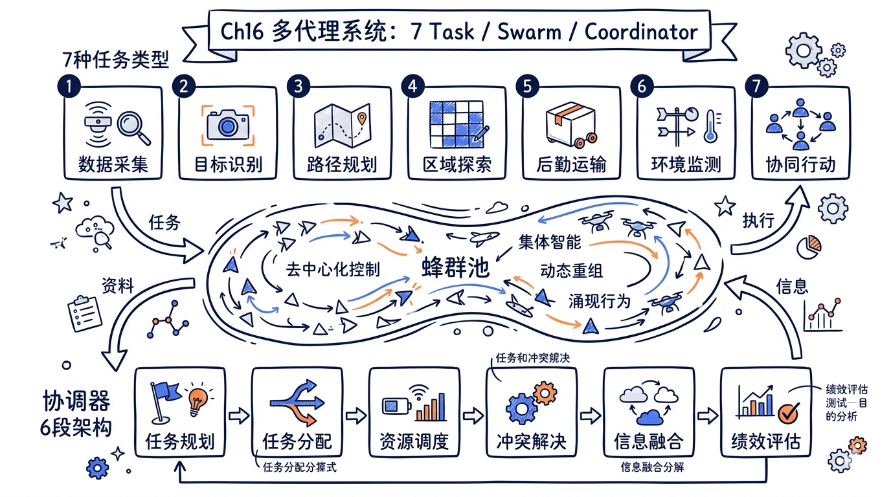
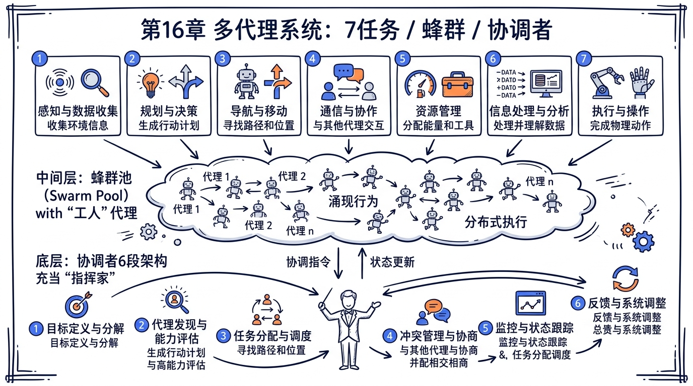
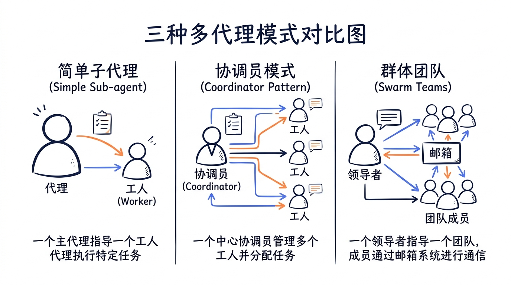

---
layout: default
title: "Ch16 多代理系统"
nav_order: 60
parent: "模块六：多代理与高级特性"
---


# 第十六章 多代理系统 -- Tasks / Swarm / Coordinator / Agent Teams



> **核心命题**：单个 Agent 不够用时怎么办？Claude Code 的回答是：构建一套完整的多代理调度系统 -- 从后台 Task 管理到 Swarm 集群，从 Coordinator 编排到 Agent Teams 协作，用不同粒度的并发原语覆盖从"跑个后台命令"到"十人团队协同开发"的全谱段需求。

## 15.1 Task 系统全景：七种任务类型

Claude Code 的 Task 系统是多代理架构的基石。每种并发工作单元都被抽象为一个 Task，统一注册到 `AppState.tasks` 中管理。

### 15.1.0 7 种 Task 完整 union 列表

下表列出**全部 7 种 Task 类型**及其源码位置（来源：`src/tasks/types.ts` 的 `TaskState` union）：

| # | Task | 源码位置 |
|---|---|---|
| 1 | DreamTask | `src/tasks/DreamTask/` |
| 2 | InProcessTeammateTask | `src/tasks/InProcessTeammateTask/` |
| 3 | LocalAgentTask | `src/tasks/LocalAgentTask/` |
| 4 | LocalShellTask | `src/tasks/LocalShellTask/` |
| 5 | LocalWorkflowTask | （动态创建，定义在 `src/tasks/types.ts`） |
| 6 | MonitorMcpTask | （动态创建，定义在 `src/tasks/types.ts`） |
| 7 | RemoteAgentTask | `src/tasks/RemoteAgentTask/` |

> **注意**：`LocalMainSessionTask`（`src/tasks/LocalMainSessionTask.ts`）是**主会话任务**，不在 7 种 Task union 内。它复用 `local_agent` 的 type 字段，但有独立的 `agentType: 'main-session'` 标识，所以在 15.1.4 节单独讨论。

### 15.1.1 TaskType 枚举与 TaskStateBase

在 `src/Task.ts` 中定义了七种任务类型：

```typescript
// src/Task.ts
export type TaskType =
  | 'local_bash'          // 后台 Shell 命令
  | 'local_agent'         // 本地子代理（同进程 fork）
  | 'remote_agent'        // 远程代理（CCR 云端执行）
  | 'in_process_teammate' // 进程内队友（Swarm 模式）
  | 'local_workflow'      // 工作流脚本（实验性）
  | 'monitor_mcp'         // MCP 监控任务（实验性）
  | 'dream'               // 自动记忆整理（Dream Agent）
```

每个 Task ID 都带有类型前缀，便于识别：

```typescript
const TASK_ID_PREFIXES: Record<string, string> = {
  local_bash: 'b',
  local_agent: 'a',
  remote_agent: 'r',
  in_process_teammate: 't',
  local_workflow: 'w',
  monitor_mcp: 'm',
  dream: 'd',
}
```

所有任务类型共享 `TaskStateBase`：

```typescript
export type TaskStateBase = {
  id: string
  type: TaskType
  status: TaskStatus  // 'pending' | 'running' | 'completed' | 'failed' | 'killed'
  description: string
  toolUseId?: string
  startTime: number
  endTime?: number
  outputFile: string
  outputOffset: number
  notified: boolean
}
```

这种设计形成了一个重要的统一抽象：无论是跑一个 `npm test`、派遣一个研究子代理，还是在云端启动一个 Code Review 会话，在 UI 和生命周期管理层面都走同一套逻辑。



### 15.1.2 LocalShellTask -- 后台命令执行

`LocalShellTask` 是最基础的任务类型，负责在后台执行 Shell 命令。

```typescript
// src/tasks/LocalShellTask/LocalShellTask.tsx
export const LocalShellTask: Task = {
  name: 'LocalShellTask',
  type: 'local_bash',
  async kill(taskId, setAppState) {
    killTask(taskId, setAppState);
  }
};
```

一个值得注意的设计是 **Stall Watchdog** -- 后台命令可能会卡在交互式输入（如 `(y/n)` 提示）上。系统通过定期检测输出文件大小变化和末尾内容模式匹配来识别这种情况：

```typescript
const PROMPT_PATTERNS = [
  /\(y\/n\)/i,
  /\[y\/n\]/i,
  /Press (any key|Enter)/i,
  /Continue\?/i,
  /Overwrite\?/i,
];

function looksLikePrompt(tail: string): boolean {
  const lastLine = tail.trimEnd().split('\n').pop() ?? '';
  return PROMPT_PATTERNS.some(p => p.test(lastLine));
}
```

当检测到命令卡住时，系统会发出 `<task-notification>` 通知主模型，让它决定如何响应。

### 15.1.3 LocalAgentTask -- 本地子代理

`LocalAgentTask` 是整个多代理系统中最核心的任务类型。它管理通过 `AgentTool` 派生的子代理。

```typescript
// src/tasks/LocalAgentTask/LocalAgentTask.tsx
export type LocalAgentTaskState = TaskStateBase & {
  type: 'local_agent';
  agentId: string;
  prompt: string;
  selectedAgent?: AgentDefinition;
  agentType: string;
  model?: string;
  abortController?: AbortController;
  isBackgrounded: boolean;
  pendingMessages: string[];  // SendMessage 排队的消息
  retain: boolean;            // UI 是否保持引用
  diskLoaded: boolean;        // 转录文件是否已加载
  progress?: AgentProgress;
  messages?: Message[];       // 子代理的对话历史
};
```

进度追踪是实时的，`ProgressTracker` 分别计算输入和输出 token：

```typescript
export function createProgressTracker(): ProgressTracker {
  return {
    toolUseCount: 0,
    latestInputTokens: 0,       // Claude API 的 input_tokens 是累积的
    cumulativeOutputTokens: 0,  // output_tokens 需要逐轮累加
    recentActivities: []
  };
}
```

子代理完成后，系统通过 XML 格式的 `<task-notification>` 通知父代理：

```xml
<task-notification>
  <task-id>agent-a1b2c3</task-id>
  <output-file>/path/to/transcript.jsonl</output-file>
  <status>completed</status>
  <summary>Agent "Research auth module" completed</summary>
  <result>Found null pointer in src/auth/validate.ts:42...</result>
  <usage>
    <total_tokens>15000</total_tokens>
    <tool_uses>8</tool_uses>
    <duration_ms>45000</duration_ms>
  </usage>
</task-notification>
```

### 15.1.4 LocalMainSessionTask -- 会话后台化

当用户在主会话中按下 `Ctrl+B` 两次，当前查询会被"后台化" -- 这就是 `LocalMainSessionTask` 的用途：

```typescript
// src/tasks/LocalMainSessionTask.ts
export function registerMainSessionTask(
  description: string,
  setAppState: SetAppState,
  mainThreadAgentDefinition?: AgentDefinition,
  existingAbortController?: AbortController,
): { taskId: string; abortSignal: AbortSignal } {
  const taskId = generateMainSessionTaskId(); // 's' 前缀，区别于 'a' 前缀的子代理
  // ...
  const taskState: LocalMainSessionTaskState = {
    ...createTaskStateBase(taskId, 'local_agent', description),
    agentType: 'main-session',  // 关键区分标识
    isBackgrounded: true,       // 已经是后台状态
    // ...
  };
  registerTask(taskState, setAppState);
  return { taskId, abortSignal: abortController.signal };
}
```

后台化的会话可以被前景化（foreground）-- 用户切换回查看：

```typescript
export function foregroundMainSessionTask(
  taskId: string,
  setAppState: SetAppState,
): Message[] | undefined {
  // 恢复之前被前景化的任务回后台
  // 将目标任务标记为 isBackgrounded: false
  // 返回该任务累积的消息
}
```

### 15.1.5 RemoteAgentTask -- 云端远程执行

`RemoteAgentTask` 管理在 Claude Code Remote (CCR) 环境中执行的代理。它支持多种远程任务类型：

```typescript
const REMOTE_TASK_TYPES = [
  'remote-agent',     // 通用远程代理
  'ultraplan',        // 远程计划生成
  'ultrareview',      // 远程代码审查
  'autofix-pr',       // 自动修复 PR
  'background-pr',    // 后台 PR 处理
] as const;
```

远程任务通过轮询机制跟踪状态，并支持可插拔的完成检测器：

```typescript
export type RemoteTaskCompletionChecker = 
  (metadata: RemoteTaskMetadata | undefined) => Promise<string | null>;

const completionCheckers = new Map<RemoteTaskType, RemoteTaskCompletionChecker>();
```

### 15.1.6 DreamTask -- 记忆整理

`DreamTask` 是一个特殊的后台任务，负责自动记忆整理（memory consolidation）：

```typescript
// src/tasks/DreamTask/DreamTask.ts
export type DreamTaskState = TaskStateBase & {
  type: 'dream';
  phase: DreamPhase;          // 'starting' | 'updating'
  sessionsReviewing: number;   // 正在回顾的会话数
  filesTouched: string[];      // 修改过的文件列表
  turns: DreamTurn[];          // 代理的执行轮次
  priorMtime: number;          // 锁文件的先前修改时间
};
```

Dream Agent 在后台运行，通过一个 4 阶段流程（orient/gather/consolidate/prune）自动整理和更新 CLAUDE.md 中的项目知识。

### 15.1.7 InProcessTeammateTask -- 进程内队友

这是 Swarm 系统中最先进的任务类型。与其他类型在独立进程中运行不同，`InProcessTeammateTask` 在同一个 Node.js 进程中通过 `AsyncLocalStorage` 隔离上下文：

```typescript
// src/tasks/InProcessTeammateTask/types.ts
export type InProcessTeammateTaskState = TaskStateBase & {
  type: 'in_process_teammate';
  identity: TeammateIdentity;     // agentId, agentName, teamName, color
  prompt: string;
  awaitingPlanApproval: boolean;  // 计划模式审批流
  permissionMode: PermissionMode; // 独立的权限模式
  isIdle: boolean;                // 空闲状态
  shutdownRequested: boolean;     // 关闭请求
  pendingUserMessages: string[];  // 待处理的用户消息
  messages?: Message[];           // 对话历史（上限 50 条）
};
```

为了控制内存使用，消息列表有硬性上限：

```typescript
export const TEAMMATE_MESSAGES_UI_CAP = 50;

// BQ 分析显示：500+ 轮会话中每个 Agent 约 20MB RSS，
// 并发 swarm 峰值时每个 Agent 约 125MB。
// 有一次会话在 2 分钟内启动了 292 个 Agent，达到 36.8GB。
```

![Coordinator 模式的工作流图：User -> Coordinator -> [Worker A (Research), Worker B (Research)] -> Coordinator (Synthesis) -> Worker C (Implementation) -> Worker D (Verification) -> Coordinator -> User](images/ch16/04-img04.png)

## 15.2 Swarm 系统深度解析

Swarm 是 Claude Code 的多代理协作框架，位于 `src/utils/swarm/` 目录下。它实现了一个完整的"代理团队"概念，包括后端选择、队友生成、通信机制和生命周期管理。

### 15.2.1 三种执行后端

Swarm 系统通过 `BackendType` 抽象支持三种执行模式：

```typescript
// src/utils/swarm/backends/types.ts
export type BackendType = 'tmux' | 'iterm2' | 'in-process';
```

**tmux 后端**：在 tmux 的分割窗格中运行每个队友，用户可以直接看到各代理的终端输出。适合需要可视化监控的场景。

**iTerm2 后端**：利用 iTerm2 原生的分割窗格（通过 `it2` CLI），提供更好的 macOS 体验。

**in-process 后端**：最高效的模式。队友在同一 Node.js 进程中运行，共享 API 客户端和 MCP 连接，通过 `AsyncLocalStorage` 实现上下文隔离：

```typescript
// src/utils/swarm/backends/InProcessBackend.ts
export class InProcessBackend implements TeammateExecutor {
  readonly type = 'in-process' as const;

  async spawn(config: TeammateSpawnConfig): Promise<TeammateSpawnResult> {
    const result = await spawnInProcessTeammate(
      { name: config.name, teamName: config.teamName, ... },
      this.context,
    );
    // 如果 spawn 成功，启动 agent 执行循环
    if (result.success) {
      startInProcessTeammate(/* ... */);
    }
    return result;
  }
}
```

### 15.2.2 TeamFile -- 团队配置持久化

每个团队的状态通过 JSON 配置文件持久化到 `~/.claude/teams/{team-name}/config.json`：

```typescript
// src/utils/swarm/teamHelpers.ts
export type TeamFile = {
  name: string;
  description?: string;
  createdAt: number;
  leadAgentId: string;
  leadSessionId?: string;
  teamAllowedPaths?: TeamAllowedPath[];  // 团队共享的编辑权限
  members: Array<{
    agentId: string;          // 如 "researcher@my-team"
    name: string;             // 如 "researcher"
    agentType?: string;
    model?: string;
    prompt?: string;
    color?: string;
    planModeRequired?: boolean;
    joinedAt: number;
    tmuxPaneId: string;
    cwd: string;
    worktreePath?: string;    // 独立的 git worktree
    sessionId?: string;
    subscriptions: string[];
    backendType?: BackendType;
    isActive?: boolean;
    mode?: PermissionMode;
  }>;
};
```

Agent ID 采用 `name@teamName` 的格式化方案，类似于邮件地址：

```typescript
export function formatAgentId(name: string, teamName: string): string {
  return `${sanitizeAgentName(name)}@${sanitizeName(teamName)}`;
}
// 例如："researcher@my-project-team"
```

### 15.2.3 队友生成流程

进程内队友的生成流程在 `spawnInProcess.ts` 中实现：

```typescript
// src/utils/swarm/spawnInProcess.ts
export async function spawnInProcessTeammate(
  config: InProcessSpawnConfig,
  context: SpawnContext,
): Promise<InProcessSpawnOutput> {
  const agentId = formatAgentId(name, teamName);
  const taskId = generateTaskId('in_process_teammate');
  
  // 1. 创建独立的 AbortController
  const abortController = createAbortController();
  
  // 2. 创建 TeammateContext（AsyncLocalStorage 隔离用）
  const teammateContext = createTeammateContext({
    agentId, agentName: name, teamName, color,
    planModeRequired, parentSessionId: getSessionId(),
  });
  
  // 3. 构造 TeammateIdentity
  const identity: TeammateIdentity = {
    agentId, agentName: name, teamName, color,
    planModeRequired,
    parentSessionId: getSessionId(),
  };
  
  // 4. 注册到 AppState.tasks
  const taskState: InProcessTeammateTaskState = {
    ...createTaskStateBase(taskId, 'in_process_teammate', name),
    identity,
    prompt,
    abortController,
    awaitingPlanApproval: false,
    permissionMode: planModeRequired ? 'plan' : 'default',
    isIdle: false,
    shutdownRequested: false,
    pendingUserMessages: [],
    // ...
  };
  registerTask(taskState, setAppState);
  
  return { success: true, agentId, taskId, abortController, teammateContext };
}
```

### 15.2.4 进程内执行引擎

`inProcessRunner.ts` 是 Swarm 系统的核心执行引擎。它包装了 `runAgent()` 函数，提供：

- **AsyncLocalStorage 隔离**：通过 `runWithTeammateContext()` 确保每个队友的上下文互不干扰
- **进度追踪**：实时更新 token 消耗和工具使用计数
- **计划模式审批**：当 `planModeRequired` 为 true 时，队友必须先提交计划给 Leader 审批
- **空闲通知**：完成任务后自动通知 Leader

```typescript
// src/utils/swarm/inProcessRunner.ts (概念结构)
async function runInProcessTeammate(config) {
  // 包装在 TeammateContext 中运行
  await runWithTeammateContext(teammateContext, async () => {
    // 包装在 AgentContext 中运行（区分子代理身份）
    await runWithAgentContext(agentContext, async () => {
      // 运行 agent 循环
      const result = await runAgent({
        prompt: config.prompt,
        systemPrompt: baseSystemPrompt + TEAMMATE_SYSTEM_PROMPT_ADDENDUM,
        // 使用自定义的 canUseTool 函数
        // 权限请求通过 Leader 的 UI 代理处理
      });
    });
  });
}
```

### 15.2.5 权限同步机制

进程内队友的权限处理是一个精妙的设计问题。队友需要执行工具（如编辑文件），但权限确认 UI 在 Leader 进程中。

```typescript
// src/utils/swarm/permissionSync.ts
// 队友发送权限请求到 Leader 的信箱
export async function sendPermissionRequestViaMailbox(
  request: PermissionRequest,
): Promise<PermissionDecision> {
  // 写入 Leader 的信箱
  await writeToMailbox(TEAM_LEAD_NAME, {
    from: agentName,
    text: JSON.stringify(request),
    timestamp: new Date().toISOString(),
  });
  
  // 轮询自己的信箱等待响应
  while (!abortSignal.aborted) {
    const response = await readMailbox(agentName);
    if (isPermissionResponse(response)) {
      return response.decision;
    }
    await sleep(PERMISSION_POLL_INTERVAL_MS); // 500ms
  }
}
```

Leader 端通过 `leaderPermissionBridge.ts` 拦截这些请求，将它们路由到自己的 `ToolUseConfirm` 对话框，带上"worker badge"标识这是哪个队友在请求权限。


### 15.2.6 队友通信 -- Mailbox 系统

Swarm 中的所有通信都通过基于文件的 Mailbox 系统进行。每个代理都有自己的"信箱"，其他代理通过 `writeToMailbox()` 写入消息：

```typescript
// src/utils/teammateMailbox.ts（接口概览）
export function writeToMailbox(
  recipientName: string,
  message: TeammateMessage,
  teamName?: string,
): Promise<void>;

export function readMailbox(
  agentName: string,
  teamName?: string,
): Promise<TeammateMessage[]>;

export function createIdleNotification(
  agentName: string,
  opts: { idleReason: string; summary: string },
): IdleNotification;
```

空闲通知是 Swarm 协调的关键机制。当队友完成任务变为空闲时，它通过 Stop Hook 自动通知 Leader：

```typescript
// src/utils/swarm/teammateInit.ts
addFunctionHook(setAppState, sessionId, 'Stop', '',
  async (messages, _signal) => {
    // 标记自己为空闲
    void setMemberActive(teamName, agentName, false);
    
    // 发送空闲通知给 Leader
    const notification = createIdleNotification(agentName, {
      idleReason: 'available',
      summary: getLastPeerDmSummary(messages),
    });
    await writeToMailbox(leadAgentName, {
      from: agentName,
      text: JSON.stringify(notification),
    });
  }
);
```

### 15.2.7 CLI 标志传播

当 Leader 生成队友时，需要将关键的 CLI 配置传播过去。`buildInheritedCliFlags()` 处理这个问题：

```typescript
// src/utils/swarm/spawnUtils.ts
export function buildInheritedCliFlags(options?: {
  planModeRequired?: boolean;
  permissionMode?: PermissionMode;
}): string {
  const flags: string[] = [];
  
  // 权限模式传播（plan mode 优先于 bypass）
  if (planModeRequired) {
    // 不继承 bypass -- 安全第一
  } else if (permissionMode === 'bypassPermissions') {
    flags.push('--dangerously-skip-permissions');
  }
  
  // 模型传播
  const modelOverride = getMainLoopModelOverride();
  if (modelOverride) flags.push(`--model ${quote([modelOverride])}`);
  
  // 插件传播
  for (const pluginDir of getInlinePlugins()) {
    flags.push(`--plugin-dir ${quote([pluginDir])}`);
  }
  
  // Teammate 模式传播
  flags.push(`--teammate-mode ${sessionMode}`);
  
  return flags.join(' ');
}
```

## 15.3 Coordinator 模式

Coordinator 模式是 Claude Code 的"指挥官"架构。在这个模式下，主代理不直接执行工具，而是专注于任务分解、结果综合和用户沟通，将实际工作委派给 Worker 代理。

### 15.3.1 模式激活

```typescript
// src/coordinator/coordinatorMode.ts
export function isCoordinatorMode(): boolean {
  if (feature('COORDINATOR_MODE')) {
    return isEnvTruthy(process.env.CLAUDE_CODE_COORDINATOR_MODE);
  }
  return false;
}
```

Coordinator 模式通过环境变量 `CLAUDE_CODE_COORDINATOR_MODE=1` 激活。系统还支持恢复会话时自动匹配模式：

```typescript
export function matchSessionMode(
  sessionMode: 'coordinator' | 'normal' | undefined,
): string | undefined {
  const currentIsCoordinator = isCoordinatorMode();
  const sessionIsCoordinator = sessionMode === 'coordinator';
  
  if (currentIsCoordinator !== sessionIsCoordinator) {
    // 翻转环境变量以匹配被恢复的会话
    process.env.CLAUDE_CODE_COORDINATOR_MODE = sessionIsCoordinator ? '1' : undefined;
  }
}
```

### 15.3.2 Coordinator 的工具集

Coordinator 只使用三种核心工具，加上一些内部辅助工具：

| 工具 | 用途 |
|------|------|
| `Agent` (AgentTool) | 派生新的 Worker |
| `SendMessage` | 向已存在的 Worker 发送后续指令 |
| `TaskStop` | 停止正在运行的 Worker |

Worker 能使用的工具由 `ASYNC_AGENT_ALLOWED_TOOLS` 常量定义，包括标准的 Bash、Read、Edit、Write 等。

### 15.3.3 Coordinator System Prompt

Coordinator 有一套精心设计的 system prompt，定义了它的行为模式和工作流：

```typescript
export function getCoordinatorSystemPrompt(): string {
  return `You are Claude Code, an AI assistant that orchestrates 
  software engineering tasks across multiple workers.

  ## 1. Your Role
  You are a **coordinator**. Your job is to:
  - Help the user achieve their goal
  - Direct workers to research, implement and verify code changes
  - Synthesize results and communicate with the user
  - Answer questions directly when possible

  ## 4. Task Workflow
  | Phase         | Who              | Purpose                                |
  |---------------|------------------|----------------------------------------|
  | Research      | Workers (parallel)| Investigate codebase, find files       |
  | Synthesis     | **You**           | Read findings, craft implementation specs|
  | Implementation| Workers          | Make targeted changes, commit           |
  | Verification  | Workers          | Test changes work                       |

  ## 5. Writing Worker Prompts
  **Workers can't see your conversation.** Every prompt must be 
  self-contained with everything the worker needs.
  `
}
```

Coordinator 的 prompt 强调几个关键原则：

1. **并行是超能力**：独立的任务应该同时启动多个 Worker
2. **Synthesis 是 Coordinator 最重要的工作**：必须理解研究结果再下达指令
3. **Worker 看不到对话上下文**：每个 prompt 必须自包含
4. **继续 vs 新建的决策**：根据上下文重叠度选择 `SendMessage` 还是新 `Agent`

### 15.3.4 Worker 上下文管理

Coordinator 通过 `getCoordinatorUserContext()` 向 Worker 传递可用工具信息：

```typescript
export function getCoordinatorUserContext(
  mcpClients: ReadonlyArray<{ name: string }>,
  scratchpadDir?: string,
): { [k: string]: string } {
  let content = `Workers spawned via the Agent tool have access to 
    these tools: ${workerTools}`;

  // MCP 服务器也可用
  if (mcpClients.length > 0) {
    content += `\nWorkers also have access to MCP tools from: ${serverNames}`;
  }

  // Scratchpad 目录用于跨 Worker 知识共享
  if (scratchpadDir) {
    content += `\nScratchpad directory: ${scratchpadDir}
    Workers can read and write here without permission prompts.`;
  }
}
```

**Scratchpad 机制**是 Coordinator 模式的一个精妙设计：一个所有 Worker 都可以无需权限读写的共享目录，用于存储跨 Worker 的中间知识。



## 15.4 Agent Teams -- 实验性团队功能

Agent Teams 是 Swarm 系统的高级特性，通过 `TeamCreateTool` 和 `TeamDeleteTool` 管理。

### 15.4.1 TeamCreateTool -- 创建团队

```typescript
// src/tools/TeamCreateTool/TeamCreateTool.ts
export const TeamCreateTool = buildTool({
  name: TEAM_CREATE_TOOL_NAME,
  isEnabled() {
    return isAgentSwarmsEnabled();  // 需要实验性标志
  },
  
  async call(input, context) {
    // 1. 生成唯一团队名
    const teamName = generateUniqueTeamName(input.team_name);
    
    // 2. 创建 TeamFile
    const teamFile: TeamFile = {
      name: teamName,
      description: input.description,
      createdAt: Date.now(),
      leadAgentId: formatAgentId(TEAM_LEAD_NAME, teamName),
      members: [{
        agentId: leadAgentId,
        name: TEAM_LEAD_NAME,
        joinedAt: Date.now(),
        // ...
      }],
    };
    
    // 3. 写入配置文件
    await writeTeamFileAsync(teamName, teamFile);
    
    // 4. 注册清理回调（进程退出时自动清理）
    registerTeamForSessionCleanup(teamName);
    
    // 5. 初始化任务目录
    ensureTasksDir(sanitizedName);
  }
});
```

### 15.4.2 队友管理

团队中的队友管理包括多个维度：

**活动状态追踪**：

```typescript
export async function setMemberActive(
  teamName: string,
  memberName: string,
  isActive: boolean,
): Promise<void> {
  const teamFile = await readTeamFileAsync(teamName);
  const member = teamFile.members.find(m => m.name === memberName);
  if (member && member.isActive !== isActive) {
    member.isActive = isActive;
    await writeTeamFileAsync(teamName, teamFile);
  }
}
```

**权限模式管理**：每个队友可以独立设置权限模式，Leader 可以通过 UI 批量修改：

```typescript
export function setMultipleMemberModes(
  teamName: string,
  modeUpdates: Array<{ memberName: string; mode: PermissionMode }>,
): boolean {
  // 原子操作：一次写入，避免竞态
  const updateMap = new Map(modeUpdates.map(u => [u.memberName, u.mode]));
  let anyChanged = false;
  const updatedMembers = teamFile.members.map(member => {
    const newMode = updateMap.get(member.name);
    if (newMode && member.mode !== newMode) {
      anyChanged = true;
      return { ...member, mode: newMode };
    }
    return member;
  });
  if (anyChanged) writeTeamFile(teamName, { ...teamFile, members: updatedMembers });
}
```

**Git Worktree 隔离**：每个队友可以工作在独立的 git worktree 中，避免互相冲突：

```typescript
async function destroyWorktree(worktreePath: string): Promise<void> {
  // 读取 .git 文件找到主仓库
  // 尝试 git worktree remove --force
  // 失败则 rm -rf 回退
}
```

### 15.4.3 团队清理

会话结束时，系统自动清理未显式删除的团队：

```typescript
export async function cleanupSessionTeams(): Promise<void> {
  const teams = Array.from(getSessionCreatedTeams());
  // 1. 先终止孤儿窗格进程
  await Promise.allSettled(teams.map(name => killOrphanedTeammatePanes(name)));
  // 2. 再清理目录和 worktree
  await Promise.allSettled(teams.map(name => cleanupTeamDirectories(name)));
  sessionCreatedTeams.clear();
}
```

`cleanupTeamDirectories` 的清理顺序很重要：先清理 git worktree，再删除团队目录和任务目录。如果顺序反了，worktree 中的 `.git` 引用就找不到主仓库了。

## 15.5 AgentTool -- 子代理派生核心

`AgentTool` 是所有子代理的统一入口。它的 schema 设计体现了系统的灵活性：

```typescript
// src/tools/AgentTool/AgentTool.tsx
const fullInputSchema = z.object({
  description: z.string(),      // 3-5 词的任务描述
  prompt: z.string(),            // 完整的任务指令
  subagent_type: z.string().optional(), // 子代理类型
  model: z.enum(['sonnet', 'opus', 'haiku']).optional(),
  run_in_background: z.boolean().optional(),
  name: z.string().optional(),   // 可寻址名称
  team_name: z.string().optional(),
  mode: permissionModeSchema().optional(),
  isolation: z.enum(['worktree', 'remote']).optional(),
  cwd: z.string().optional(),    // 工作目录覆盖
});
```

### 15.5.1 内置 Agent 类型

系统预定义了几种 Agent 类型：

```typescript
// src/tools/AgentTool/builtInAgents.ts
export function getBuiltInAgents(): AgentDefinition[] {
  const agents = [
    GENERAL_PURPOSE_AGENT,   // 通用代理
    STATUSLINE_SETUP_AGENT,  // 状态栏配置代理
  ];
  
  if (areExplorePlanAgentsEnabled()) {
    agents.push(EXPLORE_AGENT, PLAN_AGENT);  // 探索和计划代理
  }
  
  if (isNonSdkEntrypoint) {
    agents.push(CLAUDE_CODE_GUIDE_AGENT);    // 使用指南代理
  }
  
  if (isVerificationAgentEnabled()) {
    agents.push(VERIFICATION_AGENT);          // 验证代理
  }
  
  return agents;
}
```

在 Coordinator 模式下，内置代理会切换为 Worker 类型：

```typescript
if (isCoordinatorMode()) {
  const { getCoordinatorAgents } = require('../../coordinator/workerAgent.js');
  return getCoordinatorAgents();
}
```

### 15.5.2 自动后台化

Agent 任务支持自动后台化，避免长时间运行的任务阻塞用户交互：

```typescript
function getAutoBackgroundMs(): number {
  if (isEnvTruthy(process.env.CLAUDE_AUTO_BACKGROUND_TASKS) || 
      getFeatureValue_CACHED_MAY_BE_STALE('tengu_auto_background_agents', false)) {
    return 120_000;  // 2 分钟后自动后台化
  }
  return 0;  // 禁用
}
```

## 15.6 SendMessageTool -- 多代理通信枢纽

`SendMessageTool` 是多代理系统中最重要的通信工具。它支持多种通信模式：

### 15.6.1 基于 agentId 的直接通信

```typescript
// 向已存在的 Worker 发送消息（Coordinator 模式）
if (typeof input.message === 'string' && input.to !== '*') {
  const registered = appState.agentNameRegistry.get(input.to);
  const agentId = registered ?? toAgentId(input.to);
  
  if (task.status === 'running') {
    // 运行中的任务：消息排队到下一个 tool-round 边界
    queuePendingMessage(agentId, input.message, setAppState);
  } else {
    // 已停止的任务：自动恢复
    await resumeAgentBackground({ agentId, prompt: input.message, ... });
  }
}
```

### 15.6.2 基于 Mailbox 的团队通信

```typescript
// 点对点消息
async function handleMessage(recipientName, content, summary, context) {
  await writeToMailbox(recipientName, {
    from: senderName,
    text: content,
    summary,
    timestamp: new Date().toISOString(),
    color: senderColor,
  });
}

// 广播消息
async function handleBroadcast(content, summary, context) {
  for (const member of teamFile.members) {
    if (member.name !== senderName) {
      await writeToMailbox(member.name, { from: senderName, text: content, ... });
    }
  }
}
```

### 15.6.3 结构化消息

除了纯文本消息，`SendMessageTool` 还支持结构化消息协议：

```typescript
const StructuredMessage = z.discriminatedUnion('type', [
  // 关闭请求 -- 队友请求关闭时使用
  z.object({ type: z.literal('shutdown_request'), reason: z.string().optional() }),
  
  // 关闭响应 -- 队友回复关闭请求
  z.object({ type: z.literal('shutdown_response'), 
    request_id: z.string(), approve: boolean, reason: z.string().optional() }),
  
  // 计划审批响应 -- Leader 审批队友的计划
  z.object({ type: z.literal('plan_approval_response'),
    request_id: z.string(), approve: boolean, feedback: z.string().optional() }),
]);
```

关闭流程是双向协商的：

```
Leader -> SendMessage(to: "researcher", message: { type: "shutdown_request", reason: "work done" })
Researcher -> SendMessage(to: "team-lead", message: { type: "shutdown_response", approve: true })
// 或者 Researcher 拒绝: { type: "shutdown_response", approve: false, reason: "still working" }
```

### 15.6.4 跨会话通信（UDS / Bridge）

最新版本还支持通过 Unix Domain Socket 和 Remote Control Bridge 进行跨会话通信：

```typescript
// UDS 路径 -- 向本地其他 Claude 实例发送消息
if (addr.scheme === 'uds') {
  await sendToUdsSocket(addr.target, input.message);
}

// Bridge 路径 -- 向远程 Claude 实例发送消息（需要安全确认）
if (addr.scheme === 'bridge') {
  await postInterClaudeMessage(addr.target, input.message);
}
```

Bridge 通信的权限检查特别严格 -- 它走 `safetyCheck` 通道而非普通权限，即使在 bypass 模式下也需要用户确认：

```typescript
async checkPermissions(input, _context) {
  if (parseAddress(input.to).scheme === 'bridge') {
    return {
      behavior: 'ask',
      message: 'Send a message to Remote Control session?',
      decisionReason: {
        type: 'safetyCheck',
        reason: 'Cross-machine bridge message requires explicit user consent',
        classifierApprovable: false,  // 分类器不能自动批准
      },
    };
  }
}
```

## 15.7 实践场景：多代理系统的运用模式

### 场景一：并行研究 + 串行实现

```
User: "修复 auth 模块中的空指针异常"

Coordinator:
  Agent({ description: "Investigate auth", prompt: "Research src/auth/..." })
  Agent({ description: "Research tests", prompt: "Find test files for auth..." })
  
// 两个 Worker 并行研究

Worker A 完成 -> <task-notification> 发现问题在 validate.ts:42

Coordinator (Synthesis):
  "Found bug -- null pointer in validate.ts:42"
  SendMessage({ to: "agent-a1b", message: "Fix the null pointer..." })
  
// 继续同一个 Worker（上下文重叠度高）
```

### 场景二：Swarm 团队协作

```
Leader:
  TeamCreate({ team_name: "auth-fix", description: "Fix authentication bugs" })
  Agent({ name: "researcher", team_name: "auth-fix", prompt: "..." })
  Agent({ name: "tester", team_name: "auth-fix", prompt: "..." })

// researcher 和 tester 分别在独立 worktree 中工作
// 通过 SendMessage 和 Mailbox 通信
// Leader 通过 UI 监控进度和审批权限请求
```

### 场景三：Dream Agent 自动整理

```
// 系统检测到会话结束，自动启动 Dream Agent
DreamTask:
  phase: 'starting'
  sessionsReviewing: 5  // 回顾最近 5 个会话
  
// Dream Agent 自动整理 CLAUDE.md
DreamTask:
  phase: 'updating'
  filesTouched: ['.claude/CLAUDE.md']
  turns: [
    { text: "Identified 3 new patterns...", toolUseCount: 2 },
    { text: "Updated project knowledge...", toolUseCount: 1 },
  ]
```


## 15.8 动手实践

### 练习 1：实现简化版 Task Registry

```typescript
// 目标：实现一个 Task 注册表，支持注册、查询和状态更新

type SimpleTaskState = {
  id: string;
  type: 'agent' | 'shell';
  status: 'running' | 'completed' | 'failed';
  description: string;
  startTime: number;
  endTime?: number;
  result?: string;
};

class TaskRegistry {
  private tasks = new Map<string, SimpleTaskState>();
  private listeners = new Set<(tasks: Map<string, SimpleTaskState>) => void>();

  register(task: SimpleTaskState): void {
    this.tasks.set(task.id, task);
    this.notify();
  }

  update(taskId: string, updater: (t: SimpleTaskState) => SimpleTaskState): void {
    const task = this.tasks.get(taskId);
    if (!task) return;
    this.tasks.set(taskId, updater(task));
    this.notify();
  }

  getRunning(): SimpleTaskState[] {
    return [...this.tasks.values()].filter(t => t.status === 'running');
  }

  subscribe(listener: (tasks: Map<string, SimpleTaskState>) => void): () => void {
    this.listeners.add(listener);
    return () => this.listeners.delete(listener);
  }

  private notify(): void {
    for (const listener of this.listeners) {
      listener(this.tasks);
    }
  }
}
```

### 练习 2：实现 Mailbox 通信系统

```typescript
// 目标：实现基于文件的 Mailbox 系统

import { readFile, writeFile, mkdir } from 'fs/promises';
import { join } from 'path';

type MailboxMessage = {
  from: string;
  text: string;
  timestamp: string;
  read?: boolean;
};

class FileMailbox {
  constructor(private baseDir: string) {}

  async send(to: string, message: MailboxMessage): Promise<void> {
    const dir = join(this.baseDir, to);
    await mkdir(dir, { recursive: true });
    const messages = await this.readAll(to);
    messages.push(message);
    await writeFile(join(dir, 'inbox.json'), JSON.stringify(messages));
  }

  async readAll(agentName: string): Promise<MailboxMessage[]> {
    try {
      const content = await readFile(
        join(this.baseDir, agentName, 'inbox.json'), 'utf-8'
      );
      return JSON.parse(content);
    } catch {
      return [];
    }
  }

  async readUnread(agentName: string): Promise<MailboxMessage[]> {
    const all = await this.readAll(agentName);
    return all.filter(m => !m.read);
  }

  async markAsRead(agentName: string, index: number): Promise<void> {
    const messages = await this.readAll(agentName);
    if (messages[index]) {
      messages[index].read = true;
      await writeFile(
        join(this.baseDir, agentName, 'inbox.json'), 
        JSON.stringify(messages)
      );
    }
  }
}
```

### 练习 3：实现简化版 Coordinator

```typescript
// 目标：实现一个 Coordinator，将用户任务分解为并行 Worker

type WorkerResult = {
  workerId: string;
  status: 'completed' | 'failed';
  result: string;
};

class SimpleCoordinator {
  private workers = new Map<string, AbortController>();
  private results: WorkerResult[] = [];

  async dispatch(tasks: Array<{ id: string; prompt: string }>): Promise<void> {
    // 并行启动所有 Worker
    const promises = tasks.map(task => this.runWorker(task.id, task.prompt));
    await Promise.allSettled(promises);
  }

  private async runWorker(id: string, prompt: string): Promise<void> {
    const controller = new AbortController();
    this.workers.set(id, controller);
    
    try {
      // 模拟 Worker 执行
      const result = await this.executeTask(prompt, controller.signal);
      this.results.push({ workerId: id, status: 'completed', result });
    } catch (error) {
      this.results.push({ workerId: id, status: 'failed', result: String(error) });
    } finally {
      this.workers.delete(id);
    }
  }

  stopWorker(id: string): void {
    this.workers.get(id)?.abort();
  }

  synthesize(): string {
    // Coordinator 的核心职责：综合 Worker 结果
    const completed = this.results.filter(r => r.status === 'completed');
    const failed = this.results.filter(r => r.status === 'failed');
    return `Completed: ${completed.length}, Failed: ${failed.length}\n` +
      completed.map(r => `[${r.workerId}] ${r.result}`).join('\n');
  }

  private async executeTask(prompt: string, signal: AbortSignal): Promise<string> {
    // 实际实现中调用 Claude API
    return `Result for: ${prompt}`;
  }
}
```

## 15.9 源码对照表

| 概念 | 源码路径 | 说明 |
|------|----------|------|
| Task 类型定义 | `src/Task.ts` | TaskType, TaskStateBase, TaskStatus |
| Task 联合类型 | `src/tasks/types.ts` | TaskState 联合类型和 isBackgroundTask |
| Task 注册表 | `src/tasks.ts` | getAllTasks(), getTaskByType() |
| LocalShellTask | `src/tasks/LocalShellTask/LocalShellTask.tsx` | 后台 Shell 命令，Stall Watchdog |
| LocalAgentTask | `src/tasks/LocalAgentTask/LocalAgentTask.tsx` | 子代理生命周期，Progress 追踪 |
| LocalMainSessionTask | `src/tasks/LocalMainSessionTask.ts` | 会话后台化，Ctrl+B 支持 |
| RemoteAgentTask | `src/tasks/RemoteAgentTask/RemoteAgentTask.tsx` | 远程代理，CCR 集成 |
| DreamTask | `src/tasks/DreamTask/DreamTask.ts` | 记忆整理后台任务 |
| InProcessTeammateTask | `src/tasks/InProcessTeammateTask/` | 进程内队友类型定义和操作 |
| Swarm 常量 | `src/utils/swarm/constants.ts` | TEAM_LEAD_NAME, socket 命名 |
| Team 配置 | `src/utils/swarm/teamHelpers.ts` | TeamFile, 读写团队配置 |
| 队友生成 | `src/utils/swarm/spawnInProcess.ts` | 进程内队友创建 |
| 队友生成 (tmux) | `src/utils/swarm/spawnUtils.ts` | CLI 标志传播，环境变量继承 |
| 执行引擎 | `src/utils/swarm/inProcessRunner.ts` | 进程内队友的 agent 循环 |
| 队友初始化 | `src/utils/swarm/teammateInit.ts` | 注册 Stop hook，空闲通知 |
| 队友模型选择 | `src/utils/swarm/teammateModel.ts` | 默认 Claude Opus 4.6 |
| 权限同步 | `src/utils/swarm/permissionSync.ts` | Mailbox-based 权限请求 |
| Leader 权限桥 | `src/utils/swarm/leaderPermissionBridge.ts` | UI 代理权限确认 |
| 后端类型 | `src/utils/swarm/backends/types.ts` | PaneBackend, TeammateExecutor |
| in-process 后端 | `src/utils/swarm/backends/InProcessBackend.ts` | AsyncLocalStorage 隔离 |
| tmux 后端 | `src/utils/swarm/backends/TmuxBackend.ts` | tmux 窗格管理 |
| iTerm2 后端 | `src/utils/swarm/backends/ITermBackend.ts` | iTerm2 窗格管理 |
| 后端检测 | `src/utils/swarm/backends/detection.ts` | 自动检测可用后端 |
| 后端注册 | `src/utils/swarm/backends/registry.ts` | 后端注册和选择 |
| 队友 Prompt | `src/utils/swarm/teammatePromptAddendum.ts` | 队友专用 system prompt 补充 |
| Coordinator 模式 | `src/coordinator/coordinatorMode.ts` | 模式检测，system prompt，用户上下文 |
| AgentTool | `src/tools/AgentTool/AgentTool.tsx` | 子代理派生入口 |
| 内置 Agent | `src/tools/AgentTool/builtInAgents.ts` | 预定义 Agent 类型 |
| Agent 定义加载 | `src/tools/AgentTool/loadAgentsDir.ts` | 从文件系统加载自定义 Agent |
| Agent 运行 | `src/tools/AgentTool/runAgent.ts` | 子代理执行循环 |
| Agent 恢复 | `src/tools/AgentTool/resumeAgent.ts` | 恢复已停止的 Agent |
| SendMessageTool | `src/tools/SendMessageTool/SendMessageTool.ts` | 多代理通信枢纽 |
| TeamCreateTool | `src/tools/TeamCreateTool/TeamCreateTool.ts` | 团队创建 |
| TeamDeleteTool | `src/tools/TeamDeleteTool/TeamDeleteTool.ts` | 团队清理 |

## 15.10 本章小结

Claude Code 的多代理系统体现了"从简单到复杂"的渐进式设计哲学：

1. **Task 系统** 提供了统一的并发工作单元抽象。七种类型从轻量的后台 Shell 命令到复杂的远程代理，覆盖了所有需求场景。关键设计决策是用 `AppState.tasks` 集中管理所有任务的生命周期。

2. **Swarm 系统** 是一个完整的多代理执行框架。三种后端（tmux/iTerm2/in-process）适配不同运行环境，其中 in-process 后端通过 `AsyncLocalStorage` 实现了零开销的上下文隔离。进程内队友共享 API 客户端和 MCP 连接，显著降低了资源消耗。

3. **Coordinator 模式** 将"执行者"拆分为"指挥官 + Worker 群"。Coordinator 专注于任务分解和结果综合，Worker 负责实际执行。Scratchpad 机制提供了优雅的跨 Worker 知识共享方案。

4. **通信机制** 分为三层：基于 `pendingMessages` 的进程内消息队列（最快）、基于文件 Mailbox 的团队通信（Swarm）、基于 XML `<task-notification>` 的任务完成通知（Coordinator）。每层针对不同的延迟和可靠性需求。

5. **安全设计** 贯穿始终。权限模式的传播遵循"plan mode 优先于 bypass"原则；跨机器的 Bridge 通信即使在 bypass 模式下也需要用户确认；团队共享权限（teamAllowedPaths）由 Leader 控制。

这套系统的工程复杂度相当高 -- 仅 Swarm 子系统就有 14 个文件、涉及文件 I/O、进程管理、异步隔离和 UI 集成等多个层面。但它为构建真正的"AI 团队"提供了坚实的基础设施。

## 思考题

7 种 Task 类型中，你打算先在哪种场景下复用 Coordinator 模式？

欢迎在评论区聊聊你的想法。

下一讲，我们换个角度看《Feature Flags、Analytics、Cost Tracking》。

