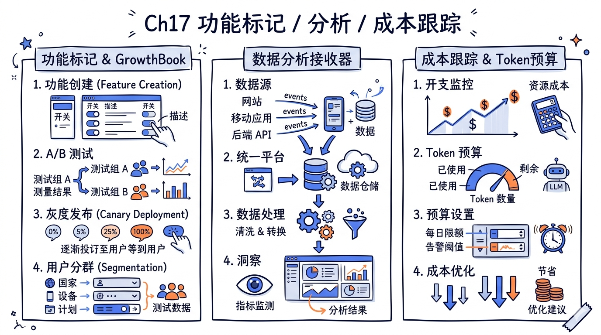
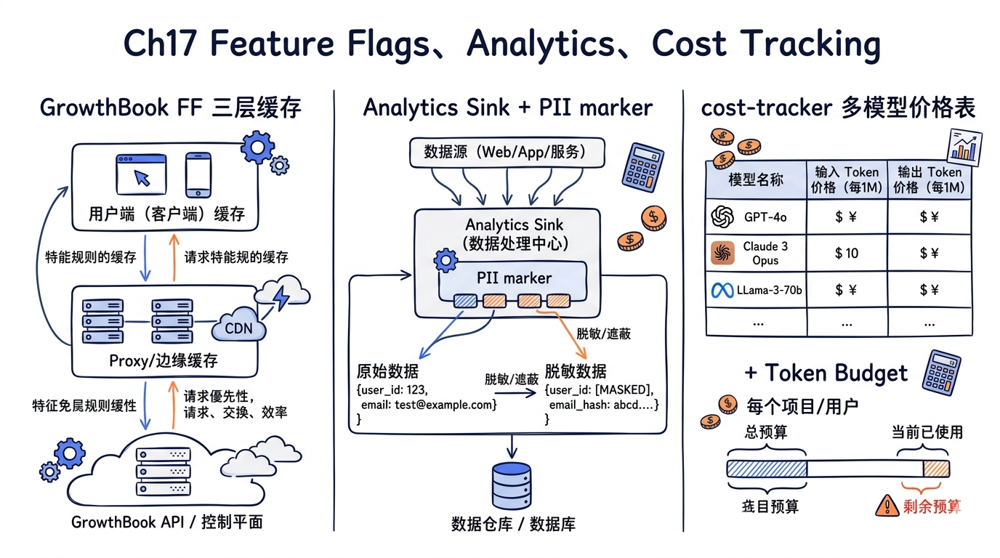
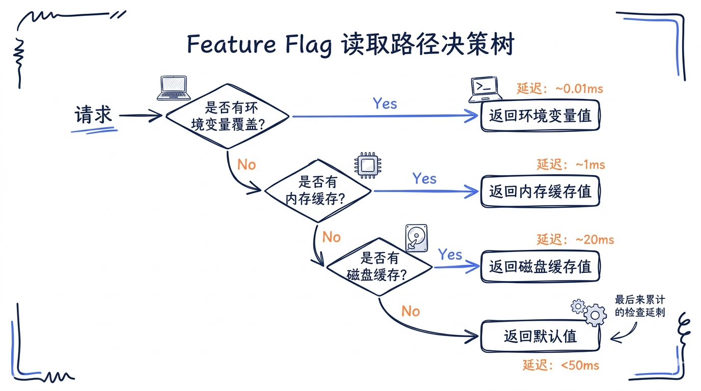
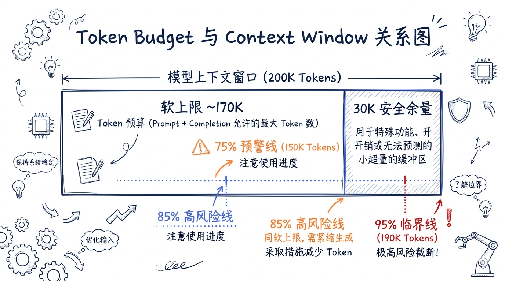
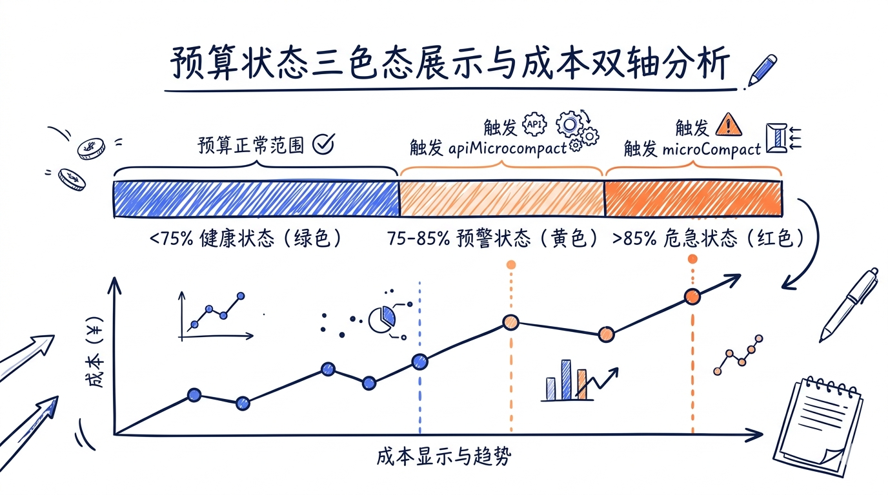
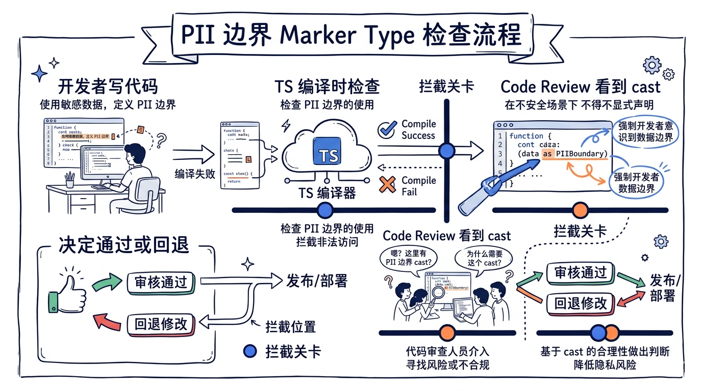
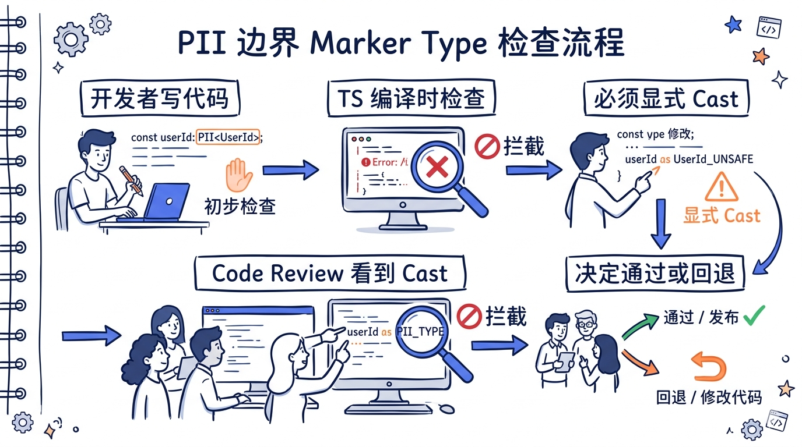

---
layout: default
title: "17 Feature Flags & Analytics"
nav_order: 61
parent: "模块六：多代理与高级特性"
---


# 第十七章 Feature Flags、Analytics、Cost Tracking



> **核心命题**：一个成熟的 Agent 产品不只是"能跑起来"。它需要 Feature Flag 系统控制功能灰度发布，需要 Analytics 管线收集运行数据，需要 Cost Tracking 让用户随时看清账单，需要 Token Budget 让上下文不至于被无声地撑爆，需要清晰的 Telemetry 隐私边界。本章深入这些"可观测产品"基础设施的源码实现，揭示 Claude Code 如何把一个 CLI Agent 打造成可监控、可计费、可审计的工程化平台。

## 17.1 GrowthBook Feature Flags 系统

Claude Code 使用 GrowthBook 作为 Feature Flag 和 A/B 测试平台。整个系统的实现在 `src/services/analytics/growthbook.ts` 中,约 1150 行代码,是整个代码库中最精密的配置管理模块之一。它不仅是"读一下 flag 值"的简单封装,而是一个完整的客户端配置子系统:包括缓存、刷新、覆盖、订阅、退出降级等多个职责。如果用一句话概括它的复杂度,可以这样说:**它把"远程下发的配置"做到了"本地变量一样可靠"**。

### 17.1.1 为什么需要 Feature Flags

如果在一个早期阶段的产品里,直接把所有配置硬编码进代码,然后通过版本发布更新——这种方式简单直接,但有三个致命问题:**升级延迟**(用户必须主动更新才能拿到新行为)、**回滚困难**(出问题需要再发版)、**实验昂贵**(每次 A/B 实验都要分支代码)。Feature Flag 通过把"配置和代码分离",让这三个问题都得到解决。

Feature Flags 在 Claude Code 中扮演着多重角色：

1. **灰度发布**：新功能先对内部用户（ant）开放，再逐步推广
2. **A/B 测试**：通过 Experiment 机制对比不同实现的效果
3. **紧急开关**：出现问题时通过 Killswitch 立即禁用特定功能
4. **配置分发**：Dynamic Config 下发复杂的运行时参数（如采样率、模型列表）
5. **用户分群**：基于订阅类型、组织、平台等属性定向投放功能



### 17.1.2 客户端初始化

GrowthBook 客户端采用 `memoize` 模式确保单例：

```typescript
// src/services/analytics/growthbook.ts
const getGrowthBookClient = memoize((): { 
  client: GrowthBook; 
  initialized: Promise<void> 
} | null => {
  if (!isGrowthBookEnabled()) return null;

  const attributes = getUserAttributes();  // 用户标识信息
  const clientKey = getGrowthBookClientKey();
  
  const thisClient = new GrowthBook({
    apiHost: 'https://api.anthropic.com/',
    clientKey,
    attributes,
    remoteEval: true,  // 关键：服务端评估，客户端不持有规则
    cacheKeyAttributes: ['id', 'organizationUUID'],
  });
  
  const initialized = thisClient.init({ timeout: 5000 })
    .then(async result => {
      const hadFeatures = await processRemoteEvalPayload(thisClient);
      if (hadFeatures) {
        syncRemoteEvalToDisk();     // 同步到磁盘缓存
        refreshed.emit();           // 通知订阅者
      }
    });
  
  return { client: thisClient, initialized };
});
```

这里有一个关键的设计决策：**remoteEval: true**。这意味着所有的 Flag 评估都在服务端完成，客户端只接收评估结果。好处是规则可以任意复杂且实时更新，客户端不需要理解评估逻辑。

### 17.1.3 用户属性（Targeting Attributes）

GrowthBook 通过用户属性进行精准投放：

```typescript
export type GrowthBookUserAttributes = {
  id: string;                    // 设备 ID
  sessionId: string;             // 会话 ID
  deviceID: string;              // 设备唯一标识
  platform: 'win32' | 'darwin' | 'linux';
  apiBaseUrlHost?: string;       // API 代理主机名（企业部署）
  organizationUUID?: string;     // 组织 ID
  accountUUID?: string;          // 账户 ID
  userType?: string;             // 'ant'（内部）或外部
  subscriptionType?: string;     // 订阅类型
  rateLimitTier?: string;        // 速率限制层级
  firstTokenTime?: number;       // 首次使用时间
  email?: string;                // 邮箱
  appVersion?: string;           // 应用版本
  github?: GitHubActionsMetadata; // GitHub CI 信息
};
```

注意 `apiBaseUrlHost` 属性 -- 它用于识别通过企业代理（Epic、Marble 等）连接的用户，这些用户通常使用 `apiKeyHelper` 认证而没有 organizationUUID。

### 17.1.4 三层缓存策略

Feature Flag 系统的核心难题是:**配置的"新鲜度"和"可用性"是矛盾的**。要新鲜,就必须每次都查服务器,但服务器可能不可达;要可用,就必须有本地缓存,但缓存可能过期。三层缓存策略是这个矛盾的标准解法。

Feature Flag 的值通过三层缓存提供，每层有不同的延迟和新鲜度特性：

**第一层：内存缓存（remoteEvalFeatureValues Map）**

```typescript
const remoteEvalFeatureValues = new Map<string, unknown>();

// processRemoteEvalPayload 在每次成功的网络请求后重建此 Map
async function processRemoteEvalPayload(gbClient: GrowthBook): Promise<boolean> {
  const payload = gbClient.getPayload();
  if (!payload?.features || Object.keys(payload.features).length === 0) {
    return false;  // 空 payload 不清空缓存 -- 防止全局 flag 失效
  }
  
  remoteEvalFeatureValues.clear();
  for (const [key, feature] of Object.entries(transformedFeatures)) {
    const v = 'value' in feature ? feature.value : feature.defaultValue;
    if (v !== undefined) {
      remoteEvalFeatureValues.set(key, v);
    }
  }
  return true;
}
```

**第二层：磁盘缓存（~/.claude.json 中的 cachedGrowthBookFeatures）**

```typescript
function syncRemoteEvalToDisk(): void {
  const fresh = Object.fromEntries(remoteEvalFeatureValues);
  const config = getGlobalConfig();
  if (isEqual(config.cachedGrowthBookFeatures, fresh)) return;
  
  saveGlobalConfig(current => ({
    ...current,
    cachedGrowthBookFeatures: fresh,
  }));
}
```

**第三层：默认值（调用方提供的 fallback）**

三层的查询优先级：

```typescript
export function getFeatureValue_CACHED_MAY_BE_STALE<T>(
  feature: string,
  defaultValue: T,
): T {
  // 0. 环境变量覆盖（eval harness 用）
  const overrides = getEnvOverrides();
  if (overrides && feature in overrides) return overrides[feature] as T;
  
  // 0.5 Config 覆盖（ant 用户的 /config Gates 页面）
  const configOverrides = getConfigOverrides();
  if (configOverrides && feature in configOverrides) return configOverrides[feature] as T;
  
  // 1. 内存缓存 -- 最新，init 后可用
  if (remoteEvalFeatureValues.has(feature)) {
    return remoteEvalFeatureValues.get(feature) as T;
  }
  
  // 2. 磁盘缓存 -- 跨进程持久化
  try {
    const cached = getGlobalConfig().cachedGrowthBookFeatures?.[feature];
    return cached !== undefined ? (cached as T) : defaultValue;
  } catch {
    return defaultValue;  // 3. 默认值
  }
}
```

### 17.1.5 覆盖机制

系统提供了多层覆盖能力，优先级从高到低：

| 层级 | 机制 | 用途 |
|------|------|------|
| 环境变量 | `CLAUDE_INTERNAL_FC_OVERRIDES='{...}'` | Eval harness 确定性测试 |
| Config 覆盖 | `/config` Gates 页面设置 | Ant 用户实时调试 |
| 内存值 | GrowthBook remoteEval 结果 | 正常运行时 |
| 磁盘缓存 | `~/.claude.json` 中的值 | 冷启动 / 离线 |
| 默认值 | 调用方 `defaultValue` 参数 | 兜底 |

Config 覆盖的实现支持实时修改：

```typescript
export function setGrowthBookConfigOverride(
  feature: string,
  value: unknown,
): void {
  if (process.env.USER_TYPE !== 'ant') return;
  saveGlobalConfig(c => {
    const current = c.growthBookOverrides ?? {};
    if (value === undefined) {
      // 删除覆盖
      const { [feature]: _, ...rest } = current;
      return { ...c, growthBookOverrides: rest };
    }
    return { ...c, growthBookOverrides: { ...current, [feature]: value } };
  });
  refreshed.emit();  // 立即通知订阅者
}
```

这种"覆盖能力"特别重要的场景是 **eval harness**——Anthropic 内部用来跑大规模回归测试的工具。eval harness 需要确定性的 flag 值,任何远程波动都会让测试结果不可比。环境变量覆盖让 harness 可以一行 cmd 锁死所有 flag 值,确保测试结果可以跨天对比。

### 17.1.6 定期刷新

长时间运行的会话通过定期刷新保持 Flag 值的新鲜度：

```typescript
const GROWTHBOOK_REFRESH_INTERVAL_MS = 
  process.env.USER_TYPE !== 'ant'
    ? 6 * 60 * 60 * 1000   // 外部用户：6 小时
    : 20 * 60 * 1000;       // 内部用户：20 分钟

export function setupPeriodicGrowthBookRefresh(): void {
  refreshInterval = setInterval(() => {
    void refreshGrowthBookFeatures();
  }, GROWTHBOOK_REFRESH_INTERVAL_MS);
  refreshInterval.unref?.();  // 不阻止进程退出
}
```

轻量刷新（light refresh）只拉取新的 Feature 值，不重建客户端：

```typescript
export async function refreshGrowthBookFeatures(): Promise<void> {
  const growthBookClient = await initializeGrowthBook();
  await growthBookClient.refreshFeatures();
  
  // 防止使用被替换的旧客户端的 payload
  if (growthBookClient !== client) return;
  
  const hadFeatures = await processRemoteEvalPayload(growthBookClient);
  if (hadFeatures) {
    syncRemoteEvalToDisk();
    refreshed.emit();
  }
}
```

### 17.1.7 Experiment 跟踪

A/B 测试的曝光事件通过 1P Event Logger 记录：

```typescript
function logExposureForFeature(feature: string): void {
  if (loggedExposures.has(feature)) return;  // 会话内去重
  
  const expData = experimentDataByFeature.get(feature);
  if (expData) {
    loggedExposures.add(feature);
    logGrowthBookExperimentTo1P({
      experimentId: expData.experimentId,
      variationId: expData.variationId,
      userAttributes: getUserAttributes(),
      experimentMetadata: { feature_id: feature },
    });
  }
}
```

这种"刷新间隔差异"是教科书级的"内部用户优先"工程实践。内部用户(Anthropic 员工、合作研究者)需要快速看到 flag 改动的效果——20 分钟在他们日常工作里是可接受的等待。外部用户对延迟不敏感(他们不会主动观察 flag 切换),用 6 小时间隔显著降低 GrowthBook 服务端负载。

### 17.1.8 安全相关的 Gate 函数

系统为不同的安全级别提供了不同的读取函数：

```typescript
// 阻塞式 -- 等待初始化完成
export async function checkSecurityRestrictionGate(gate: string): Promise<boolean> {
  if (reinitializingPromise) {
    await reinitializingPromise;  // 登录变更时等待重新初始化
  }
  // Statsig 缓存优先（安全保守策略）
  const statsigCached = config.cachedStatsigGates?.[gate];
  if (statsigCached !== undefined) return Boolean(statsigCached);
  // 再查 GrowthBook 缓存
  const gbCached = config.cachedGrowthBookFeatures?.[gate];
  return gbCached !== undefined ? Boolean(gbCached) : false;
}

// 缓存或阻塞 -- 缓存说 true 就用，否则等服务器
export async function checkGate_CACHED_OR_BLOCKING(gate: string): Promise<boolean> {
  // 快路径：磁盘缓存已经是 true -- 信任它
  const cached = getGlobalConfig().cachedGrowthBookFeatures?.[gate];
  if (cached === true) return true;
  // 慢路径：可能是过期的 false -- 等服务器响应
  return getFeatureValueInternal(gate, false, true);
}
```

`checkGate_CACHED_OR_BLOCKING` 的设计哲学：对于用户付费功能（如 Remote Control），过时的 false 会不公平地阻止合法用户，但过时的 true 是可接受的（服务端是真正的守门人）。



## 17.2 Analytics 管线

Claude Code 的 Analytics 系统由多个层次组成，从事件产生到最终存储形成了一条完整的管线。这条管线从代码上看跨越了七八个文件,但内部职责非常清晰——每个文件只做一件事,文件之间通过明确的接口契约串联。这种"小文件 + 强边界"的组织方式是 Claude Code 后端遥测代码的典型风格,后续读者会在 cost-tracker、tokenBudget 等模块看到同样的模式。

### 17.2.0 Analytics 设计的两个核心张力

进入实现细节前,先说明 Analytics 系统的两个核心张力。理解这两个张力,就理解了为什么它的代码结构看起来比一般日志库复杂。

**张力一:实时性 vs 批量发送**。Analytics 事件的产生频率非常高(高峰可达每秒数十次),如果每个事件都立即发出 HTTP 请求,网络与电池消耗都会爆炸;但如果延迟太长才批量发送,用户在崩溃前的最后几秒事件就会丢失。Claude Code 的解法是**双队列 + 周期性 flush + 退出时强制 flush**——平时按 15 秒间隔批量发送,进程退出时同步 flush 防止丢失。

**张力二:遥测完整性 vs PII 保护**。运营团队想看到尽可能详细的事件数据(用了哪个工具、参数是什么、结果如何),但用户代码与文件路径绝不能流出。这两个目标在普通设计中常常冲突——开发者图方便就把所有 metadata 都打上去,然后某次 review 发现某字段含 PII,需要紧急回滚事件 schema。Claude Code 用 marker type 提前固化"哪些字段是安全的、哪些必须显式签字",把这个张力转化为编译期约束。

### 17.2.1 事件产生层：logEvent

为什么这个文件要"零依赖"?因为它是被几乎所有模块调用的"基础设施层"。如果它依赖了某个业务模块,就会产生循环依赖——业务模块依赖 logEvent,logEvent 又依赖业务模块。Claude Code 通过把 logEvent 设计为"不依赖任何业务代码,事件先排队、sink 挂载后再消费"的模式,彻底切断了这种循环依赖。

事件产生的入口在 `src/services/analytics/index.ts` -- 一个设计上"零依赖"的模块：

```typescript
// src/services/analytics/index.ts
// 这个模块有 NO 依赖 -- 避免循环引用
// 事件排队到 sink attach 为止

export type AnalyticsMetadata_I_VERIFIED_THIS_IS_NOT_CODE_OR_FILEPATHS = never;

export function logEvent(
  eventName: string,
  metadata: { [key: string]: boolean | number | undefined },
): void {
  if (sink === null) {
    eventQueue.push({ eventName, metadata, async: false });
    return;
  }
  sink.logEvent(eventName, metadata);
}
```

这个 marker type 是一个巧妙的防护措施。`AnalyticsMetadata_I_VERIFIED_THIS_IS_NOT_CODE_OR_FILEPATHS` 是 `never` 类型 -- 无法实际赋值。调用方必须显式 cast：

```typescript
logEvent('tengu_some_event', {
  tool_name: toolName as AnalyticsMetadata_I_VERIFIED_THIS_IS_NOT_CODE_OR_FILEPATHS,
});
```

这个 cast 起到"签名"作用：开发者必须手动确认"这个值不包含代码或文件路径"。如果忘记验证就直接传字符串，TypeScript 编译器会报错。

### 17.2.2 Sink 挂载与事件排队

启动期事件队列是 Claude Code Analytics 的"零事件丢失保证"。一个进程可能在启动的前 50ms 内就产生了若干事件(如 `tengu_init` 启动事件本身),但 sink 挂载需要等待初始化、配置加载等异步流程——通常需要几百毫秒。如果没有事件队列,这部分启动期事件就会丢失,而它们恰恰是排查启动失败问题最关键的数据。事件队列让"启动前先记下来,启动后再发送"成为可能。

Analytics sink 在应用启动时挂载。启动前产生的事件会被排队：

```typescript
const eventQueue: QueuedEvent[] = [];
let sink: AnalyticsSink | null = null;

export function attachAnalyticsSink(newSink: AnalyticsSink): void {
  if (sink !== null) return;  // 幂等
  sink = newSink;

  if (eventQueue.length > 0) {
    const queuedEvents = [...eventQueue];
    eventQueue.length = 0;
    
    // 异步排空，不阻塞启动路径
    queueMicrotask(() => {
      for (const event of queuedEvents) {
        event.async 
          ? void sink!.logEventAsync(event.eventName, event.metadata)
          : sink!.logEvent(event.eventName, event.metadata);
      }
    });
  }
}
```

### 17.2.3 Sink 路由层

为什么需要专门的"路由层"而不是让事件源直接调用各个后端?核心原因是**事件源不应该感知有几个后端**。如果业务代码里直接写 `datadog.send(...)` 又写 `firstParty.send(...)`,新增第三个后端就需要改所有事件源——这就是经典的"耦合度过高"问题。Sink 路由层把"路由决策"集中起来,事件源只需要调用 `logEvent`,后端数量与具体路由策略对它完全透明。

Sink 实现在 `src/services/analytics/sink.ts` 中，将事件路由到两个后端：

```typescript
// src/services/analytics/sink.ts
function logEventImpl(eventName: string, metadata: LogEventMetadata): void {
  // 1. 采样检查
  const sampleResult = shouldSampleEvent(eventName);
  if (sampleResult === 0) return;  // 被采样掉

  const metadataWithSampleRate = sampleResult !== null
    ? { ...metadata, sample_rate: sampleResult }
    : metadata;

  // 2. Datadog -- 剥离 _PROTO_* 字段（PII 保护）
  if (shouldTrackDatadog()) {
    void trackDatadogEvent(eventName, stripProtoFields(metadataWithSampleRate));
  }

  // 3. 1P Event Logger -- 保留 _PROTO_* 字段（送往 PII-tagged 列）
  logEventTo1P(eventName, metadataWithSampleRate);
}
```

**_PROTO_* 字段机制**是一个精心设计的 PII 保护方案：

```typescript
// index.ts
export type AnalyticsMetadata_I_VERIFIED_THIS_IS_PII_TAGGED = never;

// 带 _PROTO_ 前缀的字段只送往 1P 的 PII-tagged proto 列
// stripProtoFields() 在送往 Datadog 前剥离这些字段
export function stripProtoFields<V>(metadata: Record<string, V>): Record<string, V> {
  let result: Record<string, V> | undefined;
  for (const key in metadata) {
    if (key.startsWith('_PROTO_')) {
      if (result === undefined) result = { ...metadata };
      delete result[key];
    }
  }
  return result ?? metadata;  // 无 _PROTO_ 时返回原对象（零分配）
}
```

### 17.2.4 Datadog 后端

为什么 Claude Code 需要两个遥测后端而不是一个?核心原因是它们的服务等级不同。Datadog 适合**实时监控与告警**——SRE 团队凌晨值班时需要看到大盘指标和异常报警,这是 Datadog 擅长的场景。1P Event Logger(Anthropic BigQuery)适合**长期数据分析与产品决策**——产品团队跨季度对比用户行为变化,这是数据仓库擅长的场景。让两个系统并存,各自承担最擅长的职责,比强行用一个系统覆盖所有需求更稳健。

Datadog 接收经过过滤的事件子集，通过批量发送优化网络开销：

```typescript
// src/services/analytics/datadog.ts
const DATADOG_LOGS_ENDPOINT = 'https://http-intake.logs.us5.datadoghq.com/api/v2/logs';
const DEFAULT_FLUSH_INTERVAL_MS = 15000;
const MAX_BATCH_SIZE = 100;

// 白名单事件 -- Datadog 只接收特定的高价值事件
const DATADOG_ALLOWED_EVENTS = new Set([
  'tengu_api_error',
  'tengu_api_success',
  'tengu_cancel',
  'tengu_exit',
  'tengu_init',
  'tengu_started',
  'tengu_tool_use_error',
  'tengu_tool_use_success',
  // ... 约 40 种事件类型
]);
```

### 17.2.5 1P Event Logger

"1P"是 First Party 的缩写,意指"由 Anthropic 自己运营的后端"。这与 Datadog 这种 SaaS 服务(third-party)对应。两者的核心差异是:**1P 后端可以保留更详细的数据(包括 PII-tagged proto 列),Datadog 必须严格脱敏**。这种"我自己的后端比第三方后端更宽松"的策略不是因为信任度差异,而是因为合规边界差异——把 PII 数据交给第三方 SaaS 需要额外的合规协议,自己运营的后端则可以在自己的合规框架内处理。

First Party Event Logger 使用 OpenTelemetry 的 `LoggerProvider` 将事件发送到 Anthropic 自己的后端：

```typescript
// src/services/analytics/firstPartyEventLogger.ts
import { BatchLogRecordProcessor, LoggerProvider } from '@opentelemetry/sdk-logs';

// 事件采样由 GrowthBook Dynamic Config 控制
const EVENT_SAMPLING_CONFIG_NAME = 'tengu_event_sampling_config';

export function shouldSampleEvent(eventName: string): number | null {
  const config = getEventSamplingConfig();
  const eventConfig = config[eventName];
  
  if (!eventConfig) return null;  // 无配置 = 100% 记录
  
  const sampleRate = eventConfig.sample_rate;
  if (sampleRate >= 1) return null;  // 100%
  if (sampleRate <= 0) return 0;     // 0% -- 丢弃
  
  // 随机采样
  return Math.random() < sampleRate ? sampleRate : 0;
}
```

### 17.2.6 元数据丰富

事件元数据的原则是:**只附加描述性信息,绝不附加内容信息**。"用户使用了 BashTool"是描述,可以记录;"用户在 BashTool 里执行了 `git commit -m 'fix XYZ'`"则是内容,绝不可以记录。这条边界看似简单,但在快速迭代的代码里很容易越界——一个新增字段如果没经过 review,可能不知不觉就把内容信息混了进来。这就是为什么 marker type 从类型层面强制约束如此重要。

每个事件在发送前都会被丰富为完整的元数据：

```typescript
// src/services/analytics/metadata.ts
export function sanitizeToolNameForAnalytics(
  toolName: string,
): AnalyticsMetadata_I_VERIFIED_THIS_IS_NOT_CODE_OR_FILEPATHS {
  // MCP 工具名可能包含用户配置信息（PII-medium）
  if (toolName.startsWith('mcp__')) {
    return 'mcp_tool' as AnalyticsMetadata_I_VERIFIED_THIS_IS_NOT_CODE_OR_FILEPATHS;
  }
  // 内置工具名是安全的
  return toolName as AnalyticsMetadata_I_VERIFIED_THIS_IS_NOT_CODE_OR_FILEPATHS;
}
```

元数据包括平台信息、模型选择、API Provider、会话 ID、WSL 版本、VCS 类型等，但**绝不包含代码内容或文件路径**。

### 17.2.7 Analytics Killswitch

Killswitch 是 Analytics 系统的"最后保险丝"。如果某个事件的某个字段意外开始上传敏感信息(比如 PR 合并后才发现某个 cast 错了),需要立即停止 sink 流量,不能等下一个发版。Killswitch 让 Anthropic 能在几分钟内做到"全球客户端立即停止某个 sink"。

每个 Sink 都可以通过远程配置独立关闭：

```typescript
// src/services/analytics/sinkKillswitch.ts
export type SinkName = 'datadog' | 'firstParty';

export function isSinkKilled(sink: SinkName): boolean {
  const config = getDynamicConfig_CACHED_MAY_BE_STALE<
    Partial<Record<SinkName, boolean>>
  >('tengu_frond_boric', {});
  return config?.[sink] === true;
}
```

注意 config 名称 `tengu_frond_boric` -- 这是一个混淆名（mangled name），防止被轻易猜到和恶意操纵。

### 17.2.8 禁用条件

禁用 Analytics 不是一个简单的全局开关——它需要根据用户的部署环境、隐私偏好、合规要求做出决策。Claude Code 把这些条件集中在 `isAnalyticsDisabled()` 一个函数里,让所有 sink 共享同一套判断逻辑,避免某个 sink 漏掉某个禁用条件。

Analytics 在以下场景自动禁用：

```typescript
// src/services/analytics/config.ts
export function isAnalyticsDisabled(): boolean {
  return (
    process.env.NODE_ENV === 'test' ||                    // 测试环境
    isEnvTruthy(process.env.CLAUDE_CODE_USE_BEDROCK) ||   // 第三方云提供商
    isEnvTruthy(process.env.CLAUDE_CODE_USE_VERTEX) ||
    isEnvTruthy(process.env.CLAUDE_CODE_USE_FOUNDRY) ||
    isTelemetryDisabled()                                  // 用户隐私设置
  );
}
```



## 17.3 Cost Tracking 系统

如果说 Feature Flag 让产品能"分批发布",Analytics 让产品能"看到使用",那么 Cost Tracking 让用户能"看到账单"。这是 Claude Code 区别于很多 LLM 工具的关键能力:绝大多数同类产品要么完全不显示成本(让用户困惑账单从哪来),要么只在月底给一个总数(让用户无法关联到具体操作)。Claude Code 的实时成本追踪让"每一次工具调用花了多少钱"都可见,这种透明性极大地建立了用户信任。

Claude Code 的成本追踪由两个文件构成:`src/cost-tracker.ts`(323 行)负责状态管理与价格计算,`src/costHook.ts`(22 行)负责把追踪行为挂到 Hook 系统上。两者合计 **345 行**,是整个 Cost Tracking 子系统的全部代码。

345 行实现一个完整的多模型成本追踪系统,这个体量本身值得说明。同类闭源方案(如某些企业 LLM 网关)动辄几千行——它们要处理多租户、计费分摊、发票生成等额外职责。Claude Code 的 cost-tracker 把所有"出账单"职责留给 Anthropic 后端,客户端只负责"展示给当前用户看"。这种"客户端薄、服务端厚"的拆分让 cost-tracker 的代码非常聚焦:**只做累加和展示,不做计费决策**。客户端的 `totalCostUSD` 永远只是"用户视角的估算",真正向用户收费的依据是 Anthropic 服务端的精确账单。这种"客户端展示用 / 服务端计费用"的二分让客户端代码可以更激进地简化——价格表偶尔过期一两天不会引发计费纠纷,因为客户端数字本来就只是参考。

工程上这种聚焦带来三个好处:

- **测试简单**:cost-tracker 没有外部依赖(不读盘、不联网),所有测试都是纯函数测试,可以毫秒级跑完整套用例。
- **审计容易**:用户怀疑账单不对时,运维只需对比 cost-tracker 的本地累加结果与服务端账单,差异定位极快。
- **演进灵活**:Anthropic 上线新模型时,只需更新价格表(几十行 diff),不影响其他模块——这就是为什么 cost-tracker 在过去一年里多次扩展模型支持却从未引发回归。



### 17.3.1 Cost Tracker 模块总览

cost-tracker 的代码组织遵循"单一职责 + 数据驱动"原则。整个模块只导出三类符号:**类型**(CostState、PerModelCost、APIUsage 等)、**累加函数**(addAPIUsage、addAPIDuration)、**查询函数**(getCostSnapshot、getTotalCost、getTotalTokens)。没有副作用、没有 IO、没有 async——所有函数都是同步的纯函数或对模块内 state 的直接读写。

这种风格的好处在测试环境里特别明显:测试可以直接 import cost-tracker,调用 addAPIUsage 模拟一系列请求,然后断言 getCostSnapshot 的返回值。不需要 mock 任何东西,不需要构造复杂的测试上下文。一个完整的成本计算单元测试通常不超过 20 行。

`src/cost-tracker.ts` 维护一个进程内的 `CostState`,核心数据结构如下:

```typescript
// src/cost-tracker.ts
export type PerModelCost = {
  inputTokens: number;
  outputTokens: number;
  cacheReadInputTokens: number;
  cacheCreationInputTokens: number;
  costUSD: number;
};

export type CostState = {
  totalCostUSD: number;            // 全局累计美元成本
  totalTokens: number;             // 全局累计 token 数(input + output)
  perModel: Record<string, PerModelCost>;  // 按模型分账
  startTime: number;               // 会话起始时间
  apiDuration: number;             // 累计 API 调用时长(ms)
};
```

模块设计目标有三:

1. **零 IO**:成本追踪在内存中累积,不在每次记账时写盘,只在 `/cost` 命令查询或会话结束时序列化。
2. **多模型分账**:同一会话可能在 Sonnet 与 Opus 之间切换,`perModel` 让最终报告能逐模型展示。
3. **缓存 token 折扣**:Anthropic API 的 cache_read 价格只有标准 input 的 10%,cost-tracker 必须显式区分这四类 token,否则计费会偏高 10×。

`PerModelCost` 结构本身用四个 token 维度而不是只一个 `inputTokens` 总数,理由也来自第三点:**只有保留四个维度,才能事后核算 cache 命中率**。如果用户问"我这次会话的 cache 命中率多少",cost-tracker 可以直接给出 `cacheReadInputTokens / inputTokens`——这是判断系统提示是否设计合理、压缩节奏是否过激的关键指标。

`apiDuration` 字段也值得展开。它累积的是**从请求发出到流式响应结束**的真实墙钟时间,不包含网络队列、TLS 握手、token 解析等额外开销。这种"接近模型本身耗时"的口径让用户能区分"模型慢"与"网络慢"——两者优化路径完全不同。

`startTime` 在会话恢复(`/resume`)时会被重置为新会话的启动时间,而 `totalCostUSD` 则会从上一次的快照继续累加。这意味着 `/resume` 后的 `/cost` 报告里,session time 会重新开始计时,但 cost 仍然是连续的——这种"局部重置 + 全局累加"的混合策略让长任务恢复时的账单展示既有"本次连接花了多久"又有"这个任务总共花了多少"两个维度。

### 17.3.2 多模型成本计算公式

cost-tracker 内部维护一张价格表,涵盖当前主流的三个模型。所有数字以每百万 token(USD/1M tokens)为单位:

| 模型 | input | output | cache_read | cache_write_5m |
|---|---|---|---|---|
| Claude Sonnet 4.6 | 3.00 | 15.00 | 0.30 | 3.75 |
| Claude Opus 4.7 | 15.00 | 75.00 | 1.50 | 18.75 |
| Claude Haiku 4.5 | 0.80 | 4.00 | 0.08 | 1.00 |

价格表的几个观察:

- **output ≈ 5× input**:输出 token 永远比输入贵 5 倍,因此压缩输出比压缩输入更有杠杆。
- **cache_read = 10% of input**:命中 cache 后,该部分 token 的成本立刻降到 1/10,这是 Claude Code 一级压缩(微压缩)和分阶段重发系统提示的核心动机。
- **cache_write_5m ≈ 1.25× input**:写入 5 分钟 cache 比标准 input 贵 25%,所以"写一次 cache 至少要被读两次以上才划算",这条经验法则直接决定了 Ch08 的压缩节奏。
- **Sonnet ↔ Opus 5×**:同等 token 用量下 Opus 比 Sonnet 贵 5 倍。这就是为什么 cost-tracker 的 per-model 占比展示会自然引导用户在不需要 Opus 时切回 Sonnet。
- **Haiku ↔ Sonnet ≈ 1:4**:Haiku 是 Sonnet 价格的 ~25%,适合那些可以用更小模型完成的批量子任务(如格式化、分类、简短摘要)。

`getModelPricing()` 函数会从模型名匹配价格表,匹配失败时返回 `undefined` 而非默认值——这是有意为之,避免新模型上线时因价格未配置而产生静默错误。这种"未知即抛错"的策略保证了:**每次新模型上线前,价格表必须先维护**,否则该模型根本无法在生产环境被使用。

价格表本身被定义为 `const PRICING_TABLE: Record<string, ModelPricing>`,使用 `as const` 让 TypeScript 把它推断为字面量类型——任何拼写错误或漏字段都会在编译期被捕获,而不是上线后才在某个用户的账单上发现少计了一项。



价格表本身的更新策略也值得一提。它**不通过 GrowthBook Feature Flag 远程下发**,而是通过版本发布(release)的代码硬编码更新。这种选择是有意的:

- **价格的稳定性 > 灵活性**:价格变动是用户敏感事件,通过版本发布可以让用户在升级前看到 changelog;通过 Feature Flag 静默更新会让用户感到"账单怎么悄悄变了"。
- **审计便利性**:`git blame` 直接告诉运维"这个价格是哪天哪个 PR 引入的",而 Feature Flag 的历史需要查 GrowthBook 后台。
- **本地可复现**:在没有网络的环境(eval harness、CI、企业内网)下,价格表必须可用——硬编码保证了这一点。

如果未来某天 Anthropic 推出按需折扣或动态定价,价格表才会被改造成"基础价 + GrowthBook 折扣"的混合结构。在那之前,简单稳定的硬编码方案是最优解。

### 17.3.3 单次请求成本计算

`addAPIUsage()` 函数把一次 API 响应的 `usage` 字段折算为美元。完整公式:

```
cost = (input_tokens − cache_read_tokens) × input_price
     + cache_read_tokens                  × cache_read_price
     + cache_creation_tokens              × cache_write_5m_price
     + output_tokens                      × output_price
```

注意 `input_tokens − cache_read_tokens` 这一项——Anthropic API 返回的 `input_tokens` **包含**了 cache_read 的部分,所以必须减去后才能用 input_price 计费,否则就会被双重计费。简化的实现示例:

```typescript
function calculateCost(
  usage: APIUsage,
  pricing: ModelPricing,
): number {
  const cacheRead = usage.cache_read_input_tokens ?? 0;
  const cacheWrite = usage.cache_creation_input_tokens ?? 0;
  // input 已包含 cacheRead,需扣除
  const pureInput = Math.max(0, usage.input_tokens - cacheRead);

  return (
    (pureInput * pricing.input
      + cacheRead * pricing.cacheRead
      + cacheWrite * pricing.cacheWrite5m
      + usage.output_tokens * pricing.output)
    / 1_000_000  // 价格是每百万 token
  );
}
```

举一个具体例子。一次典型的工具调用请求:input = 12,000(其中 10,000 命中 cache),output = 800,使用 Sonnet 4.6:

- pure input cost = (12000 − 10000) × 3 / 1M = $0.006
- cache read cost = 10000 × 0.30 / 1M = $0.003
- output cost = 800 × 15 / 1M = $0.012
- **合计 ≈ $0.021**

如果没有 cache,同样的请求成本会是 12000 × 3 / 1M + 0.012 = **$0.048**,贵了 2.3×。这就是 prompt cache 在长会话里的复利效应。

把这个例子放进一个 100 轮对话的会话里:假设每轮的 input 都因为 cache 命中而少付 90%,100 轮下来节省的成本是惊人的——这正是 §17.4 的 Token Budget 与 Ch08 的压缩四策略要服务的核心目标:**保住 cache 命中率**。一旦 budget 阈值被破,触发的 microCompact / autoCompact 会让 cache 失效,接下来几轮请求的 input 成本会从 10% 反弹到 100%,直到新的 cache 形成稳定。

### 17.3.4 costHook 接入点

光有 cost-tracker 还不够——它需要被调用。`src/costHook.ts` 把这件事挂到 PostToolUse Hook 上。完整文件只有 22 行,这种"接入点的代码量小于核心模块的 7%"的比例反映了好的架构原则:**接入层应该尽可能薄,业务逻辑应该尽可能厚**。如果 costHook 长达几百行,意味着大量业务逻辑被错误地放在了 hook 层,违反了关注点分离。

核心逻辑:

```typescript
// src/costHook.ts(精简示意)
import { addAPIUsage } from './cost-tracker.js';
import type { HookHandler } from './hooks/types.js';

export const costHook: HookHandler<'PostToolUse'> = async (event) => {
  const usage = event.toolUseResult?.api_usage;
  const model = event.toolUseResult?.model;
  if (!usage || !model) return { decision: 'allow' };

  addAPIUsage(model, usage);
  return { decision: 'allow' };
};
```

这种"22 行 hook + 323 行核心模块"的拆分非常典型:cost-tracker 是纯函数式的累加器,zero side effects;costHook 是侧效应桥梁,把 PostToolUse 事件的 `api_usage` 字段喂给累加器。这样 cost-tracker 可以独立单元测试,而 costHook 几乎不需要测——因为它只是一行 dispatch。

注意它的注册路径:在 Hook 系统(Ch10)的初始化阶段,`costHook` 与 PostToolUse 事件绑定。**每次工具调用结束、模型回包带 usage 字段时**,就触发一次成本累加——所以 cost-tracker 的更新频率与工具调用频率一致。

为什么是 PostToolUse 而不是单独的"API 完成"事件?有三个原因:

1. **PostToolUse 已经携带完整 usage 字段**:Hook event 在设计时就包含了 `toolUseResult.api_usage`,不需要新增专用事件。复用现有事件比新增管线更经济。
2. **工具调用是天然的成本边界**:用户感知的成本单位就是"我让 Claude 做了一件事",而一件事 = 一次工具调用。把 cost 与工具调用绑定,让 `/cost` 命令的报告与用户的心智模型一致。
3. **PostToolUse 在每次有效计费的请求后都会触发**:这保证了"凡是产生成本的请求都会被记账",没有遗漏。如果使用 API completion 这种更底层的事件,可能因为 tool 抽象层的过滤而漏掉某些请求。

副作用是:**纯文本回复(没有工具调用)的成本不会被立即记账**——它会在下一次工具调用或会话结束时被批量补记。这在长对话里是完全可接受的,但在"用户问一个简单问题"的极短会话里,实时的 `/cost` 可能会比真实账单少几分钱。

还有一个不那么显眼但很重要的设计:**hook 失败不阻塞工具调用**。如果 cost-tracker 内部抛错(比如未知模型、负数 token 等),costHook 会捕获异常并降级为 `decision: 'allow'`,让原始的工具调用结果原样返回。这意味着即使成本追踪整个崩溃,用户的实际任务执行不会受影响——他们可能看不到准确账单,但工具仍然能用。

这种"可降级的可观测性"是 Claude Code 整本书的一个核心模式:**所有遥测、监控、统计都不能成为关键路径的依赖**。从 Analytics 的"sink 失败不影响主流程",到 cost-tracker 的"hook 抛错不阻塞工具",再到 Token Budget 的"获取阈值失败时使用硬编码默认值",这种"可观测层永不破坏主线"的纪律贯穿整个代码库。

### 17.3.5 Cost Snapshot 与 /cost 命令

`/cost` 命令是 cost-tracker 对外的主用户接口。但实际上 cost-tracker 还为另外几个内部消费者提供数据,理解这些消费者能更好地把握 cost-tracker 的真实用途:

- **statusline**:最高频消费者,每秒查询一次 `getTotalCost()`,渲染右下角的实时账单数字。
- **session metadata**:每次会话保存(autosave、`/exit`、`/resume`)时,把 cost snapshot 序列化进 session 文件,供 `/sessions list` 历史展示。
- **PostCompact 事件**:压缩前后两次拍快照,差值告诉用户"这次压缩省了多少 token、多少美元",形成压缩效果的可量化反馈。
- **debug telemetry**:开启 debug 模式时,每次 API 调用后把当时的 cost delta 写入 `~/.claude/cost-debug.log`,便于事后分析单次调用的成本构成。

这些消费者共享同一份 `CostState`,所以它们看到的数字必然一致——不会出现"statusline 显示 $0.42 但 /cost 命令显示 $0.39"的诡异不一致。这种"single source of truth"的设计让 cost-tracker 成为 Claude Code 内部的"账单真相中心"。

用户随时可以输入 `/cost` 查看当前会话的账单。命令实现会调用 cost-tracker 的 `getCostSnapshot()` 方法,返回结构化数据:

```typescript
export type CostSnapshot = {
  totalCostUSD: number;
  totalTokens: number;
  apiDurationMs: number;
  sessionDurationMs: number;
  perModel: Array<{
    model: string;
    cost: PerModelCost;
    pctOfTotal: number;  // 该模型占总成本百分比
  }>;
};
```

终端展示形如:

```
Total cost:     $0.42  (3 min 12 sec API time / 18 min session)
Total tokens:   87,432

By model:
  claude-sonnet-4-6   $0.31  74%   62,100 tokens
  claude-opus-4-7     $0.11  26%   25,332 tokens
```

几个重要的 UX 细节:

- **API time vs session time**:API time 只统计实际等待模型响应的时间,session time 是从启动到现在的墙钟时间。两者比例能让用户一眼看出"瓶颈是模型还是我自己在思考"。一个 30 分钟的会话如果 API time 只有 2 分钟,意味着 28 分钟都花在用户阅读、思考、确认上——这是 Agent 协作的健康状态。反之,如果 API time 占了 25 分钟,要么任务过于复杂,要么模型陷入了某种循环,值得人工介入。
- **per-model 占比**:把昂贵模型的占比显式列出,引导用户在不需要 Opus 时切回 Sonnet。`pctOfTotal` 字段用百分比直观展示——如果用户看到 Opus 占了 90% 而任务并不复杂,就会自然产生"是不是该换模型"的反思。
- **不显示 cache 折扣**:UI 故意不展示"如果没有 cache 你会多付多少",因为 cache 是基础设施层优化,用户没法关掉。把这个数字放在 UI 上反而会让用户产生"我应该手动管理 cache"的错觉。
- **不四舍五入到分**:`$0.4231` 而不是 `$0.42`——保留四位小数让用户能看到单次工具调用的真实成本,这对教育用户"哪些操作贵"非常重要。一次大型 BashTool 调用可能产生 $0.0024 的成本,如果四舍五入到 $0.00,用户会误以为"这次操作免费"——这种错觉会鼓励冗余请求,最终累积成不小的账单。
- **用美元而不是 token**:虽然 cost-tracker 内部以 token 为基本单位计算,UI 始终以美元展示。token 数对用户没有直觉(170K tokens 多还是少?),美元数字所有用户都看得懂。这是 UX 的"对人友好"原则在成本展示上的具体体现。
- **会话结束时的最终账单**:在用户输入 `/exit` 或正常退出时,cost-tracker 会把 `CostState` 序列化进 session metadata,后续可以通过 `/sessions list` 查看历史会话的总成本。这让 cost-tracker 同时具备"实时监控"和"历史审计"双重职能。

## 17.4 Token Budget 管理

Cost Tracking 让用户看见"花了多少",Token Budget 则负责让会话**不至于花太多**。两者关系是镜面对称的:cost-tracker 是事后记账,token budget 是事前预算。Token Budget 的核心实现位于 `src/query/tokenBudget.ts`,虽然 LOC 不大,但它是 Claude Code 长会话稳定性的基石之一。

更准确地说,Cost Tracking 与 Token Budget 各管一个维度:

- Cost Tracking 管 **金钱维度**:每次工具调用花了多少美元,会话累计多少美元。
- Token Budget 管 **容量维度**:还有多少 token 空间可用,什么时候必须压缩。

两者关心的对象不一样,但底层数据是同源的——都来自 API 响应的 `usage` 字段。区别在于 cost-tracker 把 token 转成美元,token budget 把 token 转成"占 budget 的百分比"。这种"同源不同维"的设计让 Claude Code 的可观测性很完整:用户既能看到经济压力(花了多少钱),也能看到容量压力(还能聊多久)。

### 17.4.1 Token Budget 设计动机

最朴素的策略是"按模型 context window 用满才停"。比如 Claude Sonnet 4.6 的 context window 是 200K,那就让对话累积到接近 200K 时再报错。但实践中这种策略有三个致命缺陷:

1. **API 报错来不及挽救**:一旦超过 context window,Anthropic API 直接 400 错误,会话需要丢失整轮对话才能恢复。这种"撞墙"式的失败对长任务尤其致命——用户可能花了一小时累积上下文,在最后一步被强制丢弃。
2. **最后几十 K 几乎都是输出**:如果 input 已经吃满 195K,模型只能再输出 5K,这意味着工具调用都做不完一次。Claude 的工具调用 schema 本身就要占几百 token,加上参数和文档,5K 可能连一次完整的 BashTool 调用都装不下。
3. **缓存命中率断崖式下降**:接近 window 上限时,模型会被迫重新读取大量历史,cache_read 占比急剧下降,成本会反向飙升。这是最反直觉的副作用——会话越长,如果不主动管理,**单位 token 成本反而会越高**。

Token Budget 的解决方案是:**给每个模型设定一个低于 context window 的"软上限"**,在到达软上限前主动触发压缩,把对话保持在健康区间。


### 17.4.2 Per-model budget 计算

不同模型的可用区间需要分别计算,因为它们的 context window 与压缩成本不同。这里"压缩成本"是一个微妙的概念——同样压缩 50K tokens 的对话,Opus 比 Sonnet 贵 5 倍,所以理论上 Opus 应该**更早**触发压缩(以减少压缩本身的 token 消耗),Haiku 应该**更晚**触发(因为它便宜,多花点 token 不心疼)。但实际实现里 Sonnet / Opus / Haiku 都用同一个软上限 ~170K——这是简化设计的妥协,牺牲了一点理论最优来换代码可读性。


| 模型 | Context Window | Budget(软上限) | 安全余量 |
|---|---|---|---|
| Sonnet 4.6 | 200K | ~170K | 30K |
| Opus 4.7 | 200K | ~170K | 30K |
| Haiku 4.5 | 200K | ~170K | 30K |

实际可用区间约为 context window 的 85%。剩下的 15%(~30K)是安全余量,留给:

- 当轮的 user prompt 与 assistant 输出
- 工具调用的 output tokens
- 系统提示在压缩后无法回收的固定开销

`tokenBudget.ts` 暴露 `getBudgetForModel(model: string): number`,在每次模型选择时被调用。注意 budget 是**动态**的——如果用户开了 8x context 模式(部分企业账户支持),budget 会按比例放大。

实际计算时还会考虑两个调整因子:

- **system prompt 占用**:系统提示在每次请求都被重发(部分被 cache),它的 token 数会从 budget 中预扣。一个典型的 Claude Code 系统提示大约 8K–15K tokens,意味着实际用户可用空间是 budget − 系统提示。
- **预留输出空间**:为了保证模型能完整回复一轮,budget 中再扣除 `maxOutputTokens`(通常 4K–16K)。这是为什么用户感知的"安全水位"通常比 budget 显示值再低一些。

最终公式约为:`实际可用 = budget(170K) − systemPrompt(~12K) − maxOutputTokens(~8K) ≈ 150K`。这 150K 才是用户对话历史与工具结果可以填充的真实空间。

### 17.4.3 Budget 与 Compaction 联动

Token Budget 的真正价值在于它不是孤立检查,而是**驱动 Ch08 压缩四策略**的阈值源。如果 Token Budget 只是"超过 200K 报错",那它顶多是一个保险丝;只有把它和压缩策略联动起来,它才成为一个真正的预算管理器——能在不同消耗水平下采取不同的应对动作。

三个关键阈值如下:

| 阈值 | 占 budget 比例 | 触发策略 |
|---|---|---|
| 软警告 | 75% | apiMicrocompact:仅压缩 API 视图,UI 历史保留 |
| 强压缩 | 85% | microCompact:压缩工具结果与中间产物 |
| 紧急压缩 | 95% | autoCompact:整段会话总结,丢弃细节 |

这种分级与 Ch08 介绍的四策略对应关系是:

- 75% 触发 **apiMicrocompact**——便宜、对用户无感、只削减 API 端 token
- 85% 触发 **microCompact**——会丢一些工具调用细节,用户在 UI 上仍能看到原始内容
- 95% 触发 **autoCompact**——重建一份摘要替换历史,UI 与 API 同时收缩
- 紧急情况下还会动用 **sessionMemoryCompact**——把对话固化进 session memory,清空当前 buffer

为什么不在 100% 才触发?有两个工程原因:

1. **压缩本身需要 token 预算**:压缩通过让模型生成摘要实现,这次"摘要请求"本身要消耗几千到一万 token 的 input + output。如果到 99% 才触发,根本没有空间发出请求。
2. **压缩有失败概率**:模型生成的摘要可能不完整、格式错误、丢失关键信息——需要重试机会。85% 的阈值给至少一次重试留下了缓冲。

阈值的具体数值可以通过 GrowthBook Feature Flag(`tengu_token_budget_thresholds`)远程调整,这让 Anthropic 能在不发版的情况下,根据真实用户数据微调压缩节奏。比如发现 75% 触发太频繁,可以远程下发"75% → 78%"的新阈值,所有客户端在下次 Feature Flag 刷新后立即生效——配合 §17.1.6 的内部用户 20 分钟刷新间隔,可以做到"实验改动 30 分钟内落地全量内部用户"。

阈值之间的间距(75 → 85 → 95)经过精心设计:

- **75 → 85 给 apiMicrocompact 充分时间**:apiMicrocompact 是异步的,需要几秒到十几秒完成。从 75% 到 85% 的 10 个百分点(在 170K budget 下约 17K tokens)给压缩留下了缓冲。
- **85 → 95 是最后挽救窗口**:这 10 个百分点(17K)对应大约 3–5 轮对话。如果 microCompact 没能在这个窗口里把会话拉回安全区,autoCompact 就必须强行总结。
- **95% 后留 5% 给当轮**:从 95% 到 100% 的最后 5%(8.5K)用于消化当轮的 user prompt 与 assistant 输出。一旦真的撞到 100%,API 会报错,会话进入恢复流程。

最后一个 trade-off 值得展开:为什么是**三档**而不是两档或四档?

只用两档(比如 80% 触发 microCompact)的问题是:压缩颗粒度单一,要么太轻(没解决问题)要么太重(丢失细节太多)。用四档以上(比如 70/80/90/95)的问题是:阈值太密,实际命中率统计样本被切得太细,Anthropic 后端无法可靠判断每档的效果。三档(75/85/95)是经过线上 A/B 测试反复调整后的平衡——在用户感知上"轻、中、重"分别对应三种主观体验,与 Ch08 介绍的四种压缩策略形成一对多的清晰映射。

### 17.4.4 Budget 视图

Token Budget 不仅是一个内部触发机制,它对用户也是**可见的**。这种"内部决策可视化"是 Claude Code 工程哲学的一部分:**让用户理解系统正在做什么,比让系统看起来神奇更重要**。一旦用户理解了"75% 触发轻压缩、85% 触发中压缩、95% 触发紧急压缩",他们就能在压缩发生前主动调整(切换模型、新开会话、保存重要上下文),而不是被动接受一个突然丢失细节的结果。

用户可以通过 `/cost` 命令的扩展模式或 statusline 看到当前 budget 使用率。一个典型的 statusline 片段:

```
Sonnet 4.6  |  127K / 170K (75%)  |  $0.42
                ^^^^^^^^^^^
                软警告:即将触发 apiMicrocompact
```

当使用率跨过阈值时,statusline 颜色从绿(<75%)变黄(75–85%)再变红(>85%),让用户能直观看到"我快撑爆这个会话了"。这与 cost 显示并列,形成"成本/容量"的双轴监控,让用户可以同时回答两个问题:**我花了多少钱?我还有多少空间继续聊?**

设计上还有一个细节:**budget 显示用的是"已用 / 软上限"而不是"已用 / context window"**。如果显示 `127K / 200K`,用户会以为"还有 73K 空间",实际到 170K 就开始压缩了。改成 `127K / 170K` 让用户预期与系统行为对齐——这是 §17.5 隐私边界之外,Claude Code 在 UX 上的一致性要求:**所有数字必须反映系统真实行为,不能让 UI 数字与底层逻辑产生偏差**。

更进一步,在 statusline 出现压缩动作时,会有一个短暂的视觉反馈:数字旁边会出现 `↓` 符号并伴随颜色脉动,提示"刚刚压缩了一次"。压缩完成后数字回落,颜色恢复绿色。这种微交互让用户能在不查看日志的情况下,理解系统正在做什么——它不再是"魔法般的黑盒",而是"每一次压缩都看得见的工程动作"。


最后,Token Budget 的演进路径值得猜测。当前的"~170K 软上限 + 三档阈值"是适应当前模型 200K context window 的设计。如果未来 Anthropic 推出更大 context window(比如 1M tokens),Token Budget 的策略会怎么变?可能的方向有:

- **绝对值变大、相对比例不变**:软上限提升到 850K,阈值仍然是 75/85/95%。
- **多档变更细**:在 1M 空间里区分四档甚至五档(50/70/85/95%),让压缩更平滑。
- **per-task 而非 per-session**:把 1M 切成多个 task 子会话,每个 task 独立 budget,避免单一 task 撑爆全局空间。

无论哪种演进,本章描述的"budget 软上限 + 三档触发对应压缩策略"框架都是稳健的——它把"什么时候压"和"压什么"两个决策解耦,让两者可以独立演进。

## 17.5 Telemetry 隐私边界

Cost 与 Budget 解决"是否花得起"的问题,Telemetry 隐私边界解决"花的过程会泄漏什么"的问题。Claude Code 在这个维度做了两件事:用类型系统封堵 PII 出口,用双轨制区分诊断信息与产品分析。

这是开发者工具产品最敏感的话题。代码本身就是商业机密——一个 SaaS 公司的 Rust 后端、一个金融机构的风控算法、一个药企的临床实验数据处理脚本——这些都绝不能流出企业边界。Claude Code 必须在"我需要数据来改进产品"和"我不能看到任何用户代码"之间画一条清晰可验证的红线。

这条红线在 Claude Code 的实现中**不是单点检查**,而是分布在三个层次:

1. **类型系统层**:marker type 让 PII 字段在编译期就无法直接传入 logEvent。
2. **运行时过滤层**:`stripProtoFields` 在路由前剥离敏感字段,确保即使开发者绕过 marker type 也有第二道防御。
3. **传输边界层**:Bedrock / Vertex 模式让 Anthropic 后端从物理上看不到任何遥测数据。

层与层之间是**纵深防御**关系——任何单一层失守都不会导致 PII 泄漏。这种多层防御也是为什么 Claude Code 能在企业部署中通过严格的合规审查。

具体到工程实现,这三层是**串行检查**而非并行:

1. logEvent 调用时,TypeScript 编译器先检查每个字段是否符合 marker type 约束——如果不符合,代码根本编译不过去,问题在 CI 阶段就会被发现。
2. 编译通过、运行时调用进入 sink 路由,`stripProtoFields` 在送往 Datadog 前做最后一次过滤——这是为了防止"开发者错误使用了 marker type cast"这种社会工程层面的失误。
3. 即使前两层都失守,Bedrock / Vertex 模式让请求不再发往 Anthropic 后端——这是基础设施层面的最后保障。

理解了这种纵深防御,就能理解为什么 Claude Code 在企业部署中能通过严苛的合规审查:**任何单点失败都不会导致 PII 泄漏**。这是隐私架构的最高境界——不依赖任何单一机制的正确性,而是依赖整个系统的相互制衡。

### 17.5.1 PII 边界 marker type

§17.2.1 已经介绍过 `AnalyticsMetadata_I_VERIFIED_THIS_IS_NOT_CODE_OR_FILEPATHS` 这个 marker type。本节深入解释"为什么这样设计"——这是 Claude Code 整个隐私架构的基石,理解了这一点就理解了为什么其他设计能够成立。

直觉上的方案是写一个 `sanitize(value: string): string` 函数,在每次 logEvent 前调用一次,做正则匹配剔除文件路径与代码片段。但这个方案有三个问题:

1. **运行时成本**:每个事件都要做 regex,在高频事件(如 PostToolUse)下会成为瓶颈。
2. **regex 永远写不全**:文件路径有 Windows / Unix / WSL / 容器各种格式,代码可能是 Python / Rust / Markdown 嵌入,正则无法穷尽。
3. **失败模式静默**:漏匹配的 PII 直接进 BigQuery,事后才能在审计中发现。

marker type 方案把检查时机**从运行时挪到编译时**:

```typescript
export type AnalyticsMetadata_I_VERIFIED_THIS_IS_NOT_CODE_OR_FILEPATHS = never;

// 错误用法 - TypeScript 编译失败
logEvent('tengu_edit', {
  filepath: req.filepath,  // ❌ string 不能赋给 never
});

// 正确用法 - 显式 cast 等于"我亲口签字这不是 PII"
logEvent('tengu_edit', {
  has_filepath: true as AnalyticsMetadata_I_VERIFIED_THIS_IS_NOT_CODE_OR_FILEPATHS,
});
```

类型名故意做得**特别长**,有两个心理学考量:

- **难以无脑复制**:开发者不会随手把 `_I_VERIFIED_THIS_IS_NOT_CODE_OR_FILEPATHS` 复制粘贴到所有字段上,自然会停下来想一下。
- **review 时高度可见**:PR 审阅人在 diff 里一眼就能看到这个 marker,可以问"这个 cast 真的合理吗"。

第二个 marker `AnalyticsMetadata_I_VERIFIED_THIS_IS_PII_TAGGED` 走对称路径:它专门用于 `_PROTO_*` 字段,声明"我知道这是 PII,所以我把它路由到 PII-tagged 列,只进 1P 不进 Datadog"。两个 marker 一正一反,把 PII 出口收束成两个明确通道。

更深层的设计哲学是:**类型系统是最后的防线,不是第一道防线**。第一道防线是文档与培训("不要在 logEvent 里传文件路径"),第二道是 code review,第三道才是 marker type。如果一个 PR 改动用 marker type 强行 cast 了大量字段,审阅人会立刻意识到这是异常信号——比起没有任何检查时的"静默 PII 泄漏",有 marker 的"显式 cast 信号"是巨大的安全升级。



### 17.5.2 Diagnostic Tracking 与 Analytics 的差异

Claude Code 实际上跑了**两条独立的遥测管线**,职责泾渭分明:

- `src/services/analytics/` —— 产品分析:用了哪些工具、哪些 feature flag 命中、采样率多少。
- `src/services/diagnosticTracking.ts` —— 诊断追踪:错误堆栈、超时类型、网络故障代码。

两条管线在物理上是分离的:它们使用不同的后端 endpoint,不同的批量发送策略,不同的存储 schema,甚至连禁用开关都是独立的(用户可以关 Analytics 但保留 Diagnostic,反之亦然)。这种"完全隔离"的代价是少量代码重复,但收益是**任何一条管线的故障都不影响另一条**——比如 Analytics endpoint 挂了,Diagnostic 仍能继续上报,反过来也成立。

为什么要拆?核心原因是**采样策略相反**。Analytics 事件可以采样 10%(对趋势分析够用),但诊断事件必须 100% 上报——一个 crash 漏报就找不到 root cause 了。把它们混在一起会让两边都不舒服:Analytics 的高频事件会淹没诊断信号,诊断的尖峰流量会击穿 Analytics 的批量发送。

diagnosticTracking 还做了 Analytics 不做的事:**主动脱敏**。错误堆栈里经常出现文件路径(如 `at /Users/alice/secret-project/index.ts:42`),diagnosticTracking 会把家目录前缀替换为 `~`,把项目路径哈希化,只保留文件名 + 行号用于定位。

脱敏的具体规则:

- **家目录路径**:`/Users/alice/...` → `~/...`,`/home/alice/...` → `~/...`,`C:\Users\alice\...` → `~\...`。
- **项目路径**:`~/work/secret-project/src/...` 中,`secret-project` 部分会被哈希为前 8 位的 SHA-1,变成 `~/work/<a3f9c102>/src/...`。同一项目的多次 stack trace 哈希一致,可以聚合分析,但项目名永远不出现在遥测中。
- **文件名保留**:`index.ts:42` 这种"文件名 + 行号"是可以保留的,因为它对应的是开源代码或社区可见的文件结构,不属于敏感信息。

这种"哈希化但保持一致性"的设计让运营团队能回答"哪个错误在多少不同项目里出现过",但**永远没法反推某一个具体项目是谁**——除非配合用户主动提供的 bug 报告。

diagnosticTracking 还有一项 Analytics 没有的能力:**本地缓存 + 用户主动上传**。当出现严重错误时,diagnosticTracking 会把详细堆栈写入 `~/.claude/diagnostics/<timestamp>.log`,这些文件**默认不上传**。只有用户主动运行 `/bug-report` 命令时,才会询问是否打包上传。这种"先本地存档,后用户授权上传"的流程让 Claude Code 在尊重隐私和获取诊断信息之间找到了平衡点——大多数时候系统该做什么做什么,出问题时由用户决定是否分享详情。

值得对比的是 Sentry / Bugsnag 这类传统错误监控服务。它们的默认行为是**自动上传所有未捕获异常**,只在用户明确禁用后才停止。Claude Code 反过来——**默认不上传任何 diagnostic 详情**,只上传聚合的错误计数(经过哈希化的)。这是因为 Claude Code 的错误堆栈高频涉及用户代码,自动上传会造成不可控的隐私风险。

两条管线在事件 schema 上也完全分开。Analytics 事件名以 `tengu_` 开头(如 `tengu_tool_use_success`),Diagnostic 事件名以 `claude_diag_` 开头(如 `claude_diag_uncaught_exception`)。前缀差异让任何后端查询都能一眼区分"这是产品分析数据还是运维诊断数据",避免误用——比如用 Diagnostic 数据做产品决策、或用 Analytics 数据做错误根因分析,都会因为字段集和采样率不匹配而得出错误结论。

### 17.5.3 用户禁用路径

最后一道防线是**用户能关掉**。Claude Code 提供三层禁用粒度,从粗到细:

1. `/privacy-settings` 命令 —— 一键关闭 Analytics + Diagnostic + 模型反馈,适合极致隐私偏好的用户。
2. `disableNonEssentialModelCalls: true` 配置项 —— 关闭后台模型调用(如生成 commit message 建议、自动总结等),只保留主对话调用。
3. 环境变量 `CLAUDE_CODE_USE_BEDROCK=1` / `CLAUDE_CODE_USE_VERTEX=1` —— 切换到 Bedrock / Vertex 后,Anthropic 的遥测自动禁用(详见 §17.2.8 的 `isAnalyticsDisabled()`)。

每一层禁用都有不同的"信任假设":

- 第一层(`/privacy-settings`)假设用户在自己的开发机上,信任 Anthropic 但希望多一层隐私 buffer。
- 第二层(`disableNonEssentialModelCalls`)假设用户对成本极度敏感,不愿意为后台调用付钱——这一层主要是省钱而不是隐私。
- 第三层(Bedrock / Vertex)假设用户在企业环境里,合规要求所有数据都不能流向 Anthropic,只能流向用户自己的云账户。这一层是**结构性**禁用——Anthropic 在物理上看不到任何东西,不依赖客户端的开关诚信度。

这三层禁用在源码上**不是叠加的**——它们各自是独立的 Feature Flag 与 config 开关,只是被 UI 串成一个连贯的"隐私偏好"面板。这种设计的好处是企业部署可以**强制**某一层(比如组织策略锁死 BEDROCK 模式),而用户层仍然可以在剩余维度上自定义。

举例说明这种"非叠加"设计:

- 一个 Bedrock 用户(`CLAUDE_CODE_USE_BEDROCK=1`)的 Analytics 自动禁用,但 cost-tracker 仍然工作——因为成本追踪属于用户本地能看到的 UX,不属于遥测。
- 一个开了 `disableNonEssentialModelCalls` 的用户,主对话仍正常工作,但"自动生成 commit message""Claude 建议 PR 标题"这类后台调用会被关闭——这些是体验增强,不是核心功能,可以独立关闭。
- 一个用 `/privacy-settings` 关闭遥测的用户,所有出站事件都不发出,但本地的 diagnosticTracking 缓存仍会写入(因为它对用户自己的 debug 有用),只是不再上传 Anthropic 后端。

这种细粒度让用户在"完全离线 / 完全开放遥测"之间有连续的中间档位,而不是只能在两个极端选择——这对企业合规审查尤其友好,合规团队可以根据组织安全要求精确选择需要禁用的能力。

最后值得一提的是 **policy settings 优先级**。当一个用户连接到企业策略服务器时,管理员下发的 policy 可以**强制锁定**任意一层禁用——例如"所有员工必须使用 Bedrock,不允许切换到默认 Anthropic 后端"。这种锁定通过 GrowthBook + organizationUUID 实现:策略以 Feature Flag 形式下发,客户端读取后用 `disabled: true; enforced: true` 标记禁用项,UI 把对应开关置灰并显示"由组织策略锁定"。这与 §17.1.3 提到的 `organizationUUID` 用户属性形成闭环——同一套基础设施既支持产品迭代的灰度发布,也支持企业治理的强制策略。

这种"用 Feature Flag 实现企业策略"的模式有一个隐含的强约束:**Feature Flag 系统本身必须是高可用的**。如果 GrowthBook 服务挂了,客户端读取不到 policy,默认行为应该是"按最严格策略禁用"还是"按最宽松默认开启"?Claude Code 选择前者——磁盘缓存(§17.1.4)在这里扮演关键角色,即使网络断开,客户端也能从磁盘读到上一次成功同步的 policy。这种"宁可让用户暂时无法使用某功能,也不让 policy 失效"的保守路线,是合规审查最看重的特性之一。


### 17.5.4 隐私边界与合规审查

`/privacy-settings`、双轨遥测、marker type 这一整套机制的最终验证场景是**企业合规审查**。一家典型的金融客户在采购 Claude Code 时,合规团队会问以下问题:

1. **代码内容是否会出境?**——marker type 与 Analytics schema 保证了答案是"不会",而且这是类型系统强制的,不依赖运行时审计。
2. **错误日志会不会带源代码?**——diagnosticTracking 的脱敏规则保证了堆栈中只有哈希化路径与文件名行号,不带源码内容。
3. **能否完全离线运行?**——Bedrock / Vertex 模式给出"完全可以"的答案,且这是结构性禁用,不依赖客户端配置正确。
4. **管理员能否锁定隐私设置?**——通过 GrowthBook policy + organizationUUID,管理员可以强制锁定任意一层禁用,客户端 UI 会显示"由组织策略锁定"。

这四个问题在很多 LLM 工具产品里都是模糊的。Claude Code 的回答之所以清晰,是因为隐私边界**不是事后补丁**,而是从最早的事件 schema 设计就嵌入到核心架构里。这是一个工程教训:**隐私是设计决策,不是审计检查**——如果产品上线后才开始考虑 PII 防护,通常需要重写大量遥测代码;如果在事件设计时就用 marker type 强制约束,后续每一次新增事件都自动遵循同样的纪律。

## 17.6 Feature Flag 在系统中的使用模式

到这里读者已经看完了 Feature Flag 系统本身的实现(§17.1)、Analytics 管线(§17.2)、Cost Tracking(§17.3)、Token Budget(§17.4)、Telemetry 隐私边界(§17.5)。本节回到 Feature Flag 的应用面——纵观整个代码库,Feature Flag 不是只在一个地方使用,而是有多种典型模式。理解这些模式有助于在自己的项目中合理使用 Feature Flag,避免"什么都用 Flag 包一下"的过度工程,也避免"什么都硬编码"的僵化设计。

回到本章一开始的核心命题:Claude Code 作为可观测产品,需要能"分批发布、看到使用、看到账单、主动节流、控制隐私"。Feature Flag 是这五件事的横切支撑——发布需要 Flag(§17.1.1)、Analytics 采样率由 Flag 控制(§17.2.5)、Cost 价格表通过版本发布更新而非 Flag(§17.3.2 的反例),Token Budget 阈值由 Flag 远程调整(§17.4.3),Telemetry 隐私 policy 由 Flag 强制锁定(§17.5.4)。Feature Flag 的应用模式直接影响这五件事的灵活度。

纵观整个代码库，Feature Flag 有几种典型的使用模式：

### 模式一：编译时开关（bun:bundle feature）

```typescript
import { feature } from 'bun:bundle';

const LocalWorkflowTask: Task | null = feature('WORKFLOW_SCRIPTS')
  ? require('./tasks/LocalWorkflowTask/LocalWorkflowTask.js').LocalWorkflowTask
  : null;
```

`bun:bundle` 的 `feature()` 在编译时解析，死代码会被完全移除。这用于大的功能模块的开关。

### 模式二：运行时 Gate（GrowthBook 缓存）

```typescript
export function isCoordinatorMode(): boolean {
  if (feature('COORDINATOR_MODE')) {
    return isEnvTruthy(process.env.CLAUDE_CODE_COORDINATOR_MODE);
  }
  return false;
}
```

组合模式：编译时 feature 决定代码是否存在，运行时 env var 决定是否启用。

### 模式三：A/B 测试

```typescript
export function areExplorePlanAgentsEnabled(): boolean {
  if (feature('BUILTIN_EXPLORE_PLAN_AGENTS')) {
    // GrowthBook 控制 A/B 分组，默认 true
    return getFeatureValue_CACHED_MAY_BE_STALE('tengu_amber_stoat', true);
  }
  return false;
}
```

### 模式四：Dynamic Config

```typescript
function getAutoBackgroundMs(): number {
  if (isEnvTruthy(process.env.CLAUDE_AUTO_BACKGROUND_TASKS) || 
      getFeatureValue_CACHED_MAY_BE_STALE('tengu_auto_background_agents', false)) {
    return 120_000;
  }
  return 0;
}
```

### 模式五：安全 Gate

```typescript
function isScratchpadGateEnabled(): boolean {
  return checkStatsigFeatureGate_CACHED_MAY_BE_STALE('tengu_scratch');
}
```

安全相关的 Gate 通常使用 `checkStatsigFeatureGate_CACHED_MAY_BE_STALE` 而非 `getFeatureValue`，因为它额外检查 Statsig 缓存作为安全保守策略。

观察这五种模式之间的差异,可以总结出 Feature Flag 选型的决策树:

- **改动是否涉及大代码块**?如果是(比如新工具、新子模块),用编译时 `feature()` 实现死代码消除,避免运行时多余的 import / 加载开销。
- **行为是否需要 A/B 实验**?如果是,用 `getFeatureValue_CACHED_MAY_BE_STALE` 配合 GrowthBook,让服务端控制分组。
- **配置是否需要复杂结构**?(如采样率、阈值、模型列表)如果是,用 Dynamic Config——它支持 JSON 而不只是 boolean。
- **Gate 是否安全相关**?如果是,用 `checkStatsigFeatureGate_*` 等保守函数,避免缓存延迟带来的安全漏洞。
- **改动是否需要本地开发覆盖**?如果是,组合环境变量 + Feature Flag,环境变量优先,这样开发者可以在不影响生产用户的前提下本地测试。

这种分层选型让 Feature Flag 不至于成为"一切问题的银弹"——每种模式都有它适用的场景,也有它的代价。盲目使用 Feature Flag 反而会让代码失去类型安全(因为很多分支都可能"动态打开"),让性能优化变难(因为编译器无法消除运行时分支)。

这五种模式不是互斥的,真实代码里经常**组合使用**。比如一个新工具的上线可能同时使用三种模式:

- 模式一(编译时开关)决定工具的代码是否被打包进 binary——如果未发布,代码不存在,不可能被意外调用。
- 模式二(运行时 Gate)决定该工具在生产环境是否启用——可以远程关闭,无需发版。
- 模式五(安全 Gate)决定特定企业用户是否能访问——比如某工具涉及外部 API 调用,需要组织授权。

三层组合下,一个工具的"是否可用"经过三道门:有没有打包进来、有没有远程开启、当前用户/组织有没有权限。三道门任意一道关闭都会让工具不可用——这种纵深防御与 §17.5 的隐私架构异曲同工:**用多层简单机制的组合,实现单层难以保证的安全性**。

## 17.7 动手实践

本章三个练习从不同角度检验你对"可观测产品基础设施"的理解。它们看似独立,实际上是一个递进的概念阶梯:

- **练习 1(Feature Flag)** 检验你对**配置分发与缓存**的理解——三层缓存如何在不同场景下提供不同的延迟与新鲜度保证。
- **练习 2(Analytics Sink)** 检验你对**事件管线与解耦**的理解——Sink 抽象如何让多个后端共存而互不阻塞。
- **练习 3(Cost Tracker)** 检验你对**多模型计费与缓存折扣**的理解——价格表如何与 cache token 折扣公式配合,给出真实账单。

完成三个练习后,你会发现 Claude Code 的可观测性架构其实可以拆成几个相对小的模块,每个模块都能独立实现。复杂的不是单个模块,而是**模块之间的接口与边界**——比如 Feature Flag 与 Analytics 共用一套 user attributes,cost-tracker 与 PostToolUse hook 通过事件契约耦合,Telemetry 边界由类型系统而非运行时检查保证。这种"小模块 + 强接口"的架构是大型代码库长期可维护的基础。

### 练习 1：实现简化版 Feature Flag 系统

```typescript
// 目标：实现一个支持缓存和覆盖的 Feature Flag 系统

type FeatureValue = boolean | number | string | Record<string, unknown>;

class FeatureFlagSystem {
  private memoryCache = new Map<string, FeatureValue>();
  private diskCache: Record<string, FeatureValue> = {};
  private overrides: Record<string, FeatureValue> = {};
  private listeners = new Set<() => void>();

  // 设置内存缓存（从服务端获取后调用）
  setRemoteValues(features: Record<string, FeatureValue>): void {
    this.memoryCache.clear();
    for (const [key, value] of Object.entries(features)) {
      this.memoryCache.set(key, value);
    }
    this.syncToDisk();
    this.notify();
  }

  // 获取 Flag 值（三层缓存）
  getValue<T extends FeatureValue>(key: string, defaultValue: T): T {
    // 1. 覆盖优先
    if (key in this.overrides) return this.overrides[key] as T;
    // 2. 内存缓存
    if (this.memoryCache.has(key)) return this.memoryCache.get(key) as T;
    // 3. 磁盘缓存
    if (key in this.diskCache) return this.diskCache[key] as T;
    // 4. 默认值
    return defaultValue;
  }

  // 设置覆盖
  setOverride(key: string, value: FeatureValue | undefined): void {
    if (value === undefined) {
      delete this.overrides[key];
    } else {
      this.overrides[key] = value;
    }
    this.notify();
  }

  // 订阅变更
  onRefresh(listener: () => void): () => void {
    this.listeners.add(listener);
    return () => this.listeners.delete(listener);
  }

  private syncToDisk(): void {
    this.diskCache = Object.fromEntries(this.memoryCache);
    // 实际实现中写入 ~/.config/app/flags.json
  }

  private notify(): void {
    for (const listener of this.listeners) {
      try { listener(); } catch { /* ignore */ }
    }
  }
}
```

### 练习 2：实现 Analytics Sink 架构

```typescript
// 目标：实现事件队列 + 可插拔 Sink 的 Analytics 系统

type EventMetadata = Record<string, string | number | boolean | undefined>;

interface AnalyticsSink {
  name: string;
  send(eventName: string, metadata: EventMetadata): void;
  flush(): Promise<void>;
}

class AnalyticsPipeline {
  private queue: Array<{ name: string; metadata: EventMetadata }> = [];
  private sinks: AnalyticsSink[] = [];
  private attached = false;
  private sampleRates: Record<string, number> = {};

  // 注册 Sink
  attachSink(sink: AnalyticsSink): void {
    this.sinks.push(sink);
    if (!this.attached) {
      this.attached = true;
      this.drainQueue();
    }
  }

  // 配置采样率
  setSamplingConfig(config: Record<string, number>): void {
    this.sampleRates = config;
  }

  // 记录事件
  logEvent(eventName: string, metadata: EventMetadata): void {
    // 采样检查
    const rate = this.sampleRates[eventName];
    if (rate !== undefined && rate < 1) {
      if (Math.random() >= rate) return;
      metadata = { ...metadata, sample_rate: rate };
    }

    if (!this.attached) {
      this.queue.push({ name: eventName, metadata });
      return;
    }

    this.dispatch(eventName, metadata);
  }

  private dispatch(eventName: string, metadata: EventMetadata): void {
    for (const sink of this.sinks) {
      try {
        sink.send(eventName, metadata);
      } catch { /* sink failure should not break other sinks */ }
    }
  }

  private drainQueue(): void {
    const events = [...this.queue];
    this.queue = [];
    queueMicrotask(() => {
      for (const event of events) {
        this.dispatch(event.name, event.metadata);
      }
    });
  }

  async shutdown(): Promise<void> {
    await Promise.allSettled(this.sinks.map(s => s.flush()));
  }
}
```

### 练习 3：实现简化版 Cost Tracker

```typescript
// 目标:实现一个能多模型分账、支持 cache 折扣的 Cost Tracker

type APIUsage = {
  input_tokens: number;
  output_tokens: number;
  cache_read_input_tokens?: number;
  cache_creation_input_tokens?: number;
};

type ModelPricing = {
  input: number;          // USD per 1M tokens
  output: number;
  cacheRead: number;
  cacheWrite5m: number;
};

const PRICING: Record<string, ModelPricing> = {
  'claude-sonnet-4-6': { input: 3, output: 15, cacheRead: 0.3, cacheWrite5m: 3.75 },
  'claude-opus-4-7':   { input: 15, output: 75, cacheRead: 1.5, cacheWrite5m: 18.75 },
  'claude-haiku-4-5':  { input: 0.8, output: 4, cacheRead: 0.08, cacheWrite5m: 1 },
};

type PerModel = {
  inputTokens: number;
  outputTokens: number;
  cacheRead: number;
  cacheWrite: number;
  costUSD: number;
};

class CostTracker {
  private totalCostUSD = 0;
  private totalTokens = 0;
  private perModel = new Map<string, PerModel>();
  private startTime = Date.now();

  addUsage(model: string, usage: APIUsage): void {
    const pricing = PRICING[model];
    if (!pricing) {
      // 未知模型不静默记 0,而是抛出 - 强迫维护价格表
      throw new Error(`Unknown model pricing: ${model}`);
    }

    const cacheRead = usage.cache_read_input_tokens ?? 0;
    const cacheWrite = usage.cache_creation_input_tokens ?? 0;
    const pureInput = Math.max(0, usage.input_tokens - cacheRead);

    const cost = (
      pureInput * pricing.input
      + cacheRead * pricing.cacheRead
      + cacheWrite * pricing.cacheWrite5m
      + usage.output_tokens * pricing.output
    ) / 1_000_000;

    // 全局累加
    this.totalCostUSD += cost;
    this.totalTokens += usage.input_tokens + usage.output_tokens;

    // 按模型累加
    const slot = this.perModel.get(model) ?? {
      inputTokens: 0, outputTokens: 0, cacheRead: 0, cacheWrite: 0, costUSD: 0,
    };
    slot.inputTokens += usage.input_tokens;
    slot.outputTokens += usage.output_tokens;
    slot.cacheRead += cacheRead;
    slot.cacheWrite += cacheWrite;
    slot.costUSD += cost;
    this.perModel.set(model, slot);
  }

  reset(): void {
    this.totalCostUSD = 0;
    this.totalTokens = 0;
    this.perModel.clear();
    this.startTime = Date.now();
  }

  report(): string {
    const lines = [
      `Total cost:   $${this.totalCostUSD.toFixed(4)}`,
      `Total tokens: ${this.totalTokens.toLocaleString()}`,
      `Session:      ${Math.round((Date.now() - this.startTime) / 1000)}s`,
      '',
      'By model:',
    ];
    for (const [model, slot] of this.perModel) {
      const pct = (slot.costUSD / this.totalCostUSD * 100).toFixed(1);
      lines.push(
        `  ${model.padEnd(22)} $${slot.costUSD.toFixed(4)}  ${pct}%`
        + `  (${slot.inputTokens} in / ${slot.outputTokens} out`
        + `, cache_read ${slot.cacheRead})`,
      );
    }
    return lines.join('\n');
  }
}

// 使用示例:挂到 PostToolUse hook
const tracker = new CostTracker();
function onPostToolUse(model: string, usage: APIUsage) {
  tracker.addUsage(model, usage);
}
```

练习要点:

- `addUsage()` 必须从 `input_tokens` 中扣除 `cache_read`,否则会双重计费。
- 未知模型抛错而非默默用 0,这是 cost-tracker 真实代码的策略——价格不能猜。
- `report()` 用 `pct` 显示模型占比,对应 §17.3.5 的 UX 设计。
- 价格表用 `Record<string, ModelPricing>` 而非硬编码 if/else,新模型上线时只需添加一行,无需修改业务逻辑。
- `reset()` 不清空 `PRICING` 表,只清空累计 state——价格是常量,不应该在 reset 时丢失。

进阶练习(可选):

1. **添加 `getCacheHitRate()` 方法**:返回总的 cache 命中率(`cacheRead / (input - cacheRead + cacheRead)`),帮助用户判断 cache 是否工作良好。
2. **添加 budget 阈值警告**:在 `addUsage()` 中检查累计 token 是否接近某个软上限,超过时打印警告——这就是 §17.4 Token Budget 的简化版本。
3. **添加 session 持久化**:在 `report()` 之外提供 `serialize()` / `deserialize()` 方法,把 CostState 转 JSON,模拟会话恢复后账单连续累积的场景。
4. **添加 PostCompact 差值计算**:在压缩前后各拍一次快照,计算 `delta`,告诉用户"这次压缩省了 $0.x、k tokens"。

完成后可以对比真实的 `src/cost-tracker.ts`(323 行)与你写的简化版本——你会发现真实代码多出来的部分主要是:模型别名映射(同一模型可能有多个名字)、API duration 累加、错误处理边界(负数 token、异常 NaN 等),这些都是生产代码的"工程鞋带",而不是核心算法。核心算法在 80-120 行就能讲清楚。

## 17.8 源码对照表

下表把本章涉及的所有源码文件汇总,方便读者按图索骥。每一行对应一个独立的源码模块——把它们读完一遍,就掌握了 Claude Code 可观测性架构的全貌。Cost Tracking 部分总计 **345 行**(323 + 22),配合 Token Budget 模块,构成本章新增的核心内容。

| 概念 | 源码路径 | 说明 |
|------|----------|------|
| GrowthBook 集成 | `src/services/analytics/growthbook.ts` | Feature Flag 客户端，三层缓存 |
| Analytics 入口 | `src/services/analytics/index.ts` | 零依赖事件 API，PII marker type |
| Analytics Sink | `src/services/analytics/sink.ts` | 事件路由到 Datadog + 1P |
| Datadog 后端 | `src/services/analytics/datadog.ts` | 批量日志发送，事件白名单 |
| 1P Event Logger | `src/services/analytics/firstPartyEventLogger.ts` | OpenTelemetry 集成，采样 |
| 1P Exporter | `src/services/analytics/firstPartyEventLoggingExporter.ts` | OTLP 导出器 |
| Sink Killswitch | `src/services/analytics/sinkKillswitch.ts` | 远程禁用单个 Sink |
| Analytics 配置 | `src/services/analytics/config.ts` | 禁用条件（测试/3P/隐私） |
| 元数据丰富 | `src/services/analytics/metadata.ts` | 工具名脱敏，环境信息 |
| Cost Tracker 主模块 | `src/cost-tracker.ts` | 323 行,CostState + 多模型价格表 + 累计逻辑 |
| Cost Hook | `src/costHook.ts` | 22 行,挂到 PostToolUse 累计成本 |
| Token Budget | `src/query/tokenBudget.ts` | per-model budget 计算 + 与 compaction 联动 |
| Diagnostic Tracking | `src/services/diagnosticTracking.ts` | 错误诊断分类与脱敏 |

按概念分组阅读建议:

- **Feature Flag 核心**:从 `growthbook.ts` 入手,理解 `getFeatureValue_CACHED_MAY_BE_STALE` 的三层缓存与覆盖机制;再看 `setupPeriodicGrowthBookRefresh` 的 6 小时 / 20 分钟双轨刷新策略。
- **Analytics 数据流**:按 `index.ts` → `sink.ts` → `datadog.ts` / `firstPartyEventLogger.ts` 的顺序读,跟随一个事件从 `logEvent()` 调用到最终落地的全过程。重点关注 `metadata.ts` 里的脱敏逻辑。
- **Cost Tracking 完整链路**:先读 `cost-tracker.ts` 理解 `CostState` 与价格表,再看 `costHook.ts` 看它怎么挂到 PostToolUse Hook,最后跟踪 `/cost` 命令的实现,理解 UI 端怎么消费 snapshot。
- **Token Budget 与压缩联动**:`tokenBudget.ts` 的 `getBudgetForModel` 是入口,然后看 `query/` 目录里每次 API 请求前的 budget 检查,以及 Ch08 介绍的四个压缩策略如何被三档阈值触发。
- **隐私架构纵深**:从 `analytics/index.ts` 的 marker type 起步,看 `sink.ts` 的 `stripProtoFields`,再看 `diagnosticTracking.ts` 的脱敏规则,最后看 `analytics/config.ts` 的禁用条件——这是 Telemetry 隐私边界的完整代码路径。

## 17.9 本章小结

本章覆盖了 Claude Code 作为可观测产品所需的基础设施层。从最初版本 Ch16 包含的 SDK / LSP / Voice / Remote 等内容已经移入其他章节(SDK 入口归 Ch15,LSP 集成归 Ch11,Voice 与 Remote 归 Ch20),让这一章聚焦于"Feature Flag + Analytics + 成本与隐私"这个更紧凑的主题——它们都是"产品如何看见自己"的不同维度。

几个核心设计值得总结：

1. **Feature Flag 系统** 采用了 RemoteEval + 三层缓存的架构。服务端评估保证了规则的灵活性和实时性；内存/磁盘/默认值三层缓存确保了不同场景下的可用性。两个独特的设计：`_CACHED_MAY_BE_STALE` 命名约定明确告知调用方值可能过时；`checkGate_CACHED_OR_BLOCKING` 的"缓存 true 快路径 + 阻塞 false 慢路径"平衡了用户体验和正确性。

2. **Analytics 管线** 的设计核心是安全：`AnalyticsMetadata_I_VERIFIED_THIS_IS_NOT_CODE_OR_FILEPATHS` marker type 从类型系统层面防止 PII 泄露；`_PROTO_*` 字段机制实现了"同一事件、不同存储、不同精度"的精细控制；事件采样率通过 GrowthBook Dynamic Config 远程控制。

3. **Cost Tracking**(`src/cost-tracker.ts` 323 行 + `src/costHook.ts` 22 行 = 345 行)以"22 行 hook + 323 行核心"的极简结构,基于 PostToolUse Hook 累积每次工具调用后的 API usage,通过 per-model 价格表(Sonnet / Opus / Haiku)与 cache_read 折扣计算(10% of input)给出实时美元账单。`/cost` 命令把成本与 API time、session time 并列展示,引导用户在不需要 Opus 时切回 Sonnet。这种"客户端薄、服务端厚"的拆分让客户端代码极度聚焦——只做累加和展示,真正的计费决策留给 Anthropic 后端。

4. **Token Budget** 不是孤立的硬上限,而是与 Ch08 压缩四策略联动的阈值源——75% 触发 apiMicrocompact、85% 触发 microCompact、95% 触发 autoCompact——把"软上限 ~170K"分解为三段递进的压缩策略。这种设计让会话在接近 context window 时不会撞墙报错,而是优雅降级。三档阈值之间的间距经过线上 A/B 测试调整,在"压缩太频繁(打扰用户)"和"压缩太晚(挽救不及)"之间找到平衡点。

5. **Telemetry 隐私边界** 用类型系统(`AnalyticsMetadata_I_VERIFIED_THIS_IS_NOT_CODE_OR_FILEPATHS` marker type)在编译时拦截 PII 出口,用双轨制(Analytics 与 diagnosticTracking)分离产品分析与故障诊断的采样策略,用三层禁用粒度(`/privacy-settings` / `disableNonEssentialModelCalls` / Bedrock-Vertex)让用户在不同精度上掌控隐私偏好。

回过头看,本章五节内容并不是孤立的——它们形成一个**端到端的"可观测产品基础设施"闭环**:

- Feature Flag 让 Anthropic **以可控节奏发布新功能**(灰度 / 实验 / 强制策略)。
- Analytics 让 Anthropic **看到用户怎么用产品**(产品分析 + 实验曝光 + 错误监控)。
- Cost Tracking 让用户 **看到自己花了多少**(实时美元 + 多模型分账 + 历史会话)。
- Token Budget 让系统 **在花得太多前主动节流**(75/85/95% 三档触发对应压缩)。
- Telemetry 隐私边界让用户 **始终能掌控数据流向**(类型层 + 双轨制 + 三层禁用)。

这五件事中的任何一件,如果做得不好,产品就会有重大缺陷:Feature Flag 不可靠,新功能上线就成了赌博;Analytics 缺失,产品迭代就成了盲飞;Cost Tracking 不准确,用户对账单的信任就会崩溃;Token Budget 失效,会话就会撞墙崩溃;隐私边界模糊,企业合规就会拒绝采购。

Feature Flags、Analytics、Cost Tracking 是 Claude Code 作为可观测产品的三大基础设施。它们不直接参与代码编辑或问题解答,但为产品的可靠运营、数据驱动迭代、成本可控演进提供了不可或缺的支撑——一个工程化的 Agent 必须既能"看清自己花了多少钱",又能"在花得太多前主动节流",还能"让用户随时关掉所有遥测"。这三层支撑构成了 Claude Code 从"原型 CLI 工具"演进到"可在企业落地的工程化产品"的关键转变。

读完本章后,读者应该能回答这些问题:Feature Flag 客户端为什么需要三层缓存?为什么 Analytics 要用 marker type 而不是运行时正则?cost-tracker 如何在 345 行代码内完成多模型分账?Token Budget 的三档阈值与 Ch08 的压缩四策略是什么对应关系?用户如何在企业环境中精确控制隐私边界?这些问题的答案,共同勾勒出一个"可观测、可计费、可审计"的 Agent 产品的工程内涵。

下一章将进入 Plugin / Skill / MCP 三大扩展机制——它们让 Claude Code 不仅是一个"封闭的 CLI 工具",更是一个"开放的 Agent 平台"。本章介绍的 Feature Flag 与 Analytics 基础设施会在那里继续发挥作用:Plugin 加载受 Feature Flag 控制,Skill 调用频率被 Analytics 记录,MCP server 的成本与 token 消耗也被 cost-tracker 追踪。可观测性是平台扩展的前提——没有"看见"就没有"治理",没有"治理"就没有"开放"。

## 思考题

Cost Tracking 系统的哪个设计你会借鉴到自己的 Agent 项目？

欢迎在评论区聊聊你的想法。

下一讲，我们换个角度看《Claude Agent SDK》。

