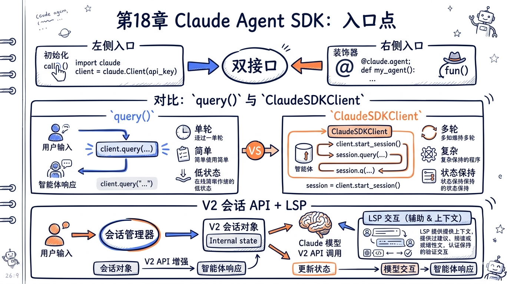
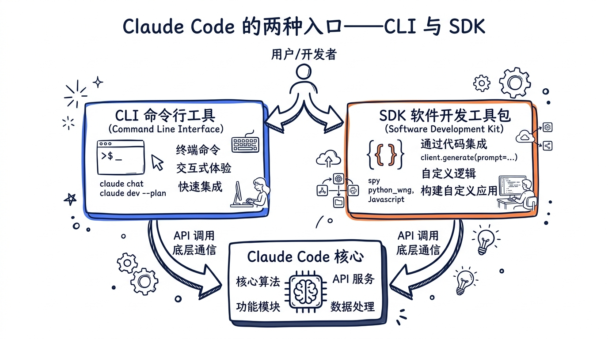
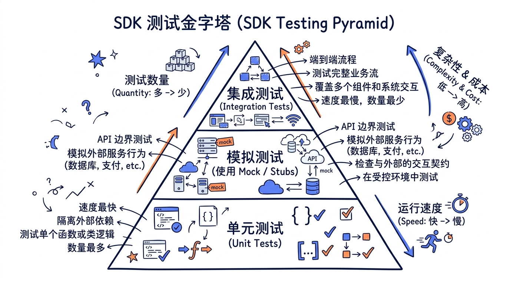
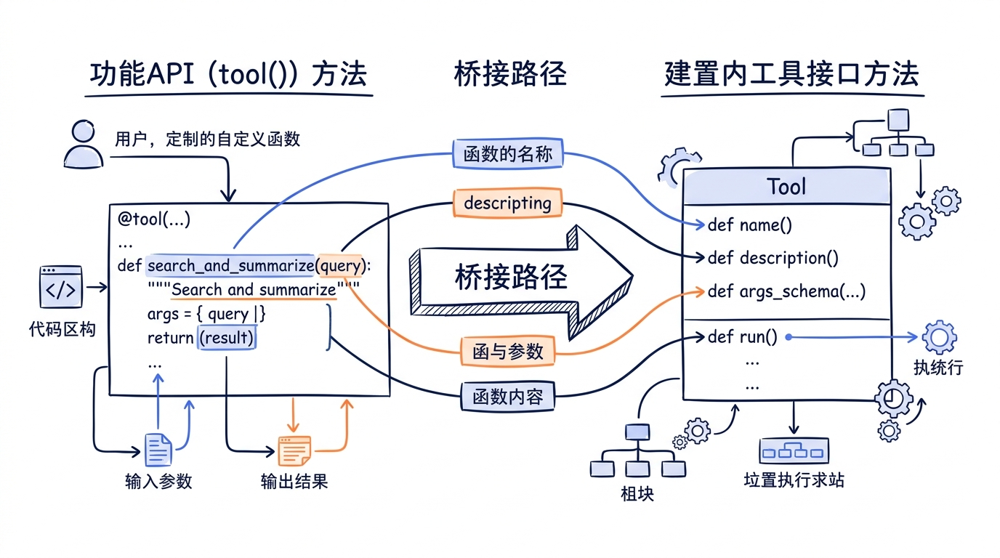
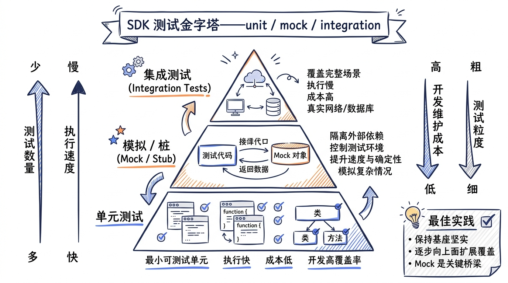
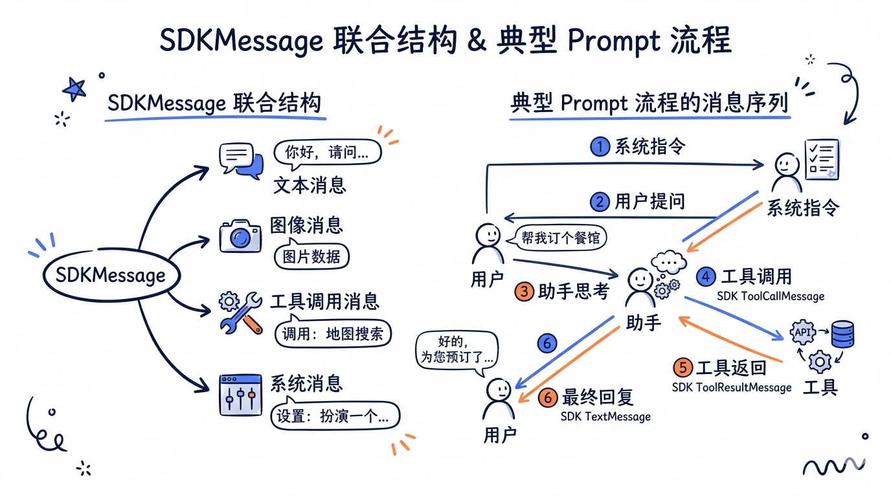
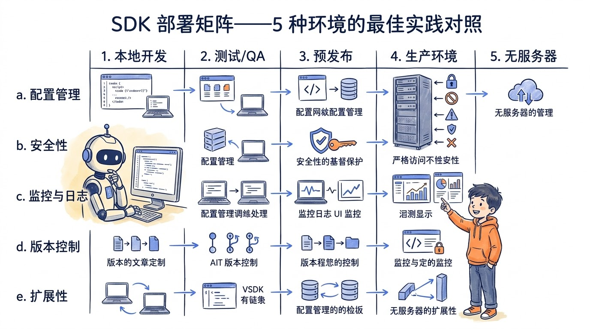
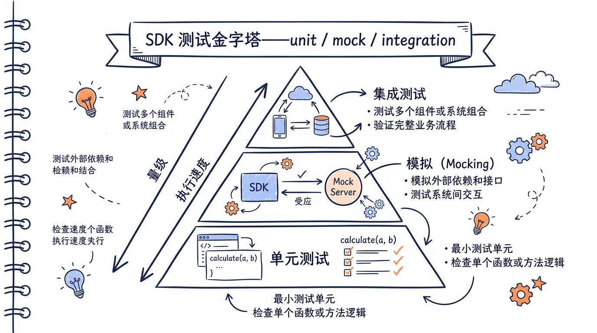
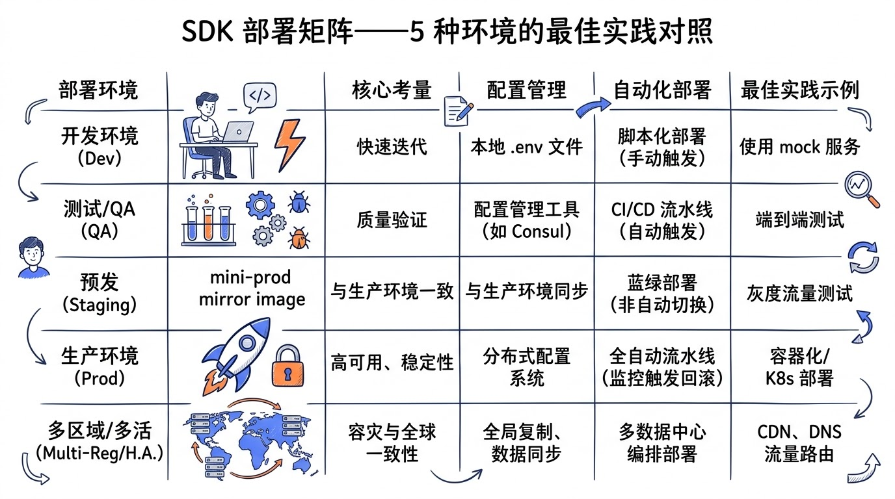

# 第十八章：Claude Agent SDK



> **章节定位**：把 Claude Code 的核心能力（Agent 循环、Tool 系统、权限、Hook、Session、MCP 等）打包成可被任意 TypeScript/Node.js 程序调用的 SDK。本章解析 SDK 的设计哲学、双接口模式、装饰器工具注册、V2 Session API、消息类型族、EntryPoints 多入口架构、LSP 集成、控制协议、工具桥接，以及与 Claude Code 主进程的关系。
>
> **基于**：Claude Code v2.1.88 源码 `src/entrypoints/sdk/`、`src/entrypoints/agentSdkTypes.ts`、`src/services/lsp/`、`src/services/mcp/InProcessTransport.ts`、`src/bridge/bridgePointer.ts`。
>
> **数字口径**：本章涉及的所有数字以 `docs/canonical-numbers.md` 为准。Claude Code 共 **40 个工具**、**27 个 Hook 事件**、**5 个 MCP 原语**、**8 种 MCP 传输（教学口径）**。

---

## 18.0 引子：当 Claude Code 不再只是 CLI

如果你在 2024 年第一次接触 Claude Code，它在你眼里大概率只是一个终端命令——`npm install -g @anthropic-ai/claude-code`，然后 `claude` 起飞。这个印象没错，但只对了一半。

Claude Code 真正的形态从来都不是"一个 CLI"，而是"一组围绕 Agent 循环组织起来的核心能力"。CLI 只是这组能力的第一个对外接口。第二个接口叫做 **Claude Agent SDK**——它把同一套核心代码（Agent 循环、Tool 调度、权限、Hook、Session、MCP……）以 npm 包的形式暴露给任意 Node.js 程序，让你可以在自己的 CI/CD pipeline、Slack bot、内部运维工具、自动化脚本里嵌入一个"Claude Code 大脑"。

这件事的工程价值，得通过一个反例来理解：如果没有 SDK，任何想集成 Claude Code 的人就只能去 spawn 一个 `claude` 子进程，再用 stdin/stdout 解析它打印的内容。这条路走得通——很多 GitHub Action 一开始就是这么干的——但代价是：

- **每次都要冷启动**：进程创建、模块加载、配置读取、模型握手、MCP 探测，一套下来轻松 1.5 秒。
- **状态全靠 IPC 拼**：父进程想知道当前会话用了多少 token？得自己解析 stdout 里的 JSON 行，还得防着 CLI 的输出格式版本变化。
- **错误处理粗糙**：子进程崩了你只能从 exit code 反推；想做 retry、超时、并发限流，全得在父进程重写一遍。
- **测试基本不可能**：你没法 mock 一个 spawn 出来的二进制。

SDK 把这些问题一次性消解了。它和 CLI 跑在 **同一个进程**、**共享同一份核心代码**、**用同样的类型签名暴露能力**。CLI 只是 SDK 的第一个 caller，SDK 是更基础的层。

本章就来拆解这个 SDK——不仅看它的 API 形状，更看它背后的"Headless First"哲学、它和 CLI 的代码共享方式、它如何用 V2 Session API 把"会话"提升为一等公民、它怎么通过 InProcessTransport 把 SDK builder 自定义的工具喂给 Agent 循环。



---

## 18.1 SDK 设计哲学：Headless First

### 18.1.1 为什么 Anthropic 要把 Claude Code 抽出 SDK

Anthropic 内部把这条路线称为 **Headless First**——核心能力先以"无界面、可被任意宿主驱动"的形态实现，UI（包括终端 UI）只是其中一个宿主。

这条原则不是事后总结，它在仓库结构里是写得明明白白的。打开源码，你看到的是这样的目录划分：

```
src/src/
├── entrypoints/                # 多入口共享同一核心
│   ├── cli.tsx                 # 终端入口（带 React/Ink UI）
│   ├── mcp.ts                  # MCP server 入口
│   ├── sdk/                    # SDK 公开类型与协议
│   │   ├── coreSchemas.ts      # Zod schemas，1889 行
│   │   ├── coreTypes.ts        # 类型导出
│   │   └── controlSchemas.ts   # SDK 控制协议
│   ├── agentSdkTypes.ts        # SDK 顶层公开 API
│   ├── init.ts                 # 共享初始化逻辑
│   └── sandboxTypes.ts         # Sandbox 类型
├── tools/                      # 40 个内置工具
├── services/                   # MCP / LSP / Compact / Memory ...
├── bridge/                     # claude.ai 远控桥
└── ...
```

注意三件事：

1. **SDK 不在某个独立的 npm 包仓库里**，它就在 Claude Code 主仓库的 `src/entrypoints/sdk/` 下。
2. **CLI 和 SDK 平级**，都是 `entrypoints/` 的子项；CLI 不是 SDK 的"消费者"，它们是 SDK 抽象的两个对等出口。
3. **核心能力（Tool、Agent loop、Service）独立于入口**，住在 `tools/`、`services/` 等顶层目录，被 entrypoints 共享。

这种结构决定了 Claude Code 的工程文化：**任何写在 CLI 里的能力，必须先问"它在 Headless 模式下能不能跑"**。能，就抽到 services/；不能，就在 cli.tsx 里专门写一个 UI 层处理。

### 18.1.2 Headless 是什么意思

"Headless" 在 Anthropic 内部有非常具体的定义，至少要满足三条：

- **没有 TTY 也能跑**：不要求 `process.stdin.isTTY`，不假设有人会按键盘。
- **没有人类交互也能完成任务**：所有需要"问用户"的环节（权限确认、AskUserQuestion 工具、Elicitation Hook）都必须有"程序化回答"的通道。
- **状态可序列化**：Session、Memory、ToolUse 的输入输出都得能落到磁盘或者通过 stdin/stdout 跨进程传递。

第三条是最容易被忽视的。Claude Code 的会话之所以能在 CLI 里 `--resume`、能被 SDK 用 `unstable_v2_resumeSession` 拉起、能被 bridge 推到 claude.ai 远控接管——根本原因是它从一开始就把所有 SDKMessage 设计成 Zod 可序列化的对象（`coreSchemas.ts` 这一行字典）。这不是事后改造的，是 V1 就埋下的地基。



### 18.1.3 SDK 与 CLI 的代码共享比例

数字会说话。让我们看一下 SDK 类型定义文件本身的体量：

| 文件 | 行数 | 作用 |
|---|---|---|
| `entrypoints/sdk/coreSchemas.ts` | **1889** | Zod schemas（消息、Hook、Permission、Settings、ToolUse 等） |
| `entrypoints/sdk/controlSchemas.ts` | **663** | SDK 控制协议（Request/Response） |
| `entrypoints/sdk/coreTypes.ts` | **62** | 类型 re-export 入口 |
| `entrypoints/agentSdkTypes.ts` | **443** | 公开 API：query / createSdkMcpServer / V2 Session |
| `entrypoints/cli.tsx` | **302** | 终端入口（仅启动逻辑，UI 在 components/ 下） |
| `entrypoints/mcp.ts` | **196** | MCP server 入口 |
| `entrypoints/init.ts` | **340** | 共享初始化（feature flag、auth、config） |

总共 **4051 行 entrypoints**，其中真正属于 SDK 公开协议的占了 3000 多行（coreSchemas + controlSchemas + agentSdkTypes）。CLI 入口只有 300 行，因为 90% 的 CLI 行为（read/write/grep/bash/...）都是通过调用 `tools/` 和 `services/` 完成的，和 SDK 调用走的是 **同一段代码**。

这就是 Headless First 在实现层面的兑现：**没有"CLI 专属逻辑"和"SDK 专属逻辑"两条平行实现**。CLI 和 SDK 是同一座建筑的两个门。

### 18.1.4 与其他 Agent SDK 的对比

把 Claude Agent SDK 和市面上几个常见的 Agent 框架并排放：

| 框架 | 核心定位 | 是否带 CLI | 是否 Headless First |
|---|---|---|---|
| **Claude Agent SDK** | 把 Claude Code 全套能力 SDK 化 | 是（同包） | **是** |
| LangChain Agents | LLM 编排框架 | 否 | 是（但不是 first-class） |
| OpenAI Assistants API | 云端托管 Agent | 否 | 服务器侧 |
| AutoGPT / BabyAGI | 早期 Agent 玩具 | 是 | 一般 |
| Cursor / Cline | IDE 内 Agent | 否 | 否（强依赖 IDE） |

差异关键不在"功能多少"，而在"工程取向"。Claude Agent SDK 不是一个"框架"——它不让你 `extends Agent` 然后填空。它是 **一套已经组装好的 Agent**（Claude Code 本体）的可调用接口。你拿到的是一个会用 40 个工具、27 个 Hook 事件、能压缩上下文、能跑 Skill 的成熟 Agent，而不是一组需要你自己组装的乐高积木。

这个取向决定了 SDK 用起来更像 **"嵌入一个 Claude Code"**，而不是 **"用 SDK 拼一个 Agent"**。


### 18.1.5 一个简单调用的全貌

为了让"SDK 和 CLI 共享代码"这件事更具象，看一段最小调用：

```typescript
import { query } from '@anthropic-ai/claude-code';

for await (const message of query({
  prompt: '列出当前目录的所有 markdown 文件',
})) {
  if (message.type === 'assistant') {
    console.log(message.message.content);
  }
  if (message.type === 'result') {
    console.log('done, total cost:', message.total_cost_usd);
  }
}
```

这段代码在内部走的路径，和你在终端里输 `claude "列出当前目录的所有 markdown 文件"` 完全一样：

1. `query()` 创建一个 `InternalQuery` 实例（`agentSdkTypes.ts:120`）。
2. 它调用 `init.ts` 里的初始化逻辑（feature flag、auth、ConfigStore）。
3. 它实例化和 CLI 一样的 `tools/` 工具列表。
4. 它启动 Agent 主循环（参考第三章）。
5. 工具调用走 `services/mcp/` 的同一套调度。
6. 每个 SDKMessage 通过 async generator yield 回来。

唯一的不同是：CLI 把 yield 的消息渲染成 React/Ink 的终端 UI，SDK 把它们直接交给你的 for-await 循环。**核心循环本身是同一段代码。**

---

## 18.2 双接口模式：query() + ClaudeSDKClient

### 18.2.1 函数式 API：query()

`query()` 是 SDK 最简单的入口，签名定义在 `src/entrypoints/agentSdkTypes.ts:114-124`：

```typescript
/** @internal */
export function query(_params: {
  prompt: string | AsyncIterable<SDKUserMessage>
  options?: InternalOptions
}): InternalQuery
export function query(_params: {
  prompt: string | AsyncIterable<SDKUserMessage>
  options?: Options
}): Query
export function query(): Query {
  throw new Error('query is not implemented in the SDK')
}
```

它是一个 **重载函数**：

- 第一个签名：`InternalOptions → InternalQuery`，给 Anthropic 内部和高级 SDK builder 用，能拿到完整控制协议。
- 第二个签名：`Options → Query`，公开 API，给普通用户用。
- 第三个签名是函数体本身，运行时这个文件在 npm 包里被替换成真正的实现（这一份是 type-only stub）。

这种"types-only entrypoint + 真实实现注入"的模式，在 SDK builder 实现自己的语言绑定（Python SDK、Go SDK）时会被反复用到——SDK builder 只需要 import 这个文件拿到类型，然后把类型映射到自己语言的协议层。

`query()` 的核心用法是 **一次性调用**：

```typescript
import { query } from '@anthropic-ai/claude-code';

// 字符串 prompt（最常见）
const result = query({ prompt: '帮我把 README 翻译成英文' });

// AsyncIterable prompt（多轮交互）
async function* userInputs() {
  yield { type: 'user', message: { content: '第一轮' } };
  yield { type: 'user', message: { content: '第二轮' } };
}
const result2 = query({ prompt: userInputs() });

// 带 options
const result3 = query({
  prompt: '分析这个项目',
  options: {
    cwd: '/path/to/project',
    permissionMode: 'acceptEdits',
    model: 'claude-sonnet-4-7',
  },
});

// 消费 yield 出来的 SDKMessage
for await (const msg of result) {
  // ...
}
```

### 18.2.2 OO 式 API：ClaudeSDKClient（V2 Session）

V2 Session API 是 SDK 的 OO 式接口，对应函数：

```typescript
// agentSdkTypes.ts:124-152
export function unstable_v2_createSession(
  _options: SDKSessionOptions,
): SDKSession {
  throw new Error('unstable_v2_createSession is not implemented in the SDK')
}

export function unstable_v2_resumeSession(
  _sessionId: string,
  _options: SDKSessionOptions,
): SDKSession {
  throw new Error('unstable_v2_resumeSession is not implemented in the SDK')
}
```

返回的 `SDKSession` 类型才是真正的 OO 接口（在 `runtimeTypes.ts` 定义），它带方法（`prompt()`、`abort()`、`getInfo()`），可以挂事件监听，能被 fork、resume、rename。这就是社区习惯叫的 "ClaudeSDKClient"——虽然源码里没有这个类名，但语义上对应的就是 SDKSession。

典型用法：

```typescript
import { unstable_v2_createSession } from '@anthropic-ai/claude-code';

const session = unstable_v2_createSession({
  cwd: process.cwd(),
  model: 'claude-sonnet-4-7',
  permissionMode: 'default',
});

// 第一轮
const r1 = await session.prompt('什么是依赖注入？');
console.log(r1);

// 第二轮（带上下文）
const r2 = await session.prompt('用 TypeScript 给我写个例子');

// 改名
await session.rename('DI 学习笔记');

// 拿元信息
const info = await session.getInfo();
console.log(info.title, info.totalCostUsd);

// 释放
await session.close();
```

### 18.2.3 何时用哪种

经验法则：

| 场景 | 推荐 API | 原因 |
|---|---|---|
| 单次脚本任务（CI/cron） | `query()` | 一次性、无状态、最快上手 |
| 命令行子程序（`some-cli foo`） | `query()` | 进程跑完即退 |
| 长期 chatbot（Slack/Discord） | `unstable_v2_createSession` | 多轮上下文、可暂停可恢复 |
| Web 后端的"Claude 助手"接口 | `unstable_v2_createSession` + `resumeSession` | 跨请求保持会话 |
| 自动化测试（验证某个 prompt 行为） | `query()` 或 `unstable_v2_prompt` | 一次性即可 |
| 需要把会话挂到 claude.ai bridge | `unstable_v2_createSession` + `connectRemoteControl` | 只有 V2 支持 |

`query()` 是 **stateless** 的——每次调用都新建一个上下文。`SDKSession` 是 **stateful** 的——多轮 prompt 共享同一个会话。这两种范式不互斥，都基于同一套核心循环，只是入口形态不同。

### 18.2.4 一次性调用的便捷形态：unstable_v2_prompt

如果只想跑一次 prompt 但又想要 V2 的能力（比如指定一个 sandbox profile 或者走 V2 的执行路径），SDK 提供了 `unstable_v2_prompt`：

```typescript
// agentSdkTypes.ts:163-168
export async function unstable_v2_prompt(
  _message: string,
  _options: SDKSessionOptions,
): Promise<SDKResultMessage> {
  throw new Error('unstable_v2_prompt is not implemented in the SDK')
}
```

它返回的是单个 `SDKResultMessage`（不是 stream）。内部实现等价于"创建 session → 发一条 prompt → 拿 result → 关 session"的语法糖。适合"我只想问一句话拿一个结果"的极简场景。



### 18.2.5 选择逻辑流程图

实际写代码时，可以按下面这个判断顺序：

1. **会不会有第二次 prompt 用同一个上下文？**
   - 否 → 选 `query()` 或 `unstable_v2_prompt`
   - 是 → 进入 2
2. **会话需要跨进程或跨重启恢复吗？**
   - 否 → 用 `unstable_v2_createSession`，在内存里管理
   - 是 → 用 `unstable_v2_createSession`，把返回的 `sessionId` 持久化，下次用 `unstable_v2_resumeSession`
3. **需要把会话挂到 claude.ai 远控吗？**
   - 是 → 必须 V2 + `connectRemoteControl`（见 18.10）

绝大多数生产场景落在 1 或 2，第 3 种是特殊的"远控代理"场景。

### 18.2.6 一个常见误区：不要在 query() 里手动管 session

新手最容易犯的错是这样：

```typescript
// 反例
let history = [];
for (let i = 0; i < 3; i++) {
  const r = query({ prompt: `第 ${i} 轮：${input[i]}, 历史：${history.join('\n')}` });
  for await (const msg of r) {
    if (msg.type === 'assistant') history.push(msg.message.content);
  }
}
```

这是把"多轮对话"硬塞到 stateless 的 `query()` 里，每次都把历史拼进 prompt。坏处至少三个：

- prompt 里塞历史，工具调用的中间步骤、ToolResult、压缩的中间产物全都丢失
- 没法走 Claude Code 的 prompt cache（每次都是新 prompt）
- token 计费翻倍

正确写法是用 V2：

```typescript
const session = unstable_v2_createSession({ cwd: process.cwd() });
for (const input of inputs) {
  const r = await session.prompt(input);
  // 上下文自动维护
}
```

记住：**`query()` 是单次调用，不是"重置历史"。需要多轮就用 SDKSession。**

---

## 18.3 装饰器工具注册（@tool 装饰器）

### 18.3.1 SDK builder 视角的工具

Claude Code 内置了 40 个工具，但 SDK 真正的威力之一在于：**你可以在自己的 Node.js 进程里定义工具，把它们和内置工具混在一起喂给 Agent**。这条能力是通过 `tool()` 函数 + `createSdkMcpServer()` 实现的。

签名：

```typescript
// agentSdkTypes.ts:67-80
export function tool<Schema extends AnyZodRawShape>(
  _name: string,
  _description: string,
  _inputSchema: Schema,
  _handler: (
    args: InferShape<Schema>,
    extra: unknown,
  ) => Promise<CallToolResult>,
  _extras?: {
    annotations?: ToolAnnotations
    searchHint?: string
    alwaysLoad?: boolean
  },
): SdkMcpToolDefinition<Schema> {
  throw new Error('not implemented')
}
```

注意签名里的几个细节：

- **`Schema extends AnyZodRawShape`**：用 Zod schema 定义参数，这样 SDK 既能做运行时校验，又能用 `zodToJsonSchema` 自动生成 LLM 看的 JSON Schema。
- **`InferShape<Schema>`**：Zod 推导出来的强类型参数，handler 的 `args` 是完全类型安全的。
- **`Promise<CallToolResult>`**：返回值是 MCP 协议里的 `CallToolResult`（来自 `@modelcontextprotocol/sdk/types.js`）。
- **`extras.alwaysLoad`**：是否始终加载到上下文（关掉的话只在被检索到时加载，节省 token）。
- **`extras.searchHint`**：给 ToolSearchTool 用的检索关键词。

### 18.3.2 createSdkMcpServer：把工具组装成"in-process MCP server"

单个 `tool()` 只是一个工具定义对象，要真正暴露给 Agent，得通过 `createSdkMcpServer()` 包成一个 MCP server：

```typescript
// agentSdkTypes.ts:90-108
type CreateSdkMcpServerOptions = {
  name: string
  version?: string
  // eslint-disable-next-line @typescript-eslint/no-explicit-any
  tools?: Array<SdkMcpToolDefinition<any>>
}

export function createSdkMcpServer(
  _options: CreateSdkMcpServerOptions,
): McpSdkServerConfigWithInstance {
  throw new Error('not implemented')
}
```

返回的 `McpSdkServerConfigWithInstance` 是一个特殊的 MCP server 配置——它不走 stdio/HTTP/SSE 这些常规传输，而是走 `InProcessTransport`（见 18.9），直接把 server 挂在同一进程里。

完整的"自定义工具"用法：

```typescript
import { z } from 'zod';
import { tool, createSdkMcpServer, query } from '@anthropic-ai/claude-code';

// 1. 定义工具
const weatherTool = tool(
  'get_weather',
  '查询指定城市的天气',
  {
    city: z.string().describe('城市名，如 "Tokyo"'),
    unit: z.enum(['celsius', 'fahrenheit']).default('celsius'),
  },
  async (args) => {
    const { city, unit } = args; // 完全类型安全
    const data = await fetchWeatherAPI(city);
    return {
      content: [
        { type: 'text', text: `${city} 现在 ${data.temp}°${unit}` },
      ],
    };
  },
  { searchHint: '天气 weather 温度' }
);

const dbQueryTool = tool(
  'db_query',
  '执行只读 SQL 查询',
  { sql: z.string() },
  async (args) => {
    const rows = await db.query(args.sql);
    return { content: [{ type: 'text', text: JSON.stringify(rows) }] };
  }
);

// 2. 组装成 MCP server
const myMcp = createSdkMcpServer({
  name: 'my-org-tools',
  version: '1.0.0',
  tools: [weatherTool, dbQueryTool],
});

// 3. 喂给 query()
const result = query({
  prompt: '查一下东京的天气，然后从数据库里捞出今天的日志',
  options: {
    mcpServers: {
      'my-org-tools': myMcp,
    },
  },
});
```

### 18.3.3 为什么不真的用装饰器？

读到这里你可能会问：标题里写的是"装饰器工具注册"，但 `tool()` 看起来明明是普通函数调用，不是 `@tool` 装饰器。这有讲究。

TypeScript 的 stage-3 装饰器在 Node 22 LTS 还需要 `experimentalDecorators` flag，且 ESM/CJS 互操作仍然有边角问题。Anthropic 的工程取向是 **最大化可移植性**——SDK 要能在 Node 18+、Bun、Deno、各种 bundler 下都开箱即用。所以选了**函数式 API**作为主形式，但语义上等价于装饰器：

```typescript
// 假想的装饰器风格
class WeatherTool {
  @tool('get_weather', '查询天气', { city: z.string() })
  async getWeather(args) { /* ... */ }
}

// 实际 SDK 的函数式风格
const weatherTool = tool('get_weather', '查询天气',
  { city: z.string() },
  async (args) => { /* ... */ }
);
```

两者表达的概念一致：**用元数据声明工具**。函数式风格的好处是不依赖 class，不需要 `this`，更适合纯函数式的 handler。

### 18.3.4 SDK builder 怎么对接内置 Tool 接口

SDK 暴露给用户的 `tool()` 返回的是 `SdkMcpToolDefinition`，这个对象最终会被运行时桥接成 Claude Code 内置的 `Tool` 接口（见第四章）。桥接的关键是：

| SDK 字段 | Claude Code Tool 字段 | 转换方式 |
|---|---|---|
| `name` | `name` | 加上 server 前缀（如 `mcp__my-org-tools__get_weather`） |
| `description` | `description` | 直接复用 |
| `inputSchema` (Zod) | `inputSchema` (JSON Schema) | `zodToJsonSchema()` |
| `handler` | `call()` | 包装成异步生成器 |
| `annotations.readOnlyHint` | `isReadOnly()` | 透传 |
| `annotations.idempotentHint` | `isConcurrencySafe()` | 透传 |
| `searchHint` | ToolSearchTool 的检索权重 | 走 services/MagicDocs |
| `alwaysLoad` | 上下文加载策略 | 走 ToolSearchTool 的 alwaysLoad 列表 |

桥接代码主要在 `services/mcp/client.ts` 和 `tools/MCPTool/` 下。每一个通过 `createSdkMcpServer` 注册的工具，对 Agent 而言都是一个普通的 MCPTool 实例，和外部通过 stdio 启动的 MCP server 工具走同一条调度路径。

### 18.3.5 工具命名约定

SDK builder 通过 createSdkMcpServer 注册的工具，最终在 Agent 看到的名字格式是：

```
mcp__<server_name>__<tool_name>
```

这套命名约定来自 MCP 协议，目的是避免和内置工具（BashTool、ReadFileTool 等）重名。如果你在 prompt 里给模型写工具调用规则，得用这个完整名字：

```
当用户问天气时，使用 mcp__my-org-tools__get_weather 工具，参数 city 是城市名。
```



### 18.3.6 一个完整的端到端例子

把上面的拼接到一起，看一个稍微完整的 SDK builder 例子——加一个"代码搜索"工具：

```typescript
import { z } from 'zod';
import { tool, createSdkMcpServer, query } from '@anthropic-ai/claude-code';
import { execFile } from 'node:child_process';
import { promisify } from 'node:util';

const exec = promisify(execFile);

const ripgrepTool = tool(
  'ripgrep_code',
  '在代码库中搜索字符串（基于 ripgrep）',
  {
    pattern: z.string().describe('正则模式'),
    path: z.string().default('.'),
    fileType: z.string().optional().describe('如 ts、py'),
  },
  async ({ pattern, path, fileType }) => {
    const args = ['-n', '--max-count', '50', pattern, path];
    if (fileType) args.push('--type', fileType);
    const { stdout } = await exec('rg', args);
    return {
      content: [{ type: 'text', text: stdout || '(no matches)' }],
    };
  },
  {
    annotations: { readOnlyHint: true, idempotentHint: true },
    searchHint: 'search code grep ripgrep',
  }
);

const myMcp = createSdkMcpServer({
  name: 'codebase',
  tools: [ripgrepTool],
});

// 在 Agent 里使用
const session = unstable_v2_createSession({
  cwd: process.cwd(),
  mcpServers: { codebase: myMcp },
});

const r = await session.prompt('在 src 下找所有用了 fetch() 的地方');
console.log(r);
```

这个例子的关键点：

- `ripgrepTool` 标了 `readOnlyHint: true, idempotentHint: true`，意味着 Agent 可以并发调用它（不会触发权限确认，也不会被 PostToolUseFailure 重试机制误解）。
- `searchHint` 让这个工具能被 ToolSearchTool 在用户问"搜索代码"相关问题时优先检索到。
- 因为是 in-process，调用零序列化开销，比 spawn 一个 ripgrep MCP server 快很多。

---

## 18.4 V2 Session API 完整剖析

### 18.4.1 SDKSessionInfo 的字段

V2 Session API 的核心数据结构是 `SDKSessionInfo`，它的 Zod schema 定义在 `entrypoints/sdk/coreSchemas.ts:1812` 附近。结构（简化版）：

```typescript
type SDKSessionInfo = {
  sessionId: string;                // UUID
  title: string;                    // 用户/系统起的标题
  cwd: string;                      // 会话所在目录
  createdAt: number;                // 创建时间（epoch ms）
  updatedAt: number;                // 最后更新时间
  totalCostUsd: number;             // 累计成本
  totalDurationMs: number;          // 累计 wall clock 时长
  totalApiDurationMs: number;       // 累计 API 调用时长
  numTurns: number;                 // 用户轮数
  model: string;                    // 当前模型
  tag: string | null;               // 用户打的标签
  isSidechain: boolean;             // 是不是 subagent 子会话
  parentSessionId?: string;         // 如果是 subagent，父会话 ID
  // ...还有 fork 信息、压缩点信息等
};
```

`SDKSessionInfo` 的设计哲学是 **"会话即文档"**：每个字段都是 Zod 校验的、可序列化的、可 round-trip 写到 JSONL 文件再读回来的。这是因为 Claude Code 把会话存成 `~/.claude/projects/<encoded-cwd>/<sessionId>.jsonl`，Session API 的所有 mutation 操作（rename/tag/fork）实际上都是在 JSONL 文件末尾追加新条目。

### 18.4.2 listSessions / getSessionInfo / getSessionMessages

读取会话有三个层级的 API：

```typescript
// 列出所有会话（可选按目录过滤）
export async function listSessions(
  options?: ListSessionsOptions,
): Promise<SDKSessionInfo[]>

// 拿单个会话的元信息
export async function getSessionInfo(
  sessionId: string,
  options?: GetSessionInfoOptions,
): Promise<SDKSessionInfo | undefined>

// 拿单个会话的消息
export async function getSessionMessages(
  sessionId: string,
  options?: GetSessionMessagesOptions,
): Promise<SessionMessage[]>
```

这三个 API 的访问代价递增：

- `listSessions()` 只读 metadata（每个 JSONL 文件只读前几行的 summary 条目），可以按目录过滤、分页。常用来给前端做"会话列表"。
- `getSessionInfo(id)` 只读一个 JSONL，比 `listSessions` 快。
- `getSessionMessages(id)` 解析整个 JSONL（按 `parentUuid` 链接构建对话树），代价正比于会话长度。

```typescript
// 典型用法：分页列出最近 50 个会话
const recent = await listSessions({ limit: 50, offset: 0 });
for (const s of recent) {
  console.log(s.sessionId, s.title, s.totalCostUsd);
}

// 拿某个会话的完整消息历史
const messages = await getSessionMessages('abc-123-...', {
  includeSystemMessages: false,
});
console.log(`共 ${messages.length} 条消息`);
```

### 18.4.3 forkSession：会话分叉

`forkSession` 是 V2 最有意思的能力之一——它让你从一个现存会话的某个时间点 **分叉** 出一个新会话：

```typescript
// agentSdkTypes.ts:267-273
export async function forkSession(
  _sessionId: string,
  _options?: ForkSessionOptions,
): Promise<ForkSessionResult> {
  throw new Error('forkSession is not implemented in the SDK')
}
```

`ForkSessionOptions`：

```typescript
type ForkSessionOptions = {
  dir?: string;                  // 项目目录（默认搜索所有）
  upToMessageId?: string;        // 分叉点（可选，默认从最新点分）
  title?: string;                // 新会话标题
};

type ForkSessionResult = {
  sessionId: string;             // 分叉出的新会话 ID
};
```

分叉的核心机制（从 docstring 看）：

> Copies transcript messages from the source session into a new session file, remapping every message UUID and preserving the parentUuid chain. Supports `upToMessageId` for branching from a specific point.

也就是说，分叉不是软链——是**物理拷贝消息 + 重新分配 UUID**。每条消息都有新的 UUID，但 `parentUuid` 链条被保留下来（指向新分配的 UUID）。这样分叉出的会话是完全独立的，原会话和分叉会话之后的修改互不影响。

实际场景：

```typescript
// 分叉一个长对话，从某个时间点开始尝试不同的方向
const original = 'abc-123-...';
const { sessionId: newId } = await forkSession(original, {
  upToMessageId: 'msg-456',
  title: 'try different approach',
});

// 在分叉里继续探索
const session = unstable_v2_resumeSession(newId, {
  cwd: '/some/project',
});
await session.prompt('换一种思路');
```

这种"git-like 的会话分支"在调试 prompt、A/B 测试 prompt 策略、回到某个 checkpoint 重试的时候极其有用。

注意 docstring 里的一句话：

> Forked sessions start without undo history (file-history snapshots are not copied).

意思是分叉会话的对话历史是完整拷贝的，但 file-history（FileEditTool 的 undo 快照）不会被复制。新分叉里如果 Agent 想 undo 一个文件改动，得从分叉点之后的改动开始 undo。

### 18.4.4 mutation API：rename / tag

会话还有两个轻量的 mutation：

```typescript
export async function renameSession(
  _sessionId: string,
  _title: string,
  _options?: SessionMutationOptions,
): Promise<void>

export async function tagSession(
  _sessionId: string,
  _tag: string | null,    // null = 清除 tag
  _options?: SessionMutationOptions,
): Promise<void>
```

实现上都是往 JSONL 末尾追加一条特殊条目（`{"type": "custom-title", "title": "..."}` 或 `{"type": "tag", "tag": "..."}`），下次 `getSessionInfo` 读取时会用最新条目覆盖默认值。

**为什么不直接改 JSONL 顶部？** 因为 JSONL 是 append-only 的——这是会话存储的核心约束。append-only 让多进程读写、断电恢复、远程同步全都简单很多。代价是 mutation 不会"删除"旧值，只会被新条目覆盖语义。

### 18.4.5 SDKSession 的方法

V2 Session 创建后返回的 `SDKSession` 是一个对象，主要方法（来自 `runtimeTypes.ts`）：

```typescript
interface SDKSession {
  sessionId: string;
  prompt(message: string | AsyncIterable<SDKUserMessage>): AsyncIterable<SDKMessage>;
  abort(): Promise<void>;
  getInfo(): Promise<SDKSessionInfo>;
  rename(title: string): Promise<void>;
  tag(tag: string | null): Promise<void>;
  fork(opts?: { upToMessageId?: string; title?: string }): Promise<{ sessionId: string }>;
  close(): Promise<void>;
  // 事件监听（hook 钩子、消息流）
  on(event: 'message' | 'hook' | ..., handler: ...): void;
  // ...
}
```

核心生命周期：**create → prompt（多次）→ close**。每次 `prompt()` 返回一个 SDKMessage 流，可以 for-await 消费。`close()` 后 session 释放，但 sessionId 在磁盘上保留，下次可以 resume。

```typescript
const s = unstable_v2_createSession({ cwd: '/project' });

// 第一轮
for await (const msg of s.prompt('解释一下 generic')) {
  if (msg.type === 'assistant') console.log(msg.message.content);
}

// 第二轮（保持上下文）
for await (const msg of s.prompt('给个 TypeScript 例子')) {
  if (msg.type === 'assistant') console.log(msg.message.content);
}

// 中途取消
const abortPromise = s.abort();
await abortPromise;

// 关闭
await s.close();
```


### 18.4.6 V2 标记 @alpha 的含义

agentSdkTypes 里所有 V2 函数都有 `@alpha` 标签：

```typescript
/**
 * V2 API - UNSTABLE
 * Create a persistent session for multi-turn conversations.
 * @alpha
 */
export function unstable_v2_createSession(...)
```

`@alpha` 在 Anthropic 内部约定是：**API 形状可能在小版本里变化**。函数名带 `unstable_v2_` 前缀就是这种 convention 的体现——你看到 `unstable_` 就知道未来可能改名（去掉前缀变成 stable）。

实际工程里使用 V2 API 的注意事项：

- 锁版本：`"@anthropic-ai/claude-code": "2.1.88"`，不要用 caret。
- 升级前看 CHANGELOG。
- 把 V2 调用包一层 facade，未来 stable 后只改 facade 内部即可。

---

## 18.5 SDKMessage 类型体系

### 18.5.1 顶层 union：SDKMessage

SDK 与外界交换的所有消息都收敛到一个 union 类型——`SDKMessage`，定义在 `coreSchemas.ts:1854` 附近：

```typescript
export const SDKMessageSchema = lazySchema(() =>
  z.discriminatedUnion('type', [
    SDKAssistantMessageSchema(),
    SDKUserMessageSchema(),
    SDKUserMessageReplaySchema(),
    SDKResultMessageSchema(),
    SDKSystemMessageSchema(),
    SDKStreamlinedTextMessageSchema(),
    SDKStreamlinedToolUseSummaryMessageSchema(),
    SDKPostTurnSummaryMessageSchema(),
    SDKSessionStateChangedMessageSchema(),
    // ...
  ])
)
```

注意几个工程细节：

- 这是一个 **discriminated union**（按 `type` 字段分支），让 TypeScript 在 type narrowing 后能精确推断字段。
- 使用 `lazySchema()` 包裹，避免循环引用——SDKMessage 本身可能在某些子 schema 里被引用。
- 所有变体都是 Zod schema，意味着既能在 TS 里做静态类型，也能在运行时做 `parse()` 校验。

`SDKMessage` 的设计哲学是 **"Agent 输出流的全集"**：Agent 在一次 `prompt()` 期间可能 yield 出来的所有种类的消息，都是这个 union 的成员。前端/SDK 用户写 `for await (const msg of result)` 时，每个 `msg` 都是 SDKMessage，可以按 `type` 判断分支处理。

### 18.5.2 SDKAssistantMessage：模型回复

最常用的变体是 `SDKAssistantMessage`，schema 定义在 `coreSchemas.ts:1347`：

```typescript
type SDKAssistantMessage = {
  type: 'assistant';
  uuid: string;
  session_id: string;
  parent_tool_use_id?: string;        // 如果是 subagent 的回复
  message: {
    id: string;
    model: string;
    role: 'assistant';
    content: ContentBlock[];          // text / tool_use / thinking
    stop_reason: string | null;
    usage: NonNullableUsage;
  };
  error?: SDKAssistantMessageError;   // 失败时的错误信息
};
```

`message.content` 是一个 ContentBlock 数组，包含三种主要变体：

- `{ type: 'text', text: '...' }`：自然语言回复
- `{ type: 'tool_use', id: '...', name: '...', input: {...} }`：工具调用请求
- `{ type: 'thinking', thinking: '...' }`：思考内容（Extended Thinking 模式下）

SDK 用户最常做的事就是从这里抽取文字内容：

```typescript
for await (const msg of query({ prompt: '...' })) {
  if (msg.type === 'assistant') {
    for (const block of msg.message.content) {
      if (block.type === 'text') {
        process.stdout.write(block.text);
      } else if (block.type === 'tool_use') {
        console.error(`[tool] ${block.name}(${JSON.stringify(block.input)})`);
      }
    }
  }
}
```

### 18.5.3 SDKUserMessage：用户输入

`SDKUserMessage` 是另一个对偶——它是 SDK 调用方塞进 prompt 流的消息，schema 在 `coreSchemas.ts:1290`：

```typescript
const SDKUserMessageContentSchema = lazySchema(() =>
  // ...{ message: { role: 'user', content }, parent_tool_use_id?: string }
)

export const SDKUserMessageSchema = lazySchema(() =>
  SDKUserMessageContentSchema().extend({
    type: z.literal('user'),
    uuid: z.string(),
    session_id: z.string(),
  })
)

export const SDKUserMessageReplaySchema = lazySchema(() =>
  SDKUserMessageContentSchema().extend({
    type: z.literal('user-replay'),
    // 用于 fork/resume 场景，表示这条消息是从已有 transcript 回放的
  })
)
```

`SDKUserMessage` 既是 **输入** 也是 **输出**：

- 当作输入：`query({ prompt: asyncIterable })` 里 yield 的就是 SDKUserMessage（可以是文字、可以带图片、可以带工具结果）。
- 当作输出：当 Agent 的回复触发了 ToolUse，工具执行完后产生的 ToolResult 会以 SDKUserMessage 的形式（content 是 `{type: 'tool_result', ...}`）出现在消息流里——因为按 Anthropic API 的角色约定，ToolResult 在对话里属于 "user" 角色。

`SDKUserMessageReplay` 是 fork/resume 场景的特殊变体——表示这条消息不是当前 turn 新产生的，而是从历史 transcript 里回放的，前端 UI 可以据此区别渲染（不闪光、不算到本轮 cost 里）。

### 18.5.4 SDKResultMessage：最终结果

`SDKResultMessage` 是每次 `prompt()` 流的 **终结消息**，schema 在 `coreSchemas.ts:1453`：

```typescript
type SDKResultMessage = {
  type: 'result';
  subtype: 'success' | 'error_max_turns' | 'error_during_execution' | ...;
  uuid: string;
  session_id: string;
  total_cost_usd: number;
  total_duration_ms: number;
  total_api_duration_ms: number;
  num_turns: number;
  result?: string;                    // success 时的最终回复文字
  is_error: boolean;
  // ...还有 modelUsage 细节、usage 累计等
};
```

每个 prompt 流必然以一个 `SDKResultMessage` 结尾。它告诉调用方：

- 这一轮花了多少钱（`total_cost_usd`）
- 花了多长时间（`total_duration_ms`）
- 调了多少次模型（`num_turns`）
- 成功还是失败（`is_error`、`subtype`）
- 最终结果文字（`result`，仅 success 时有）

这个消息对 SDK 调用方做"成本统计"和"健康监测"至关重要：

```typescript
const result = query({ prompt: '...' });
let final: any;
for await (const msg of result) {
  if (msg.type === 'result') final = msg;
}
console.log(`花费：$${final.total_cost_usd.toFixed(4)}`);
console.log(`轮数：${final.num_turns}`);
if (final.is_error) console.error(`失败：${final.subtype}`);
```

### 18.5.5 SDKSessionInfo / SDKSystemMessage / streamlined 变体

剩下几个常见变体：

- **`SDKSystemMessage`**（`coreSchemas.ts:1457`）：系统消息，比如 "model changed"、"compact triggered"、"hook fired" 等元事件。前端 UI 通常用灰色小字渲染。
- **`SDKSessionInfo`**（`coreSchemas.ts:1812`）：会话元信息（首次出现于 prompt 流的开头，告诉调用方这条 prompt 走的是哪个 session）。
- **`SDKStreamlinedTextMessage`**（`coreSchemas.ts:1380` 附近）：streamlined 输出模式下替代 SDKAssistantMessage 的轻量版本——只保留文字，去掉 thinking 和 tool_use 块。给"只想拿最终回复"的调用方用。
- **`SDKStreamlinedToolUseSummaryMessage`**：streamlined 模式下的工具调用摘要（用一句话总结工具做了什么）。
- **`SDKPostTurnSummaryMessage`**：每轮结束后的简短总结，用在 microCompact 场景。
- **`SDKSessionStateChangedMessage`**（`coreSchemas.ts:1735`）：会话状态变化事件，比如 permissionMode 切换、cwd 变化、model 切换。

这些"边缘"变体是 SDK 的高级用户才会关注的——基础场景只需要处理 `assistant`、`user`、`result` 三种就够了。

### 18.5.6 消息层次结构总览

把它们组织成一棵树，方便记忆：

```
SDKMessage (顶层 union)
├── SDKAssistantMessage      ── 模型回复（含 ToolUse、Thinking）
│   └── error?: SDKAssistantMessageError
├── SDKUserMessage           ── 用户输入
├── SDKUserMessageReplay     ── 历史回放
├── SDKResultMessage         ── 终结消息（cost/duration/numTurns）
├── SDKSystemMessage         ── 系统元事件
├── SDKSessionInfo           ── 会话元信息
├── SDKSessionStateChanged   ── 会话状态变化
├── SDKStreamlinedTextMessage         ── 精简文本（streamlined 模式）
├── SDKStreamlinedToolUseSummaryMessage ── 工具调用摘要（streamlined）
└── SDKPostTurnSummaryMessage ── 每轮总结
```



### 18.5.7 Zod schema 的运行时校验价值

为什么 SDK 不直接用纯 TS interface，而要绕一圈用 Zod？答案在 `coreTypes.ts` 的注释里：

> Schemas are available in coreSchemas.ts for runtime validation but are not part of the public API.

意思是：

- **公开 API 是 TS 类型**（从 Zod 用 `z.infer<>` 推导出来）。
- **Zod schema 自己不是公开 API**，但 SDK builder 在内部用它做 **跨进程边界的校验**。

跨进程边界在 SDK 里有两个：

1. **CLI 子进程 ↔ SDK builder（如 Python SDK）**：Python SDK spawn 一个 `claude` 子进程，通过 stdin/stdout 交换 SDKMessage JSON。Python 端写不出 TS 类型，必须靠 schema 校验对面发来的消息合法。
2. **claude.ai bridge ↔ Claude Code 进程**：远控接管时，对面发过来的 prompt 也必须走 schema 校验，防止恶意/损坏的消息把 Agent 撞坏。

这就是为什么 `SDKMessage` 不是简单的 TS union，而是一棵 Zod schema 树——它是 SDK 的"协议语义"，不只是类型。

---

## 18.6 EntryPoints 架构（src/entrypoints/）

### 18.6.1 多入口共享同一核心

`src/entrypoints/` 是 Claude Code 的"门廊"。每个入口是一个独立的可执行单位，但它们共享同一个核心。看一下顶层的 8 个文件：

```
src/entrypoints/
├── cli.tsx                # CLI 入口（终端 UI 启动）
├── mcp.ts                 # MCP server 入口（claude --mcp 模式）
├── init.ts                # 初始化共享逻辑
├── agentSdkTypes.ts       # SDK 公开 API 类型
├── sandboxTypes.ts        # Sandbox 配置类型
└── sdk/                   # SDK 协议定义
    ├── coreSchemas.ts     # 1889 行 Zod
    ├── coreTypes.ts       # 类型导出
    └── controlSchemas.ts  # 控制协议
```

每个入口的角色：

| 入口 | 启动方式 | UI 形态 | 主要消费者 |
|---|---|---|---|
| `cli.tsx` | `claude` 命令 | React/Ink 终端 UI | 人类用户 |
| `mcp.ts` | `claude mcp` | 无 UI，stdio | 其他 MCP 客户端（IDE 插件） |
| SDK | `import { query } from '...'` | 无 UI，async iterator | Node.js 程序 |

它们共享：

- `tools/`：40 个工具
- `services/`：MCP、LSP、Compact、Memory 等
- `agentLoop`：主循环
- `permissions/`、`hooks/`、`session/`、`config/`、`auth/`：基础能力

### 18.6.2 cli.tsx：终端入口

`cli.tsx`（302 行）是一个非常**薄**的入口文件——它做的事可以归纳成三件：

1. **快速路径检测**：检查特殊 flag（`--version`、`--help`、`--mcp`）和环境变量，能短路就短路（不加载完整 CLI）。
2. **CCR 环境调优**：在 `CLAUDE_CODE_REMOTE=true` 时调高 Node heap size。
3. **交给 init.ts**：动态 import init.ts 的真实启动逻辑。

```typescript
// cli.tsx 简化版
async function bootstrap() {
  if (process.argv.includes('--version')) {
    console.log(VERSION);
    process.exit(0);
  }
  if (process.argv.includes('--mcp')) {
    await import('./mcp.js').then(m => m.runMcpServer());
    return;
  }
  const { startCli } = await import('./init.js');
  await startCli();
}
bootstrap().catch(err => {
  console.error(err);
  process.exit(1);
});
```

设计取向是 **"启动越快越好"**——CLI 的冷启动时间是用户感知的第一道关卡。任何重模块（React、Ink、tools/）都被推迟到 `import('./init.js')` 之后才加载。

### 18.6.3 mcp.ts：MCP server 入口

`mcp.ts`（196 行）让 Claude Code 自己变成一个 MCP server，被其他 MCP 客户端（VSCode 插件、Zed 编辑器、其他 Agent）连接：

```typescript
// mcp.ts 顶部
import { Server } from '@modelcontextprotocol/sdk/server/index.js'
import { StdioServerTransport } from '@modelcontextprotocol/sdk/server/stdio.js'
import {
  CallToolRequestSchema,
  ListToolsRequestSchema,
  // ...
} from '@modelcontextprotocol/sdk/types.js'
// ... 复用主项目的 tools.ts 和 Tool.ts
import { findToolByName, type ToolUseContext } from '../Tool.js'
import { getTools } from '../tools.js'
```

入口逻辑：

- 把 Claude Code 内置的 40 个工具注册成 MCP server 的 tools
- 用 stdio transport 监听 `ListToolsRequest` 和 `CallToolRequest`
- 收到 CallTool 时，定位到对应的 ClaudeCode Tool，跑 `call()` 方法，返回结果

这意味着 **任何支持 MCP 的客户端，都能"借用"Claude Code 的 40 个工具**——你可以在 Cursor 里通过 MCP 连接到一个本地的 `claude --mcp`，然后在 Cursor 的 Agent 里调用 BashTool、ReadFileTool 等。这是 SDK Headless First 哲学的另一个体现：核心能力可以被任意宿主驱动。

### 18.6.4 init.ts：共享初始化

`init.ts`（340 行）是所有入口共享的"开机仪式"。无论你是从 CLI 还是 SDK 进来，都要走这一段：

```
init() 流程（伪代码）：
  ↓
  1. 加载 feature flags（GrowthBook）
  ↓
  2. 加载 ConfigStore（settings.json、policy settings、project settings）
  ↓
  3. 检查 Auth（OAuth token、API key、托管账号）
  ↓
  4. 初始化 Analytics（PostHog、Sentry）
  ↓
  5. 初始化 MCP connection manager
  ↓
  6. 加载 Plugins / Skills / Memory
  ↓
  7. 初始化 Permission system / Hook registry
  ↓
  8. 准备工具列表（40 个内置 + N 个 MCP/SDK 注册的）
  ↓
  9. 准备 Agent 主循环上下文
  ↓
  10. 返回入口特定的 entry function
```

关键设计：**入口只负责调用 init()，init 决定核心怎么准备。这样新加一个入口（比如 grpc.ts、http.ts）只需要改 init.ts 的 dispatch 逻辑，不影响 core。**

### 18.6.5 sdk/ 子目录的角色

`sdk/` 子目录里的三个文件是 **"协议规范"**，不包含运行时逻辑：

- `coreSchemas.ts`：消息、配置、Hook、Settings 的 Zod schema
- `controlSchemas.ts`：CLI ↔ SDK 控制协议（见 18.8）
- `coreTypes.ts`：从 generated 文件 re-export 的纯类型

这个目录在 npm 发包时被作为 **public surface** 暴露——SDK builder（不只是 Anthropic 自己的 Python SDK，还包括第三方的 Go、Rust SDK）会 import 这里的类型来对齐协议。

### 18.6.6 多入口架构的工程收益

把"入口"和"核心"切开有几个明显好处：

1. **核心可以独立演进**：tools/ 和 services/ 加新功能，不需要改入口。
2. **新入口添加成本低**：理论上加一个 `entrypoints/grpc.ts` 也只需要写一层薄薄的协议适配。
3. **测试矩阵简化**：核心写好测试，入口只测"启动 + 协议绑定"。
4. **公共能力共享**：feature flag、auth、analytics 这些跨入口能力都收敛在 init.ts。

也有代价：

- **接口设计成本高**：每加一个核心能力，都要想清楚它能不能在所有入口都有意义（CLI、MCP、SDK、bridge）。
- **过度抽象的风险**：如果 90% 的功能只 CLI 用得上，强行抽象给 SDK 反而会增加复杂度。

Anthropic 选了"宁可抽象、不要重写"的路线——这是 Headless First 的代价，也是它的红利。


---

## 18.7 LSP 集成（services/lsp/）

### 18.7.1 LSP 在 Claude Code 中的角色

`src/services/lsp/` 是一个独立的子系统，对应文件：

```
services/lsp/
├── LSPClient.ts              # 与 LSP server 进程通信
├── LSPDiagnosticRegistry.ts  # 诊断信息收集
├── LSPServerInstance.ts      # 单个 LSP server 实例的生命周期
├── LSPServerManager.ts       # 多 LSP server 管理（不同语言不同 server）
├── config.ts                 # LSP 配置
├── manager.ts                # 顶层 manager
└── passiveFeedback.ts        # 被动反馈（编辑后自动诊断）
```

LSP（Language Server Protocol）是 IDE 圈子的事实标准——VSCode、Neovim、JetBrains 都通过 LSP 跟语言专属服务器（typescript-language-server、pyright、rust-analyzer 等）对话。Claude Code 把 LSP 集成进来，主要为两件事：

1. **代码诊断**：Agent 改完文件后，Claude Code 会启动语言对应的 LSP server，让它扫描代码，把 diagnostics（语法错、类型错、unused import 等）反馈给 Agent。
2. **跳转/查找定义**：LSPTool 工具可以让 Agent 主动调用 LSP 的 `goto definition`、`find references` 等能力。

### 18.7.2 LSPServerManager：多语言并存

LSPServerManager 的职责是**按语言路由请求**。一个项目可能同时有 TS、Python、Rust 文件，每种语言对应不同的 LSP server，manager 负责按文件后缀路由：

```typescript
// 简化版
class LSPServerManager {
  private servers = new Map<string, LSPServerInstance>();

  async getServerFor(filePath: string): Promise<LSPServerInstance> {
    const lang = detectLanguage(filePath);  // 'typescript' / 'python' / ...
    if (!this.servers.has(lang)) {
      const config = getLSPConfigForLanguage(lang);
      const instance = new LSPServerInstance(config);
      await instance.start();
      this.servers.set(lang, instance);
    }
    return this.servers.get(lang)!;
  }

  async shutdownAll(): Promise<void> {
    for (const s of this.servers.values()) await s.stop();
  }
}
```

LSP server 是**懒启动**的——只有用户/Agent 第一次操作某种语言文件时，对应的 LSP server 才被 spawn。这避免了 startup 阶段的开销。

### 18.7.3 LSPDiagnosticRegistry：诊断信息收集

LSP server 通过 push 通知（`textDocument/publishDiagnostics`）告诉客户端某个文件有错。Claude Code 把这些诊断收到 LSPDiagnosticRegistry：

```typescript
class LSPDiagnosticRegistry {
  private diagnostics = new Map<string, Diagnostic[]>();

  setDiagnostics(uri: string, diagnostics: Diagnostic[]) {
    this.diagnostics.set(uri, diagnostics);
  }

  getDiagnostics(uri: string): Diagnostic[] {
    return this.diagnostics.get(uri) ?? [];
  }

  getAllErrors(): Array<{ uri: string; diagnostic: Diagnostic }> {
    const all = [];
    for (const [uri, diags] of this.diagnostics) {
      for (const d of diags) {
        if (d.severity === 1) all.push({ uri, diagnostic: d });
      }
    }
    return all;
  }
}
```

这个 registry 在 Agent 编辑文件后被消费——FileEditTool / FileWriteTool 在保存完文件后会触发一次 LSP 诊断（通过 `passiveFeedback.ts`），把新 diagnostics 反馈到下一轮的 system context 里，Agent 看到错误后可以决定是否修复。

### 18.7.4 passiveFeedback：编辑后自动诊断

`passiveFeedback.ts` 是 LSP 集成里最体现"Headless First"哲学的部分——它让 LSP 能力**不依赖 IDE UI** 就能 work：

```typescript
// 简化伪代码
export async function notifyFileEdited(filePath: string): Promise<DiagnosticFeedback> {
  const server = await lspManager.getServerFor(filePath);
  await server.didOpen(filePath);  // 通知 LSP 这个文件被修改
  await sleep(500);                // 等 LSP 完成诊断
  const diags = lspRegistry.getDiagnostics(toUri(filePath));
  return formatForAgent(diags);    // 格式化成 Agent 可读的文本
}
```

Agent 编辑文件后的下一轮，system context 里会附上这个 feedback：

```
File edited: src/foo.ts
Diagnostics:
- src/foo.ts:42:5 error TS2322: Type 'string' is not assignable to type 'number'
- src/foo.ts:88:1 warning unused-import: 'lodash' is imported but never used
```

Agent 看到错误后会主动决定是不是要继续改。这是 Claude Code "改完就跑、跑完就修" 的核心机制之一。

### 18.7.5 LSPTool：Agent 主动调用 LSP

`src/tools/LSPTool/` 是 40 个工具之一，让 Agent 可以**主动**问 LSP：

- `goto_definition(uri, line, col)`：跳到定义
- `find_references(uri, line, col)`：找所有引用
- `hover(uri, line, col)`：拿到符号的类型签名/文档
- `document_symbols(uri)`：列出文件里所有符号

这让 Agent 在做大型重构时不用瞎读文件——可以直接问"这个函数被哪里用了"，把信息聚焦到相关位置。

### 18.7.6 LSP 与 SDK 的关系

LSP 集成是**核心层**的能力（住在 services/），所以 SDK 调用方天然受益——你 `query()` 一个会改文件的 prompt 时，Agent 自动会用 LSP 做诊断反馈，不需要 SDK 调用方做任何额外配置。

唯一需要注意的是：**LSP server 是子进程**，所以会增加进程数和内存占用。在资源受限的环境（小型 CI runner、Docker container），可以通过 settings 关掉 LSP：

```json
{
  "lsp": { "enabled": false }
}
```

或者只启用某些语言：

```json
{
  "lsp": {
    "enabled": true,
    "languages": ["typescript", "python"]
  }
}
```



---

## 18.8 SDK 控制协议（SDKControlRequest/Response）

### 18.8.1 控制协议的定位

到目前为止我们看的都是 **数据消息**——SDKMessage 是 Agent 和调用方交换业务内容的载体。但 SDK 还需要一类 **元消息**：调用方动态调整 Agent 行为（中断、改 model、改 permission mode、注册 hook callback）。这就是 **SDK 控制协议** 的职责。

控制协议定义在 `src/entrypoints/sdk/controlSchemas.ts`（663 行）。它的核心思想：

> 控制协议是 SDK builder（如 Python SDK）和 Claude Code 主进程之间的命令/应答通道。SDK 用户一般不直接接触它——它在 SDK 包内部被使用。

### 18.8.2 SDKControlRequest：能干什么

```typescript
// controlSchemas.ts:578
export const SDKControlRequestSchema = lazySchema(() =>
  z.object({
    type: z.literal('control_request'),
    request_id: z.string(),
    request: SDKControlRequestInnerSchema(),
  })
)
```

`SDKControlRequestInner` 是各种动作的 union：

```typescript
// controlSchemas.ts:552（简化版）
type SDKControlRequestInner =
  | { subtype: 'interrupt' }
  | { subtype: 'set_model'; model: string }
  | { subtype: 'set_permission_mode'; mode: PermissionMode }
  | { subtype: 'permission_response'; allow: boolean; ... }
  | { subtype: 'hook_callback_response'; callbackId: string; result: ... }
  | { subtype: 'mcp_message'; message: JSONRPCMessage }
  | { subtype: 'set_account_info'; ... }
  | { subtype: 'list_slash_commands' }
  | { subtype: 'list_models' }
  | { subtype: 'list_agents' }
  | { subtype: 'permission_update'; updates: PermissionUpdate[] }
  // ...还有一些 V2 session 操作
```

每条 request 对应 SDK 用户能下达的"指令"。最常用的：

- **`interrupt`**：相当于按了 Ctrl+C，让当前 prompt 流停下来。
- **`set_model`**：动态切换模型（比如复杂任务切到 Opus，简单任务切回 Sonnet）。
- **`set_permission_mode`**：动态改权限模式（默认 → acceptEdits）。
- **`permission_response`**：响应权限请求（允许/拒绝某个工具调用）。
- **`hook_callback_response`**：回应 hook 触发的 callback（SDK 注册的 hook 跑完了把结果返回）。

### 18.8.3 SDKControlResponse：怎么响应

```typescript
// controlSchemas.ts:605
export const SDKControlResponseSchema = lazySchema(() =>
  z.object({
    type: z.literal('control_response'),
    request_id: z.string(),       // 与 request 的 request_id 对应
    response: z.union([
      z.object({ subtype: z.literal('success'), result: z.unknown() }),
      z.object({ subtype: z.literal('error'), error: z.string() }),
    ]),
  })
)
```

每个 request 都对应一个 response，按 `request_id` 配对。`success` 时带 result（不同 subtype 的 result 类型不同），`error` 时带错误字符串。

### 18.8.4 协议的传输层：stdin/stdout JSON Lines

SDKControlRequest/Response 怎么在 SDK builder 和 Claude Code 进程之间走？答案在 controlSchemas 顶部的注释：

> Used by SDK builders (e.g., Python SDK) to communicate with the CLI process.

也就是说，SDK builder 把 Claude Code 当作一个**子进程**来 spawn，然后通过 stdin/stdout 用 JSON Lines 格式交换消息。每行是一个 JSON 对象，可能是：

- `SDKMessage`（业务数据，Claude Code → SDK builder）
- `SDKUserMessage`（用户输入，SDK builder → Claude Code）
- `SDKControlRequest`（控制指令，SDK builder → Claude Code）
- `SDKControlResponse`（控制响应，Claude Code → SDK builder）

整个协议是双向的——Claude Code 也会主动发 SDKControlRequest 给 SDK builder（比如"权限请求"、"hook callback 触发"），等 SDK builder 用 SDKControlResponse 回应。

### 18.8.5 控制协议在 Python SDK 里的样子

Anthropic 维护的 Python SDK（`claude-agent-sdk`）是这个协议的最大消费者。简化的对接逻辑：

```python
# Python SDK 内部（伪代码）
import asyncio, json
from typing import AsyncIterator

class ClaudeAgent:
    async def __aenter__(self):
        self.proc = await asyncio.create_subprocess_exec(
            'claude', '--sdk-mode',
            stdin=PIPE, stdout=PIPE,
        )
        return self

    async def query(self, prompt: str) -> AsyncIterator[dict]:
        await self._send_user(prompt)
        async for line in self._read_lines():
            msg = json.loads(line)
            if msg['type'] == 'control_request':
                # Claude Code 主进程问我们某事，比如权限
                await self._handle_control(msg)
            else:
                # SDKMessage 业务消息
                yield msg

    async def interrupt(self):
        await self._send_control({'subtype': 'interrupt'})

    async def set_model(self, model: str):
        await self._send_control({'subtype': 'set_model', 'model': model})
```

Python SDK 用户写出来的代码是高层的：

```python
async with ClaudeAgent() as agent:
    async for msg in agent.query("分析项目"):
        print(msg)
        if too_expensive():
            await agent.interrupt()
```

底层走的就是 SDKControlRequest 协议。

### 18.8.6 协议演进与版本化

SDKControlRequest 是个 **可演进** 的 union——每加一种新的控制能力，就给 inner union 加一个 subtype。但旧版本的 SDK builder 怎么对付新 subtype？

这就是 Zod schema 的另一个价值：`safeParse` 失败就降级。SDK builder 收到不认识的 subtype 时，schema 校验失败，SDK builder 选择 ignore（继续读下一行）或者打印警告。Claude Code 主进程在发新 subtype 之前会先用一次 `list_capabilities` 协议探测对面 SDK builder 的版本。

这种"协议向后兼容 + 能力探测"是 SDKControlRequest 设计里很 SaaS 的一部分——Anthropic 维护着 Python/Go/Rust 多个 SDK builder，要保证它们能在不同版本的 Claude Code 主进程下都 work。


---

## 18.9 SDK 工具桥接：BridgePointer + InProcessTransport

### 18.9.1 InProcessTransport：同进程的 MCP 通道

回到 18.3 里 `createSdkMcpServer()` 那个伏笔——SDK builder 注册的工具是怎么"零序列化"喂给 Agent 的？答案在 `src/services/mcp/InProcessTransport.ts`（66 行的小文件）：

```typescript
// services/mcp/InProcessTransport.ts:11
class InProcessTransport implements Transport {
  private peer: InProcessTransport | undefined
  private closed = false

  onclose?: () => void
  onerror?: (error: Error) => void
  onmessage?: (message: JSONRPCMessage) => void

  /** @internal */
  _setPeer(peer: InProcessTransport): void {
    this.peer = peer
  }

  async start(): Promise<void> {}

  async send(message: JSONRPCMessage): Promise<void> {
    if (this.closed) throw new Error('Transport is closed')
    queueMicrotask(() => {
      this.peer?.onmessage?.(message)
    })
  }

  async close(): Promise<void> { /* ... */ }
}

export function createLinkedTransportPair(): [Transport, Transport] {
  const a = new InProcessTransport()
  const b = new InProcessTransport()
  a._setPeer(b)
  b._setPeer(a)
  return [a, b]
}
```

工程要点：

- **MCP `Transport` 接口的实现**：和 stdio/SSE/HTTP 三种 MCP transport 平级，但消息走的是 **同进程的方法调用**，不是网络/管道。
- **成对工作**：`createLinkedTransportPair()` 返回两个绑定的 transport，一个塞给 MCP server，一个塞给 MCP client。任何一边 `send()`，对面就 `onmessage()`。
- **`queueMicrotask` 异步投递**：避免同步调用栈深度问题（MCP 的 request/response 是异步循环的）。
- **零序列化**：消息直接传引用，不需要 JSON.stringify/parse。

这就是 SDK 自定义工具 **比 stdio MCP server 快得多** 的根本原因——少了进程创建、stdin/stdout 序列化、JSON 解析三道开销。

### 18.9.2 createLinkedTransportPair 的连接方式

把 18.3 里的 `createSdkMcpServer` 和这里的 InProcessTransport 串起来，全流程是：

```
1. SDK 用户写：
   const myMcp = createSdkMcpServer({ tools: [...] })
   
2. SDK 内部：
   const [clientT, serverT] = createLinkedTransportPair()
   const server = new McpSdkServer({ tools })
   await server.connect(serverT)        // server 监听 serverT
   const client = new McpClient()
   await client.connect(clientT)        // client 通过 clientT 发请求
   
3. 把 client 注册到 Claude Code 的 MCPConnectionManager：
   mcpManager.register('my-mcp', client, { transport: 'in-process' })
   
4. Agent 触发工具调用时：
   - Agent → MCPTool('mcp__my-mcp__weather', args)
   - MCPTool → mcpManager.getClient('my-mcp').callTool('weather', args)
   - client.callTool → clientT.send(JSONRPCRequest)
   - clientT.send → queueMicrotask → serverT.onmessage(req)
   - server 处理 request → 执行 SDK 用户的 handler
   - server 通过 serverT.send → clientT.onmessage(JSONRPCResponse)
   - response 回到 client → 回到 MCPTool → 回到 Agent
```

整个调用链在同一个事件循环里跑完，唯一的"延迟"是 `queueMicrotask` 让出的一个 tick——这是为了避免栈溢出，不会显著影响性能。

### 18.9.3 BridgePointer：跨进程的"接管点"指针

InProcessTransport 是同进程通信。但 SDK 还有一个跨进程场景——**bridge**（claude.ai 远控）。这就需要 BridgePointer。

`src/bridge/bridgePointer.ts:42` 定义：

```typescript
const BridgePointerSchema = lazySchema(() =>
  z.object({
    pid: z.number(),                  // 持有 bridge 的 Claude Code 进程 PID
    sessionId: z.string(),            // 当前 bridge 锁的 session
    socketPath: z.string().optional(),// IPC socket 路径
    bridgeSessionId: z.string(),      // claude.ai 那边的 bridge session ID
    timestamp: z.number(),            // 写入时间戳
    // ...
  })
)
```

`BridgePointer` 是一个落到磁盘的"指针文件"，路径在 `<dir>/.claude/bridge-pointer.json`（通过 `getBridgePointerPath()` 解析）。它的作用：

- **多进程协调**：同一个项目目录下可能有多个 Claude Code 进程，但只能有一个持有 bridge 连接（claude.ai 那边只期望一个对端）。BridgePointer 是这把"锁"。
- **进程发现**：daemon 进程或者 Web UI 通过读取这个文件发现"现在哪个进程在 own 这个 bridge"，可以把 prompt 路由到正确的进程。
- **存活探测**：通过 `pid` 字段配合 `kill -0` 检测持有者是否还活着。

```typescript
// src/bridge/bridgePointer.ts:62
export async function writeBridgePointer(
  dir: string,
  pointer: BridgePointer,
): Promise<void> {
  const path = getBridgePointerPath(dir)
  await fs.writeFile(path, JSON.stringify(pointer))
}

export async function readBridgePointer(
  dir: string,
): Promise<(BridgePointer & { ageMs: number }) | null> {
  const path = getBridgePointerPath(dir)
  // ... 读取 + safeJsonParse + Zod 校验
  // ... 配合 isPidAlive 检测进程存活
}
```

### 18.9.4 BridgePointer 的工作流

完整的 bridge 接管流程：

```
A 进程（daemon）持有 bridge：
  写入 BridgePointer { pid: A, sessionId: "abc", ... }

B 进程（CLI 用户在同一目录开 claude）：
  读取 BridgePointer
  发现 pid=A 还活着，sessionId 是 "abc"
  → B 进程不抢 bridge，进入"非 bridge 模式"

A 进程崩溃：
  pointer 文件还在，但 pid 已死
  
C 进程（一段时间后启动）：
  读取 BridgePointer
  发现 pid=A 已死（kill -0 失败）
  → C 抢锁，写入 BridgePointer { pid: C, ... }
  → C 接管 bridge
```

这是一个非常经典的"基于文件 + PID 的分布式锁"，简单但有效——不需要外部协调服务（Zookeeper、Redis），只用文件系统就能在同一台机器内多进程协调。

### 18.9.5 InProcessTransport vs BridgePointer：两种"同核心不同对端"

| 维度 | InProcessTransport | BridgePointer |
|---|---|---|
| 跨进程？ | 否 | 是（IPC + claude.ai WS） |
| 用途 | SDK 自定义工具的 MCP 通道 | claude.ai 远控接管的进程协调 |
| 序列化 | 零（传引用） | JSON 跨 IPC + 跨网络 |
| 性能 | 几乎无开销 | 受网络/IPC 制约 |
| 锁需求 | 无（每个 server pair 独立） | 有（PID-based 唯一持有者） |

它们都是 SDK 的"桥接基础设施"——一个让 SDK 能内嵌工具，一个让 SDK 能挂到云端。


---

## 18.10 与 Claude Code 主进程的关系

### 18.10.1 SDK 是 Claude Code 的子集还是替代？

回答这个问题之前，先把"Claude Code 主进程"和"SDK"的边界画清楚：

- **Claude Code 主进程** = `claude` 这个 CLI 命令启动的 Node 进程。它包含 React/Ink 终端 UI、stdin 输入循环、整套 entrypoints + tools + services。
- **SDK** = `@anthropic-ai/claude-code` npm 包导出的 `query()`、`unstable_v2_*` 等函数。SDK 用户在自己的 Node 程序里 import 它。

关键事实：**SDK 用户调用 `query()` 时，它在用户自己的进程里跑，而不是去 spawn 一个 `claude` 子进程**。这一点是 SDK 和"shell out"两种集成方式最大的区别。

```
shell out 方式（不推荐）：
  你的程序 → spawn('claude', [...]) → Claude Code 主进程
  ↑                                     ↓
  └─── stdin/stdout JSON ←──────────────┘

SDK 方式（推荐）：
  你的程序 ← import { query } ← @anthropic-ai/claude-code
  ↓
  query() 在你的进程内执行 Agent 循环、调工具、跑 LSP……
```

所以 SDK 不是"Claude Code 主进程的替代"，也不是"它的子集"——它就是**同一份核心代码**，被你的 Node 程序作为库引用。

### 18.10.2 共享代码 vs 独立进程

更细致的分类：

| 形态 | 进程关系 | 适用场景 |
|---|---|---|
| Claude Code CLI | 独立进程，UI 形态 | 人类终端使用 |
| Claude Code MCP server | 独立进程，stdio | IDE/其他 Agent 通过 MCP 调用 |
| SDK in-process | 嵌入用户进程 | Node.js 程序集成 |
| SDK + spawn（Python SDK） | spawn `claude --sdk-mode` 子进程 | 非 Node 语言通过控制协议接入 |
| Bridge 远控 | 进程内嵌 + WS 到 claude.ai | claude.ai 作为前端，本机为后端 |

最有意思的是**Python SDK** 的方式——Python 这一侧做不到 in-process 调用 Node 代码，所以走"spawn `claude` 子进程 + JSON Lines 控制协议"。这其实就是绕了一圈又回到 shell out 模式，但因为协议规范化（SDKControlRequest），所以工程质量比"自己 spawn + 自己解析 stdout"高一个数量级。

### 18.10.3 部署模式对比

把上面这几种形态放到真实部署场景里：

| 部署 | 推荐形态 | 原因 |
|---|---|---|
| 本地开发（终端） | CLI | 最直接 |
| GitHub Actions（每个 step 跑一次） | CLI | spawn 一次即可，session 用 `--resume` 持久化 |
| 长跑 daemon（chatbot 后端） | SDK in-process + V2 Session | 多轮、低延迟 |
| Web 后端（每个请求触发） | SDK in-process + resumeSession | 跨请求保持上下文 |
| 批处理（处理 N 个 issue） | SDK + worker pool | 并发控制 |
| Python 项目集成 | Python SDK + spawn | 跨语言协议 |
| Cursor / VSCode 集成 | Claude Code MCP server | IDE 走 MCP 标准 |

每种场景的最优解不一样，但底层都是同一套核心（tools/、services/、agentLoop）。

### 18.10.4 SDK 调用方应该理解的"边界"

SDK 用起来很方便，但有几个"看起来共享、其实独立"的边界要注意：

1. **会话存储路径**：SDK 默认把 session 写到 `~/.claude/projects/<encoded-cwd>/`，和 CLI 共享。所以 SDK 创建的 session 你可以用 `claude --resume` 在终端打开。
2. **配置文件**：SDK 也会读 `~/.claude/settings.json`、`~/.claude/policy/`、项目内 `.claude/settings.json`，和 CLI 共享。
3. **认证**：SDK 默认走 OAuth（用 `~/.claude/auth.json`），和 CLI 共享。
4. **MCP 配置**：SDK 默认读 `~/.claude/mcp_servers.json`，和 CLI 共享。
5. **但 process 是隔离的**：你的 SDK 程序崩了不会影响别的 SDK/CLI 进程。

最容易踩坑的是**Auth**——很多 CI 环境没有 OAuth 浏览器，得用 API key 模式（设置 `ANTHROPIC_API_KEY` 环境变量），不然 `query()` 第一次调用就会卡在 OAuth 跳转。

### 18.10.5 一个混合部署的真实例子

GitHub PR 自动 review 工具的典型架构：

```
CI runner（GH Actions）
  └── Node.js 程序（你的 PR review 工具）
       ├── 启动时：listSessions({ dir }) 看有没有未完成的 review
       ├── 没有就 unstable_v2_createSession()
       ├── prompt: "review this PR diff: ..."
       ├── for await 消费 SDKMessage：
       │     - assistant 文本写到 PR comment
       │     - tool_use 记到 audit log
       │     - result 拿 cost 上报 dashboard
       └── 关掉 session 但不删（下次 PR push 可以 resume）
```

这种部署里：

- 没有任何"`claude` 子进程"——所有逻辑都在 Node.js 程序进程里
- 也没有任何 React/Ink UI
- 但 SDK 内部跑了完整的 Agent 循环、调用了 BashTool/GlobTool/GrepTool 等
- 写出来的 session 文件可以被开发者本地的 CLI 打开继续看（`claude --resume <id>`）

这就是 Headless First 的真正胜利场——**同一段核心代码，根据宿主提供两种完全不同的体验**。


---

## 18.11 SDK 测试模式

### 18.11.1 SDK 单元测试的两种切面

给 SDK 写测试主要分两层：

1. **测试你写的 SDK 工具**（`tool()` 注册的 handler）：单元测试，不涉及 Agent 循环。
2. **测试 Agent 调用工具的端到端流程**：集成测试，需要真的调用 Anthropic API（或 mock）。

第一类很好写，handler 是纯函数：

```typescript
import { tool } from '@anthropic-ai/claude-code';
import { z } from 'zod';

export const getWeatherTool = tool(
  'get_weather',
  '...',
  { city: z.string() },
  async ({ city }) => {
    const data = await fetchWeather(city);
    return { content: [{ type: 'text', text: `${city}: ${data.temp}°C` }] };
  }
);

// 测试
import { describe, it, expect } from 'vitest';
import { getWeatherTool } from './weatherTool';

describe('getWeatherTool', () => {
  it('returns formatted weather', async () => {
    // tool() 返回的对象有 handler 字段（运行时实现）
    const result = await (getWeatherTool as any).handler({ city: 'Tokyo' }, {});
    expect(result.content[0].text).toContain('Tokyo');
  });
});
```

注意一个细节：`tool()` 在 SDK 类型定义里是 `throw new Error('not implemented')`，但运行时被替换成真正实现，返回的对象有 `.handler` 字段。所以测试时要 cast 一下。

### 18.11.2 用 mock 模拟 Agent 调用

第二类测试比较麻烦——你得让 Agent 真的"决定"调用某个工具。两种思路：

**思路 A：mock Anthropic API**

把 Anthropic SDK 的 `messages.create` mock 掉，让它返回你预设的 ToolUse 块：

```typescript
import { vi } from 'vitest';

vi.mock('@anthropic-ai/sdk', () => {
  return {
    Anthropic: class {
      messages = {
        create: vi.fn().mockResolvedValueOnce({
          content: [
            { type: 'tool_use', id: 't1', name: 'get_weather', input: { city: 'Tokyo' } }
          ],
          stop_reason: 'tool_use',
          usage: { input_tokens: 10, output_tokens: 5 },
        }).mockResolvedValueOnce({
          content: [{ type: 'text', text: 'Tokyo is sunny' }],
          stop_reason: 'end_turn',
          usage: { input_tokens: 20, output_tokens: 8 },
        }),
      };
    },
  };
});
```

然后跑 query：

```typescript
const r = query({
  prompt: "What's the weather in Tokyo?",
  options: { mcpServers: { weather: weatherMcp } },
});
const messages = [];
for await (const m of r) messages.push(m);
expect(messages.find(m => m.type === 'assistant')?.message.content[0].type).toBe('tool_use');
```

这种方式的好处是不消耗真实的 API 额度，缺点是 mock 写起来啰嗦，且不能验证模型真的"会想到"调用你的工具。

**思路 B：测试夹具回放**

Anthropic 内部测试 Claude Code 时用的方式——预先录制一段真实对话的 transcript，在测试里回放。这套机制目前还没完全公开，但 Python SDK 有类似工具（`anthropic.replays`）。

### 18.11.3 集成测试：真实 API + 断言

如果你愿意花 API 额度做集成测试，最朴素的写法：

```typescript
import { describe, it, expect } from 'vitest';

describe('weather agent integration', { skip: !process.env.ANTHROPIC_API_KEY }, () => {
  it('calls weather tool when asked', async () => {
    const r = query({
      prompt: 'What is the weather in Tokyo?',
      options: { mcpServers: { weather: weatherMcp }, model: 'claude-haiku-4-5' },
    });
    const tools = [];
    for await (const m of r) {
      if (m.type === 'assistant') {
        for (const c of m.message.content) {
          if (c.type === 'tool_use') tools.push(c.name);
        }
      }
    }
    expect(tools).toContain('mcp__weather__get_weather');
  });
});
```

注意几点：

- 用便宜的模型（Haiku）跑测试，省钱。
- 用 `skip: !process.env.ANTHROPIC_API_KEY` 让没有 key 的环境跳过。
- 工具名字要带完整前缀（`mcp__<server>__<tool>`）。

### 18.11.4 hook 与 permission 的测试

SDK 还能注册 hook 和 permission callback。测试这些时可以直接传同步函数验证调用：

```typescript
const calls: string[] = [];
const r = query({
  prompt: '...',
  options: {
    canUseTool: async (tool, input) => {
      calls.push(tool);
      return { behavior: 'allow' };
    },
    hooks: {
      PreToolUse: [{
        callback: async (event) => {
          calls.push(`hook:${event.tool_name}`);
          return { decision: 'continue' };
        },
      }],
    },
  },
});
for await (const m of r) {}
expect(calls).toContain('Read');
expect(calls).toContain('hook:Read');
```

### 18.11.5 测试组织建议

实战中比较稳的测试组织：

```
tests/
├── unit/                  # 纯 handler 单元测试
│   └── weatherTool.test.ts
├── integration/           # 走真实 API
│   ├── basic-query.test.ts
│   └── tool-routing.test.ts
└── fixtures/              # 测试夹具（mock messages）
    └── tool-use-response.json
```

CI 里 unit 跑每次 push，integration 跑 nightly 或者 manual trigger（因为有成本）。



---

## 18.12 SDK 部署模式（CI/CD 集成）

### 18.12.1 GitHub Actions 中的 SDK 调用

最常见的部署场景是 GitHub Actions。最朴素的是 CLI 模式：

```yaml
- name: Run Claude Code on PR
  env:
    ANTHROPIC_API_KEY: ${{ secrets.ANTHROPIC_API_KEY }}
  run: |
    npm install -g @anthropic-ai/claude-code
    claude "review this PR diff" --headless > review.md
    gh pr comment ${{ github.event.pull_request.number }} -F review.md
```

`--headless` flag 告诉 CLI 关掉 UI、只输出 SDKMessage JSON Lines。但更可控的方式是写一个 Node.js 脚本直接用 SDK，能把 SDKMessage 流转成你想要的输出格式、精确控制成本和轮数：

```typescript
// .github/scripts/review.ts
import { query } from '@anthropic-ai/claude-code';

const result = query({
  prompt: `Review this diff:\n${process.env.PR_DIFF}`,
  options: {
    permissionMode: 'bypassPermissions',  // CI 里不能交互
    model: 'claude-sonnet-4-7',
    maxTurns: 20,                          // 防止无限循环烧钱
  },
});

const comments: string[] = [];
let cost = 0;
for await (const msg of result) {
  if (msg.type === 'assistant') {
    for (const c of msg.message.content) {
      if (c.type === 'text') comments.push(c.text);
    }
  }
  if (msg.type === 'result') cost = msg.total_cost_usd;
}
console.log(`Cost: $${cost.toFixed(4)}`);
process.stdout.write(comments.join('\n\n'));
```

### 18.12.2 npm scripts 与 Docker

在 npm scripts 里直接调 SDK 很常见——把 `node scripts/ai-lint.js` 挂到 `package.json` 的 `scripts` 字段，CI 里 `npm run ai:lint` 就行。脚本内部就是普通的 `query()` + for-await。

Docker 部署需要解决三件事：镜像里装 Node + SDK（基础镜像 `node:20-alpine` + `npm i @anthropic-ai/claude-code`）、通过环境变量 `ANTHROPIC_API_KEY` 注入认证（不要 bake 进镜像）、把 `~/.claude/projects/` mount 出来做会话持久化。docker-compose 最小配置：

```yaml
services:
  agent:
    build: .
    environment:
      ANTHROPIC_API_KEY: ${ANTHROPIC_API_KEY}
    volumes:
      - ./claude-data:/root/.claude
```

### 18.12.3 Headless 模式下的认证

CI / Docker / Lambda 这些环境普遍没有浏览器，OAuth 跑不通。只能走 **API key 模式**：

```bash
export ANTHROPIC_API_KEY=sk-ant-xxx
```

SDK 检测到这个环境变量后会跳过 OAuth，直接用 API key 调 Anthropic API。

如果你用的是 Anthropic 的托管账号（Pro/Team plan），需要从 web dashboard 创建一个 API key 而不是用 OAuth token。OAuth token 的设计是给交互式登录的，没法在无人值守环境用。

### 18.12.4 部署清单：上 production 前必做

总结一份"SDK 上 prod 前的检查表"：

- ANTHROPIC_API_KEY 通过 secret 注入，不要硬编码
- 设置 `maxTurns` 防止无限循环（建议 20-30）
- 设置 `permissionMode` 为 `bypassPermissions` 或预设 hook 自动响应（CI 里不能交互）
- 监控 `total_cost_usd`（设置每次 prompt 的 cost cap）
- 错误处理：catch SDKMessage stream 的 error 分支，retry 或上报
- 日志：把 SDKMessage 序列化到日志系统（结构化日志，方便 grep）
- 会话存储：决定是 in-memory（每次新建）还是持久化（mount volume）
- 限流：Anthropic API 有 rate limit，并发调多个 SDK 时要做 token bucket

最后一条经常被忽视——SDK 内部不做 rate limit，多并发调 `query()` 时如果撞到 Anthropic 的 RPM 上限，会拿到 429，得调用方自己实现 backoff。

### 18.12.5 部署形态对比表

| 部署 | Auth | 持久化 | 并发 | 推荐配置 |
|---|---|---|---|---|
| GitHub Actions | API key | 单次，不持久 | 单 | maxTurns=20, bypass perm |
| 本地 Docker | API key | volume mount | 1-3 | 同上，加 cost cap |
| Kubernetes Job | API key (Secret) | PVC | 5-10 | rate limit + circuit breaker |
| AWS Lambda | API key (SSM) | 不持久（每次冷启） | 弹性 | 短 timeout，prompt cache |
| 长跑 daemon | API key | 共享 ~/.claude | 1（单进程） | V2 Session + resume |



---

## 18.13 动手实践

到这里你已经把 SDK 的关键面都过了一遍。下面三个练习帮你把概念变成手感。

### 练习 18-1：用 SDK 写一个最小 PR review bot

**目标**：写一个 Node.js 脚本，调用 SDK，对一段 diff 做代码 review，输出 markdown 格式的评论。

**要求**：

1. 用 `query()`（不是 V2 Session，因为是单次任务）。
2. 控制 `maxTurns ≤ 15`，`permissionMode = 'bypassPermissions'`。
3. 只关心 `assistant` 类型的 SDKMessage，把 text content 拼成最终输出。
4. 拿到 `result` 类型时打印 cost 和 numTurns 到 stderr。

**入门骨架**：

```typescript
import { query } from '@anthropic-ai/claude-code';
import { readFileSync } from 'node:fs';

const diff = readFileSync(process.argv[2], 'utf8');

const result = query({
  prompt: `Review this diff and write markdown comments:\n\n${diff}`,
  options: {
    permissionMode: 'bypassPermissions',
    maxTurns: 15,
    model: 'claude-haiku-4-5',
  },
});

const out: string[] = [];
for await (const m of result) {
  if (m.type === 'assistant') {
    for (const c of m.message.content) {
      if (c.type === 'text') out.push(c.text);
    }
  }
  if (m.type === 'result') {
    process.stderr.write(`cost=$${m.total_cost_usd.toFixed(4)} turns=${m.num_turns}\n`);
  }
}
process.stdout.write(out.join('\n'));
```

**进阶**：

- 加 retry：catch error 后用 exponential backoff 重试 3 次。
- 加 cost cap：累计成本超过 $0.5 时主动 abort。

### 练习 18-2：注册一个自定义工具，让 Agent 调用

**目标**：用 `tool()` + `createSdkMcpServer()` 注册一个"查询数据库"工具，让 Agent 在回答某些问题时主动调用它。

**要求**：

1. 工具叫 `query_users`，接受 `name?: string` 参数（可选，模糊匹配）。
2. 工具实现里 mock 一个用户数据库（hardcode 几条记录）。
3. 把工具注册成 `users-mcp` server。
4. 用 V2 Session 跑一段对话："列出名字带 `Anna` 的所有用户"。
5. 验证 Agent 真的调了你的工具（从 SDKAssistantMessage 的 tool_use 块看）。

**骨架**：

```typescript
import { z } from 'zod';
import { tool, createSdkMcpServer, unstable_v2_createSession } from '@anthropic-ai/claude-code';

const USERS = [
  { id: 1, name: 'Anna Karenina', email: 'anna@example.com' },
  { id: 2, name: 'Bob Builder', email: 'bob@example.com' },
  { id: 3, name: 'Anna Smith', email: 'anna2@example.com' },
];

const queryUsersTool = tool(
  'query_users',
  '从用户数据库查找用户，支持按名字模糊匹配',
  { name: z.string().optional() },
  async ({ name }) => {
    const filtered = name ? USERS.filter(u => u.name.includes(name)) : USERS;
    return {
      content: [{ type: 'text', text: JSON.stringify(filtered, null, 2) }],
    };
  },
  {
    annotations: { readOnlyHint: true, idempotentHint: true },
    searchHint: '用户 数据库 查找 user query',
  }
);

const usersMcp = createSdkMcpServer({
  name: 'users',
  tools: [queryUsersTool],
});

const session = unstable_v2_createSession({
  cwd: process.cwd(),
  mcpServers: { users: usersMcp },
});

for await (const m of session.prompt('列出名字带 Anna 的所有用户')) {
  if (m.type === 'assistant') {
    for (const c of m.message.content) {
      if (c.type === 'tool_use') console.error(`[tool] ${c.name}(${JSON.stringify(c.input)})`);
      if (c.type === 'text') process.stdout.write(c.text);
    }
  }
}
await session.close();
```

**思考**：

- 如果你把 `query_users` 的 description 改成 `"用户管理工具"`（很模糊），Agent 还会主动调用吗？
- 如果你不设 `searchHint`，Agent 找到这个工具的概率会下降吗？

### 练习 18-3：用 fork 实现"prompt A/B 测试"

**目标**：跑同一个会话到某个点，然后 fork 出两个分支，分别用不同的后续 prompt，对比两个分支的输出和成本。

**步骤**：

1. 创建 session A，跑 prompt "我要实现一个限流器"，让 Agent 给出方案。
2. 拿到这一轮最后一条 assistant message 的 uuid（作为 fork 点）。
3. 用 `forkSession(sessionA, { upToMessageId: uuid })` fork 两次，得到 B 和 C。
4. 在 B 里跑 "用 token bucket 实现"。
5. 在 C 里跑 "用 leaky bucket 实现"。
6. 比较 B 和 C 的 final result text 和 total cost。

**骨架**：

```typescript
import { unstable_v2_createSession, unstable_v2_resumeSession, forkSession, getSessionMessages } from '@anthropic-ai/claude-code';

// Step 1: 起一个 base session
const base = unstable_v2_createSession({ cwd: process.cwd() });
let lastMsgId = '';
for await (const m of base.prompt('我要实现一个限流器，请先讨论方案')) {
  if (m.type === 'assistant') lastMsgId = m.uuid;
}
const baseId = base.sessionId;
await base.close();

// Step 2: fork 两次
const { sessionId: bId } = await forkSession(baseId, { upToMessageId: lastMsgId, title: 'token-bucket' });
const { sessionId: cId } = await forkSession(baseId, { upToMessageId: lastMsgId, title: 'leaky-bucket' });

// Step 3: 在 B/C 里跑不同的 follow-up
async function run(id: string, follow: string) {
  const s = unstable_v2_resumeSession(id, { cwd: process.cwd() });
  let cost = 0, text = '';
  for await (const m of s.prompt(follow)) {
    if (m.type === 'assistant') {
      for (const c of m.message.content) {
        if (c.type === 'text') text += c.text;
      }
    }
    if (m.type === 'result') cost = m.total_cost_usd;
  }
  await s.close();
  return { cost, text };
}

const [b, c] = await Promise.all([
  run(bId, '用 token bucket 实现'),
  run(cId, '用 leaky bucket 实现'),
]);

console.log(`B (token bucket): $${b.cost.toFixed(4)}\n${b.text}\n`);
console.log(`C (leaky bucket): $${c.cost.toFixed(4)}\n${c.text}`);
```

**进阶**：

- 把这个 pattern 抽象成一个工具函数 `compareForks(baseId, atUuid, followUps[])`。
- 加上"根据某个评分函数（rubric）让另一个 Claude 判断哪个分支更好"。这就有了 prompt A/B 测试的雏形。

---

## 18.14 源码对照表

| 主题 | 源码位置 | 行数/字段 |
|---|---|---|
| SDK 公开 API 总入口 | `src/entrypoints/agentSdkTypes.ts` | 443 行 |
| SDK 协议子目录 | `src/entrypoints/sdk/` | 3 个文件 |
| SDK Zod schemas | `src/entrypoints/sdk/coreSchemas.ts` | 1889 行 |
| SDK 控制协议 schemas | `src/entrypoints/sdk/controlSchemas.ts` | 663 行 |
| SDK 类型 re-export | `src/entrypoints/sdk/coreTypes.ts` | 62 行 |
| `query()` 函数签名 | `agentSdkTypes.ts:114-124` | 重载函数 |
| `tool()` 函数签名 | `agentSdkTypes.ts:67-80` | Zod schema 推导 |
| `createSdkMcpServer()` | `agentSdkTypes.ts:90-108` | MCP server 工厂 |
| V2 createSession | `agentSdkTypes.ts:124-152` | @alpha API |
| V2 prompt 便捷形式 | `agentSdkTypes.ts:163-168` | 单次调用 |
| forkSession | `agentSdkTypes.ts:267-273` | 会话分叉 |
| listSessions | `agentSdkTypes.ts:200-220` | 分页列表 |
| getSessionInfo | `agentSdkTypes.ts:225-235` | 单会话元信息 |
| getSessionMessages | `agentSdkTypes.ts:178-198` | 消息历史 |
| renameSession | `agentSdkTypes.ts:240-250` | 改标题 |
| tagSession | `agentSdkTypes.ts:255-265` | 打标签 |
| HOOK_EVENTS 数组 | `entrypoints/sdk/coreTypes.ts:25-54` | 27 个事件 |
| SDKMessage union | `coreSchemas.ts:1854` | discriminatedUnion |
| SDKAssistantMessage schema | `coreSchemas.ts:1347` | type='assistant' |
| SDKUserMessage schema | `coreSchemas.ts:1290` | type='user' |
| SDKResultMessage schema | `coreSchemas.ts:1453` | 终结消息 |
| SDKSystemMessage schema | `coreSchemas.ts:1457` | 元事件 |
| SDKSessionInfo schema | `coreSchemas.ts:1812` | 会话元数据 |
| SDKControlRequest schema | `controlSchemas.ts:578` | 控制请求 |
| SDKControlResponse schema | `controlSchemas.ts:605` | 控制响应 |
| InProcessTransport 实现 | `services/mcp/InProcessTransport.ts:11-50` | 66 行 |
| createLinkedTransportPair | `services/mcp/InProcessTransport.ts:55-66` | transport 工厂 |
| BridgePointer schema | `bridge/bridgePointer.ts:42-50` | 进程协调 |
| writeBridgePointer | `bridge/bridgePointer.ts:62-80` | 写入 pointer 文件 |
| readBridgePointer | `bridge/bridgePointer.ts:83-110` | 读取 + 存活探测 |
| LSPClient | `services/lsp/LSPClient.ts` | 与 LSP 进程通信 |
| LSPServerManager | `services/lsp/LSPServerManager.ts` | 多语言路由 |
| LSPDiagnosticRegistry | `services/lsp/LSPDiagnosticRegistry.ts` | 诊断收集 |
| passiveFeedback | `services/lsp/passiveFeedback.ts` | 编辑后自动诊断 |
| CLI 入口 | `entrypoints/cli.tsx` | 302 行 |
| MCP server 入口 | `entrypoints/mcp.ts` | 196 行 |
| 共享初始化 | `entrypoints/init.ts` | 340 行 |
| 顶层入口（agentSdkTypes） | `entrypoints/agentSdkTypes.ts` | 443 行 |
| Sandbox 类型 | `entrypoints/sandboxTypes.ts` | 156 行 |
| connectRemoteControl | `agentSdkTypes.ts:415-443` | bridge 远控 |
| watchScheduledTasks | `agentSdkTypes.ts:330-360` | cron 调度 |

---

## 18.15 本章小结

读到这里，你应该把"Claude Agent SDK"从一个名词变成了一组具体的工程对象。提炼七个要点：

1. **Headless First 是 Claude Code 的根本工程取向**。CLI 不是 SDK 的"父亲"，它们是同一组核心能力（tools/、services/、agentLoop）的两个对等出口。任何写在 CLI 里的能力都必须能在无 UI、无 TTY、无人交互的 Headless 模式下跑通。

2. **SDK 提供两套接口：函数式 `query()` 和 OO 式 `unstable_v2_createSession`**。前者用于一次性任务（CI、批处理），后者用于多轮长会话（chatbot、Web 后端）。两者底层共享同一个 Agent 主循环，差别只在状态管理。

3. **自定义工具通过 `tool()` + `createSdkMcpServer()` 注册**。SDK 用 Zod schema 做类型 + 校验双保险，工具最终通过 InProcessTransport 桥接成内置的 MCPTool，和外部 stdio MCP 工具走同一条调度路径。命名约定 `mcp__<server>__<tool>`。

4. **V2 Session API 把"会话"提升为一等公民**：listSessions/getSessionInfo/getSessionMessages 提供三种粒度的读取，renameSession/tagSession/forkSession 提供 mutation。所有操作都通过 JSONL 的 append-only 写入实现，简单可靠。`forkSession` 支持从任意消息点物理拷贝出新分支，是 prompt A/B 测试的基础。

5. **SDKMessage 是一个 discriminated union**，所有 Agent 输出都是它的成员：`assistant`（模型回复）、`user`（用户/工具结果）、`result`（终结消息）、`system`（元事件）、`session_info`（会话元）以及若干 streamlined 变体。每条消息既是 TS 类型也是 Zod schema，跨进程边界做运行时校验。

6. **EntryPoints 多入口架构 + 控制协议**让同一份核心代码能被多种宿主驱动：CLI（终端 UI）、MCP server（IDE 集成）、SDK in-process（Node 程序）、Python SDK 通过 spawn + SDKControlRequest 协议接入。控制协议提供 interrupt/set_model/set_permission_mode/permission_response/hook_callback 等元操作。

7. **生产部署要小心几件事**：用 API key（不用 OAuth），设 maxTurns 防失控，监控 total_cost_usd，让出 rate limit，用 `permissionMode: 'bypassPermissions'` 避免交互弹窗。会话默认存 `~/.claude/projects/`，Docker 部署要 mount 出来才能持久化。

下一章我们会继续往外走一层，看 `bridge/`（claude.ai 远控）和 `remote/`（远程 Agent 派遣）这两个把"本地 Claude Code"和"云端 Claude.ai"打通的子系统——它们才是把 Claude Code 从单机工具升级成"可远控 Agent"的关键。

## 思考题

如果让你把 SDK 集成到 CI/CD，你会选 query() 还是 ClaudeSDKClient？为什么？

欢迎在评论区聊聊你的想法。

下一讲，我们换个角度看《Bridge & Remote》。

