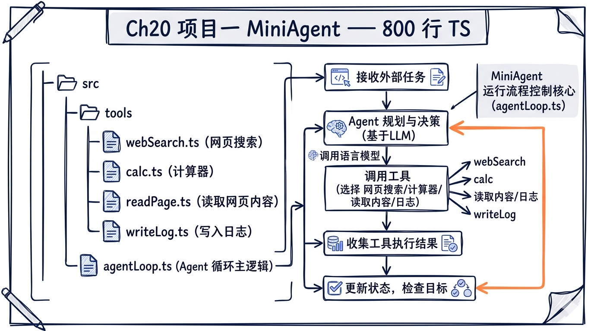
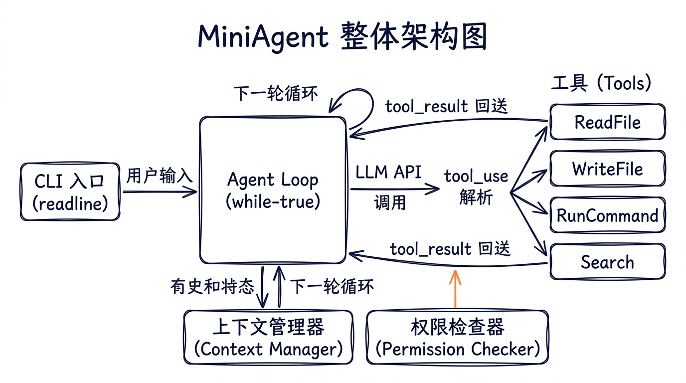
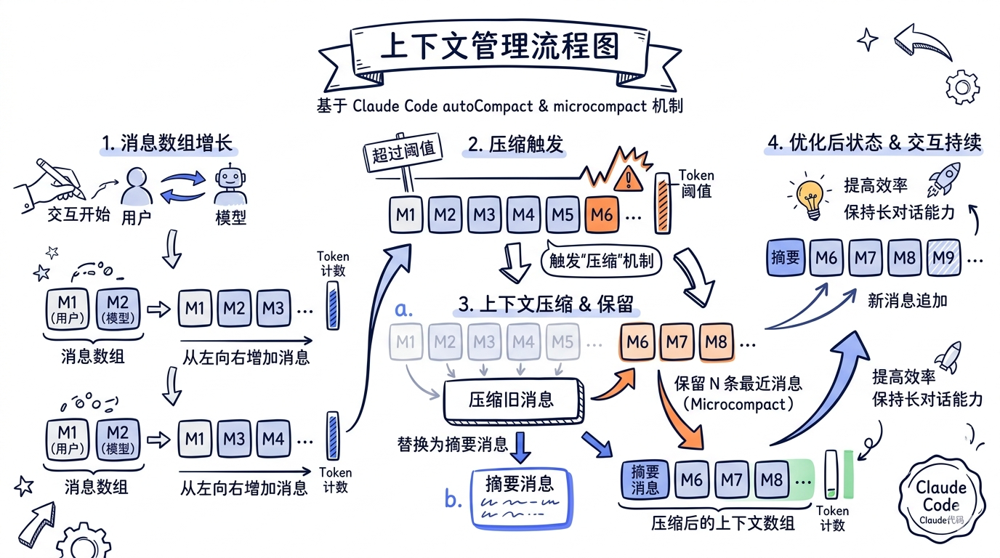
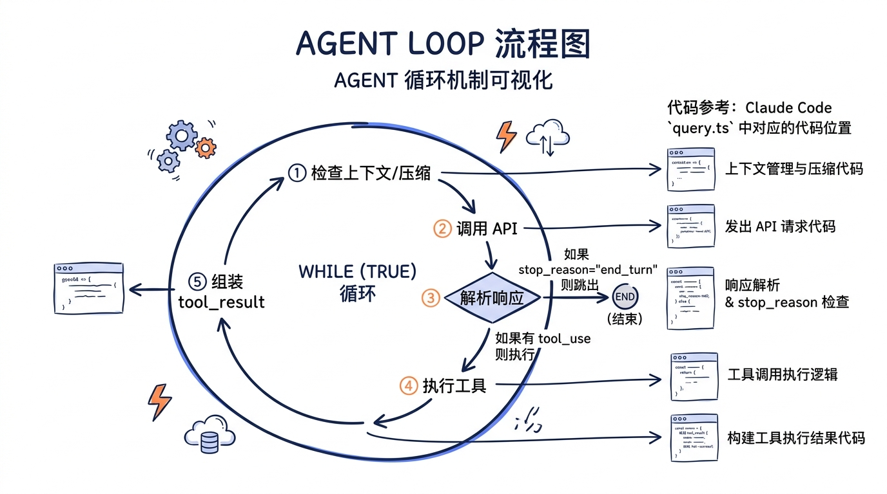

# 第二十章：项目一 -- 从零构建 MiniAgent



> 纸上得来终觉浅，绝知此事要躬行。前面十九章我们剖析了 Claude Code 的每一根骨骼和每一条肌肉。现在，是时候亲手搭一副骨架、缝一层皮肉了。本章的目标是：用不到 800 行 TypeScript，构建一个**真正能用**的 AI 编程助手 -- MiniAgent。

---

## 学习目标

完成本章后，你将拥有：

1. 一个完整可运行的 AI Coding Agent，支持自然语言交互和工具调用
2. 对 Agent Loop（while-true + tool_use）模式的肌肉记忆
3. 对 Tool 抽象接口、注册表、权限检查三层架构的亲身实践
4. 对上下文管理、流式输出、会话持久化、错误恢复四大工程问题的解决方案
5. 一张 MiniAgent 到 Claude Code 源码的精确映射表



---

## 20.1 项目总览与目录结构

我们的 MiniAgent 包含以下文件：

```
mini-agent/
├── package.json
├── tsconfig.json
└── src/
    ├── index.ts          # 入口文件
    ├── types.ts          # 类型定义：Tool 接口、Message 类型
    ├── tools/
    │   ├── readFile.ts   # 读取文件内容
    │   ├── writeFile.ts  # 创建或覆写文件
    │   ├── runCommand.ts # 执行 shell 命令
    │   └── search.ts     # 在目录中搜索文本
    ├── registry.ts       # 工具注册表
    ├── agentLoop.ts      # 核心循环：while(true) + tool_use
    ├── context.ts        # 消息管理 + 基础压缩
    ├── permissions.ts    # 危险命令检查
    └── cli.ts            # readline 交互 + 流式输出
```

每个文件都能在 Claude Code 源码中找到对应物。先建好骨架，再逐一填肉。

---

## 20.2 基础设施：package.json 与 tsconfig.json

### 20.2.1 package.json

```json
{
  "name": "mini-agent",
  "version": "1.0.0",
  "description": "A minimal AI coding agent built from scratch",
  "type": "module",
  "main": "dist/index.js",
  "scripts": {
    "build": "tsc",
    "start": "node dist/index.js",
    "dev": "tsc --watch & node --watch dist/index.js"
  },
  "dependencies": {
    "@anthropic-ai/sdk": "^0.39.0"
  },
  "devDependencies": {
    "@types/node": "^22.0.0",
    "typescript": "^5.7.0"
  }
}
```

唯一的运行时依赖是 `@anthropic-ai/sdk`。Claude Code 的 `package.json` 依赖了上百个包（ink、zod、lodash-es、chalk......），但核心 API 交互只需要这一个。

### 20.2.2 tsconfig.json

```json
{
  "compilerOptions": {
    "target": "ES2022",
    "module": "Node16",
    "moduleResolution": "Node16",
    "outDir": "./dist",
    "rootDir": "./src",
    "strict": true,
    "esModuleInterop": true,
    "skipLibCheck": true,
    "forceConsistentCasingInFileNames": true,
    "resolveJsonModule": true,
    "declaration": true,
    "declarationMap": true,
    "sourceMap": true
  },
  "include": ["src/**/*"],
  "exclude": ["node_modules", "dist"]
}
```

`"module": "Node16"` 配合 `"type": "module"` 确保我们使用 ESM。Claude Code 使用 Bun 运行时，但我们选择 Node.js 以降低门槛。

---

## 20.3 类型系统：src/types.ts

这是整个 MiniAgent 的类型基础。对应 Claude Code 中的 `src/Tool.ts` 和 `src/types/message.ts`。



```typescript
// src/types.ts
// 对应 Claude Code: src/Tool.ts（Tool 接口定义）、src/types/message.ts（消息类型）

import Anthropic from "@anthropic-ai/sdk";

// ============================================================
// Tool 抽象接口
// ============================================================

/**
 * Tool 的 JSON Schema 输入描述。
 * Claude Code 中这是一个完整的 Zod schema（见 Tool.inputSchema），
 * 我们简化为原生 JSON Schema 对象。
 */
export interface ToolInputSchema {
  type: "object";
  properties: Record<string, {
    type: string;
    description: string;
    enum?: string[];
  }>;
  required: string[];
}

/**
 * 工具执行结果。
 * 对应 Claude Code: ToolResult<T>（src/Tool.ts 第 321-336 行）
 */
export interface ToolResult {
  /** 返回给模型的文本内容 */
  content: string;
  /** 执行是否出错 */
  isError: boolean;
}

/**
 * 工具抽象接口。
 * 对应 Claude Code: Tool 类型（src/Tool.ts 第 362-695 行）
 *
 * Claude Code 的 Tool 类型极其庞大（50+ 个字段），包含了权限检查、
 * UI 渲染、进度回报、分组显示等。我们提取其中最核心的 5 个字段。
 */
export interface Tool {
  /** 工具名称，如 "ReadFile"。对应 Tool.name */
  name: string;

  /** 工具描述，供模型理解何时使用该工具。对应 Tool.description() */
  description: string;

  /**
   * 输入参数的 JSON Schema。
   * Claude Code 用 Zod schema + 运行时转换，我们直接使用 JSON Schema。
   * 对应 Tool.inputSchema
   */
  inputSchema: ToolInputSchema;

  /**
   * 执行工具逻辑。
   * Claude Code 的 Tool.call() 签名是：
   *   call(args, context, canUseTool, parentMessage, onProgress?)
   * 我们简化为只接收参数和工作目录。
   */
  execute(args: Record<string, unknown>, cwd: string): Promise<ToolResult>;

  /**
   * 该工具是否只读（不改变文件系统状态）。
   * 对应 Tool.isReadOnly()
   */
  isReadOnly: boolean;
}

// ============================================================
// 消息类型
// ============================================================

/**
 * 对话中的一条消息。
 * 我们直接复用 Anthropic SDK 的消息类型，加上 tool_result。
 */
export type MessageParam = Anthropic.MessageParam;

/**
 * 完整的对话上下文。
 * 对应 Claude Code 中 ToolUseContext.messages（src/Tool.ts 第 250 行）
 */
export interface ConversationContext {
  messages: MessageParam[];
  systemPrompt: string;
}

// ============================================================
// Agent 配置
// ============================================================

export interface AgentConfig {
  /** 使用的模型 */
  model: string;
  /** 最大 token 数 */
  maxTokens: number;
  /** 工作目录 */
  cwd: string;
  /** 会话文件路径（用于持久化） */
  sessionFile?: string;
  /** 是否启用危险命令检查 */
  enablePermissionCheck: boolean;
}

// ============================================================
// 会话持久化
// ============================================================

export interface SessionData {
  messages: MessageParam[];
  createdAt: string;
  lastActiveAt: string;
  cwd: string;
}
```

### 对照 Claude Code 源码

我们的 `Tool` 接口只有 5 个字段。Claude Code 的 `Tool` 类型（`src/Tool.ts` 第 362-695 行）有超过 50 个字段和方法，主要区别：

| MiniAgent | Claude Code | 说明 |
|-----------|-------------|------|
| `name: string` | `name: string` | 相同 |
| `description: string` | `description(input, options)` | CC 是函数，支持根据上下文动态描述 |
| `inputSchema: ToolInputSchema` | `inputSchema: z.ZodType` | CC 用 Zod，支持运行时验证 |
| `execute(args, cwd)` | `call(args, context, canUseTool, parentMessage, onProgress?)` | CC 传入完整上下文 + 权限回调 + 进度回报 |
| `isReadOnly: boolean` | `isReadOnly(input): boolean` | CC 是函数，可根据参数判断 |

Claude Code 额外拥有的重要字段包括：`checkPermissions()`、`validateInput()`、`isConcurrencySafe()`、`renderToolUseMessage()`、`mapToolResultToToolResultBlockParam()` 等。每一个都对应一项产品级工程需求。

---

## 20.4 四个核心工具

### 20.4.1 ReadFile -- 读取文件

对应 Claude Code: `src/tools/FileReadTool/FileReadTool.ts`

```typescript
// src/tools/readFile.ts
// 对应 Claude Code: src/tools/FileReadTool/FileReadTool.ts

import * as fs from "fs/promises";
import * as path from "path";
import type { Tool, ToolResult } from "../types.js";

export const ReadFileTool: Tool = {
  name: "ReadFile",
  description:
    "Read the contents of a file at the specified path. " +
    "Use this when you need to examine existing files. " +
    "The output includes line numbers for reference.",
  inputSchema: {
    type: "object",
    properties: {
      file_path: {
        type: "string",
        description:
          "The path to the file to read. Can be absolute or relative to cwd.",
      },
      offset: {
        type: "number",
        description:
          "Line number to start reading from (0-indexed). Defaults to 0.",
      },
      limit: {
        type: "number",
        description:
          "Maximum number of lines to read. Defaults to 2000.",
      },
    },
    required: ["file_path"],
  },
  isReadOnly: true,

  async execute(
    args: Record<string, unknown>,
    cwd: string,
  ): Promise<ToolResult> {
    const filePath = args.file_path as string;
    const offset = (args.offset as number) ?? 0;
    const limit = (args.limit as number) ?? 2000;

    // 解析路径：支持绝对路径和相对路径
    const resolvedPath = path.isAbsolute(filePath)
      ? filePath
      : path.resolve(cwd, filePath);

    try {
      // 检查文件是否存在
      const stat = await fs.stat(resolvedPath);

      if (stat.isDirectory()) {
        // 如果是目录，列出内容（类似 Claude Code 的行为）
        const entries = await fs.readdir(resolvedPath);
        const listing = entries
          .slice(0, 100)
          .map((e) => `  ${e}`)
          .join("\n");
        return {
          content: `Directory: ${resolvedPath}\n${listing}` +
            (entries.length > 100
              ? `\n  ... and ${entries.length - 100} more`
              : ""),
          isError: false,
        };
      }

      // 读取文件内容
      const raw = await fs.readFile(resolvedPath, "utf-8");
      const lines = raw.split("\n");
      const totalLines = lines.length;

      // 应用 offset 和 limit
      const selectedLines = lines.slice(offset, offset + limit);

      // 添加行号（对应 Claude Code 的 addLineNumbers 函数）
      const numbered = selectedLines
        .map((line, i) => `${offset + i + 1}\t${line}`)
        .join("\n");

      let result = numbered;

      // 如果文件被截断，添加提示
      if (offset + limit < totalLines) {
        result += `\n\n--- File truncated. Showing lines ${offset + 1}-${offset + selectedLines.length} of ${totalLines} total. ---`;
      }

      return { content: result, isError: false };
    } catch (err) {
      const error = err as NodeJS.ErrnoException;
      if (error.code === "ENOENT") {
        return {
          content: `Error: File not found: ${resolvedPath}\n` +
            `Note: The current working directory is ${cwd}`,
          isError: true,
        };
      }
      return {
        content: `Error reading file: ${error.message}`,
        isError: true,
      };
    }
  },
};
```

**源码对照**：Claude Code 的 `FileReadTool` 超过 800 行，额外处理了：
- 图片文件的 Base64 编码和缩放（`imageProcessor.ts`）
- PDF 文件的分页读取（通过 `readPDF()`）
- Jupyter Notebook 的 cell 解析
- 文件大小和 token 数限制（`limits.ts`）
- 权限检查（`checkReadPermissionForTool`）
- 相似文件名建议（`findSimilarFile`）

### 20.4.2 WriteFile -- 写入文件

对应 Claude Code: `src/tools/FileWriteTool/FileWriteTool.ts`

```typescript
// src/tools/writeFile.ts
// 对应 Claude Code: src/tools/FileWriteTool/FileWriteTool.ts

import * as fs from "fs/promises";
import * as path from "path";
import type { Tool, ToolResult } from "../types.js";

export const WriteFileTool: Tool = {
  name: "WriteFile",
  description:
    "Write content to a file at the specified path. " +
    "Creates the file if it doesn't exist, or overwrites if it does. " +
    "Automatically creates parent directories as needed.",
  inputSchema: {
    type: "object",
    properties: {
      file_path: {
        type: "string",
        description:
          "The path to write the file to. Can be absolute or relative to cwd.",
      },
      content: {
        type: "string",
        description: "The content to write to the file.",
      },
    },
    required: ["file_path", "content"],
  },
  isReadOnly: false,

  async execute(
    args: Record<string, unknown>,
    cwd: string,
  ): Promise<ToolResult> {
    const filePath = args.file_path as string;
    const content = args.content as string;

    const resolvedPath = path.isAbsolute(filePath)
      ? filePath
      : path.resolve(cwd, filePath);

    try {
      // 检查文件是否已存在
      let isNew = true;
      let oldContent = "";
      try {
        oldContent = await fs.readFile(resolvedPath, "utf-8");
        isNew = false;
      } catch {
        // 文件不存在，这是新建
      }

      // 自动创建父目录
      await fs.mkdir(path.dirname(resolvedPath), { recursive: true });

      // 写入文件
      await fs.writeFile(resolvedPath, content, "utf-8");

      // 构建结果信息
      if (isNew) {
        const lineCount = content.split("\n").length;
        return {
          content: `Created new file: ${resolvedPath} (${lineCount} lines)`,
          isError: false,
        };
      } else {
        // 简单的 diff 统计
        const oldLines = oldContent.split("\n").length;
        const newLines = content.split("\n").length;
        return {
          content:
            `Updated file: ${resolvedPath}\n` +
            `Lines: ${oldLines} → ${newLines} (${newLines >= oldLines ? "+" : ""}${newLines - oldLines})`,
          isError: false,
        };
      }
    } catch (err) {
      const error = err as Error;
      return {
        content: `Error writing file: ${error.message}`,
        isError: true,
      };
    }
  },
};
```

**源码对照**：Claude Code 的 `FileWriteTool` 额外包含：
- 写入前的文件修改时间检查（防止覆盖用户修改）
- 详细的 diff 补丁生成（`getPatchForDisplay`）
- LSP 通知（`notifyVscodeFileUpdated`）
- Git diff 追踪（`fetchSingleFileGitDiff`）
- 文件历史记录（`fileHistoryTrackEdit`）
- 秘钥检测（`checkTeamMemSecrets`）

### 20.4.3 RunCommand -- 执行命令

对应 Claude Code: `src/tools/BashTool/BashTool.tsx`

```typescript
// src/tools/runCommand.ts
// 对应 Claude Code: src/tools/BashTool/BashTool.tsx

import { exec } from "child_process";
import { promisify } from "util";
import type { Tool, ToolResult } from "../types.js";

const execAsync = promisify(exec);

/** 命令执行的超时时间（毫秒） */
const COMMAND_TIMEOUT = 120_000; // 2 分钟

/** stdout/stderr 最大字节数 */
const MAX_OUTPUT_BYTES = 1024 * 1024; // 1MB

export const RunCommandTool: Tool = {
  name: "RunCommand",
  description:
    "Execute a shell command and return its output. " +
    "Use this for running build tools, tests, git commands, " +
    "installing packages, or any CLI operations. " +
    "Commands run in the project's working directory.",
  inputSchema: {
    type: "object",
    properties: {
      command: {
        type: "string",
        description: "The shell command to execute.",
      },
      timeout: {
        type: "number",
        description:
          "Optional timeout in milliseconds. Defaults to 120000 (2 min).",
      },
    },
    required: ["command"],
  },
  isReadOnly: false,

  async execute(
    args: Record<string, unknown>,
    cwd: string,
  ): Promise<ToolResult> {
    const command = args.command as string;
    const timeout = (args.timeout as number) ?? COMMAND_TIMEOUT;

    try {
      const { stdout, stderr } = await execAsync(command, {
        cwd,
        timeout,
        maxBuffer: MAX_OUTPUT_BYTES,
        env: {
          ...process.env,
          // 禁止交互式提示
          GIT_TERMINAL_PROMPT: "0",
          // 简化输出格式
          TERM: "dumb",
        },
      });

      // 组合输出
      let output = "";
      if (stdout.trim()) {
        output += stdout.trim();
      }
      if (stderr.trim()) {
        if (output) output += "\n\n--- stderr ---\n";
        output += stderr.trim();
      }
      if (!output) {
        output = "(command completed with no output)";
      }

      // 截断过长输出
      if (output.length > 50_000) {
        output =
          output.slice(0, 25_000) +
          "\n\n--- Output truncated (too long) ---\n\n" +
          output.slice(-25_000);
      }

      return { content: output, isError: false };
    } catch (err) {
      const error = err as Error & {
        code?: number | string;
        stdout?: string;
        stderr?: string;
        killed?: boolean;
      };

      // 超时
      if (error.killed) {
        return {
          content:
            `Command timed out after ${timeout}ms: ${command}\n` +
            (error.stdout ? `\nPartial stdout:\n${error.stdout.slice(-5000)}` : ""),
          isError: true,
        };
      }

      // 非零退出码（命令执行了但失败）
      if (error.code !== undefined && error.stdout !== undefined) {
        let output = "";
        if (error.stdout.trim()) output += error.stdout.trim();
        if (error.stderr?.trim()) {
          if (output) output += "\n\n--- stderr ---\n";
          output += error.stderr.trim();
        }

        // 截断
        if (output.length > 50_000) {
          output =
            output.slice(0, 25_000) +
            "\n\n--- Output truncated ---\n\n" +
            output.slice(-25_000);
        }

        return {
          content: `Command exited with code ${error.code}:\n${output}`,
          isError: true,
        };
      }

      return {
        content: `Error executing command: ${error.message}`,
        isError: true,
      };
    }
  },
};
```

**源码对照**：Claude Code 的 `BashTool` 是最复杂的工具之一，跨越多个文件：
- `BashTool.tsx` -- 主逻辑 + React UI 渲染
- `bashPermissions.ts` -- 命令级权限检查 + 分类器
- `bashSecurity.ts` -- 安全策略
- `commandSemantics.ts` -- 命令语义分析（是否只读、是否搜索）
- `destructiveCommandWarning.ts` -- 破坏性命令拦截
- `shouldUseSandbox.ts` -- 沙箱执行判定

Claude Code 还支持流式输出（实时展示命令输出）和中断恢复。

### 20.4.4 Search -- 文件内容搜索

对应 Claude Code: `src/tools/GrepTool/GrepTool.ts`

```typescript
// src/tools/search.ts
// 对应 Claude Code: src/tools/GrepTool/GrepTool.ts

import { exec } from "child_process";
import { promisify } from "util";
import * as path from "path";
import * as fs from "fs/promises";
import type { Tool, ToolResult } from "../types.js";

const execAsync = promisify(exec);

export const SearchTool: Tool = {
  name: "Search",
  description:
    "Search for a pattern in files within a directory. " +
    "Uses grep (or ripgrep if available) to search file contents. " +
    "Returns matching lines with file paths and line numbers.",
  inputSchema: {
    type: "object",
    properties: {
      pattern: {
        type: "string",
        description:
          "The regex pattern to search for in file contents.",
      },
      path: {
        type: "string",
        description:
          "Directory or file to search in. Defaults to cwd.",
      },
      glob: {
        type: "string",
        description:
          'File glob pattern to filter (e.g. "*.ts", "*.{js,jsx}").',
      },
    },
    required: ["pattern"],
  },
  isReadOnly: true,

  async execute(
    args: Record<string, unknown>,
    cwd: string,
  ): Promise<ToolResult> {
    const pattern = args.pattern as string;
    const searchPath = (args.path as string) ?? ".";
    const glob = args.glob as string | undefined;

    const resolvedPath = path.isAbsolute(searchPath)
      ? searchPath
      : path.resolve(cwd, searchPath);

    // 检查路径是否存在
    try {
      await fs.access(resolvedPath);
    } catch {
      return {
        content: `Error: Path not found: ${resolvedPath}`,
        isError: true,
      };
    }

    // 优先使用 ripgrep（rg），回退到 grep
    const useRipgrep = await isRipgrepAvailable();
    let command: string;

    if (useRipgrep) {
      // ripgrep 命令（Claude Code 的 GrepTool 底层就是 rg）
      command = `rg --line-number --no-heading --color=never`;
      if (glob) {
        command += ` --glob '${glob}'`;
      }
      // 排除常见的非代码目录
      command += ` --glob '!node_modules' --glob '!.git' --glob '!dist'`;
      command += ` -- '${escapeShellArg(pattern)}' '${escapeShellArg(resolvedPath)}'`;
    } else {
      // grep 回退
      command = `grep -rn --include='${glob ?? "*"}'`;
      command += ` --exclude-dir=node_modules --exclude-dir=.git --exclude-dir=dist`;
      command += ` -- '${escapeShellArg(pattern)}' '${escapeShellArg(resolvedPath)}'`;
    }

    try {
      const { stdout } = await execAsync(command, {
        cwd,
        timeout: 30_000,
        maxBuffer: 2 * 1024 * 1024,
      });

      const lines = stdout.trim().split("\n").filter(Boolean);
      const resultCount = lines.length;

      if (resultCount === 0) {
        return {
          content: `No matches found for pattern: ${pattern}`,
          isError: false,
        };
      }

      // 限制输出量
      const maxResults = 100;
      let output: string;
      if (resultCount > maxResults) {
        output =
          lines.slice(0, maxResults).join("\n") +
          `\n\n--- ${resultCount - maxResults} more matches (showing first ${maxResults}) ---`;
      } else {
        output = lines.join("\n");
      }

      return {
        content: `Found ${resultCount} matches:\n\n${output}`,
        isError: false,
      };
    } catch (err) {
      const error = err as Error & { code?: number; stdout?: string };
      // grep 退出码 1 = 没有匹配，不是错误
      if (error.code === 1) {
        return {
          content: `No matches found for pattern: ${pattern}`,
          isError: false,
        };
      }
      return {
        content: `Search error: ${error.message}`,
        isError: true,
      };
    }
  },
};

// ============================================================
// 辅助函数
// ============================================================

async function isRipgrepAvailable(): Promise<boolean> {
  try {
    await execAsync("rg --version", { timeout: 5000 });
    return true;
  } catch {
    return false;
  }
}

function escapeShellArg(arg: string): string {
  // 转义单引号
  return arg.replace(/'/g, "'\\''");
}
```

**源码对照**：Claude Code 的 `GrepTool` 使用了一个专门的 `ripgrep.ts` 封装层，支持：
- 多种输出模式（`content` / `files_with_matches` / `count`）
- 上下文行（`-A`/`-B`/`-C` 参数）
- 行号显示开关
- 结果数量限制（`head_limit`）
- 自定义忽略模式（读取 `.gitignore` 和配置文件）

---

## 20.5 工具注册表：src/registry.ts

对应 Claude Code: `src/tools.ts` 中的 `getAllBaseTools()` 函数


```typescript
// src/registry.ts
// 对应 Claude Code: src/tools.ts（getAllBaseTools / getTools / assembleToolPool）

import type { Tool } from "./types.js";

/**
 * 工具注册表。
 *
 * Claude Code 的工具注册方式是在 tools.ts 中硬编码一个数组（getAllBaseTools），
 * 然后通过 getTools() 和 assembleToolPool() 层层过滤：
 *
 *   getAllBaseTools() → 全量工具列表（含条件编译的工具）
 *   getTools(permCtx) → 过滤 deny 规则 + isEnabled 检查
 *   assembleToolPool(permCtx, mcpTools) → 合并 MCP 工具 + 去重
 *
 * 我们简化为一个 Map + register/get/getAll 三个方法。
 */
export class ToolRegistry {
  private tools: Map<string, Tool> = new Map();

  /**
   * 注册一个工具。
   * 对应 Claude Code: getAllBaseTools() 数组中的每一项
   */
  register(tool: Tool): void {
    if (this.tools.has(tool.name)) {
      throw new Error(`Tool already registered: ${tool.name}`);
    }
    this.tools.set(tool.name, tool);
  }

  /**
   * 按名称获取工具。
   * 对应 Claude Code: findToolByName()（src/Tool.ts 第 358-360 行）
   */
  get(name: string): Tool | undefined {
    return this.tools.get(name);
  }

  /**
   * 获取所有已注册工具。
   * 对应 Claude Code: getTools()（src/tools.ts 第 271-327 行）
   */
  getAll(): Tool[] {
    return Array.from(this.tools.values());
  }

  /**
   * 将所有工具转换为 Anthropic API 需要的格式。
   * Claude Code 在 API 调用前也做同样的转换：
   *   Tool → { name, description, input_schema }
   */
  toAPIFormat(): Array<{
    name: string;
    description: string;
    input_schema: Tool["inputSchema"];
  }> {
    return this.getAll().map((tool) => ({
      name: tool.name,
      description: tool.description,
      input_schema: tool.inputSchema,
    }));
  }
}

// ============================================================
// 创建默认注册表（包含所有 4 个工具）
// ============================================================

import { ReadFileTool } from "./tools/readFile.js";
import { WriteFileTool } from "./tools/writeFile.js";
import { RunCommandTool } from "./tools/runCommand.js";
import { SearchTool } from "./tools/search.js";

export function createDefaultRegistry(): ToolRegistry {
  const registry = new ToolRegistry();
  registry.register(ReadFileTool);
  registry.register(WriteFileTool);
  registry.register(RunCommandTool);
  registry.register(SearchTool);
  return registry;
}
```

Claude Code 的工具集合庞大得多。`getAllBaseTools()` 返回 30+ 个工具，包括 `AgentTool`（子代理）、`SkillTool`（技能调用）、`WebFetchTool`（网页抓取）、`NotebookEditTool`（Jupyter）、`TodoWriteTool`（待办管理）、`ToolSearchTool`（工具搜索，用于延迟加载）等。此外，还有条件编译的工具（通过 `feature()` 门控）和 MCP 工具（运行时动态加载）。

---

## 20.6 权限系统：src/permissions.ts

对应 Claude Code: `src/utils/permissions/permissions.ts` + `src/tools/BashTool/bashPermissions.ts`

```typescript
// src/permissions.ts
// 对应 Claude Code: src/utils/permissions/permissions.ts
// 以及 src/tools/BashTool/bashPermissions.ts、bashSecurity.ts

/**
 * 权限检查模块。
 *
 * Claude Code 的权限系统极其精密，包含：
 * 1. PermissionMode（default / plan / bypass / auto 四种模式）
 * 2. 基于配置文件的 allow/deny/ask 规则匹配
 * 3. 分类器驱动的自动模式决策
 * 4. 交互式权限确认弹窗
 * 5. 拒绝次数追踪 + 回退到提示
 *
 * 我们实现最基本的：危险命令黑名单检查。
 */

/** 危险命令模式列表 */
const DANGEROUS_PATTERNS: Array<{
  pattern: RegExp;
  reason: string;
}> = [
  {
    pattern: /\brm\s+(-[a-zA-Z]*f[a-zA-Z]*\s+|.*-[a-zA-Z]*r[a-zA-Z]*f)/,
    reason: "Recursive forced deletion (rm -rf) can permanently destroy data",
  },
  {
    pattern: /\brm\s+(-[a-zA-Z]*r[a-zA-Z]*\s+).*(\*|\/)/,
    reason: "Recursive deletion of wildcard or root paths is dangerous",
  },
  {
    pattern: /\bgit\s+push\s+.*--force\b/,
    reason: "Force push can overwrite remote history",
  },
  {
    pattern: /\bgit\s+reset\s+--hard\b/,
    reason: "Hard reset discards uncommitted changes",
  },
  {
    pattern: /\bgit\s+clean\s+.*-f/,
    reason: "git clean -f permanently deletes untracked files",
  },
  {
    pattern: /\b(chmod|chown)\s+.*-R\s+.*(\/|~)/,
    reason: "Recursive permission changes on broad paths",
  },
  {
    pattern: /\bcurl\s+.*\|\s*(bash|sh|zsh)\b/,
    reason: "Piping remote content to shell is a security risk",
  },
  {
    pattern: /\bsudo\b/,
    reason: "Running commands with elevated privileges",
  },
  {
    pattern: /\b(DROP|DELETE\s+FROM|TRUNCATE)\b/i,
    reason: "Destructive database operations",
  },
  {
    pattern: />\s*\/dev\/sd[a-z]/,
    reason: "Writing directly to disk devices",
  },
  {
    pattern: /\b(mkfs|fdisk|dd\s+if=)\b/,
    reason: "Low-level disk operations",
  },
];

/** 路径写入限制 */
const RESTRICTED_WRITE_PATHS = [
  /^\/etc\//,
  /^\/usr\//,
  /^\/boot\//,
  /^\/sys\//,
  /^\/proc\//,
  /^~\/\.[^/]+$/, // 隐藏配置文件
];

export interface PermissionCheckResult {
  allowed: boolean;
  reason?: string;
  requiresConfirmation: boolean;
}

/**
 * 检查命令是否危险。
 * 对应 Claude Code: 多层权限检查流水线
 *   Tool.checkPermissions() → useCanUseTool hook → 分类器 → 用户确认
 */
export function checkCommandPermission(
  command: string,
): PermissionCheckResult {
  // 检查危险模式
  for (const { pattern, reason } of DANGEROUS_PATTERNS) {
    if (pattern.test(command)) {
      return {
        allowed: false,
        reason: `Dangerous command blocked: ${reason}`,
        requiresConfirmation: true,
      };
    }
  }

  return { allowed: true, requiresConfirmation: false };
}

/**
 * 检查文件写入路径是否安全。
 */
export function checkWritePermission(
  filePath: string,
): PermissionCheckResult {
  for (const pattern of RESTRICTED_WRITE_PATHS) {
    if (pattern.test(filePath)) {
      return {
        allowed: false,
        reason: `Writing to restricted path: ${filePath}`,
        requiresConfirmation: true,
      };
    }
  }

  return { allowed: true, requiresConfirmation: false };
}
```

### 对照 Claude Code 权限架构

Claude Code 的权限系统是一个多级流水线，远比我们的黑名单复杂：

```
Tool.validateInput()        ← 输入格式验证
    ↓
Tool.checkPermissions()     ← 工具自身的权限逻辑
    ↓
useCanUseTool() hook        ← 全局权限 hook
    ↓
Rule matching               ← 配置文件中的 allow/deny/ask 规则匹配
    ↓
Auto-mode classifier        ← AI 分类器判断命令意图
    ↓
Permission prompt            ← 交互式用户确认
    ↓
Denial tracking              ← 累计拒绝次数追踪
```

在 Claude Code 中，每个 Tool 的 `checkPermissions()` 返回的不是简单的布尔值，而是一个 `PermissionResult` 联合类型：

```typescript
// Claude Code: src/utils/permissions/PermissionResult.ts
type PermissionResult =
  | { behavior: 'allow'; updatedInput: Record<string, unknown> }
  | { behavior: 'deny'; reason: string }
  | { behavior: 'ask'; ... }  // 需要用户确认
```

---

## 20.7 上下文管理：src/context.ts

对应 Claude Code: `src/services/compact/compact.ts` + `src/utils/messages.ts`


```typescript
// src/context.ts
// 对应 Claude Code:
//   src/services/compact/compact.ts（压缩逻辑）
//   src/services/compact/autoCompact.ts（自动触发）
//   src/utils/messages.ts（消息工具函数）

import Anthropic from "@anthropic-ai/sdk";
import type { MessageParam, ConversationContext, SessionData } from "./types.js";
import * as fs from "fs/promises";
import * as path from "path";

/**
 * 上下文管理器。
 *
 * Claude Code 的上下文管理是一个复杂的多层系统：
 *
 * 1. autoCompact -- 基于 token 阈值的自动压缩
 * 2. microcompact -- 小粒度的工具结果压缩
 * 3. snipCompact -- 基于历史片段的裁剪
 * 4. reactiveCompact -- 收到 API prompt-too-long 后的反应式压缩
 * 5. contextCollapse -- 上下文折叠（分组压缩）
 *
 * 我们实现最基础的版本：估算 token 数 + 摘要压缩。
 */

/** token 估算：1 个英文 token ≈ 4 字符，中文 ≈ 1.5 字符 */
function estimateTokens(text: string): number {
  // 粗略估算，Claude Code 有专门的 tokenEstimation.ts
  // 使用 API 的 countTokens 做精确计算
  const asciiChars = text.replace(/[^\x00-\x7F]/g, "").length;
  const nonAsciiChars = text.length - asciiChars;
  return Math.ceil(asciiChars / 4 + nonAsciiChars / 1.5);
}

/** 估算消息数组的总 token 数 */
function estimateMessagesTokens(messages: MessageParam[]): number {
  let total = 0;
  for (const msg of messages) {
    if (typeof msg.content === "string") {
      total += estimateTokens(msg.content);
    } else if (Array.isArray(msg.content)) {
      for (const block of msg.content) {
        if ("text" in block && typeof block.text === "string") {
          total += estimateTokens(block.text);
        }
      }
    }
  }
  return total;
}

/** 压缩阈值（token 数） */
const COMPACT_THRESHOLD = 80_000;

/** 压缩后保留的最近消息数 */
const KEEP_RECENT_MESSAGES = 10;

export class ContextManager {
  private messages: MessageParam[] = [];
  private systemPrompt: string;
  private sessionFile: string | undefined;
  private client: Anthropic;

  constructor(
    systemPrompt: string,
    client: Anthropic,
    sessionFile?: string,
  ) {
    this.systemPrompt = systemPrompt;
    this.client = client;
    this.sessionFile = sessionFile;
  }

  /** 获取当前上下文 */
  getContext(): ConversationContext {
    return {
      messages: [...this.messages],
      systemPrompt: this.systemPrompt,
    };
  }

  /** 获取消息列表（只读引用） */
  getMessages(): readonly MessageParam[] {
    return this.messages;
  }

  /** 添加消息 */
  addMessage(message: MessageParam): void {
    this.messages.push(message);
  }

  /** 添加多条消息 */
  addMessages(messages: MessageParam[]): void {
    this.messages.push(...messages);
  }

  /** 获取估算 token 数 */
  getEstimatedTokens(): number {
    return estimateMessagesTokens(this.messages);
  }

  /**
   * 检查是否需要压缩，如果需要则执行。
   *
   * 对应 Claude Code:
   *   autoCompact()（src/services/compact/autoCompact.ts）
   *   compact()    （src/services/compact/compact.ts）
   *
   * Claude Code 的 autoCompact 会在每次 query loop 迭代开始时检查，
   * 如果 token 数超过阈值，就通过一个独立的 fork agent 生成摘要。
   * 摘要后的消息列表替换原消息列表，形成一个"压缩边界"。
   */
  async maybeCompact(): Promise<boolean> {
    const tokenCount = this.getEstimatedTokens();

    if (tokenCount < COMPACT_THRESHOLD) {
      return false;
    }

    console.log(
      `\n[Context] Token count ~${tokenCount} exceeds threshold ${COMPACT_THRESHOLD}. Compacting...`,
    );

    // 分离需要压缩的旧消息和保留的新消息
    const messagesToCompress = this.messages.slice(
      0,
      -KEEP_RECENT_MESSAGES,
    );
    const recentMessages = this.messages.slice(-KEEP_RECENT_MESSAGES);

    if (messagesToCompress.length === 0) {
      return false;
    }

    // 用模型生成摘要
    // 对应 Claude Code: runForkedAgent() 用独立上下文生成摘要
    try {
      const summaryContent = this.buildSummaryContent(messagesToCompress);

      const response = await this.client.messages.create({
        model: "claude-sonnet-4-20250514",
        max_tokens: 2048,
        system:
          "You are a conversation summarizer. Summarize the conversation history below into a concise but comprehensive summary. " +
          "Focus on: what files were read/modified, what commands were run, what problems were found, what solutions were applied, " +
          "and any important context. Keep technical details like file paths and error messages.",
        messages: [
          {
            role: "user",
            content: `Summarize this conversation:\n\n${summaryContent}`,
          },
        ],
      });

      const summaryText =
        response.content[0]?.type === "text"
          ? response.content[0].text
          : "Summary unavailable.";

      // 用摘要消息替换旧消息
      // 对应 Claude Code: buildPostCompactMessages()
      this.messages = [
        {
          role: "user" as const,
          content: `[Previous conversation summary]\n${summaryText}`,
        },
        {
          role: "assistant" as const,
          content:
            "Understood. I have the context from our previous conversation. How can I help you continue?",
        },
        ...recentMessages,
      ];

      const newTokenCount = this.getEstimatedTokens();
      console.log(
        `[Context] Compacted: ~${tokenCount} → ~${newTokenCount} tokens`,
      );

      return true;
    } catch (err) {
      console.error("[Context] Compaction failed:", err);
      // 压缩失败时的回退：简单裁剪旧消息
      // 对应 Claude Code 的 consecutiveFailures 追踪
      if (this.messages.length > KEEP_RECENT_MESSAGES * 2) {
        this.messages = this.messages.slice(-KEEP_RECENT_MESSAGES * 2);
      }
      return false;
    }
  }

  /**
   * 将消息数组序列化为文本（供摘要用）。
   */
  private buildSummaryContent(messages: MessageParam[]): string {
    const parts: string[] = [];
    for (const msg of messages) {
      const role = msg.role.toUpperCase();
      if (typeof msg.content === "string") {
        parts.push(`[${role}]: ${msg.content}`);
      } else if (Array.isArray(msg.content)) {
        const texts: string[] = [];
        for (const block of msg.content) {
          if ("text" in block && typeof block.text === "string") {
            texts.push(block.text);
          } else if (block.type === "tool_use") {
            const toolBlock = block as { name?: string; input?: unknown };
            texts.push(
              `[Tool call: ${toolBlock.name}(${JSON.stringify(toolBlock.input).slice(0, 200)})]`,
            );
          } else if (block.type === "tool_result") {
            const resultBlock = block as { content?: string | unknown };
            const content =
              typeof resultBlock.content === "string"
                ? resultBlock.content.slice(0, 500)
                : JSON.stringify(resultBlock.content).slice(0, 500);
            texts.push(`[Tool result: ${content}]`);
          }
        }
        parts.push(`[${role}]: ${texts.join("\n")}`);
      }
    }
    return parts.join("\n\n");
  }

  // ============================================================
  // 会话持久化
  // ============================================================

  /**
   * 保存会话到文件。
   * 对应 Claude Code: src/utils/sessionStorage.ts
   */
  async saveSession(cwd: string): Promise<void> {
    if (!this.sessionFile) return;

    const data: SessionData = {
      messages: this.messages,
      createdAt: new Date().toISOString(),
      lastActiveAt: new Date().toISOString(),
      cwd,
    };

    const dir = path.dirname(this.sessionFile);
    await fs.mkdir(dir, { recursive: true });
    await fs.writeFile(
      this.sessionFile,
      JSON.stringify(data, null, 2),
      "utf-8",
    );
  }

  /**
   * 从文件恢复会话。
   * 对应 Claude Code: 会话恢复逻辑（--resume 参数）
   */
  async loadSession(): Promise<boolean> {
    if (!this.sessionFile) return false;

    try {
      const raw = await fs.readFile(this.sessionFile, "utf-8");
      const data: SessionData = JSON.parse(raw);
      this.messages = data.messages;
      console.log(
        `[Session] Restored ${this.messages.length} messages from ${this.sessionFile}`,
      );
      return true;
    } catch {
      return false;
    }
  }
}
```

### 对照 Claude Code 的上下文管理

Claude Code 的上下文管理是分 5 层的精密系统：

| 层级 | 机制 | 触发时机 | 我们的简化 |
|------|------|----------|------------|
| 1 | `snipCompact` | 每次迭代前 | 不实现 |
| 2 | `microcompact` | 每次迭代前（在 snip 后） | 不实现 |
| 3 | `contextCollapse` | 每次迭代前（在 microcompact 后） | 不实现 |
| 4 | `autoCompact` | token 超过阈值时 | `maybeCompact()` |
| 5 | `reactiveCompact` | 收到 API 413 错误后 | 回退裁剪 |

Claude Code 的 `autoCompact` 通过 `runForkedAgent()` 在一个独立的对话中生成摘要，并且会执行 `preCompactHooks` 和 `postCompactHooks`。压缩后的消息通过 `SystemCompactBoundaryMessage` 标记边界，确保后续代码知道哪些消息是压缩后的。

---

## 20.8 核心引擎：src/agentLoop.ts

这是整个 MiniAgent 的心脏。对应 Claude Code: `src/query.ts` 中的 `queryLoop()` 函数。



```typescript
// src/agentLoop.ts
// 对应 Claude Code: src/query.ts 的 queryLoop() 函数（第 241-1729 行）

import Anthropic from "@anthropic-ai/sdk";
import type { MessageParam, AgentConfig } from "./types.js";
import type { ToolRegistry } from "./registry.js";
import type { ContextManager } from "./context.js";
import {
  checkCommandPermission,
  checkWritePermission,
} from "./permissions.js";

/**
 * Agent 循环的返回原因。
 * 对应 Claude Code: Terminal 类型（src/query/transitions.ts）
 */
export type StopReason =
  | "end_turn"        // 模型自然结束
  | "max_turns"       // 达到最大轮次
  | "error"           // 发生错误
  | "aborted"         // 用户中断
  | "permission_denied"; // 权限拒绝

export interface AgentLoopResult {
  reason: StopReason;
  finalResponse?: string;
  turnCount: number;
}

/**
 * 核心 Agent 循环。
 *
 * 这就是整个 Agent 的核心：一个 while(true)。
 * 对应 Claude Code: queryLoop()（src/query.ts 第 241 行起）
 *
 * Claude Code 的 queryLoop 是一个 AsyncGenerator，每一步都 yield
 * StreamEvent 给上层消费者（UI 层）。我们简化为直接打印输出。
 *
 * Claude Code 的循环逻辑（简化版）：
 *   while (true) {
 *     1. 预处理：snip → microcompact → contextCollapse → autoCompact
 *     2. API 调用：callModel() 流式读取
 *     3. 解析响应：提取 tool_use blocks
 *     4. 如果没有 tool_use → 执行 stop hooks → 退出
 *     5. 执行工具：runTools() / StreamingToolExecutor
 *     6. 收集 tool_result → 注入附件
 *     7. 更新状态 → continue
 *   }
 */
export async function runAgentLoop(
  client: Anthropic,
  registry: ToolRegistry,
  context: ContextManager,
  config: AgentConfig,
  onText?: (text: string) => void,
  abortSignal?: AbortSignal,
): Promise<AgentLoopResult> {
  const maxTurns = 30; // 对应 Claude Code: QueryParams.maxTurns
  let turnCount = 0;

  // 对应 Claude Code: query.ts 第 307 行 "while (true)"
  while (true) {
    // ============================================================
    // 阶段 0：检查中断信号
    // ============================================================
    if (abortSignal?.aborted) {
      return { reason: "aborted", turnCount };
    }

    // ============================================================
    // 阶段 1：上下文管理（压缩检查）
    // 对应 Claude Code: query.ts 第 400-470 行
    //   snipCompact → microcompact → contextCollapse → autoCompact
    // ============================================================
    await context.maybeCompact();

    // ============================================================
    // 阶段 2：调用 API（流式）
    // 对应 Claude Code: query.ts 第 659-863 行
    //   deps.callModel() 包装了 Anthropic SDK 的 messages.create
    // ============================================================
    turnCount++;

    if (turnCount > maxTurns) {
      return { reason: "max_turns", turnCount };
    }

    const { messages, systemPrompt } = context.getContext();

    let response: Anthropic.Message;
    try {
      // 流式调用 API
      const stream = client.messages.stream({
        model: config.model,
        max_tokens: config.maxTokens,
        system: systemPrompt,
        messages,
        tools: registry.toAPIFormat(),
      });

      // 处理流式文本输出
      // 对应 Claude Code 的 StreamEvent yield 机制
      stream.on("text", (text) => {
        if (onText) {
          onText(text);
        }
      });

      response = await stream.finalMessage();
    } catch (err) {
      const error = err as Error;

      // 处理 API 错误
      // 对应 Claude Code: query.ts 第 955-997 行的错误处理
      if (error.message?.includes("prompt is too long")) {
        // prompt-too-long：尝试强制压缩
        console.error("\n[Error] Prompt too long. Attempting emergency compaction...");
        context.addMessage({
          role: "user",
          content: "(Context was too long and has been automatically compressed.)",
        });
        continue;
      }

      if (
        error.message?.includes("rate_limit") ||
        error.message?.includes("overloaded")
      ) {
        // 速率限制：等待后重试
        // 对应 Claude Code: src/services/api/withRetry.ts
        console.error("\n[Error] Rate limited. Waiting 10s...");
        await sleep(10_000);
        turnCount--; // 不计入轮次
        continue;
      }

      console.error(`\n[Error] API call failed: ${error.message}`);
      return { reason: "error", turnCount };
    }

    // ============================================================
    // 阶段 3：解析响应
    // 对应 Claude Code: query.ts 第 828-845 行
    //   从 assistant message 中提取 tool_use blocks
    // ============================================================

    // 将 assistant 消息添加到上下文
    context.addMessage({
      role: "assistant",
      content: response.content,
    });

    // 提取文本和工具调用
    const toolUseBlocks = response.content.filter(
      (block): block is Anthropic.ToolUseBlock => block.type === "tool_use",
    );

    const textBlocks = response.content.filter(
      (block): block is Anthropic.TextBlock => block.type === "text",
    );

    // ============================================================
    // 阶段 4：如果没有工具调用，循环结束
    // 对应 Claude Code: query.ts 第 1062 行
    //   if (!needsFollowUp) { ... return { reason: 'completed' } }
    // ============================================================
    if (toolUseBlocks.length === 0) {
      const finalText = textBlocks.map((b) => b.text).join("");
      return {
        reason: "end_turn",
        finalResponse: finalText,
        turnCount,
      };
    }

    // ============================================================
    // 阶段 5：执行工具
    // 对应 Claude Code: query.ts 第 1380-1408 行
    //   runTools() 或 StreamingToolExecutor
    //
    // Claude Code 将工具分为两批：
    //   - isConcurrencySafe=true → 并行执行（如读文件、搜索）
    //   - isConcurrencySafe=false → 串行执行（如写文件、命令）
    // 我们简化为串行执行所有工具。
    // ============================================================
    const toolResults: MessageParam[] = [];

    for (const toolUse of toolUseBlocks) {
      const tool = registry.get(toolUse.name);

      if (!tool) {
        // 工具未找到
        // 对应 Claude Code: toolExecution.ts 中的工具查找失败处理
        toolResults.push({
          role: "user",
          content: [
            {
              type: "tool_result",
              tool_use_id: toolUse.id,
              content: `Error: Unknown tool "${toolUse.name}"`,
              is_error: true,
            },
          ],
        });
        continue;
      }

      // 权限检查
      // 对应 Claude Code: toolExecution.ts → canUseTool → checkPermissions
      if (config.enablePermissionCheck && !tool.isReadOnly) {
        const args = toolUse.input as Record<string, unknown>;
        let permResult = { allowed: true, requiresConfirmation: false, reason: undefined as string | undefined };

        if (tool.name === "RunCommand" && args.command) {
          permResult = checkCommandPermission(args.command as string);
        } else if (tool.name === "WriteFile" && args.file_path) {
          permResult = checkWritePermission(args.file_path as string);
        }

        if (!permResult.allowed) {
          console.log(`\n[Permission] Blocked: ${permResult.reason}`);
          toolResults.push({
            role: "user",
            content: [
              {
                type: "tool_result",
                tool_use_id: toolUse.id,
                content: `Permission denied: ${permResult.reason}`,
                is_error: true,
              },
            ],
          });
          continue;
        }
      }

      // 打印工具调用信息
      const inputPreview = JSON.stringify(toolUse.input).slice(0, 200);
      console.log(`\n[Tool] ${toolUse.name}(${inputPreview})`);

      // 执行工具
      // 对应 Claude Code: toolExecution.ts → executeTool()
      try {
        const result = await tool.execute(
          toolUse.input as Record<string, unknown>,
          config.cwd,
        );

        // 打印结果摘要
        const preview = result.content.slice(0, 200);
        console.log(
          `[Tool] ${result.isError ? "ERROR" : "OK"}: ${preview}${result.content.length > 200 ? "..." : ""}`,
        );

        toolResults.push({
          role: "user",
          content: [
            {
              type: "tool_result",
              tool_use_id: toolUse.id,
              content: result.content,
              is_error: result.isError,
            },
          ],
        });
      } catch (err) {
        // 工具执行异常
        // 对应 Claude Code: toolExecution.ts 的 catch 块
        const error = err as Error;
        console.error(`[Tool] Exception: ${error.message}`);

        toolResults.push({
          role: "user",
          content: [
            {
              type: "tool_result",
              tool_use_id: toolUse.id,
              content: `Tool execution error: ${error.message}`,
              is_error: true,
            },
          ],
        });
      }
    }

    // ============================================================
    // 阶段 6：将工具结果注入上下文，进入下一轮
    // 对应 Claude Code: query.ts 第 1715-1717 行
    //   messages: [...messagesForQuery, ...assistantMessages, ...toolResults]
    // ============================================================
    context.addMessages(toolResults);

    // 保存会话（每轮工具执行后）
    await context.saveSession(config.cwd);
  }
}

// ============================================================
// 辅助函数
// ============================================================

function sleep(ms: number): Promise<void> {
  return new Promise((resolve) => setTimeout(resolve, ms));
}
```

### 逐行对照 Claude Code 的 queryLoop

这是本章最关键的映射。我们的 `runAgentLoop` 中的每一步，在 Claude Code 的 `queryLoop()` 中都有对应：

```
MiniAgent                          Claude Code (query.ts)
─────────────────────────────────  ────────────────────────────────────
while (true)                       while (true) [第 307 行]
  ↓                                  ↓
检查中断信号                        abortController.signal.aborted
  ↓                                  ↓
maybeCompact()                     snipCompact → microcompact →
                                   contextCollapse → autoCompact
                                   [第 400-543 行]
  ↓                                  ↓
client.messages.stream()           deps.callModel() [第 659 行]
  ↓                                  ↓
stream.on("text", ...)             yield message (StreamEvent)
                                   [第 823 行]
  ↓                                  ↓
提取 tool_use blocks               toolUseBlocks.push(...) [第 830 行]
  ↓                                  ↓
if (toolUseBlocks.length === 0)    if (!needsFollowUp) [第 1062 行]
  return "end_turn"                  return { reason: 'completed' }
  ↓                                  ↓
checkCommandPermission()           canUseTool() → checkPermissions()
                                   [toolExecution.ts]
  ↓                                  ↓
tool.execute()                     runTools() / StreamingToolExecutor
                                   [第 1380-1408 行]
  ↓                                  ↓
context.addMessages(toolResults)   state = { messages: [..., toolResults] }
                                   [第 1715-1717 行]
  ↓                                  ↓
continue                           continue [第 1727 行]
```

---

## 20.9 CLI 交互层：src/cli.ts

对应 Claude Code: `src/entrypoints/cli.tsx` + `src/screens/REPL.tsx`（Ink UI）

```typescript
// src/cli.ts
// 对应 Claude Code:
//   src/entrypoints/cli.tsx（启动入口）
//   src/screens/REPL.tsx（Ink 交互界面）
//   src/ink.ts（Ink 应用管理）

import * as readline from "readline";
import Anthropic from "@anthropic-ai/sdk";
import type { AgentConfig } from "./types.js";
import { createDefaultRegistry } from "./registry.js";
import { ContextManager } from "./context.js";
import { runAgentLoop } from "./agentLoop.js";

/**
 * 系统提示。
 * 对应 Claude Code: 由 getSystemPrompt() 动态生成
 * （包含 CLAUDE.md、git 状态、工具列表等）
 *
 * Claude Code 的系统提示超过 10,000 字，包含：
 * - 角色定义和核心规则
 * - 所有工具的使用指南
 * - 项目特定的 CLAUDE.md 内容
 * - Git 状态信息
 * - 权限模式说明
 * - 搜索策略指导
 */
const SYSTEM_PROMPT = `You are an AI coding assistant. You have access to the following tools to help users with their coding tasks:

1. ReadFile - Read file contents with line numbers
2. WriteFile - Create or overwrite files
3. RunCommand - Execute shell commands
4. Search - Search file contents using regex

Guidelines:
- Always read files before modifying them
- Use Search to find relevant code before making changes
- Explain what you're doing and why
- If a command fails, analyze the error and try a different approach
- Be precise with file paths (use absolute paths when possible)
- When writing code, include proper error handling

The user's working directory is available as context. All file paths should be relative to or within this directory unless explicitly specified otherwise.`;

/**
 * 启动 CLI 交互循环。
 */
export async function startCLI(config: AgentConfig): Promise<void> {
  // 初始化 SDK
  const client = new Anthropic();

  // 初始化工具注册表
  const registry = createDefaultRegistry();

  // 初始化上下文管理器
  const contextManager = new ContextManager(
    SYSTEM_PROMPT,
    client,
    config.sessionFile,
  );

  // 尝试恢复会话
  const restored = await contextManager.loadSession();
  if (restored) {
    console.log("[Session] Previous session restored. Type /clear to start fresh.");
  }

  // 创建 readline 接口
  // Claude Code 使用 Ink（React for CLI）构建 UI，
  // 我们用 Node.js 原生的 readline 模块。
  const rl = readline.createInterface({
    input: process.stdin,
    output: process.stdout,
    prompt: "\n> ",
  });

  // 中断控制器
  let currentAbort: AbortController | null = null;

  // 处理 Ctrl+C
  rl.on("SIGINT", () => {
    if (currentAbort) {
      console.log("\n[Interrupted]");
      currentAbort.abort();
      currentAbort = null;
      rl.prompt();
    } else {
      console.log("\nGoodbye!");
      process.exit(0);
    }
  });

  // 打印欢迎信息
  printWelcome(config);
  rl.prompt();

  // 主交互循环
  // 对应 Claude Code 的 REPL 组件事件循环
  for await (const line of rl) {
    const input = line.trim();

    if (!input) {
      rl.prompt();
      continue;
    }

    // 处理内置命令
    // 对应 Claude Code: src/commands.ts
    if (input.startsWith("/")) {
      const handled = handleCommand(input, contextManager, config);
      if (handled === "exit") {
        break;
      }
      rl.prompt();
      continue;
    }

    // 添加用户消息到上下文
    contextManager.addMessage({
      role: "user",
      content: input,
    });

    // 创建中断控制器
    currentAbort = new AbortController();

    // 运行 Agent 循环
    try {
      const result = await runAgentLoop(
        client,
        registry,
        contextManager,
        config,
        (text) => process.stdout.write(text), // 流式输出回调
        currentAbort.signal,
      );

      // 打印结果状态
      if (result.reason === "end_turn") {
        // 正常结束，文本已流式输出
        console.log(""); // 换行
      } else if (result.reason === "max_turns") {
        console.log(`\n[Stopped after ${result.turnCount} turns]`);
      } else if (result.reason === "error") {
        console.log("\n[Agent stopped due to error]");
      }

      // 保存会话
      await contextManager.saveSession(config.cwd);
    } catch (err) {
      console.error("\n[Fatal error]:", (err as Error).message);
    }

    currentAbort = null;
    rl.prompt();
  }

  // 退出前保存
  await contextManager.saveSession(config.cwd);
  console.log("Session saved. Goodbye!");
  rl.close();
}

// ============================================================
// 内置命令处理
// ============================================================

function handleCommand(
  input: string,
  context: ContextManager,
  config: AgentConfig,
): string | void {
  const [cmd, ...args] = input.split(/\s+/);

  switch (cmd) {
    case "/help":
      console.log(`
Available commands:
  /help     Show this help message
  /clear    Clear conversation history
  /compact  Manually trigger context compaction
  /status   Show session status
  /exit     Exit the agent
`);
      break;

    case "/clear":
      // 对应 Claude Code: /clear 命令
      // 清空消息但保留系统提示
      (context as any).messages = [];
      console.log("[Cleared] Conversation history cleared.");
      break;

    case "/compact":
      // 对应 Claude Code: /compact 命令
      console.log("[Compacting...]");
      context.maybeCompact().then((compacted) => {
        if (!compacted) {
          console.log("[Compact] No compaction needed.");
        }
      });
      break;

    case "/status":
      console.log(`
Session status:
  Working directory: ${config.cwd}
  Model: ${config.model}
  Messages: ${context.getMessages().length}
  Estimated tokens: ~${context.getEstimatedTokens()}
  Permission check: ${config.enablePermissionCheck ? "enabled" : "disabled"}
`);
      break;

    case "/exit":
    case "/quit":
      return "exit";

    default:
      console.log(`Unknown command: ${cmd}. Type /help for available commands.`);
  }
}

// ============================================================
// 欢迎信息
// ============================================================

function printWelcome(config: AgentConfig): void {
  console.log(`
╔══════════════════════════════════════╗
║         MiniAgent v1.0.0            ║
║   A minimal AI coding assistant     ║
╚══════════════════════════════════════╝

Model:   ${config.model}
CWD:     ${config.cwd}
Session: ${config.sessionFile ?? "(none)"}

Type your request, or /help for commands.
Press Ctrl+C to interrupt, Ctrl+C again to exit.
`);
}
```

### 对照 Claude Code 的 UI 层

Claude Code 使用 Ink（React for CLI）构建了一套完整的终端 UI：

| 功能 | MiniAgent | Claude Code |
|------|-----------|-------------|
| 框架 | readline | Ink (React) |
| 输入 | 单行文本 | 多行编辑器 + 图片粘贴 + 拖放 |
| 输出 | process.stdout.write | React 组件树渲染 |
| 命令 | 4 个 | 20+ 个 |
| 进度 | 文本打印 | Spinner 组件 + 工具进度条 |
| 主题 | 无 | 多主题支持（light/dark/custom） |
| 权限确认 | 无（直接拒绝） | 交互式弹窗 |

---

## 20.10 入口文件：src/index.ts

```typescript
// src/index.ts
// 对应 Claude Code: src/entrypoints/cli.tsx → src/main.tsx

import * as path from "path";
import * as os from "os";
import { startCLI } from "./cli.js";
import type { AgentConfig } from "./types.js";

/**
 * 解析命令行参数并启动 Agent。
 *
 * Claude Code 使用 Commander.js（@commander-js/extra-typings）解析参数，支持 30+ 个 flag。
 * 我们用最简单的 process.argv 解析。
 */
function parseArgs(): AgentConfig {
  const args = process.argv.slice(2);
  const config: AgentConfig = {
    model: "claude-sonnet-4-20250514",
    maxTokens: 16384,
    cwd: process.cwd(),
    enablePermissionCheck: true,
    sessionFile: path.join(
      os.homedir(),
      ".mini-agent",
      "sessions",
      "default.json",
    ),
  };

  for (let i = 0; i < args.length; i++) {
    switch (args[i]) {
      case "--model":
      case "-m":
        config.model = args[++i] ?? config.model;
        break;
      case "--cwd":
        config.cwd = path.resolve(args[++i] ?? config.cwd);
        break;
      case "--max-tokens":
        config.maxTokens = parseInt(args[++i] ?? "16384", 10);
        break;
      case "--no-permission-check":
        config.enablePermissionCheck = false;
        break;
      case "--session":
        config.sessionFile = args[++i] ?? config.sessionFile;
        break;
      case "--no-session":
        config.sessionFile = undefined;
        break;
      case "--help":
      case "-h":
        printUsage();
        process.exit(0);
        break;
      default:
        if (!args[i]!.startsWith("-")) {
          // 非 flag 参数当作 cwd
          config.cwd = path.resolve(args[i]!);
        }
    }
  }

  return config;
}

function printUsage(): void {
  console.log(`
Usage: mini-agent [options] [directory]

Options:
  -m, --model <model>       Model to use (default: claude-sonnet-4-20250514)
  --cwd <dir>               Working directory
  --max-tokens <n>          Max output tokens (default: 16384)
  --no-permission-check     Disable dangerous command checking
  --session <file>          Session file path
  --no-session              Disable session persistence
  -h, --help                Show this help
`);
}

// ============================================================
// 环境检查
// ============================================================

function checkEnvironment(): void {
  if (!process.env.ANTHROPIC_API_KEY) {
    console.error(
      "Error: ANTHROPIC_API_KEY environment variable is not set.\n" +
      "Get your API key at https://console.anthropic.com/\n" +
      "Then run: export ANTHROPIC_API_KEY=your-key-here",
    );
    process.exit(1);
  }
}

// ============================================================
// 启动
// ============================================================

async function main(): Promise<void> {
  checkEnvironment();
  const config = parseArgs();

  try {
    await startCLI(config);
  } catch (err) {
    console.error("Fatal error:", err);
    process.exit(1);
  }
}

main();
```

---

## 20.11 运行测试

一切就绪。现在来验证 MiniAgent 能否工作。

### 20.11.1 安装与构建

```bash
# 创建项目目录
mkdir mini-agent && cd mini-agent

# 初始化（将上面的文件放入对应位置后）
npm install

# 编译
npm run build
```

### 20.11.2 设置 API Key

```bash
export ANTHROPIC_API_KEY="sk-ant-api03-..."
```

### 20.11.3 启动测试

```bash
# 启动 MiniAgent
node dist/index.js

# 或指定工作目录
node dist/index.js --cwd /path/to/your/project
```

### 20.11.4 测试场景

**场景 1：文件读取**

```
> Read the package.json file in this directory
```

预期行为：Agent 调用 `ReadFile` 工具，输出带行号的文件内容。

**场景 2：代码搜索**

```
> Search for all TODO comments in the src directory
```

预期行为：Agent 调用 `Search` 工具，使用 `TODO` 模式搜索，返回匹配行。

**场景 3：文件创建**

```
> Create a new file called hello.ts that exports a function greeting(name: string) which returns "Hello, {name}!"
```

预期行为：Agent 先思考代码内容，然后调用 `WriteFile` 创建文件。

**场景 4：多步任务（Agent Loop 真正发挥作用）**

```
> Read the package.json, add a "lint" script that runs eslint, and write it back
```

预期行为：
1. Agent 调用 `ReadFile` 读取 package.json（第 1 轮）
2. 模型分析内容，调用 `WriteFile` 写入修改后的文件（第 2 轮）
3. 模型确认完成，自然结束（stop_reason: end_turn）

这就是 while(true) 的威力：模型不受限于单次请求-响应，可以通过多轮工具调用完成复杂任务。

**场景 5：错误恢复**

```
> Read the file /nonexistent/path/file.txt
```

预期行为：`ReadFile` 返回 `isError: true`，模型收到错误信息后，可能建议搜索正确文件。

**场景 6：权限拦截**

```
> Run the command: rm -rf /
```

预期行为：权限检查拦截，返回 "Permission denied" 给模型。

**场景 7：上下文压缩**

持续对话直到 token 数超过阈值（约 80K tokens），观察自动压缩触发的日志输出：

```
[Context] Token count ~85000 exceeds threshold 80000. Compacting...
[Context] Compacted: ~85000 → ~12000 tokens
```

### 20.11.5 验证清单

| 测试项 | 预期结果 | 对应源码组件 |
|--------|---------|-------------|
| 启动 | 显示欢迎信息 | cli.ts |
| 单轮对话 | 模型直接回复文本 | agentLoop.ts |
| ReadFile | 读取并显示带行号的内容 | tools/readFile.ts |
| WriteFile | 创建/修改文件 | tools/writeFile.ts |
| RunCommand | 执行命令并返回输出 | tools/runCommand.ts |
| Search | 搜索文件内容 | tools/search.ts |
| 多轮工具调用 | while(true) 持续运行直到任务完成 | agentLoop.ts |
| 流式输出 | 文本逐字符打印 | cli.ts + agentLoop.ts |
| 错误恢复 | 工具错误不导致崩溃 | agentLoop.ts |
| 权限拦截 | 危险命令被阻止 | permissions.ts |
| /clear | 清空历史 | cli.ts |
| /compact | 手动压缩 | context.ts |
| /status | 显示状态 | cli.ts |
| 会话保存 | 退出后再启动可恢复 | context.ts |
| Ctrl+C | 中断当前操作 | cli.ts |

---

## 20.12 源码对照表

这张表是 MiniAgent 到 Claude Code v2.1.88 源码的完整映射：

| MiniAgent 文件 | Claude Code 对应 | 关键差异 |
|---------------|-----------------|---------|
| `src/types.ts` → `Tool` | `src/Tool.ts` → `Tool` 类型（362-695 行） | CC 有 50+ 字段，含 UI 渲染、权限、进度、分组 |
| `src/types.ts` → `ToolResult` | `src/Tool.ts` → `ToolResult<T>`（321-336 行） | CC 支持 newMessages、contextModifier、mcpMeta |
| `src/types.ts` → `MessageParam` | `src/types/message.ts` → `Message` | CC 有 10+ 种消息子类型 |
| `src/tools/readFile.ts` | `src/tools/FileReadTool/FileReadTool.ts` | CC 支持图片/PDF/Notebook，800+ 行 |
| `src/tools/writeFile.ts` | `src/tools/FileWriteTool/FileWriteTool.ts` | CC 有 diff、LSP、git、秘钥检测 |
| `src/tools/runCommand.ts` | `src/tools/BashTool/BashTool.tsx` | CC 有流式输出、沙箱、安全分类器 |
| `src/tools/search.ts` | `src/tools/GrepTool/GrepTool.ts` | CC 有多模式输出、上下文行 |
| `src/registry.ts` | `src/tools.ts` → `getAllBaseTools()` | CC 条件编译 + MCP 合并 + deny 过滤 |
| `src/permissions.ts` | `src/utils/permissions/permissions.ts` | CC 是多级流水线：规则匹配 + 分类器 + UI 确认 |
| `src/context.ts` | `src/services/compact/compact.ts` + `autoCompact.ts` | CC 有 5 层压缩 + fork agent 摘要 |
| `src/agentLoop.ts` | `src/query.ts` → `queryLoop()`（241-1729 行） | CC 是 AsyncGenerator，支持流式 yield |
| `src/cli.ts` | `src/entrypoints/cli.tsx` + `src/screens/REPL.tsx` | CC 用 Ink 框架，20+ 命令 |
| `src/index.ts` | `src/entrypoints/cli.tsx` → `main()` | CC 用 Commander 解析 30+ flag |

### 函数级映射

| MiniAgent 函数 | Claude Code 函数 | 位置 |
|---------------|-----------------|------|
| `runAgentLoop()` | `queryLoop()` | `src/query.ts:241` |
| `registry.get()` | `findToolByName()` | `src/Tool.ts:358` |
| `registry.toAPIFormat()` | 工具转换逻辑 | `src/services/api/claude.ts`（API 调用前） |
| `context.maybeCompact()` | `autocompact()` + `compact()` | `src/services/compact/` |
| `context.saveSession()` | 会话存储 | `src/utils/sessionStorage.ts` |
| `checkCommandPermission()` | `checkPermissions()` 流水线 | `src/utils/permissions/permissions.ts` |
| `startCLI()` | REPL 组件初始化 | `src/screens/REPL.tsx` |
| `handleCommand()` | `processSlashCommand()` | `src/commands.ts` |

---

## 20.13 本章小结

### 我们构建了什么

一个完整的 AI Coding Agent，包含 10 个源文件，涵盖了 Agent 系统的所有核心组件：

1. **Agent Loop** -- while(true) 循环，不断「思考-行动-观察」直到任务完成
2. **Tool 系统** -- 统一接口 + 注册表 + API 格式转换
3. **4 个工具** -- 读文件、写文件、运行命令、搜索
4. **权限检查** -- 危险命令黑名单
5. **上下文管理** -- token 估算 + 自动压缩 + 会话持久化
6. **流式输出** -- 逐字符打印模型回复
7. **错误恢复** -- 工具异常不中断循环，速率限制自动重试

### 我们跳过了什么

对照 Claude Code 的完整实现，我们简化或省略的部分包括：

| 领域 | Claude Code | MiniAgent |
|------|-------------|-----------|
| 工具数量 | 40 个内置 + MCP | 4 个 |
| 并发执行 | 读写分离，只读并行 | 全部串行 |
| 权限系统 | 5 种模式 + 分类器 + UI | 黑名单 |
| 上下文压缩 | 5 层压缩机制 | 1 层 |
| UI | Ink (React) + 主题 | readline |
| 流式输出 | AsyncGenerator 全程 yield | 回调函数 |
| 子代理 | AgentTool（递归嵌套） | 无 |
| MCP | 动态加载外部工具 | 无 |
| 钩子系统 | PreToolUse / PostToolUse / Stop | 无 |
| 配置文件 | 多层 settings.json + CLAUDE.md | 命令行参数 |

### 核心教训

1. **Agent 的本质是循环** -- 从 while(true) 出发，一切复杂性都是在这个循环上叠加的层。Claude Code 的 1500 行 `queryLoop()` 和我们的 200 行 `runAgentLoop()` 有相同的骨架。

2. **Tool 接口是可扩展性的关键** -- 统一的 `{ name, description, inputSchema, execute }` 接口让添加新工具只需要实现一个对象。Claude Code 通过 `buildTool()` 辅助函数提供默认值，进一步降低了工具开发的门槛。

3. **权限不是可选的** -- 即使是最简单的 Agent，也需要某种形式的安全防护。Claude Code 的多级权限系统看似复杂，但每一层都解决了真实场景中的安全问题。

4. **上下文管理是长对话的命脉** -- 没有压缩机制的 Agent 在几轮对话后就会撞上 token 限制。Claude Code 花了大量工程投入在这上面，说明这是生产级 Agent 的核心挑战之一。

5. **错误恢复让 Agent 真正可靠** -- 工具会失败，API 会限流，文件会不存在。将异常视为正常路径的一部分（而非崩溃原因），是 Agent 和脚本的本质区别。

下一章 Ch18 进入项目二——**开发自定义 MCP Server**。如果说 MiniAgent 是"造一台代理"，那么 MCP Server 就是"为整个 AI 生态提供能力"——一个 MCP Server 可以同时被 Claude Code、Cursor、ChatGPT 等多个客户端使用。我们将构建一个项目分析器 MCP Server，包含 3 个 Tools、2 个 Resources、1 个 Prompt，覆盖完整的 MCP 协议规范。

## 思考题

把 MiniAgent 的 4 个工具扩展到你自己的领域，会先加哪些工具？

欢迎在评论区聊聊你的想法。

下一讲，我们换个角度看《项目二：MCP Server》。

