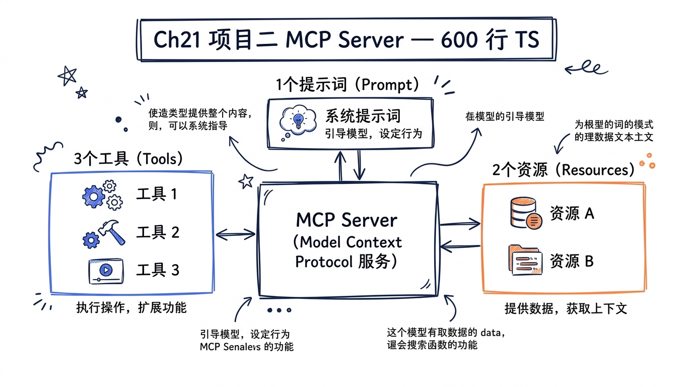
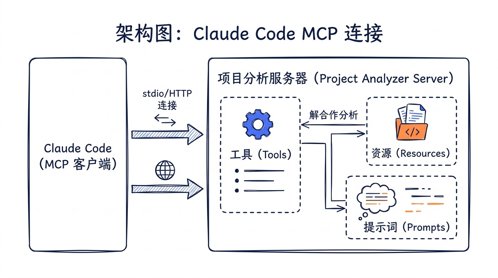
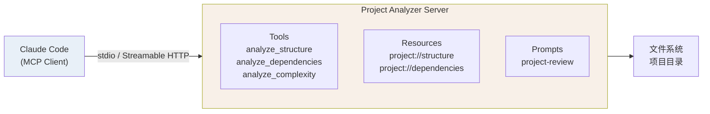
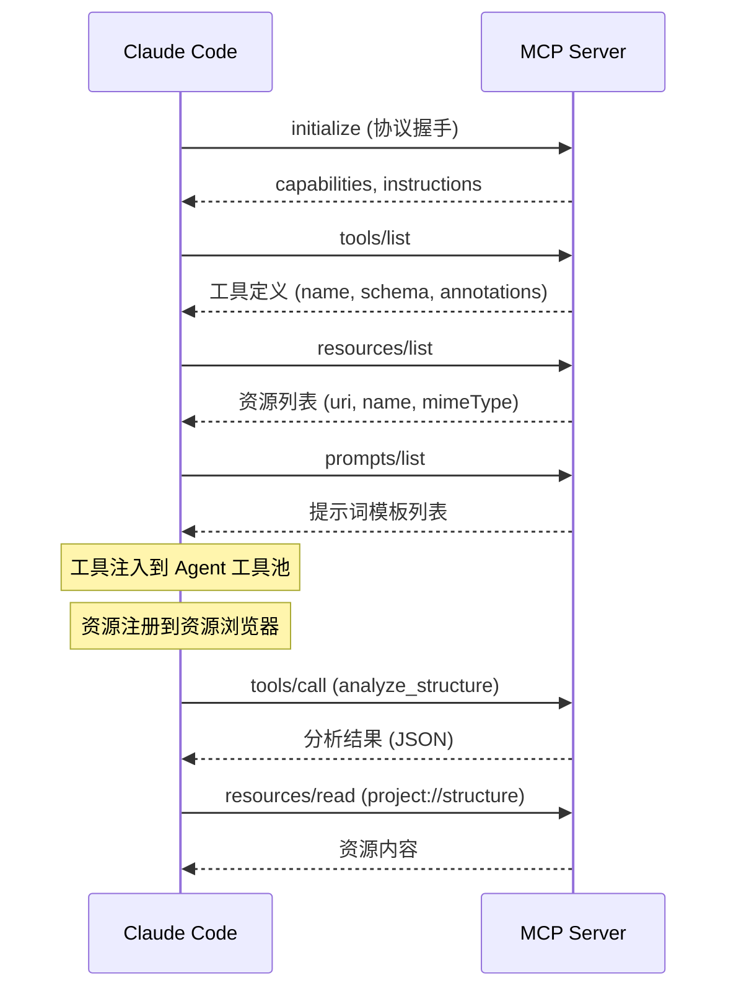
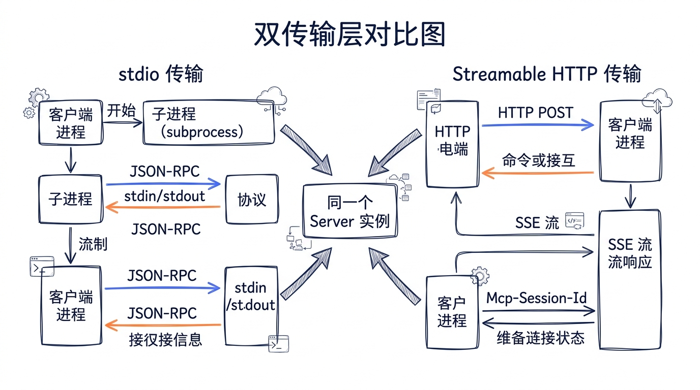
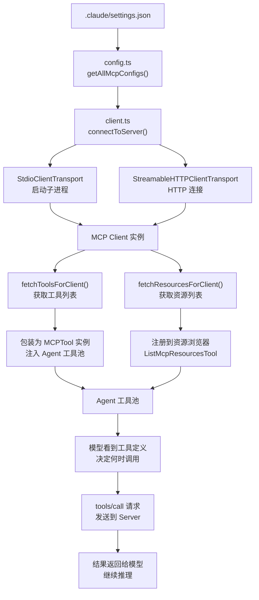

# 第二十一章：项目二——开发自定义 MCP Server



> 理解协议的最好方式，是自己实现一个完整的服务。本章我们将从零构建一个"项目分析器" MCP Server，它能分析项目结构、依赖关系和代码复杂度，最终接入 Claude Code 成为 Agent 的外部工具。

在第七章中，我们从 Claude Code 源码内部剖析了 MCP 客户端的运作机制——`client.ts` 如何通过 `StdioClientTransport` 和 `StreamableHTTPClientTransport` 连接外部服务器，`MCPTool.ts` 如何将远程工具动态注册到 Agent 的工具池。现在，我们要站在协议的另一端：作为 **Server 的开发者**，实现工具（Tools）、资源（Resources）和提示词模板（Prompts）三大能力，并通过 stdio 和 Streamable HTTP 两种传输层暴露服务。





---

## 21.1 MCP 协议在 Claude Code 中的真实位置

在开始写代码之前，先回顾源码里 MCP 服务器配置的数据流。Claude Code 在 `services/mcp/types.ts` 中定义了所有支持的传输类型：

```typescript
// 源码 services/mcp/types.ts 中的传输模式定义
export const TransportSchema = lazySchema(() =>
  z.enum(['stdio', 'sse', 'sse-ide', 'http', 'ws', 'sdk']),
)

// stdio 传输配置
export const McpStdioServerConfigSchema = lazySchema(() =>
  z.object({
    type: z.literal('stdio').optional(),
    command: z.string().min(1, 'Command cannot be empty'),
    args: z.array(z.string()).default([]),
    env: z.record(z.string(), z.string()).optional(),
  }),
)

// Streamable HTTP 传输配置
export const McpHTTPServerConfigSchema = lazySchema(() =>
  z.object({
    type: z.literal('http'),
    url: z.string(),
    headers: z.record(z.string(), z.string()).optional(),
    headersHelper: z.string().optional(),
    oauth: McpOAuthConfigSchema().optional(),
  }),
)
```

Claude Code 在 `services/mcp/client.ts` 中根据配置类型选择不同的传输层连接方式。对于我们即将开发的 Server，用户只需要在 `.claude/settings.json` 中加一行配置，就能把它接入 Claude Code。

当 Claude Code 连接到一个 MCP Server 后，会发生以下事情：

1. **工具注册**：`fetchToolsForClient()` 调用 `tools/list`，拿到工具定义，将每个工具包装成 `MCPTool` 实例注入 Agent 的工具池
2. **资源发现**：`fetchResourcesForClient()` 调用 `resources/list`，资源通过 `ListMcpResourcesTool` 和 `ReadMcpResourceTool` 暴露给模型
3. **指令注入**：Server 返回的 `instructions` 字段被追加到系统提示词中，指导模型如何使用该 Server 的工具



---

## 21.2 项目结构与依赖

我们的 Project Analyzer 项目完整目录结构如下：

```
project-analyzer-mcp/
├── package.json
├── tsconfig.json
├── src/
│   ├── index.ts          # 入口（stdio 传输）
│   ├── http.ts           # HTTP 传输入口
│   ├── server.ts         # Server 核心逻辑
│   ├── tools/
│   │   ├── analyzeStructure.ts
│   │   ├── analyzeDependencies.ts
│   │   └── analyzeComplexity.ts
│   ├── resources/
│   │   └── projectResources.ts
│   └── prompts/
│       └── projectReview.ts
└── .claude/
    └── settings.json     # Claude Code 集成配置
```

### package.json

```json
{
  "name": "project-analyzer-mcp",
  "version": "1.0.0",
  "description": "MCP Server for project structure, dependency, and complexity analysis",
  "type": "module",
  "scripts": {
    "build": "tsc",
    "start": "node dist/index.js",
    "start:http": "node dist/http.js",
    "dev": "tsx src/index.ts",
    "dev:http": "tsx src/http.ts"
  },
  "dependencies": {
    "@modelcontextprotocol/sdk": "^1.12.0"
  },
  "devDependencies": {
    "@types/node": "^22.0.0",
    "tsx": "^4.19.0",
    "typescript": "^5.7.0"
  }
}
```

> **为什么不用更多依赖？** MCP SDK 已经内置了 JSON-RPC 消息处理、传输层抽象和类型系统。我们要做的分析逻辑（遍历文件系统、解析 `package.json`、计算圈复杂度）全部用 Node.js 内置模块实现，保持零外部运行时依赖，这也是 Claude Code 自身 `entrypoints/mcp.ts` 的设计哲学——MCP Server 的启动速度直接影响 Claude Code 的初始化体验。

### tsconfig.json

```json
{
  "compilerOptions": {
    "target": "ES2022",
    "module": "Node16",
    "moduleResolution": "Node16",
    "outDir": "dist",
    "rootDir": "src",
    "strict": true,
    "esModuleInterop": true,
    "skipLibCheck": true,
    "declaration": true,
    "sourceMap": true,
    "resolveJsonModule": true
  },
  "include": ["src/**/*"],
  "exclude": ["node_modules", "dist"]
}
```

---

## 21.3 Server 核心：注册能力，处理请求


整个 Server 的核心在 `src/server.ts`。对比 Claude Code 源码中 `entrypoints/mcp.ts` 里暴露自身工具的方式：

```typescript
// Claude Code 源码 entrypoints/mcp.ts 的 Server 创建
const server = new Server(
  { name: 'claude/tengu', version: MACRO.VERSION },
  { capabilities: { tools: {} } },
)
```

我们的 Server 需要声明更完整的能力——不仅有 Tools，还有 Resources（带订阅通知）和 Prompts：

```typescript
// src/server.ts
import { Server } from '@modelcontextprotocol/sdk/server/index.js'
import {
  CallToolRequestSchema,
  GetPromptRequestSchema,
  ListPromptsRequestSchema,
  ListResourcesRequestSchema,
  ListToolsRequestSchema,
  ReadResourceRequestSchema,
  SubscribeRequestSchema,
  UnsubscribeRequestSchema,
  type CallToolResult,
  type GetPromptResult,
  type ListPromptsResult,
  type ListResourcesResult,
  type ListToolsResult,
  type ReadResourceResult,
  type Tool,
} from '@modelcontextprotocol/sdk/types.js'
import { watch, type FSWatcher } from 'fs'
import { resolve } from 'path'
import {
  analyzeComplexity,
  analyzeComplexitySchema,
} from './tools/analyzeComplexity.js'
import {
  analyzeDependencies,
  analyzeDependenciesSchema,
} from './tools/analyzeDependencies.js'
import {
  analyzeStructure,
  analyzeStructureSchema,
} from './tools/analyzeStructure.js'
import {
  getStructureResource,
  getDependenciesResource,
} from './resources/projectResources.js'
import { getProjectReviewPrompt } from './prompts/projectReview.js'

/**
 * 创建并配置 Project Analyzer MCP Server。
 *
 * 设计决策：Server 实例与传输层解耦。这个函数只负责注册
 * 请求处理器，不关心消息如何到达（stdio 还是 HTTP）。
 * 这与 Claude Code 源码中 entrypoints/mcp.ts 的模式一致：
 * Server 创建和 transport.connect 是分开的两步。
 */
export function createProjectAnalyzerServer(): {
  server: Server
  cleanup: () => void
} {
  const server = new Server(
    {
      name: 'project-analyzer',
      version: '1.0.0',
    },
    {
      capabilities: {
        tools: {},
        resources: {
          subscribe: true,    // 支持资源变更订阅
          listChanged: true,  // 支持资源列表变更通知
        },
        prompts: {},
      },
    },
  )

  // ━━━━━━━━━━━━━━━━━━━━━━━━━━━━━━━━━━━━━━
  // 工具定义
  // ━━━━━━━━━━━━━━━━━━━━━━━━━━━━━━━━━━━━━━

  const TOOLS: Tool[] = [
    {
      name: 'analyze_structure',
      description:
        'Analyze the file and directory structure of a project. ' +
        'Returns a tree view with file counts, sizes, and language distribution.',
      inputSchema: analyzeStructureSchema,
      annotations: {
        title: 'Analyze Project Structure',
        readOnlyHint: true,
        openWorldHint: false,
      },
    },
    {
      name: 'analyze_dependencies',
      description:
        'Analyze project dependencies from package.json, requirements.txt, ' +
        'go.mod, or Cargo.toml. Reports direct/dev dependencies, version ' +
        'constraints, and potential issues.',
      inputSchema: analyzeDependenciesSchema,
      annotations: {
        title: 'Analyze Dependencies',
        readOnlyHint: true,
        openWorldHint: false,
      },
    },
    {
      name: 'analyze_complexity',
      description:
        'Analyze code complexity metrics for source files. Calculates ' +
        'cyclomatic complexity, nesting depth, function length, and ' +
        'identifies hotspots that may need refactoring.',
      inputSchema: analyzeComplexitySchema,
      annotations: {
        title: 'Analyze Code Complexity',
        readOnlyHint: true,
        openWorldHint: false,
      },
    },
  ]

  // ━━━━━━━━━━━━━━━━━━━━━━━━━━━━━━━━━━━━━━
  // 请求处理器：工具
  // ━━━━━━━━━━━━━━━━━━━━━━━━━━━━━━━━━━━━━━

  server.setRequestHandler(
    ListToolsRequestSchema,
    async (): Promise<ListToolsResult> => {
      return { tools: TOOLS }
    },
  )

  server.setRequestHandler(
    CallToolRequestSchema,
    async (request): Promise<CallToolResult> => {
      const { name, arguments: args } = request.params

      try {
        switch (name) {
          case 'analyze_structure':
            return await analyzeStructure(args as { path: string; depth?: number; ignore?: string[] })

          case 'analyze_dependencies':
            return await analyzeDependencies(args as { path: string; includeTransitive?: boolean })

          case 'analyze_complexity':
            return await analyzeComplexity(args as { path: string; threshold?: number; extensions?: string[] })

          default:
            return {
              isError: true,
              content: [{ type: 'text', text: `Unknown tool: ${name}` }],
            }
        }
      } catch (error) {
        const message = error instanceof Error ? error.message : String(error)
        return {
          isError: true,
          content: [{ type: 'text', text: `Error: ${message}` }],
        }
      }
    },
  )

  // ━━━━━━━━━━━━━━━━━━━━━━━━━━━━━━━━━━━━━━
  // 请求处理器：资源
  // ━━━━━━━━━━━━━━━━━━━━━━━━━━━━━━━━━━━━━━

  // 追踪活跃订阅和对应的文件监视器
  const subscriptions = new Map<string, FSWatcher>()

  server.setRequestHandler(
    ListResourcesRequestSchema,
    async (): Promise<ListResourcesResult> => {
      return {
        resources: [
          {
            uri: 'project://structure',
            name: 'Project Structure',
            description:
              'Current project directory structure as a JSON tree',
            mimeType: 'application/json',
          },
          {
            uri: 'project://dependencies',
            name: 'Project Dependencies',
            description:
              'Parsed dependency information from package manifests',
            mimeType: 'application/json',
          },
        ],
      }
    },
  )

  server.setRequestHandler(
    ReadResourceRequestSchema,
    async (request): Promise<ReadResourceResult> => {
      const { uri } = request.params

      switch (uri) {
        case 'project://structure':
          return await getStructureResource()

        case 'project://dependencies':
          return await getDependenciesResource()

        default:
          throw new Error(`Unknown resource: ${uri}`)
      }
    },
  )

  // ━━━━━━━━━━━━━━━━━━━━━━━━━━━━━━━━━━━━━━
  // 请求处理器：资源订阅
  // ━━━━━━━━━━━━━━━━━━━━━━━━━━━━━━━━━━━━━━

  /**
   * 资源订阅机制——当项目文件发生变更时通知客户端。
   *
   * Claude Code 的 ReadMcpResourceTool.ts 在调用 resources/read 前
   * 会先通过 ensureConnectedClient() 确保连接健康。资源订阅
   * 让客户端不必轮询，而是在数据变化时收到 notifications/resources/updated。
   */
  server.setRequestHandler(
    SubscribeRequestSchema,
    async (request) => {
      const { uri } = request.params
      const watchPath = resolve(process.cwd())

      // 避免重复订阅
      if (subscriptions.has(uri)) {
        return {}
      }

      // 用 fs.watch 监视项目目录变更
      const watcher = watch(
        watchPath,
        { recursive: true },
        (_event, filename) => {
          // 过滤噪声：忽略 node_modules、.git、dist 等目录
          if (filename && shouldIgnoreChange(filename)) {
            return
          }

          // 发送资源变更通知
          server.notification({
            method: 'notifications/resources/updated',
            params: { uri },
          })
        },
      )

      subscriptions.set(uri, watcher)
      return {}
    },
  )

  server.setRequestHandler(
    UnsubscribeRequestSchema,
    async (request) => {
      const { uri } = request.params
      const watcher = subscriptions.get(uri)
      if (watcher) {
        watcher.close()
        subscriptions.delete(uri)
      }
      return {}
    },
  )

  // ━━━━━━━━━━━━━━━━━━━━━━━━━━━━━━━━━━━━━━
  // 请求处理器：提示词模板
  // ━━━━━━━━━━━━━━━━━━━━━━━━━━━━━━━━━━━━━━

  server.setRequestHandler(
    ListPromptsRequestSchema,
    async (): Promise<ListPromptsResult> => {
      return {
        prompts: [
          {
            name: 'project-review',
            description:
              'Generate a comprehensive project review covering ' +
              'structure, dependencies, and code quality',
            arguments: [
              {
                name: 'path',
                description: 'Path to the project root directory',
                required: true,
              },
              {
                name: 'focus',
                description:
                  'Review focus area: "security", "performance", ' +
                  '"maintainability", or "all"',
                required: false,
              },
            ],
          },
        ],
      }
    },
  )

  server.setRequestHandler(
    GetPromptRequestSchema,
    async (request): Promise<GetPromptResult> => {
      const { name, arguments: args } = request.params

      if (name !== 'project-review') {
        throw new Error(`Unknown prompt: ${name}`)
      }

      return await getProjectReviewPrompt(
        args?.path ?? process.cwd(),
        (args?.focus as 'security' | 'performance' | 'maintainability' | 'all') ?? 'all',
      )
    },
  )

  // ━━━━━━━━━━━━━━━━━━━━━━━━━━━━━━━━━━━━━━
  // 清理逻辑
  // ━━━━━━━━━━━━━━━━━━━━━━━━━━━━━━━━━━━━━━

  function cleanup(): void {
    for (const [uri, watcher] of subscriptions) {
      watcher.close()
      subscriptions.delete(uri)
    }
  }

  return { server, cleanup }
}

/**
 * 判断文件变更是否应该被忽略。
 * 与 Claude Code 的 gitignore 过滤逻辑类似，
 * 这里用简单的路径前缀匹配来过滤噪声。
 */
function shouldIgnoreChange(filename: string): boolean {
  const ignorePatterns = [
    'node_modules',
    '.git',
    'dist',
    'build',
    '.next',
    '__pycache__',
    '.pyc',
    '.DS_Store',
    'coverage',
  ]
  return ignorePatterns.some(
    pattern => filename.includes(pattern)
  )
}
```

> **源码对照**：注意我们的 `CallToolRequestSchema` 处理器与 Claude Code 源码中 `entrypoints/mcp.ts` 的处理器的关键差异——后者还做了 `tool.isEnabled()` 检查和 `tool.validateInput()` 验证。作为外部 MCP Server，我们在调用分发前自己做参数校验，而 Claude Code 侧的 MCP 客户端会对返回结果做二次处理（大小截断、二进制持久化等，见 `mcpValidation.ts`）。

---

## 21.4 工具实现一：分析项目结构

`analyze_structure` 工具递归遍历项目目录，构建树形结构，统计文件类型分布和大小信息。

```typescript
// src/tools/analyzeStructure.ts
import { readdir, stat } from 'fs/promises'
import { extname, join, relative } from 'path'
import type { CallToolResult } from '@modelcontextprotocol/sdk/types.js'

/**
 * JSON Schema 定义——这会被发送到 Claude Code 客户端，
 * 模型根据 schema 生成合法的调用参数。
 *
 * 对比 Claude Code 源码中 MCPTool.ts 的做法：
 *   export const inputSchema = lazySchema(() => z.object({}).passthrough())
 * MCP 工具的 schema 由 Server 定义，而非客户端。客户端只做
 * 透传（passthrough），这就是为什么 schema 的质量全靠 Server 作者。
 */
export const analyzeStructureSchema = {
  type: 'object' as const,
  properties: {
    path: {
      type: 'string',
      description: 'Absolute or relative path to the project root directory',
    },
    depth: {
      type: 'number',
      description: 'Maximum depth to traverse (default: 5)',
      default: 5,
    },
    ignore: {
      type: 'array',
      items: { type: 'string' },
      description: 'Additional directory names to ignore (node_modules, .git are always ignored)',
      default: [],
    },
  },
  required: ['path'],
}

// 默认忽略的目录
const DEFAULT_IGNORE = new Set([
  'node_modules', '.git', 'dist', 'build', '.next',
  '__pycache__', '.venv', 'venv', '.tox', 'target',
  'coverage', '.nyc_output', '.cache', '.parcel-cache',
])

// 语言到扩展名的映射
const LANGUAGE_MAP: Record<string, string> = {
  '.ts': 'TypeScript', '.tsx': 'TypeScript (JSX)',
  '.js': 'JavaScript', '.jsx': 'JavaScript (JSX)',
  '.py': 'Python', '.rb': 'Ruby', '.go': 'Go',
  '.rs': 'Rust', '.java': 'Java', '.kt': 'Kotlin',
  '.swift': 'Swift', '.c': 'C', '.cpp': 'C++',
  '.h': 'C/C++ Header', '.cs': 'C#',
  '.php': 'PHP', '.vue': 'Vue', '.svelte': 'Svelte',
  '.md': 'Markdown', '.json': 'JSON', '.yaml': 'YAML',
  '.yml': 'YAML', '.toml': 'TOML', '.xml': 'XML',
  '.html': 'HTML', '.css': 'CSS', '.scss': 'SCSS',
  '.sql': 'SQL', '.sh': 'Shell', '.bash': 'Shell',
  '.dockerfile': 'Docker', '.proto': 'Protocol Buffers',
}

/** 目录树节点 */
interface TreeNode {
  name: string
  type: 'file' | 'directory'
  size?: number
  language?: string
  children?: TreeNode[]
}

/** 分析结果统计 */
interface StructureStats {
  totalFiles: number
  totalDirectories: number
  totalSize: number
  languageDistribution: Record<string, { count: number; totalSize: number }>
  largestFiles: Array<{ path: string; size: number }>
}

/**
 * 递归构建目录树。
 *
 * 设计注意：这里对每个文件调用 fs.stat() 获取大小。
 * 在大型项目中这可能很慢。Claude Code 源码中的
 * FileReadTool 使用了 LRU 缓存（createFileStateCacheWithSizeLimit）
 * 来避免重复读取。对于 MCP Server 而言，每次工具调用
 * 是独立的请求，缓存的收益有限——但如果你的 Server 会
 * 频繁被调用，可以考虑加入进程级缓存。
 */
async function buildTree(
  dirPath: string,
  basePath: string,
  depth: number,
  maxDepth: number,
  ignoreSet: Set<string>,
  stats: StructureStats,
): Promise<TreeNode[]> {
  if (depth > maxDepth) return []

  let entries
  try {
    entries = await readdir(dirPath, { withFileTypes: true })
  } catch {
    return [] // 权限不足或路径不存在
  }

  // 按名称排序：目录在前，文件在后
  entries.sort((a, b) => {
    if (a.isDirectory() !== b.isDirectory()) {
      return a.isDirectory() ? -1 : 1
    }
    return a.name.localeCompare(b.name)
  })

  const nodes: TreeNode[] = []

  for (const entry of entries) {
    if (ignoreSet.has(entry.name)) continue
    if (entry.name.startsWith('.') && entry.name !== '.env.example') continue

    const fullPath = join(dirPath, entry.name)
    const relPath = relative(basePath, fullPath)

    if (entry.isDirectory()) {
      stats.totalDirectories++
      const children = await buildTree(
        fullPath, basePath, depth + 1, maxDepth, ignoreSet, stats,
      )
      nodes.push({
        name: entry.name,
        type: 'directory',
        children,
      })
    } else if (entry.isFile()) {
      stats.totalFiles++
      let fileSize = 0
      try {
        const fileStat = await stat(fullPath)
        fileSize = fileStat.size
      } catch {
        // 文件可能在遍历过程中被删除
      }

      stats.totalSize += fileSize

      const ext = extname(entry.name).toLowerCase()
      const language = LANGUAGE_MAP[ext]
      if (language) {
        if (!stats.languageDistribution[language]) {
          stats.languageDistribution[language] = { count: 0, totalSize: 0 }
        }
        stats.languageDistribution[language].count++
        stats.languageDistribution[language].totalSize += fileSize
      }

      // 追踪最大文件（保留前 10 个）
      stats.largestFiles.push({ path: relPath, size: fileSize })
      stats.largestFiles.sort((a, b) => b.size - a.size)
      if (stats.largestFiles.length > 10) {
        stats.largestFiles.length = 10
      }

      nodes.push({
        name: entry.name,
        type: 'file',
        size: fileSize,
        language,
      })
    }
  }

  return nodes
}

/** 格式化文件大小为人类可读格式 */
function formatSize(bytes: number): string {
  const units = ['B', 'KB', 'MB', 'GB']
  let size = bytes
  let unitIndex = 0
  while (size >= 1024 && unitIndex < units.length - 1) {
    size /= 1024
    unitIndex++
  }
  return `${size.toFixed(unitIndex === 0 ? 0 : 1)} ${units[unitIndex]}`
}

/**
 * analyze_structure 工具的主函数。
 *
 * 返回值遵循 MCP 的 CallToolResult 格式——content 数组
 * 包含一个或多个 text/image 块。Claude Code 的 mcpValidation.ts
 * 会对超过 MAX_MCP_CONTENT_SIZE 的结果进行截断，所以我们
 * 在 Server 端就控制输出大小。
 */
export async function analyzeStructure(
  args: { path: string; depth?: number; ignore?: string[] },
): Promise<CallToolResult> {
  const projectPath = args.path.startsWith('/')
    ? args.path
    : join(process.cwd(), args.path)
  const maxDepth = args.depth ?? 5
  const ignoreSet = new Set([
    ...DEFAULT_IGNORE,
    ...(args.ignore ?? []),
  ])

  const stats: StructureStats = {
    totalFiles: 0,
    totalDirectories: 0,
    totalSize: 0,
    languageDistribution: {},
    largestFiles: [],
  }

  const tree = await buildTree(
    projectPath, projectPath, 0, maxDepth, ignoreSet, stats,
  )

  // 按文件数量降序排列语言分布
  const sortedLanguages = Object.entries(stats.languageDistribution)
    .sort(([, a], [, b]) => b.count - a.count)

  // 构建人类可读的摘要
  const summary = [
    `## Project Structure Analysis`,
    ``,
    `**Path**: ${projectPath}`,
    `**Total Files**: ${stats.totalFiles}`,
    `**Total Directories**: ${stats.totalDirectories}`,
    `**Total Size**: ${formatSize(stats.totalSize)}`,
    ``,
    `### Language Distribution`,
    ...sortedLanguages.map(
      ([lang, info]) =>
        `- ${lang}: ${info.count} files (${formatSize(info.totalSize)})`,
    ),
    ``,
    `### Largest Files`,
    ...stats.largestFiles.map(
      f => `- ${f.path}: ${formatSize(f.size)}`,
    ),
  ].join('\n')

  return {
    content: [
      { type: 'text', text: summary },
      {
        type: 'text',
        text: '```json\n' + JSON.stringify(
          { tree, stats: { ...stats, totalSizeFormatted: formatSize(stats.totalSize) } },
          null, 2,
        ) + '\n```',
      },
    ],
  }
}
```

> **annotations 的作用**：注意工具定义中的 `readOnlyHint: true`。Claude Code 的权限系统会检查这个标注——在 `channelPermissions.ts` 和权限检查流水线中，标记为只读的工具可以获得更宽松的自动批准策略。如果你的工具确实只读取不修改，务必设置这个标注。

---

## 21.5 工具实现二：分析依赖关系

```typescript
// src/tools/analyzeDependencies.ts
import { readFile } from 'fs/promises'
import { join } from 'path'
import type { CallToolResult } from '@modelcontextprotocol/sdk/types.js'

export const analyzeDependenciesSchema = {
  type: 'object' as const,
  properties: {
    path: {
      type: 'string',
      description: 'Path to the project root directory',
    },
    includeTransitive: {
      type: 'boolean',
      description: 'Whether to analyze node_modules for transitive dependencies (slower)',
      default: false,
    },
  },
  required: ['path'],
}

/** 单个依赖的分析结果 */
interface DependencyInfo {
  name: string
  version: string
  type: 'production' | 'development' | 'peer' | 'optional'
  versionConstraint: 'exact' | 'patch' | 'minor' | 'major' | 'range' | 'latest' | 'other'
  issues: string[]
}

/** 依赖分析总结 */
interface DependencyAnalysis {
  packageManager: string
  manifestFile: string
  projectName: string
  projectVersion: string
  dependencies: DependencyInfo[]
  summary: {
    total: number
    production: number
    development: number
    peer: number
    optional: number
    withIssues: number
  }
  issues: string[]
}

/**
 * 解析版本约束类型。
 * npm 的语义化版本有多种写法，每种隐含不同的升级策略。
 */
function classifyVersionConstraint(
  version: string,
): DependencyInfo['versionConstraint'] {
  if (version === '*' || version === 'latest') return 'latest'
  if (version.startsWith('~')) return 'patch'
  if (version.startsWith('^')) return 'minor'
  if (version.includes('||') || version.includes(' - ')) return 'range'
  if (/^\d+\.\d+\.\d+$/.test(version)) return 'exact'
  if (version.startsWith('>=') || version.startsWith('>')) return 'major'
  return 'other'
}

/**
 * 检测依赖可能存在的问题。
 */
function detectIssues(name: string, version: string): string[] {
  const issues: string[] = []

  if (version === '*' || version === 'latest') {
    issues.push(
      `Unpinned version "${version}" — builds are not reproducible`,
    )
  }

  if (version.startsWith('>=')) {
    issues.push(
      `Open-ended range "${version}" — may pull incompatible major versions`,
    )
  }

  if (version.includes('git') || version.includes('github')) {
    issues.push(
      `Git dependency — not available from registry, may break in CI`,
    )
  }

  if (version.startsWith('file:')) {
    issues.push(
      `Local file dependency — will not resolve in other environments`,
    )
  }

  // 检测已知的安全风险包名模式（仅作示例）
  const suspiciousPatterns = [
    /^@[^/]+\/[^/]+-[a-z]{1}$/,  // 极短的 scoped 包名可能是 typosquatting
  ]
  for (const pattern of suspiciousPatterns) {
    if (pattern.test(name)) {
      issues.push(
        `Package name matches a pattern associated with typosquatting`,
      )
    }
  }

  return issues
}

/**
 * 解析 package.json 的依赖字段。
 */
function parseDependencySection(
  deps: Record<string, string> | undefined,
  type: DependencyInfo['type'],
): DependencyInfo[] {
  if (!deps) return []

  return Object.entries(deps).map(([name, version]) => ({
    name,
    version,
    type,
    versionConstraint: classifyVersionConstraint(version),
    issues: detectIssues(name, version),
  }))
}

/**
 * 尝试检测项目使用的包管理器。
 */
async function detectPackageManager(projectPath: string): Promise<string> {
  const lockFiles: Record<string, string> = {
    'bun.lockb': 'bun',
    'bun.lock': 'bun',
    'pnpm-lock.yaml': 'pnpm',
    'yarn.lock': 'yarn',
    'package-lock.json': 'npm',
  }

  for (const [file, manager] of Object.entries(lockFiles)) {
    try {
      await readFile(join(projectPath, file))
      return manager
    } catch {
      // 文件不存在，继续检查下一个
    }
  }

  return 'unknown'
}

/**
 * 分析 requirements.txt（Python 项目）。
 */
function parseRequirementsTxt(content: string): DependencyInfo[] {
  return content
    .split('\n')
    .map(line => line.trim())
    .filter(line => line && !line.startsWith('#') && !line.startsWith('-'))
    .map(line => {
      // 处理 package==1.0.0, package>=1.0.0, package~=1.0.0 等格式
      const match = line.match(/^([a-zA-Z0-9_-]+)\s*([<>=~!]+)?\s*(.*)$/)
      if (!match) return null
      const [, name, op, ver] = match
      const version = op ? `${op}${ver}` : '*'
      return {
        name: name!,
        version,
        type: 'production' as const,
        versionConstraint: classifyVersionConstraint(version),
        issues: detectIssues(name!, version),
      }
    })
    .filter((d): d is DependencyInfo => d !== null)
}

export async function analyzeDependencies(
  args: { path: string; includeTransitive?: boolean },
): Promise<CallToolResult> {
  const projectPath = args.path.startsWith('/')
    ? args.path
    : join(process.cwd(), args.path)

  // 按优先级尝试解析不同类型的包清单文件
  const manifests = [
    { file: 'package.json', type: 'node' },
    { file: 'requirements.txt', type: 'python' },
    { file: 'pyproject.toml', type: 'python' },
    { file: 'go.mod', type: 'go' },
    { file: 'Cargo.toml', type: 'rust' },
  ]

  for (const manifest of manifests) {
    try {
      const content = await readFile(
        join(projectPath, manifest.file), 'utf-8',
      )

      if (manifest.type === 'node') {
        return await analyzeNodeDependencies(
          projectPath, content,
        )
      }

      if (manifest.type === 'python' && manifest.file === 'requirements.txt') {
        return analyzePythonDependencies(content)
      }

      // 对于其他格式，返回原始内容和基本解析
      return {
        content: [{
          type: 'text',
          text: `Found ${manifest.file} (${manifest.type} project).\n` +
            `Full parsing for ${manifest.type} is not yet implemented.\n\n` +
            `Raw content:\n\`\`\`\n${content.slice(0, 4000)}\n\`\`\``,
        }],
      }
    } catch {
      // 文件不存在，尝试下一个
    }
  }

  return {
    isError: true,
    content: [{
      type: 'text',
      text: `No recognized package manifest found in ${projectPath}. ` +
        `Supported: package.json, requirements.txt, pyproject.toml, go.mod, Cargo.toml`,
    }],
  }
}

async function analyzeNodeDependencies(
  projectPath: string,
  content: string,
): Promise<CallToolResult> {
  const pkg = JSON.parse(content) as Record<string, unknown>
  const packageManager = await detectPackageManager(projectPath)

  const allDeps = [
    ...parseDependencySection(
      pkg.dependencies as Record<string, string> | undefined,
      'production',
    ),
    ...parseDependencySection(
      pkg.devDependencies as Record<string, string> | undefined,
      'development',
    ),
    ...parseDependencySection(
      pkg.peerDependencies as Record<string, string> | undefined,
      'peer',
    ),
    ...parseDependencySection(
      pkg.optionalDependencies as Record<string, string> | undefined,
      'optional',
    ),
  ]

  const analysis: DependencyAnalysis = {
    packageManager,
    manifestFile: 'package.json',
    projectName: (pkg.name as string) ?? 'unnamed',
    projectVersion: (pkg.version as string) ?? '0.0.0',
    dependencies: allDeps,
    summary: {
      total: allDeps.length,
      production: allDeps.filter(d => d.type === 'production').length,
      development: allDeps.filter(d => d.type === 'development').length,
      peer: allDeps.filter(d => d.type === 'peer').length,
      optional: allDeps.filter(d => d.type === 'optional').length,
      withIssues: allDeps.filter(d => d.issues.length > 0).length,
    },
    issues: [],
  }

  // 项目级别的问题检测
  if (!pkg.engines) {
    analysis.issues.push(
      'No "engines" field — Node.js version requirement is not specified',
    )
  }
  if (packageManager === 'unknown') {
    analysis.issues.push(
      'No lock file found — dependency versions are not reproducible',
    )
  }

  // 构建输出
  const depsWithIssues = allDeps.filter(d => d.issues.length > 0)
  const sections = [
    `## Dependency Analysis: ${analysis.projectName}@${analysis.projectVersion}`,
    ``,
    `**Package Manager**: ${packageManager}`,
    `**Total Dependencies**: ${analysis.summary.total}`,
    `- Production: ${analysis.summary.production}`,
    `- Development: ${analysis.summary.development}`,
    `- Peer: ${analysis.summary.peer}`,
    `- Optional: ${analysis.summary.optional}`,
  ]

  if (depsWithIssues.length > 0) {
    sections.push(``, `### Issues Found (${depsWithIssues.length})`)
    for (const dep of depsWithIssues) {
      for (const issue of dep.issues) {
        sections.push(`- **${dep.name}@${dep.version}**: ${issue}`)
      }
    }
  }

  if (analysis.issues.length > 0) {
    sections.push(``, `### Project-Level Issues`)
    for (const issue of analysis.issues) {
      sections.push(`- ${issue}`)
    }
  }

  return {
    content: [
      { type: 'text', text: sections.join('\n') },
      {
        type: 'text',
        text: '```json\n' + JSON.stringify(analysis, null, 2) + '\n```',
      },
    ],
  }
}

function analyzePythonDependencies(content: string): CallToolResult {
  const deps = parseRequirementsTxt(content)
  const withIssues = deps.filter(d => d.issues.length > 0)

  const sections = [
    `## Python Dependencies (requirements.txt)`,
    ``,
    `**Total**: ${deps.length}`,
    ...deps.map(d => `- ${d.name} ${d.version}`),
  ]

  if (withIssues.length > 0) {
    sections.push(``, `### Issues (${withIssues.length})`)
    for (const dep of withIssues) {
      for (const issue of dep.issues) {
        sections.push(`- **${dep.name}**: ${issue}`)
      }
    }
  }

  return {
    content: [{ type: 'text', text: sections.join('\n') }],
  }
}
```

---

## 21.6 工具实现三：分析代码复杂度

这是最有技术含量的工具——它通过简化的圈复杂度（Cyclomatic Complexity）计算，识别代码中的复杂度热点。

```typescript
// src/tools/analyzeComplexity.ts
import { readFile, readdir, stat } from 'fs/promises'
import { extname, join, relative } from 'path'
import type { CallToolResult } from '@modelcontextprotocol/sdk/types.js'

export const analyzeComplexitySchema = {
  type: 'object' as const,
  properties: {
    path: {
      type: 'string',
      description: 'Path to the project root or a specific file',
    },
    threshold: {
      type: 'number',
      description:
        'Complexity threshold — only report functions above this value (default: 10)',
      default: 10,
    },
    extensions: {
      type: 'array',
      items: { type: 'string' },
      description:
        'File extensions to analyze (default: .ts, .js, .tsx, .jsx, .py)',
      default: ['.ts', '.js', '.tsx', '.jsx', '.py'],
    },
  },
  required: ['path'],
}

/** 单个函数的复杂度指标 */
interface FunctionMetrics {
  name: string
  file: string
  line: number
  cyclomaticComplexity: number
  maxNestingDepth: number
  lineCount: number
  parameterCount: number
}

/** 文件级别的复杂度汇总 */
interface FileMetrics {
  file: string
  totalFunctions: number
  averageComplexity: number
  maxComplexity: number
  totalLines: number
  codeLines: number
  functions: FunctionMetrics[]
}

/**
 * 计算代码的圈复杂度。
 *
 * 圈复杂度 = 决策点数量 + 1
 * 决策点包括：if, else if, for, while, case, &&, ||, ?:, catch, ??
 *
 * 这是一个简化的实现——生产级工具（如 ESLint 的 complexity 规则）
 * 会构建 AST 来精确计算。我们用正则匹配来实现，足够演示
 * MCP 工具的构建模式，也能给出合理的近似值。
 */
function calculateCyclomaticComplexity(code: string): number {
  // 移除字符串和注释以避免误匹配
  const cleaned = code
    .replace(/\/\/.*$/gm, '')       // 单行注释
    .replace(/\/\*[\s\S]*?\*\//g, '')  // 多行注释
    .replace(/'(?:[^'\\]|\\.)*'/g, "''")  // 单引号字符串
    .replace(/"(?:[^"\\]|\\.)*"/g, '""')  // 双引号字符串
    .replace(/`(?:[^`\\]|\\.)*`/g, '``')  // 模板字符串

  // 匹配决策点关键词
  const patterns = [
    /\bif\s*\(/g,
    /\belse\s+if\s*\(/g,
    /\bfor\s*\(/g,
    /\bwhile\s*\(/g,
    /\bcase\s+/g,
    /\bcatch\s*\(/g,
    /&&/g,
    /\|\|/g,
    /\?\?/g,
    /\?[^?:]/g,  // 三元运算符（排除 ?? 和 ?:）
  ]

  let complexity = 1 // 基础复杂度
  for (const pattern of patterns) {
    const matches = cleaned.match(pattern)
    if (matches) {
      complexity += matches.length
    }
  }

  return complexity
}

/**
 * 计算代码的最大嵌套深度。
 */
function calculateMaxNesting(code: string): number {
  let maxDepth = 0
  let currentDepth = 0

  for (const char of code) {
    if (char === '{') {
      currentDepth++
      maxDepth = Math.max(maxDepth, currentDepth)
    } else if (char === '}') {
      currentDepth = Math.max(0, currentDepth - 1)
    }
  }

  return maxDepth
}

/**
 * 从源代码中提取函数定义。
 * 支持 TypeScript/JavaScript 和 Python 的常见函数声明模式。
 */
function extractFunctions(
  code: string,
  filePath: string,
  ext: string,
): FunctionMetrics[] {
  const lines = code.split('\n')
  const functions: FunctionMetrics[] = []

  if (ext === '.py') {
    // Python: def function_name(params):
    const pyFuncPattern = /^(\s*)def\s+(\w+)\s*\(([^)]*)\)/
    let i = 0
    while (i < lines.length) {
      const match = lines[i]!.match(pyFuncPattern)
      if (match) {
        const indent = match[1]!.length
        const name = match[2]!
        const params = match[3]!
        const startLine = i

        // 找到函数体的结束（通过缩进判断）
        let endLine = i + 1
        while (endLine < lines.length) {
          const line = lines[endLine]!
          if (line.trim() === '') {
            endLine++
            continue
          }
          const lineIndent = line.match(/^(\s*)/)?.[1]?.length ?? 0
          if (lineIndent <= indent && line.trim() !== '') break
          endLine++
        }

        const funcCode = lines.slice(startLine, endLine).join('\n')
        const paramCount = params.split(',').filter(p => p.trim() && p.trim() !== 'self').length

        functions.push({
          name,
          file: filePath,
          line: startLine + 1,
          cyclomaticComplexity: calculateCyclomaticComplexity(funcCode),
          maxNestingDepth: calculateMaxNesting(funcCode),
          lineCount: endLine - startLine,
          parameterCount: paramCount,
        })
      }
      i++
    }
  } else {
    // TypeScript/JavaScript
    const jsFuncPatterns = [
      /(?:export\s+)?(?:async\s+)?function\s+(\w+)\s*\(([^)]*)\)/,
      /(?:export\s+)?const\s+(\w+)\s*=\s*(?:async\s+)?\(([^)]*)\)\s*(?::\s*\w+(?:<[^>]*>)?\s*)?=>/,
      /(?:export\s+)?const\s+(\w+)\s*=\s*(?:async\s+)?function/,
      /(\w+)\s*\(([^)]*)\)\s*{/,  // 方法定义
    ]

    let i = 0
    while (i < lines.length) {
      let matched = false
      for (const pattern of jsFuncPatterns) {
        const match = lines[i]!.match(pattern)
        if (match) {
          const name = match[1]!
          const params = match[2] ?? ''
          const startLine = i

          // 用花括号计数找到函数结束位置
          let braceCount = 0
          let started = false
          let endLine = i

          for (let j = i; j < lines.length; j++) {
            for (const char of lines[j]!) {
              if (char === '{') {
                braceCount++
                started = true
              } else if (char === '}') {
                braceCount--
              }
            }
            endLine = j + 1
            if (started && braceCount === 0) break
          }

          const funcCode = lines.slice(startLine, endLine).join('\n')
          const paramCount = params
            ? params.split(',').filter(p => p.trim()).length
            : 0

          // 去重：同名函数只取第一个（简化处理）
          if (!functions.some(f => f.name === name && f.line === startLine + 1)) {
            functions.push({
              name,
              file: filePath,
              line: startLine + 1,
              cyclomaticComplexity: calculateCyclomaticComplexity(funcCode),
              maxNestingDepth: calculateMaxNesting(funcCode),
              lineCount: endLine - startLine,
              parameterCount: paramCount,
            })
          }

          matched = true
          break
        }
      }
      if (!matched) i++
      else i++
    }
  }

  return functions
}

/**
 * 递归收集要分析的源文件。
 */
async function collectSourceFiles(
  dirPath: string,
  extensions: Set<string>,
): Promise<string[]> {
  const result: string[] = []
  const ignoreSet = new Set([
    'node_modules', '.git', 'dist', 'build', '.next',
    '__pycache__', 'venv', '.venv', 'coverage', 'target',
  ])

  async function walk(dir: string): Promise<void> {
    let entries
    try {
      entries = await readdir(dir, { withFileTypes: true })
    } catch {
      return
    }

    for (const entry of entries) {
      if (ignoreSet.has(entry.name)) continue
      if (entry.name.startsWith('.')) continue

      const fullPath = join(dir, entry.name)

      if (entry.isDirectory()) {
        await walk(fullPath)
      } else if (entry.isFile()) {
        const ext = extname(entry.name).toLowerCase()
        if (extensions.has(ext)) {
          result.push(fullPath)
        }
      }
    }
  }

  await walk(dirPath)
  return result
}

export async function analyzeComplexity(
  args: { path: string; threshold?: number; extensions?: string[] },
): Promise<CallToolResult> {
  const targetPath = args.path.startsWith('/')
    ? args.path
    : join(process.cwd(), args.path)
  const threshold = args.threshold ?? 10
  const extensions = new Set(args.extensions ?? ['.ts', '.js', '.tsx', '.jsx', '.py'])

  // 判断目标是文件还是目录
  let files: string[]
  try {
    const targetStat = await stat(targetPath)
    if (targetStat.isFile()) {
      files = [targetPath]
    } else {
      files = await collectSourceFiles(targetPath, extensions)
    }
  } catch (error) {
    return {
      isError: true,
      content: [{ type: 'text', text: `Cannot access path: ${targetPath}` }],
    }
  }

  const allFileMetrics: FileMetrics[] = []
  const hotspots: FunctionMetrics[] = []

  for (const file of files) {
    let content: string
    try {
      content = await readFile(file, 'utf-8')
    } catch {
      continue
    }

    const ext = extname(file).toLowerCase()
    const relPath = relative(targetPath, file) || file
    const functions = extractFunctions(content, relPath, ext)

    const lines = content.split('\n')
    const codeLines = lines.filter(
      l => l.trim() && !l.trim().startsWith('//') && !l.trim().startsWith('#'),
    ).length

    const complexities = functions.map(f => f.cyclomaticComplexity)
    const avgComplexity = complexities.length > 0
      ? complexities.reduce((a, b) => a + b, 0) / complexities.length
      : 0

    allFileMetrics.push({
      file: relPath,
      totalFunctions: functions.length,
      averageComplexity: Math.round(avgComplexity * 10) / 10,
      maxComplexity: Math.max(0, ...complexities),
      totalLines: lines.length,
      codeLines,
      functions,
    })

    // 收集超过阈值的热点函数
    for (const fn of functions) {
      if (fn.cyclomaticComplexity >= threshold) {
        hotspots.push(fn)
      }
    }
  }

  // 按复杂度降序排列热点
  hotspots.sort((a, b) => b.cyclomaticComplexity - a.cyclomaticComplexity)

  // 构建输出报告
  const sections = [
    `## Code Complexity Analysis`,
    ``,
    `**Path**: ${targetPath}`,
    `**Files Analyzed**: ${files.length}`,
    `**Complexity Threshold**: ${threshold}`,
    `**Hotspots Found**: ${hotspots.length}`,
  ]

  if (hotspots.length > 0) {
    sections.push(
      ``,
      `### Complexity Hotspots`,
      ``,
      `| Function | File | Line | Complexity | Nesting | Lines | Params |`,
      `|----------|------|------|-----------|---------|-------|--------|`,
    )
    for (const fn of hotspots.slice(0, 20)) {
      sections.push(
        `| ${fn.name} | ${fn.file} | ${fn.line} | **${fn.cyclomaticComplexity}** | ${fn.maxNestingDepth} | ${fn.lineCount} | ${fn.parameterCount} |`,
      )
    }
    if (hotspots.length > 20) {
      sections.push(`| ... | ... | ... | ... | ... | ... | ... |`)
      sections.push(`*Showing top 20 of ${hotspots.length} hotspots*`)
    }
  } else {
    sections.push(
      ``,
      `All functions are below the complexity threshold of ${threshold}.`,
    )
  }

  // 文件级别的复杂度排名
  const filesByComplexity = [...allFileMetrics]
    .filter(f => f.totalFunctions > 0)
    .sort((a, b) => b.maxComplexity - a.maxComplexity)
    .slice(0, 10)

  if (filesByComplexity.length > 0) {
    sections.push(
      ``,
      `### Most Complex Files (Top 10)`,
      ``,
      `| File | Functions | Avg Complexity | Max Complexity | Code Lines |`,
      `|------|----------|---------------|---------------|------------|`,
    )
    for (const f of filesByComplexity) {
      sections.push(
        `| ${f.file} | ${f.totalFunctions} | ${f.averageComplexity} | ${f.maxComplexity} | ${f.codeLines} |`,
      )
    }
  }

  // 复杂度分布直方图
  const allComplexities = allFileMetrics.flatMap(
    f => f.functions.map(fn => fn.cyclomaticComplexity),
  )
  if (allComplexities.length > 0) {
    const buckets = [
      { label: '1-5 (Simple)', min: 1, max: 5, count: 0 },
      { label: '6-10 (Moderate)', min: 6, max: 10, count: 0 },
      { label: '11-20 (Complex)', min: 11, max: 20, count: 0 },
      { label: '21-50 (Very Complex)', min: 21, max: 50, count: 0 },
      { label: '50+ (Untestable)', min: 51, max: Infinity, count: 0 },
    ]
    for (const c of allComplexities) {
      for (const bucket of buckets) {
        if (c >= bucket.min && c <= bucket.max) {
          bucket.count++
          break
        }
      }
    }
    sections.push(
      ``,
      `### Complexity Distribution`,
      ...buckets
        .filter(b => b.count > 0)
        .map(b => {
          const bar = '█'.repeat(Math.min(40, Math.ceil(b.count / allComplexities.length * 40)))
          return `- ${b.label}: ${b.count} functions ${bar}`
        }),
    )
  }

  return {
    content: [
      { type: 'text', text: sections.join('\n') },
      {
        type: 'text',
        text: '```json\n' + JSON.stringify(
          {
            summary: {
              filesAnalyzed: files.length,
              totalFunctions: allComplexities.length,
              hotspotsAboveThreshold: hotspots.length,
              averageComplexity: allComplexities.length > 0
                ? Math.round(
                    allComplexities.reduce((a, b) => a + b, 0) / allComplexities.length * 10
                  ) / 10
                : 0,
            },
            hotspots: hotspots.slice(0, 20),
          },
          null, 2,
        ) + '\n```',
      },
    ],
  }
}
```

---

## 21.7 资源实现：带订阅的动态数据


Resources 与 Tools 的本质区别：**Tools 是动作（verb），Resources 是数据（noun）**。模型通过 `ReadMcpResourceTool` 读取资源，通过 `ListMcpResourcesTool` 发现可用资源。资源还支持订阅——当底层数据变化时，Server 通知客户端数据已过期。

```typescript
// src/resources/projectResources.ts
import { readFile, readdir, stat } from 'fs/promises'
import { extname, join } from 'path'
import type { ReadResourceResult } from '@modelcontextprotocol/sdk/types.js'

/**
 * project://structure 资源
 *
 * 当 Claude Code 调用 ReadMcpResourceTool 请求此资源时，
 * 我们返回项目目录结构的 JSON 快照。
 *
 * 对比 Claude Code 源码中 ReadMcpResourceTool.ts：
 *   const result = await connectedClient.client.request(
 *     { method: 'resources/read', params: { uri } },
 *     ReadResourceResultSchema,
 *   )
 * 客户端端还会对 blob 类型的内容做持久化处理——但我们
 * 返回的是 text/json，不需要走那条路径。
 */
export async function getStructureResource(): Promise<ReadResourceResult> {
  const projectPath = process.cwd()
  const structure = await buildQuickStructure(projectPath, 0, 3)

  return {
    contents: [
      {
        uri: 'project://structure',
        mimeType: 'application/json',
        text: JSON.stringify(structure, null, 2),
      },
    ],
  }
}

/**
 * project://dependencies 资源
 */
export async function getDependenciesResource(): Promise<ReadResourceResult> {
  const projectPath = process.cwd()

  // 尝试读取 package.json
  try {
    const pkgContent = await readFile(
      join(projectPath, 'package.json'), 'utf-8',
    )
    const pkg = JSON.parse(pkgContent) as Record<string, unknown>

    const deps = {
      name: pkg.name,
      version: pkg.version,
      dependencies: pkg.dependencies ?? {},
      devDependencies: pkg.devDependencies ?? {},
      peerDependencies: pkg.peerDependencies ?? {},
      engines: pkg.engines ?? null,
    }

    return {
      contents: [
        {
          uri: 'project://dependencies',
          mimeType: 'application/json',
          text: JSON.stringify(deps, null, 2),
        },
      ],
    }
  } catch {
    // 尝试 requirements.txt
    try {
      const reqContent = await readFile(
        join(projectPath, 'requirements.txt'), 'utf-8',
      )
      return {
        contents: [
          {
            uri: 'project://dependencies',
            mimeType: 'text/plain',
            text: reqContent,
          },
        ],
      }
    } catch {
      return {
        contents: [
          {
            uri: 'project://dependencies',
            mimeType: 'text/plain',
            text: 'No package manifest found (package.json, requirements.txt)',
          },
        ],
      }
    }
  }
}

/** 快速构建目录结构（轻量版，用于资源快照） */
async function buildQuickStructure(
  dirPath: string,
  depth: number,
  maxDepth: number,
): Promise<Record<string, unknown>> {
  if (depth > maxDepth) return { _truncated: true }

  const ignoreSet = new Set([
    'node_modules', '.git', 'dist', 'build', '__pycache__', 'venv',
  ])

  let entries
  try {
    entries = await readdir(dirPath, { withFileTypes: true })
  } catch {
    return { _error: 'permission denied' }
  }

  const result: Record<string, unknown> = {}

  for (const entry of entries) {
    if (ignoreSet.has(entry.name)) continue
    if (entry.name.startsWith('.') && depth === 0 && entry.name !== '.claude') {
      continue
    }

    if (entry.isDirectory()) {
      result[entry.name + '/'] = await buildQuickStructure(
        join(dirPath, entry.name), depth + 1, maxDepth,
      )
    } else {
      const ext = extname(entry.name)
      let size = 0
      try {
        const s = await stat(join(dirPath, entry.name))
        size = s.size
      } catch { /* ignore */ }
      result[entry.name] = { ext, size }
    }
  }

  return result
}
```

---

## 21.8 提示词模板：project-review

Prompts 是 MCP 协议中最被低估的能力。它允许 Server 提供预构建的提示词模板，客户端可以用参数填充后直接使用。

```typescript
// src/prompts/projectReview.ts
import type { GetPromptResult } from '@modelcontextprotocol/sdk/types.js'
import { readFile } from 'fs/promises'
import { join } from 'path'

/**
 * 生成项目审查提示词模板。
 *
 * 这个模板会包含项目的实际结构和依赖信息，
 * 让模型在审查时有充分的上下文。
 *
 * 在 Claude Code 中，当用户在对话中引用一个 MCP prompt 时，
 * 客户端会调用 prompts/get 获取填充后的消息列表，
 * 然后将这些消息注入到对话流中。
 */
export async function getProjectReviewPrompt(
  path: string,
  focus: 'security' | 'performance' | 'maintainability' | 'all',
): Promise<GetPromptResult> {
  const projectPath = path.startsWith('/') ? path : join(process.cwd(), path)

  // 读取项目的基本信息
  let projectInfo = ''
  try {
    const pkgContent = await readFile(
      join(projectPath, 'package.json'), 'utf-8',
    )
    const pkg = JSON.parse(pkgContent) as Record<string, unknown>
    projectInfo = [
      `Project: ${pkg.name ?? 'unnamed'}`,
      `Version: ${pkg.version ?? 'unknown'}`,
      `Description: ${pkg.description ?? 'none'}`,
      `Dependencies: ${Object.keys((pkg.dependencies ?? {}) as object).length} production, ${Object.keys((pkg.devDependencies ?? {}) as object).length} dev`,
    ].join('\n')
  } catch {
    projectInfo = 'No package.json found — non-Node.js project or missing manifest.'
  }

  // 根据 focus 构建不同的审查指引
  const focusGuidance = buildFocusGuidance(focus)

  return {
    description: `Comprehensive project review for ${projectPath}`,
    messages: [
      {
        role: 'user',
        content: {
          type: 'text',
          text: [
            `Please perform a comprehensive code review of the project at: ${projectPath}`,
            ``,
            `## Project Information`,
            projectInfo,
            ``,
            `## Review Focus: ${focus}`,
            focusGuidance,
            ``,
            `## Review Process`,
            `1. First, use the \`analyze_structure\` tool to understand the project layout`,
            `2. Use \`analyze_dependencies\` to check dependency health`,
            `3. Use \`analyze_complexity\` to identify code hotspots`,
            `4. Based on the analysis results, provide a detailed review covering:`,
            `   - Architecture and organization assessment`,
            `   - Dependency risk evaluation`,
            `   - Code quality hotspots and refactoring suggestions`,
            `   - ${focus === 'all' ? 'Security, performance, and maintainability concerns' : `Specific ${focus} concerns`}`,
            `5. Conclude with prioritized action items`,
          ].join('\n'),
        },
      },
    ],
  }
}

function buildFocusGuidance(
  focus: 'security' | 'performance' | 'maintainability' | 'all',
): string {
  const guides: Record<string, string> = {
    security: [
      '### Security Review Checklist',
      '- Check for known vulnerable dependencies (outdated versions, CVEs)',
      '- Look for hardcoded secrets, API keys, or credentials',
      '- Evaluate input validation and sanitization practices',
      '- Check authentication and authorization patterns',
      '- Review file system access and path traversal risks',
      '- Assess SQL/NoSQL injection prevention',
      '- Check for unsafe deserialization',
      '- Review CORS and CSP configurations',
    ].join('\n'),

    performance: [
      '### Performance Review Checklist',
      '- Identify N+1 query patterns and database access inefficiencies',
      '- Check for unnecessary synchronous operations',
      '- Look for memory leaks (event listeners, closures, caches without eviction)',
      '- Evaluate bundle size and tree-shaking effectiveness',
      '- Check for excessive re-renders in React components',
      '- Review caching strategies (HTTP, in-memory, CDN)',
      '- Assess startup time and lazy loading opportunities',
    ].join('\n'),

    maintainability: [
      '### Maintainability Review Checklist',
      '- Evaluate code organization and module boundaries',
      '- Check for code duplication and refactoring opportunities',
      '- Assess test coverage and testing patterns',
      '- Review error handling consistency',
      '- Check documentation completeness',
      '- Evaluate naming conventions and code style consistency',
      '- Look for dead code and unused exports',
      '- Assess type safety and TypeScript strictness',
    ].join('\n'),

    all: [
      '### Comprehensive Review',
      'Cover security, performance, and maintainability aspects.',
      'Prioritize findings by severity and impact.',
    ].join('\n'),
  }

  return guides[focus] ?? guides.all!
}
```

---

## 21.9 传输层一：stdio 入口

stdio 是 MCP 最简单的传输方式，也是 Claude Code 最常用的连接方式。

```typescript
// src/index.ts
import { StdioServerTransport } from '@modelcontextprotocol/sdk/server/stdio.js'
import { createProjectAnalyzerServer } from './server.js'

/**
 * stdio 传输入口。
 *
 * 这与 Claude Code 源码 entrypoints/mcp.ts 的模式完全一致：
 *   const transport = new StdioServerTransport()
 *   await server.connect(transport)
 *
 * Claude Code 客户端通过 StdioClientTransport 启动子进程，
 * 将 stdin/stdout 作为 JSON-RPC 消息通道。
 * 配置中的 command + args 就是启动这个脚本的命令。
 */
async function main(): Promise<void> {
  const { server, cleanup } = createProjectAnalyzerServer()
  const transport = new StdioServerTransport()

  // 优雅退出
  process.on('SIGINT', async () => {
    cleanup()
    await server.close()
    process.exit(0)
  })

  process.on('SIGTERM', async () => {
    cleanup()
    await server.close()
    process.exit(0)
  })

  await server.connect(transport)

  // Server 在 stdio 模式下持续运行，等待客户端消息
  // 所有日志输出到 stderr，避免干扰 JSON-RPC 通道
  console.error('Project Analyzer MCP Server running on stdio')
}

main().catch(error => {
  console.error('Fatal error:', error)
  process.exit(1)
})
```

> **关键细节**：stdio 模式下 `console.log()` 绝对不能用——stdout 是 JSON-RPC 消息通道，任何非 JSON-RPC 内容都会导致协议解析失败。所有日志必须走 `console.error()`（stderr）。这是新手最常踩的坑。

---



## 21.10 传输层二：Streamable HTTP 入口

Streamable HTTP 是 MCP 协议的新标准传输层，取代了早期的 SSE 方案。它支持在一个 HTTP 端点上处理所有 MCP 消息，无需维护长连接。

```typescript
// src/http.ts
import { createServer, type IncomingMessage, type ServerResponse } from 'http'
import { StreamableHTTPServerTransport } from '@modelcontextprotocol/sdk/server/streamableHttp.js'
import { createProjectAnalyzerServer } from './server.js'

/**
 * Streamable HTTP 传输入口。
 *
 * 对应 Claude Code 中 McpHTTPServerConfigSchema 定义的 type: 'http' 配置。
 * Claude Code 客户端通过 StreamableHTTPClientTransport 发送请求：
 *   new StreamableHTTPClientTransport(new URL(config.url))
 *
 * 协议流程：
 * 1. 客户端 POST /mcp 发送 JSON-RPC 请求
 * 2. Server 可以用普通 JSON 响应，也可以用 SSE 流式返回
 * 3. 客户端 GET /mcp 建立 SSE 通道接收通知（可选）
 * 4. 客户端 DELETE /mcp 终止会话
 */

const PORT = parseInt(process.env.PORT ?? '3100', 10)

// 用 Map 管理多个并发会话的传输层
const transports = new Map<string, StreamableHTTPServerTransport>()

async function main(): Promise<void> {
  const httpServer = createServer(
    async (req: IncomingMessage, res: ServerResponse) => {
      // 只处理 /mcp 路径
      const url = new URL(req.url ?? '/', `http://localhost:${PORT}`)
      if (url.pathname !== '/mcp') {
        // 健康检查端点
        if (url.pathname === '/health') {
          res.writeHead(200, { 'Content-Type': 'application/json' })
          res.end(JSON.stringify({
            status: 'ok',
            activeSessions: transports.size,
            uptime: process.uptime(),
          }))
          return
        }

        res.writeHead(404)
        res.end('Not Found')
        return
      }

      // 从请求头中提取会话 ID
      const sessionId = req.headers['mcp-session-id'] as string | undefined

      if (req.method === 'POST') {
        // 如果有会话 ID，尝试复用已有传输
        if (sessionId && transports.has(sessionId)) {
          const transport = transports.get(sessionId)!
          await transport.handleRequest(req, res)
          return
        }

        // 新会话：创建新的 Server 和 Transport
        const { server, cleanup } = createProjectAnalyzerServer()
        const transport = new StreamableHTTPServerTransport({
          sessionIdGenerator: () => crypto.randomUUID(),
          onsessioninitialized: (newSessionId) => {
            transports.set(newSessionId, transport)
            console.error(`[HTTP] Session created: ${newSessionId}`)
          },
        })

        // 会话关闭时清理
        transport.onclose = () => {
          const sid = findSessionId(transport)
          if (sid) {
            transports.delete(sid)
            console.error(`[HTTP] Session closed: ${sid}`)
          }
          cleanup()
        }

        await server.connect(transport)
        await transport.handleRequest(req, res)

      } else if (req.method === 'GET') {
        // SSE 通知通道
        if (!sessionId || !transports.has(sessionId)) {
          res.writeHead(400, { 'Content-Type': 'text/plain' })
          res.end('Missing or invalid session ID')
          return
        }
        const transport = transports.get(sessionId)!
        await transport.handleRequest(req, res)

      } else if (req.method === 'DELETE') {
        // 关闭会话
        if (sessionId && transports.has(sessionId)) {
          const transport = transports.get(sessionId)!
          await transport.handleRequest(req, res)
          transports.delete(sessionId)
        } else {
          res.writeHead(404)
          res.end('Session not found')
        }

      } else {
        res.writeHead(405, { Allow: 'GET, POST, DELETE' })
        res.end('Method Not Allowed')
      }
    },
  )

  httpServer.listen(PORT, () => {
    console.error(`Project Analyzer MCP Server (HTTP) listening on port ${PORT}`)
    console.error(`Endpoint: http://localhost:${PORT}/mcp`)
    console.error(`Health: http://localhost:${PORT}/health`)
  })

  // 优雅退出
  const shutdown = async () => {
    console.error('\nShutting down...')
    for (const [, transport] of transports) {
      await transport.close()
    }
    httpServer.close()
    process.exit(0)
  }

  process.on('SIGINT', shutdown)
  process.on('SIGTERM', shutdown)
}

function findSessionId(
  transport: StreamableHTTPServerTransport,
): string | undefined {
  for (const [id, t] of transports) {
    if (t === transport) return id
  }
  return undefined
}

main().catch(error => {
  console.error('Fatal error:', error)
  process.exit(1)
})
```

---

## 21.11 Claude Code 集成配置

将 MCP Server 接入 Claude Code 只需要一个配置文件。

### stdio 模式配置

在项目的 `.claude/settings.json` 中添加：

```json
{
  "mcpServers": {
    "project-analyzer": {
      "command": "npx",
      "args": ["tsx", "/path/to/project-analyzer-mcp/src/index.ts"],
      "env": {}
    }
  }
}
```

或者，如果已经编译过：

```json
{
  "mcpServers": {
    "project-analyzer": {
      "command": "node",
      "args": ["/path/to/project-analyzer-mcp/dist/index.js"]
    }
  }
}
```

### HTTP 模式配置

先启动 Server：

```bash
cd project-analyzer-mcp
npm run dev:http
# 或
PORT=3200 npx tsx src/http.ts
```

然后在 `.claude/settings.json` 中配置：

```json
{
  "mcpServers": {
    "project-analyzer-http": {
      "type": "http",
      "url": "http://localhost:3100/mcp"
    }
  }
}
```

### 全局配置（对所有项目生效）

将配置放在 `~/.claude/settings.json` 中，Server 就会在所有项目中可用：

```json
{
  "mcpServers": {
    "project-analyzer": {
      "command": "node",
      "args": ["/usr/local/lib/project-analyzer-mcp/dist/index.js"]
    }
  }
}
```

> **源码对照**：Claude Code 的 `services/mcp/config.ts` 中的 `getAllMcpConfigs()` 函数会从 local、user、project、enterprise、dynamic 等多个来源合并 MCP 配置。Project 级别的配置（`.claude/settings.json`）会覆盖 User 级别（`~/.claude/settings.json`）的同名 Server。

---

## 21.12 工具如何被 Claude Code 使用

当我们的 Server 成功连接到 Claude Code 后，会发生以下事情：



在 Claude Code 的对话中，用户可以这样使用：

```
> 分析一下这个项目的代码质量

Claude 会调用:
  mcp__project-analyzer__analyze_structure({ path: "." })
  mcp__project-analyzer__analyze_dependencies({ path: "." })
  mcp__project-analyzer__analyze_complexity({ path: ".", threshold: 8 })

然后综合三个工具的返回结果给出评估报告。
```

注意工具名称的格式：`mcp__<server-name>__<tool-name>`。这是由 `services/mcp/mcpStringUtils.ts` 中的 `buildMcpToolName()` 函数生成的命名规则，确保不同 Server 的工具不会冲突。

---

## 21.13 运行测试

### 安装依赖并编译

```bash
cd project-analyzer-mcp
npm install
npm run build
```

### 测试 stdio 模式

```bash
# 启动 Server，用管道发送 JSON-RPC 消息
echo '{"jsonrpc":"2.0","id":1,"method":"initialize","params":{"protocolVersion":"2025-03-26","capabilities":{},"clientInfo":{"name":"test","version":"1.0.0"}}}' | node dist/index.js 2>/dev/null

# 预期输出：包含 capabilities（tools, resources, prompts）的 JSON 响应
```

### 测试 HTTP 模式

```bash
# 终端 1：启动 HTTP Server
npm run dev:http

# 终端 2：发送初始化请求
curl -X POST http://localhost:3100/mcp \
  -H "Content-Type: application/json" \
  -d '{
    "jsonrpc": "2.0",
    "id": 1,
    "method": "initialize",
    "params": {
      "protocolVersion": "2025-03-26",
      "capabilities": {},
      "clientInfo": {"name": "test", "version": "1.0.0"}
    }
  }'

# 使用返回的 session ID 调用工具
curl -X POST http://localhost:3100/mcp \
  -H "Content-Type: application/json" \
  -H "mcp-session-id: <返回的-session-id>" \
  -d '{
    "jsonrpc": "2.0",
    "id": 2,
    "method": "tools/call",
    "params": {
      "name": "analyze_structure",
      "arguments": {"path": ".", "depth": 2}
    }
  }'
```

### 在 Claude Code 中测试

```bash
# 1. 配置 .claude/settings.json（参见 21.11 节）
# 2. 启动 Claude Code
claude

# 3. 在对话中使用
> 请用 project-analyzer 分析当前项目的结构和复杂度
```

### 健康检查

```bash
curl http://localhost:3100/health
# {"status":"ok","activeSessions":0,"uptime":42.5}
```

---

## 21.14 源码对照表

| 概念 | Claude Code 源码 | 本项目对应文件 |
|------|-----------------|-------------|
| MCP Server 创建 | `entrypoints/mcp.ts` — `new Server(...)` | `src/server.ts` — `createProjectAnalyzerServer()` |
| 工具列表处理器 | `entrypoints/mcp.ts` — `ListToolsRequestSchema` handler | `src/server.ts` — tools handler |
| 工具调用处理器 | `entrypoints/mcp.ts` — `CallToolRequestSchema` handler | `src/server.ts` — call handler |
| MCP 客户端连接 | `services/mcp/client.ts` — `connectToServer()` | (由 Claude Code 客户端调用) |
| MCP 工具包装 | `tools/MCPTool/MCPTool.ts` — `buildTool()` | (由 Claude Code 客户端包装) |
| 资源列表工具 | `tools/ListMcpResourcesTool/ListMcpResourcesTool.ts` | `src/resources/projectResources.ts` |
| 资源读取工具 | `tools/ReadMcpResourceTool/ReadMcpResourceTool.ts` | `src/resources/projectResources.ts` |
| 传输层类型定义 | `services/mcp/types.ts` — `TransportSchema` | `src/index.ts` (stdio), `src/http.ts` (HTTP) |
| Server 配置格式 | `services/mcp/types.ts` — `McpStdioServerConfigSchema` / `McpHTTPServerConfigSchema` | `.claude/settings.json` |
| 配置加载 | `services/mcp/config.ts` — `getAllMcpConfigs()` | (由 Claude Code 加载) |
| 工具名生成 | `services/mcp/mcpStringUtils.ts` — `buildMcpToolName()` | (由 Claude Code 生成 `mcp__project-analyzer__*`) |
| 结果大小限制 | `utils/mcpValidation.ts` — `truncateMcpContentIfNeeded()` | 在 Server 端控制输出大小 |
| 工具注解 | `tools/MCPTool/MCPTool.ts` — `annotations` | 各工具定义中的 `annotations` 字段 |
| 资源订阅 | `services/mcp/client.ts` — `resources/list_changed` notification | `src/server.ts` — subscribe/unsubscribe handlers |

---

## 21.15 本章小结

本章我们从零构建了一个完整的 MCP Server——Project Analyzer。通过这个实战，几个核心设计原则变得清晰可触：

**Server 与传输解耦**。`createProjectAnalyzerServer()` 只关心业务逻辑，`index.ts` 和 `http.ts` 只关心消息如何到达。同一个 Server 实例可以无修改地跑在 stdio 或 HTTP 上。这正是 Claude Code 源码中 `entrypoints/mcp.ts` 创建 Server 和连接 Transport 分为两步的原因。

**Schema 即文档**。工具的 `inputSchema` 不仅是参数校验规则，更是模型理解工具能力的唯一窗口。在 Claude Code 侧，`MCPTool.ts` 使用 `z.object({}).passthrough()` 做透传——它完全信任 Server 定义的 schema。所以 schema 的每个 `description` 字段都值得反复打磨。

**annotations 影响权限**。`readOnlyHint` 告诉 Claude Code 的权限系统这个工具是安全的，可以跳过某些确认步骤。`openWorldHint` 则表示工具可能与外部世界交互。这些标注看似可选，但直接影响用户使用时的体验流畅度。

**资源订阅解决数据新鲜度**。Resources 的 `subscribe` 机制让客户端不必轮询。当 `package.json` 被修改、新文件被添加时，文件监视器触发 `notifications/resources/updated`，Claude Code 的 `ListMcpResourcesTool` 会在下次访问时重新获取最新数据。

**输出大小要有意识地控制**。Claude Code 的 `mcpValidation.ts` 会截断超大返回结果，但截断意味着信息丢失。好的 MCP Server 应该在 Server 端就控制输出大小——比如我们的 `analyzeComplexity` 只返回 top 20 的热点，而不是把所有函数的指标都倾倒给模型。

下一章，我们将进入多代理协作的世界——直接基于 `@anthropic-ai/sdk` 从零构建一个 Coordinator + 多 Worker 的自动化代码审查系统。我们刻意不引入 Agent SDK 的高层封装，目标是让你看见任务调度、消息总线、状态机、结果聚合这些底层机器是怎么运转的——学完之后，再去用 Agent SDK 时你会清楚每一行 `query()` 背后发生了什么。

## 思考题

把这个 MCP Server 改造成你团队的代码分析工具，需要补哪些 Tool？

欢迎在评论区聊聊你的想法。

下一讲，我们换个角度看《项目三：多代理协作系统》。

