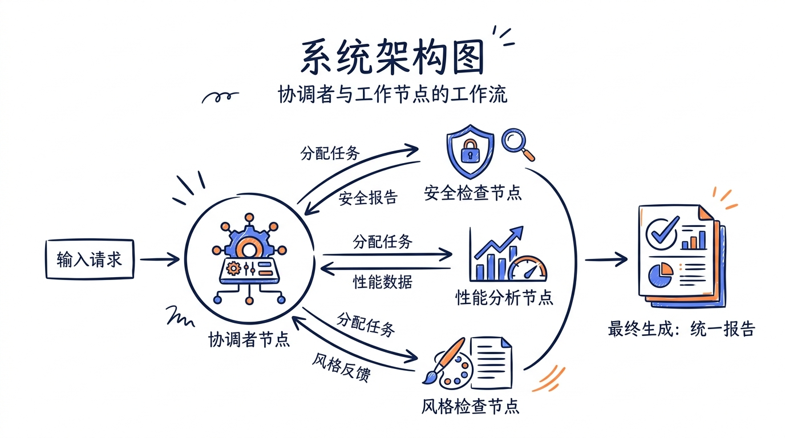
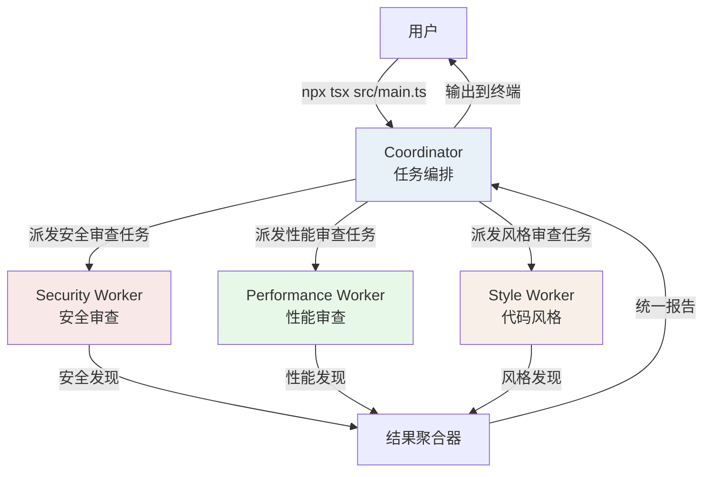
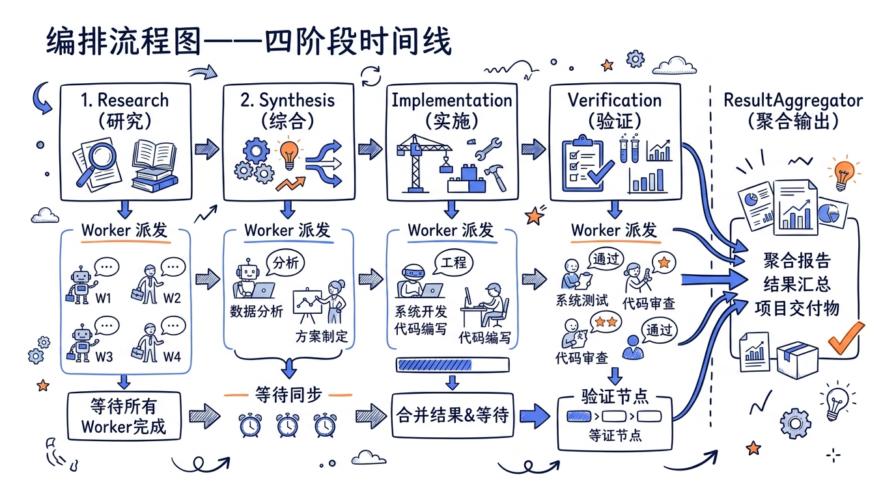
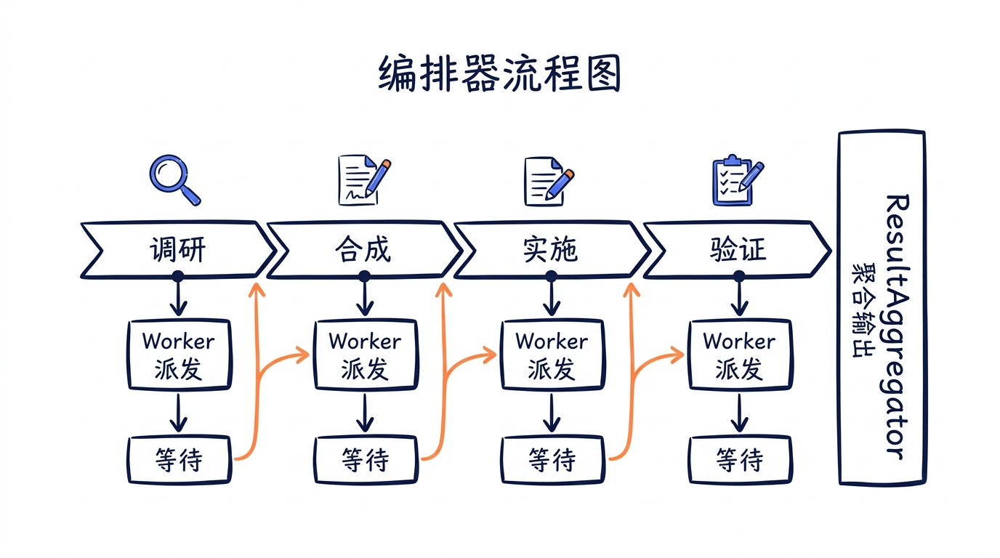
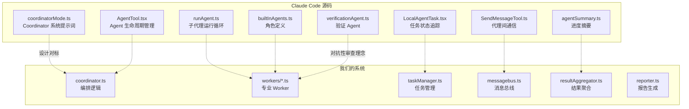

---
layout: default
title: "22 项目：多代理协作系统"
nav_order: 72
parent: "模块七：实战项目"
---


# 第二十二章：项目三——构建多代理协作系统


> 一个代理只能看到一条路径，三个代理就能覆盖整片森林。本章我们将构建一个多代理代码审查系统——一个 Coordinator 派遣任务、三个专业 Worker 各司其职，最终聚合出一份比任何单点审查都更全面的报告。

**关于实现方式的说明**：本项目直接基于 `@anthropic-ai/sdk` 原始 SDK 实现，**不引入** `@anthropic-ai/claude-agent-sdk`。理由是：Claude Agent SDK 已经把 Coordinator/Worker 模式封装好了，调用一行 `query()` 即可。但本课的目标是**让你看见这些抽象底下的机器是怎么运转的**——任务调度、消息总线、状态机、结果聚合——这些才是值得迁移到任何代理框架（甚至非 Anthropic 体系）的核心知识。学完本章后再去用 Agent SDK，你会清楚每个 API 调用背后发生了什么。

Claude Code 内部的多代理协作机制是整个系统中最精密的部分之一。从 `coordinatorMode.ts` 中长达 370 行的系统提示词，到 `AgentTool.tsx` 中复杂的生命周期管理，再到 `SendMessageTool.ts` 实现的代理间通信——源码告诉我们，一个好的多代理系统不是简单地"开多个对话"，而是需要精心设计任务分发、结果聚合、失败恢复和进度追踪。

本章的目标是提取这些设计精髓，构建一个独立运行的多代理代码审查系统。





---

## 22.1 从 Claude Code 源码中提取的多代理设计模式

在写代码之前，先分析 Claude Code 如何实现多代理协作。这不是学术研究——我们要把源码中经过百万用户检验的设计直接应用到自己的系统中。

### 模式一：Coordinator-Worker 分离

`coordinatorMode.ts` 定义了 Coordinator 的核心职责：

```typescript
// 源码 coordinator/coordinatorMode.ts
export function getCoordinatorSystemPrompt(): string {
  return `You are Claude Code, an AI assistant that orchestrates 
software engineering tasks across multiple workers.

## 1. Your Role
You are a **coordinator**. Your job is to:
- Help the user achieve their goal
- Direct workers to research, implement and verify code changes
- Synthesize results and communicate with the user
- Answer questions directly when possible
`
}
```

关键洞察：**Coordinator 不做具体工作，它做决策和综合**。在 Claude Code 中，Coordinator 被明确禁止使用文件操作工具（`Bash`、`FileEdit`），只能用 `AgentTool` 派遣 Worker 和 `SendMessageTool` 通信。

### 模式二：Task 通知机制

Worker 完成任务后，结果通过结构化的 `<task-notification>` XML 返回给 Coordinator：

```xml
<task-notification>
  <task-id>agent-a1b</task-id>
  <status>completed</status>
  <summary>Agent "Investigate auth bug" completed</summary>
  <result>Found null pointer in src/auth/validate.ts:42...</result>
  <usage>
    <total_tokens>15000</total_tokens>
    <tool_uses>8</tool_uses>
    <duration_ms>12500</duration_ms>
  </usage>
</task-notification>
```

### 模式三：并行调度 + 串行综合

源码中 Coordinator 的系统提示词明确说："Parallelism is your superpower. Workers are async. Launch independent workers concurrently whenever possible." 但在综合阶段，它强调："you must understand them before directing follow-up work."

### 模式四：内置 Agent 的角色分化

`tools/AgentTool/built-in/` 目录下有六种内置 Agent（generalPurpose、plan、claudeCodeGuide、verification、explore、statuslineSetup），每种都有精确的职责边界：

```typescript
// 源码 tools/AgentTool/built-in/verificationAgent.ts
export const VERIFICATION_AGENT: BuiltInAgentDefinition = {
  agentType: 'verification',
  whenToUse: 'Use this agent to verify that implementation work is correct...',
  color: 'red',
  background: true,
  disallowedTools: [
    AGENT_TOOL_NAME,         // 不能嵌套派遣
    FILE_EDIT_TOOL_NAME,     // 不能修改文件
    FILE_WRITE_TOOL_NAME,    // 不能创建文件
  ],
  source: 'built-in',
  getSystemPrompt: () => VERIFICATION_SYSTEM_PROMPT,
}
```

注意 `disallowedTools` 的设计：Verification Agent 被禁止修改文件，确保它是一个纯粹的"审查者"而非"修复者"。这种约束比依赖提示词可靠得多。

---

## 22.2 项目结构与依赖

```
multi-agent-review/
├── package.json
├── tsconfig.json
└── src/
    ├── main.ts              # 入口
    ├── coordinator.ts       # Coordinator 逻辑
    ├── workers/
    │   ├── types.ts         # Worker 接口定义
    │   ├── securityWorker.ts
    │   ├── performanceWorker.ts
    │   └── styleWorker.ts
    ├── tasks/
    │   ├── taskManager.ts   # 任务管理器
    │   └── types.ts         # 任务类型定义
    ├── communication/
    │   └── messagebus.ts    # 代理间通信
    ├── aggregator/
    │   └── resultAggregator.ts  # 结果聚合
    └── utils/
        ├── fileScanner.ts   # 文件扫描
        ├── codeParser.ts    # 代码解析
        └── reporter.ts      # 报告生成
```

### package.json

```json
{
  "name": "multi-agent-review",
  "version": "1.0.0",
  "description": "Multi-agent code review system using Claude Agent SDK",
  "type": "module",
  "scripts": {
    "build": "tsc",
    "start": "node dist/main.js",
    "dev": "tsx src/main.ts",
    "review": "tsx src/main.ts"
  },
  "dependencies": {
    "@anthropic-ai/sdk": "^0.52.0"
  },
  "devDependencies": {
    "@types/node": "^22.0.0",
    "tsx": "^4.19.0",
    "typescript": "^5.7.0"
  }
}
```

### tsconfig.json

```json
{
  "compilerOptions": {
    "target": "ES2022",
    "module": "Node16",
    "moduleResolution": "Node16",
    "outDir": "dist",
    "rootDir": "src",
    "strict": true,
    "esModuleInterop": true,
    "skipLibCheck": true,
    "declaration": true,
    "sourceMap": true
  },
  "include": ["src/**/*"],
  "exclude": ["node_modules", "dist"]
}
```

---

## 22.3 类型系统：任务、消息和发现

好的类型设计是多代理系统的基础。我们用 TypeScript 的类型系统来强制约束代理间的通信协议。

```typescript
// src/tasks/types.ts

/**
 * 任务状态机。
 *
 * 对应 Claude Code 源码 tasks/LocalAgentTask/LocalAgentTask.tsx 中的
 * AgentProgress 类型。Claude Code 用更多状态（pending、running、
 * backgrounding、summarizing），我们简化为四个核心状态。
 */
export type TaskStatus = 'pending' | 'running' | 'completed' | 'failed'

/**
 * 任务优先级。
 * Security 发现优先级最高——一个安全漏洞可以否决整个 PR。
 */
export type TaskPriority = 'critical' | 'high' | 'normal' | 'low'

/**
 * Worker 类型。
 * 对应 Claude Code 源码中 builtInAgents.ts 的 agentType 字段。
 */
export type WorkerType = 'security' | 'performance' | 'style'

/**
 * 审查任务定义。
 *
 * 设计对标 Claude Code 源码中 AgentTool.tsx 的 call() 方法
 * 接收的参数：prompt、subagent_type、description、model。
 */
export interface ReviewTask {
  id: string
  type: WorkerType
  status: TaskStatus
  priority: TaskPriority
  /** 要审查的文件列表 */
  files: string[]
  /** 项目根目录 */
  projectPath: string
  /** 任务创建时间 */
  createdAt: number
  /** 任务完成时间 */
  completedAt?: number
  /** Worker 返回的审查结果 */
  result?: ReviewResult
  /** 失败原因 */
  error?: string
}

/**
 * 审查发现的严重程度。
 */
export type Severity = 'critical' | 'high' | 'medium' | 'low' | 'info'

/**
 * 单个审查发现。
 */
export interface ReviewFinding {
  /** 发现类别（如 "SQL Injection", "Unused Variable"） */
  category: string
  /** 严重程度 */
  severity: Severity
  /** 涉及的文件 */
  file: string
  /** 行号（如果可定位） */
  line?: number
  /** 发现描述 */
  description: string
  /** 建议的修复方案 */
  suggestion?: string
  /** 相关代码片段 */
  codeSnippet?: string
}

/**
 * Worker 返回的审查结果。
 *
 * 对标 Claude Code 源码中 task-notification 的结构：
 * <result>、<summary>、<usage>。
 */
export interface ReviewResult {
  workerType: WorkerType
  findings: ReviewFinding[]
  summary: string
  /** 分析消耗的 tokens */
  tokensUsed: number
  /** 分析耗时（毫秒） */
  durationMs: number
  /** 分析的文件数 */
  filesAnalyzed: number
}

/**
 * 聚合后的最终报告。
 */
export interface AggregatedReport {
  projectPath: string
  timestamp: string
  totalFiles: number
  totalFindings: number
  criticalCount: number
  highCount: number
  mediumCount: number
  lowCount: number
  infoCount: number
  workerResults: ReviewResult[]
  topFindings: ReviewFinding[]
  verdict: 'PASS' | 'FAIL' | 'WARN'
  executionStats: {
    totalDurationMs: number
    totalTokens: number
    workersUsed: number
  }
}
```

---

## 22.4 代理间通信：MessageBus



在 Claude Code 中，代理间通信通过 `SendMessageTool` 实现——消息写入 mailbox 文件，目标代理轮询读取。我们用 EventEmitter 实现一个简化但类型安全的消息总线。

```typescript
// src/communication/messagebus.ts
import { EventEmitter } from 'events'
import type { ReviewResult, ReviewTask, WorkerType } from '../tasks/types.js'

/**
 * 消息类型定义。
 *
 * 对标 Claude Code 源码中 SendMessageTool.ts 的 StructuredMessage
 * 类型——它用 z.discriminatedUnion 定义了 shutdown_request、
 * shutdown_response、plan_approval_response 等结构化消息类型。
 * 我们的消息系统同样用 discriminated union 保证类型安全。
 */
export type AgentMessage =
  | {
      type: 'task_assigned'
      from: 'coordinator'
      to: WorkerType
      task: ReviewTask
    }
  | {
      type: 'task_progress'
      from: WorkerType
      to: 'coordinator'
      taskId: string
      progress: string
      filesCompleted: number
      filesTotal: number
    }
  | {
      type: 'task_completed'
      from: WorkerType
      to: 'coordinator'
      taskId: string
      result: ReviewResult
    }
  | {
      type: 'task_failed'
      from: WorkerType
      to: 'coordinator'
      taskId: string
      error: string
    }
  | {
      type: 'coordinator_directive'
      from: 'coordinator'
      to: WorkerType | 'all'
      directive: 'stop' | 'pause' | 'resume'
      reason?: string
    }

/**
 * 消息总线——代理间的通信中枢。
 *
 * 在 Claude Code 中，Coordinator 通过 AgentTool 派遣 Worker，
 * Worker 完成后通过 task-notification 返回结果。中间的通信
 * 由进程间的 stdin/stdout 管道或文件系统的 mailbox 实现。
 *
 * 我们的场景更简单（单进程内多个异步流程），用 EventEmitter
 * 就够了。但接口设计与 Claude Code 的 SendMessage 模式对齐，
 * 方便日后迁移到真正的跨进程通信。
 */
export class MessageBus {
  private emitter = new EventEmitter()
  private messageLog: Array<{
    timestamp: number
    message: AgentMessage
  }> = []

  /**
   * 发送消息。
   *
   * 对标 Claude Code 源码中 SendMessageTool.ts 的 call() 方法：
   *   - 消息发给特定代理（to 字段）
   *   - 消息被记录用于调试
   *   - 消息分发是异步的
   */
  send(message: AgentMessage): void {
    this.messageLog.push({
      timestamp: Date.now(),
      message,
    })

    // 广播到特定接收者的频道
    this.emitter.emit(`message:${message.to}`, message)

    // 同时广播到全局频道（用于监控）
    this.emitter.emit('message:*', message)
  }

  /**
   * 订阅发给特定代理的消息。
   */
  subscribe(
    agent: string,
    handler: (message: AgentMessage) => void,
  ): () => void {
    this.emitter.on(`message:${agent}`, handler)
    return () => {
      this.emitter.off(`message:${agent}`, handler)
    }
  }

  /**
   * 等待特定类型的消息。
   * 带超时保护——对标 Claude Code 中 AgentTool.tsx 对
   * Worker 响应的超时处理逻辑。
   */
  waitFor(
    agent: string,
    predicate: (message: AgentMessage) => boolean,
    timeoutMs: number = 120_000,
  ): Promise<AgentMessage> {
    return new Promise((resolve, reject) => {
      const timer = setTimeout(() => {
        this.emitter.off(`message:${agent}`, handler)
        reject(new Error(
          `Timeout waiting for message to ${agent} after ${timeoutMs}ms`,
        ))
      }, timeoutMs)

      const handler = (message: AgentMessage) => {
        if (predicate(message)) {
          clearTimeout(timer)
          this.emitter.off(`message:${agent}`, handler)
          resolve(message)
        }
      }

      this.emitter.on(`message:${agent}`, handler)
    })
  }

  /**
   * 获取消息日志——用于调试和审计。
   */
  getLog(): Array<{ timestamp: number; message: AgentMessage }> {
    return [...this.messageLog]
  }

  /**
   * 清理所有监听器。
   */
  dispose(): void {
    this.emitter.removeAllListeners()
  }
}
```

---

## 22.5 文件扫描与代码解析工具

Worker 需要读取和理解代码。这些工具函数模拟了 Claude Code 中 `FileReadTool` 和 `BashTool` 的部分能力。

```typescript
// src/utils/fileScanner.ts
import { readdir, readFile, stat } from 'fs/promises'
import { extname, join, relative } from 'path'

/** 文件扫描结果 */
export interface ScannedFile {
  path: string
  relativePath: string
  extension: string
  size: number
  content: string
  lineCount: number
}

/** 支持分析的文件扩展名 */
const ANALYZABLE_EXTENSIONS = new Set([
  '.ts', '.tsx', '.js', '.jsx', '.py', '.rb', '.go',
  '.rs', '.java', '.kt', '.swift', '.c', '.cpp', '.cs',
  '.php', '.vue', '.svelte',
])

/** 忽略的目录 */
const IGNORE_DIRS = new Set([
  'node_modules', '.git', 'dist', 'build', '.next',
  '__pycache__', 'venv', '.venv', 'coverage', 'target',
  '.cache', '.parcel-cache', '.turbo',
])

/**
 * 递归扫描项目目录，返回可分析的源代码文件。
 *
 * 类似 Claude Code 源码中 tools/GrepTool 的文件发现逻辑，
 * 但简化了 gitignore 的处理。
 */
export async function scanProject(
  projectPath: string,
  options: {
    maxFiles?: number
    maxFileSize?: number
    extensions?: Set<string>
  } = {},
): Promise<ScannedFile[]> {
  const {
    maxFiles = 200,
    maxFileSize = 100_000, // 100KB
    extensions = ANALYZABLE_EXTENSIONS,
  } = options

  const files: ScannedFile[] = []

  async function walk(dir: string): Promise<void> {
    if (files.length >= maxFiles) return

    let entries
    try {
      entries = await readdir(dir, { withFileTypes: true })
    } catch {
      return
    }

    for (const entry of entries) {
      if (files.length >= maxFiles) break
      if (IGNORE_DIRS.has(entry.name)) continue
      if (entry.name.startsWith('.')) continue

      const fullPath = join(dir, entry.name)

      if (entry.isDirectory()) {
        await walk(fullPath)
      } else if (entry.isFile()) {
        const ext = extname(entry.name).toLowerCase()
        if (!extensions.has(ext)) continue

        try {
          const fileStat = await stat(fullPath)
          if (fileStat.size > maxFileSize) continue
          if (fileStat.size === 0) continue

          const content = await readFile(fullPath, 'utf-8')
          files.push({
            path: fullPath,
            relativePath: relative(projectPath, fullPath),
            extension: ext,
            size: fileStat.size,
            content,
            lineCount: content.split('\n').length,
          })
        } catch {
          // 跳过无法读取的文件
        }
      }
    }
  }

  await walk(projectPath)
  return files
}
```

```typescript
// src/utils/codeParser.ts

/**
 * 代码解析工具——为 Worker 提供基础的代码理解能力。
 *
 * 不构建完整 AST，而是用正则和启发式规则提取关键信息。
 * 这足以支撑代码审查场景中对模式匹配的需求。
 */

/** 导入声明 */
export interface ImportStatement {
  source: string
  specifiers: string[]
  line: number
  isDefault: boolean
  isDynamic: boolean
}

/** 函数声明 */
export interface FunctionDeclaration {
  name: string
  line: number
  endLine: number
  params: string[]
  isAsync: boolean
  isExported: boolean
  body: string
}

/**
 * 提取导入声明。
 */
export function extractImports(code: string): ImportStatement[] {
  const imports: ImportStatement[] = []
  const lines = code.split('\n')

  for (let i = 0; i < lines.length; i++) {
    const line = lines[i]!

    // ESM: import { x } from 'y'
    const esmMatch = line.match(
      /import\s+(?:({[^}]+})|(\w+)(?:\s*,\s*{[^}]+})?)\s+from\s+['"]([^'"]+)['"]/,
    )
    if (esmMatch) {
      const specifiers = esmMatch[1]
        ? esmMatch[1].replace(/[{}]/g, '').split(',').map(s => s.trim()).filter(Boolean)
        : esmMatch[2] ? [esmMatch[2]] : []
      imports.push({
        source: esmMatch[3]!,
        specifiers,
        line: i + 1,
        isDefault: !esmMatch[1],
        isDynamic: false,
      })
      continue
    }

    // CommonJS: const x = require('y')
    const cjsMatch = line.match(
      /(?:const|let|var)\s+(?:({[^}]+})|(\w+))\s*=\s*require\s*\(\s*['"]([^'"]+)['"]\s*\)/,
    )
    if (cjsMatch) {
      const specifiers = cjsMatch[1]
        ? cjsMatch[1].replace(/[{}]/g, '').split(',').map(s => s.trim()).filter(Boolean)
        : cjsMatch[2] ? [cjsMatch[2]] : []
      imports.push({
        source: cjsMatch[3]!,
        specifiers,
        line: i + 1,
        isDefault: !cjsMatch[1],
        isDynamic: false,
      })
      continue
    }

    // Dynamic import: import('y')
    const dynMatch = line.match(/import\s*\(\s*['"]([^'"]+)['"]\s*\)/)
    if (dynMatch) {
      imports.push({
        source: dynMatch[1]!,
        specifiers: [],
        line: i + 1,
        isDefault: false,
        isDynamic: true,
      })
    }
  }

  return imports
}

/**
 * 提取函数声明。
 */
export function extractFunctions(
  code: string,
): FunctionDeclaration[] {
  const functions: FunctionDeclaration[] = []
  const lines = code.split('\n')

  const patterns = [
    // function name(params) { / async function name(params) {
    /^(\s*)(export\s+)?(async\s+)?function\s+(\w+)\s*\(([^)]*)\)/,
    // const name = (params) => { / const name = async (params) => {
    /^(\s*)(export\s+)?(?:const|let|var)\s+(\w+)\s*=\s*(async\s+)?\(([^)]*)\)\s*(?::\s*[^=]+)?\s*=>/,
    // const name = function(params) {
    /^(\s*)(export\s+)?(?:const|let|var)\s+(\w+)\s*=\s*(async\s+)?function\s*\(([^)]*)\)/,
  ]

  for (let i = 0; i < lines.length; i++) {
    const line = lines[i]!

    for (const pattern of patterns) {
      const match = line.match(pattern)
      if (!match) continue

      // 根据模式不同，匹配组的位置不同
      const isExported = !!match[2]
      const isAsync = !!(match[3] || match[4])
      const name = match[4] || match[3] || 'anonymous'
      const paramsStr = match[5] ?? ''

      // 寻找函数体的结束位置
      let braceCount = 0
      let started = false
      let endLine = i

      for (let j = i; j < lines.length; j++) {
        for (const char of lines[j]!) {
          if (char === '{') { braceCount++; started = true }
          else if (char === '}') { braceCount-- }
        }
        endLine = j
        if (started && braceCount <= 0) break
      }

      const params = paramsStr
        .split(',')
        .map(p => p.trim().split(':')[0]!.trim())
        .filter(Boolean)

      const body = lines.slice(i, endLine + 1).join('\n')

      functions.push({
        name,
        line: i + 1,
        endLine: endLine + 1,
        params,
        isAsync,
        isExported,
        body,
      })

      break // 一行只匹配一个模式
    }
  }

  return functions
}

/**
 * 提取字符串字面量——用于安全审查中检测硬编码凭证。
 */
export function extractStringLiterals(
  code: string,
): Array<{ value: string; line: number }> {
  const literals: Array<{ value: string; line: number }> = []
  const lines = code.split('\n')

  for (let i = 0; i < lines.length; i++) {
    const line = lines[i]!
    // 跳过注释行
    if (line.trim().startsWith('//') || line.trim().startsWith('#')) continue

    // 匹配各种字符串字面量
    const patterns = [
      /'([^'\\]{8,})'/g,   // 单引号，至少 8 个字符
      /"([^"\\]{8,})"/g,   // 双引号，至少 8 个字符
    ]

    for (const pattern of patterns) {
      let match
      while ((match = pattern.exec(line)) !== null) {
        literals.push({ value: match[1]!, line: i + 1 })
      }
    }
  }

  return literals
}
```

---

## 22.6 Worker 接口与基类

```typescript
// src/workers/types.ts
import type Anthropic from '@anthropic-ai/sdk'
import type { MessageBus } from '../communication/messagebus.js'
import type {
  ReviewFinding,
  ReviewResult,
  ReviewTask,
  WorkerType,
} from '../tasks/types.js'
import type { ScannedFile } from '../utils/fileScanner.js'

/**
 * Worker 配置。
 *
 * 对标 Claude Code 源码中 BaseAgentDefinition 的字段：
 * agentType、tools、model、permissionMode、maxTurns。
 * 我们简化为 Worker 需要的核心参数。
 */
export interface WorkerConfig {
  type: WorkerType
  /** Claude API 使用的模型 */
  model: string
  /** 最大分析轮次（防止 token 超支） */
  maxTurns: number
  /** 每轮最大输出 token */
  maxTokens: number
  /** Worker 的系统提示词 */
  systemPrompt: string
}

/**
 * Worker 上下文——传递给每个分析方法的运行时信息。
 */
export interface WorkerContext {
  task: ReviewTask
  files: ScannedFile[]
  messageBus: MessageBus
  client: Anthropic
  config: WorkerConfig
}

/**
 * Worker 接口——所有专业 Worker 必须实现。
 *
 * 这与 Claude Code 源码中 BuiltInAgentDefinition 的设计一致：
 * 每种 Agent 有自己的 getSystemPrompt() 和行为约束。
 */
export interface ReviewWorker {
  readonly type: WorkerType

  /**
   * 执行审查任务，返回发现列表。
   *
   * 对标 Claude Code 源码中 runAgent() 的主循环——
   * Worker 与 Claude API 交互，逐步分析代码，
   * 在过程中通过 messageBus 报告进度。
   */
  analyze(context: WorkerContext): Promise<ReviewFinding[]>
}
```

---

## 22.7 Security Worker：安全审查

```typescript
// src/workers/securityWorker.ts
import type Anthropic from '@anthropic-ai/sdk'
import type {
  ReviewFinding,
  Severity,
} from '../tasks/types.js'
import type { ScannedFile } from '../utils/fileScanner.js'
import {
  extractFunctions,
  extractImports,
  extractStringLiterals,
} from '../utils/codeParser.js'
import type { ReviewWorker, WorkerContext } from './types.js'

/**
 * Security Worker——专注于安全漏洞检测。
 *
 * 对标 Claude Code 内置的 Verification Agent 的设计理念：
 * "Your job is not to confirm the implementation works — 
 *  it's to try to break it."
 *
 * 我们的 Security Worker 也是"对抗性"的——它主动寻找漏洞，
 * 而不是确认代码是安全的。
 */
export class SecurityWorker implements ReviewWorker {
  readonly type = 'security' as const

  /**
   * 执行安全审查。
   *
   * 三阶段分析：
   * 1. 静态模式匹配（快速，覆盖面广）
   * 2. 语义分析（用 Claude 理解上下文）
   * 3. 依赖安全检查（检查 package 清单）
   */
  async analyze(context: WorkerContext): Promise<ReviewFinding[]> {
    const { task, files, messageBus, client, config } = context
    const findings: ReviewFinding[] = []
    let filesCompleted = 0

    // 阶段 1：静态模式匹配
    for (const file of files) {
      const staticFindings = this.runStaticChecks(file)
      findings.push(...staticFindings)

      filesCompleted++
      if (filesCompleted % 10 === 0) {
        messageBus.send({
          type: 'task_progress',
          from: 'security',
          to: 'coordinator',
          taskId: task.id,
          progress: `Static analysis: ${filesCompleted}/${files.length} files`,
          filesCompleted,
          filesTotal: files.length,
        })
      }
    }

    // 阶段 2：用 Claude 进行语义分析（对最值得关注的文件）
    const priorityFiles = this.prioritizeFilesForDeepAnalysis(files, findings)
    if (priorityFiles.length > 0) {
      messageBus.send({
        type: 'task_progress',
        from: 'security',
        to: 'coordinator',
        taskId: task.id,
        progress: `Deep analysis: ${priorityFiles.length} priority files`,
        filesCompleted,
        filesTotal: files.length,
      })

      const deepFindings = await this.runDeepAnalysis(
        priorityFiles, client, config,
      )
      findings.push(...deepFindings)
    }

    return findings
  }

  /**
   * 静态安全检查——通过模式匹配快速发现常见漏洞。
   */
  private runStaticChecks(file: ScannedFile): ReviewFinding[] {
    const findings: ReviewFinding[] = []
    const lines = file.content.split('\n')

    // ---- 硬编码凭证检测 ----
    const credentialPatterns = [
      { pattern: /(?:password|passwd|pwd)\s*[:=]\s*['"][^'"]+['"]/i, category: 'Hardcoded Password' },
      { pattern: /(?:api[_-]?key|apikey)\s*[:=]\s*['"][^'"]+['"]/i, category: 'Hardcoded API Key' },
      { pattern: /(?:secret|token)\s*[:=]\s*['"][A-Za-z0-9+/=]{16,}['"]/i, category: 'Hardcoded Secret' },
      { pattern: /(?:aws_access_key_id|aws_secret_access_key)\s*[:=]\s*['"][^'"]+['"]/i, category: 'AWS Credentials' },
      { pattern: /-----BEGIN (?:RSA|DSA|EC|OPENSSH) PRIVATE KEY-----/i, category: 'Private Key' },
    ]

    for (let i = 0; i < lines.length; i++) {
      const line = lines[i]!
      // 跳过注释、测试文件和环境变量模板
      if (line.trim().startsWith('//') || line.trim().startsWith('#')) continue
      if (file.relativePath.includes('.test.') || file.relativePath.includes('.spec.')) continue
      if (file.relativePath.includes('.example') || file.relativePath.includes('.template')) continue

      for (const { pattern, category } of credentialPatterns) {
        if (pattern.test(line)) {
          findings.push({
            category,
            severity: 'critical',
            file: file.relativePath,
            line: i + 1,
            description: `Potential hardcoded credential detected`,
            suggestion: 'Move to environment variables or a secrets manager',
            codeSnippet: line.trim().slice(0, 100),
          })
        }
      }
    }

    // ---- SQL 注入检测 ----
    const sqlInjectionPatterns = [
      /`\s*(?:SELECT|INSERT|UPDATE|DELETE|DROP|CREATE)\s[^`]*\$\{/i,
      /['"]?\s*\+\s*(?:req\.|request\.|params\.|query\.|body\.)/i,
      /(?:query|execute)\s*\(\s*[`'"].*\$\{/i,
    ]

    for (let i = 0; i < lines.length; i++) {
      const line = lines[i]!
      for (const pattern of sqlInjectionPatterns) {
        if (pattern.test(line)) {
          findings.push({
            category: 'SQL Injection',
            severity: 'critical',
            file: file.relativePath,
            line: i + 1,
            description: 'Potential SQL injection — user input may be interpolated into query',
            suggestion: 'Use parameterized queries or an ORM',
            codeSnippet: line.trim().slice(0, 120),
          })
        }
      }
    }

    // ---- 命令注入检测 ----
    const commandInjectionPatterns = [
      /exec\s*\(\s*[`'"].*\$\{/,
      /execSync\s*\(\s*[`'"].*\$\{/,
      /child_process.*exec.*\+/,
      /spawn\s*\(\s*[^,]+,\s*\[.*\$\{/,
    ]

    for (let i = 0; i < lines.length; i++) {
      const line = lines[i]!
      for (const pattern of commandInjectionPatterns) {
        if (pattern.test(line)) {
          findings.push({
            category: 'Command Injection',
            severity: 'critical',
            file: file.relativePath,
            line: i + 1,
            description: 'Potential command injection — user input in shell command',
            suggestion: 'Use execFile() with argument array instead of exec() with string interpolation',
            codeSnippet: line.trim().slice(0, 120),
          })
        }
      }
    }

    // ---- 不安全的反序列化 ----
    for (let i = 0; i < lines.length; i++) {
      const line = lines[i]!
      if (/eval\s*\(/.test(line) && !line.trim().startsWith('//')) {
        findings.push({
          category: 'Unsafe Eval',
          severity: 'high',
          file: file.relativePath,
          line: i + 1,
          description: 'Use of eval() — may execute arbitrary code',
          suggestion: 'Replace with JSON.parse(), Function constructor, or a sandboxed evaluator',
          codeSnippet: line.trim().slice(0, 100),
        })
      }
    }

    // ---- 路径遍历 ----
    const pathTraversalPatterns = [
      /(?:readFile|writeFile|createReadStream)\s*\(\s*(?:req|request|params|query)/,
      /path\.(?:join|resolve)\s*\([^)]*(?:req|request|params|query)/,
    ]

    for (let i = 0; i < lines.length; i++) {
      const line = lines[i]!
      for (const pattern of pathTraversalPatterns) {
        if (pattern.test(line)) {
          findings.push({
            category: 'Path Traversal',
            severity: 'high',
            file: file.relativePath,
            line: i + 1,
            description: 'User input used in file path — potential directory traversal',
            suggestion: 'Validate and sanitize file paths; use path.normalize() and check prefix',
            codeSnippet: line.trim().slice(0, 120),
          })
        }
      }
    }

    // ---- CORS 配置问题 ----
    for (let i = 0; i < lines.length; i++) {
      const line = lines[i]!
      if (/origin:\s*['"]?\*['"]?/.test(line) || /Access-Control-Allow-Origin.*\*/.test(line)) {
        findings.push({
          category: 'CORS Misconfiguration',
          severity: 'medium',
          file: file.relativePath,
          line: i + 1,
          description: 'Wildcard CORS origin — allows requests from any domain',
          suggestion: 'Specify allowed origins explicitly',
          codeSnippet: line.trim().slice(0, 100),
        })
      }
    }

    return findings
  }

  /**
   * 选择需要深度分析的文件。
   * 优先级：已有发现的文件 > 包含敏感操作的文件 > 入口文件。
   */
  private prioritizeFilesForDeepAnalysis(
    files: ScannedFile[],
    existingFindings: ReviewFinding[],
  ): ScannedFile[] {
    const filesWithFindings = new Set(existingFindings.map(f => f.file))

    const scored = files.map(file => {
      let score = 0
      if (filesWithFindings.has(file.relativePath)) score += 10

      // 包含认证/授权逻辑的文件
      if (/auth|login|session|token|credential|password/i.test(file.relativePath)) score += 8
      if (/middleware|interceptor|guard|policy/i.test(file.relativePath)) score += 5

      // 处理外部输入的文件
      if (/route|controller|handler|endpoint|api/i.test(file.relativePath)) score += 6

      // 数据库操作
      if (/model|schema|migration|query|repository/i.test(file.relativePath)) score += 4

      return { file, score }
    })

    return scored
      .sort((a, b) => b.score - a.score)
      .slice(0, 5) // 最多深度分析 5 个文件
      .filter(s => s.score > 0)
      .map(s => s.file)
  }

  /**
   * 用 Claude 进行深度语义分析。
   *
   * 这是真正发挥 LLM 能力的地方——让 Claude 理解代码的
   * 业务逻辑和安全含义，而不仅仅是模式匹配。
   */
  private async runDeepAnalysis(
    files: ScannedFile[],
    client: Anthropic,
    config: WorkerConfig,
  ): Promise<ReviewFinding[]> {
    const findings: ReviewFinding[] = []

    // 将文件内容组装成分析请求
    const fileContents = files
      .map(f => `--- ${f.relativePath} ---\n${f.content}`)
      .join('\n\n')

    // 控制输入大小：如果总内容过大，截断
    const maxContentSize = 30_000 // 约 7500 tokens
    const truncatedContents = fileContents.length > maxContentSize
      ? fileContents.slice(0, maxContentSize) + '\n\n[Content truncated for analysis]'
      : fileContents

    try {
      const response = await client.messages.create({
        model: config.model,
        max_tokens: config.maxTokens,
        system: config.systemPrompt,
        messages: [
          {
            role: 'user',
            content: [
              {
                type: 'text',
                text: `Analyze the following code files for security vulnerabilities. 
Focus on:
1. Authentication/authorization flaws
2. Input validation gaps
3. Data exposure risks
4. Race conditions in security-critical paths
5. Cryptographic misuse

For each finding, respond with a JSON array of objects:
[{"category": "...", "severity": "critical|high|medium|low", "file": "...", "line": <number>, "description": "...", "suggestion": "..."}]

If no issues found, respond with an empty array: []

Code to analyze:
${truncatedContents}`,
              },
            ],
          },
        ],
      })

      // 从响应中提取结构化发现
      const textContent = response.content
        .filter(block => block.type === 'text')
        .map(block => (block as { type: 'text'; text: string }).text)
        .join('')

      const parsed = this.parseDeepAnalysisResponse(textContent)
      findings.push(...parsed)
    } catch (error) {
      // API 调用失败不应该中断整个审查
      console.error(`[SecurityWorker] Deep analysis failed: ${error}`)
    }

    return findings
  }

  /**
   * 解析 Claude 的深度分析响应。
   */
  private parseDeepAnalysisResponse(response: string): ReviewFinding[] {
    try {
      // 尝试从响应中提取 JSON 数组
      const jsonMatch = response.match(/\[[\s\S]*\]/)
      if (!jsonMatch) return []

      const parsed = JSON.parse(jsonMatch[0]) as Array<{
        category?: string
        severity?: string
        file?: string
        line?: number
        description?: string
        suggestion?: string
      }>

      if (!Array.isArray(parsed)) return []

      return parsed
        .filter(item => item.category && item.description && item.file)
        .map(item => ({
          category: item.category!,
          severity: (item.severity as Severity) || 'medium',
          file: item.file!,
          line: item.line,
          description: item.description!,
          suggestion: item.suggestion,
        }))
    } catch {
      return []
    }
  }
}
```

---

## 22.8 Performance Worker：性能审查

```typescript
// src/workers/performanceWorker.ts
import type { ReviewFinding } from '../tasks/types.js'
import { extractFunctions, extractImports } from '../utils/codeParser.js'
import type { ScannedFile } from '../utils/fileScanner.js'
import type { ReviewWorker, WorkerContext } from './types.js'

/**
 * Performance Worker——专注于性能问题检测。
 *
 * 关注三个层面：
 * 1. 算法复杂度问题（嵌套循环、重复计算）
 * 2. 资源管理问题（内存泄漏、未关闭的连接）
 * 3. 异步性能问题（瀑布式 await、缺少并发）
 */
export class PerformanceWorker implements ReviewWorker {
  readonly type = 'performance' as const

  async analyze(context: WorkerContext): Promise<ReviewFinding[]> {
    const { task, files, messageBus, client, config } = context
    const findings: ReviewFinding[] = []
    let filesCompleted = 0

    for (const file of files) {
      const fileFindings = [
        ...this.checkAlgorithmicIssues(file),
        ...this.checkResourceLeaks(file),
        ...this.checkAsyncPatterns(file),
        ...this.checkBundleImpact(file),
      ]
      findings.push(...fileFindings)

      filesCompleted++
      if (filesCompleted % 15 === 0) {
        messageBus.send({
          type: 'task_progress',
          from: 'performance',
          to: 'coordinator',
          taskId: task.id,
          progress: `Performance analysis: ${filesCompleted}/${files.length} files`,
          filesCompleted,
          filesTotal: files.length,
        })
      }
    }

    // 用 Claude 分析需要上下文理解的性能问题
    const complexFiles = files.filter(f =>
      f.lineCount > 100 &&
      (f.extension === '.ts' || f.extension === '.js' || f.extension === '.tsx'),
    ).slice(0, 5)

    if (complexFiles.length > 0) {
      messageBus.send({
        type: 'task_progress',
        from: 'performance',
        to: 'coordinator',
        taskId: task.id,
        progress: `Deep performance analysis on ${complexFiles.length} complex files`,
        filesCompleted,
        filesTotal: files.length,
      })

      const deepFindings = await this.runDeepPerformanceAnalysis(
        complexFiles, client, config,
      )
      findings.push(...deepFindings)
    }

    return findings
  }

  /**
   * 检测算法复杂度问题。
   */
  private checkAlgorithmicIssues(file: ScannedFile): ReviewFinding[] {
    const findings: ReviewFinding[] = []
    const lines = file.content.split('\n')

    // 嵌套循环检测
    let loopDepth = 0
    let outerLoopLine = -1

    for (let i = 0; i < lines.length; i++) {
      const line = lines[i]!
      if (/\b(?:for|while)\s*\(/.test(line)) {
        loopDepth++
        if (loopDepth === 1) outerLoopLine = i + 1
        if (loopDepth >= 3) {
          findings.push({
            category: 'Deeply Nested Loop',
            severity: 'high',
            file: file.relativePath,
            line: i + 1,
            description: `${loopDepth}-level nested loop — O(n^${loopDepth}) complexity`,
            suggestion: 'Refactor using Map/Set lookups, early exits, or algorithm optimization',
          })
        } else if (loopDepth === 2) {
          findings.push({
            category: 'Nested Loop',
            severity: 'medium',
            file: file.relativePath,
            line: i + 1,
            description: 'Nested loop detected — potential O(n^2) complexity',
            suggestion: 'Consider using a Map/Set for O(1) lookups if processing large datasets',
          })
        }
      }
      // 简化的花括号追踪：遇到循环结束恢复 depth
      if (line.includes('}') && loopDepth > 0) {
        // 这是一个简化：实际需要精确的括号匹配
        // 但对于启发式检查已经足够
        const closeBraces = (line.match(/}/g) || []).length
        const openBraces = (line.match(/{/g) || []).length
        if (closeBraces > openBraces) {
          loopDepth = Math.max(0, loopDepth - (closeBraces - openBraces))
        }
      }
    }

    // 数组方法链检测（.filter().map().filter() 等）
    for (let i = 0; i < lines.length; i++) {
      const line = lines[i]!
      const chainMatch = line.match(
        /\.(filter|map|reduce|find|some|every|forEach)\s*\([^)]*\)\s*\.(filter|map|reduce|find|some|every|forEach)/,
      )
      if (chainMatch) {
        // 检查是否在大数据集上
        if (line.length > 80) { // 长链更可能有性能影响
          findings.push({
            category: 'Chained Array Operations',
            severity: 'low',
            file: file.relativePath,
            line: i + 1,
            description: `Chained ${chainMatch[1]}().${chainMatch[2]}() — multiple array traversals`,
            suggestion: 'Consider combining into a single reduce() or for loop for large arrays',
          })
        }
      }
    }

    // 正则表达式在循环内编译
    const functions = extractFunctions(file.content)
    for (const func of functions) {
      const funcLines = func.body.split('\n')
      let inLoop = false
      for (let i = 0; i < funcLines.length; i++) {
        if (/\b(?:for|while)\s*\(/.test(funcLines[i]!)) inLoop = true
        if (inLoop && /new RegExp\(/.test(funcLines[i]!)) {
          findings.push({
            category: 'Regex in Loop',
            severity: 'medium',
            file: file.relativePath,
            line: func.line + i,
            description: 'RegExp constructor called inside loop — compiled on every iteration',
            suggestion: 'Move regex compilation outside the loop',
          })
        }
      }
    }

    return findings
  }

  /**
   * 检测资源泄漏问题。
   */
  private checkResourceLeaks(file: ScannedFile): ReviewFinding[] {
    const findings: ReviewFinding[] = []
    const lines = file.content.split('\n')

    // 事件监听器泄漏
    let addListenerCount = 0
    let removeListenerCount = 0
    for (const line of lines) {
      if (/\.(?:addEventListener|on)\s*\(/.test(line)) addListenerCount++
      if (/\.(?:removeEventListener|off|removeListener)\s*\(/.test(line)) removeListenerCount++
    }

    if (addListenerCount > 0 && removeListenerCount === 0 && addListenerCount >= 3) {
      findings.push({
        category: 'Event Listener Leak',
        severity: 'medium',
        file: file.relativePath,
        description: `${addListenerCount} event listeners added, none removed — potential memory leak`,
        suggestion: 'Add cleanup in componentWillUnmount, useEffect cleanup, or close handler',
      })
    }

    // setInterval 没有清理
    for (let i = 0; i < lines.length; i++) {
      if (/setInterval\s*\(/.test(lines[i]!)) {
        // 检查附近是否有对应的 clearInterval
        const nearby = lines.slice(Math.max(0, i - 20), Math.min(lines.length, i + 20)).join('\n')
        if (!nearby.includes('clearInterval')) {
          findings.push({
            category: 'Uncleaned Interval',
            severity: 'medium',
            file: file.relativePath,
            line: i + 1,
            description: 'setInterval without corresponding clearInterval',
            suggestion: 'Store the interval ID and clear it when no longer needed',
          })
        }
      }
    }

    // 流未关闭
    for (let i = 0; i < lines.length; i++) {
      if (/createReadStream|createWriteStream/.test(lines[i]!)) {
        const nearby = lines.slice(i, Math.min(lines.length, i + 30)).join('\n')
        if (!nearby.includes('.close()') && !nearby.includes('.destroy()') && !nearby.includes('pipeline')) {
          findings.push({
            category: 'Unclosed Stream',
            severity: 'medium',
            file: file.relativePath,
            line: i + 1,
            description: 'Stream created without explicit close/destroy — may leak file descriptors',
            suggestion: 'Use pipeline(), stream.destroy(), or try-finally with .close()',
          })
        }
      }
    }

    return findings
  }

  /**
   * 检测异步模式问题。
   */
  private checkAsyncPatterns(file: ScannedFile): ReviewFinding[] {
    const findings: ReviewFinding[] = []
    const functions = extractFunctions(file.content)

    for (const func of functions) {
      if (!func.isAsync) continue
      const funcLines = func.body.split('\n')

      // 瀑布式 await 检测：连续多个 await 且它们之间没有数据依赖
      let consecutiveAwaits = 0
      let awaitStartLine = -1

      for (let i = 0; i < funcLines.length; i++) {
        if (/\bawait\b/.test(funcLines[i]!)) {
          if (consecutiveAwaits === 0) awaitStartLine = i
          consecutiveAwaits++
        } else if (funcLines[i]!.trim() !== '' && !/^\s*\/\//.test(funcLines[i]!)) {
          if (consecutiveAwaits >= 3) {
            findings.push({
              category: 'Sequential Awaits',
              severity: 'medium',
              file: file.relativePath,
              line: func.line + awaitStartLine,
              description: `${consecutiveAwaits} sequential await statements — may run in parallel`,
              suggestion: 'Use Promise.all() for independent async operations',
            })
          }
          consecutiveAwaits = 0
        }
      }

      // await in loop
      let inLoop = false
      for (let i = 0; i < funcLines.length; i++) {
        const line = funcLines[i]!
        if (/\b(?:for|while)\s*\(/.test(line) || /\.forEach\s*\(/.test(line)) {
          inLoop = true
        }
        if (inLoop && /\bawait\b/.test(line)) {
          findings.push({
            category: 'Await in Loop',
            severity: 'high',
            file: file.relativePath,
            line: func.line + i,
            description: 'await inside loop — sequential execution of async operations',
            suggestion: 'Collect promises and use Promise.all(), or use a batching library like p-map',
          })
          inLoop = false // 只报告一次
        }
        if (line.includes('}')) inLoop = false
      }
    }

    return findings
  }

  /**
   * 检测可能影响打包体积的问题。
   */
  private checkBundleImpact(file: ScannedFile): ReviewFinding[] {
    const findings: ReviewFinding[] = []
    const imports = extractImports(file.content)

    // 大型库的全量导入
    const heavyLibraries: Record<string, string> = {
      'lodash': 'Use lodash-es or individual imports (lodash/map)',
      'moment': 'Use dayjs or date-fns (moment is 300KB+ minified)',
      'rxjs': 'Use individual imports (rxjs/operators)',
      'aws-sdk': 'Use @aws-sdk/* v3 modular packages',
    }

    for (const imp of imports) {
      if (heavyLibraries[imp.source] && imp.isDefault) {
        findings.push({
          category: 'Heavy Import',
          severity: 'low',
          file: file.relativePath,
          line: imp.line,
          description: `Full import of "${imp.source}" — adds significant bundle size`,
          suggestion: heavyLibraries[imp.source],
        })
      }
    }

    return findings
  }

  /**
   * 用 Claude 进行深度性能分析。
   */
  private async runDeepPerformanceAnalysis(
    files: ScannedFile[],
    client: InstanceType<typeof import('@anthropic-ai/sdk').default>,
    config: { model: string; maxTokens: number; systemPrompt: string },
  ): Promise<ReviewFinding[]> {
    const fileContents = files
      .map(f => `--- ${f.relativePath} ---\n${f.content}`)
      .join('\n\n')
      .slice(0, 30_000)

    try {
      const response = await client.messages.create({
        model: config.model,
        max_tokens: config.maxTokens,
        system: `You are a performance engineering expert. Analyze code for performance issues. 
Return ONLY a JSON array of findings. Each finding: {"category":"...","severity":"high|medium|low","file":"...","line":<n>,"description":"...","suggestion":"..."}
Focus on: N+1 queries, unnecessary re-renders, missing memoization, inefficient algorithms, memory leaks.
Return [] if no issues found.`,
        messages: [{
          role: 'user',
          content: `Analyze these files for performance issues:\n\n${fileContents}`,
        }],
      })

      const text = response.content
        .filter(b => b.type === 'text')
        .map(b => (b as { type: 'text'; text: string }).text)
        .join('')

      const jsonMatch = text.match(/\[[\s\S]*\]/)
      if (!jsonMatch) return []

      const parsed = JSON.parse(jsonMatch[0]) as ReviewFinding[]
      return Array.isArray(parsed) ? parsed.filter(f => f.category && f.description) : []
    } catch {
      return []
    }
  }
}
```

---

## 22.9 Style Worker：代码风格审查

```typescript
// src/workers/styleWorker.ts
import type { ReviewFinding } from '../tasks/types.js'
import { extractFunctions, extractImports } from '../utils/codeParser.js'
import type { ScannedFile } from '../utils/fileScanner.js'
import type { ReviewWorker, WorkerContext } from './types.js'

/**
 * Style Worker——专注于代码风格和可维护性。
 *
 * 不是替代 ESLint/Prettier，而是关注更高层次的问题：
 * - 函数过长、参数过多
 * - 命名不一致
 * - 注释质量
 * - 代码组织问题
 */
export class StyleWorker implements ReviewWorker {
  readonly type = 'style' as const

  async analyze(context: WorkerContext): Promise<ReviewFinding[]> {
    const { task, files, messageBus, client, config } = context
    const findings: ReviewFinding[] = []
    let filesCompleted = 0

    for (const file of files) {
      const fileFindings = [
        ...this.checkFunctionMetrics(file),
        ...this.checkNamingConventions(file),
        ...this.checkCodeOrganization(file),
        ...this.checkCommentQuality(file),
        ...this.checkErrorHandling(file),
      ]
      findings.push(...fileFindings)

      filesCompleted++
      if (filesCompleted % 20 === 0) {
        messageBus.send({
          type: 'task_progress',
          from: 'style',
          to: 'coordinator',
          taskId: task.id,
          progress: `Style analysis: ${filesCompleted}/${files.length} files`,
          filesCompleted,
          filesTotal: files.length,
        })
      }
    }

    return findings
  }

  /**
   * 检查函数级别的指标。
   */
  private checkFunctionMetrics(file: ScannedFile): ReviewFinding[] {
    const findings: ReviewFinding[] = []
    const functions = extractFunctions(file.content)

    for (const func of functions) {
      // 函数过长
      if (func.body.split('\n').length > 50) {
        findings.push({
          category: 'Long Function',
          severity: 'medium',
          file: file.relativePath,
          line: func.line,
          description: `Function "${func.name}" is ${func.body.split('\n').length} lines long`,
          suggestion: 'Extract smaller helper functions for better readability',
        })
      }

      // 参数过多
      if (func.params.length > 5) {
        findings.push({
          category: 'Too Many Parameters',
          severity: 'medium',
          file: file.relativePath,
          line: func.line,
          description: `Function "${func.name}" has ${func.params.length} parameters`,
          suggestion: 'Group related parameters into an options object',
        })
      }

      // 函数名不符合 camelCase
      if (func.isExported && !/^[a-z][a-zA-Z0-9]*$/.test(func.name) && !/^[A-Z][a-zA-Z0-9]*$/.test(func.name)) {
        // 排除 React 组件（PascalCase 是正确的）
        if (!file.extension.includes('x') || !/^[A-Z]/.test(func.name)) {
          findings.push({
            category: 'Naming Convention',
            severity: 'low',
            file: file.relativePath,
            line: func.line,
            description: `Exported function "${func.name}" doesn't follow camelCase or PascalCase`,
            suggestion: 'Use camelCase for functions, PascalCase for classes/components',
          })
        }
      }
    }

    return findings
  }

  /**
   * 检查命名约定。
   */
  private checkNamingConventions(file: ScannedFile): ReviewFinding[] {
    const findings: ReviewFinding[] = []
    const lines = file.content.split('\n')

    for (let i = 0; i < lines.length; i++) {
      const line = lines[i]!

      // 单字母变量名（不在循环索引中）
      const singleCharMatch = line.match(
        /(?:const|let|var)\s+([a-z])\s*[:=]/,
      )
      if (singleCharMatch && !['i', 'j', 'k', 'x', 'y', 'z', '_'].includes(singleCharMatch[1]!)) {
        // 检查是否在 for 循环中
        if (!/\bfor\s*\(/.test(line)) {
          findings.push({
            category: 'Poor Variable Name',
            severity: 'low',
            file: file.relativePath,
            line: i + 1,
            description: `Single-letter variable "${singleCharMatch[1]}" — not descriptive`,
            suggestion: 'Use a descriptive name that conveys the variable\'s purpose',
          })
        }
      }

      // Boolean 变量应以 is/has/can/should 开头
      const boolMatch = line.match(
        /(?:const|let)\s+(\w+)\s*(?::\s*boolean)?\s*=\s*(?:true|false)\b/,
      )
      if (boolMatch && !/^(?:is|has|can|should|was|will|did)/.test(boolMatch[1]!)) {
        findings.push({
          category: 'Boolean Naming',
          severity: 'info',
          file: file.relativePath,
          line: i + 1,
          description: `Boolean "${boolMatch[1]}" could be more descriptive with is/has/can prefix`,
          suggestion: `Consider renaming to "is${boolMatch[1]!.charAt(0).toUpperCase() + boolMatch[1]!.slice(1)}"`,
        })
      }
    }

    return findings
  }

  /**
   * 检查代码组织问题。
   */
  private checkCodeOrganization(file: ScannedFile): ReviewFinding[] {
    const findings: ReviewFinding[] = []

    // 文件过长
    if (file.lineCount > 300) {
      findings.push({
        category: 'Long File',
        severity: 'medium',
        file: file.relativePath,
        description: `File is ${file.lineCount} lines — consider splitting`,
        suggestion: 'Extract related functionality into separate modules',
      })
    }

    // 导入过多
    const imports = extractImports(file.content)
    if (imports.length > 15) {
      findings.push({
        category: 'Too Many Imports',
        severity: 'low',
        file: file.relativePath,
        description: `${imports.length} import statements — file may have too many responsibilities`,
        suggestion: 'Consider extracting a layer of abstraction or splitting the module',
      })
    }

    // 混合导入样式
    const hasESM = imports.some(i => !i.isDynamic && file.content.includes('import '))
    const hasCJS = imports.some(i => file.content.includes('require('))
    if (hasESM && hasCJS) {
      findings.push({
        category: 'Mixed Import Styles',
        severity: 'low',
        file: file.relativePath,
        description: 'File mixes ESM import and CommonJS require() styles',
        suggestion: 'Standardize on one import style (preferably ESM)',
      })
    }

    return findings
  }

  /**
   * 检查注释质量。
   */
  private checkCommentQuality(file: ScannedFile): ReviewFinding[] {
    const findings: ReviewFinding[] = []
    const lines = file.content.split('\n')

    for (let i = 0; i < lines.length; i++) {
      const line = lines[i]!.trim()

      // TODO/FIXME/HACK 注释
      const todoMatch = line.match(/\/\/\s*(TODO|FIXME|HACK|XXX|BUG)\b:?\s*(.*)/i)
      if (todoMatch) {
        const tag = todoMatch[1]!.toUpperCase()
        const severity = tag === 'FIXME' || tag === 'BUG' ? 'medium' as const
          : tag === 'HACK' || tag === 'XXX' ? 'low' as const
          : 'info' as const

        findings.push({
          category: `${tag} Comment`,
          severity,
          file: file.relativePath,
          line: i + 1,
          description: `${tag}: ${todoMatch[2] || '(no description)'}`,
          suggestion: tag === 'FIXME' || tag === 'BUG'
            ? 'This indicates a known bug — track in issue tracker'
            : 'Address or remove this comment',
        })
      }

      // 注释掉的代码（连续 3+ 行以 // 开头且看起来像代码）
      if (line.startsWith('//') && /\/\/\s*(?:const|let|var|function|if|for|while|return|import|export)/.test(line)) {
        let commentedCodeLines = 1
        let j = i + 1
        while (j < lines.length && lines[j]!.trim().startsWith('//')) {
          commentedCodeLines++
          j++
        }
        if (commentedCodeLines >= 3) {
          findings.push({
            category: 'Commented-Out Code',
            severity: 'low',
            file: file.relativePath,
            line: i + 1,
            description: `${commentedCodeLines} lines of commented-out code`,
            suggestion: 'Remove dead code — version control preserves history',
          })
          // 跳过已检测的注释行
        }
      }
    }

    return findings
  }

  /**
   * 检查错误处理模式。
   */
  private checkErrorHandling(file: ScannedFile): ReviewFinding[] {
    const findings: ReviewFinding[] = []
    const lines = file.content.split('\n')

    for (let i = 0; i < lines.length; i++) {
      const line = lines[i]!

      // 空 catch 块
      if (/catch\s*\([^)]*\)\s*{\s*}/.test(line)) {
        findings.push({
          category: 'Empty Catch Block',
          severity: 'medium',
          file: file.relativePath,
          line: i + 1,
          description: 'Empty catch block — errors are silently swallowed',
          suggestion: 'At minimum, log the error. Consider re-throwing or handling gracefully.',
        })
      }

      // catch 只有 console.log
      if (/catch\s*\([^)]*\)\s*{/.test(line)) {
        const nextLines = lines.slice(i + 1, i + 4).join(' ')
        if (/console\.log\s*\(/.test(nextLines) && (nextLines.match(/}/g) || []).length >= 1) {
          if (!/throw|return|reject|process\.exit/.test(nextLines)) {
            findings.push({
              category: 'Weak Error Handling',
              severity: 'low',
              file: file.relativePath,
              line: i + 1,
              description: 'Catch block only logs — error is not re-thrown or handled',
              suggestion: 'Consider whether the caller needs to know about this error',
            })
          }
        }
      }
    }

    return findings
  }
}
```

---

## 22.10 任务管理器



```typescript
// src/tasks/taskManager.ts
import { randomUUID } from 'crypto'
import type { MessageBus } from '../communication/messagebus.js'
import type {
  ReviewResult,
  ReviewTask,
  TaskPriority,
  WorkerType,
} from './types.js'

/**
 * 任务管理器——追踪所有审查任务的生命周期。
 *
 * 对标 Claude Code 源码中 tasks/LocalAgentTask/LocalAgentTask.tsx
 * 的功能：注册任务、追踪进度、处理完成/失败。
 *
 * Claude Code 用 React 状态管理任务（setAppState），我们用
 * 简单的 Map 和事件驱动，但核心模式相同：
 * - 每个任务有唯一 ID
 * - 任务状态通过消息总线更新
 * - 支持查询进行中/已完成的任务
 */
export class TaskManager {
  private tasks = new Map<string, ReviewTask>()
  private messageBus: MessageBus

  constructor(messageBus: MessageBus) {
    this.messageBus = messageBus
    this.setupMessageHandlers()
  }

  /**
   * 监听来自 Worker 的状态更新消息。
   *
   * 对标 Claude Code 源码中 LocalAgentTask 的
   * completeAgentTask() 和 failAgentTask() 函数。
   */
  private setupMessageHandlers(): void {
    this.messageBus.subscribe('coordinator', (message) => {
      switch (message.type) {
        case 'task_completed': {
          const task = this.tasks.get(message.taskId)
          if (task) {
            task.status = 'completed'
            task.completedAt = Date.now()
            task.result = message.result
          }
          break
        }
        case 'task_failed': {
          const task = this.tasks.get(message.taskId)
          if (task) {
            task.status = 'failed'
            task.completedAt = Date.now()
            task.error = message.error
          }
          break
        }
      }
    })
  }

  /**
   * 创建新的审查任务。
   */
  createTask(
    type: WorkerType,
    files: string[],
    projectPath: string,
    priority: TaskPriority = 'normal',
  ): ReviewTask {
    const task: ReviewTask = {
      id: randomUUID().slice(0, 8),
      type,
      status: 'pending',
      priority,
      files,
      projectPath,
      createdAt: Date.now(),
    }
    this.tasks.set(task.id, task)
    return task
  }

  /**
   * 将任务标记为运行中。
   */
  startTask(taskId: string): void {
    const task = this.tasks.get(taskId)
    if (task) {
      task.status = 'running'
    }
  }

  /**
   * 完成任务并记录结果。
   */
  completeTask(taskId: string, result: ReviewResult): void {
    const task = this.tasks.get(taskId)
    if (task) {
      task.status = 'completed'
      task.completedAt = Date.now()
      task.result = result
    }
  }

  /**
   * 标记任务失败。
   */
  failTask(taskId: string, error: string): void {
    const task = this.tasks.get(taskId)
    if (task) {
      task.status = 'failed'
      task.completedAt = Date.now()
      task.error = error
    }
  }

  /**
   * 获取任务。
   */
  getTask(taskId: string): ReviewTask | undefined {
    return this.tasks.get(taskId)
  }

  /**
   * 获取所有已完成的任务。
   */
  getCompletedTasks(): ReviewTask[] {
    return Array.from(this.tasks.values())
      .filter(t => t.status === 'completed')
  }

  /**
   * 获取所有失败的任务。
   */
  getFailedTasks(): ReviewTask[] {
    return Array.from(this.tasks.values())
      .filter(t => t.status === 'failed')
  }

  /**
   * 检查是否所有任务都已终结（完成或失败）。
   */
  allTasksFinished(): boolean {
    return Array.from(this.tasks.values())
      .every(t => t.status === 'completed' || t.status === 'failed')
  }

  /**
   * 获取执行统计。
   */
  getStats(): {
    total: number
    completed: number
    failed: number
    running: number
    pending: number
  } {
    const tasks = Array.from(this.tasks.values())
    return {
      total: tasks.length,
      completed: tasks.filter(t => t.status === 'completed').length,
      failed: tasks.filter(t => t.status === 'failed').length,
      running: tasks.filter(t => t.status === 'running').length,
      pending: tasks.filter(t => t.status === 'pending').length,
    }
  }
}
```

---

## 22.11 结果聚合器

```typescript
// src/aggregator/resultAggregator.ts
import type {
  AggregatedReport,
  ReviewFinding,
  ReviewResult,
  Severity,
} from '../tasks/types.js'

/**
 * 结果聚合器——将多个 Worker 的发现合并为统一报告。
 *
 * 对标 Claude Code 源码中 Coordinator 系统提示词的
 * "Synthesis" 阶段："you must understand them before 
 * directing follow-up work."
 *
 * 我们的聚合器做四件事：
 * 1. 去重：不同 Worker 可能发现同一个问题
 * 2. 排序：按严重程度和文件位置排列
 * 3. 判定：根据发现情况给出 PASS/FAIL/WARN 判定
 * 4. 统计：汇总分析指标
 */
export class ResultAggregator {
  /**
   * 聚合所有 Worker 的结果。
   */
  aggregate(
    results: ReviewResult[],
    projectPath: string,
  ): AggregatedReport {
    const startTime = Date.now()

    // 收集所有发现
    const allFindings = results.flatMap(r => r.findings)

    // 去重
    const deduplicated = this.deduplicateFindings(allFindings)

    // 按严重程度排序
    const sorted = this.sortFindings(deduplicated)

    // 统计各严重程度的数量
    const counts = this.countBySeverity(sorted)

    // 判定
    const verdict = this.determineVerdict(counts)

    // 计算总执行时间和 token 消耗
    const totalDurationMs = results.reduce((sum, r) => sum + r.durationMs, 0)
    const totalTokens = results.reduce((sum, r) => sum + r.tokensUsed, 0)

    return {
      projectPath,
      timestamp: new Date().toISOString(),
      totalFiles: results.reduce((sum, r) => sum + r.filesAnalyzed, 0),
      totalFindings: sorted.length,
      ...counts,
      workerResults: results,
      topFindings: sorted.slice(0, 20),
      verdict,
      executionStats: {
        totalDurationMs,
        totalTokens,
        workersUsed: results.length,
      },
    }
  }

  /**
   * 去重——相同文件、相同行、相同类别的发现合并。
   *
   * 不同 Worker 可能从不同角度发现同一个问题。例如：
   * - SecurityWorker 发现了一个 eval() 调用（Unsafe Eval）
   * - StyleWorker 也标记了同一个 eval()（Bad Practice）
   * 我们保留严重程度更高的那个。
   */
  private deduplicateFindings(findings: ReviewFinding[]): ReviewFinding[] {
    const seen = new Map<string, ReviewFinding>()
    const severityOrder: Record<Severity, number> = {
      critical: 5,
      high: 4,
      medium: 3,
      low: 2,
      info: 1,
    }

    for (const finding of findings) {
      const key = `${finding.file}:${finding.line ?? 'none'}:${finding.category}`
      const existing = seen.get(key)

      if (!existing || severityOrder[finding.severity] > severityOrder[existing.severity]) {
        seen.set(key, finding)
      }
    }

    return Array.from(seen.values())
  }

  /**
   * 排序——critical 在前，同严重程度按文件路径排列。
   */
  private sortFindings(findings: ReviewFinding[]): ReviewFinding[] {
    const severityOrder: Record<Severity, number> = {
      critical: 0, high: 1, medium: 2, low: 3, info: 4,
    }

    return [...findings].sort((a, b) => {
      const sevDiff = severityOrder[a.severity] - severityOrder[b.severity]
      if (sevDiff !== 0) return sevDiff
      return a.file.localeCompare(b.file)
    })
  }

  /**
   * 统计各严重程度的数量。
   */
  private countBySeverity(findings: ReviewFinding[]): {
    criticalCount: number
    highCount: number
    mediumCount: number
    lowCount: number
    infoCount: number
  } {
    return {
      criticalCount: findings.filter(f => f.severity === 'critical').length,
      highCount: findings.filter(f => f.severity === 'high').length,
      mediumCount: findings.filter(f => f.severity === 'medium').length,
      lowCount: findings.filter(f => f.severity === 'low').length,
      infoCount: findings.filter(f => f.severity === 'info').length,
    }
  }

  /**
   * 根据发现情况给出判定。
   *
   * 对标 Claude Code 源码中 Verification Agent 的
   * VERDICT: PASS / FAIL / PARTIAL 机制。
   */
  private determineVerdict(counts: {
    criticalCount: number
    highCount: number
    mediumCount: number
  }): 'PASS' | 'FAIL' | 'WARN' {
    if (counts.criticalCount > 0) return 'FAIL'
    if (counts.highCount >= 3) return 'FAIL'
    if (counts.highCount > 0 || counts.mediumCount >= 5) return 'WARN'
    return 'PASS'
  }
}
```

---

## 22.12 报告生成器

```typescript
// src/utils/reporter.ts
import type { AggregatedReport, ReviewFinding, Severity } from '../tasks/types.js'

/**
 * 将聚合报告格式化为人类可读的终端输出。
 */
export function formatReport(report: AggregatedReport): string {
  const lines: string[] = []

  // ━━━━ 头部 ━━━━
  lines.push('')
  lines.push('═'.repeat(60))
  lines.push('  MULTI-AGENT CODE REVIEW REPORT')
  lines.push('═'.repeat(60))
  lines.push('')
  lines.push(`  Project:    ${report.projectPath}`)
  lines.push(`  Timestamp:  ${report.timestamp}`)
  lines.push(`  Files:      ${report.totalFiles}`)
  lines.push(`  Workers:    ${report.executionStats.workersUsed}`)
  lines.push(`  Duration:   ${(report.executionStats.totalDurationMs / 1000).toFixed(1)}s`)
  lines.push(`  Tokens:     ${report.executionStats.totalTokens.toLocaleString()}`)
  lines.push('')

  // ━━━━ 判定 ━━━━
  const verdictSymbol = report.verdict === 'PASS' ? '[PASS]'
    : report.verdict === 'FAIL' ? '[FAIL]'
    : '[WARN]'
  lines.push(`  Verdict: ${verdictSymbol}`)
  lines.push('')

  // ━━━━ 发现统计 ━━━━
  lines.push('─'.repeat(60))
  lines.push('  FINDINGS SUMMARY')
  lines.push('─'.repeat(60))
  lines.push(`  Total:    ${report.totalFindings}`)
  if (report.criticalCount > 0) lines.push(`  Critical: ${report.criticalCount}`)
  if (report.highCount > 0) lines.push(`  High:     ${report.highCount}`)
  if (report.mediumCount > 0) lines.push(`  Medium:   ${report.mediumCount}`)
  if (report.lowCount > 0) lines.push(`  Low:      ${report.lowCount}`)
  if (report.infoCount > 0) lines.push(`  Info:     ${report.infoCount}`)
  lines.push('')

  // ━━━━ Worker 详情 ━━━━
  for (const result of report.workerResults) {
    lines.push('─'.repeat(60))
    lines.push(`  ${result.workerType.toUpperCase()} WORKER`)
    lines.push('─'.repeat(60))
    lines.push(`  Files analyzed: ${result.filesAnalyzed}`)
    lines.push(`  Findings:       ${result.findings.length}`)
    lines.push(`  Duration:       ${(result.durationMs / 1000).toFixed(1)}s`)
    lines.push(`  Tokens:         ${result.tokensUsed.toLocaleString()}`)
    lines.push(`  Summary:        ${result.summary}`)
    lines.push('')
  }

  // ━━━━ Top Findings ━━━━
  if (report.topFindings.length > 0) {
    lines.push('─'.repeat(60))
    lines.push('  TOP FINDINGS')
    lines.push('─'.repeat(60))
    lines.push('')

    for (let i = 0; i < report.topFindings.length; i++) {
      const f = report.topFindings[i]!
      lines.push(formatFinding(i + 1, f))
      lines.push('')
    }
  }

  lines.push('═'.repeat(60))
  lines.push('')

  return lines.join('\n')
}

function formatFinding(index: number, f: ReviewFinding): string {
  const severityTag = formatSeverity(f.severity)
  const location = f.line ? `${f.file}:${f.line}` : f.file
  const lines = [
    `  ${index}. ${severityTag} ${f.category}`,
    `     Location: ${location}`,
    `     ${f.description}`,
  ]
  if (f.suggestion) {
    lines.push(`     Fix: ${f.suggestion}`)
  }
  if (f.codeSnippet) {
    lines.push(`     Code: ${f.codeSnippet}`)
  }
  return lines.join('\n')
}

function formatSeverity(severity: Severity): string {
  const tags: Record<Severity, string> = {
    critical: '[CRITICAL]',
    high:     '[HIGH]    ',
    medium:   '[MEDIUM]  ',
    low:      '[LOW]     ',
    info:     '[INFO]    ',
  }
  return tags[severity]
}

/**
 * 生成 JSON 格式的报告（适合机器解析）。
 */
export function formatJsonReport(report: AggregatedReport): string {
  return JSON.stringify(report, null, 2)
}
```

---

## 22.13 Coordinator：编排一切


```typescript
// src/coordinator.ts
import Anthropic from '@anthropic-ai/sdk'
import { MessageBus } from './communication/messagebus.js'
import { ResultAggregator } from './aggregator/resultAggregator.js'
import { TaskManager } from './tasks/taskManager.js'
import type {
  AggregatedReport,
  ReviewResult,
  WorkerType,
} from './tasks/types.js'
import { SecurityWorker } from './workers/securityWorker.js'
import { PerformanceWorker } from './workers/performanceWorker.js'
import { StyleWorker } from './workers/styleWorker.js'
import type { ReviewWorker, WorkerConfig } from './workers/types.js'
import { scanProject, type ScannedFile } from './utils/fileScanner.js'

/**
 * Coordinator——多代理审查系统的核心编排器。
 *
 * 直接对标 Claude Code 源码中 coordinatorMode.ts 的设计：
 * - "You are a coordinator. Your job is to direct workers."
 * - "Launch independent workers concurrently whenever possible."
 * - "Synthesize results and communicate with the user."
 *
 * 我们的 Coordinator 遵循同样的三阶段工作流：
 * 1. Research（扫描项目文件）
 * 2. Dispatch（并行派遣 Worker）
 * 3. Synthesis（聚合结果，生成报告）
 */
export class Coordinator {
  private client: Anthropic
  private messageBus: MessageBus
  private taskManager: TaskManager
  private aggregator: ResultAggregator
  private workers: Map<WorkerType, ReviewWorker>
  private workerConfigs: Map<WorkerType, WorkerConfig>

  constructor(
    apiKey: string,
    options: {
      model?: string
      maxTokensPerWorker?: number
    } = {},
  ) {
    this.client = new Anthropic({ apiKey })
    this.messageBus = new MessageBus()
    this.taskManager = new TaskManager(this.messageBus)
    this.aggregator = new ResultAggregator()

    const model = options.model ?? 'claude-sonnet-4-20250514'
    const maxTokens = options.maxTokensPerWorker ?? 4096

    // ━━━━ Worker 配置 ━━━━
    // 对标 Claude Code 中 builtInAgents.ts 的角色定义：
    // 每个 Worker 有独立的系统提示词和能力约束。
    this.workerConfigs = new Map<WorkerType, WorkerConfig>([
      [
        'security',
        {
          type: 'security',
          model,
          maxTurns: 3,
          maxTokens,
          systemPrompt: `You are a security review specialist. Your job is to find vulnerabilities, not confirm code is safe. Focus on: injection attacks, authentication flaws, data exposure, cryptographic misuse, and path traversal. Return findings as JSON arrays.`,
        },
      ],
      [
        'performance',
        {
          type: 'performance',
          model,
          maxTurns: 3,
          maxTokens,
          systemPrompt: `You are a performance engineering specialist. Identify: N+1 queries, unnecessary re-renders, missing memoization, inefficient algorithms, memory leaks, bundle size issues. Return findings as JSON arrays.`,
        },
      ],
      [
        'style',
        {
          type: 'style',
          model,
          maxTurns: 2,
          maxTokens,
          systemPrompt: `You are a code quality specialist. Focus on: naming conventions, function complexity, code organization, error handling patterns, dead code, and documentation quality. Return findings as JSON arrays.`,
        },
      ],
    ])

    // ━━━━ Worker 实例 ━━━━
    this.workers = new Map<WorkerType, ReviewWorker>([
      ['security', new SecurityWorker()],
      ['performance', new PerformanceWorker()],
      ['style', new StyleWorker()],
    ])
  }

  /**
   * 执行完整的多代理代码审查。
   *
   * 三阶段工作流，对标 Claude Code Coordinator 的：
   * Research → Synthesis → Implementation(Verification)
   */
  async review(projectPath: string): Promise<AggregatedReport> {
    const overallStart = Date.now()

    console.log('\n  Starting multi-agent code review...')
    console.log(`  Project: ${projectPath}`)
    console.log('')

    // ━━━━ 阶段 1：Research（文件扫描） ━━━━
    console.log('  [1/3] Scanning project files...')
    const files = await scanProject(projectPath)
    console.log(`  Found ${files.length} source files to analyze`)
    console.log('')

    if (files.length === 0) {
      throw new Error('No analyzable source files found in the project')
    }

    // ━━━━ 阶段 2：Dispatch（并行派遣 Worker） ━━━━
    /**
     * 并行调度——这是多代理系统的核心优势。
     *
     * 对标 Claude Code Coordinator 系统提示词：
     * "Parallelism is your superpower. Workers are async.
     *  Launch independent workers concurrently."
     *
     * 三个 Worker 分析的维度完全独立（安全、性能、风格），
     * 没有数据依赖，可以安全地并行执行。
     */
    console.log('  [2/3] Dispatching workers...')

    const workerTypes: WorkerType[] = ['security', 'performance', 'style']
    const workerPromises = workerTypes.map(type =>
      this.runWorker(type, files, projectPath),
    )

    // 监听进度更新
    const progressUnsubscribe = this.messageBus.subscribe(
      'coordinator',
      (message) => {
        if (message.type === 'task_progress') {
          console.log(`    [${message.from}] ${message.progress}`)
        }
      },
    )

    // 等待所有 Worker 完成
    const results = await Promise.allSettled(workerPromises)
    progressUnsubscribe()

    // 收集成功的结果
    const successfulResults: ReviewResult[] = []
    for (let i = 0; i < results.length; i++) {
      const result = results[i]!
      if (result.status === 'fulfilled') {
        successfulResults.push(result.value)
        console.log(`    [${workerTypes[i]}] Completed: ${result.value.findings.length} findings`)
      } else {
        console.error(`    [${workerTypes[i]}] Failed: ${result.reason}`)
      }
    }

    console.log('')

    // ━━━━ 阶段 3：Synthesis（结果聚合） ━━━━
    /**
     * 对标 Claude Code Coordinator 的 "Synthesis" 阶段：
     * "Read findings. Identify the approach. Then write a
     *  prompt that proves you understood."
     *
     * 我们的聚合器去重、排序、判定——把三个 Worker 的
     * 独立发现融合为一份连贯的报告。
     */
    console.log('  [3/3] Aggregating results...')
    const report = this.aggregator.aggregate(successfulResults, projectPath)

    // 更新总执行时间
    report.executionStats.totalDurationMs = Date.now() - overallStart

    // 清理
    this.messageBus.dispose()

    return report
  }

  /**
   * 运行单个 Worker 的完整生命周期。
   *
   * 对标 Claude Code 源码中 runAgent.ts 的主流程：
   * 1. 创建任务
   * 2. 执行分析
   * 3. 报告结果
   * 4. 处理异常
   */
  private async runWorker(
    type: WorkerType,
    files: ScannedFile[],
    projectPath: string,
  ): Promise<ReviewResult> {
    const worker = this.workers.get(type)
    const config = this.workerConfigs.get(type)
    if (!worker || !config) {
      throw new Error(`Worker not found: ${type}`)
    }

    // 创建任务
    const task = this.taskManager.createTask(
      type,
      files.map(f => f.relativePath),
      projectPath,
      type === 'security' ? 'critical' : 'normal',
    )

    this.taskManager.startTask(task.id)
    const startTime = Date.now()

    try {
      // 执行分析
      const findings = await worker.analyze({
        task,
        files,
        messageBus: this.messageBus,
        client: this.client,
        config,
      })

      const durationMs = Date.now() - startTime

      // 估算 token 使用量（静态分析不消耗 API token）
      const tokensUsed = this.estimateTokenUsage(files, config)

      const result: ReviewResult = {
        workerType: type,
        findings,
        summary: this.generateWorkerSummary(type, findings),
        tokensUsed,
        durationMs,
        filesAnalyzed: files.length,
      }

      // 通知任务完成
      this.taskManager.completeTask(task.id, result)
      this.messageBus.send({
        type: 'task_completed',
        from: type,
        to: 'coordinator',
        taskId: task.id,
        result,
      })

      return result
    } catch (error) {
      const errorMsg = error instanceof Error ? error.message : String(error)
      this.taskManager.failTask(task.id, errorMsg)
      this.messageBus.send({
        type: 'task_failed',
        from: type,
        to: 'coordinator',
        taskId: task.id,
        error: errorMsg,
      })
      throw error
    }
  }

  /**
   * 估算 token 使用量。
   */
  private estimateTokenUsage(
    files: ScannedFile[],
    config: WorkerConfig,
  ): number {
    // 粗略估算：每 4 个字符约 1 个 token
    const inputTokens = files.reduce(
      (sum, f) => sum + Math.ceil(f.content.length / 4), 0,
    )
    // 加上系统提示词和输出
    return inputTokens + config.maxTokens + Math.ceil(config.systemPrompt.length / 4)
  }

  /**
   * 生成 Worker 级别的摘要。
   */
  private generateWorkerSummary(
    type: WorkerType,
    findings: import('./tasks/types.js').ReviewFinding[],
  ): string {
    const critical = findings.filter(f => f.severity === 'critical').length
    const high = findings.filter(f => f.severity === 'high').length
    const total = findings.length

    if (total === 0) return `No ${type} issues found`

    const parts = [`Found ${total} ${type} issue${total === 1 ? '' : 's'}`]
    if (critical > 0) parts.push(`${critical} critical`)
    if (high > 0) parts.push(`${high} high severity`)

    return parts.join(', ')
  }
}
```

---

## 22.14 入口：main.ts

```typescript
// src/main.ts
import { resolve } from 'path'
import { Coordinator } from './coordinator.js'
import { formatReport, formatJsonReport } from './utils/reporter.js'

/**
 * 多代理代码审查系统入口。
 *
 * 使用方式：
 *   ANTHROPIC_API_KEY=xxx npx tsx src/main.ts <repo-path>
 *   ANTHROPIC_API_KEY=xxx npx tsx src/main.ts . --json
 *   ANTHROPIC_API_KEY=xxx npx tsx src/main.ts ./my-project --model claude-haiku-4-20250514
 */
async function main(): Promise<void> {
  // 解析命令行参数
  const args = process.argv.slice(2)

  if (args.length === 0 || args.includes('--help') || args.includes('-h')) {
    printUsage()
    process.exit(0)
  }

  const projectPath = resolve(args[0]!)
  const jsonOutput = args.includes('--json')
  const modelFlag = args.indexOf('--model')
  const model = modelFlag >= 0 ? args[modelFlag + 1] : undefined

  // 检查 API Key
  const apiKey = process.env.ANTHROPIC_API_KEY
  if (!apiKey) {
    console.error('Error: ANTHROPIC_API_KEY environment variable is required')
    console.error('')
    console.error('Usage:')
    console.error('  ANTHROPIC_API_KEY=sk-ant-... npx tsx src/main.ts <path>')
    process.exit(1)
  }

  // 创建 Coordinator 并执行审查
  const coordinator = new Coordinator(apiKey, { model })

  try {
    const report = await coordinator.review(projectPath)

    // 输出报告
    if (jsonOutput) {
      console.log(formatJsonReport(report))
    } else {
      console.log(formatReport(report))
    }

    // 用退出码表示审查结果
    if (report.verdict === 'FAIL') {
      process.exit(1)
    } else if (report.verdict === 'WARN') {
      process.exit(0) // WARN 不阻塞 CI
    } else {
      process.exit(0)
    }
  } catch (error) {
    console.error('\nReview failed:', error instanceof Error ? error.message : error)
    process.exit(2)
  }
}

function printUsage(): void {
  console.log(`
  Multi-Agent Code Review System
  ===============================

  Usage:
    ANTHROPIC_API_KEY=xxx npx tsx src/main.ts <project-path> [options]

  Options:
    --json        Output report as JSON (default: formatted text)
    --model <m>   Claude model to use (default: claude-sonnet-4-20250514)
    --help, -h    Show this help message

  Examples:
    # Review current directory
    ANTHROPIC_API_KEY=sk-ant-... npx tsx src/main.ts .

    # Review specific project with JSON output
    ANTHROPIC_API_KEY=sk-ant-... npx tsx src/main.ts ./my-app --json

    # Use a different model
    ANTHROPIC_API_KEY=sk-ant-... npx tsx src/main.ts . --model claude-haiku-4-20250514

  Workers:
    - Security:    Detects vulnerabilities, hardcoded secrets, injection flaws
    - Performance: Finds N+1 queries, memory leaks, async anti-patterns
    - Style:       Checks naming, complexity, organization, error handling

  Exit Codes:
    0 - PASS or WARN (no critical/high-severity issues)
    1 - FAIL (critical or multiple high-severity issues found)
    2 - System error (scan failed, API error, etc.)
`)
}

main()
```

---

## 22.15 设计复盘：与 Claude Code 源码的对应关系

回顾我们的系统设计，与 Claude Code 源码的对应关系如下：



**核心设计选择的来源**：

1. **Worker 不能嵌套派遣 Worker**——来自 `agentToolUtils.ts` 中 `ALL_AGENT_DISALLOWED_TOOLS` 对 `AGENT_TOOL_NAME` 的禁用。防止失控递归。

2. **并行执行 + 串行综合**——来自 Coordinator 系统提示词的明确指导。

3. **结构化消息通信**——来自 `SendMessageTool.ts` 的 `StructuredMessage` discriminated union。

4. **Worker 有角色约束**——来自 `BuiltInAgentDefinition` 的 `disallowedTools` 和专用 `systemPrompt`。

5. **进度报告机制**——来自 `agentSummary.ts` 的定期摘要生成。

6. **PASS/FAIL/WARN 判定**——来自 `verificationAgent.ts` 的 `VERDICT: PASS | FAIL | PARTIAL`。

---

## 22.16 运行测试

### 安装依赖

```bash
cd multi-agent-review
npm install
```

### 审查当前目录

```bash
ANTHROPIC_API_KEY=sk-ant-xxx npx tsx src/main.ts .
```

预期输出：

```
  Starting multi-agent code review...
  Project: /path/to/multi-agent-review

  [1/3] Scanning project files...
  Found 12 source files to analyze

  [2/3] Dispatching workers...
    [security] Static analysis: 10/12 files
    [performance] Performance analysis: 12/12 files
    [style] Style analysis: 12/12 files
    [security] Deep analysis: 2 priority files
    [security] Completed: 5 findings
    [performance] Completed: 3 findings
    [style] Completed: 8 findings

  [3/3] Aggregating results...

═══════════════════════════════════════════════
  MULTI-AGENT CODE REVIEW REPORT
═══════════════════════════════════════════════

  Project:    /path/to/multi-agent-review
  Files:      12
  Workers:    3
  Duration:   4.2s
  Verdict:    [WARN]

─────────────────────────────────────────────
  FINDINGS SUMMARY
─────────────────────────────────────────────
  Total:    14
  High:     2
  Medium:   5
  Low:      4
  Info:     3
  ...
```

### JSON 格式输出（适合 CI 集成）

```bash
ANTHROPIC_API_KEY=sk-ant-xxx npx tsx src/main.ts ./my-project --json | jq '.verdict'
```

### 使用 Haiku 模型（更快更便宜）

```bash
ANTHROPIC_API_KEY=sk-ant-xxx npx tsx src/main.ts . --model claude-haiku-4-20250514
```

### 在 CI 中使用

```yaml
# .github/workflows/review.yml
name: Multi-Agent Review
on: [pull_request]
jobs:
  review:
    runs-on: ubuntu-latest
    steps:
      - uses: actions/checkout@v4
      - uses: actions/setup-node@v4
        with: { node-version: '22' }
      - run: npm install
      - run: npx tsx src/main.ts . --json > review.json
        env:
          ANTHROPIC_API_KEY: ${{ secrets.ANTHROPIC_API_KEY }}
      - run: |
          verdict=$(jq -r '.verdict' review.json)
          if [ "$verdict" = "FAIL" ]; then exit 1; fi
```

---

## 22.17 源码对照表

| 概念 | Claude Code 源码路径 | 本项目对应文件 |
|------|---------------------|-------------|
| Coordinator 角色定义 | `coordinator/coordinatorMode.ts` — `getCoordinatorSystemPrompt()` | `src/coordinator.ts` — `Coordinator` class |
| Worker 派遣 | `tools/AgentTool/AgentTool.tsx` — `call()` | `src/coordinator.ts` — `runWorker()` |
| Worker 运行循环 | `tools/AgentTool/runAgent.ts` — `runAgent()` | `src/workers/*.ts` — `analyze()` |
| 代理间通信 | `tools/SendMessageTool/SendMessageTool.ts` | `src/communication/messagebus.ts` |
| 结构化消息 | `SendMessageTool.ts` — `StructuredMessage` discriminated union | `src/communication/messagebus.ts` — `AgentMessage` |
| 任务状态追踪 | `tasks/LocalAgentTask/LocalAgentTask.tsx` | `src/tasks/taskManager.ts` |
| 任务通知格式 | `coordinatorMode.ts` — `<task-notification>` XML | `src/communication/messagebus.ts` — `task_completed` |
| 内置 Agent 定义 | `tools/AgentTool/built-in/generalPurposeAgent.ts` | `src/workers/types.ts` — `WorkerConfig` |
| 角色约束 | `tools/AgentTool/loadAgentsDir.ts` — `BaseAgentDefinition.disallowedTools` | Worker 只有 `analyze()` 方法，无修改能力 |
| 验证 Agent 理念 | `tools/AgentTool/built-in/verificationAgent.ts` | `src/workers/securityWorker.ts` — 对抗性审查 |
| 进度摘要 | `services/AgentSummary/agentSummary.ts` | `src/communication/messagebus.ts` — `task_progress` |
| Worker 工具过滤 | `tools/AgentTool/agentToolUtils.ts` — `filterToolsForAgent()` | Worker 类无文件修改方法 |
| 结果聚合 | Coordinator 系统提示词 "Synthesis" 阶段 | `src/aggregator/resultAggregator.ts` |
| 判定机制 | `verificationAgent.ts` — `VERDICT: PASS/FAIL/PARTIAL` | `src/aggregator/resultAggregator.ts` — `determineVerdict()` |

---

## 22.18 本章小结

本章我们构建了一个完整的多代理代码审查系统，从 Claude Code 源码中提取了六个核心设计模式，并将它们应用到独立项目中。

**Coordinator 不做具体工作**。源码中 Coordinator 被明确禁止使用文件操作工具，只能派遣 Worker 和综合结果。我们的 `Coordinator` 类同样只负责扫描文件、分发任务和聚合报告，不直接分析代码。这种分离保证了编排逻辑的清晰性——当你需要添加第四个 Worker（比如 Accessibility Worker）时，Coordinator 不需要任何改动。

**Worker 有硬性约束，不只是提示词**。Claude Code 用 `disallowedTools` 在代码层面禁止 Verification Agent 修改文件，而不是仅仅在提示词中说"不要修改文件"。我们通过 Worker 接口的设计达到同样效果——`ReviewWorker.analyze()` 只返回 `ReviewFinding[]`，没有文件写入的能力。类型系统比提示词可靠。

**并行是核心优势，但需要明确的独立性条件**。Claude Code 的 Coordinator 提示词说 "Launch independent workers concurrently"，但也强调 "Write-heavy tasks — one at a time per set of files"。我们的三个 Worker（Security、Performance、Style）分析维度完全独立，可以安全并行。如果将来加入一个 "AutoFix Worker"（修改文件），就必须串行执行，或者用 worktree 隔离。

**结构化通信优于自由文本**。Claude Code 的 `SendMessageTool` 用 `z.discriminatedUnion` 定义消息类型，我们的 `AgentMessage` 同样是 TypeScript discriminated union。这意味着编译器会在你忘记处理某种消息类型时报错。在多代理系统中，通信协议是最容易出 bug 的地方，类型安全在这里的价值最高。

**结果聚合不是简单的合并**。三个 Worker 可能从不同角度发现同一个问题——Security Worker 发现了 `eval()`（Unsafe Eval），Style Worker 也标记了它（Bad Practice）。`ResultAggregator` 的去重逻辑保留严重程度更高的那个，避免报告中出现重复项。这个看似简单的去重，实际上是多代理系统中"综合"能力的核心体现。

**判定是最终的质量门禁**。借鉴 Claude Code Verification Agent 的 `VERDICT: PASS | FAIL | PARTIAL` 机制，我们的聚合器会根据发现的严重程度给出明确判定。在 CI 场景中，这个判定直接决定了 Pipeline 是否通过——一个 critical 发现就是 FAIL，没有讨价还价的余地。这种明确性是自动化审查系统可靠性的基础。

## 思考题

在你的项目中，多代理协作能解决哪个具体问题？

欢迎在评论区聊聊你的想法。

下一讲，我们换个角度看《结束语》。

