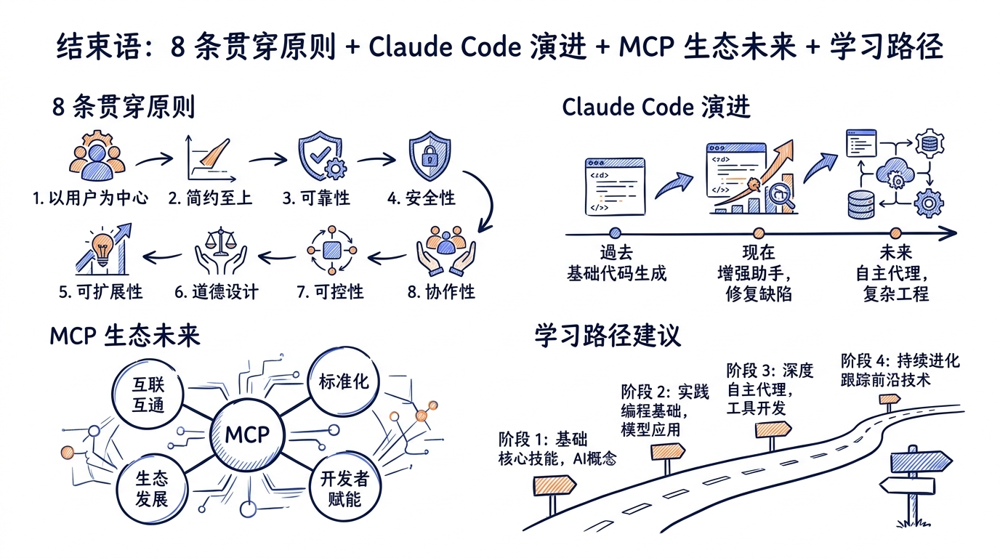
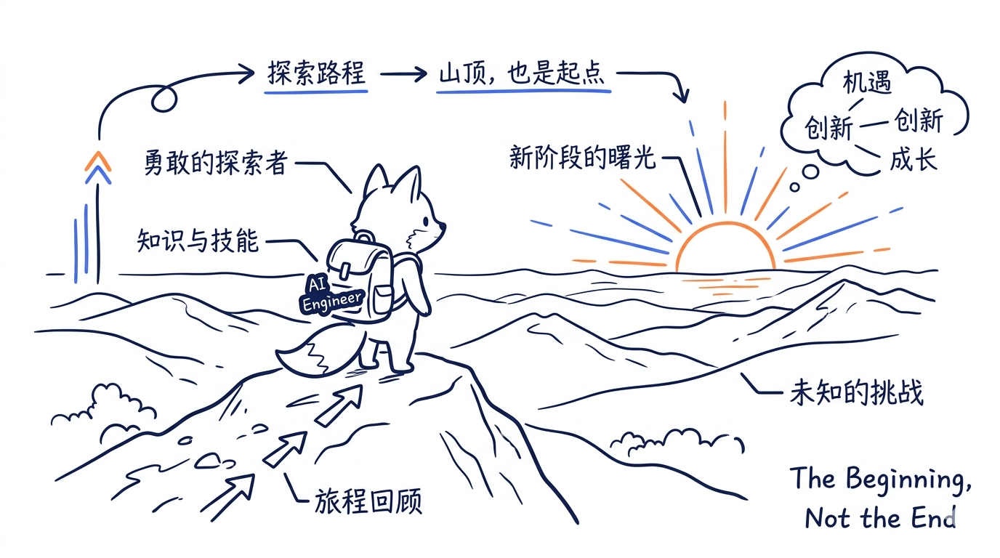
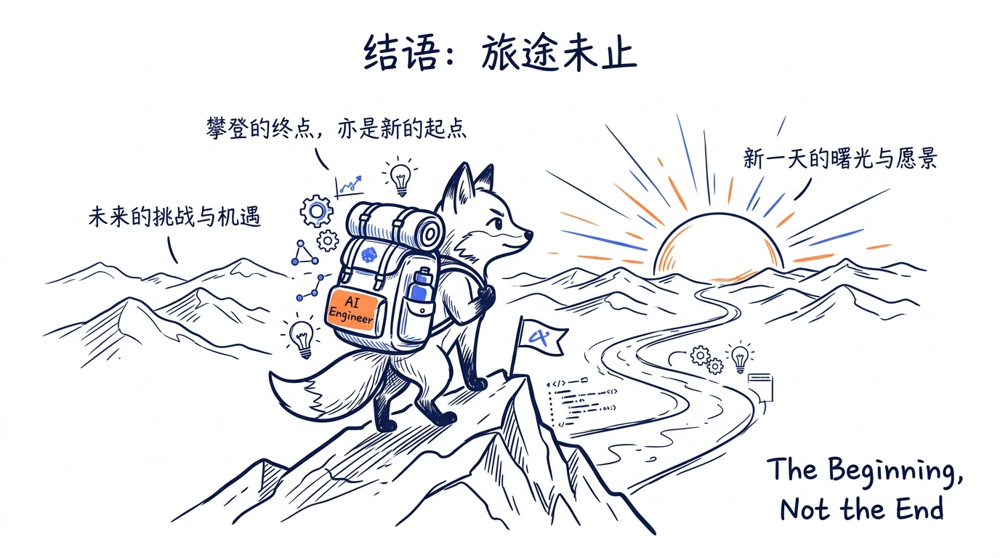

---
layout: default
title: "结束语：回顾与展望"
nav_order: 99
---


# 结束语：回顾与展望



> 走到这里，我们已经把 Claude Code v2.1.88 的源码"翻"过了一遍。从 `cli.tsx` 的第一行到多代理 Coordinator 的最后一行，从 Tool 接口的约 13 个核心字段到 MCP 协议的 5 大原语。这一章，让我们一起站到山顶，回望来路，再眺望前方的路。

---

## 23.1 知识图谱回顾



如果把整个课程压缩成一张图，它会是这样的：

```
                          AI 编程代理（Claude Code）
                                     │
         ┌───────────┬──────────┬────┴────┬──────────┬──────────┐
         │           │          │         │          │          │
       架构        工具       上下文      权限        扩展      多代理
       启动        系统       记忆        安全        生态
         │           │          │         │          │          │
   ┌─────┤    ┌──────┤    ┌────┤    ┌────┤    ┌────┤    ┌────┤
   │ Ch01│    │ Ch04 │    │ Ch07│    │Ch10│    │Ch12│    │Ch15│
   │ 全景│    │ Tool │    │ 三层│    │权限│    │MCP │    │UI  │
   │     │    │ 抽象 │    │ 上下│    │5+2 │    │协议│    │Vim │
   ├─────┤    ├──────┤    │ 文  │    │模式│    │    │    │    │
   │ Ch02│    │ Ch05 │    ├─────┤    ├────┤    ├────┤    ├────┤
   │ CLI │    │ 核心 │    │ Ch08│    │Ch11│    │Ch13│    │Ch16│
   │ 启动│    │ 工具 │    │ 压缩│    │27个│    │Skill│    │多代│
   │     │    │      │    │ 四  │    │Hook│    │Plug-│    │理  │
   ├─────┤    ├──────┤    │ 策略│    │事件│    │ in  │    │    │
   │ Ch03│    │ Ch06 │    ├─────┤    └────┘    ├────┤    └────┘
   │Agent│    │ 流式 │    │ Ch09│              │Ch14│
   │主循 │    │ 执行 │    │ 记忆│              │UI  │
   │ 环  │    │      │    │ 系统│              │状态│
   └─────┘    └──────┘    └─────┘              └────┘

                          实战项目层
         ┌─────────────────┬─────────────────┬─────────────────┐
         │   项目一 Ch20    │   项目二 Ch21    │   项目三 Ch22    │
         │   MiniAgent     │   MCP Server    │   多代理协作     │
         │   单代理 CLI     │   生态扩展      │   Coordinator   │
         └─────────────────┴─────────────────┴─────────────────┘
```

### 关键概念串联

如果让你用一段话向外行人解释 Claude Code 是怎么工作的，最简洁的版本是：

> 用户敲下回车后，Claude Code 把**用户消息 + System Prompt + CLAUDE.md + 历史对话**打包发给 Claude API。Claude 返回的可能是文字（直接显示）或工具调用。如果是工具调用，Claude Code 在**权限系统**和 **Hook 系统**的双重检查下执行该工具，把结果再次打包发回 Claude。这个 `用户输入 → API 调用 → 工具执行 → 结果反馈` 的循环不断运行，直到 Claude 说 `end_turn`。期间 **AsyncGenerator 流式管道**让用户看到逐字输出，**StreamingToolExecutor** 把可并行的工具并发跑，**自动压缩**让长会话不会爆窗口，**MCP 协议**把外部世界接入这个循环，**多代理系统**让一个会话能调度多个并发的 Claude 实例。

这一段话里出现的每个加粗概念，都对应本课程的至少一章。

---

## 23.2 八条贯穿始终的设计原则

学完一个大型工程，比记住具体 API 更重要的是提炼**反复出现的设计原则**。这些原则可以迁移到你自己设计的任何 AI 系统。

### 原则一：流式优先（Streaming First）

从 `query()` 用 AsyncGenerator 返回结果，到 `StreamingToolExecutor` 流式产出工具结果，再到 SSE/HTTP 流式 MCP 传输——**Claude Code 的几乎每一层都不阻塞、不等待整体完成**。

**给你的启示**：构建 LLM 应用时，能流式就不要批量。一来 UX 更好，二来内存占用低，三来支持中断。

### 原则二：能力分层、契约清晰

`Tool` 接口用约 13 个核心字段明确定义了一个工具应该具备什么。`MCP` 协议用 5 个原语明确定义了 client 和 server 的契约。`AgentDefinition` 明确定义了一个子代理是什么。

**给你的启示**：定义抽象时不要怕字段多。**清晰的契约让上层无需关心实现，让实现可以被独立替换**。

### 原则三：渐进式发布（Feature Flag 驱动）

源码到处是 `if (isEnabled('xxx'))`。新功能不是一次性"上线"，而是先放出 1%、再 10%、再 100%；出问题随时关掉。

**给你的启示**：AI 系统比传统软件更需要灰度——模型行为不可完全预测。Feature Flag 是规模化运维的标配。

### 原则四：Hook 机制——"开放扩展，封闭修改"

27 个 Hook 事件 × 5 种处理器类型，让用户可以**不改源码**就改变 Claude Code 的行为。这是开闭原则（Open/Closed Principle）的极致实践。

**给你的启示**：设计平台型工具时，**先想"哪里要让用户能扩展"**，然后预留 Hook 点。事后再加成本极高。

### 原则五：权限优先（Security by Design）

不是先做功能再补权限，而是**每个工具天生带 `checkPermissions()` 方法**。五模式 + 三处理器 + 多路竞赛，权限不是"贴上去的安全帽"，而是骨架的一部分。

**给你的启示**：AI 代理能执行代码、能联网、能改文件——权限不是 nice-to-have，是 must-have。出问题不可逆。

### 原则六：上下文是稀缺资源

200K token 听起来很多，但加载几个大文件 + 跑几次 Bash 就没了。Claude Code 用四种压缩策略 + 智能记忆系统，让上下文这个稀缺资源被精打细算地使用。

**给你的启示**：不要假设用户会"刚好用完上下文窗口就退出"。**长会话是常态，压缩是必修课**。

### 原则七：一切皆 Tool

Bash、FileEdit、WebSearch 是工具。Agent（启动子代理）也是工具。SendMessage（多代理通信）也是工具。Skill 调用、ToolSearch、TaskCreate——**全都被建模成工具**。

**给你的启示**：让 LLM 调度自己的扩展机制，比让代码调度更灵活——LLM 可以根据上下文决定什么时候调用什么。

### 原则八：MCP——开放协议优于封闭集成

Anthropic 没把 Claude Code 做成"自己生态自己玩"。MCP 是公开规范，10+ 语言有官方 SDK，竞品（ChatGPT、Cursor、VS Code Copilot）也支持。**生态比独占更有长期价值**。

**给你的启示**：要做平台，先做协议；要做协议，先发规范。

---

## 23.3 Claude Code 的演进趋势

学完 v2.1.88 不是终点。Anthropic 仍在持续迭代，下面是几个值得跟进的方向。

### 趋势一：Agent Teams 走向稳定

目前还在 `CLAUDE_CODE_EXPERIMENTAL_AGENT_TEAMS=1` 的实验性开关后面。一旦稳定，多个 Claude 实例像团队成员一样协作（信箱通信、共享任务列表、tmux 分屏）会成为默认能力。

**关注信号**：`utils/swarm/` 目录的迭代频率，README 里关于 Teams 的描述何时去掉 "experimental"。

### 趋势二：Routines（云端定时代理）

不再依赖 `/loop` 在本地循环——Routines 让你可以在 Anthropic 云上注册"每周一早上 9 点跑这个 prompt"或"GitHub PR 创建时触发这个流程"。

**关注信号**：`schedule` skill、`anthropic-skills:schedule`、官网 docs 关于 Routines 的页面。

### 趋势三：Remote Control & Channels

手机/任何浏览器都能继续本地终端的会话（Remote Control）。Slack/Telegram/Discord/iMessage 直接发消息进 Claude（Channels）。**Claude Code 不再是"必须坐在终端前"的工具**。

**关注信号**：`remote/` 目录、`services/mcp/channelPermissions.ts`、`tools/RemoteTriggerTool/`。

### 趋势四：Desktop App + 多会话并行

视觉化 diff review、并排多会话、调度面板——Desktop App 把 CLI 不擅长的"多窗口管理"补上。Teleport（Web → Terminal）和 Dispatch（Phone → Desktop）打通跨设备工作流。

**关注信号**：Anthropic 官网的 Desktop 下载页面、社交媒体上 Anthropic 团队的演示视频。

### 趋势五：Adaptive Thinking 取代 Extended Thinking

Opus 4.7 和 Sonnet 4.6 引入 Adaptive Thinking——模型自己决定何时深入思考，而不是用户显式开关。Claude Code 的 prompt 工程会逐步适配这种"模型自驱"思考模式。

**关注信号**：API docs 里 thinking 字段的演化、`AgentDefinition` 中 `thinking` 选项的默认值变化。

---

## 23.4 MCP 生态的未来

MCP 是 AI 工程领域近一年来最重要的"基础设施级"事件。它的发展节奏值得每个 AI 工程师跟进。

### MCP Tasks 原语稳定

目前 MCP 规范中的 Tasks 还是 Experimental，用于"长时间运行的任务（数小时到数天）"。一旦稳定，CI/CD、数据 ETL、长文档生成都能用 MCP 自然表达。

### 10+ 语言官方 SDK

Tier 1（TypeScript/Python/C#/Go）、Tier 2（Java/Rust）、Tier 3（Swift/Ruby/PHP）、规划中（Kotlin）。**任何语言写的工具都能被 AI 调用**这件事，本身就是革命性的。

### 跨厂商兼容性提升

Cursor、ChatGPT、VS Code Copilot、Cline、Cody 都已支持 MCP。一个 MCP Server 可以一次开发，多处使用。

**给你的启示**：你写的 MCP Server，**不是为 Claude 写的，是为整个 AI 生态写的**——这是最大的杠杆点。

### MCP Registry 中央化

`api.anthropic.com/mcp-registry/v0/servers` 是 Anthropic 维护的官方注册中心。社区也有 `mcp.so`、`smithery.ai` 等第三方注册中心。**MCP 的"npm/pypi 时刻"正在到来**。

---

## 23.5 进一步学习路径

完成本课程后，下一步可以走哪？以下是几条推荐路径，选适合自己的就好。

### 路径一：贡献 MCP Server 到官方注册中心

最直接的成果输出：把项目二的"项目分析器"扩展成生产级 MCP Server，发布到 npm，提交到 MCP Registry。

**学习收益**：
- 真实用户的 issue 让你看到自己的盲区
- 加入 MCP 生态贡献者社区
- 简历上的高质量项目

**起点**：[官方 MCP Server 模板](https://github.com/modelcontextprotocol)

### 路径二：基于 Agent SDK 构建生产级应用

把项目三的多代理系统，升级为某个垂直场景的产品：
- 自动化代码审查 SaaS
- AI 文档生成与维护工具
- 自动化测试生成代理
- 数据科学 EDA 助手

**学习收益**：
- 把"会写 Demo"变成"会做产品"
- 学习生产级运维：监控、限流、计费、错误恢复

**起点**：[claude-agent-sdk-demos](https://github.com/anthropics/claude-agent-sdk-demos)

### 路径三：探索 Routines（云端定时代理）

把"本地手动触发"的工具升级为"事件驱动 + 定时调度"的自治系统：
- 每周一自动开 cleanup PR
- 监控某个开源仓库的新 issue 并初步分类
- 每日生成产品周报

**学习收益**：
- 学习云端 agent 与本地 agent 的差异
- 理解 schedule、event、cron 在 AI agent 中的角色

**起点**：`anthropic-skills:schedule` skill、Anthropic Routines 官方文档

### 路径四：贡献回 Claude Code 本身

Claude Code 接收社区贡献——bug 报告、feature request、文档改进。

**学习收益**：
- 直接和 Anthropic 工程师交流
- 看到自己的代码进入数百万开发者的工具

**起点**：[GitHub Issues](https://github.com/anthropics/claude-code/issues)（如果开放）、Discord 社区

### 路径五：研究 + 写作

把课程中你觉得有价值的部分，用自己的语言写成文章/视频。教是最好的学。

**话题示例**：
- 《为什么 AI 编程代理都选 React/Ink？》
- 《MCP 协议设计精读：一个跨厂商标准是怎么诞生的》
- 《拆解 Claude Code 的四种上下文压缩策略》

**学习收益**：被迫深入理解、积累影响力、连接更多同好

---

## 23.6 社区资源与参考链接

### 官方资源

- **Claude Code 文档**：https://code.claude.com/docs
- **Claude Agent SDK Python**：https://github.com/anthropics/claude-agent-sdk-python
- **Claude Agent SDK TypeScript**：https://github.com/anthropics/claude-agent-sdk-typescript
- **Agent SDK Demos**：https://github.com/anthropics/claude-agent-sdk-demos
- **Agent SDK Workshop**：https://github.com/anthropics/agent-sdk-workshop
- **Anthropic API Docs**：https://docs.anthropic.com

### MCP 生态

- **MCP 规范**：https://modelcontextprotocol.io
- **MCP GitHub**：https://github.com/modelcontextprotocol
- **MCP TypeScript SDK**：https://github.com/modelcontextprotocol/typescript-sdk
- **MCP Python SDK**：https://github.com/modelcontextprotocol/python-sdk
- **第三方 Registry**：https://mcp.so、https://smithery.ai

### 相关工具与对比

- **Cursor**：https://cursor.sh
- **GitHub Copilot Workspace**：https://githubnext.com/projects/copilot-workspace
- **OpenHands**：https://github.com/All-Hands-AI/OpenHands
- **Devin**：https://www.cognition-labs.com/devin

### 持续学习的频道

- **Anthropic 官方博客**：每个新版本的 Release Notes 都值得读一遍
- **MCP Discord** / **Anthropic Discord**：实时讨论、官方人员答疑
- **Hacker News**：Claude Code 相关讨论的高质量入口
- **arxiv.org**：AI 代理领域的学术论文（搜索 "tool use"、"AI agent"、"LLM autonomy"）

---

## 23.7 结语：你已经准备好了

回到最开始那个问题：**学完这门课你能做什么？**

- 你能看懂 Claude Code 这种规模的 AI 编程代理的全部源码
- 你能独立构建一个功能完备的 AI 代理（项目一已经验证了）
- 你能开发自定义 MCP Server 接入整个 AI 生态（项目二）
- 你能搭建多代理协作系统处理复杂任务（项目三）
- 你能在产品中合理集成 Claude Agent SDK
- 你能跟上 AI 编程代理这个快速演进领域的所有重要变化

但更重要的是——**你已经具备了"自己读源码、自己定方案"的能力**。

下一个新框架、下一个新协议、下一个 Anthropic 的实验性 feature 出来时，你不会再感到陌生或慌张。因为你知道：所有的 AI 代理系统，本质上都是 `while(true) { call_api → execute_tools → check_done }` 这个循环加上各种为了让它在真实世界里工作得更好的工程化包装。

把这个循环理解透了，剩下的都是变奏。

---

> 写代码、读代码、改代码、再读代码——这是技术人最朴素也最有效的成长路径。
>
> Claude Code 这本"教科书"现在只是你的入门读物。真正的精进，来自你接下来要写的每一行代码。
>
> 祝你接下来的每一段 AI 工程之旅，都比上一段更有收获。



---

## 23.8 v2.0 重构说明（写给读者）

本课程经历过一次大幅重构（v2.0，2026-04-30）：
- 章节数从 19 → 22（+ 开篇 + 结束语 = 24 单元）
- 新增 3 章：Ch14 Plugins+Commands、Ch18 SDK、Ch19 Bridge+Remote
- 配图从 77 个占位 → ~270 张统一 hand-drawn-blue 风格 infographic
- 全书数字与 v2.1.88 源码 1:1 校对，详见 `docs/canonical-numbers.md`
- 新增覆盖：Vim、Keybindings、Companion Sprite、cost-tracker、tokenBudget、bridge/、voice/

完整重构 spec：`docs/superpowers/specs/2026-04-30-course-restructure-design.md`。

---

**致谢**：感谢你完整学完了这门课。如果它对你有用，请把它推荐给身边的同事和朋友。如果你发现了课程中的错误或可以改进的地方，欢迎到课程仓库提 issue 或 PR。

**课程仓库**：https://github.com/jiji262/build-code-agent

—— 课程作者 jiji262

## 思考题

学完整门课后，你打算第一个动手做的项目是什么？

欢迎在评论区聊聊你的想法。

