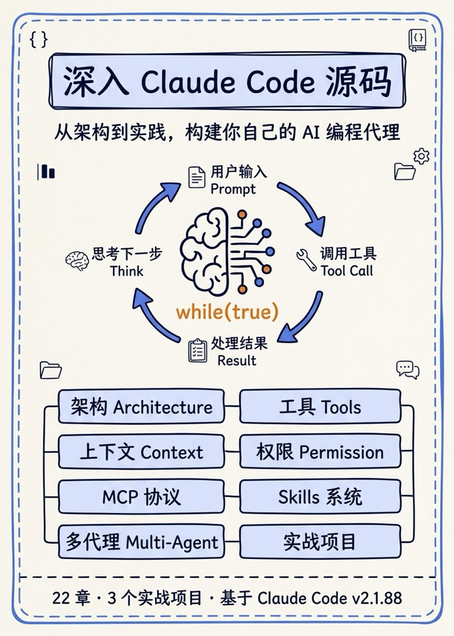
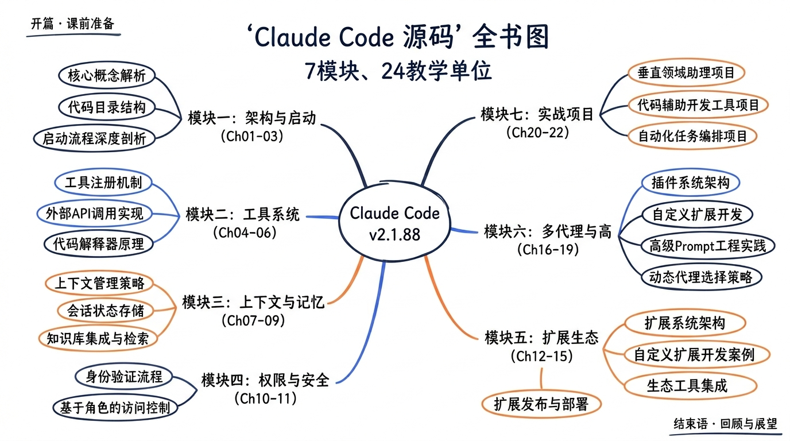

---
layout: default
title: 首页
nav_order: 1
description: "深入 Claude Code 源码：从架构到实践，构建你自己的 AI 编程代理"
---
# 深入 Claude Code 源码：从架构到实践，构建你自己的 AI 编程代理

> 一门面向开发者的系统课程，通过逐层剖析 Claude Code v2.1.88 的真实源码，系统掌握 AI 编程代理的工程实现，并通过三个完整可落地的实战项目把所学应用起来。

> [!NOTE]
> 本项目现已升级并发布为[掘金小册](https://juejin.cn/book/7657050404161355803)。小册在本项目基础上进行了重新编排与完善，内容与仓库版本并非完全一致，可作为进阶与补充材料参考阅读。

---

## 这门课讲什么？

Claude Code 是 Anthropic 推出的旗舰级 AI 编程代理——它不只是聊天机器人，而是一个能读文件、写代码、执行命令、调度多个子代理协作的**完整工程系统**。

本课程通过 **7 大模块、22 个核心章节、3 个实战项目**，带你完整掌握：

- **AI 代理的核心引擎**：Agent 循环、AsyncGenerator 流式架构、StreamingToolExecutor 并发执行
- **工具系统的全貌**：40 个内置工具、Tool 接口的核心字段、buildTool 工厂模式
- **上下文与记忆**：三层上下文模型、四种压缩策略、SessionMemory 跨会话记忆、DreamTask、Cost Tracking
- **权限与安全**：5+2 权限模式、3 种处理器、27 个 Hook 事件、Hook 基础设施全解
- **MCP 协议生态**：8 种传输类型、5 大原语、OAuth 与 XAA 认证、官方注册中心
- **Skills / Plugins / Commands**：6 种 Skill 来源、17 个 bundled skill、86 个 Slash Commands
- **多代理协作**：7 种 Task、Swarm 系统、Coordinator 模式、Agent Teams
- **Claude Agent SDK**：双接口模式、装饰器工具注册、V2 Session API、EntryPoints
- **Bridge & Remote**：claude.ai/code Web 后端、SSH、Teleport、Voice、Direct Connect

每章都有**真实源码引用 + 文件路径行号**、**hand-drawn-blue 风格 infographic**、**动手练习**、**源码对照表**。

---

## 完整课程目录（24 个教学单元）

### 开篇

| 章节 | 标题 | 核心内容 |
|------|------|---------|
| [开篇](./00-preparation.md) | **课前准备——环境搭建与源码导览** | 获取源码、53 个顶层条目导览、阅读方法论、学习路径 |

### 模块一：架构与启动

| 章节 | 标题 | 核心内容 |
|------|------|---------|
| [Ch01](./01-architecture-overview.md) | **AI 编程代理全景图** | 范式对比、设计哲学、七大子系统架构 |
| [Ch02](./02-cli-bootstrap.md) | **CLI 启动流程：从命令行到 REPL** | Commander.js、四阶段初始化、多环境适配、86 命令引用 |
| [Ch03](./03-agent-loop.md) | **Agent 主循环：query() 的 while(true)** | QueryEngine、AsyncGenerator 管道、终止条件、错误恢复 |

### 模块二：工具系统

| 章节 | 标题 | 核心内容 |
|------|------|---------|
| [Ch04](./04-tool-abstraction.md) | **Tool 抽象与注册机制** | Tool 接口核心字段、ToolUseContext、40 工具分类 |
| [Ch05](./05-core-tools.md) | **核心工具深度剖析** | BashTool、FileEditTool、AgentTool、Grep/Glob、WebFetch |
| [Ch06](./06-streaming-executor.md) | **流式执行引擎：StreamingToolExecutor** | 并发安全、串行/并行分区、AbortController 传播 |

### 模块三：上下文与记忆

| 章节 | 标题 | 核心内容 |
|------|------|---------|
| [Ch07](./07-conversation-context.md) | **对话上下文三层架构** | System Prompt 组装、CLAUDE.md 五级加载、AGENTS.md 兼容 |
| [Ch08](./08-context-compression.md) | **上下文压缩四策略** | autoCompact / microCompact / apiMicrocompact / sessionMemoryCompact + Cost Tracking + Token Budget |
| [Ch09](./09-memory-system.md) | **记忆系统与智能文档** | SessionMemory、MagicDocs、AgentSummary、DreamTask |

### 模块四：权限与安全

| 章节 | 标题 | 核心内容 |
|------|------|---------|
| [Ch10](./10-permission-system.md) | **权限系统：5 模式 + 多路竞赛** | useCanUseTool、3 种处理器、createResolveOnce、通道权限 |
| [Ch11](./11-hooks-system.md) | **Hooks 系统：27 事件 × 5 处理器** | command/http/mcp_tool/prompt/agent、Hook 基础设施 |

### 模块五：扩展生态

| 章节 | 标题 | 核心内容 |
|------|------|---------|
| [Ch12](./12-mcp-protocol.md) | **MCP 协议全解：传输层 → 五大原语 → OAuth** | 8 种传输、Tools/Resources/Prompts/Sampling/Elicitation、PKCE、XAA |
| [Ch13](./13-skills.md) | **Skills 系统全解（17 bundled skills）** | 6 种 Skill 来源、SkillTool、ToolSearch 延迟加载、Compaction 存活 |
| [Ch14](./14-plugins-and-commands.md) | **Plugins 与 Slash Commands（86 个命令）** | Plugin 生命周期、86 命令分类目录、Output Styles |
| [Ch15](./15-terminal-ui-and-input.md) | **终端 UI 与输入交互** | Ink + Vim + Keybindings + Companion Sprite + Output Styles |

### 模块六：多代理与高级特性

| 章节 | 标题 | 核心内容 |
|------|------|---------|
| [Ch16](./16-multi-agent.md) | **多代理系统：7 种 Task / Swarm / Coordinator** | 14 个 Swarm 文件、Coordinator 6 段架构、Agent Teams |
| [Ch17](./17-feature-flags-analytics-cost.md) | **Feature Flags、Analytics、Cost Tracking** | GrowthBook、Analytics 管线、cost-tracker、tokenBudget |
| [Ch18](./18-claude-agent-sdk.md) | **Claude Agent SDK：双接口 / 装饰器 / V2 API** | query 函数式、ClaudeSDKClient、SDKMessage、EntryPoints、LSP 集成 |
| [Ch19](./19-bridge-and-remote.md) | **Bridge & Remote — 跨设备协作** | claude.ai/code Web 后端、Remote Session、SSH、Teleport、Voice、Direct Connect |

### 模块七：实战项目

| 章节 | 标题 | 核心内容 |
|------|------|---------|
| [Ch20](./20-project-miniagent.md) | **项目一：从零构建 MiniAgent** | 800 行 TypeScript：Agent 循环 + 4 工具 + 权限 + 上下文 |
| [Ch21](./21-project-mcp-server.md) | **项目二：开发自定义 MCP Server** | 600 行 TypeScript：3 Tools + 2 Resources + 1 Prompt |
| [Ch22](./22-project-multi-agent.md) | **项目三：构建多代理协作系统** | 1000 行 TypeScript：Coordinator + 3 Workers (Security/Performance/Style) |

### 结束语

| 章节 | 标题 | 核心内容 |
|------|------|---------|
| [结束语](./23-conclusion.md) | **回顾与展望** | 8 条贯穿原则、Claude Code 演进趋势、MCP 生态未来、进一步学习路径 |

---

## 学完能做什么？

完成本课程后，你将具备：

- ✅ 理解 Claude Code 全部核心子系统的设计意图与实现细节
- ✅ 独立构建一个功能完备的 AI 编程代理（含 Tool 注册、权限控制、上下文管理、流式执行）
- ✅ 开发自定义 MCP Server 并接入 Claude Code 生态
- ✅ 搭建多代理协作系统（Coordinator + Worker + Task 调度）
- ✅ 将 Claude Agent SDK 集成到自己的产品/CI/CD 流水线
- ✅ 跟上 AI 编程代理领域的快速演进

---

## 三个实战项目预览

| 项目 | 章节 | 规模 | 难度 | 关键技术 |
|------|------|------|------|---------|
| MiniAgent | Ch20 | ~800 行 TypeScript | ⭐⭐ | Agent 循环、Tool 抽象、上下文管理、权限 |
| 自定义 MCP Server | Ch21 | ~600 行 TypeScript | ⭐⭐⭐ | MCP 协议、Tools/Resources/Prompts、stdio + HTTP |
| 多代理协作系统 | Ch22 | ~1000 行 TypeScript | ⭐⭐⭐⭐ | Coordinator、Worker、Task 调度、SendMessage |

每个项目都提供：完整 `package.json`、`tsconfig.json`、所有源文件、运行命令、测试用例、与 Claude Code 源码的对照表。

---

## 适合谁学？

- 有 TypeScript/Node.js 基础的开发者
- 想理解 Claude Code 内部实现原理的用户
- 正在构建或计划构建自己的 AI 编程代理的工程师
- 对 LLM 应用开发（Tool Calling、Agent Loop、MCP）感兴趣的人
- 想把 Claude Agent SDK 用到生产系统的团队

### 前置要求

- TypeScript 基础（能读懂泛型、async/await、装饰器模式）
- 终端基本操作（npm、git、shell）
- 了解 LLM API 基本概念（prompt、completion、tool_use）
- 不要求 React 经验（涉及时会讲解）

---

## 技术栈

课程涉及的核心技术：

| 依赖 | 用途 |
|------|------|
| `@anthropic-ai/sdk` | Anthropic Claude API |
| `@anthropic-ai/claude-agent-sdk` | Claude Agent SDK |
| `@modelcontextprotocol/sdk` | MCP 协议官方 SDK |
| TypeScript 5.x | 主要语言 |
| React + Ink | 终端 UI |
| commander | CLI 解析 |
| zod | Schema 验证 |
| AsyncGenerator | 流式数据管道核心 |

---

## 源码版本

本课程基于网上流传的 **Claude Code v2.1.88** 源码深度分析，感谢[linux.do 社区](https://linux.do)的信息来源。

权威数字校对见 [`docs/canonical-numbers.md`](./docs/canonical-numbers.md)。

---

## 课程数据

- **章节总数**：24 个教学单元（开篇 + 22 章 + 结束语）
- **正文规模**：40,055 行 Markdown
- **配图数量**：142 张统一 hand-drawn-blue 风格 infographic（4 层级体系：全书级 2 + 模块级 7 + 章节级 24 + 章内级 109）
- **源码引用**：每章都有真实文件路径与行号
- **实战项目**：3 个完整可落地的工程

---

## 许可

本课程内容采用 [CC BY-NC-SA 4.0](https://creativecommons.org/licenses/by-nc-sa/4.0/) 许可协议。
